# Visualizing data with a QL chart

In this scenario, you will create charts using SQL queries. SQL queries enable you to configure data for visualization in a more flexible way than the standard dataset method does. For example, you can add parameters from dashboards to a SQL query.

We recommend using a QL chart if creating a regular chart from a dataset isn't suitable for your situation or if you wish to experiment with the data.

A direct connection to a demo database will be used as your data source.

To visualize and explore data, [set up {{ datalens-short-name }}](#before-you-begin), then follow the steps below:

1. [Create a connection](#create-connection).
1. [Create a QL chart](#create-sql-chart).
1. [Create a dashboard](#create-dashboard).
1. [Add the QL chart to the dashboard](#add-sql-chart-to-dashboard).
1. [Add selectors to the dashboard](#add-selectors-to-dashboard).



SQL queries only work with databases. CSV, GoogleSheets, Yandex Metrica, and other service connections do not support SQL queries.




## Before you start {#before-you-begin}




## Create a connection {#create-connection}



## Create a QL chart {#create-sql-chart}

1. Go to an existing database connection.
1. Make sure **Raw SQL level** → **Allow subqueries in datasets and queries from charts** is enabled.
1. In the top right-hand corner, click **Create QL chart**.
1. On the **Query** tab, enter the query code:

   ```sql
   SELECT
      toDate(t1.OrderDatetime) as "Date",
      COUNT(t1.ClientID) as "Number of new customers", t3.ClientStatus as "Status"
   FROM
      samples.MS_SalesFacts t1,
      (SELECT
   	      ClientID,
         MIN(OrderDatetime) as FirstDate
      FROM samples.MS_SalesFacts
      GROUP BY ClientID) as t2,
         samples.MS_Clients t3
   WHERE not_var{{interval_from}} < "Date" and "Date" < not_var{{interval_to}} and t1.ClientID=t2.ClientID and t3.ClientID=t2.ClientID and t3.ClientStatus in not_var{{status}} -- status, interval_from and interval_to - variables associated with parameters affected by selectors
   GROUP BY "Status", "Date"
   ORDER BY "Date"
   ```

1. On the **Params** tab, click **Add param** and complete the input fields:

   * From the drop-down list, select `string` (default).
   * In the **Name** field, enter `status`.
   * In the **Default value** field, enter `Золотой`.
   * Click **Add param value** below and enter `Серебряный`.
   * Click **Add param value** below and enter `Базовый`.

     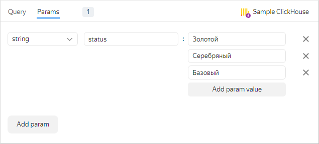

   The added parameter will be associated with the `not_var{{status}}` variable in the query.

1. Click **Add param** and complete the input fields:

   * In the drop-down list, select `date-interval`.
   * In the **Name** field, enter `interval`.
   * Click the field with the interval value and enter:

      * **From:** `2017-03-01`.
      * **To:** `2017-03-31`.

         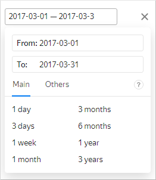

      The **From:** and **To:** values of the added parameter will be bound to the `not_var{{interval_from}}` and the `not_var{{interval_to}}` variables in the SQL query.

      

      You can control the parameter values using dashboard selectors.

      

1. Go back to the **Query** tab. In the lower left-hand corner, click **Run**. Running the query will produce a visualization in the right-hand window.
1. Configure the visualization:

   * Select **Column chart** as chart type.

      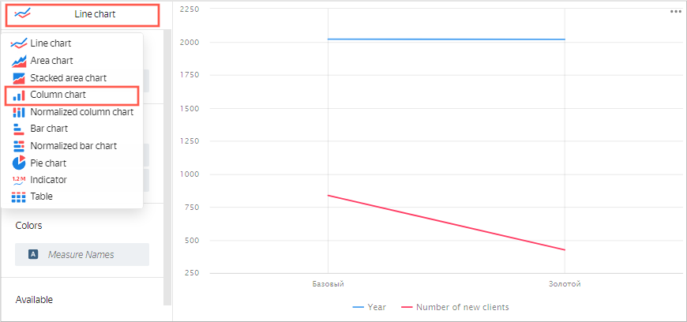

   * Make sure that the **Date** field is in the **X** section.
   * Make sure that the **Number of new clients** field is in the **Y** section.
   * Make sure that the **Status** field is in the **Colors** section.
   * Make sure the **Available** section is empty. This is the section that contains fields not involved in calculations. Otherwise, the visualization will display incorrectly.

      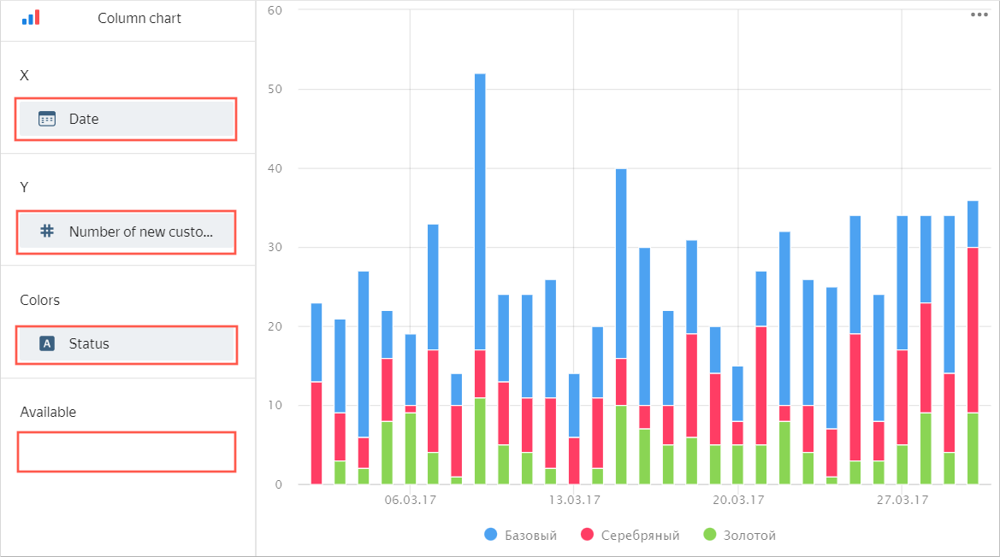

1. In the upper right-hand corner, click **Save**.
1. Enter `New clients` as your chart name and click **Save**.

You can place the chart created on the dashboard. You can also equip the dashboard with selectors to control the values of the QL chart `status` and `interval` parameters.

## Create a dashboard {#create-dashboard}

Create a [dashboard](../../datalens/concepts/dashboard.md) to add these charts to.

1. Go to the {{ datalens-short-name }} [homepage]({{ link-datalens-main }}).

1. Click **Create dashboard**.

   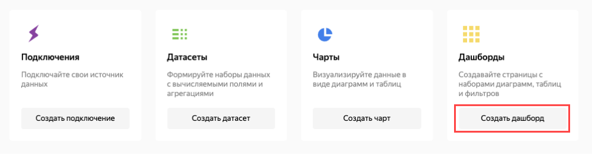

1. Enter `Change in number of clients by year` as the name for the dashboard and click **Create**.

   The dashboard created will open for editing.

## Add the QL chart to the dashboard {#add-sql-chart-to-dashboard}

1. At the top of the page, click **Add** and select **Chart**.

   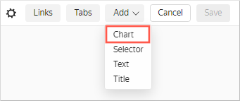

1. In the **Chart** field, click **Select** and select the previously created **New clients** chart from the chart list.

   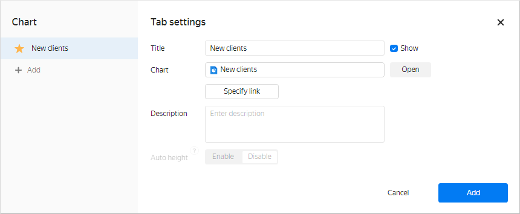

   Click **Add**.

1. The chart is displayed on the dashboard. Stretch it to improve visualization.

   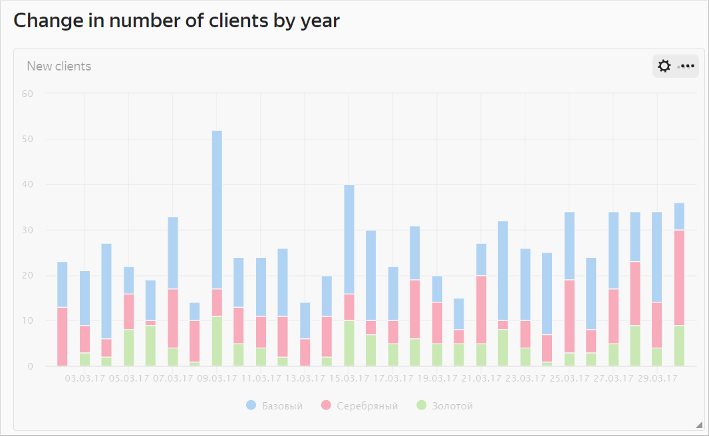

1. Save the dashboard.

## Add selectors to the dashboard {#add-selectors-to-dashboard}

1. Add a [selector](../../datalens/concepts/dashboard.md#selector) to be able to filter the chart by client status:

   1. At the top of the page, click **Add**.
   1. Choose **Selector**.

      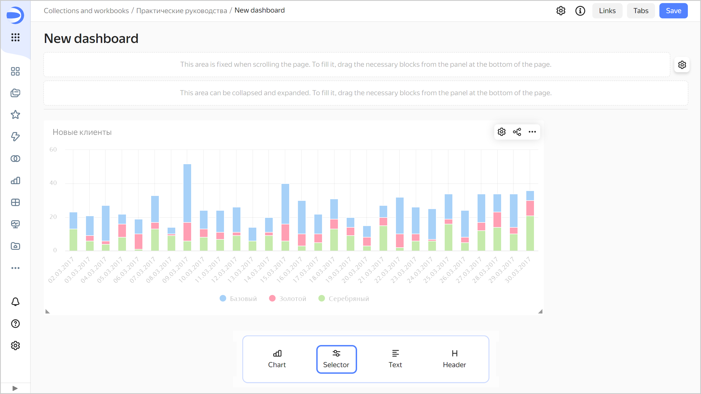

   1. Select **Manual input** as source type.
   1. In the **Field or parameter name** field, enter `status`. Certain selector values will be passed into this SQL query variable.
   1. Choose **List** as your selector type.
   1. Enable the **Multiple choice** option.
   1. Click the input field next to the **Default value** parameter. In the resulting window, add the following values:

      * Золотой
      * Серебряный
      * Базовый

      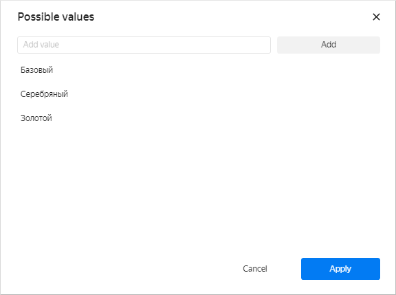

      Click **Apply**.

   1. In the **Default value** list, specify **Select all**.

      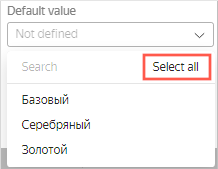

   1. Enable the **Title** option and enter `Select client status`.

   1. Verify the specified selector parameters.

      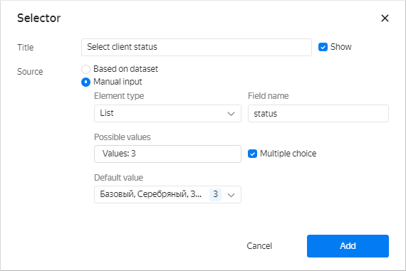

   1. Click **Add**.
   1. Place the selector on the dashboard under the chart.

1. Add another selector to be able to filter the chart based on a date range:

   1. At the top of the page, click **Add**.
   1. Choose **Selector**.
   1. Select **Manual input** as source type.
   1. Under **Field or parameter name**, enter `interval`. The interval start and end values from the selector will be passed into the SQL query `not_var{{interval_from}}` and the `not_var{{interval_to}}` variables.
   1. Choose **Calendar** as your selector type.
   1. Enable **Range**.
   1. Enable the **Title** option and enter `Order interval`.
   1. Verify the specified selector parameters.

      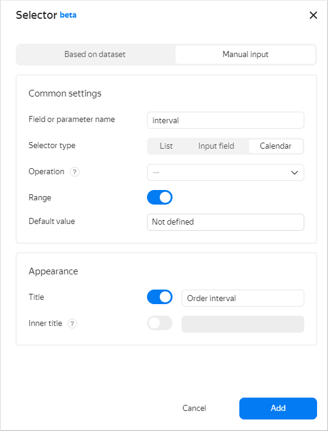

   1. Click **Add**.
   1. Place the selector on the dashboard on top of the chart next to the first selector.
   1. Save the dashboard.

      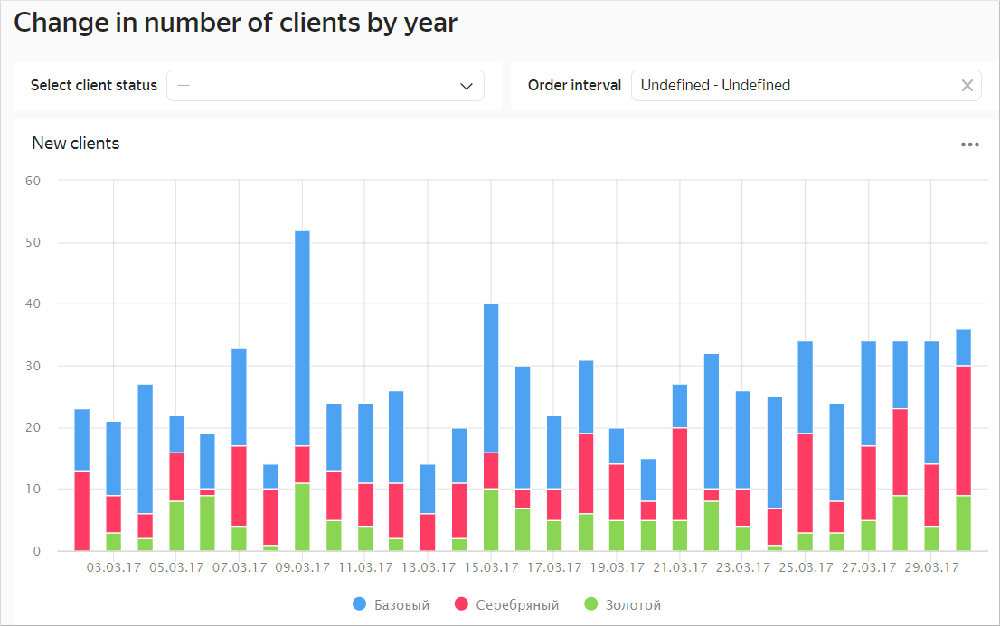

1. Your dashboard is ready. Now you can filter the chart by status using a selector.

   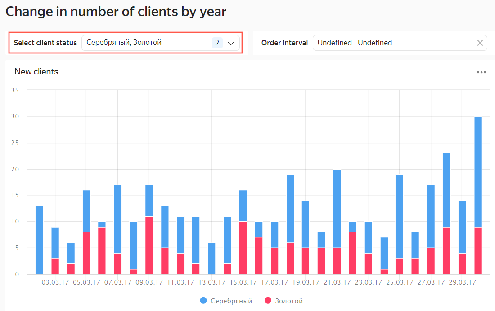

   You can also filter the chart by a date range using the second selector.

   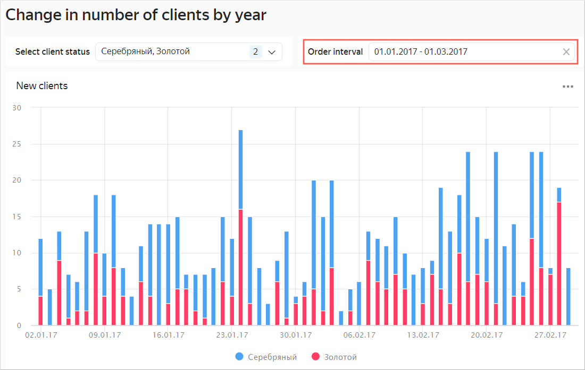

#### For details, see also {#see-also}

- [{#T}](../../datalens/operations/dashboard/add-chart.md)
- [{#T}](../../datalens/operations/dashboard/add-selector.md)
- [{#T}](../../datalens/operations/chart/create-sql-chart.md)
- [QL chart](../../datalens/concepts/chart/index.md#sql-charts)
