# Retail chain's dashboard based on a {{ CH }} DB



In this tutorial, you will set up a dashboard to visualize sales analytics for a Moscow retail chain. This dashboard will present:

* Sales dynamics by day and month.
* Sales by product categories.
* Heat map of orders.

We will use a Moscow retail chain's demo sales {{ CH }} database as our data source.

To visualize and explore data, [set up {{ datalens-short-name }}](#before-you-begin) and follow the steps below:

1. [Create a workbook](#create-workbook).
1. [Create a connection](#create-connection).
1. [Create a dataset](#create-dataset).
1. [Create a line chart](#create-line-chart).
1. [Create a bar chart](#create-column-chart).
1. [Create a pivot table chart](#create-pivot-chart).
1. [Create a heat map](#create-heat-map-chart).
1. [Create a dashboard and add charts to it](#create-dashboard).
1. [Add selectors to the dashboard](#add-selectors).

## Getting started {#before-you-begin}



## Create a workbook {#create-workbook}

1. Go to the {{ datalens-short-name }} [home page]({{ link-datalens-main }}).
1. In the left-hand panel, select  **Collections and workbooks**.
1. In the top-right corner, click **Create** → **Create workbook**.
1. Enter a name for the [workbook](../../datalens/workbooks-collections/index.md): `Tutorials`.
1. Click **Create**.

## Create a connection {#create-connection}

A connection named **Sample ClickHouse** will be created for database access.



## Create a dataset {#create-dataset}

Create a [dataset](../../datalens/dataset/index.md) based on the `Sample ClickHouse` connection:

1. In the top-right corner of the connection page, click **Create dataset**.
1. Drag the `MS_SalesFacts` table to the workspace.

   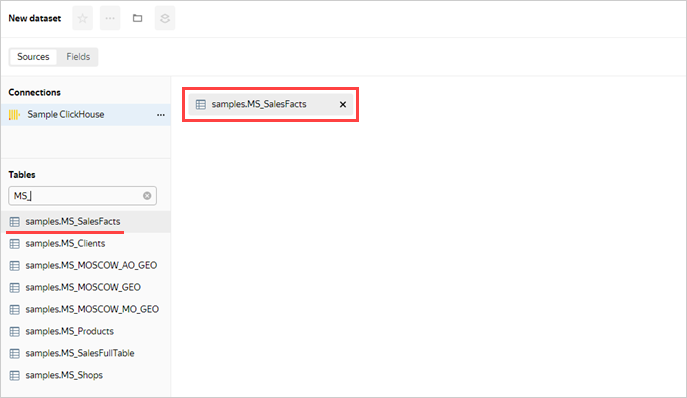

1. Drag the `MS_Clients` table to the workspace. The tables will be linked together automatically.

   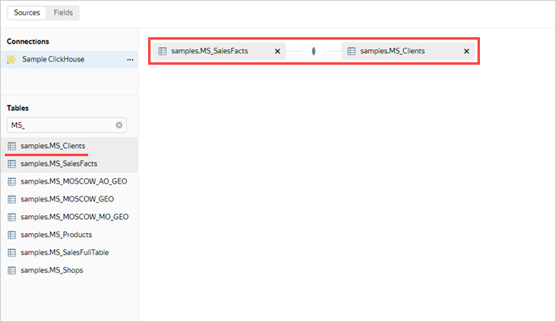

1. To check the link, click the link icon between the tables.

   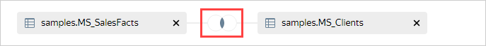

1. The tables are linked by the `ClientID` field. If needed, you can modify or expand the link by specifying another pair of fields. To close the link settings window, click  or anywhere outside the window.

   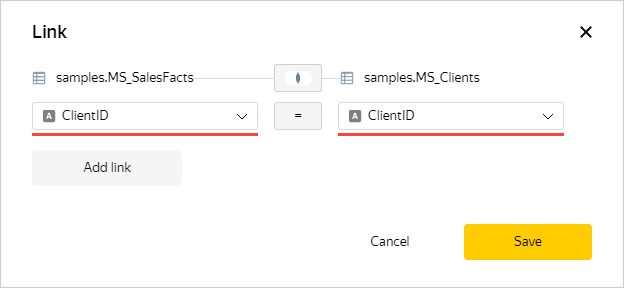

1. Drag the `MS_Products` table to the workspace. The table will automatically link with the left (root) table `MS_SalesFacts`.

   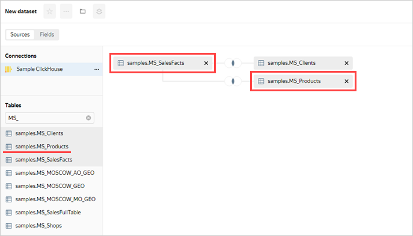

1. Drag the `MS_Shops` table to the workspace. The table will automatically link with the left (root) table `MS_SalesFacts`.

   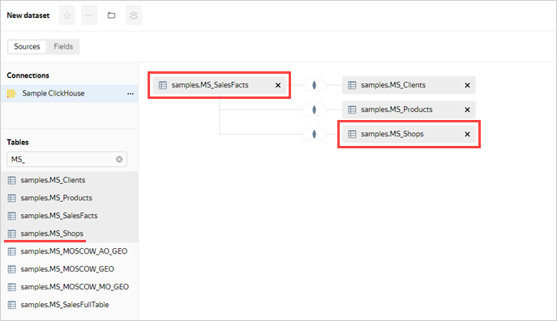

1. Navigate to the **Fields** tab.
1. Delete the duplicate fields left over from joining the tables: `ClientID (1)`, `ProductID (1)`, and `ShopID (1)`. To do this, select them and click  **Delete** in the panel below the list of fields.

   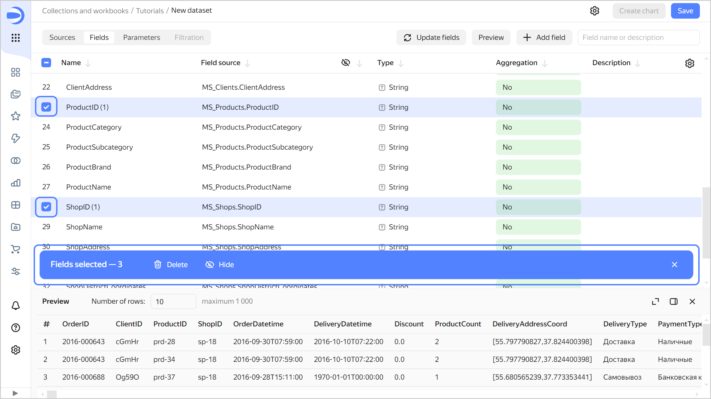

1. Create an order date field named `OrderDate`:

   1. Duplicate the `OrderDatetime` field: on the right side of the row with the field, click  and select **Duplicate**.
   1. Rename the `OrderDatetime (1)` duplicate field as `OrderDate`: click the field name, delete the current name, and enter the new one.
   1. In the **Type** column, change the data type from **Date and time** to **Date**.

   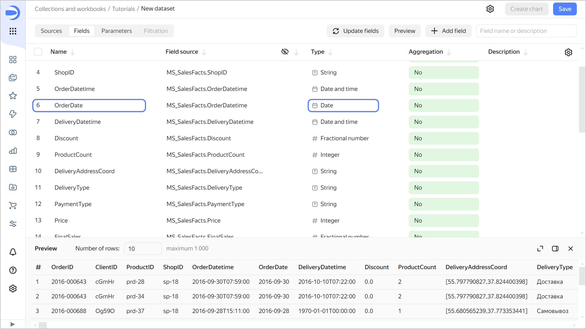

1. Change data types for the fields as follows:

   * `ShopDistrictCoordinates`: Change to **Geopolygon**.
   * `DeliveryDistrictCoordinates`: Change to **Geopolygon**.
   * `DeliveryAddressCoord`: Change to **Geopoint**.

1. Create a measure for the order amount: in the **Aggregation** column, select **Sum** for the `Price` field. The aggregation field will change its color to blue: it is now a measure.

   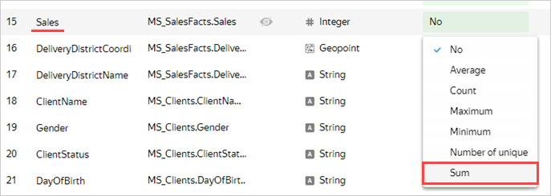

1. Create a measure for the number of orders:

   1. Duplicate the `OrderID` field.
   1. Rename the `OrderID (1)` duplicate field to `OrderCount`.
   1. Change the aggregation type to **Number of unique**.

1. Create a calculated field for the average sales amount per order:

   1. In the top-right corner, click **Add field**.
   1. At the top-left, specify the field name: `Sales per Order`.
   1. In the column to the left, click the `Price` field.
   1. Enter `/`.
   1. In the column to the left, click the `OrderCount` field.
   1. Click **Create**.

   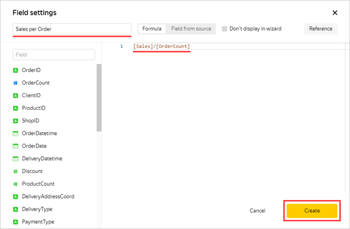

1. Save the dataset:

   1. In the top-right corner, click **Save**.
   1. Enter `Moscow Sales dataset` for the dataset name and click **Create**.

## Create a line chart {#create-line-chart}

To visualize sales dynamics by month, create a [line](../../datalens/visualization-ref/line-chart.md) [chart](../../datalens/concepts/chart/index.md):

1. Click **Create chart** in the top-right corner of the dataset page.
1. For the visualization type, choose **Line chart**.

   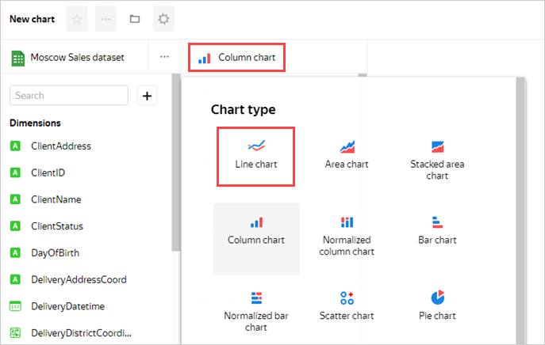

1. Add a sales date to the chart. To do this, drag the `OrderDate` field from **Dimensions** to the **X** section.
1. Add a sales measure to the chart. To do this, drag the `Price` field from **Measures** to the **Y** section.
1. Add a delivery type to the chart. To do this, drag the `PaymentType` field from **Dimensions** to the **Colors** section.

   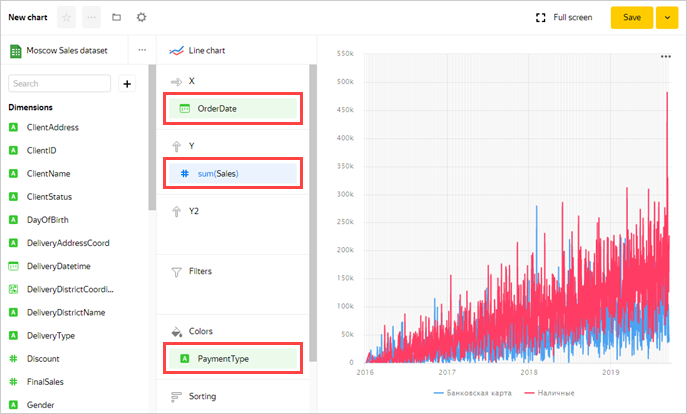

1. Display the chart by month:

   1. Click the calendar icon next to the `OrderDate` field in the **X** section.
   1. In the **Grouping** field, select **Rounding** ⟶ **Month** and click **Apply**.

   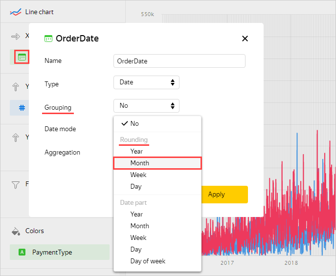

1. Save the chart:

   1. In the top-right corner, click **Save**.
   1. In the window that opens, enter a name for the chart: `Sales dynamics by month and payment type`, and click **Save**.

   

## Create a column chart {#create-column-chart}

To visualize sales by brand and product category, create a [column chart](../../datalens/visualization-ref/column-chart.md).

1. Copy the chart you created in the previous step:

   1. In the top-right corner, click  → **Save as copy**.

      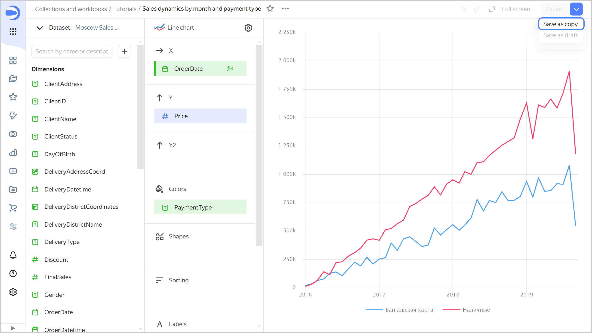

   1. In the window that opens, enter the `Sales by brand and category` name for the new chart and click **Save**.

1. Select **Bar chart** as the visualization type.

   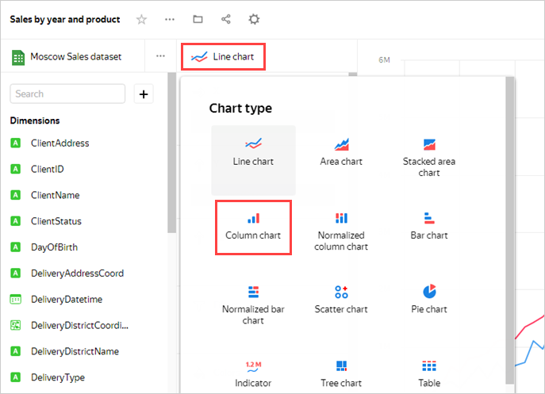

1. The `OrderDate`, `Price`, and `PaymentType` fields are automatically added to the **X**, **Y**, and **Colors** sections, respectively.
1. Replace the months with brands on the X-axis. To do this, drag the `ProductBrand` field from **Dimensions** to the **X** section and hold it over the `OrderDate` field until the latter turns red.
1. Under **Colors**, replace payment types with product categories. To do this, drag the `ProductCategory` field from **Dimensions** to the **Colors** section and hold it over the `PaymentType` field until the latter turns red.
1. Sort the chart in descending order of the sales measure. To do this, drag the `Price` field from **Measures** to the **Sorting** section.
1. Save your chart: click **Save** in the top-right corner.

   

## Create a pivot table chart {#create-pivot-chart}

To visualize sales by product and time, create a [pivot table](../../datalens/visualization-ref/pivot-table-chart.md) chart.

1. Copy the chart you created in the previous step:

   1. In the top-right corner, click  → **Save as copy**.
   1. In the window that opens, enter the name `Sales by year and product` for the new chart, and click **Save**.

1. Choose the **Pivot table** visualization type.

   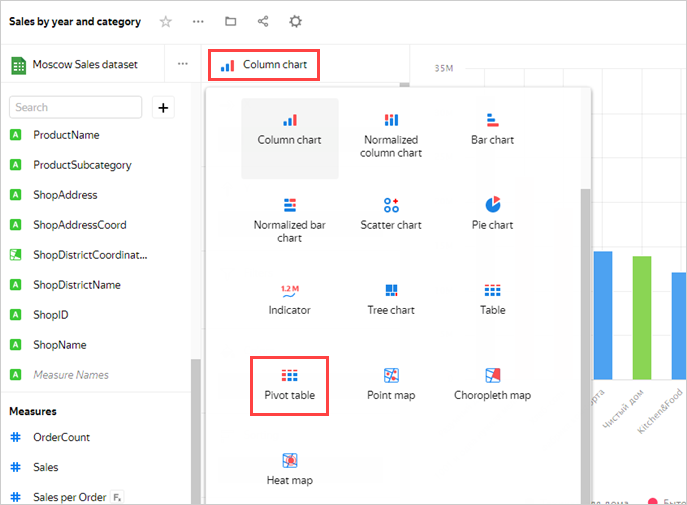

1. The `ProductBrand` and `Price` fields will automatically appear in the **Columns** and **Measures** sections, respectively.
1. Remove `ProductBrand` from the table. To do this, click  (the icon appears when you hover over the field) next to the field in the **Columns** section.
1. Add the order date to the table. To do this, drag the `OrderDate` field from **Dimensions** to the **Columns** section.
1. Change the display format in the `OrderDate` field to years:

   1. Click the calendar icon next to the `OrderDate` field in the **Columns** section.
   1. In the **Grouping** field, choose **Date portion** ⟶ **Year** and click **Apply**.

   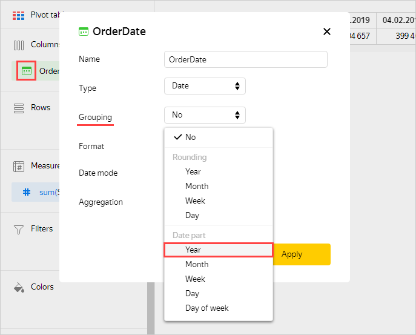

1. Add the product category and subcategory to the table. To do this, drag the `ProductCategory` and `ProductSubcategory` fields from **Dimensions** to the **Rows** section.
1. Change the color of the sales measure in the table. To do this, drag the `Price` field from **Measures** to the **Colors** section.
1. In the top-right corner, click **Save**.

   

## Create a heat map chart {#create-heat-map-chart}

To visualize the density of orders on the map of Moscow, create a [heat map](../../datalens/visualization-ref/heat-map-chart.md) chart.

1. Copy the chart you created in the previous step:

   1. In the top-right corner, click  → **Save as copy**.
   1. In the window that opens, enter the `Sales heat map` name for the new chart and click **Save**.

1. Select the **Map** visualization type.

   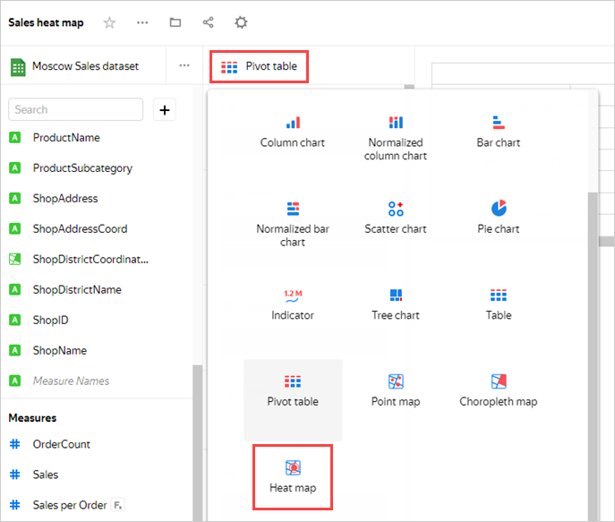

1. Select the **Heat map (Geopoints)** layer type.

   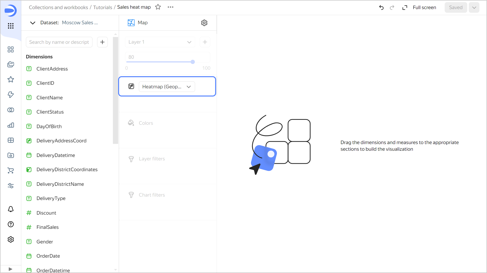

1. Add the delivery point coordinates to the map. To do this, drag the `DeliveryAddressCoord` field from **Dimensions** to the **Heatmap (Geopoints)** section.
1. In the top-right corner, click **Save**.

   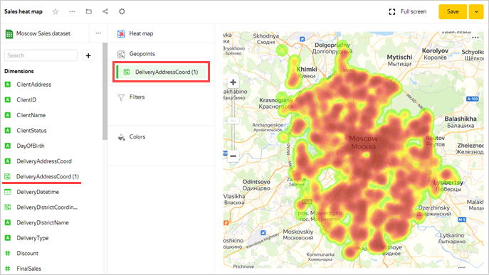

## Create a dashboard and add charts to it {#create-dashboard}

Create a [dashboard](../../datalens/concepts/dashboard.md) to add charts and other widgets to:

1. In the left-hand panel, select  **Collections and workbooks** and go to the `Tutorials` workbook.
1. In the top-right corner, click **Create** →  **Dashboard**.
1. In the panel at the bottom of the page, hold down  **Chart** and drag it to the required area.

   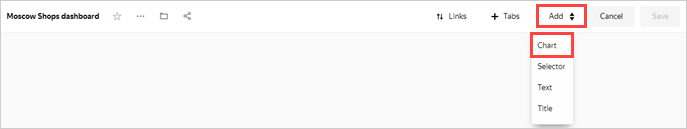

1. In the window that opens, click **Select**.
1. Select the chart `Sales dynamics by month and payment type`.
1. Click **Add**.

   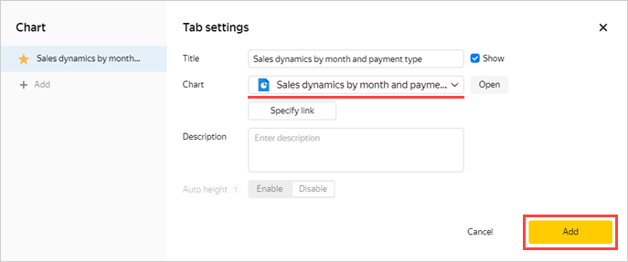

1. Repeat steps 3-6 to add these charts:

   * `Sales by brand and category`
   * `Sales by year and product`
   * `Sales heat map`

1. Adjust the size of the charts with your mouse and place them on the dashboard as you prefer.

   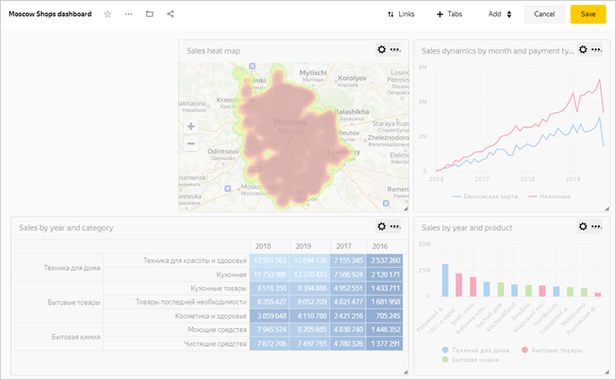

## Add selectors to the dashboard {#add-selectors}

Add [selectors](../../datalens/dashboard/selector.md) to filter your charts by date, Moscow district, product, and customer status:

1. In the panel at the bottom of the page, hold down  **Selector** and drag it to the required area.

   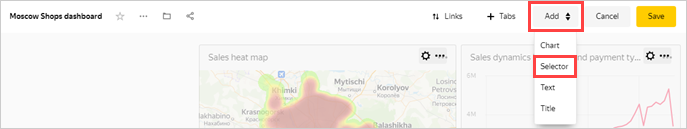

1. Add the calendar selector for the order date:

   1. Select `Moscow Sales dataset`.
   1. Select the `OrderDate` field.
   1. Enable **Range**.
   1. Click **Save**.

   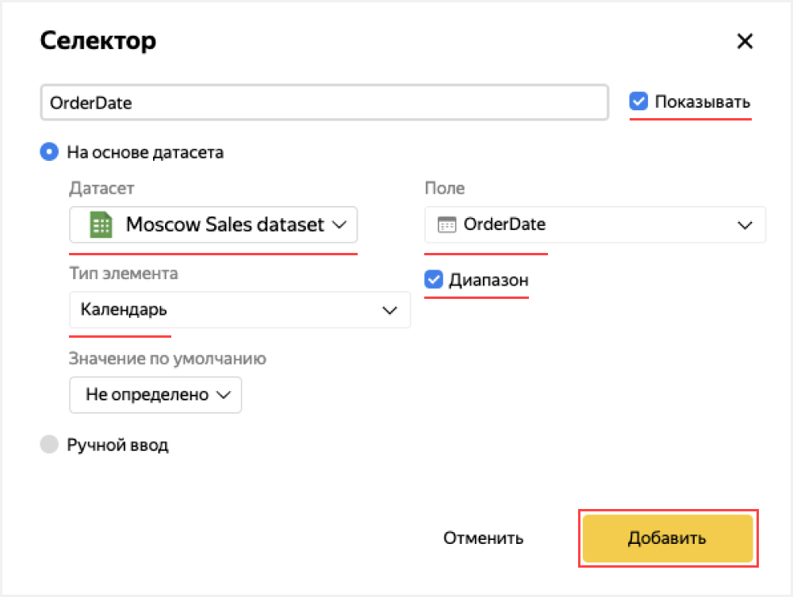

1. Add a product category selector:

   1. Make sure you selected the `Moscow Sales dataset` dataset.
   1. Select the `ProductCategory` field.
   1. Enable **Multiple choice**.
   1. Click **Save**.

1. Similarly, add selectors for the following fields:

   * `ProductBrand`
   * `DeliveryDistrictName`
   * `DeliveryType`
   * `PaymentType`

1. Position the selectors on the dashboard however you like.
1. Save the dashboard:

   1. In the top-right corner of the dashboard, click **Save**.
   1. Enter `Moscow Shops dashboard` for the dashboard name and click **Create**.

Your dashboard is ready.

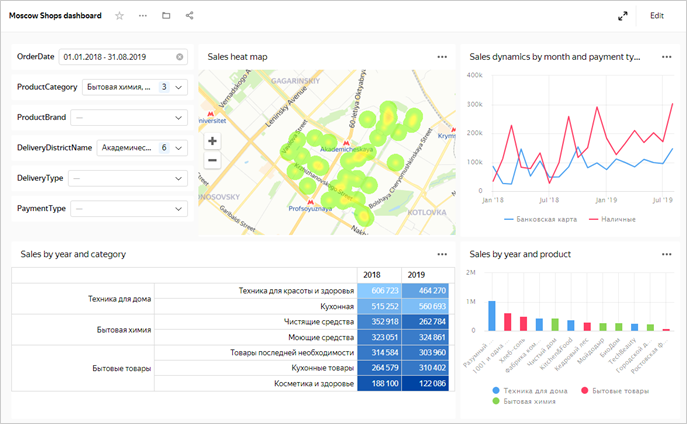

You can now use various filter combinations to see how your sales evolved for different products and cross sections. For example, you can analyze the dynamics of sales with delivery for the `Household goods` and `Home appliances` categories within the `Izmaylovo` delivery area over the period `01.01.2017 - 31.12.2018` and estimate the sales density on the heat map. To do this, set the selectors as follows:

* `OrderDate`: `01.01.2017 - 31.12.2018`
* `ProductCategory`: `Household goods` and `Home appliances`
* `DeliveryDistrictName`: `Izmaylovo`
* `DeliveryType`: `Delivery`

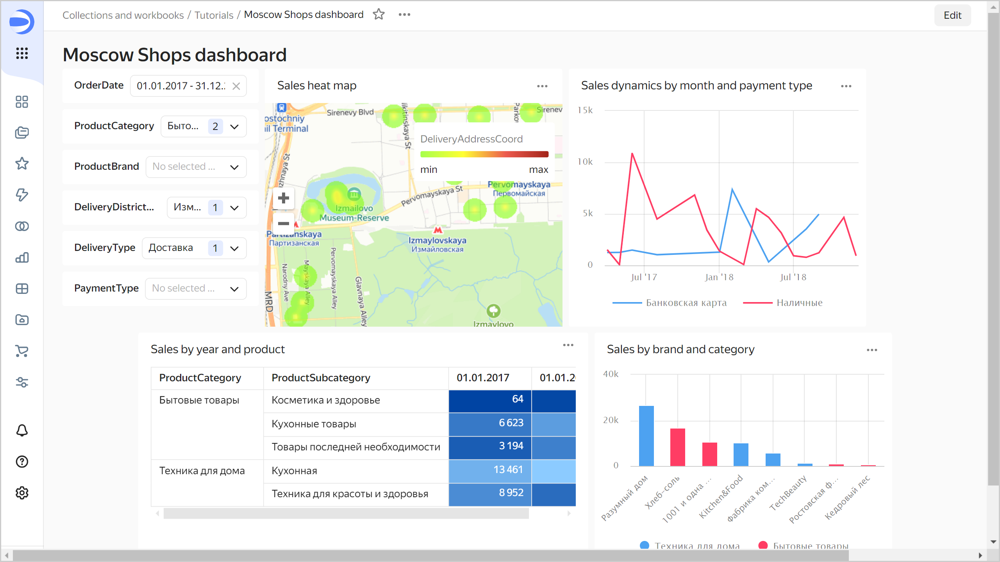
