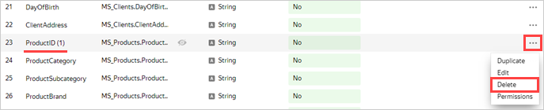
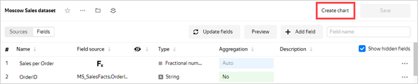
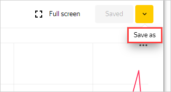
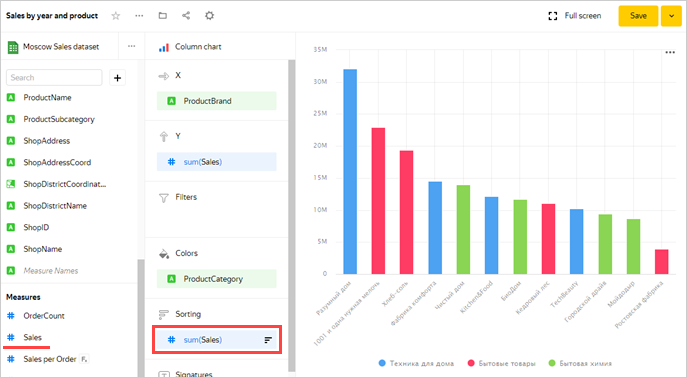
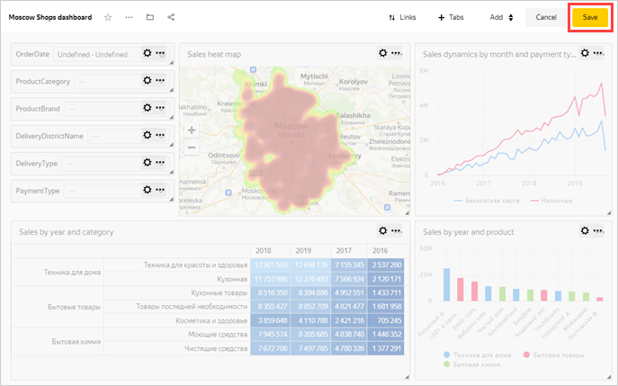

# Analyzing a retail chain's sales performance based on a {{ CH }} database

We will use a demo {{ CH }} database with a Moscow retail chain's sales data as our data source.

In this example, {{ datalens-short-name }} is used to visualize:
* Sales dynamics by day and month.
* Sales by product categories.
* Order heat map.

A connection named **Sample ClickHouse** will be created for database access.

To visualize and explore data, [set up {{ datalens-short-name }}](#before-you-begin) and follow the steps below:

1. [Define the data source for a dataset](#step1).
1. [Configure the dataset fields](#step2).
1. [Create a line chart](#step3).
1. [Create a bar chart](#step4).
1. [Create a pivot table chart](#step5).
1. [Create a heat map](#step6).
1. [Create a dashboard](#step7).
1. [Add charts to the dashboard](#step8).
1. [Add selectors to the dashboard](#step9).

## Getting started {#before-you-begin}



## Step 1. Create a connection and dataset {#step1}



1. In the top-right corner, click **Create dataset**.

## Step 2. Set up the dataset fields {#step2}

1. Drag the **MS_SalesFacts** table to the workspace.

   

1. Drag the **MS_Clients** table to the workspace. The tables are automatically linked.

   

1. To check the link, click the link icon between the tables.

   

1. Tables are linked by the **ClientID** field. If needed, you can modify or expand the link by specifying another pair of fields. To close the link settings window, click the cross button or anywhere outside the window.

   

1. Drag the **MS_Products** table to the workspace. The table is automatically linked to the left (root) table **MS_SalesFacts**.

   

1. Drag the **MS_Shops** table to the workspace. The table is automatically linked to the left (root) table **MS_SalesFacts**.

   

1. Go to the **Fields** tab.

   

1. Delete the duplicate fields left over from joining the tables: **ClientID (1)**, **ProductID (1)**, and **ShopID (1)**.

   

1. Create an order date field named **OrderDate**.

   1. Duplicate the **OrderDatetime** field.

      

   1. Rename the **OrderDatetime (1)** duplicate field to **OrderDate**: click the row name, delete the current name, and enter the new one.

      

   1. Change the data type from **Date and time** to **Date**.

      

1. For the **ShopDistrictCoordinates** field, change the data type to **Geopolygon**.

1. For the **DeliveryDistrictCoordinates** field, change the data type to **Geopolygon**.

1. For the **DeliveryAddressCoord** field, change the data type to **Geopoint**.

1. In the **Aggregation** column, select **Sum** for the **Sales** field.

   

   The aggregation field changes color to blue: **Sales** is now a measure.

   

1. Create a measure for the number of orders.

   1. Duplicate the **OrderID** field.

   1. Rename the **OrderID (1)** duplicate field to **OrderCount**.

   1. Change the aggregation type to **Number of unique**.

   

1. Create a calculated field for the average sales amount per order.
   1. In the top-right corner, click **Add field**.
   1. In the **Name** field, specify **Sales per Order**.
   1. In the column to the left, click on the **Sales** field.
   1. Enter a `/`.
   1. In the column to the left, click the **OrderCount** field.
   1. Click **Create**.

      

1. Click **Save** in the top-right corner to save the dataset.

   

1. Enter a name for the dataset: **Moscow Sales dataset**, then click **Create**.

1. When the dataset is saved, click **Create chart**.

   

## Step 3. Create a line chart {#step3}

To visualize sales dynamics by month, create a line [chart](../../datalens/concepts/chart/index.md).

1. For the visualization type, choose **Line chart**.

   

1. Add the sales date to the chart. Drag the **OrderDate** field from the **Dimensions** section to the **X** section.
1. Add a sales measure to the chart. To do this, drag the **Sales** field from the **Measures** section to the **Y** section.
1. Add the delivery type to the chart. To do this, drag the **PaymentType** field from the **Dimensions** to the **Colors** section.

   

1. Display the chart by month.
   1. Click the calendar icon next to the **OrderDate** field in the **X** section.
   1. In the **Grouping** field, select **Rounding** ⟶ **Month** and click **Apply**.

   

1. Save the chart.
   1. Click **Save** in the top-right corner to save the chart.

      

   1. In the window that opens, enter a name for the chart: **Sales dynamics by month and payment type**, and click **Save**.

## Step 4. Create a column chart {#step4}

To visualize sales by brand and product categories, create a column [chart](../../datalens/concepts/chart/index.md).

1. Copy the chart from the previous step.
   1. Click the down arrow next to the **Save** button in the top-right corner.
   1. Choose **Save as**.

      

   1. In the window that opens, enter the **Sales by brand and category** name for the new chart and click **Save**.

1. For the visualization type, choose **Bar chart**.

   

1. The **OrderDate**, **Sales**, and **PaymentType** fields are automatically added to the **X**, **Y**, and **Colors** sections, respectively.

1. Replace the months with brands on the X-axis. Drag the **ProductBrand** field from the **Dimensions** section to the **X** section and hold it over the **OrderDate** field until it turns red.

   

1. Replace payment types for product categories in the **Colors** section. Drag **ProductCategory** from the **Dimensions** to the **Colors** section and hold it over the **PaymentType** field until it turns red.

   

1. Sort the chart in descending order of sales measure. Drag the **Sales** field from the **Measures** section to the **Sorting** section.

   

1. Save the chart.

## Step 5. Create a pivot table chart {#step5}

To visualize sales by products and time, create a pivot table [chart](../../datalens/concepts/chart/index.md).

1. Copy the chart from the previous step.
   1. Click the down arrow next to the **Save** button in the top-right corner.
   1. Click **Save as**.
   1. In the window that opens, enter **Sales by year and product** as the name for the new chart.
   1. Click **Save**.

1. Choose the **Pivot table** visualization type.

   

1. The **ProductBrand** and **Sales** fields are automatically copied to the **Columns** and **Measures** sections, respectively.

   

1. Remove **ProductBrand** from the table.

1. Add the order date to the table. To do this, drag the **OrderDate** field from the **Dimensions** section to the **Columns** section.

1. Change the display format in the **OrderDate** field to years.
   1. Click the calendar icon next to the **OrderDate** field in the **Columns** section.
   1. In the **Grouping** field, select **Date part** ⟶ **Year** and click **Apply**.

   

1. Add the product category and subcategory to the table. To do this, drag the **ProductCategory** and **ProductSubcategory** fields from the **Dimensions** section to the **Rows** section.

   

1. Change the color of the sales measure in the table. To do this, drag the **Sales** field from the **Measures** section to the **Colors** section.

   

1. Save the chart.

## Step 6. Create a heat map {#step6}

To visualize the density of orders on the map of Moscow, create a heat map [chart](../../datalens/concepts/chart/index.md).

1. Copy the chart from the previous step.
   1. Click the icon next to the **Save** button in the top-right corner and select **Save as**.
   1. In the window that opens, enter the name **Sales heat map** for the new chart.
   1. Click **Save**.

1. Select the **Map** visualization type.

   

1. Select the **Points (heat map)** layer type.

1. Add the delivery point coordinates to the map. To do this, drag the **DeliveryAddressCoord** field from the **Dimensions** section to the **Points (heat map)** section.

   

1. Save the chart.

## Step 7. Create a dashboard {#step7}

Create a [dashboard](../../datalens/concepts/dashboard.md) to add these charts to.

1. Go to the {{ datalens-short-name }} [homepage]({{ link-datalens-main }}).

1. Click **Create dashboard**.

   

## Step 8. Add charts to the dashboard {#step8}

1. The first time you open the dashboard after saving, it opens in edit mode. If you open it later, click **Edit** in the top-right corner.

   

1. Click **Add** and select **Chart**.

   

1. In the window that opens, click **Select**.
1. Select the chart **Sales dynamics by month and payment type**. This automatically fills in the **Title** field with the name of the selected chart.
1. Click **Add**.

   

1. Similarly, add the following charts:
   * **Sales by brand and category**
   * **Sales by year and product**
   * **Sales heat map**

1. Position the charts on the dashboard however you like.

   

## Step 9. Add selectors to the dashboard {#step9}

Add [selectors](../../datalens/dashboard/selector.md) to filter your charts by date, Moscow districts, products, and customer statuses.

1. Click **Add**.
1. Choose **Selector**.

   

1. Add the calendar selector for the order date.
   1. Select the **Moscow Sales dataset**.
   1. Select the **OrderDate** field.
   1. This automatically fills in **Title** with the name of the selected field. Click the **Show** checkbox next to the selector title.
   1. Select the **Calendar** type.
   1. Enable **Range**.
   1. Click **Add**.

   

1. Add a product category selector.
   1. Select the **Moscow Sales dataset**.
   1. Select the **ProductCategory** field.
   1. This automatically fills in **Title** with the name of the selected field. Click the **Show** checkbox next to the selector title.
   1. Enable the **Multiple choice** option.
   1. Click **Add**.

   

1. Similarly, add selectors for the following fields:
   * **ProductBrand**
   * **DeliveryDistrictName**
   * **DeliveryType**
   * **PaymentType**

1. Position the selectors on the dashboard however you like.

1. Save the dashboard:

   1. In the top-right corner, click **Save**.

   

   1. Enter **Moscow Shops dashboard** for the dashboard name and click **Create**.

1. Your dashboard is ready. Now you can filter charts using selectors.

   
