# Visualizing the data using parameters

A parameter is a variable that can substitute constant values in calculated fields.

You will learn how to manage visulizations using parameters:

* Create parameters at the dataset level and chart level.
* Work with formulas and visualizations in charts using parameters.
* Edit a parameter value on the dashboard using selectors with manual input.

You'll use a direct connection to a demo database as your {{ CH }} data source.


To visualize and explore data, [set up {{ datalens-short-name }}](#before-you-begin) and follow the steps below:


1. [Create a connection](#create-connection).
1. [Create a dataset](#create-dataset).
1. [Add parameters to the dataset](#create-dataset-parameters).
1. [Create a chart with a configurable date dimension](#create-chart-grouping).
1. [Create a chart with a configurable visualization dimension](#create-chart-measure-select).
1. [Create a dashboard](#create-dashboard).
1. [Add charts to the dashboard](#add-charts-on-dashboard).
1. [Add selectors to the dashboard](#add-selectors-to-dashboard).


## Before you begin {#before-you-begin}




## Create a connection {#create-connection}



## Create a dataset {#create-dataset}

1. In the upper-right corner, click **Create dataset**.

1. Drag the **MS_SalesMiniTable** table to the workspace.

   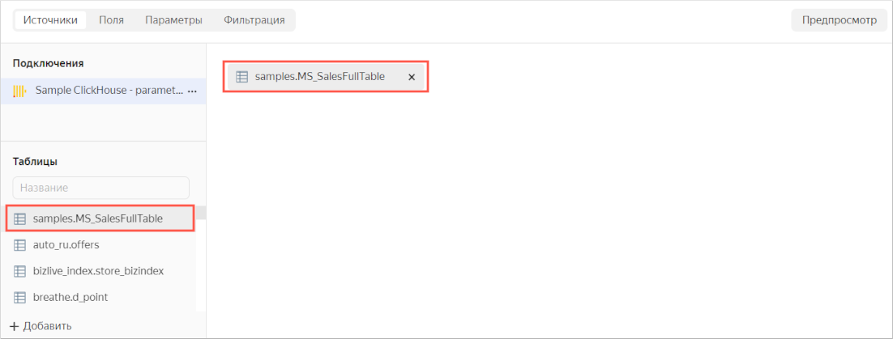

1. Go to the **Fields** tab.

   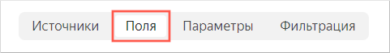

1. Create an order date field named **OrderDate**.

   1. Duplicate the **OrderDatetime** field.

      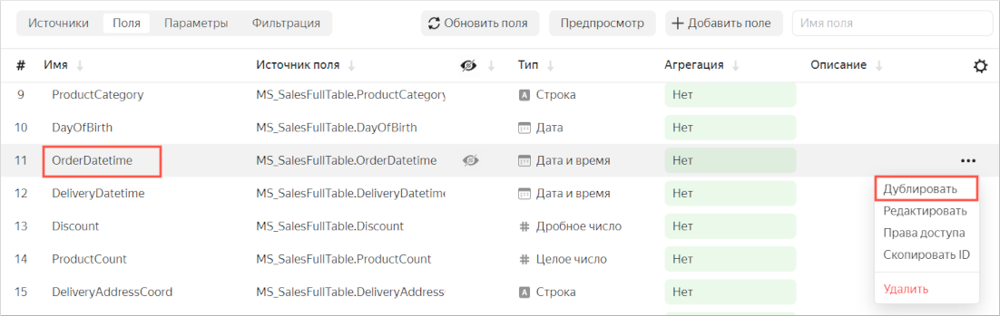

   1. Rename the **OrderDatetime (1)** duplicate field to **OrderDate**: click the row name, delete the current name, and enter the new one.
   1. Change the data type from **Date and time** to **Date**.

      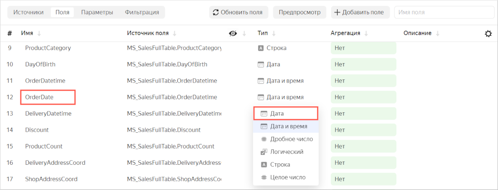

1. In the **Aggregation** column, select **Sum** for the **Sales** field.

   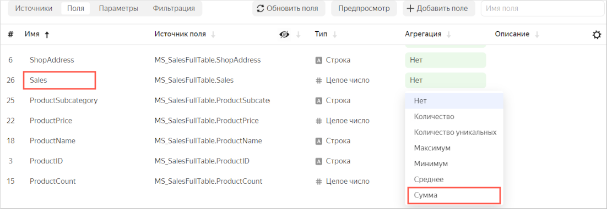

   The aggregation field will become a measure and change color to blue.

1. In the upper-right corner, click **Save**.
1. Name the dataset: **Moscow Sales dataset with parameters**, then click **Create**.

## Add parameters to the dataset {#create-dataset-parameters}

1. Go to the **Parameters** tab.

   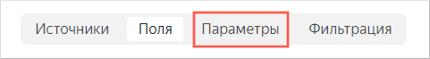

1. Add the `scale` and `dimension` parameters:

   1. Click **Add**. Then, in the window that opens, enter:

      * **Name**: `scale`.
      * **Type**: `String`.
      * **Default value**: `month`.

      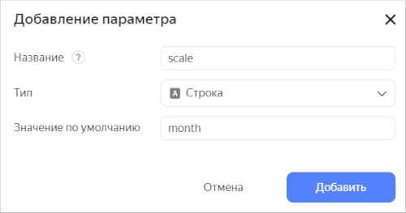

      Click **Add**.

   1. Click **Add**. Then, in the window that opens, enter:

      * **Name**: `dimension`.
      * **Type**: `String`.
      * **Default value**: `Status`.

      Click **Add**.

1. Click **Save**.

## Create a chart with a configurable date dimension {#create-chart-grouping}

1. In the upper-right corner of the dataset, click **Create chart**.
1. Select **Stacked area chart** as the visualization type.

   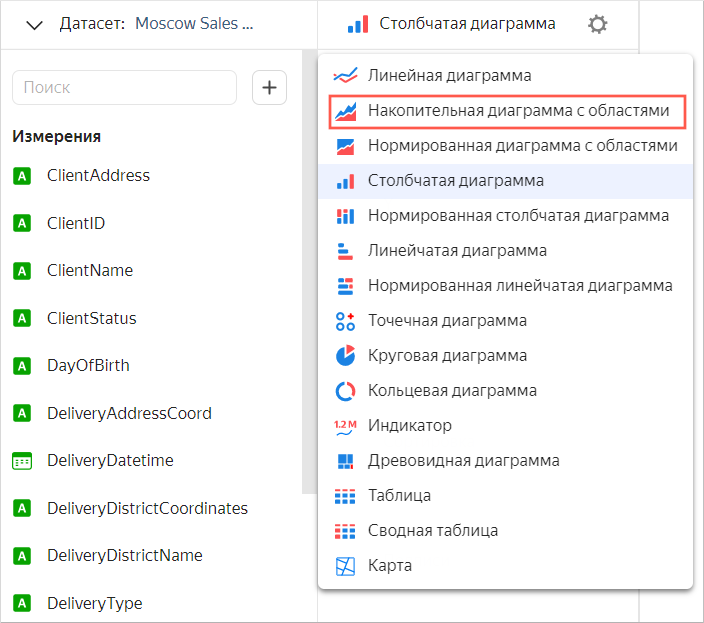

1. Add a calculated field to the chart:

   1. On the left of the screen, click  under the dataset and select **Field**.
   1. In the **Field settings** window, enter:

      * In the **Name** field: `Date`.
      * In the formula field: `DATETRUNC([OrderDate], [scale])`. The order data will be rounded depending on the `scale` dataset parameter.

         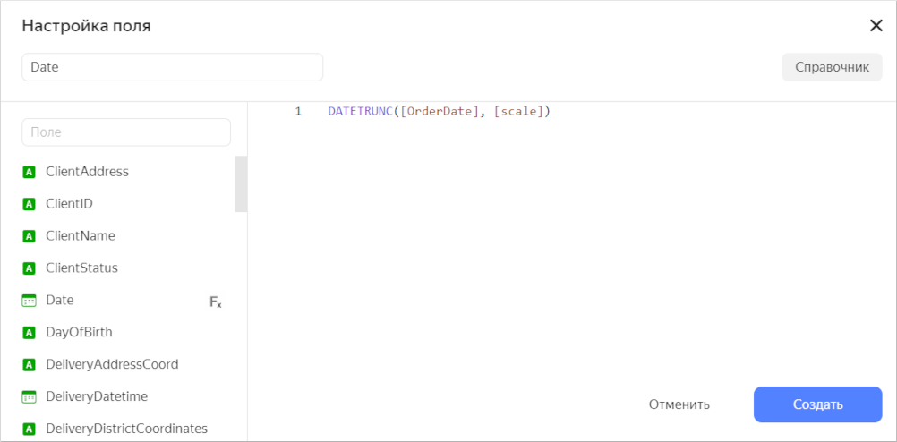

   1. Click **Create**.
   1. Drag the created **Date** field to the **X** section.

1. Drag the **Sales** measure to the **Y** section.
1. Add a product category dimension to the chart. To do this, drag the **ProductCategory** field from the **Dimensions** section to the **Colors** section. The diagram areas corresponding to product categories will be filled by different colors.
1. Save the chart.

   1. In the upper-right corner, click **Save**.
   1. Enter the chart name **Sales by product category**, then click **Save**.

      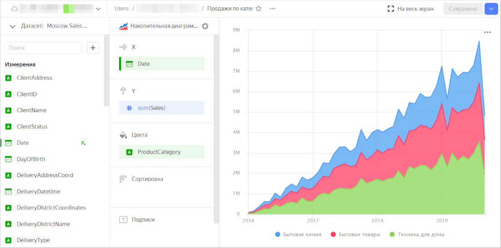

## Create a chart with a configurable visualization dimension {#create-chart-measure-select}

1. In the upper-right corner of the dataset, click **Create chart**.
1. For the visualization type, select **Line chart**.
1. Add a calculated field for selecting a dimension to the chart:

   1. On the left of the screen, click  under the dataset and select **Field**.
   1. In the **Field settings** window, enter:

      * In the **Name** field: `Field`.
      * In the formula field:

         ```
         if(
              [dimension] = 'Status', [ClientStatus],
              [dimension] = 'Category', [ProductCategory],
              [dimension] = 'Payment type', [PaymentType],
              null
            )
         ```

         The visualized dimension will changed depending on the dataset's `dimension` parameter.

   1. Click **Create**.
   1. Drag the created **Field** field to the **Y** section.

1. Drag the **Sales** measure to the **X** section.
1. Save the chart.

   1. In the upper-right corner, click **Save**.
   1. Enter the chart name **Chart with a configurable visualization dimension**, then click **Save**.

      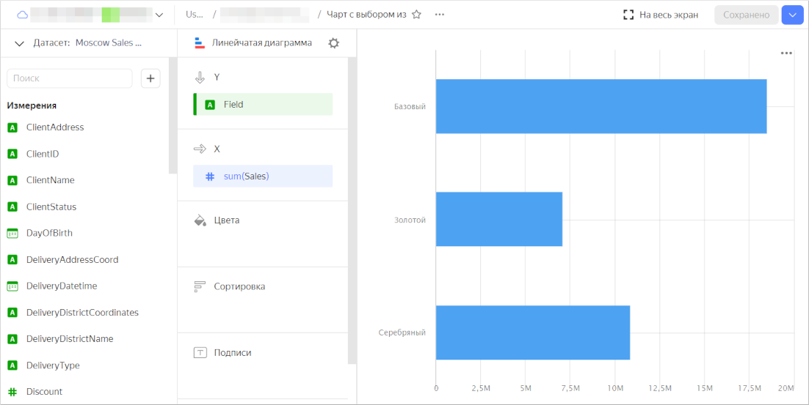

## Create a dashboard {#create-dashboard}

Create a [dashboard](../../datalens/concepts/dashboard.md) to add these charts to.

1. Go to the {{ datalens-short-name }} [homepage]({{ link-datalens-main }}).
1. Click **Create dashboard**.

   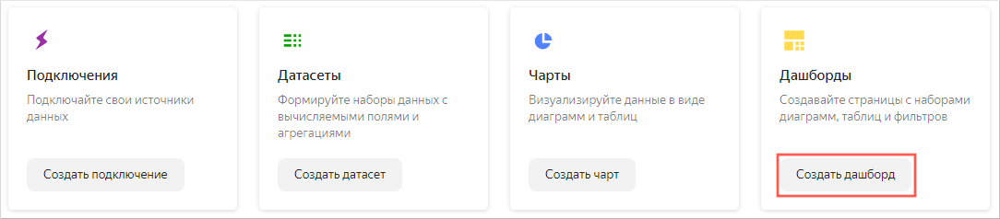

1. Enter the dashboard name **Visualizing data using the parameters**, then click **Create**.

## Add charts to the dashboard {#add-charts-on-dashboard}

1. The first time you open the dashboard after saving, it opens in edit mode. If you open it later, click **Edit** in the upper-right corner.
1. Click **Add** and select **Chart**.

   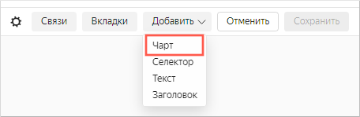

1. In the **Chart** field, click **Select**.
1. Select the chart **Sales by product categories**. This will automatically fill in the **Name** field.
1. Click **Add**.

   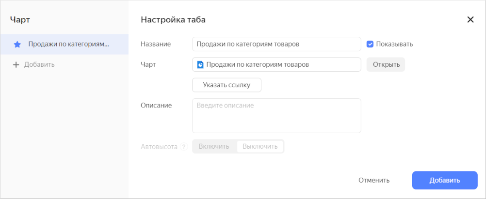

1. In a similar manner, add the **Chart with a configurable visualization dimension**.
1. Position the charts on the dashboard however you like.

## Add selectors to the dashboard {#add-selectors-on-dashboard}

Add [selectors](../../datalens/concepts/dashboard.md#selector) with manual input to edit values in the charts.



After you add a selector, unlink it from other selectors in this dashboard tab.



1. Add a selector for the chart **Sales by product category**:

   1. At the top of the page, click **Add**.
   1. Choose **Selector**.

      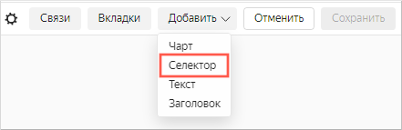

   1. Select **Manual input** as source type.
   1. Under **Field or parameter name**, enter `scale`. The value from the selector will be passed to this dataset parameter.
   1. Choose **List** as your selector type.
   1. Click the input field next to the **Default value** parameter and add the values:

      * `day`
      * `week()` 
      * `month`
      * `year`

      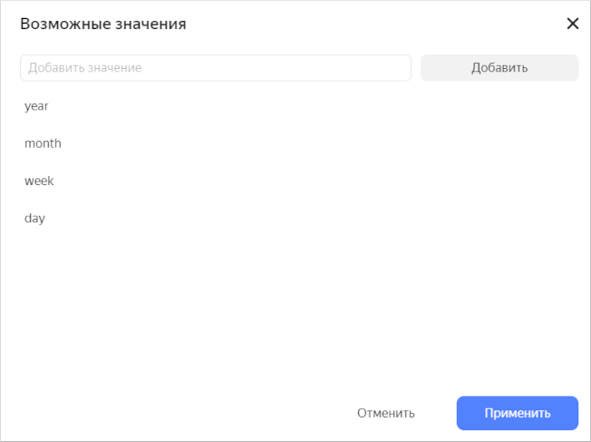

      Click **Apply**.

   1. In the **Default value** list, specify **month**.
   1. Enable the **Name** option and enter `Grouping`.
   1. Verify the specified selector parameters.

      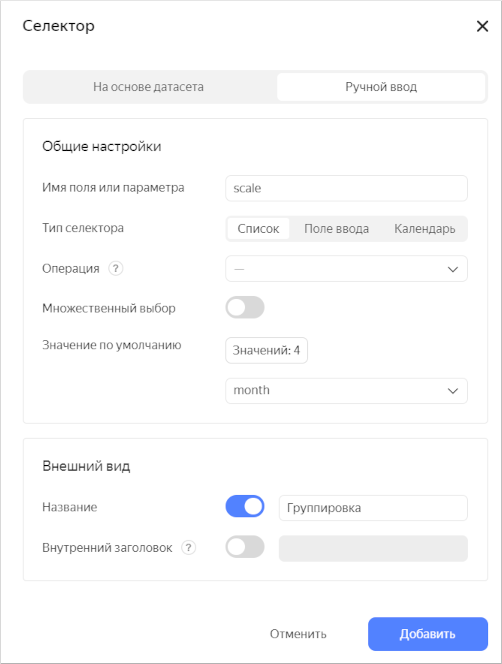

   1. Click **Add**.
   1. Place the selector on the dashboard on top of the  **Sales by product category type**. Now you can manage data grouping in this chart.

      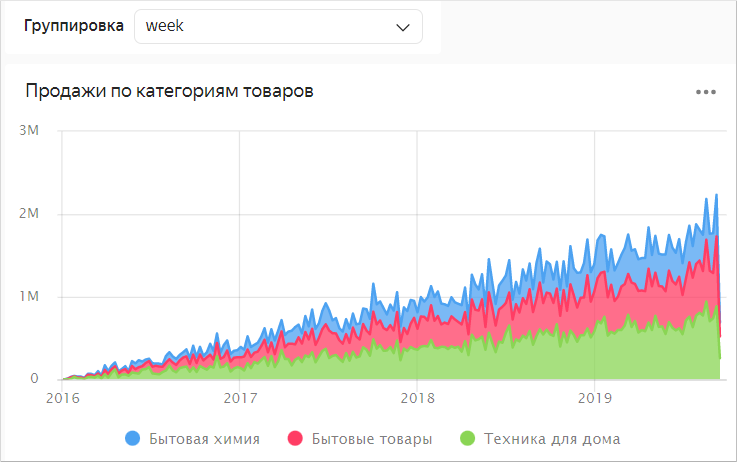

      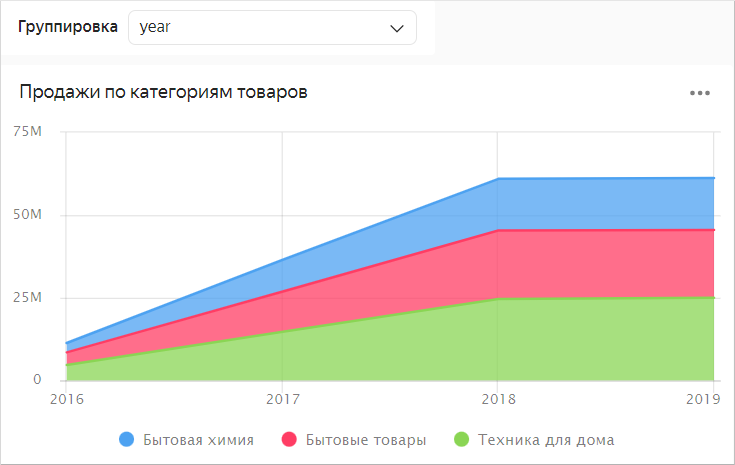

1. Add a selector for the **Chart with a visualization dimension change**:

   1. At the top of the page, click **Add**.
   1. Choose **Selector**.
   1. Select **Manual input** as source type.
   1. Under **Field or parameter** name, enter `dimension`. The value from the selector will be passed to this dataset parameter.
   1. Choose **List** as your selector type.
   1. Click the input field next to the **Default value** parameter and add the values:

      * `Status`
      * `Category`
      * `Payment type`

      Click **Apply**.

   1. In the **Default value** list, specify **Status**.
   1. Enable the **Name** option and enter `Grouping`.
   1. Click **Add**.
   1. Place the selector on the dashboard above the **Chart with a configurable visualization dimension** chart.
   1. Unlink this selector with the **Grouping** selector:

      1. At the top of the page, click **Links**.
      1. In the **Links** window, select **Dimensions**.
      1. Make sure that you selected the **Outgoing link** link type for the **Chart with a configurable visualization selection**. For the **Grouping** selector, specify the link type **Ignore**.

         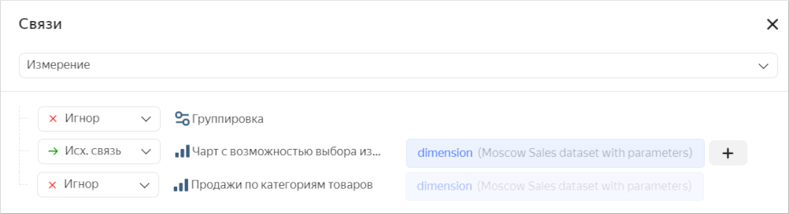

      1. Click **Save**. Now, you can use this selector to select the visualized dimension.

         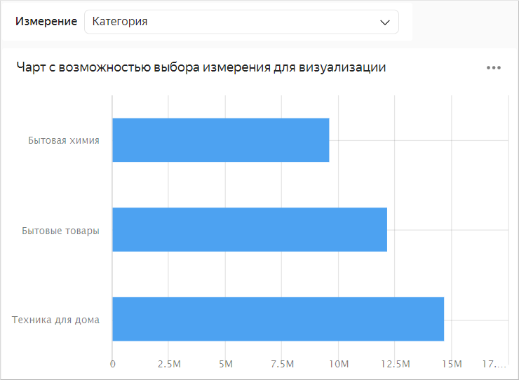

         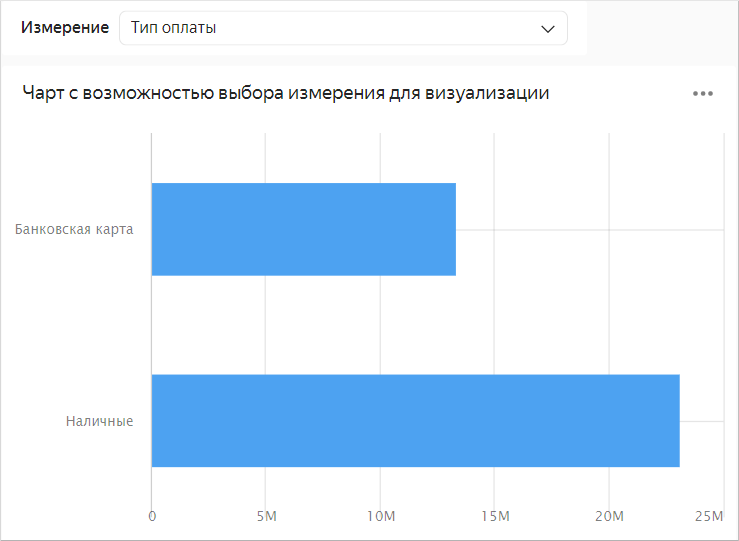

#### See also {#see-also}

* [{#T}](../../datalens/concepts/parameters.md)
* [{#T}](../../datalens/operations/dashboard/add-parameters.md)
* [{#T}](../../datalens/operations/chart/add-parameter-chart.md)
* [{#T}](../../datalens/operations/dataset/add-parameter-dataset.md)
