# Analyzing public data on road accidents in Russia



This guide analyzes public data on road accidents in Russia. In addition to identifying the facts of accident statistics in Russia, during the analysis you will learn how to:

* Work with the {{ datalens-short-name }} key entities: [Connections](../../datalens/concepts/connection.md), [Datasets](../../datalens/dataset/index.md), [Charts](../../datalens/concepts/chart/index.md), and [Dashboards](../../datalens/concepts/dashboard.md).
* Merge multiple sources at single dataset level.
* Use the `Date and time` data type and edit chart-level groupings.
* Work with geodata: geopoints and geopolygons.
* Create public dashboards that will be available to everyone from any device without authentication.

The following files will provide the source data:

* [Traffic accident statistics](https://storage.yandexcloud.net/doc-files/dtp201804-1.csv) for April-December 2018 in CSV format.
* [Polygon reference](https://storage.yandexcloud.net/doc-files/Regions.csv) for regions of Russia in CSV format.

Download them before you proceed with this guide.

To visualize and explore data, [set up {{ datalens-short-name }}](#before-you-begin) and follow the steps below:

1. [Create a workbook](#create-workbook).
1. [Create a connection to files](#create-connection).
1. [Create a dataset](#create-dataset).
1. [Analyze accident distribution density](#stream).
1. [Analyze the number of accidents and death rate](#create-bar-chart).
1. [Analyze the statistics by week, day of week, and time of day](#create-line-chart).
1. [Create a map with color fill by region](#create-map-geopolygon-chart).
1. [Create a dashboard and add charts to it](#create-dashboard).
1. [Add selectors to the dashboard](#add-selectors).
1. [Add a map with color fill by region to the dashboard](#add-geopolygon-chart).
1. [Publish the dashboard](#publish-dashboard).

## Getting started {#before-you-begin}



## Create a workbook {#create-workbook}

1. Go to the {{ datalens-short-name }} [home page]({{ link-datalens-main }}).
1. In the left-hand panel, select  **Collections and workbooks**.
1. In the top-right corner, click **Create** → **Create workbook**.
1. Enter the [workbook](../../datalens/workbooks-collections/index.md) name: `Tutorials`.
1. Click **Create**.

## Create a connection to files {#create-connection}

Create a [connection](../../datalens/concepts/connection.md) to source data files:

1. In the top-right corner of the workbook, click **Create** →  **Connection**.

1. Under **Files and services**, select the **Files** connection.
1. Click **Upload files**.
1. Select `dtp201804-1.csv`. Wait until the table content appears on the screen.

   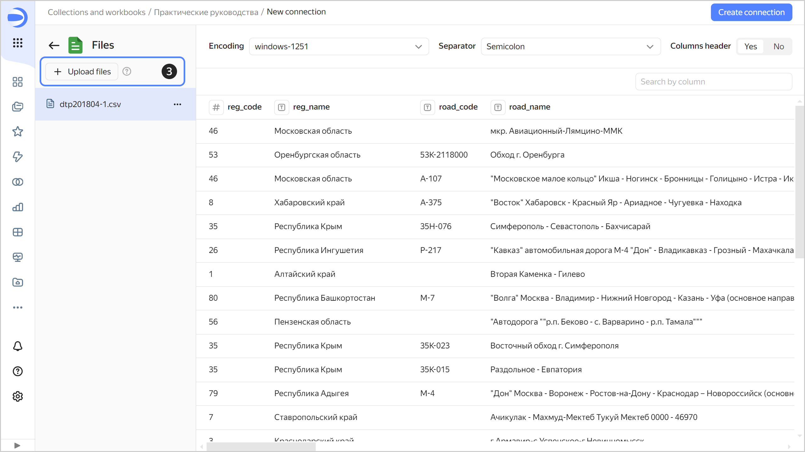

1. Connect a chart with region geolayers. Click **Upload files**.
1. Select `Regions.csv`. Wait for the data to load.
1. Select the uploaded `Regions.csv` file from the list on the left.
1. For the **Column header** parameter, set the `Yes` value.
1. Click **Create connection**.

   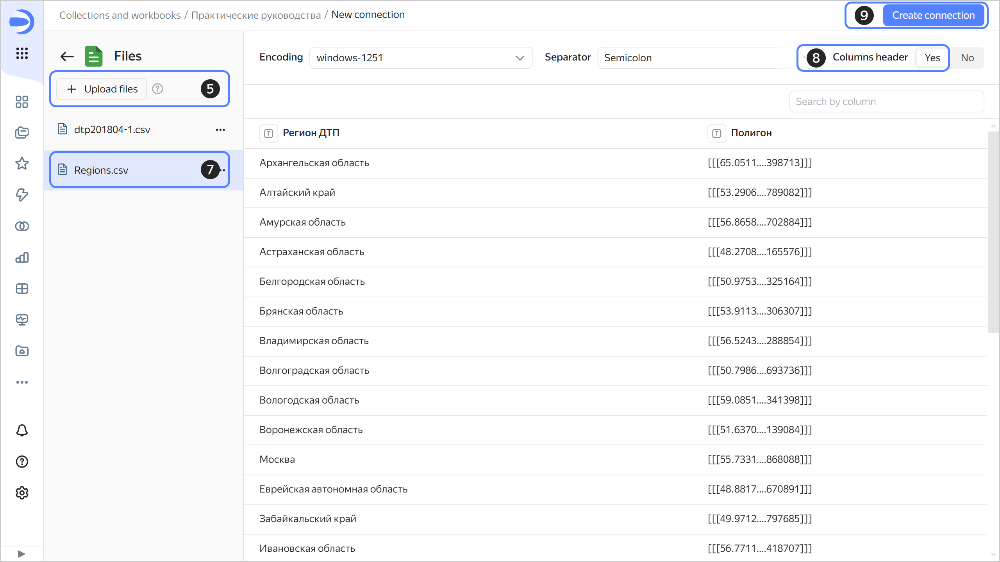

1. Enter `dtp_data` for the connection name and click **Create**.

## Create a dataset {#create-dataset}

Create a dataset based on the `dtp_data` connection:

1. In the top-right corner of the connection page, click **Create dataset**.
1. Drag the `dtp201804-1.csv` table to the workspace.
1. Drag the `Regions.csv` table to the workspace. An error message will appear as the tables' data have not been merged yet.
1. Click the link icon between the tables.

   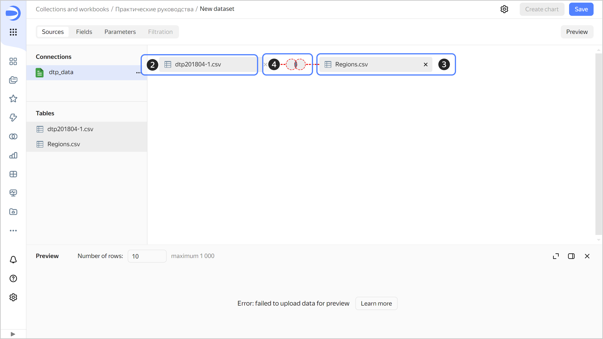

1. Click **Add link**.
1. Select the fields to link: `reg_name` and `Accident region`.
1. Click **Apply**.

   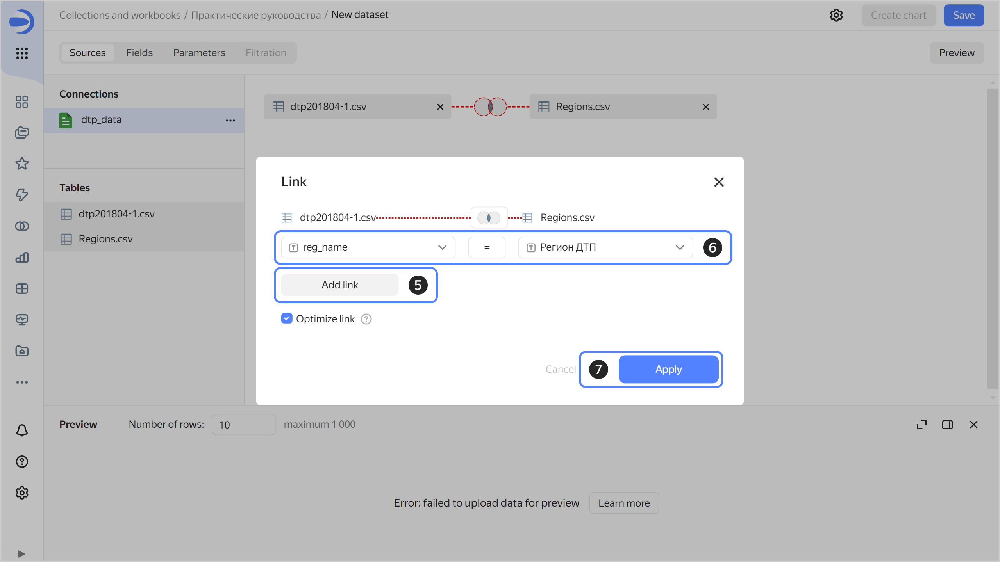

   Make sure that the data in the preview section is presented correctly.

   

1. Go to the **Fields** tab. On this tab, you can add [data fields](../../datalens/dataset/data-model.md#field) and [calculated fields](../../datalens/concepts/calculations/index.md), change field data types and aggregation rules, as well as rename fields.
1. Rename the fields as follows:

   * `reg_code` to `Region code`
   * `reg_name` to ` Region name`
   * `road_code` to `Road code`
   * `road_name` to `Road name`
   * `road_type` to `Road type`
   * `oktmo` to `OKTMO code`
   * `address` to `Address`
   * `crash_type_name` to `Accident type`

    To rename a field, click its current name, delete it, and enter a new one.

   

1. Accident date and time appear in the following fields:

   * `crash_date`: Numeric date in `20190218` format.
   * `crash_time`: Time in `19:34` text format.

   They will not be used in charts in this format. Click  to hide them (the icon appears when you hover over the field).

   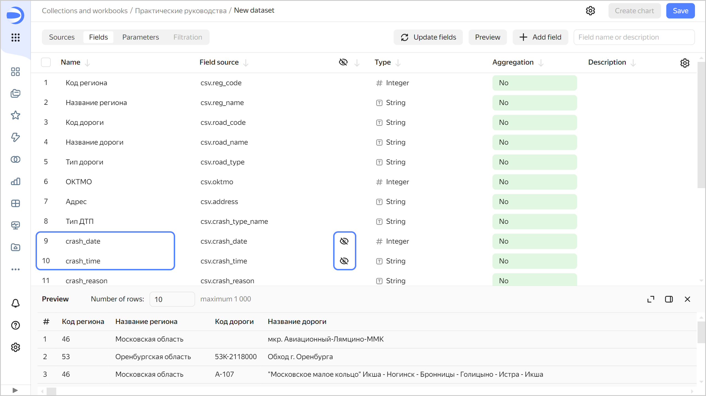

1. Create a calculated field to display information about the accident date and time:

   1. In the top-right corner, click **Add field**.
   1. At the top-left, specify the field name: `Date and time`.
   1. In the formula field, enter `DATETIME_PARSE(str([crash_date])+' '+str([crash_time]))`.

      

      * To avoid errors, select fields for the formula from the list on the left instead of entering them manually.
      * To display information about functions, click **Reference** at the top right.

      

   1. Click **Create**.

   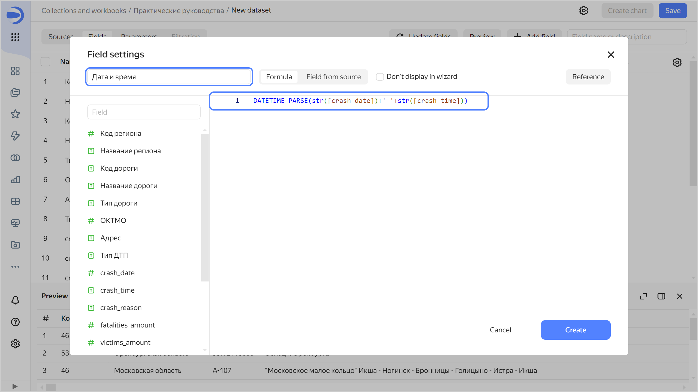

   The preview section now correctly displays the accident date and time as a `Date and time` type value with `T` for separator. The new field is at the top of the table. Click  to edit the field formula.

   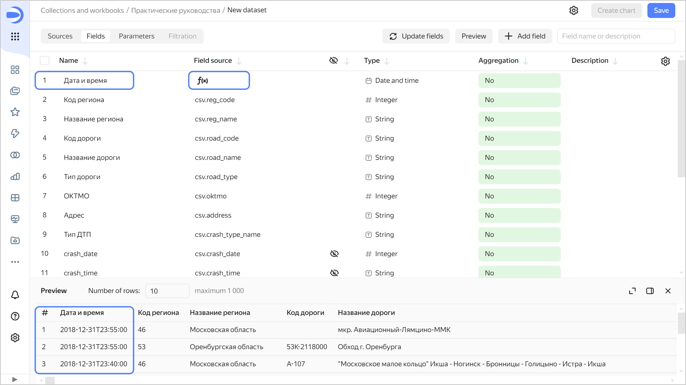

1. Rename the fields as follows:

   * `crash_reason` to `Cause of accident`
   * `fatalities_amount` to `Death toll`
   * `victims_amount` to `Number of victims`
   * `vehicles_amount` to `Number of vehicles`
   * `participants_amount` to `Number of participants`

1. For the `Death toll`, `Number of victims` `Number of vehicles` and `Number of participants` fields, specify the **Sum** aggregation type. The fields with the defined aggregate functions become measures and change their color to blue.

   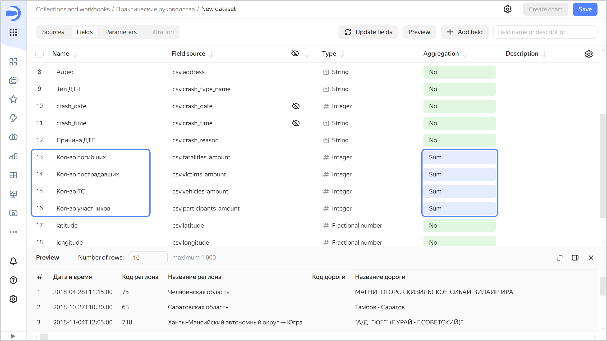

1. Create a field with accident coordinates:

   1. In the top-right corner, click **Add field**.
   1. At the top-left, specify the field name: `Geopoint`.
   1. In the formula field, enter `GEOPOINT([latitude],[longitude])`.
   1. Click **Create**.

      

      The example is based on ready-to-use data in coordinate format. 

      

    A new field of the `Geopoint` type will appear in the list of fields; the data for this field will appear in the preview section.

    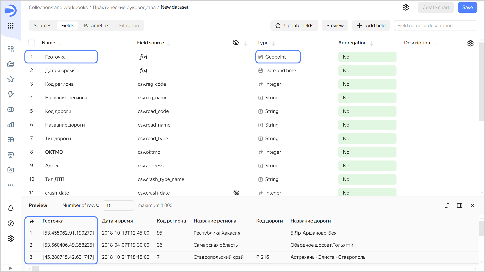

1. Create the following fields:

   * `Number of accidents` with the `SUM(1)` formula. You do not need to set the aggregation type for this field: when you add it to the chart, {{ datalens-short-name }} will apply the aggregation function automatically.
   * `Accident death rate` with the `[Death toll]/[Number of accidents]` formula.

1. For the `Polygon` field, change the data type to **Geopolygon**.

   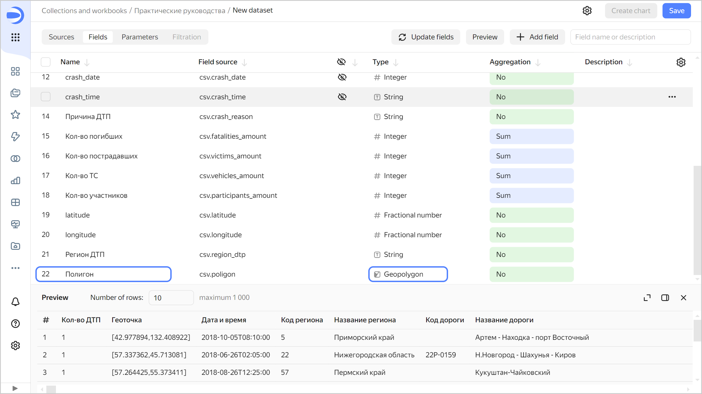

1. Save the dataset:

   1. In the top-right corner, click **Save**.
   1. Enter `Accident` as the dataset name and click **Create**.

## Analyze accident distribution density {#create-heat-map}

To visualize accident distribution density by region, create a [heat map](../../datalens/visualization-ref/heat-map-chart.md):

1. On the dataset page, click **Create chart** in the top-right corner.
1. Select the **Map** visualization type.

   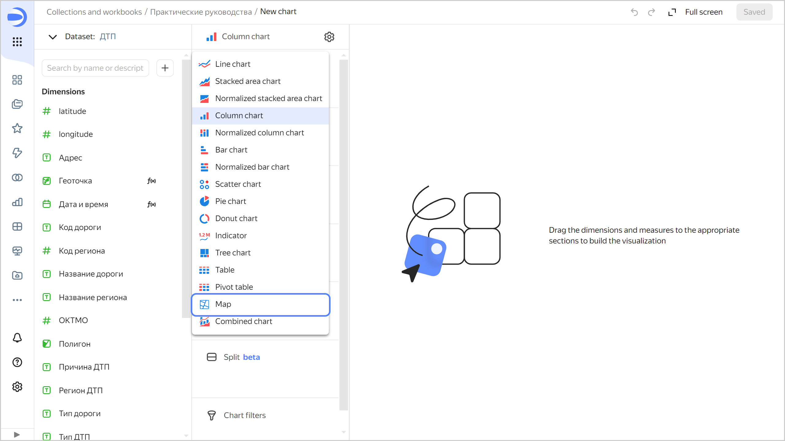

1. Select the **Heat map (Geopoints)** layer type.

   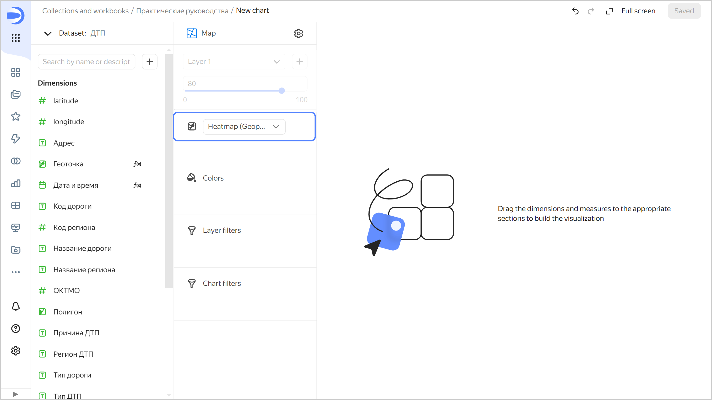

1. Add points with coordinates to the map. To do this, drag the `Geopoint` field from **Dimensions** to the **Heatmap (Geopoints)** section.
1. Save the chart:

   1. In the top-right corner, click **Save**.
   1. In the window that opens, enter `Accident heat map` as the chart name and click **Save**.

      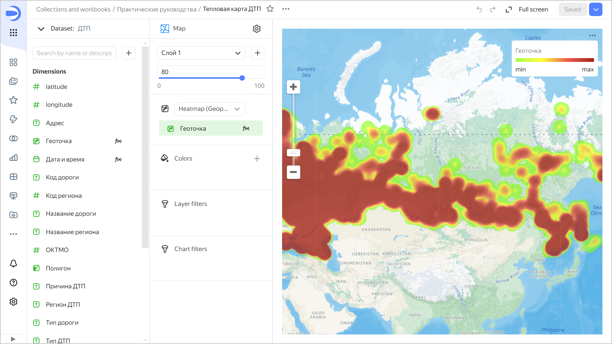

## Analyze the number of accidents and death rate {#create-bar-chart}

To analyze the number of accidents by region, create a [bar chart](../../datalens/visualization-ref/bar-chart.md).

1. Create a copy of the chart you created in the previous step:

   1. In the top-right corner, click  → **Save as copy**.

            

   1. In the window that opens, enter `Number of accidents by region` as the name for the new chart and click **Save**.

1. For the visualization type, select **Line chart**.

   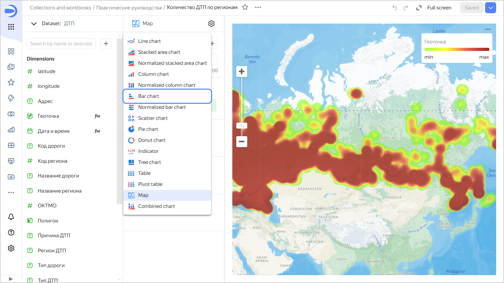

1. Add region names to your chart. To do this, drag the `Region name` field from **Dimensions** to the **Y** section.
1. Add the number of accidents to your chart. Drag the `Number of accidents` field from **Measures** to the **X** section.
1. Sort the chart by the number of accidents in descending order. Drag the `Number of accidents` field from **Measures** to the **Sorting** section.

   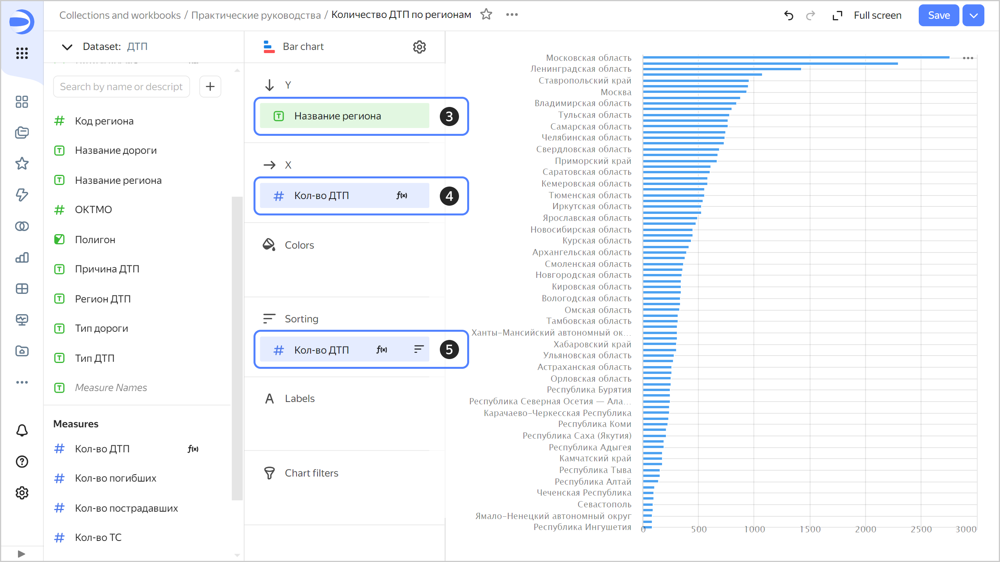

   The chart will show the number of accidents by region. Most accidents occurred in the Moscow region.

   

   The legend may be missing for some of the chart lines. If this is the case, hover over the line and you will see a tooltip with the region name.

   

1. Save your chart: in the top-right corner, click **Save**.

To analyze the accident death rate by region, create another bar chart:

1. Create a copy of the `Number of accidents by region` chart.

   1. In the top-right corner, click  → **Save as copy**.
   1. In the window that opens, enter `Death rate by region` as the name for the new chart and click **Save**.

1. Replace the number of accidents measure with the accident death rate measure on axis X. To do this, drag the `Accident death rate` field from **Dimensions** to the **X** section and hold it over the `Number of accidents` field until the latter turns red.
1. Change from sorting by the number of accidents to sorting by descending accident death rate. To do this, drag the `Accident death rate` field from **Dimensions** to the **Sorting** section and hold it over the `Number of accidents` field until the latter turns red.

   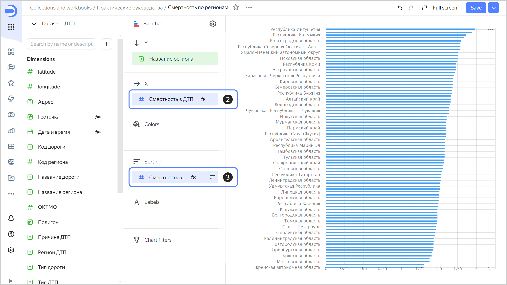

   This time, Ingushetia, Kalmykia, and the Volgograd region are far ahead in the number of deaths.

1. Save your chart: in the top-right corner, click **Save**.

## Analyze the statistics by week, day of week, and time of day {#create-line-chart}

Let's see how the number of accidents and related deaths are distributed by week, day of week, and time of day.

1. Analyze the number of accidents and death rate by week:

   1. Create a copy of the chart you created in the previous step:

      1. In the top-right corner, click  → **Save as copy**.
      1. In the window that opens, enter the `Number of accidents and death rate by week` as the name for the new chart and click **Save**.

   1. For the visualization type, choose **Line chart**.

      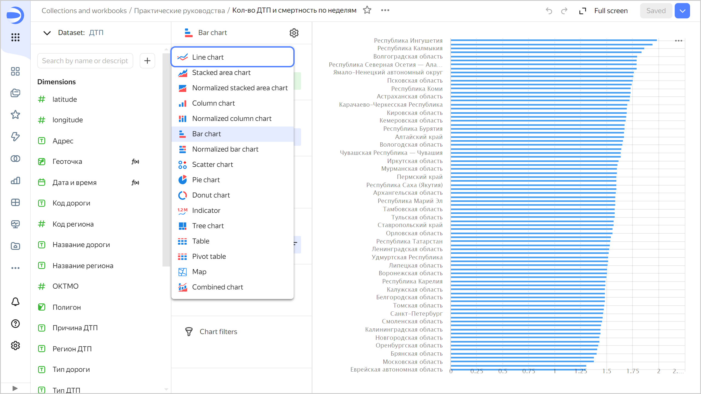

   1. Delete fields in all sections of the chart. To do this, click  (the icon appears when you hover over the field) next to a field in a section.
   1. Add accident date and time to your chart. To do this, drag the `Date and time` field from **Dimensions** to the **X** section.
   1. Group dates by week:

      1. Click the calendar icon next to the `Date and time` field in the **X** section.
      1. In the **Grouping** field, choose **Date portion** ⟶ **Week** and click **Apply**.

      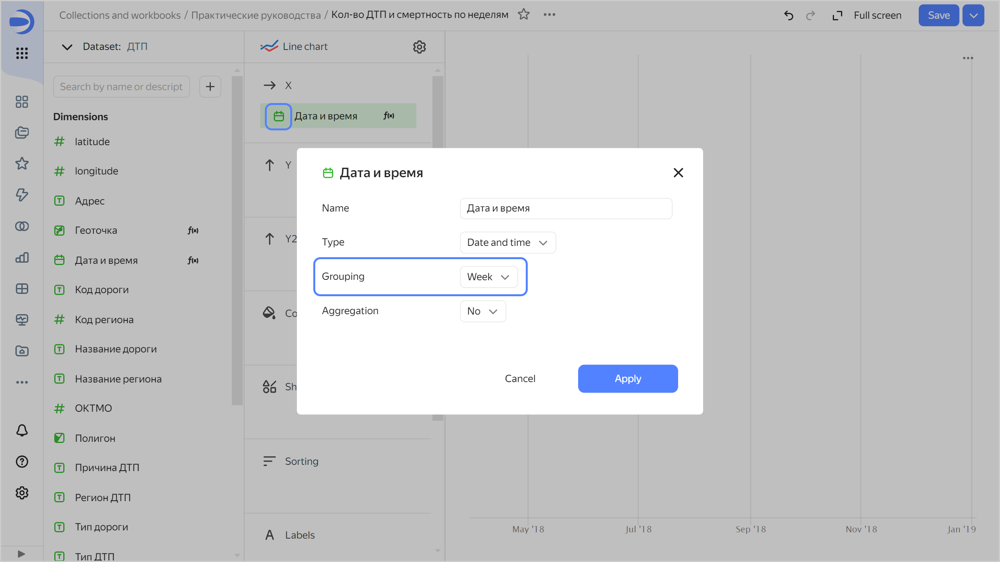

   1. Drag:

      * `Number of accidents` field to the **Y** section.
      * `Accident death rate` field to the **Y2** section.

      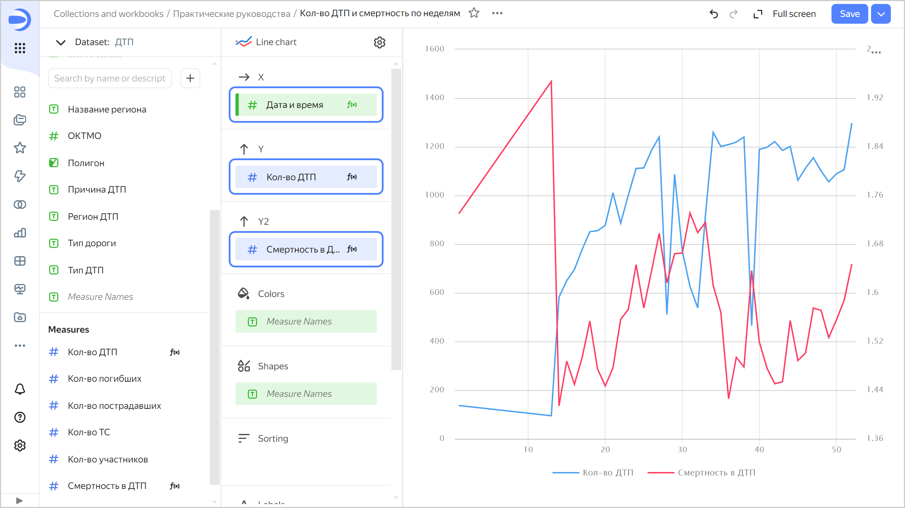

      Now you can see a chart with two graphs: number of accidents and death rate. If you hover over a point on the chart, a tooltip appears with specific values.

   1. Save your chart: in the top-right corner, click **Save**.

1. Now analyze the number of accidents and death rate by day of week:

   1. Create a copy of the chart you created in the previous step:

      1. In the top-right corner, click  → **Save as copy**.
      1. In the window that opens, enter the `Number of accidents and death rate by day of week` as the name for the new chart and click **Save**.

   1. Change grouping by date and time to **Date portion** ⟶ **Day of week**.

      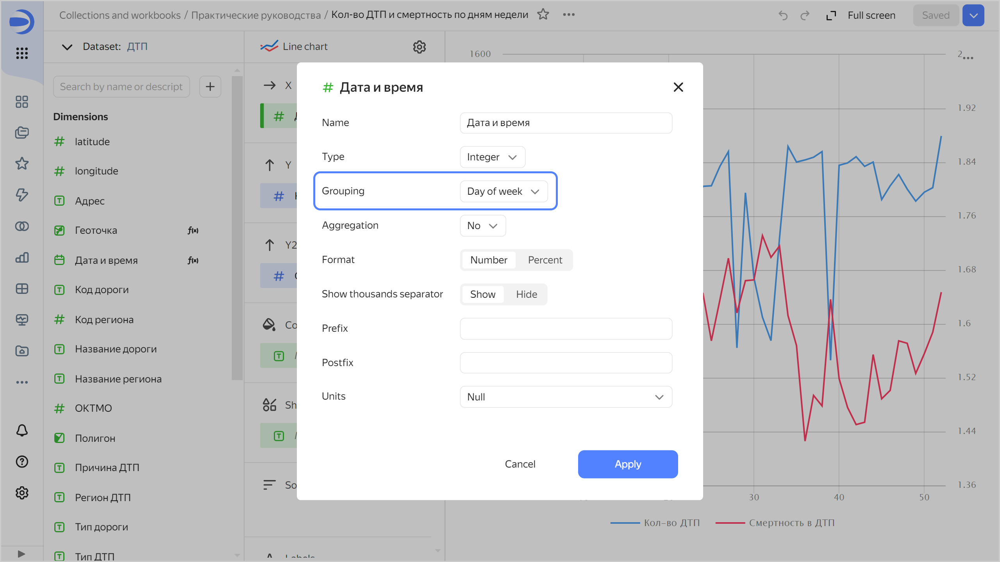

      This chart reveals more obvious trends: both measures increase towards the end of the week.

      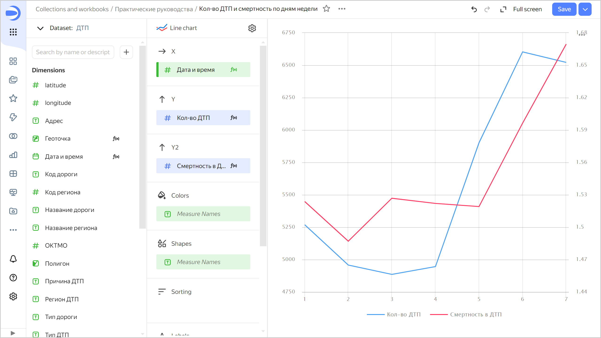

   1. Save your chart: in the top-right corner, click **Save**.

1. Analyze the number of accidents and death rate by time of day.

   1. Create a copy of the chart you created in the previous step:

      1. In the top-right corner, click  → **Save as copy**.
      1. In the window that opens, enter `Number of accidents and death rate by time of day` as the name for the new chart and click **Save**.

   1. Change grouping by date and time by specifying: **Date portion** ⟶ **Hour**.

      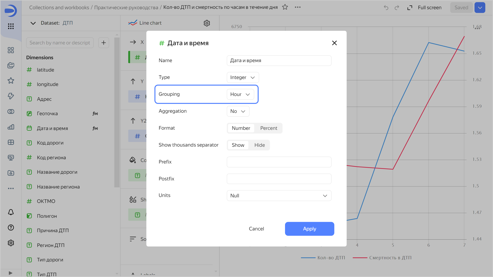

      The chart shows that less accidents occur at night, but they result in more casualties.

      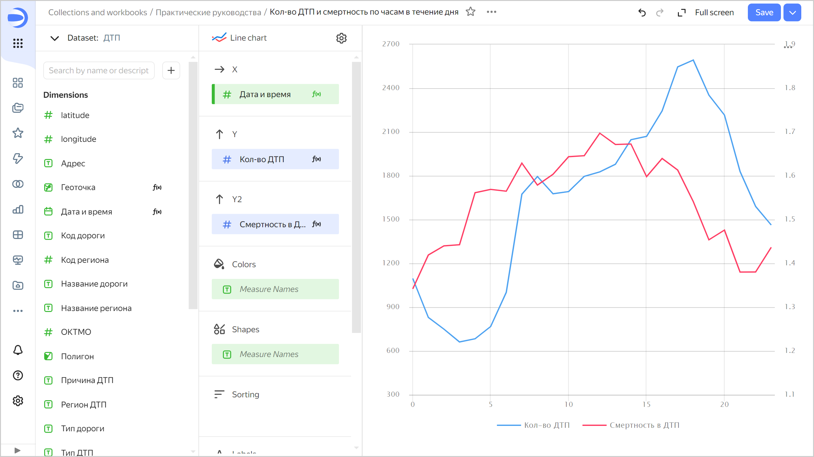

   1. Save your chart: in the top-right corner, click **Save**.

## Create a map with color fill by region {#create-map-geopolygon-chart}

1. Create a copy of the chart you created in the previous step:

   1. In the top-right corner, click  → **Save as copy**.
   1. In the window that opens, enter the `Regions map` as the name for the new chart and click **Save**.

1. Select the **Map** visualization type.
1. Select **Polygons (Geopolygons)** as the layer type.

   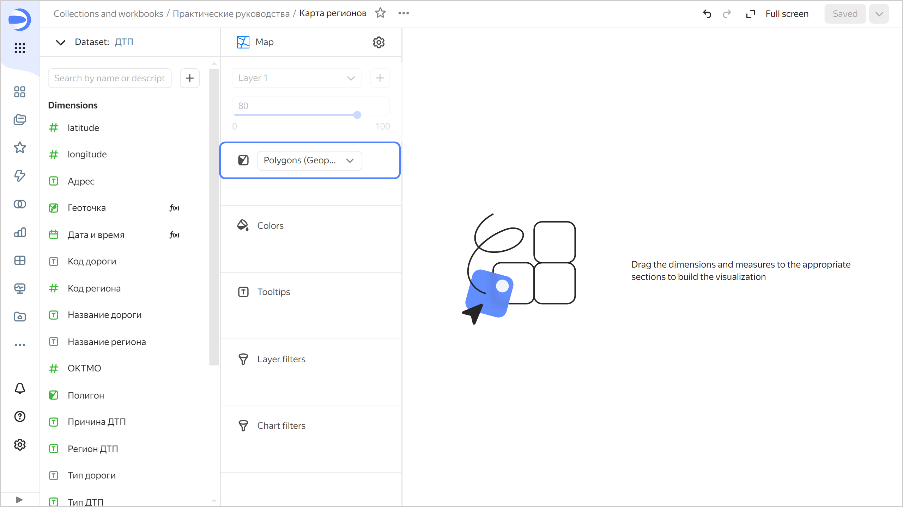

1. Add polygons to the map. Drag the `Polygon** field from **Dimensions` to the **Geopolygons** section.

1. Change colors of the polygons based on the number of accidents. To do this, drag the `Number of accidents` field from **Measures** to the **Colors** section.

1. Drag the following fields to the **Tooltips** section:

   * `Region name`
   * `Number of accidents`
   * `Death toll`
   * `Number of victims`
   * `Number of vehicles`
   * `Number of participants`
   * `Accident death rate`

   The chart will show a map with color fill by region. If you hover over a region, information for that region appears.

   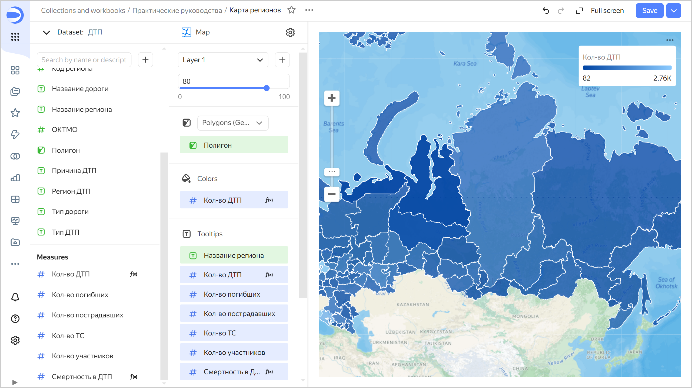

1. Save your chart: in the top-right corner, click **Save**.

## Create a dashboard and add charts to it {#create-dashboard}

Create a [dashboard](../../datalens/concepts/dashboard.md) to add charts and other widgets to:

1. In the left-hand panel, select  **Collections and workbooks** and go to the `Tutorials` workbook.
1. In the top-right corner, click **Create** →  **Dashboard**.

1. In the panel at the bottom of the page, select **Chart**.

   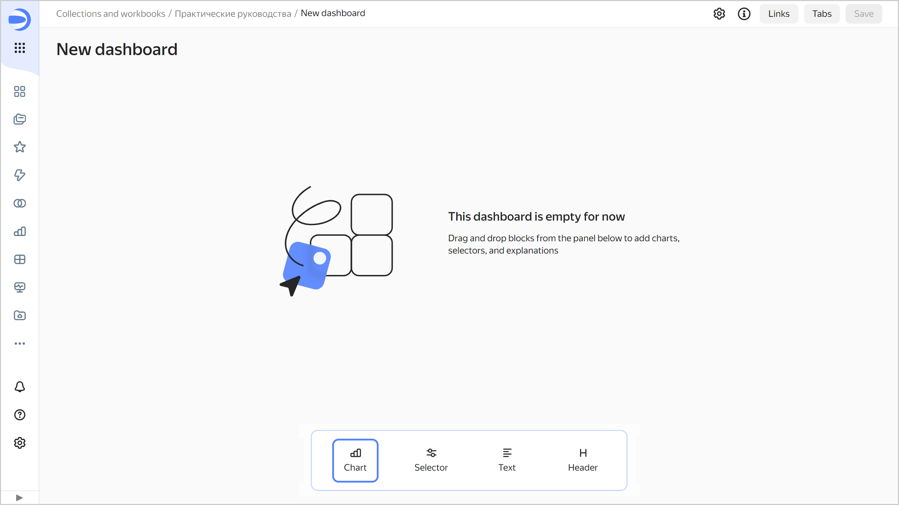   

1. In the window that opens, click **Select**.
1. Select the `Accident heat map` chart.
1. Click **Add**.

   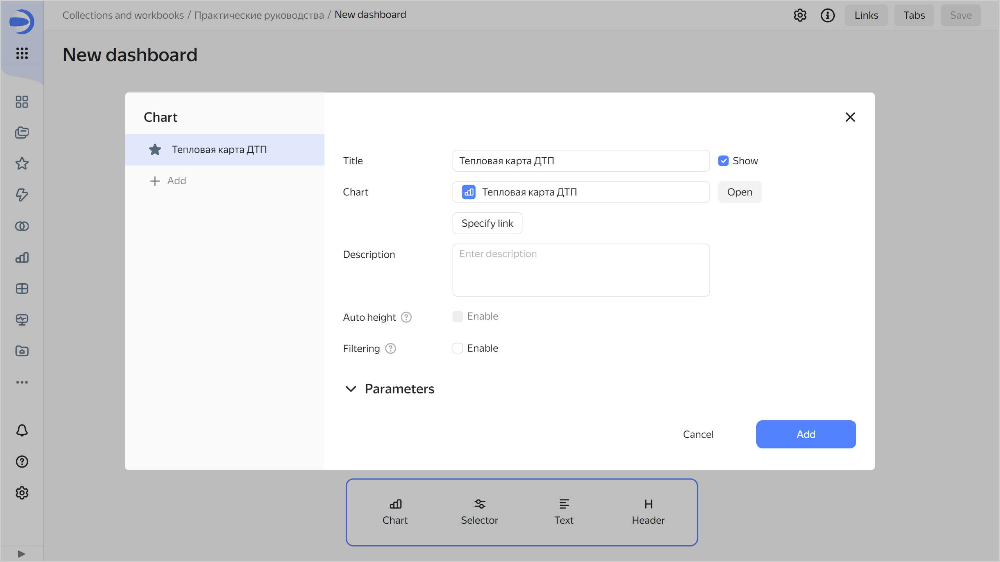

1. Repeat steps 3-6 to add the following charts to the dashboard:

   * `Number of accidents by region`
   * `Number of accidents and death rate by week`
   * `Number of accidents and death rate by day of week`
   * `Number of accidents and death rate by hour of day`

1. On the dashboard, create a widget with two tabs:

   1. In the top-right corner of the `Number of accidents by region` chart, click .
   1. In the left part of the window, click **Add**.
   1. In the new tab, click **Select**.
   1. Select the `Death rate by region` chart.
   1. Click **Save**.

   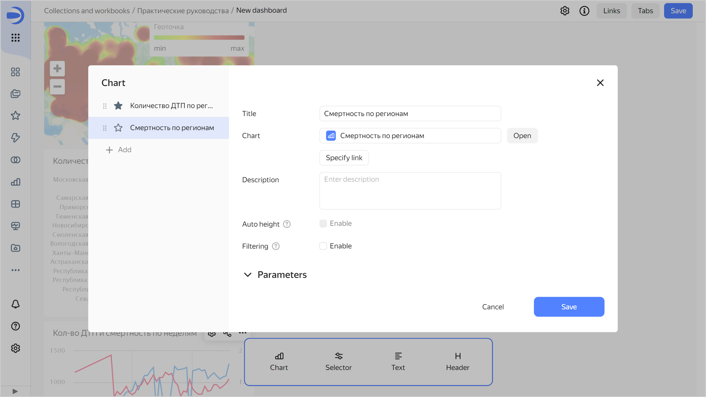

1. Adjust the size of the charts with your mouse and place them on the dashboard as you prefer.

   

## Add selectors to the dashboard {#add-selectors}

[Selectors](../../datalens/concepts/dashboard.md#selector) allow you to filter data by value.

1. Add a widget for data filtering:

   1. In the panel at the bottom of the page, choose **Selector**.

      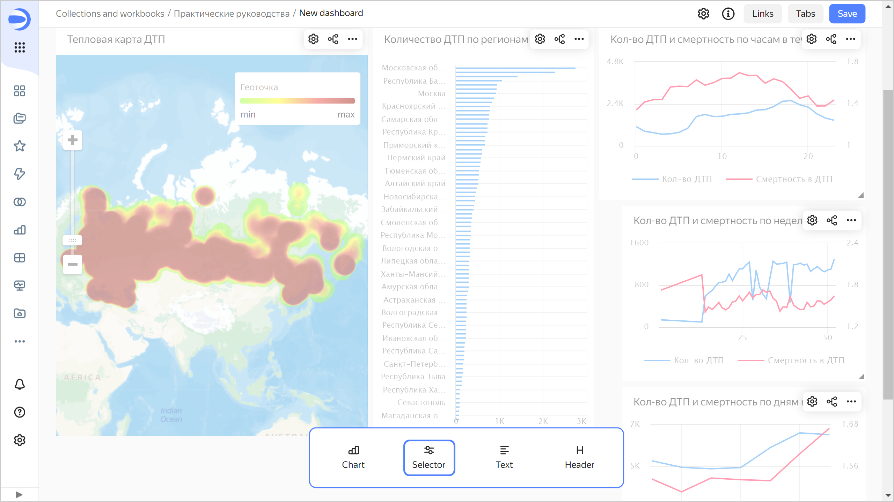      

   1. Choose the `Accidents` dataset.
   1. Select the `Region name` field.

      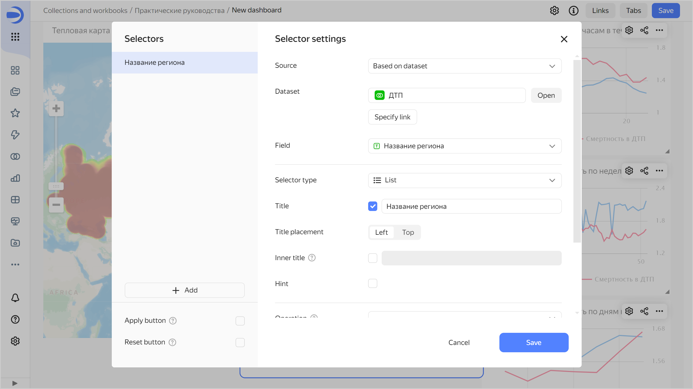

   1. Add selectors by the following fields to the widget:

      * `Road name`
      * `Cause of accident`
      * `Accident type`
      * `Road type`

      To to this, on the left side under **Selectors**, click  **Add** and select a field name.

      

   1. Click **Save**.

1. Position the widget on the dashboard where you think fit.

   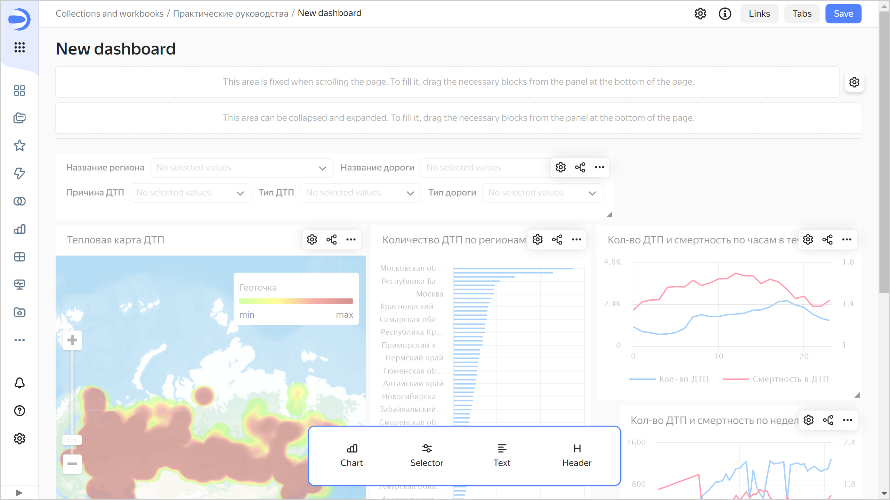

1. Save the dashboard:

   1. In the top-right corner of the dashboard, click **Save**.
   1. Enter `Accidents in Russia` as the dashboard name and click **Create**.

Your dashboard is ready.

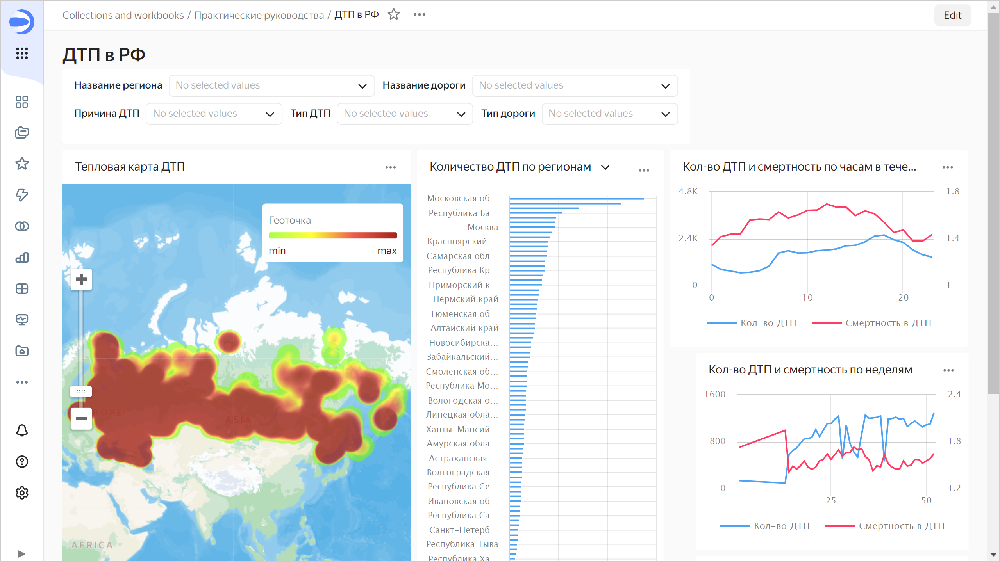

On the dashboard, you can:

* Select selector values for data filtering.
* Rescale the map.
* Switch the `Number of accidents by region` chart to `Death rate by region` and back. To do this, click  to the right of the chart name and select the appropriate tab.

## Add a map with color fill by region to the dashboard {#add-geopolygon-chart}

1. Click **Edit** at the top right.
1. In the top-right corner of the `Accident heat map chart`, click .
1. In the left part of the window, click **Add**.
1. In the new tab, click **Select**.
1. Select the `Regions map` chart.
1. Click **Save**.

   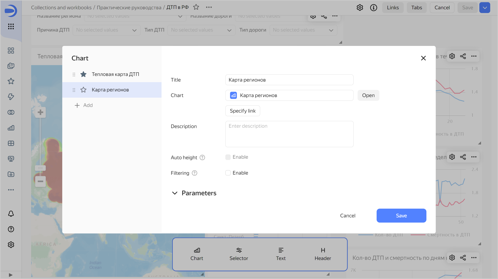

1. In the top-right corner, click **Save**.

Now you can switch between charts: the heat map with accident density or the color fill map.

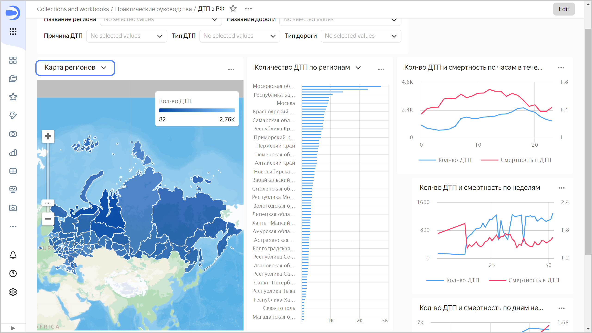

## Publish the dashboard {#publish-dashboard}

To configure public access to the dashboard:

1. At the top of the screen, click  →  **Public access**.
1. In the window that opens, enable the link sharing option next to the dashboard name.
1. Click **Continue** to confirm publication of the dashboard and the data connected to it.
1. Click **Copy link** to copy the dashboard's unique URL.

   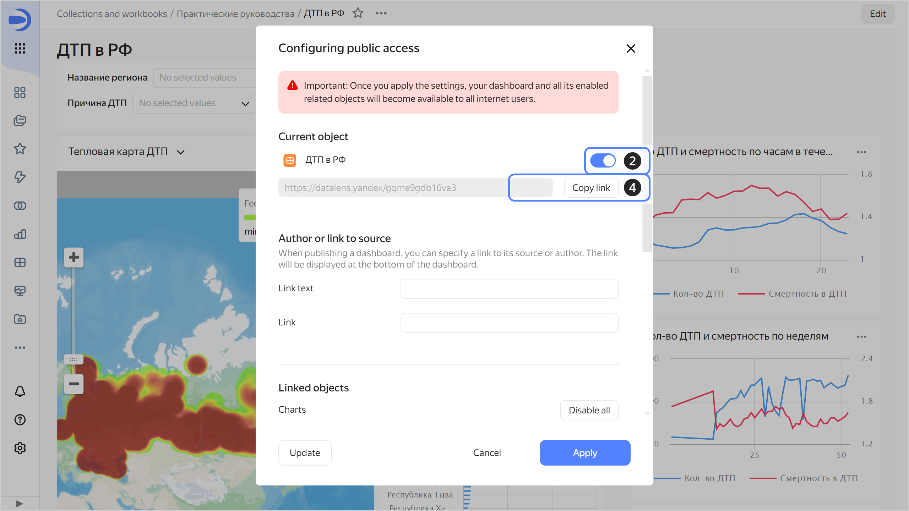

1. Click **Apply**.
1. Open a new tab in the browser and go to the copied link.

   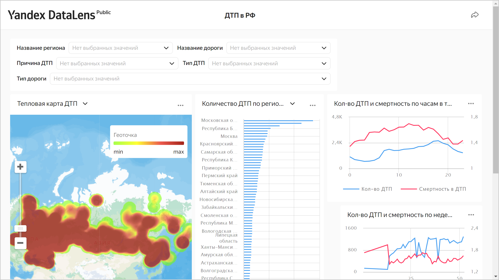

   You can share this link with your colleagues, partners, and friends. When opening the dashboard link, no authorization and authentication are required.

   

   You can enable or disable public access separately for each chart and dataset associated with the dashboard.

   

   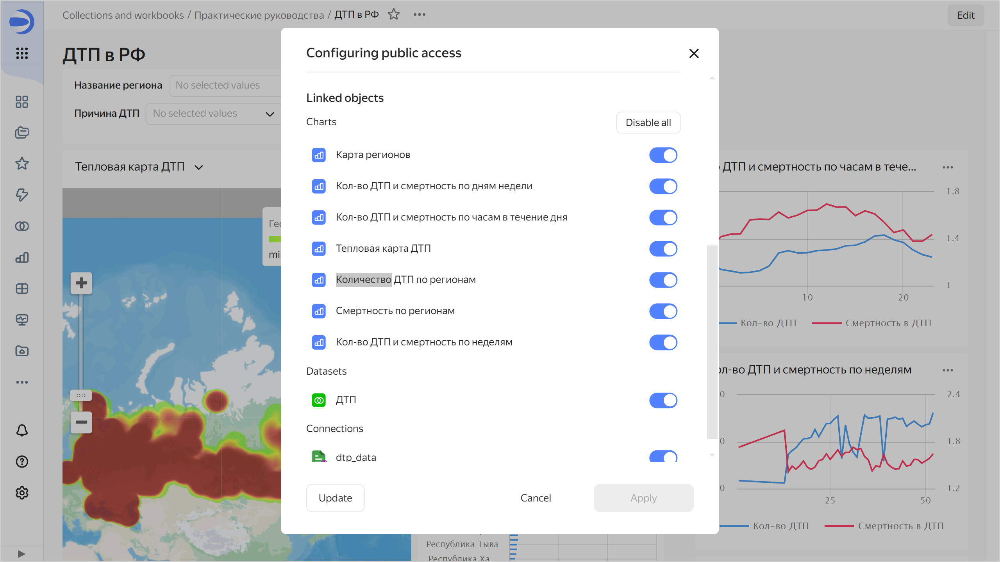

   

   

