# Analyzing public data on road accidents in Russia

This scenario analyzes public data on road accidents in Russia. In addition to identifying the facts of accident statistics in Russia, during the analysis you will learn how to:

* Work with the {{ datalens-short-name }} key entities: Connections, Datasets, Charts, and Dashboards.
* Combine multiple sources at the level of a single dataset.
* Use the `Date and time` data type and edit chart-level groupings.
* Work with geodata: geopoints and geopolygons.
* Create public dashboards that will be available to everyone from any device without authentication.

To visualize and explore data, [set up {{ datalens-short-name }}](#before-you-begin) and follow the steps below:

1. [Create a connection to a CSV file](#step1).
1. [Create a dataset and configure its fields](#step2).
1. [Create your first chart: a heat map](#step3).
1. [Create your second chart: a bar chart](#step4).
1. [Create line charts](#step5).
1. [Create a dashboard](#step6).
1. [Add charts to the dashboard](#step7).
1. [Add selectors and create a dashboard](#step8).
1. [Connect an additional source with region geolayers](#step9).
1. [Add new fields to the dataset](#step10).
1. [Create a chart using the new fields](#step11).
1. [Add a new chart to the dashboard](#step12).
1. [Publish the dashboard](#step13).

## Getting started {#before-you-begin}



## Step 1. Create a connection to a CSV file {#step1}

1. Download the [file with traffic accident statistics](https://storage.yandexcloud.net/doc-files/dtp201804-1.csv) for April-December 2018 in CSV format.

1. Open the [{{ datalens-short-name }}]({{ link-datalens-main }}) home page.
1. In the left-hand panel, select  **Connections** and click **Create connection**.
1. Select the **Files** connection type.

   

1. Click **Upload files** and select the downloaded file. It may take up to several minutes to load it, depending on the speed of your internet connection.

   

   Once loading is compete, you will see a preview of the file data. To view it, use the scroll bars on the right and at the bottom.

   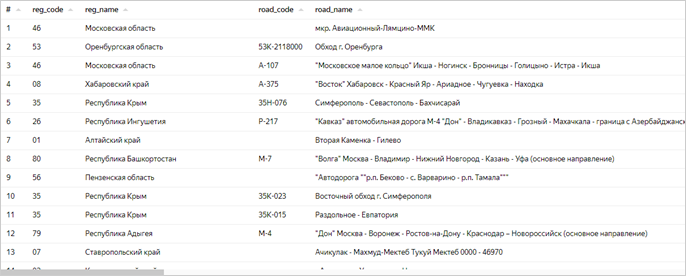

1. In the top-right corner, click **Create connection**.
1. Enter a name for the `dtp_data` connection and click **Create**.

This will create the file connection. The data will be shown in the same form as in the file. To use it, you need to create a dataset.

## Step 2. Create a dataset and configure its fields {#step2}

The dataset will consist of a single source: the CSV file.

1. Click **Create dataset**.

   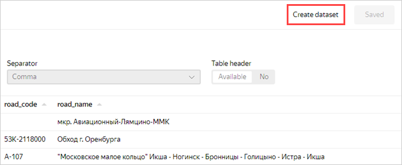

1. Go to the **Fields** tab.

   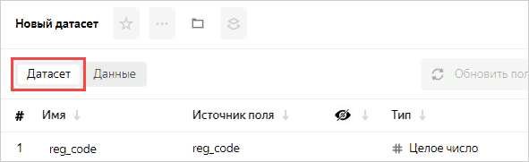

   You can add [data fields](../../datalens/dataset/data-model.md#field) and [calculated fields](../../datalens/concepts/calculations/index.md), change the field data type and aggregation rules, and rename fields.

   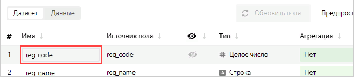

1. Change the field names to Russian ones in the following order:

   - Region code
   - Region name
   - Road code
   - Road name
   - Type of road
   - OKTMO code
   - Address
   - Accident type

   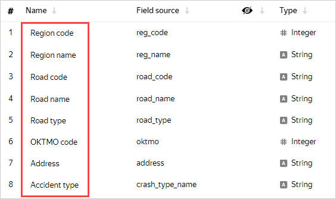

1. The accident date and time are shown in the following fields:

   - crash_date: Numeric date in `20190218` format.
   - crash_time: Time in `19:34` format.

   They will not be used in the dataset in this format. Click the visibility icon to hide them.

   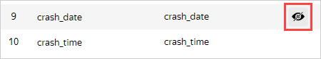

1. To display information about the accident date and time, add a new field.

   1. Click **Add field**.

      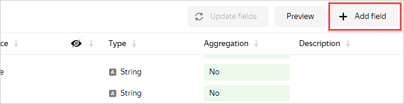

   1. Specify the following data for it:

      - **Field name**: Datetime
      - **Formula**: `DATETIME_PARSE(str([crash_date])+' '+str([crash_time]))`

      

      To avoid errors, select fields for the formula from the list on the left instead of entering them manually.

      

      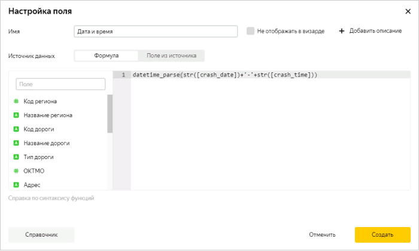

      

      To review the documentation for these functions yourself, click **Reference** at the top right.

      

   1. Click **Create**.

   The preview section now correctly displays the accident date and time as a value of the `Date and time` type with the **T** separator. The new **Date and time** field is at the top of the table. Click  to edit the field formula.

   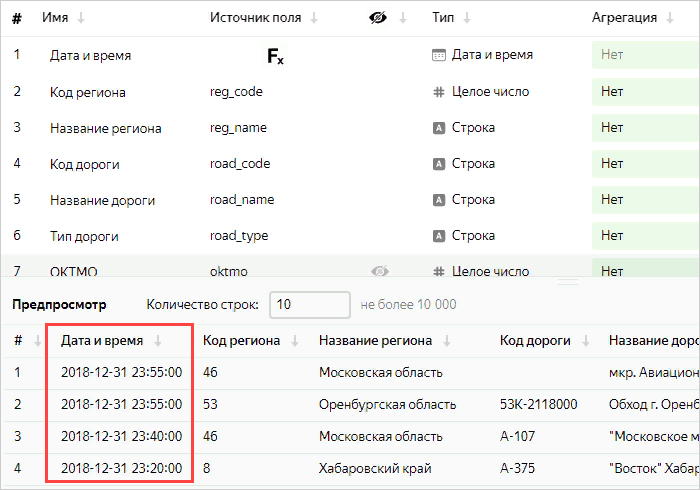

1. Continue renaming the fields in the following order:

   - Cause of accident
   - Death toll
   - Number of victims
   - Number of vehicles
   - Number of participants

   Set the **Sum** aggregation type for the following fields:

   - Death toll
   - Number of victims
   - Number of vehicles
   - Number of participants

   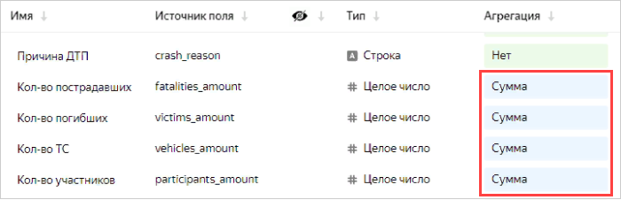

1. Add a field to display a geopoint.

   1. Click **Add field** at the top right.

      

   1. Enter data for the new field:

      - **Field name**: Geopoint
      - **Formula**: `GEOPOINT([latitude],[longitude])`

      Where [latitude] and [longitude] are dataset fields.

      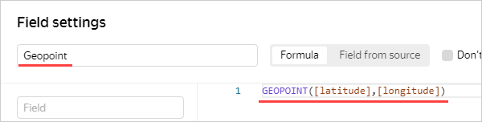

   1. Click **Create**.

      

      The example is based on ready-to-use data in coordinate format. 

      

   1. Make sure that the table and preview contain the new `Geopoint` type field.

      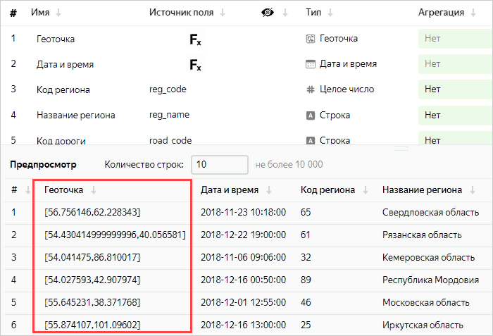

1. Add a field to display the number of accidents.

   1. Click **Add field**.

      

   1. Enter data for the new field:

      - **Field name**: Number of accidents
      - **Formula**: `SUM(1)`

      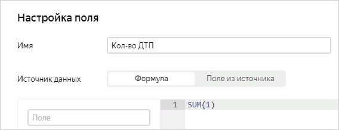

   1. Click **Create**.

   You do not need to set the aggregation type for this field: when you add it to the chart, {{ datalens-short-name }} applies the aggregation function automatically.

1. Add a field for data on deaths in road accidents.

   1. Click **Add field**.

      

   1. Enter data for the new field:

      - **Field name**: Accident death rate
      - **Formula**: `[Death toll]/[Number of accidents]`

      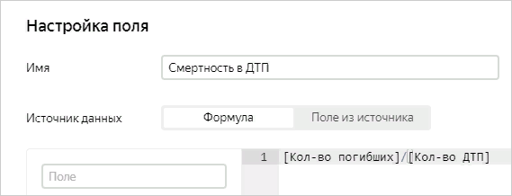

   1. Click **Create**

   

   You can create calculated fields directly in charts. However, it is more convenient to do this at the dataset level to make them available in all charts.

   

1. Save the dataset by clicking **Save** at the top right.

1. In the window that opens, specify the dataset name: **Accidents**. Click **Create**.

The dataset is created.

## Step 3. Create your first chart: a heat map {#step3}

Proceed to creating the first [chart](../../datalens/concepts/chart/index.md).

1. Click **Create chart**.

   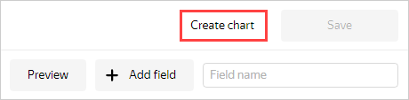

1. In the wizard window that opens, click the field that defaults to **Bar chart** and select the **Map** chart type.

   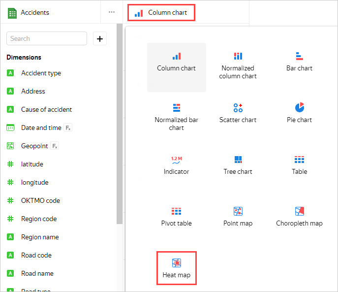

1. Under **Points**, select the **Points (heat map)** layer type.

   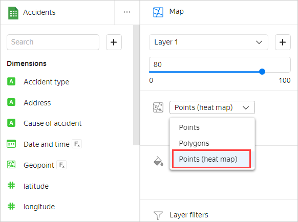

1. Drag the **Geopoint** field to the **Geopoints** section.

   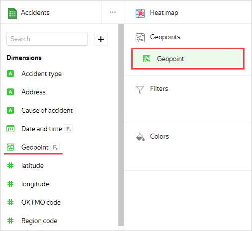

   That's your first chart on the map.

1. To save it, click the arrow icon next to the **Save** button and select **Save as**.

   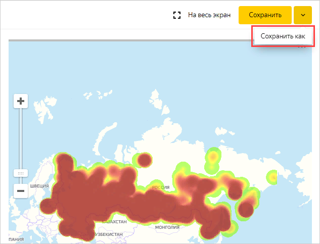

1. In the dialog box, specify the chart name, **Heat map**, and click **Save**.

## Step 4. Create your second chart: a bar chart {#step4}

1. Analyze the number of accidents by region.

   1. In the same window, select **Bar chart** as the chart type.

      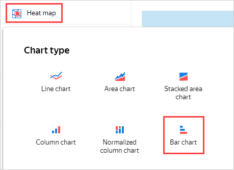

   1. Drag:

      - The **Region name** field to the **Y** section.
      - The **Number of accidents** field to the **X** section.
      - The **Number of accidents** field to the **Sorting** section.

      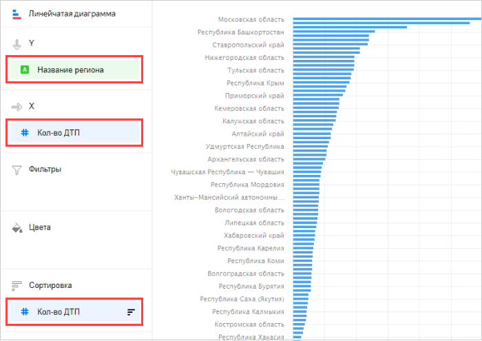

      The chart shows the number of accidents by region. Most accidents occurred in the Moscow region.

      

      The legend may be missing for some of the chart lines. If this is the case, hover over the line and you will see a tooltip with the region name.

      

   1. Click **Save as** to save the chart.

   1. In the window that opens, specify the chart name, **Number of accidents by region**, and save it.

1. Analyze the death rate in accidents by region.

   1. Replace the **Number of accidents** measure with **Accident death rate** by dragging and dropping.

      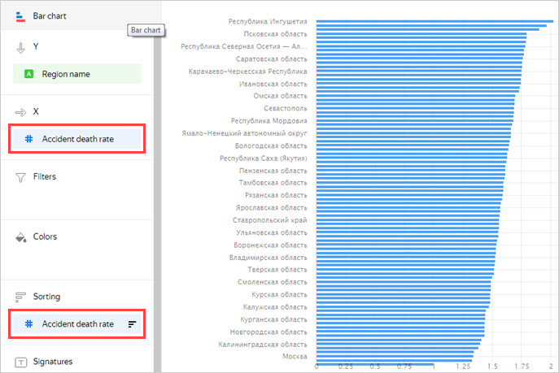

      This time, Ingushetia, Kalmykia, and the Volgograd region are far ahead in the number of deaths.

   1. Save the chart by clicking **Save as** and name it **Death rate by region**.

## Step 5. Create more charts: line charts {#step5}

Let's see how the number of accidents and related deaths are distributed by week, day of the week, and time of day.

1. Analyze the number of accidents and death rate by week.

   1. In the same window, select **Line chart** as the chart type.

      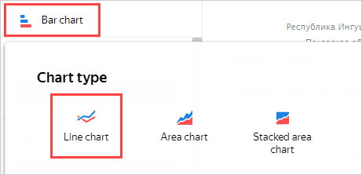

   1. The chart management sections contain the previous values. Delete them by clicking .

   1. Drag the **Date and time** field to the **X** section and click the green calendar icon.

      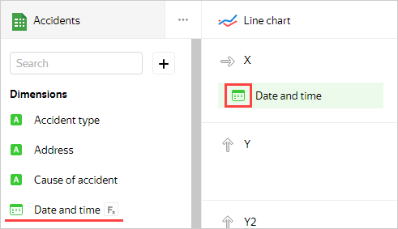

   1. In the **Grouping** field, choose **Date part** ⟶ **Week** and click **Apply**.

      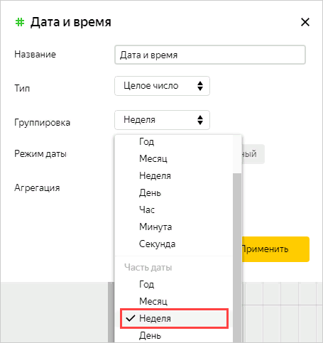

   1. Drag:
      - The **Number of accidents** field to the **Y** section.
      - The **Accident death rate** field to the **Y2** section.

      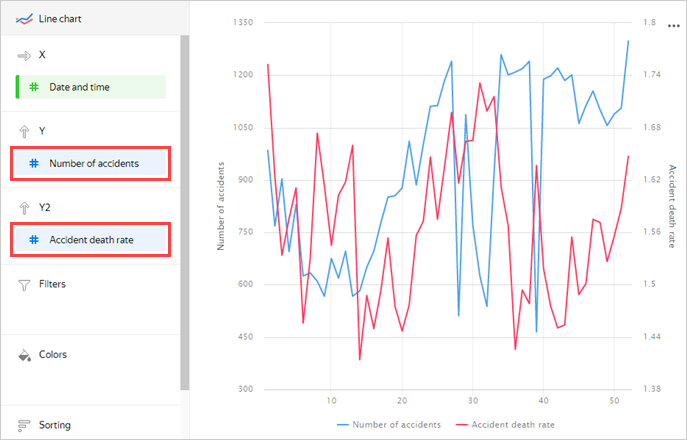

      Now you can see a chart with two graphs: the number of accidents and death rate. If you hover over a point on the chart, a tooltip appears with specific values.

   1. Save the chart by clicking **Save as** and name it **Number of accidents and death rate by week**.

1. Now analyze the number of accidents and death rate by day of the week.

   1. Change grouping by date and time to **Date part** ⟶ **Day of week**.

      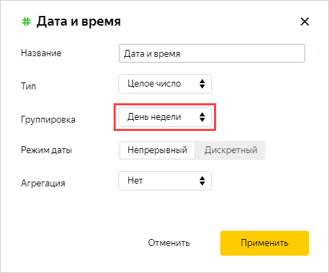

      This chart shows more obvious trends.

      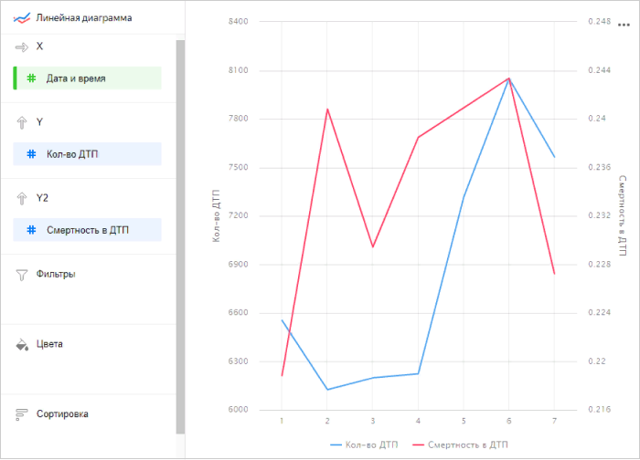

   1. Save the chart by clicking **Save as** and name it **Number of accidents and death rate by day of week**.

1. Analyze the number of accidents and death rate by hour of day.

   1. Change grouping by date and time by specifying: **Date part** ⟶ **Hour**.

      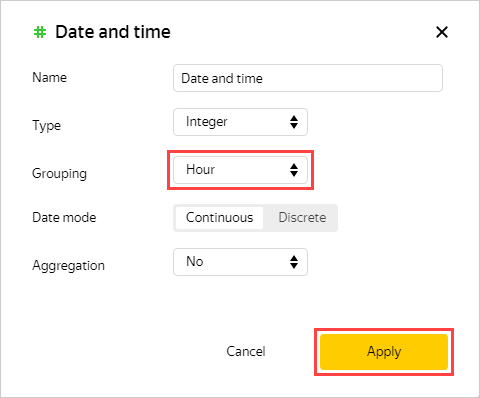

      The chart shows that less accidents occur at night, but they result in more casualties.

      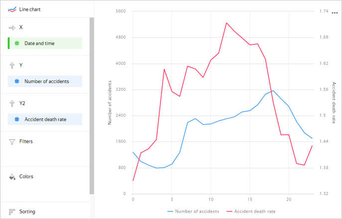

   1. Save the chart by clicking **Save as** and name it **Number of accidents and death rate by hour of day**.

## Step 6. Create a dashboard {#step6}

1. Open the menu by clicking the icon to the left of the logo and select **Dashboards**.

   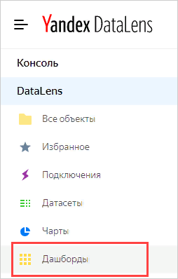

1. Click **Create dashboard**.

   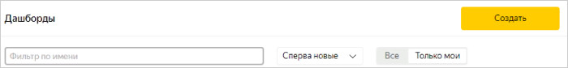

## Step 7. Add charts to the dashboard {#step7}

1. Add the first chart.

   1. Click **Add** and select **Chart** from the drop-down list.

      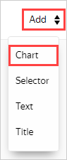

   1. In the **Chart** field, click **Select** and select the previously created **Heat Map** chart from the chart list.

      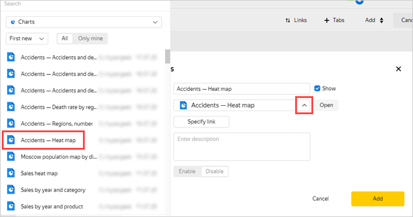

   1. Click **Add**.

      The chart is displayed on the dashboard.

1. Repeat the previous three steps for the **Number of accidents by region**, **Number of accidents and death rate by week**, **Number of accidents and death rate by day of week**, and **Number of accidents and death rate by hour of day** charts by adding them to the dashboard.

1. Create a switch for the **Number of accidents by region** and **Death rate by region** charts on the dashboard.

   1. Click the **Number of accidents by region** chart settings icon to open them.

      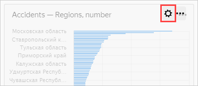

   1. Click **Add** to the left of the screen.

      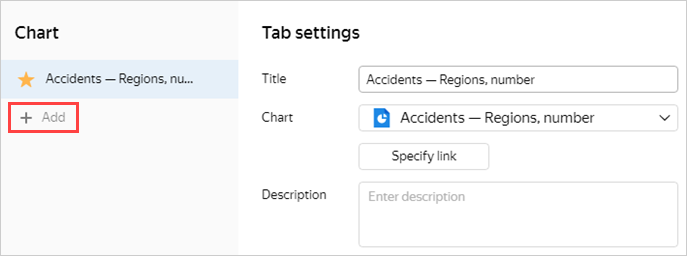

   1. In the **Chart** field, click **Select** and choose the **Death rate by region** chart.

      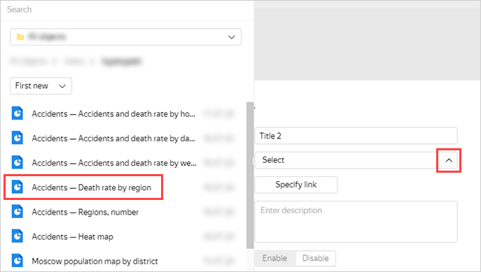

   1. Click **Save**.

## Step 8. Add selectors and create a dashboard {#step8}

[Selectors](../../datalens/concepts/dashboard.md#selector) allow you to filter data by value.

1. Add a selector to show statistics by region name.

   1. Click **Add** and choose **Selector**.

      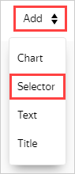

   1. Select **Based on dataset**, click **Select**, and choose the previously created **Accidents** dataset.

      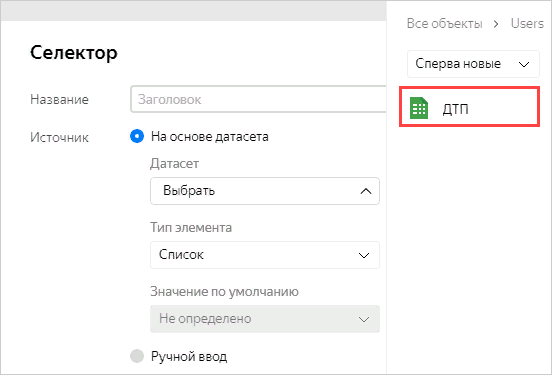

   1. In the **Field** property, choose **Region name** and select **Show** next to the selector name. Click **Add**.

      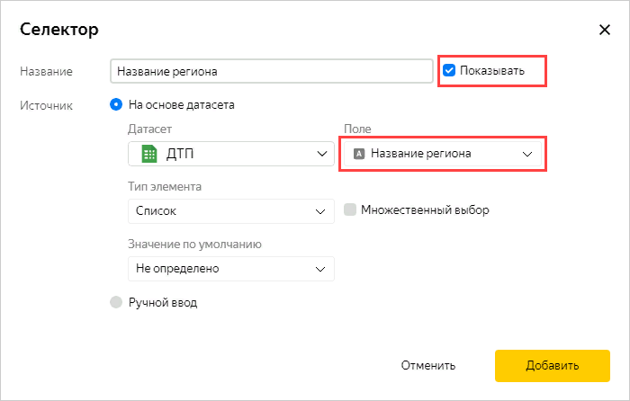

   The selector will be displayed on the dashboard as a rectangle.

1. Repeat the previous three steps for the fields:

   - Cause of accident
   - Accident type
   - Type of road
   - Road name

1. You can drag and resize dashboard elements. Place the elements according to the screenshot or however is convenient for you and save the dashboard:

   1. In the top-right corner of the dashboard, click **Save**.
   1. Name the dashboard **Accidents in Russia** and click **Create**.

   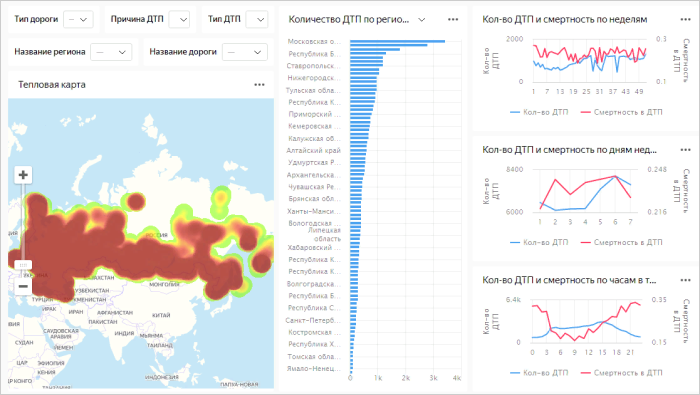

If you choose any values in the selectors, the charts will display data for these values.

You can switch the **Number of accidents by region** chart to **Death rate by region**.

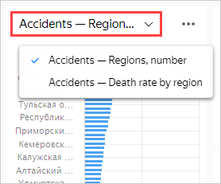

## Step 9. Add a table with region geolayers {#step9}

Sometimes, heat maps are not very informative. Upload the polygon reference and add a chart with a color fill for Russian regions.

1. Download the [**Regions.csv**](https://storage.yandexcloud.net/doc-files/Regions.csv) file.
1. Open the `dtp_data` connection.
1. Click **Upload files** and select the downloaded file.
1. Take a look at a preview of the file data. For the **Column header** parameter, set the **Yes** value.

   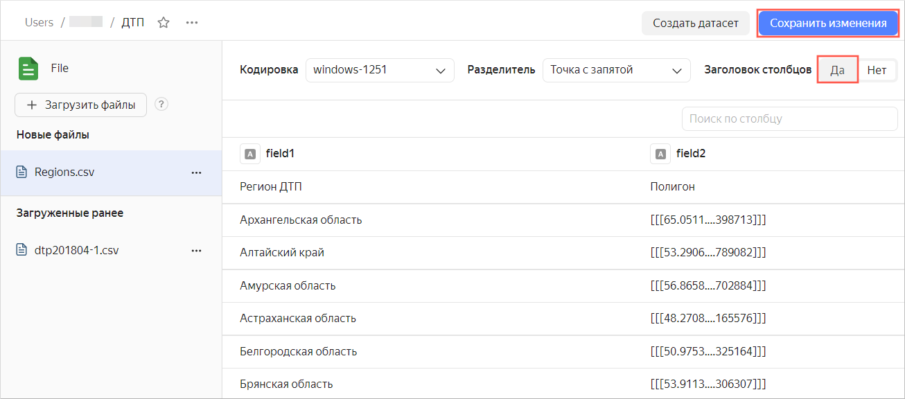

1. At the top right, click **Save changes**.

## Step 10. Add new fields to the dataset {#step10}

You need to add new fields to the previously created **Accidents** dataset.

1. In the left menu, select **Datasets**.

   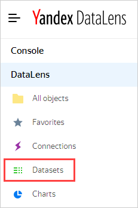

1. Choose the **Accidents** dataset.

   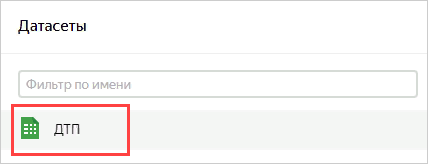

1. Go to the **Sources** tab.
1. Drag the new table **Regions.csv** to the editing area.

   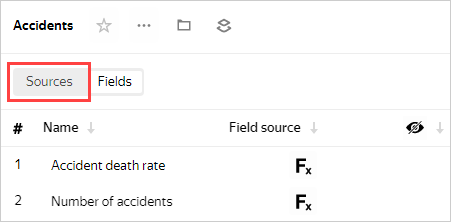

   Since the charts data has not yet been merged, an error message may appear. Follow these steps:

1. Click the merge data icon.

   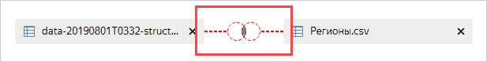

1. Click **Add link**.

   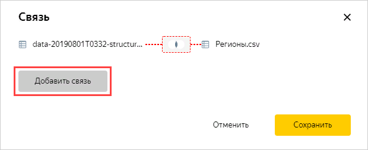

1. Select the fields to link: **reg_name** and **Accident region**. Then click **Apply**.

   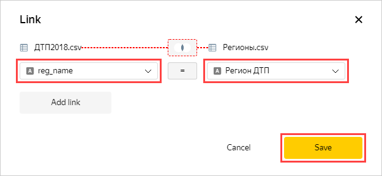

   Make sure the data preview is displayed correctly.

   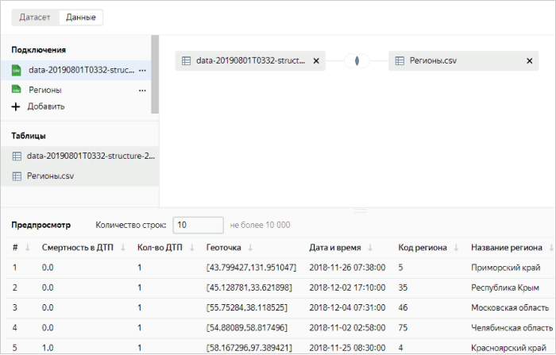

1. Go to the **Fields** tab.
1. New fields are displayed at the bottom of the list. For the **Polygon** field, specify the **Geopolygon** data type.

   

1. In the top-right corner, click **Save**.

## Step 11. Create a chart using the new fields {#step11}

1. Click **Create chart**.

   

1. Select the **Map** chart type.

   

1. Add polygons to the map. Drag the **Polygon** field from **Dimensions** to the **Geopolygons** section.

1. Change colors of the polygons based on the number of accidents. Drag the **Number of accidents** field from **Measures** to the **Colors** section.

1. Drag the following fields to the **Tooltips** section:

   - Region name
   - Number of accidents
   - Death toll
   - Number of victims
   - Number of vehicles
   - Number of participants
   - Accident death rate

   The chart shows a map with a color fill for regions. If you hover over a region, information for that region appears.

   

1. In the top-right corner, click **Save**.

1. Enter a chart name, **Map of regions**, and click **Save** once again.

## Step 12. Add a new chart to the dashboard {#step12}

1. Select **Dashboards** in the top-left menu.

   

1. Select the previously created dashboard with accident data.

   

1. Click **Edit** at the top right.

   

1. Click the **Heat map** settings icon to open them.

   

1. Click **Add** to the left of the screen.

   

1. In the **Chart** field, click **Select** and choose the last chart named **Map of regions**.

   

1. Click **Save**.

You can now switch the type of map data visualization: heat map or region fill.

## Step 13. Publish the dashboard {#step13}

To configure public access to the dashboard:

1. In the top-left corner, click .

   

1. Select **Public access** in the drop-down menu.

   

1. Enable access via link. You can copy and share the link that appears. Everyone can use the link to access the dashboard from any device and without authentication. Click **Apply**.

   

   

   You can enable or disable public access separately for each chart and dataset associated with the dashboard.

   

   The dashboard is published and available to users.

   
