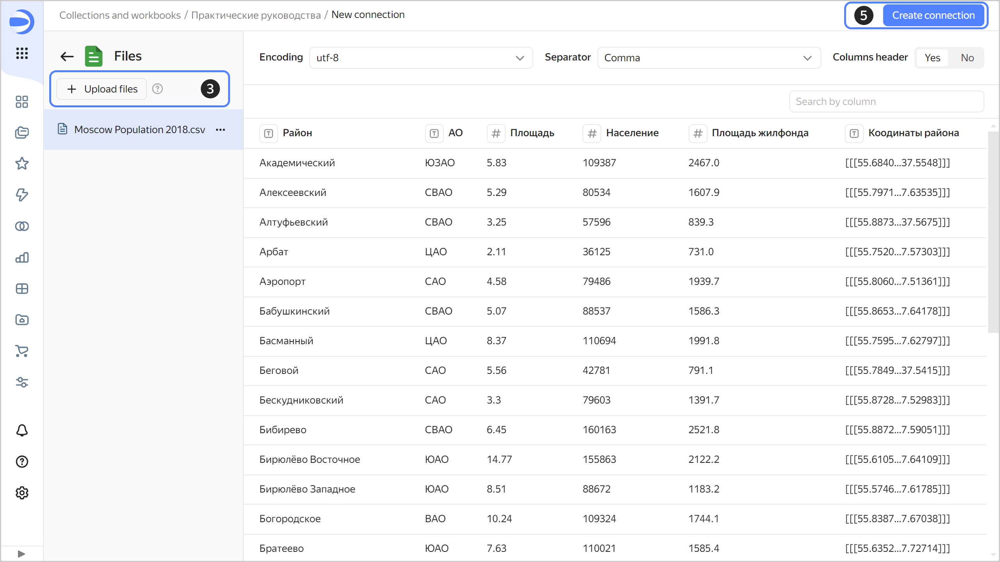
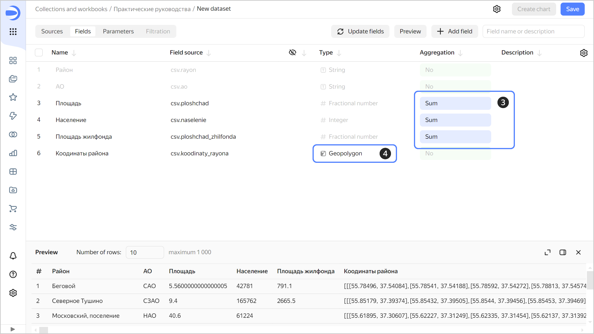
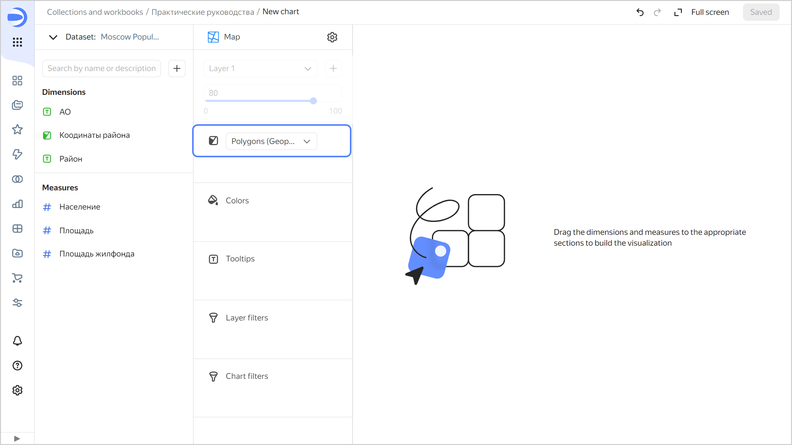
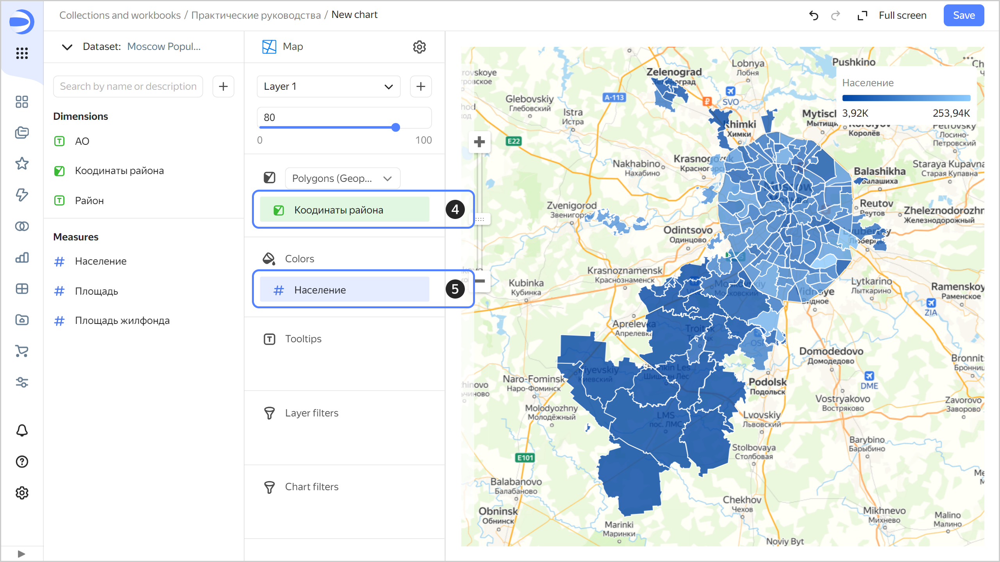
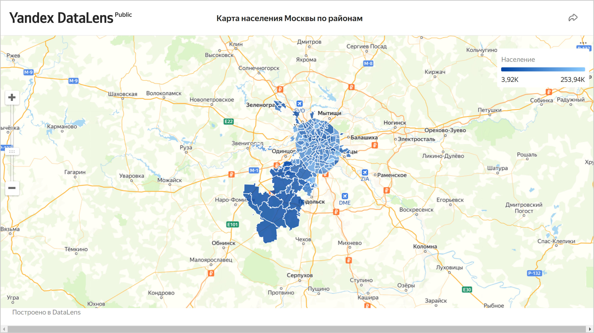

# Public chart with a map of Moscow from a CSV file



In {{ datalens-short-name }}, you can grant [public access](../../datalens/concepts/datalens-public.md) to your charts and dashboards.



Before publishing, make sure your charts and dashboards contain no personal data or trade secrets. Access to published data is not restricted.



In this tutorial, we will use {{ datalens-short-name }} to visualize and publish Moscow population metrics on the map of Moscow districts.

We will use the `Moscow Population 2018.csv` file as the data source on Moscow population and area in 2018. [Download](https://storage.yandexcloud.net/doc-files/Moscow%20Population%202018.csv) it before you proceed with this guide. Source: [List of Moscow districts and settlements](https://ru.wikipedia.org/wiki/%D0%A1%D0%BF%D0%B8%D1%81%D0%BE%D0%BA_%D1%80%D0%B0%D0%B9%D0%BE%D0%BD%D0%BE%D0%B2_%D0%B8_%D0%BF%D0%BE%D1%81%D0%B5%D0%BB%D0%B5%D0%BD%D0%B8%D0%B9_%D0%9C%D0%BE%D1%81%D0%BA%D0%B2%D1%8B).

To visualize and explore data, [set up {{ datalens-short-name }}](#before-you-begin) and follow the steps below:

1. [Create a workbook](#create-workbook).
1. [Create a connection](#create-connection).
1. [Create a dataset](#create-dataset).
1. [Create a chart with a map of Moscow districts](#create-map-chart).
1. [Publish the chart](#publish-chart).

## Getting started {#before-you-begin}



## Create a workbook {#create-workbook}

1. Go to the {{ datalens-short-name }} [home page]({{ link-datalens-main }}).
1. In the left-hand panel, select  **Collections and workbooks**.
1. In the top-right corner, click **Create** → **Create workbook**.
1. Enter a name for the [workbook](../../datalens/workbooks-collections/index.md): `Tutorials`.
1. Click **Create**.

## Create a connection {#create-connection}

Create a [connection](../../datalens/concepts/connection.md) to the source data file.

1. In the top-right corner of the workbook, click **Create** →  **Connection**.
1. Under **Files and services**, select the **Files** connection.
1. Click **Upload files**.
1. Select **Moscow Population 2018.csv**.

   Wait until the table content appears on the screen. It may take up to several minutes to load it, depending on the speed of your internet connection.

1. Click **Create connection**.

   

1. Enter `Moscow Population 2018` for connection name and click **Create**.

This will create the file connection. The data will be shown in the same form as in the file. To use it, you need to create a dataset.

## Create a dataset {#create-dataset}

Create a [dataset](../../datalens/dataset/index.md) based on the `Moscow Population 2018` connection:

1. In the top-right corner of the connection page, click **Create dataset**.
1. In the dataset, go to the **Fields** tab.
1. For the `Area`, `Population`, and `Housing stock` fields, specify **Sum** as the aggregation type. The fields with defined aggregation functions become measures and change their color to blue.
1. For the `District coordinates` field, change the data type to **Geopolygon**: select **Geopolygon** in the **Type** column.

   

1. Save the dataset:

   1. In the top-right corner, click **Save**.
   1. Enter `Moscow Population dataset` for the dataset name and click **Create**.

## Create a chart with a map of Moscow districts {#create-map-chart}

Create a [heat map](../../datalens/visualization-ref/choropleth-map-chart.md) [chart](../../datalens/concepts/chart/index.md) to visualize the distribution of population across Moscow districts:

1. On the dataset page, click **Create chart** in the top-right corner.
1. Select the **Map** visualization type.

   

1. Select **Polygons (Geopolygons)** as the layer type.

   

1. Add polygons of districts to the map. To do this, drag the `Coordinates` field from **Dimensions** to **Polygons (Geoplygons)**.
1. Change the district colors based on the population. Drag the `Population** field from **Measures` to the **Colors** section.

   

1. Save the chart:

   1. In the top-right corner, click **Save**.
   1. In the window that opens, enter `Moscow population map by district` as the chart name and click **Save**.

      

## Publish the chart {#publish-chart}

1. At the top of the screen, click  →  **Public access**.
1. In the window that opens, enable the link sharing option next to the chart name.
1. Click **Continue** to confirm the publication of the chart and its linked data.
1. Click **Copy link** to copy the chart's unique URL.

   

1. Click **Apply**.
1. Open a new tab in the browser and go to the copied link.

   

You can share this link with your colleagues, partners, and friends. When opening the chart link, authorization and authentication are not required.

**Also try**:

* Building a column chart by district and population.

  

  

  

* [Creating a dashboard](../../datalens/operations/dashboard/create.md) with a map, bar chart, and [selectors](../../datalens/operations/dashboard/add-selector.md).
* [Publishing a dashboard](../../datalens/concepts/datalens-public.md#how-to-publish).
