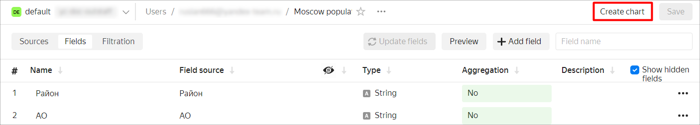
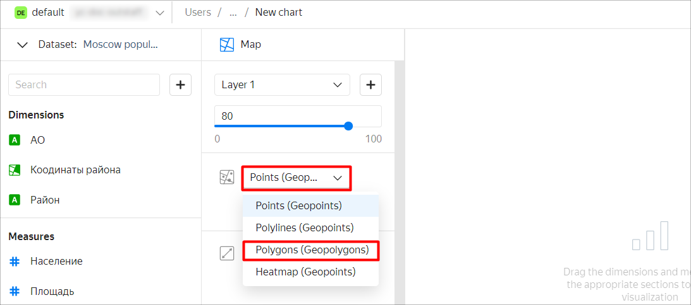
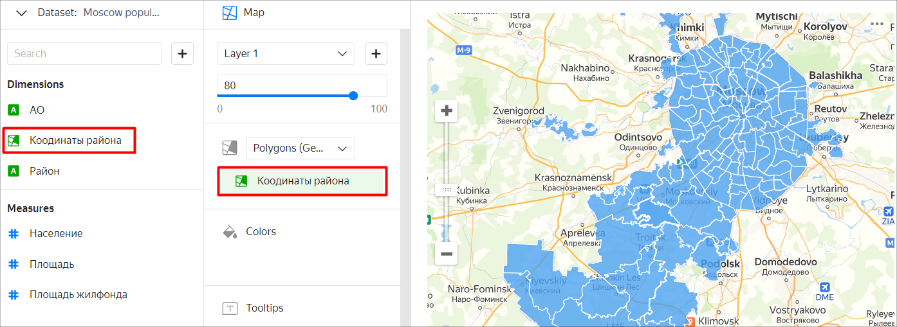
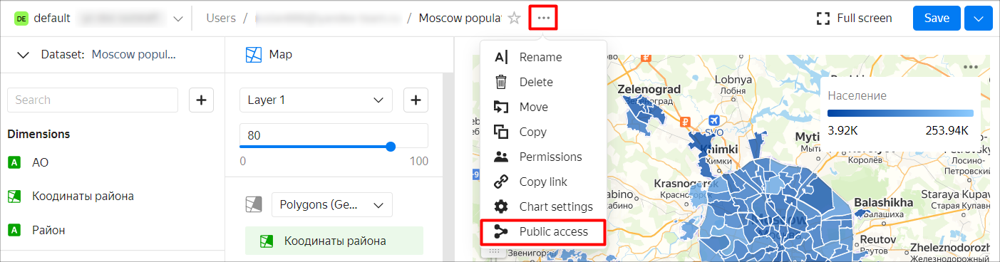
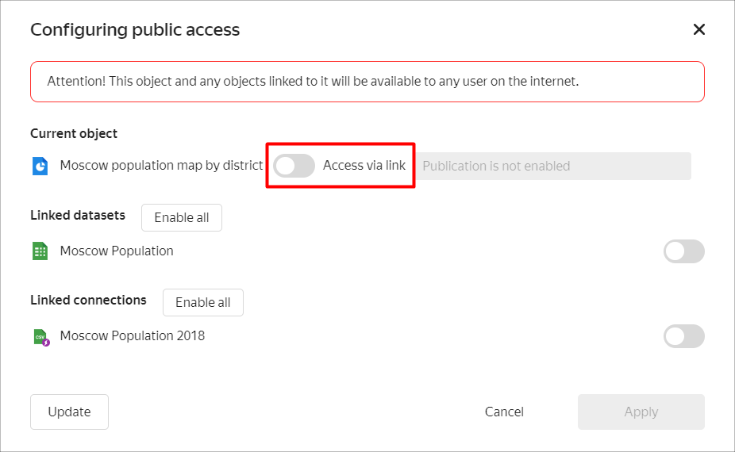
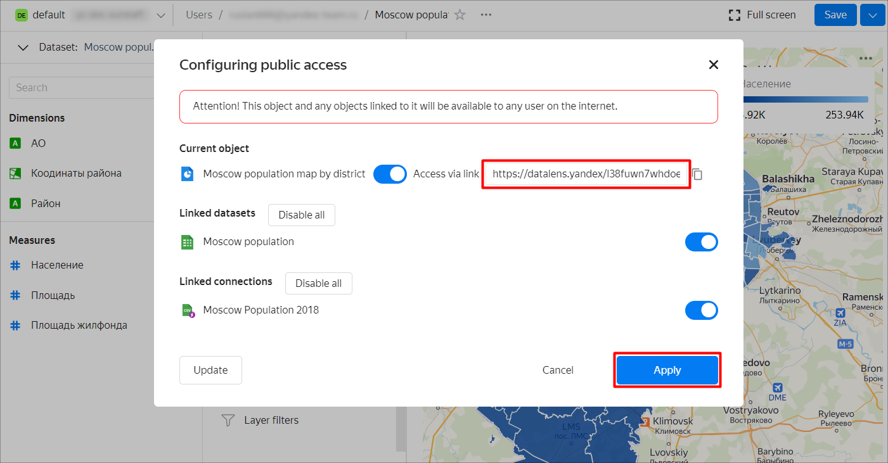
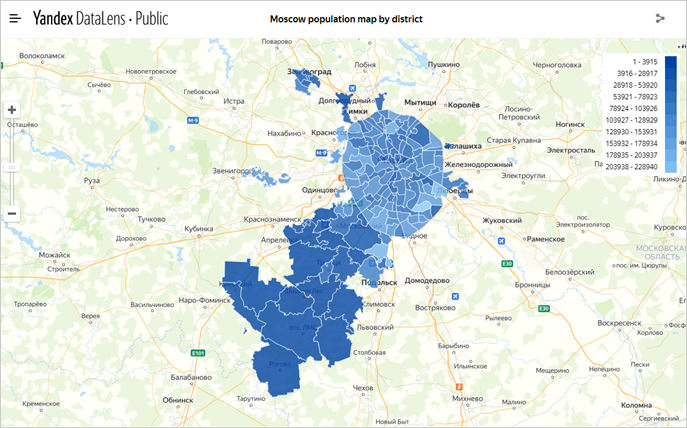

# Creating and publishing a chart with a map of Moscow from a CSV file

You can use {{ datalens-short-name }} to grant public access to your charts and dashboards.



Before publishing your own data, make sure that your charts and dashboards do not contain personal data or trade secrets. Access to published data is not restricted.



In this tutorial, we will use {{ datalens-short-name }} to visualize and publish Moscow population metrics on the map of Moscow districts.

We will use the [Moscow Population 2018.csv](https://storage.yandexcloud.net/doc-files/Moscow%20Population%202018.csv) file as the source of data on Moscow population and area for 2018. Source: [List of districts and settlements in Moscow](https://ru.wikipedia.org/wiki/%D0%A1%D0%BF%D0%B8%D1%81%D0%BE%D0%BA_%D1%80%D0%B0%D0%B9%D0%BE%D0%BD%D0%BE%D0%B2_%D0%B8_%D0%BF%D0%BE%D1%81%D0%B5%D0%BB%D0%B5%D0%BD%D0%B8%D0%B9_%D0%9C%D0%BE%D1%81%D0%BA%D0%B2%D1%8B).

To visualize and explore data, [set up {{ datalens-short-name }}](#before-you-begin) and follow the steps below:

1. [Create a connection](#step1).
1. [Create a dataset](#step2).
1. [Create a chart with a map of Moscow districts](#step3).
1. [Publish the chart](#step4).

## Getting started {#before-you-begin}



## Step 1. Create a connection and dataset {#step1}

Create a dataset based on the **Files** [connection](../../datalens/concepts/connection.md) type.

1. Go to the [{{ datalens-short-name }}]({{ link-datalens-main }}) interface.
1. In the left-hand panel, select  **Connections** and click **Create connection**.
1. Select the **Files** connection type.

   

1. Click **Upload files** and select the file to be uploaded. For this example, use **Moscow Population 2018.csv** ([download link](https://yadi.sk/d/H4dQKVDpU4Rd8g)). It may take up to several minutes to load it, depending on the speed of your internet connection.

   

   Once loading is compete, you will see a preview of the file data. To view it, use the scroll bars on the right and at the bottom.

   

1. In the top-right corner, click **Create connection**.
1. Enter `Moscow Population 2018` as the connection name and click **Create**.

This will create the file connection. The data will be shown in the same form as in the file. To use it, you need to create a dataset.

1. Click **Create dataset**.

   

## Step 2. Create a dataset {#step2}

1. If the workspace is empty, drag the **Moscow Population 2018.csv** spreadsheet from the selection panel to the workspace.

   

1. Go to the **Fields** tab.

   

1. For the **Area**, **Population**, and **Housing stock** fields, specify **Sum** as the aggregation type.

   

   The fields with the defined aggregate functions become measures and change their color to blue.

   

1. For the **District coordinates** field, change the data type to **Geopolygon**.

   

1. In the top-right corner, click **Save**.

   

1. In the window that opens, enter **Moscow population** as the dataset name and click **Create**.

1. When the dataset is saved, click **Create chart**.

   

## Step 3. Create a chart with a map of various Moscow districts {#step3}

1. Select the **Map** visualization type.

   

1. Select **Polygons (Geopolygons)** as the layer type.

   

1. Add polygons of districts to the map. To do this, drag the **Coordinates** field from **Dimensions** to the **Polygons (Geoplygons)** section.

   

1. Change the district colors based on the population. Drag the **Population** field from **Measures** to the **Colors** section.

   

1. In the top-right corner, click **Save**.

   

1. In the window that opens, enter **Moscow population map by district** as the chart name and click **Save**.

## Step 4. Publish the chart {#step4}

1. Click  and select **Public access** in the list that opens.

   

1. In the **Public access settings** window that opens, enable **Access via link**.

   

1. Confirm publication of the chart and its linked data.

1. Copy the unique URL of the chart. Click **Apply**.

   

1. Open a new tab in the browser and go to the copied link.

   

You can share this link with your colleagues, partners, and friends. When opening the chart link, authorization and authentication are not required.

**Also try:**

* Building a column chart by district and population.
* [Creating a dashboard](../../datalens/operations/dashboard/create.md) with a map, bar chart, and [selectors](../../datalens/operations/dashboard/add-selector.md).
* [Publishing a dashboard](../../datalens/concepts/datalens-public.md#how-to-publish).
