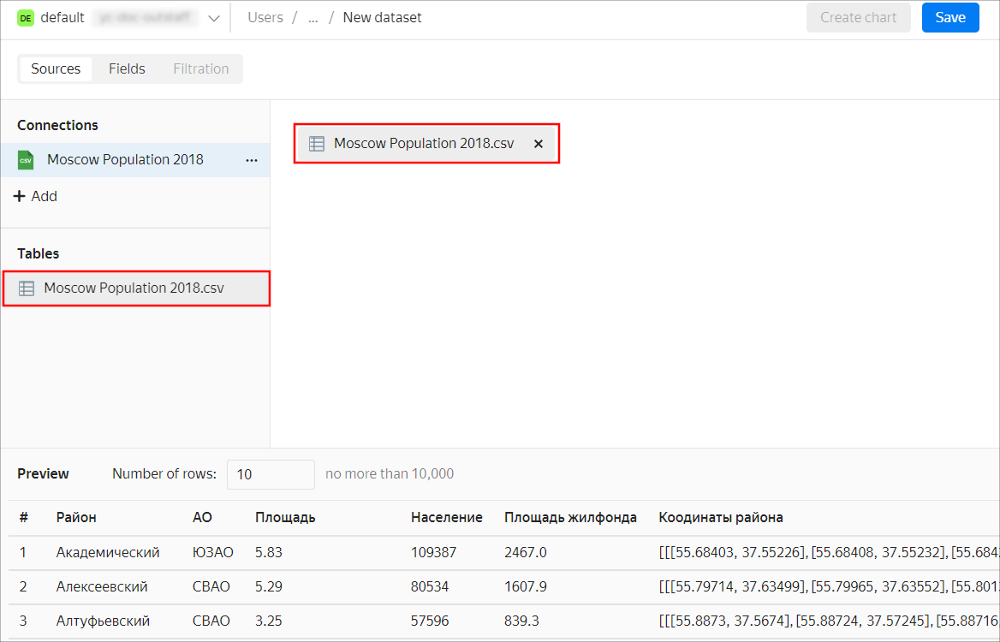
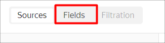
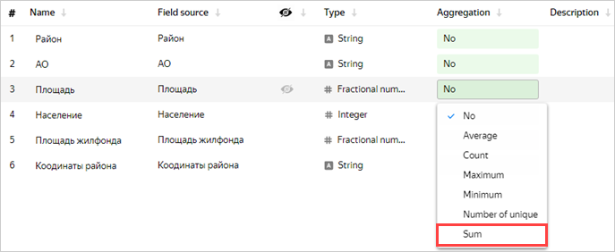
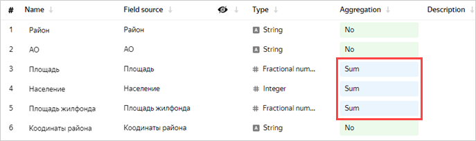
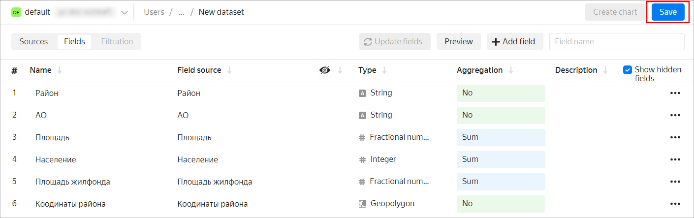
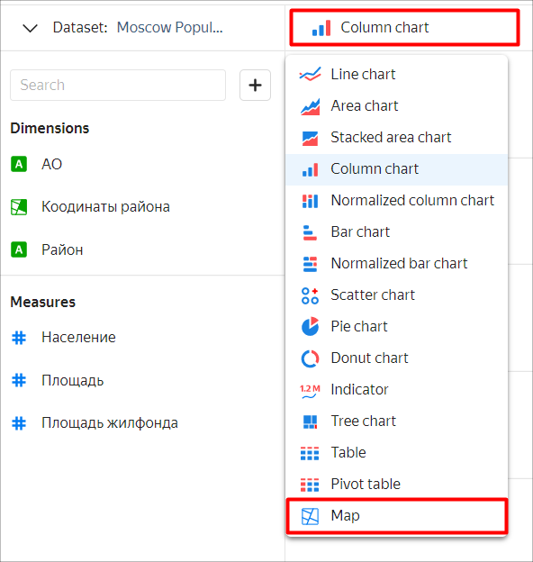
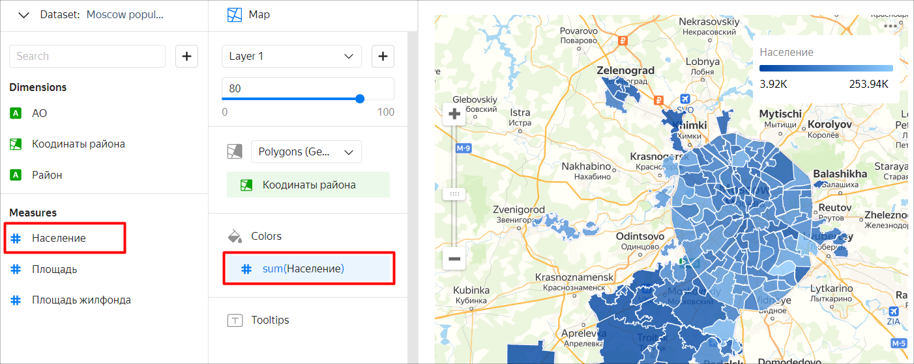

# Creating and publishing a chart with a map of Moscow from a CSV file

You can use {{datalens-short-name }} to grant public access to your charts and dashboards.



Before publishing your own data, make sure that your charts and dashboards don't contain personal data or trade secrets. Access to published data is not restricted.



In this scenario, we'll use {{ datalens-short-name }} to visualize the measures of the Moscow population on the Moscow district map and publish them to DataLens Public.

The file [Moscow Population 2018.csv](https://yadi.sk/d/H4dQKVDpU4Rd8g) is used as the source of data on the Moscow population and area for 2018. Source: [List of districts and settlements in Moscow](https://ru.wikipedia.org/wiki/%D0%A1%D0%BF%D0%B8%D1%81%D0%BE%D0%BA_%D1%80%D0%B0%D0%B9%D0%BE%D0%BD%D0%BE%D0%B2_%D0%B8_%D0%BF%D0%BE%D1%81%D0%B5%D0%BB%D0%B5%D0%BD%D0%B8%D0%B9_%D0%9C%D0%BE%D1%81%D0%BA%D0%B2%D1%8B).

To visualize and analyze data, [set up {{ datalens-short-name }}](#before-you-begin) and follow these steps:

1. [Create a connection](#step1).
1. [Create a dataset](#step2).
1. [Create a chart with a map of the various Moscow districts](#step3).
1. [Publish the chart to DataLens Public](#step4).

## Before you start {#before-you-begin}



## Step 1. Create a connection and a dataset {#step1}

Create a dataset based on the [connection](../../datalens/concepts/connection.md) to the CSV file.

1. Go to the [{{ datalens-short-name }}]({{ link-datalens-main }}) home page.

1. Click **Create connection**.

    

1. Choose **CSV**.

    

1. Click **Select CSV file**.

    

1. Select a file. For this example, use **Moscow Population 2018.csv** ([download link](https://yadi.sk/d/H4dQKVDpU4Rd8g)).

1. Wait until the table content appears on the screen.

1. Click **Create**.

    

1. After the connection is created, click **Create dataset**.

    

## Step 2. Create a dataset {#step2}

1. If the workspace is empty, drag the **Moscow Population 2018.csv** spreadsheet from the selection panel to the workspace.

    

1. Go to the **Fields** tab.

    

1. For the fields **Area**, **Population**, and **Housing stock**, specify **Sum** as the aggregation type.

    

    The fields with the defined aggregate functions become measures and change their color to blue.

    

1. For the **District coordinates** field, change the data type to **Geopolygon**.

    

1. In the upper-right corner, click **Save**.

    

1. In the resulting window, enter **Moscow population** as the name for the dataset and click **Create**.

1. When the dataset is saved, click **Create chart**.

    

## Step 3. Create a chart with a map of Moscow districts {#step3}

1. Select the **Map** visualization type.

    

1. Select **Polygons (Geopolygons)** as the layer type.

   

1. Add polygons of districts to the map. To do this, drag the **District coordinates** field from the **Dimensions** to the **Polygons (Geoplygons)** section.

    

1. Change the district colors based on the population. Drag the **Population** field from the **Measures** section to the **Colors** section.

    

1. In the upper-right corner, click **Save**.

    

1. In the window that opens, enter the name **Moscow population map by district** for the chart and click **Save**.

## Step 4. Publish the chart to DataLens Public {#step4}

1. Click  and in the resulting list, select **Public access**.

    

1. In the resulting **Public access settings** window, enable **Access via link**.

    

1. Confirm publication of the chart and its linked data.

1. Copy the unique URL of the chart. Click **Apply**.

    

1. Open a new tab in the browser and go to the copied link.

    

You can share this link with your colleagues, partners, and friends. DataLens Public doesn't require authorization or authentication when the user follows the chart link.

**Also try:**

- Building a column chart by district and population.
- [Creating a dashboard](../../datalens/operations/dashboard/create.md) with a map, a column chart, and [selectors](../../datalens/operations/dashboard/add-selector.md).
- [Publishing a dashboard](../../datalens/operations/dashboard/publish.md).

