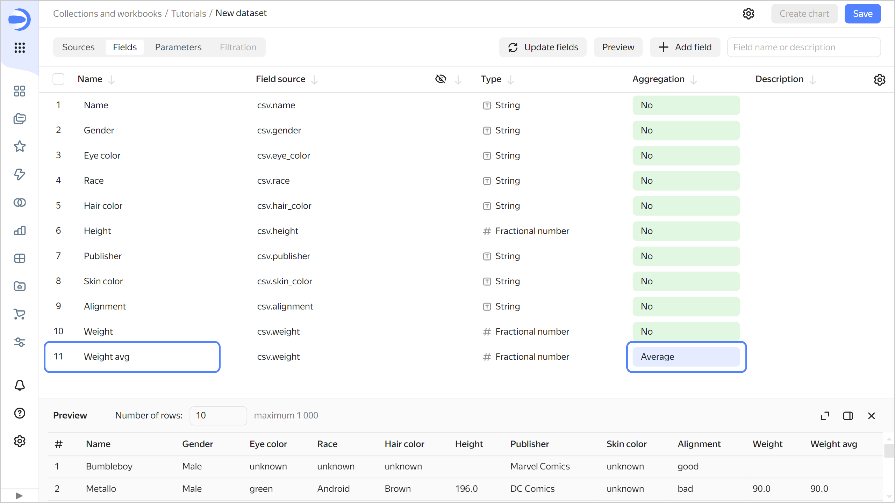
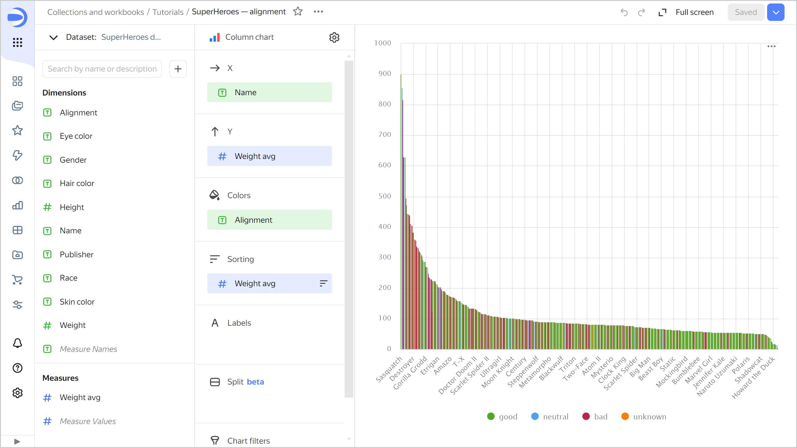
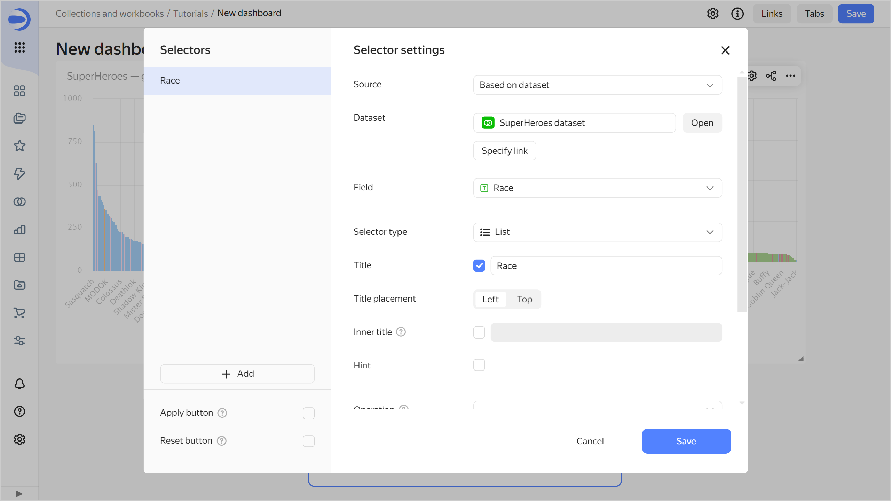

# Simple dashboard from a CSV file



This guide demonstrates how to use {{ datalens-short-name }} to analyze dependencies, for example:

* Superhero's weight depending on gender.
* Superhero's weight depending on whether they are good or bad.

For source data, we are going to use the `SuperHeroes.csv` file with data about the superheroes: name, gender, race, comics publisher, etc. [Download](https://storage.yandexcloud.net/datalens/SuperHeroes.csv) it before going through the guide.

To visualize and explore data, [set up {{ datalens-short-name }}](#before-you-begin) and follow the steps below:

1. [Create a workbook](#create-workbook).
1. [Create a connection](#create-connection).
1. [Create a dataset](#create-dataset).
1. [Create the first chart](#create-column-chart1).
1. [Create the second chart](#create-column-chart2).
1. [Create a dashboard and add charts to it](#create-dashboard).
1. [Add selectors to the dashboard](#add-selectors).
1. [Start analyzing superhero dependencies and data](#search-on-dashboard).

## Getting started {#before-you-begin}



## Create a workbook {#create-workbook}

1. Go to the {{ datalens-short-name }} [home page]({{ link-datalens-main }}).
1. In the left-hand panel, select  **Collections and workbooks**.
1. In the top-right corner, click **Create** → **Create workbook**.
1. Enter a name for the [workbook](../../datalens/workbooks-collections/index.md): `Tutorials`.
1. Click **Create**.

## Create a connection {#create-connection}

Create a [connection](../../datalens/concepts/connection.md) to the source data file.

1. In the top-right corner of the workbook, click **Create** →  **Connection**.

1. Under **Files and services**, select the **Files** connection.
1. Click **Upload files**.
1. Select the **SuperHeroes.csv** file. Wait until the table content appears on the screen.
1. Click **Create connection**.

   

1. Enter `SuperHeroes` for the connection name and click **Create**.

## Create a dataset {#create-dataset}

Create a [dataset](../../datalens/dataset/index.md) based on the `SuperHeroes` connection:

1. In the top-right corner of the connection page, click **Create dataset**.
1. Go to the **Fields** tab.
1. Create a field for the superheros's average weight:

   1. Duplicate the `Weight` field: on the right side of the row with the field, click  and select **Duplicate**.
   1. Rename the `Weight (1)` duplicate field as `Weight avg`: click the field name, delete the current name, and enter the new one.
   1. In the **Aggregation** column, select **Average**. The aggregation field will change its color to blue: it is now a measure.

      

1. Save the dataset:

   1. In the top-right corner, click **Save**.
   1. Enter `SuperHeroes dataset` for the dataset name and click **Create**.

## Create the first chart {#create-column-chart1}

To visualize data by gender, create a [bar chart](../../datalens/visualization-ref/column-chart.md).

1. Click **Create chart** in the top-right corner of the dataset page.
1. Add superhero names to the chart. To do this, drag the `Name` field from **Dimensions** to the **X** section.
1. Add superhero weights to the chart. To do this, drag the `Weight avg` field from **Measures** to the **Y** section.
1. Sort columns by descending weight. To do this, drag the `Weight avg` field from **Measures** to the **Sorting** section.

   

1. Color code superheros in the chart based on gender. To do this, drag the `Gender` field from **Dimensions** to the **Colors** section.
1. Redefine the colors for the `Gender` dimension:

   1. Click  in the **Colors** section (the icon is displayed when you hover over the section).
   1. Select colors: Pink for **Female**; blue for **Male**; orange for **unknown**.
   1. Click **Apply**.

      

1. Leave on the chart only those superheroes whose weight is known (greater than zero):

   1. Drag the `Weight avg` field from **Measures** to the **Filters** section.
   1. In the window that opens, specify the **Greater than** operator and the **0**value.
   1. Click **Apply filter**.

   

1. Save the chart:

   1. In the top-right corner, click **Save**.
   1. In the window that opens, enter `SuperHeroes — gender` for chart name and click **Save**.

   

## Create the second chart {#create-column-chart2}

To visualize superheros as good or bad, create the second chart – a bar chart.

1. Copy the chart you created in the previous step:

   1. In the top-right corner, click  → **Save as copy**.

      

   1. In the window that opens, enter the `SuperHeroes — alignment` name for the new chart and click **Save**.

1. Replace the gender color code with the good-bad color code. To do this, drag the `Alignment` field from **Dimensions** to the **Colors** section and hold it over the `Gender` field until the latter turns red.
1. Redefine the colors for the `Alignment` dimension:

    1. Click  in the **Colors** section (the icon is displayed when you hover over the section).
    1. Select the colors: green for **good**; blue for **neutral**; red for **bad**; orange for **unknown**.

1. Save your chart: click **Save** in the top-right corner.

   

## Create a dashboard and add charts to it {#create-dashboard}

Create a [dashboard](../../datalens/concepts/dashboard.md) to add charts and other widgets to:

1. In the left-hand panel, select  **Collections and workbooks** and go to the `Tutorials` workbook.
1. In the top-right corner, click **Create** →  **Dashboard**.

1. In the panel at the bottom of the page, select **Chart**.

   

1. In the window that opens, click **Select**.
1. Choose the `SuperHeroes — gender` chart.
1. Click **Add**.

   

1. Repeat steps 3-6 to add the `SuperHeroes — alignment` chart.
1. Adjust the size of the charts with your mouse and place them on the dashboard as you prefer.

   

## Add selectors to the dashboard {#add-selectors}

Add [selectors](../../datalens/dashboard/selector.md) to filter superheroes by race (`Race` field) and publisher (`Publisher` field).

1. In the panel at the bottom of the page, choose **Selector**.

   

1. Add a selector for race:

   1. Select `SuperHeroes dataset`.
   1. Select the `Race` field.
   1. Enable **Multiple choice**.
   1. Click **Save**.

   

1. Add a selector for publisher:

   1. Make sure you selected the `SuperHeroes dataset` dataset.
   1. Select the `Publisher` field.
   1. Enable **Multiple choice**.
   1. Click **Save**.

1. Position the selectors on the dashboard however you like.
1. Save the dashboard:

   1. In the top-right corner of the dashboard, click **Save**.
   1. Enter `SuperHeroes dashboard` for the dashboard name and click **Create**.

1. Your dashboard is ready.

   

## Analyze data about superheroes {#search-on-dashboard}

1. Apply various filters and analyze the weight dependencies on a superhero's gender and good or bad alignment.

   

   The dataset analyzed shows the following dependencies:

   * Men are generally heavier than women.
   * Bad superheroes are mostly heavier than good ones.

1. You can create new measures in the dataset, e.g., average height (`Height` field average) and number of superheroes (number of unique entries from the `Name` field), and answer the following questions:

   * Which race is the most numerous?
   * Is there a dependency between a superhero's height and their being good or bad?
   * Which studio created the most superheroes?
