# Visualizing data from a CSV file

For our source data, let's use a file named [SuperHeroes.csv](https://storage.yandexcloud.net/datalens/SuperHeroes.csv), which has information about superheroes, like their name, gender, race, and comic book publisher.

In this scenario, you can use {{ datalens-short-name }} to analyze dependencies, for example:

- A superhero's weight from their gender.
- A superhero's weight from whether they're good or bad.

To visualize and explore your data, [set up {{ datalens-short-name }}](#before-you-begin) follow these steps:

1. [Before you start](#before-you-begin).
1. [Create a connection](#step1).
1. [Create a dataset](#step2).
1. [Create your first chart](#step3).
1. [Create your second chart](#step4).
1. [Create a dashboard](#step5).
1. [Add charts to the dashboard](#step6).
1. [Add selectors to the dashboard](#step7).
1. [Set up widgets and start analyzing dependencies](#step8).
1. [Continue to analyze the data about superheroes](#step9).

## Before you start {#before-you-begin}



## Step 1. Create a connection and a dataset {#step1}

Create a dataset based on the [connection](../../datalens/concepts/connection.md) to the CSV file.

1. Go to the [interface{{ datalens-short-name }}]({{ link-datalens-main }}).

1. Click **Create connection**.

    

1. Choose **CSV**.

    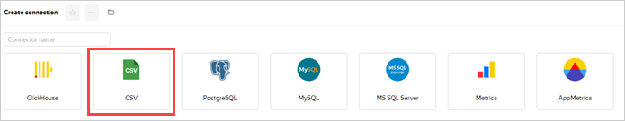

1. Click **Select CSV file**.

    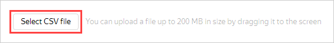

1. Select a file. For this example, use **SuperHeroes.csv** ([download link](https://storage.yandexcloud.net/datalens/SuperHeroes.csv)).

   Wait until the table content appears on the screen.

1. Click **Create**.

    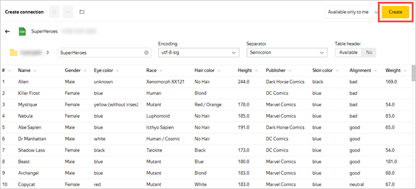

1. After the data is saved, click **Create dataset**.

    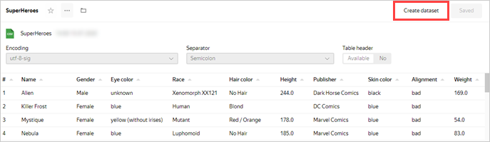

## Step 2. Create a dataset {#step2}

1. Drag the **SuperHeroes.csv** table from the selection panel to the workspace.

    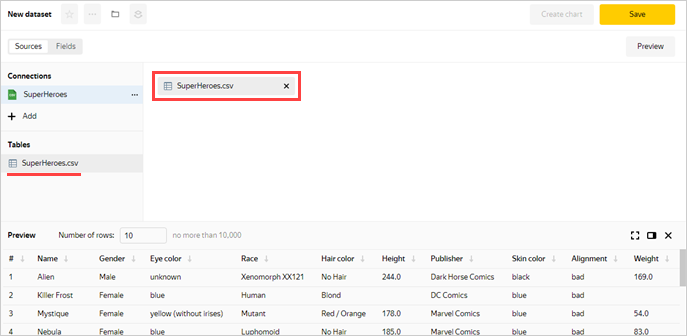

1. Go to the **Fields** tab.

    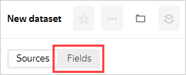

1. Create a field for the superheros' average weight:

    1. Click  in the **Weight** row.

    1. Choose **Duplicate**.

         

    1. Rename the **Weight (1)** duplicate field to **Weight avg**: click the row name, delete the current name, and enter the new one.

    1. In the **Aggregation** column, select **Average** for the **Weight avg** field.

        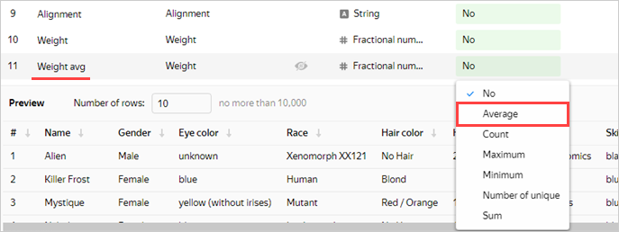

1. Click **Save** in the upper-right corner to save the dataset.

    

1. Enter a name for the dataset: **SuperHeroes dataset**, then click **Create**.

1. When the dataset is saved, click **Create chart**.

    

## Step 3. Create the first chart {#step3}

To visualize data by gender, create a [chart](../../datalens/concepts/chart/index.md): column chart.

1. Add the names of superheroes to the chart. To do this, drag the **Name** field from the **Dimensions** section to the **X** section.

1. Add the superheros' weight to the chart. To do this, drag the **Weight avg** field from the **Measures** section to the **Y** section.

    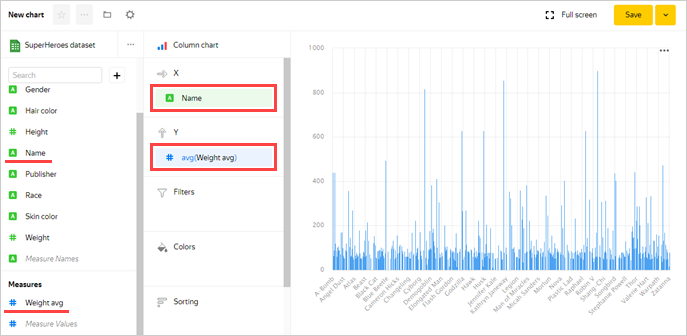

1. Sort the chart by weight (for example, in descending order).

    1. From the first column in the **Measures** section, drag the **Weight avg** field to the **Sorting** section.

        

1. Leave only the superheroes whose weight is known on the chart (greater than zero).

    1. From the first column in the **Measures** section, drag the **Weight avg** field to the **Filters** section.

    1. In the window that opens, specify the operation **Greater than** and the value **0**.

    1. Click **Apply**.

        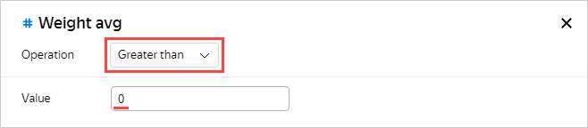

1. Add a color division for superheroes depending on their gender to the chart. To do this, drag the **Gender** field from the **Dimensions** section to the **Colors** section.

    

1. Redefine the colors for the **Gender** dimension.

    1. Click the settings icon in the **Colors** section.

        

    1. Select the colors: **Female**: pink, **Male**: blue, **unknown**: orange.

        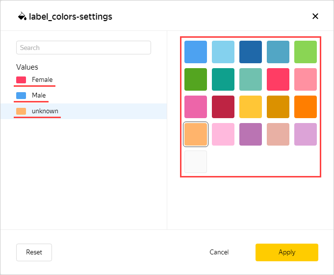

1. Save the chart.

    1. Click **Save** in the upper-right corner to save the chart.

        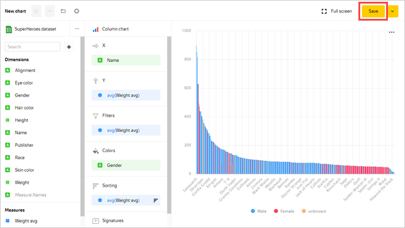

    1. In the window that opens, enter a name for the chart: **SuperHeroes — gender**, then click **Save**.

## Step 4. Create the second chart {#step4}

To visualize whether a superhero is good or bad, create a bar chart.

1. Copy the chart from the previous step.

    1. Click the down arrow next to the **Save** button in the upper-right corner.

    1. Click **Save as**.

        

    1. In the window that opens, enter the name of the new chart: **SuperHeroes — alignment**.

    1. Click **Save**.

1. Add to the chart a color division for superheroes depending on whether they are good or bad. To do this, drag the **Alignment** field from the **Dimensions** section to the **Colors** section.

    The previous value of the section (the **Gender** field) is replaced with **Alignment**.

    

1. Redefine the colors for the **Alignment** dimension.

    1. Click the settings icon in the **Colors** section.

    1. Select the colors: **good**: green, **neutral**: blue, **bad**: red, **unknown**: orange.

        

1. Click **Save** in the upper-right corner to save the chart.

## Step 5. Create a dashboard {#step5}

Create a [Dashboard](../../datalens/concepts/dashboard.md) to add your charts to.

1. Go to the DataLens homepage. To do this, click the words **{{ datalens-full-name }}** in the upper-left corner.

1. Click **Create dashboard**.

    

1. Enter the name **SuperHeroes dashboard** for the dashboard and click **Create**.

## Step 6. Add charts to the dashboard {#step6}

1. The first time you open the dashboard after saving, it opens in edit mode. If you open it later, click **Edit** in the upper-right corner.

    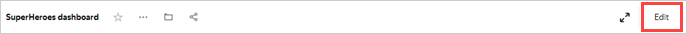

1. Click **Add**.

1. Choose **Chart**.

    

1. In the window that opens, click **Select** and choose the **SuperHeroes — gender** chart.

   This automatically fills in the **Title** field with the name of the selected chart.

1. Click **Add**.

    

1. Add another chart. Perform all the steps from the beginning and specify the **SuperHeroes — alignment** chart in step 5.

    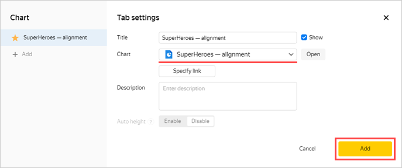

## Step 7. Add selectors to the dashboard {#step7}

Add [selectors](../../datalens/concepts/dashboard.md#selector) to filter superheroes by race (the **Race** field) and publisher (the **Publisher** field).

1. Click **Add**.

1. Choose **Selector**.

    

1. Select the **SuperHeroes dataset**.

1. Select the **Race** field.

    This automatically fills in **Title** with the name of the selected field.

1. Click the **Show** checkbox next to the selector title.

1. Enable the **Multiple choice** option.

1. Click **Add**.

    

1. Add another selector. Perform all the steps from the beginning and specify the **Publisher** field in step 6.

    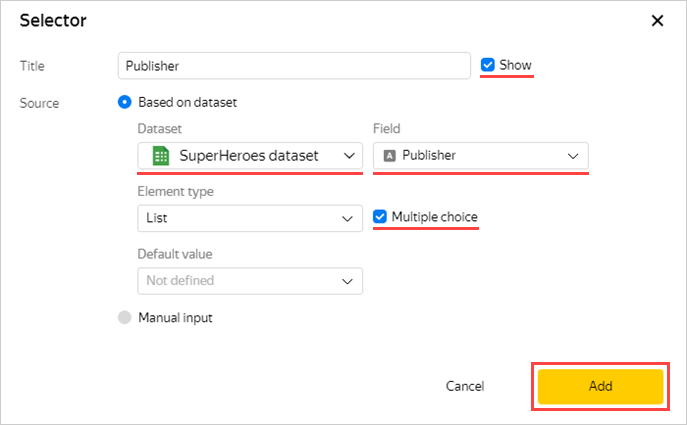

## Step 8. Set up widgets and start analyzing dependencies {#step8}

1. Drag the selectors to the top of the page next to each other.

1. Stretch the charts across the width of the dashboard.

1. Click **Save** in the upper-right corner to save the dashboard.

    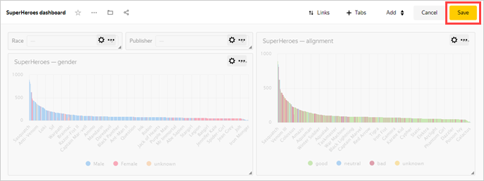

1. Apply various filters and analyze the weight dependencies on a superhero's gender and good or bad alignment.

    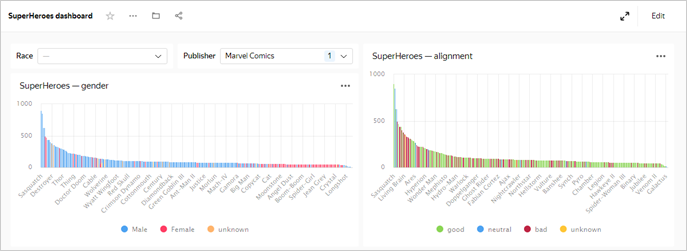

    The dataset analyzed shows the following dependencies:
    - Men are generally heavier than women.
    - Bad superheroes are mostly heavier than good ones.

## Step 9. Continue to analyze the data about superheroes {#step9}

You can create new indicators in the dataset, such as average height (average from the **Height** field) and the number of superheroes (the number of unique from the **Name** field) and answer the following questions:

- Representatives of which race are the most numerous?
- Does a superhero's height depend on whether they are good or bad?
- Which studio created the most superheroes?

