# Visualizing data from {{ forms-full-name }}

Use the ready-made solutions of this scenario to use data from [{{ forms-full-name }}](https://forms.yandex.ru/) for visualization in {{ datalens-short-name }}.

To visualize and analyze the data, follow these steps:

1. [Prepare data in YT](#prepare-data)
   1. [Configure export of answers to YT](#export-answers)
   1. [Open a table with data from the form](#data-table)
1. [Create CH over YT connection](#create-connection)
1. [Create a dataset](#create-dataset)
1. [Add data from Staff](#join-data)

## 1. Prepare data in YT {#prepare-data}

### 1.1 Configure export of answers to YT {#export-answers}

For the forms to store answers on [YT](https://yt.yandex-team.ru/docs/), specify this in the form settings:

1. Open the form.
1. Go to the **Settings** tab.
1. In the side menu, select **More**.
1. Check the **Export answers to YT.Hahn** option.

   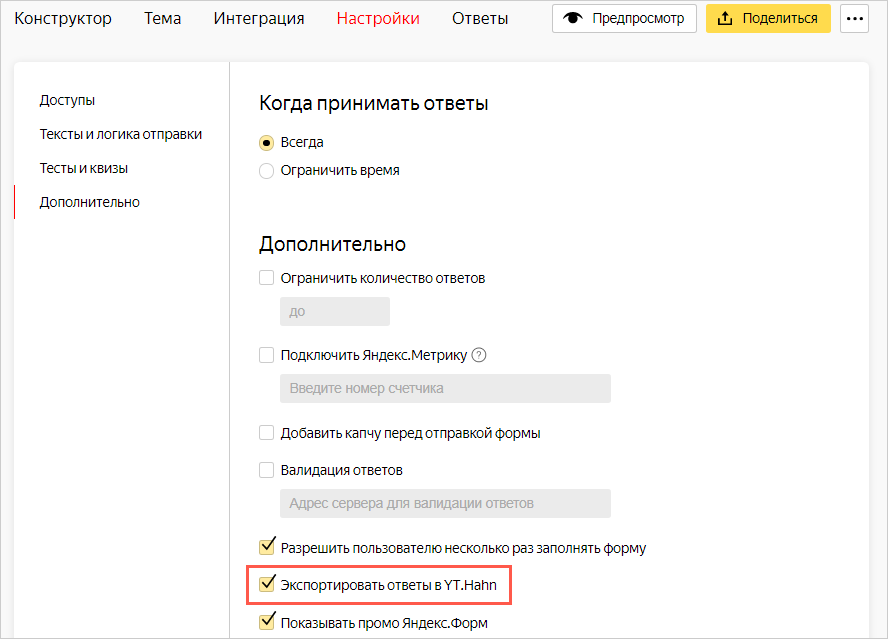

### 1.2 Open a table with data from the form {#data-table}

1. In the form, go to the **Answers** tab.
1. Follow the link in the **Take answers from YT** section.

   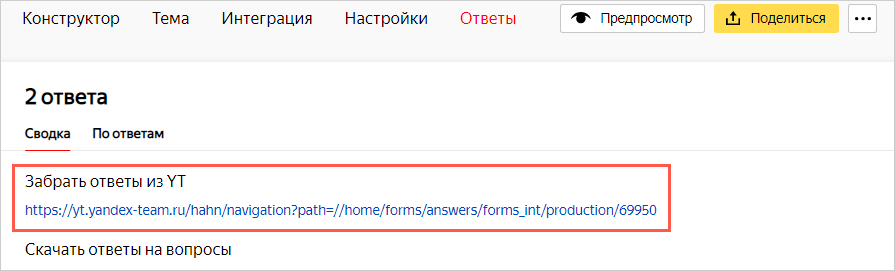

   After you follow the link, the `data` table with data from the form will open.

   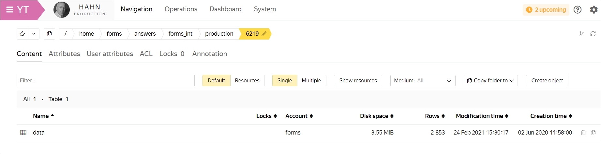

1. If the table is not displayed, request access to it. To do this, click **Request permissions**.

   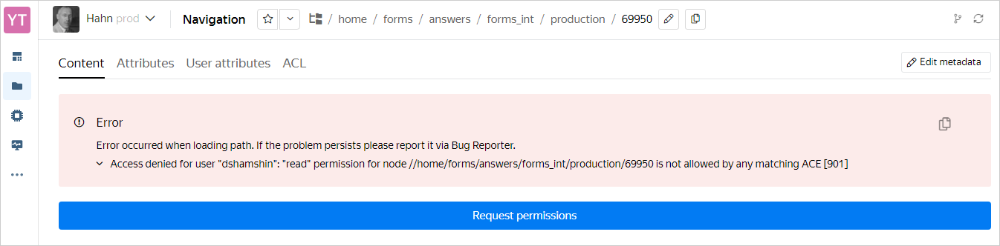

## 2. Create CH over YT connection {#create-connection}

1. Go to the [connections page](https://datalens.yandex-team.ru/connections).
1. In the upper-right corner, click **Create connection**.
1. Select **CH over YT** as the connection type.
1. In the window that opens, specify the connection parameters:

   * Connection name: `YT Form`.
   * Authentication method: **OAuth-token**.
   * Token: Click **Get token**.
   * Cluster: `Hahn`.
   * Clique: Specify the alias of a running clique. To work with {{ datalens-short-name }}, we recommend creating a [private clique](https://yt.yandex-team.ru/docs/description/chyt/cliques/start). If you're using a public clique, see the [restrictions](data-from-ch-over-yt.md#before-you-begin).
   * Cache lifetime in seconds: **Default**.
   * SQL query access level: **Allow subqueries in datasets**.

   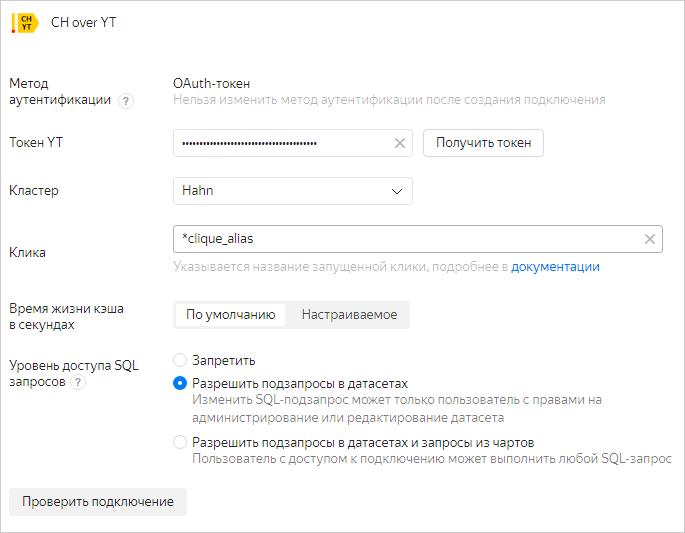

1. Check the connection and click **Create**.

## 3. Create a dataset {#create-dataset}

All answers to the questions from the form are stored in the `answer` column of the `data` table. To get this data, specify the dataset data source using an SQL query.

1. Go to the [dataset page](https://datalens.yandex-team.ru/datasets).
1. In the upper-right corner, click **Create dataset**.
1. In the left part of the screen, under **Connection**, click  **Add**.
1. Select the `YT Form` connection.
1. In the left part of the screen, under **Connection**, click  **Add**.
1. Select **SQL** as source type.
1. Enter the source name: `adaptation`.
1. Open the form and go to the **Builder** tab.
1. Click the line with the question you need and copy its ID. Question IDs will be required to write an SQL query in the dataset.

   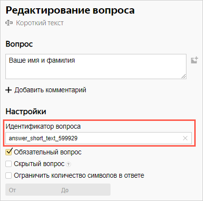

1. Go to the **Answers** tab and copy the path to the `data` table from the `path` parameter in the URL address. The path to the `data` table is required to write an SQL query in the dataset.

   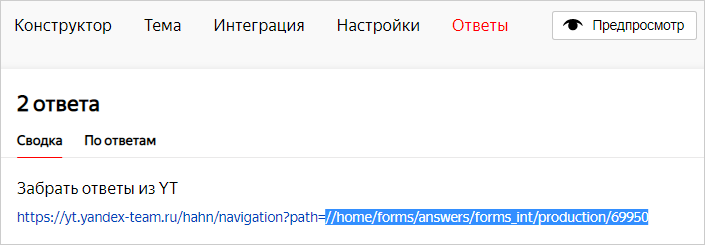

1. Go back to the dataset and write an SQL query to receive data from the `data` table. In the query, pass the required question IDs to the `cast` functions and the path to the `data` table to the `from` sections.

   ```sql
   select
   t.id as answer_id,
   t.uid as uid,
   t.created as created,
   cast(YPathString(answer, '/data/answer_choices_44736/value/0/text') as String) as answer_44736,
   cast(YPathString(answer, '/data/answer_choices_233283/value/0/text') as String) as answer_233283,
   cast(YPathString(answer, '/data/answer_choices_37608/value/0/text') as String) as answer_37608,
   cast(YPathString(answer, '/data/answer_long_text_37611/value') as String) as answer_37611,
   cast(YPathString(answer, '/data/answer_short_text_183050/value') as String) as answer_183050,
   cast(YPathString(answer, '/data/answer_long_text_37612/value') as String) as answer_37612,
   cast(YPathString(answer, '/data/answer_long_text_39363/value') as String) as answer_39363,
   cast(YPathString(answer, '/data/answer_choices_37565/value/0/text') as String) as answer_37565,
   cast(YPathString(answer, '/data/answer_choices_37850/value/0/text') as String) as answer_37850,
   cast(YPathString(answer, '/data/answer_choices_37606/value/0/text') as String) as answer_37606,
   cast(YPathString(answer, '/data/answer_long_text_37607/value') as String) as answer_37607,
   cast(YPathString(answer, '/data/answer_long_text_39360/value') as String) as answer_39360,
   cast(YPathString(answer, '/data/answer_choices_37514/value/0/text') as String) as answer_37514,
   cast(YPathString(answer, '/data/answer_choices_37516/value/0/text') as String) as answer_37516,
   cast(YPathString(answer, '/data/answer_choices_37517/value/0/text') as String) as answer_37517,
   cast(YPathString(answer, '/data/answer_choices_37518/value/0/text') as String) as answer_37518,
   cast(YPathString(answer, '/data/answer_choices_37519/value/0/text') as String) as answer_37519,
   cast(YPathString(answer, '/data/answer_choices_37642/value/0/text') as String) as answer_37642,
   cast(YPathString(answer, '/data/answer_choices_37522/value/0/text') as String) as answer_37522,
   cast(YPathString(answer, '/data/answer_choices_408273/value/0/text') as String) as answer_408273,
   cast(YPathString(answer, '/data/answer_choices_408269/value/0/text') as String) as answer_408269,
   cast(YPathString(answer, '/data/answer_choices_39365/value/0/text') as String) as answer_39365,
   cast(YPathString(answer, '/data/answer_long_text_39366/value') as String) as answer_39366,
   cast(
       arrayStringConcat(
           arrayMap(
               i -> cast(YSONExtractString(YPathRaw(answer, '/data/answer_choices_37851/value', 'text'), i + 1, 'text') as String),
               range(YSONLength(coalesce(YPathRaw(answer, '/data/answer_choices_37851/value', 'text'), '')))
           ),
           ', '
       )
       as String
   ) as answer_37851
   from `//home/forms/answers/forms_int/production/6219/data` as t
   ```

   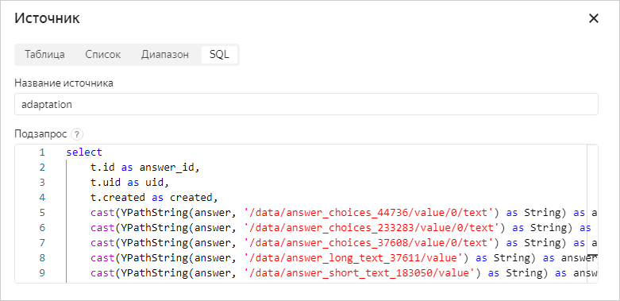

## 4. Add data from Staff {#join-data}

The [YT table](https://yt.yandex-team.ru/hahn/navigation?path=//home/hr-stat/charts/staff/employees) with employee data from Staff doesn't store the usernames of employees who completed the form. UIDs are stored instead. To find out who completed the form, create a similar table in YT using the Staff API or other methods and add it to the dataset:

1. In the left part of the screen, under **Connection**, click  **Add**.

   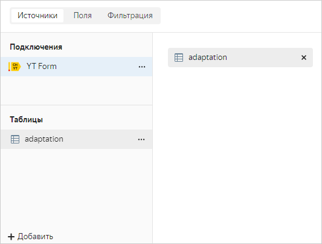

1. Select **Table** as source type.
1. Enter the source name: `staff`.
1. Specify the path to the created table with data from Staff.

   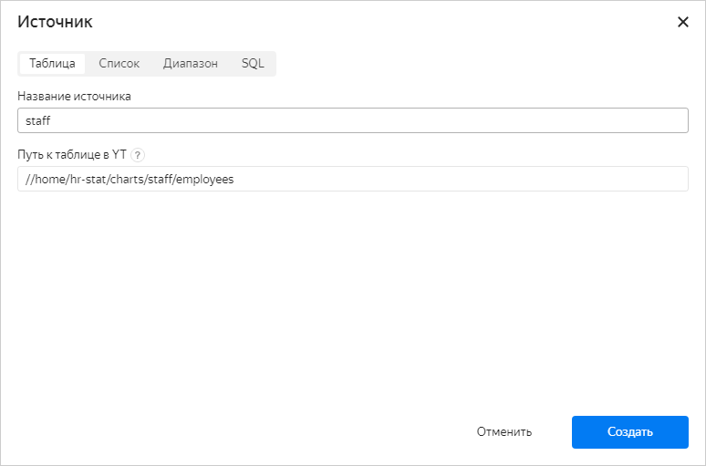

1. Click **Create**.
1. Link the added table to the `adaptation` table:

   1. Click where the tables are joined.

      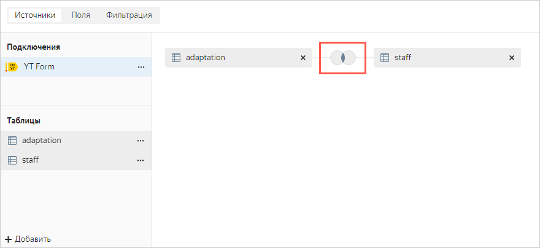

   1. Click **Add link** and select the `uid` field in both tables.

      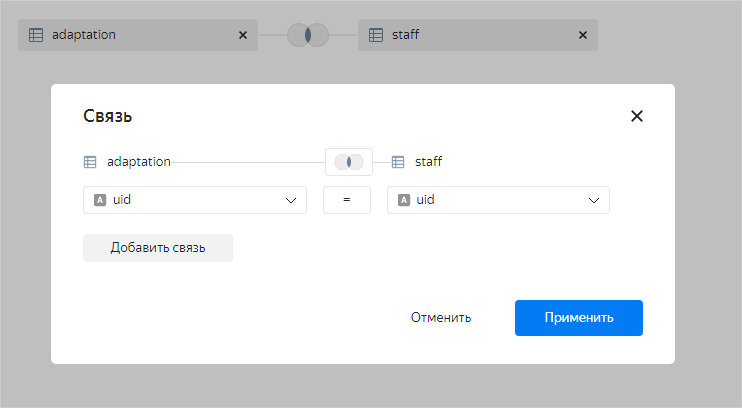

   1. Click **Apply**.

1. In the upper right-hand corner, click **Save**. Dataset is ready.

   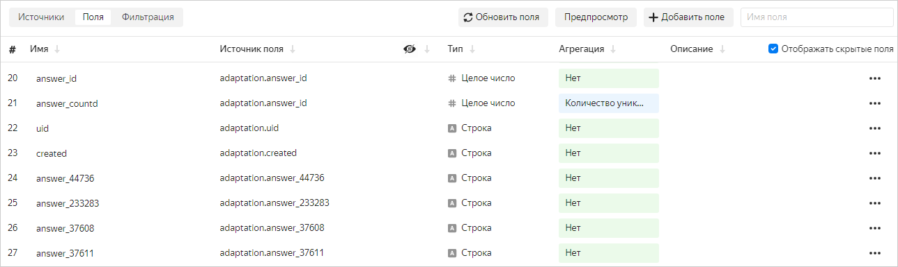

   Above the created dataset, you can create various charts and place them on dashboards.
