# Web analytics with a connection to Yandex Metrica

One of the Yandex Metrica tags that you have access to will be used as the data source. You can view a list of tags available to you at [https://metrika.yandex.com/list](https://metrika.yandex.com/list).

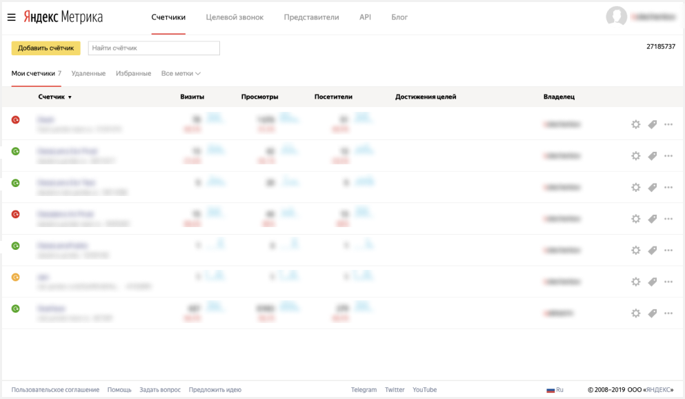

If no tags are available in your list, gain access to a tag or use the Yandex Metrica demo dashboard. It's automatically created when you create a {{ datalens-short-name }} instance.

To visualize your data, [set up {{ datalens-short-name }}](#before-you-begin) follow these steps:

1. [Create a connection and standard dashboard](#step1).
1. [Edit the standard dashboard](#step2).
1. [Edit the chart](#step3).

## Before you start {#before-you-begin}



## Step 1. Create a connection and a standard dashboard {#step1}



This step is available to users who have permission to any Yandex Metrica tag. If you don't have permission to a tag, open a ready-to-use dashboard named [**Yandex Metrica Live Demo Dashboard**](https://datalens.yandex.com/navigation?path=Demo%2FMetrica%20Live%2FMetrica%20Live%20Demo%20Dashboard) and proceed to step 2.



1. Go to the {{ datalens-short-name }} [homepage]({{ link-datalens-main }}).
1. Click **Create connection**.

   

1. Select **Metrica**.

   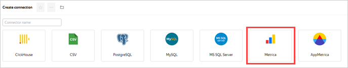

1. Click **Get token**.

   

   If this is your first connection to a Yandex Metrica tag, grant the necessary permissions to the service.

1. Select the tag from the drop-down list.

   

1. Select the [accuracy](https://yandex.com/dev/metrika/doc/api2/api_v1/sampling-docpage/) level from the drop-down list.

   

1. Enable **Automatically create a dashboard, charts, and a dataset on the connection**.
1. Click **Create connection**.

   

   When the connection is created, a folder containing the datasets, charts, and dashboard opens.

   

1. Go to **Dashboard with Yandex Metrica data**.

   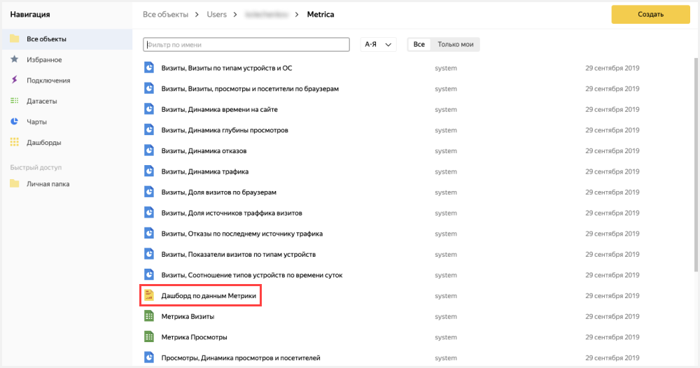

## Step 2. Edit the standard dashboard {#step2}



If you don't have a Yandex Metrica tag and you skipped step 1, use the [**Yandex Metrica Live Demo Dashboard**](https://datalens.yandex.com/navigation?path=Demo/Metrica/Metrica%20Live%20Demo%20Dashboard).



You can change the standard [dashboard](../../datalens/concepts/dashboard.md) however you want. For example, you can delete a chart you no longer need.

1. In the upper-right corner of the dashboard, click **Edit**.

   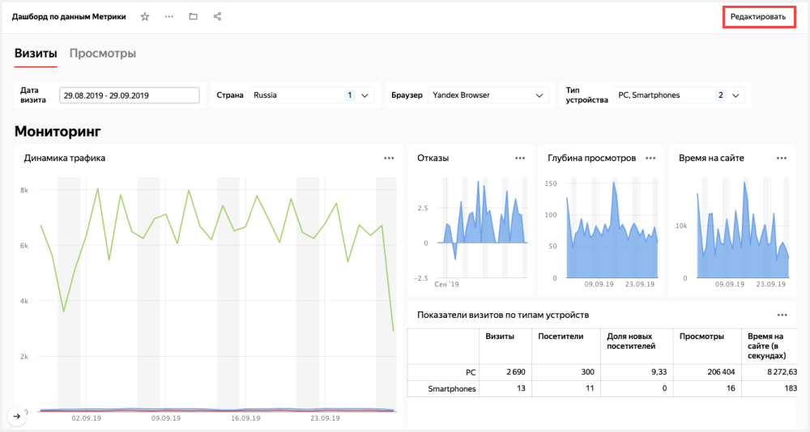

1. Delete the **Page depth** chart. To do this, click  in the chart's upper-right corner and select **Delete**.

   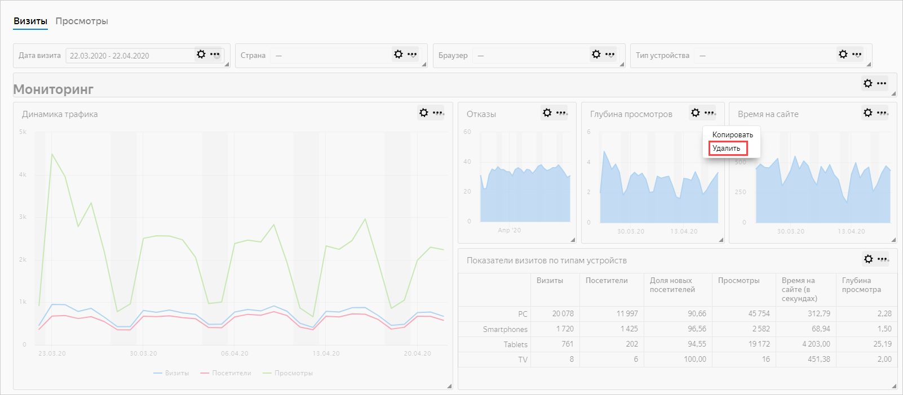

1. Position the **Bounce rate** and **Time on site** charts so that they fill in the empty space left after deleting the chart in the previous step. Drag the chart by clicking on the chart itself. Resize the chart using the triangle in the lower-right corner.

   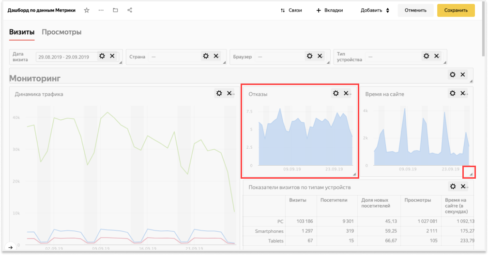

1. Remove the **Percentage of visits by browser** and **Sessions, views, and users by browser charts**.

   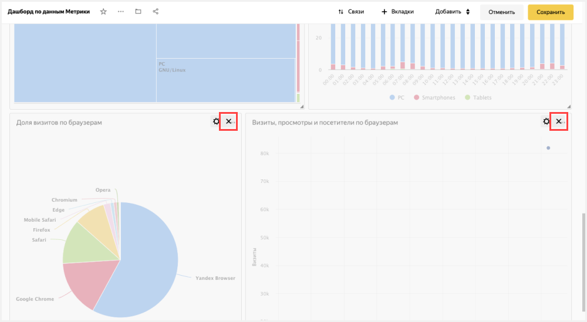

1. In the upper-right corner, click **Save**.

   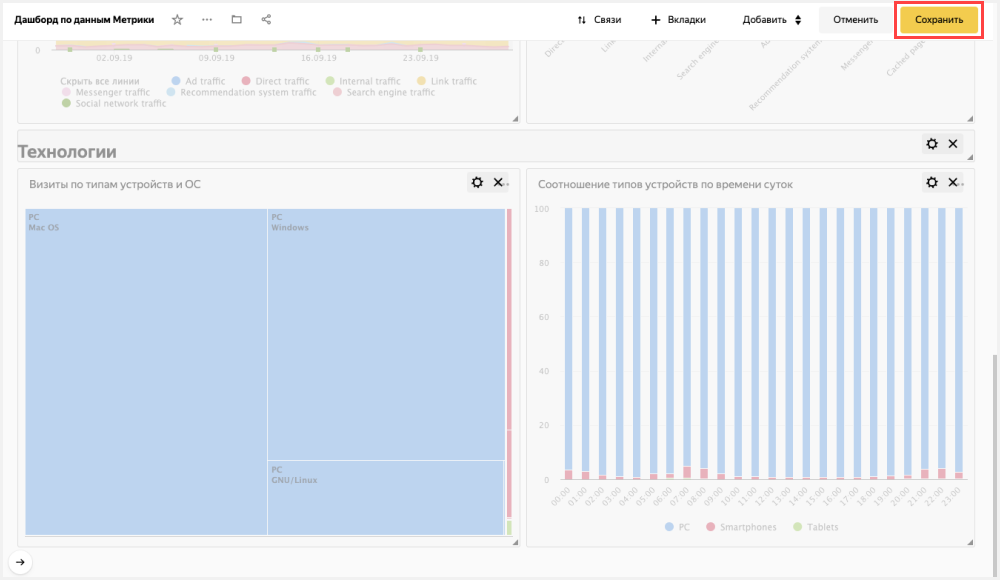

## Step 3. Edit the chart {#step3}

You can edit any chart on the dashboard. For example, change the visualization type for the **Sessions by device type and OS** chart from the **Technologies** section.

1. In the upper-right corner of the **Session by device type and OS** chart, click .
1. Select **Edit**.

   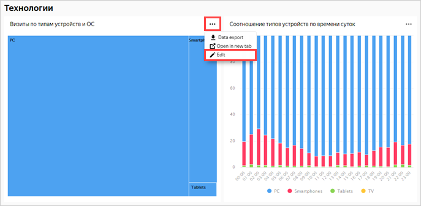

1. Select a different chart type: **Pie chart**.

   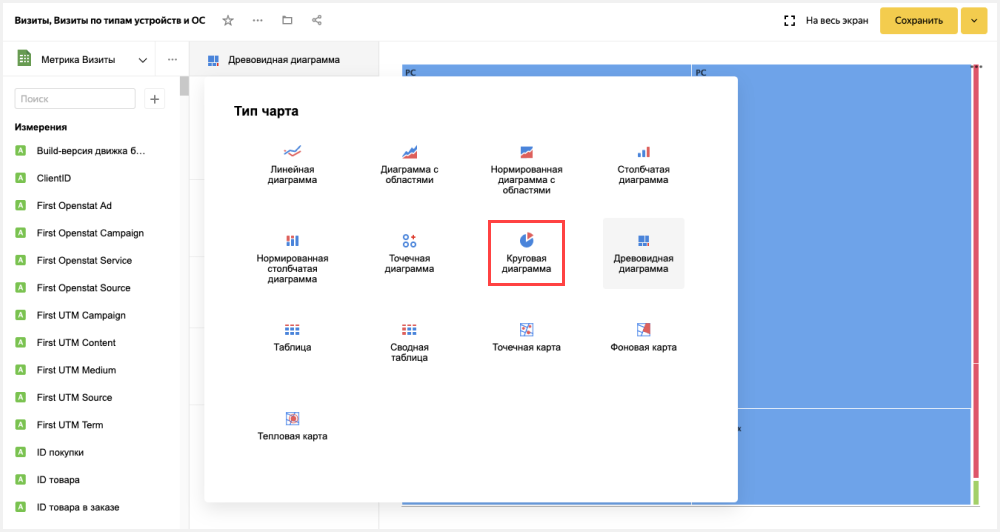

1. In the upper-right corner, click **Save**.

   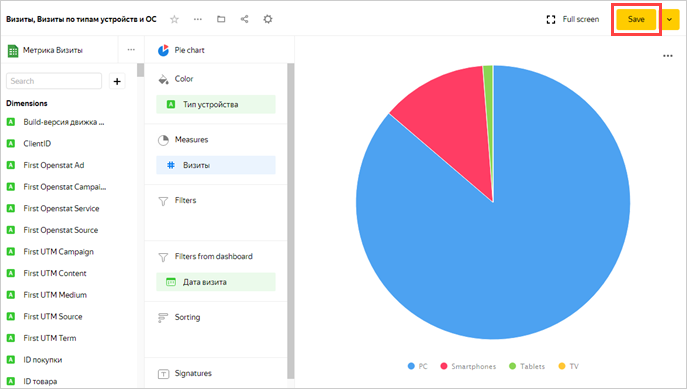

1. Close the chart editing tab and go back to the dashboard window.
1. Update the dashboard and make sure that the chart changed in the **Technologies** section.

   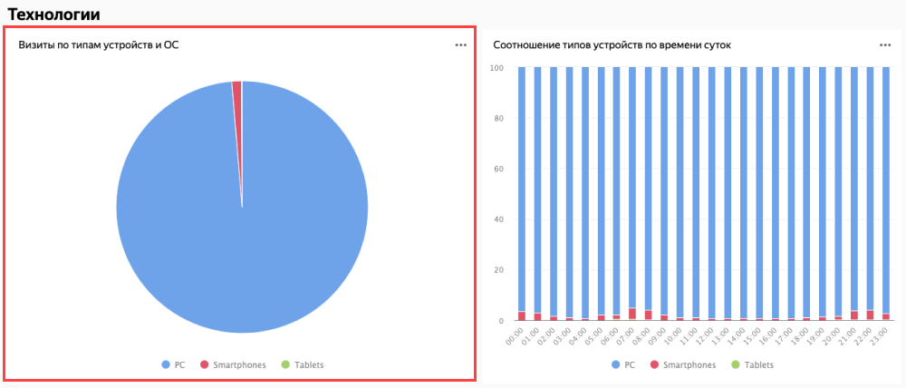
