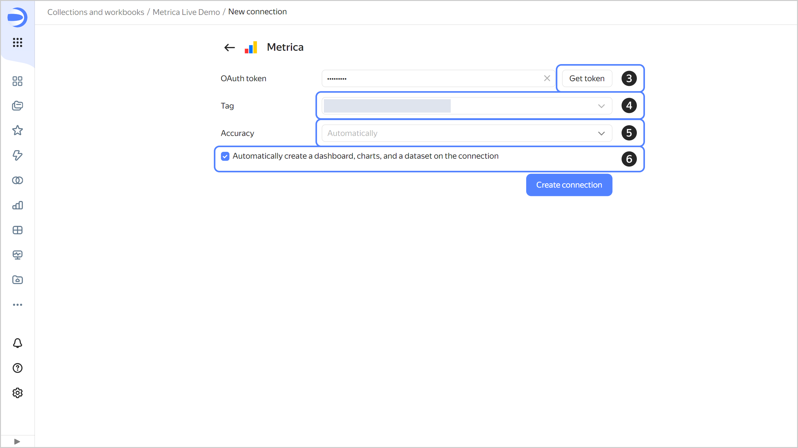
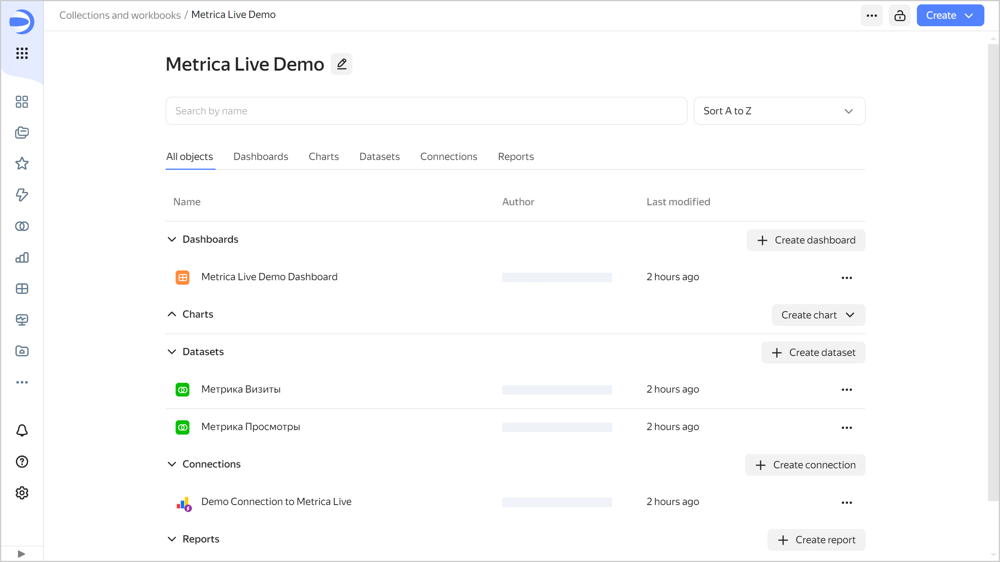

# Yandex Metrica: direct connection



This tutorial demonstrates how to use {{ datalens-full-name }} with {{ metrika }} in direct access mode.

As the data source, use a Yandex Metrica tag you have access to. View the list of available tags [here](https://metrika.yandex.com/list).

If there are no available tags in the list, use the Yandex Metrica [demo dashboard]({{ link-datalens-main }}/marketplace/f2e5hpq5mc7bscsjc6jr).



To visualize and explore data, [set up {{ datalens-short-name }}](#before-you-begin) and follow the steps below:

1. [Create a workbook](#create-workbook).
1. [Create a connection and standard dashboard](#create-connection).
1. [Edit the standard dashboard](#edit-dashboard).
1. [Edit the chart](#edit-chart).

## Getting started {#before-you-begin}



## Create a workbook {#create-workbook}

1. Go to the {{ datalens-short-name }} [home page]({{ link-datalens-main }}).
1. In the left-hand panel, select  **Collections and workbooks**.
1. In the top-right corner, click **Create** → **Create workbook**.
1. Enter a name for the [workbook](../../datalens/workbooks-collections/index.md): `Metrica Live Demo`.
1. Click **Create**.

## Create a connection and a standard dashboard {#create-connection}



This step describes actions for users with permissions for any Yandex Metrics tag. If you do not have permissions for a tag, deploy a [dashboard from {{ datalens-short-name }} {{ marketplace-short-name }}]({{ link-datalens-main }}/marketplace/f2e5hpq5mc7bscsjc6jr) and proceed to [Edit the standard dashboard](#edit-dashboard).



1. In the top-right corner of the workbook, click **Create** →  **Connection**.
1. Under **Files and services**, select the **{{ metrika }}** connection.
1. Click **Get token**.

   If this is your first connection to a Yandex Metrica tag, grant the necessary permissions to the service.

1. Select the tag from the drop-down list.
1. Select the [accuracy](https://yandex.com/dev/metrika/doc/api2/api_v1/sampling-docpage/) level from the drop-down list.
1. Enable **Automatically create a dashboard, charts, and a dataset on the connection**.
1. Click **Create connection**.

   

   1. Enter the connection name:`Demo Connection to Metrica Live`.
   1. Click **Create**.

   When the connection is created, a workbook or folder containing the datasets, charts, and dashboard will open.

   

   

## Edit the standard dashboard {#edit-dashboard}



If you skipped the [Create a connection and a standard dashboard](#create-connection) step, deploy the [dashboard from {{ datalens-short-name }} {{ marketplace-short-name }}]({{ link-datalens-main }}/marketplace/f2e5hpq5mc7bscsjc6jr).



You can customize the standard [dashboard](../../datalens/concepts/dashboard.md) by deleting, moving, or editing charts.

1. Open `Metrica Live Demo Dashboard`.
1. In the top-right corner of the dashboard, click **Edit**.
1. Delete the `Page depth` chart. Click  in the top-right corner of the chart and select **Delete**.

   

1. Position the `Bounce rate` and `Time on site` charts so that they fill in the empty space left after deleting the chart in the previous step:

   

1. Remove the `Percentage of visits by browser` and `Sessions, views, and users by browser` charts.
1. In the top-right corner of the dashboard, click **Save**.

## Edit the chart {#edit-chart}

You can edit any chart on the dashboard. For example, change the visualization type for the `Sessions by device type and OS` chart from the **Technologies** section.

1. In the top right corner of the `Session by device type and OS` chart, click .
1. Select **Edit**.

   

1. Select a different chart type: **Pie chart**.

   

1. In the top-right corner, click **Save**.
1. Close the chart editing page and go back to the dashboard window.
1. Update the dashboard and make sure that the chart changed in the **Technologies** section.

   
