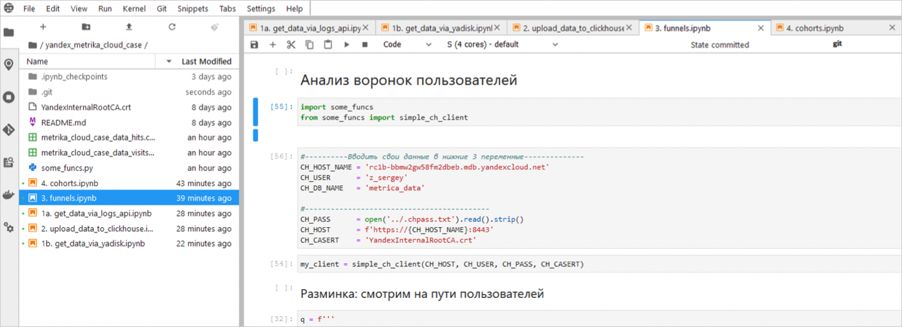

# Web analytics with funnels and cohorts calculated based on Yandex Metrica data

Yandex Metrica data is used as the data source.
In this scenario, you'll learn how to build conversion funnels, conduct a cohort analysis, and calculate the retention of the user base.

This scenario is also available as a [recording](https://www.youtube.com/watch?v=fDeqtFRawdo) from the {{ yandex-cloud }} YouTube channel.

To visualize and explore data, [set up your cloud](#before-you-begin), then follow the steps below:

1. [Connect {{ CH }} and {{ ml-platform-short-name }}](#ch-datasphere-connection):
   1. [Connect {{ CH }}](#ch-connection).

   1. [Connect {{ ml-platform-short-name }}](#datasphere-connection).

   1. [Clone the repository to {{ ml-platform-short-name }}](#clone-repo-to-datasphere).
1. [Retrieve and upload data to {{ CH }}](#get-download-data-in-ch):
   1. [Yandex Metrica Create an app and get an access token](#create-metrica-app-token).
   1. [{{ ml-platform-short-name }}. Upload data via the Yandex Metrica Logs API](#uploading-data-logs-api).
   1. [{{ ml-platform-short-name }}. Download the test tag data via Yandex Disk](#uploading-data-counter-from-disk).
   1. [{{ CH }}. Get the cluster's IP address](#getting-ch-cluster-host).
   1. [{{ ml-platform-short-name }}. Upload the data to {{ CH }}](#uploading-data-counter-to-ch).
1. [Connect {{ datalens-short-name }} and create charts](#datalens-connection-chart-creation):
   1. [Connect to {{ datalens-short-name }}](#datalens-connection).
   1. [Create a connection to {{ CH }} in {{ datalens-short-name }}](#creation-datalens-connection-to-ch).
   1. [Create a dataset based on the connection](#creating-dataset-based-on-connection).
   1. [Create a stacked area chart](#creating-area-chart).
   1. [Create a pivot table chart](#creating-pivot-table).
1. [Create and configure a dashboard in {{ datalens-short-name }}](#creating-configuring-dashboard):
   1. [Create a dashboard](#creating-dashboard).
   1. [Set up a dashboard](#configuring-dashboard).
1. [Funnels](#funnels):
   1. [{{ ml-platform-short-name }}. Build funnels](#calculating-funnels-datasphere).
   1. [{{ datalens-short-name }}. Funnels by browser. Create a dataset](#calculating-browser-funnels-dataset).
   1. [{{ datalens-short-name }}. Funnels by browser. Create a chart](#calculating-browser-funnels-chart).
   1. [{{ datalens-short-name }}. Funnels by browser. Add a chart to your dashboard](#add-browser-funnels-chart-on-dashboard}).
   1. [{{ datalens-short-name }}. Funnels by browser. Set up a dashboard](#setting-browser-funnels-chart-on-dashboard).
1. [Cohorts](#cohorts):
   1. [{{ ml-platform-short-name }}. Perform a Cohort analysis](#cohort-analysis).
   1. [{{ datalens-short-name }}. Create a dataset and a chart with cohort visualization](#creating-dataset-chart-with-cohort).
   1. [{{ datalens-short-name }}. Configure a chart with cohort visualization](#creating-chart-with-cohort).
   1. [{{ datalens-short-name }}. Create a chart with retention](#creating-chart-with-retention).
   1. [{{ datalens-short-name }}. Add charts to a new dashboard tab](#adding-charts-to-dashboard-tab).
   1. [{{ datalens-short-name }}. Create charts](#creating-chart).
   1. [{{ datalens-short-name }}. Add charts to the dashboard](#adding-chart-to-dashboard).

## Prepare your cloud {#before-you-begin}



## 1. Connect {{ CH }} and {{ ml-platform-short-name }} {#ch-datasphere-connection}

### 1.1 Connect {{ CH }} {#ch-connection}

1. In the [management console]({{ link-console-main }}), select **{{ mch-name }}** from the list on the left.
1. In the window that opens, click **Create cluster**.
1. Specify the settings for a {{ CH }} cluster.
   1. Under **Basic parameters**, specify a name for the cluster.
   1. Under **Host class**, select the **burstable** VM type and **b2.medium** host type.

      

      We don't recommend using **burstable** VM configurations in production environments. This tutorial uses them as an example. For production solutions, use **standard** or **memory-optimized** configurations.

      

      

   1. Under **Storage size**, keep the value of 10 GB.
   1. Under **Database**, specify the database name, for example, `metrica_data`, the username, and the password. Remember the database name.

      

   1. Under **Hosts**, click . Enable **Public access** and click **Save**.
   1. Under **Additional settings**, enable 4 options:
      * Access from {{ datalens-short-name }}
      * Access from the management console
      * Access from Yandex Metrica and AppMetrica
      * Access from Serverless
   1. After configuring all the settings, click **Create cluster**.

### 1.2 Connect {{ ml-platform-short-name }} {#datasphere-connection}

1. Go to the [management console]({{ link-console-main }}).
1. Select **{{ ml-platform-name }}** from the list on the left.
1. In the window that opens, click **Create project**.
1. Specify a name for the project and click **Сreate**.
1. Open the project. To do this, in the line with the project name, click  → **Open**.

Now we see the {{ jlab }}Lab development environment, where we'll continue to work.

### 1.3 Clone the repository to {{ ml-platform-short-name }} {#clone-repo-to-datasphere}

1. In the upper-left corner, click  **Git Clone**.
1. In the window that opens, specify the **URI** of the repository `https://github.com/zhdanchik/yandex_metrika_cloud_case.git` and click **CLONE**.

## 2. Retrieve and upload data to {{ CH }} {#get-download-data-in-ch}

If you don't have a Yandex Metrica tag, it doesn't have enough data, or if you want to make sure and complete all the steps in the instructions and get a result, go to step [2.3](#uploading-data-counter-from-disk) (skip steps [2.1](#create-metrica-app-token) and [2.2](#uploading-data-logs-api)).

If you have a Yandex Metrica tag and can access it, go to step [2.1](#create-metrica-app-token) and [2.2](#uploading-data-logs-api) (skip step [2.3](#uploading-data-counter-from-disk)). We recommend these steps if you're an experienced user because the logic of calculating funnels and cohorts depends on the data itself and you may need to tweak the scripts.

### 2.1 Yandex Metrica. Create an app and get an access token {#create-metrica-app-token}

1. To work with the API, get your [OAuth token](https://tech.yandex.com/oauth/doc/dg/tasks/get-oauth-token-docpage/).
1. Create an application:
   1. Go to [https://oauth.yandex.com/client/new](https://oauth.yandex.com/client/new).
   1. Specify a name for the app.
   1. Go to **Platforms** → **Web services**. In the **Callback URI #1** field, insert `https://oauth.yandex.com/verification_code`.
   1. Go to **Accesses** → **Yandex Metrica (metrika)**. Enable **Access to statistics and ability to view all counter settings (metrika:read)**.
   1. Click **Create app**.
   1. A description of our application appears in the window that opens. Copy the ID of your app.

1. Click `https://oauth.yandex.com/authorize?response_type=token&client_id=<app ID>`. For the `client_id` parameter, add the copied ID of your app.
1. Click **Log in as …**.
1. Copy the received access token.

### 2.2 {{ ml-platform-short-name }}. Upload data via the Yandex Metrica Logs API {#uploading-data-logs-api}

1. In the {{ ml-platform-short-name }} project, in the root of the working directory, create a text file.

   

1. Name the file `.yatoken.txt` and insert the received access token into the file content. Save your changes and close the file.
1. Open the folder **yandex_metrika_cloud_case** → notebook **1a. get_data_via_logs_api.ipynb**.

If you couldn't get data for the demo tag from the Logs API, you can [download it via Yandex Disk](#uploading-data-counter-from-disk).

### 2.3 {{ ml-platform-short-name }}. Download the test tag data via Yandex Disk {#uploading-data-counter-from-disk}



Skip this section if you are using your own tag data.



1. Open the folder **yandex_metrika_cloud_case** → notebook **1b. get_data_via_yadisk.ipynb**.
1. Complete all the steps (cells with the code) in the notebook **1b. get_data_via_yadisk.ipynb**.

### 2.4 {{ CH }}. Get the cluster's IP address {#getting-ch-cluster-host}

1. Go to the created {{ CH }} cluster. Wait for the cluster status to be **Alive**. Then open the cluster by clicking on it.

   

1. Select **Hosts** from the list on the left.
1. On the **Overview** tab, go to the **Hostname** column. To copy a hostname, point to the right of the hostname and click the copy icon.

### 2.5 {{ ml-platform-short-name }}. Upload the data to {{ CH }} {#uploading-data-counter-to-ch}

1. Open the folder **yandex_metrika_cloud_case** → notebook **2. upload_data_to_{{ CH }}.ipynb**.
   1. Paste the copied hostname into the `CH_HOST_NAME` variable.
   1. Use the name of the logged-in user in the `CH_USER` variable.
   1. Use the name of the opened database in the `CH_DB_NAME` variable.

      

1. In the root directory, create a new text file named **.chpass.txt**.

   

1. Enter the password of the logged-in user in the **.chpass.txt** file. Save and close the file.
1. Complete all the steps (the cells with the code) in the notebook.

## 3. Connect {{ datalens-short-name }} and create charts {#datalens-connection-chart-creation}

### 3.1 Connect to {{ datalens-short-name }} {#datalens-connection}

1. On the page of the created {{ CH }} cluster, on the left in the menu, select **{{ datalens-short-name }}**.
1. In the window that opens, click **Activate**.
1. In the window that opens, select the **default** folder and click **Activate DataLens**.

### 3.2 Create a connection to {{ CH }} in {{ datalens-short-name }} {#creation-datalens-connection-to-ch}

1. Click **Create connection**.
1. Select a **{{ CH }}** connection.
1. Fill in the connection settings.
   1. Add a name.
   1. Select a {{ CH }} host from the **Hostname** drop-down list.
   1. Select the username.
   1. Enter the password and click **Check connection**.

      

   1. After checking the connection, in the upper-right corner, click **Create**.

### 3.3 Create a dataset based on the connection {#creating-dataset-based-on-connection}

1. In the upper-right corner, click **Create dataset**.
1. Select the `metrica_data.hits` table as a source. To do this, drag the table from the list on the left to the editing area.
1. Open the **Fields** tab.
1. In the upper-right corner, click **Add field**.
1. To count the number of hits, create the calculated **Hits** field equal to 1. Click **Create**.

   

1. For the **Hits** field, select the **Amount** value in the aggregation.
1. Rename the **Browser** field to **Browser**.
1. In the upper-right corner, click **Save**.
1. Name the dataset `ch_metrica_data_hits` and click **Create**.

### 3.4 Create a stacked area chart {#creating-area-chart}

Now create charts.

1. In the upper-right corner, click **Create chart**.
1. In the window that opens, drag the following fields to the chart section:
   * Drag the **EventDate** field to the **X** section.
   * Drag the **Browser** field to the **Colors** section.
   * Drag the **Hits** field to the **Y** section.
1. Change the chart type to **Stacked area chart**.

   

1. Click **Save**.

   

1. In the window that appears, enter `ch_metrica_data_hits_area` as the chart name and click **Save**.

### 3.5 Create a pivot table chart {#creating-pivot-table}

Create another chart based on the pre-existing chart: a pivot table.

1. In the top right-hand corner, click  → **Save as**.
1. For the chart copy, enter `ch_metrica_data_hits_table` as the new name and click **Save**.
1. Select **Pivot table** as the new chart type.
1. Add or adjust the following fields in the chart area:
   * Drag the **Browser** field to the **Rows** section.
   * Drag the **Hits** field to the **Sorting** section.
1. Click **Save**.

## 4. Create and configure a dashboard in {{ datalens-short-name }} {#creating-configuring-dashboard}

### 4.1 Create a dashboard {#creating-dashboard}

1. Open the [{{ datalens-short-name }}]({{ link-datalens-main }}) homepage and click **Create dashboard**.
1. Enter `ch_metrica_data` as the name of the dashboard and click **Create**.
1. Add the first chart to the dashboard. To do this, in the upper-right corner, click **Add** → **Chart**.
   1. From the **Chart** drop-down list, select **ch_metrica_data_hits_area**.
   1. In the **Name** field, enter **Hits by browser** as the chart name and click **Add**.
1. Similarly, add the chart **ch_metrica_data_hits_table** named **Hits by browser for period**.

   

1. Move the charts and resize them on the dashboard.
   1. Drag the table chart to the right of the diagram chart.
   1. To change the vertical dimensions of the charts, drag them by the lower-right corner.
1. In the upper-right corner, click **Save**.

### 4.2 Configure a dashboard {#configuring-dashboard}

1. Add filtering to select a specific browser. To do this, in the upper-right corner, click **Add** → **Selector**.
1. You can add the selector to a field from any dataset. From the **Dataset** list, select the created dataset **ch_metrica_data_hits**.

   

1. From the **Field** list, select **Browser**. In the **Name** field, enter a name for the selector and enable **Show**.
1. Enable the **Multiple choice** option.
1. In the **Default value** field, select browsers:
   * android_browser
   * chrome
   * chromemobile
   * firefox
   * opera
   * safari
   * safari_mobile
   * samsung_internet
   * yandex_browser
   * yandexsearch

1. Click **Add**.
1. Drag the selector to the top of the dashboard and stretch it horizontally.
1. In the upper-right corner, click **Save**.

   

## 5. Funnels {#funnels}

### 5.1 {{ ml-platform-short-name }}. Build funnels {#calculating-funnels-datasphere}

1. Open the notebook **3. funnels.ipynb**. Specify the host, the user, and the DB name.

   

1. Run the cells and evaluate the analysis results.

   

In {{ CH }}, the table `metrica_data.funnels_by_bro` is created, where funnels by browser are calculated.

### 5.2 {{ datalens-short-name }}. Funnels by browser. Create a dataset {#calculating-browser-funnels-dataset}

Create a new dataset based on the new table and the connection to {{ CH }}.

1. Open the [{{ datalens-short-name }}]({{ link-datalens-main }}) homepage and click **Create dataset**.
1. Go to the **Connections** section and click **Add**.
1. From the list of connections, select **metrica_analysis**.
1. Drag the new table `metrica_data.funnels_by_bro` to the editing area.
1. Open the **Fields** tab.
   1. Rename the fields step X → Step X, where X is the step sequence number.
   1. Specify the value of the **Sum** aggregation for the **Step X** fields and click **Save**.

   

1. Name the dataset **ch_metrica_data_funnels_by_bro** and click **Create**.

### 5.3 {{ datalens-short-name }}. Funnels by browser. Create a chart {#calculating-browser-funnels-chart}

Create a chart based on the dataset **ch_metrica_data_funnels_by_bro**.

1. Click **Create chart**.
1. Select the **Pivot table** chart type.
1. Drag the following fields to the chart section:
   * The **Browser** field to the **Rows** section.
   * The **Step X** field to the **Measures** section.
   * The **Step 1** field to the **Sorting** section.
1. Click **Save**.
1. Enter **ch_metrica_data_funnels_by_bro_table** as the chart name and click **Save**.

### 5.4 {{ datalens-short-name }}. Funnels by browser. Add a chart to your dashboard {#add-browser-funnels-chart-on-dashboard}

1. Go to the created dashboard (you can do it from the [dashboards](https://datalens.yandex.com/dashboards) page).
1. Add a new chart. In the upper-right corner, click **Edit**.
1. Add the chart `ch_metrica_data_funnels_by_bro_table`. Enter **Funnels by browser** as the name and click **Add**.
1. Place the new chart to the right of the existing two. Stretch the chart so that it matches the others vertically and reaches the right border of the page.
1. Click **Save**.

   

### 5.5 {{ datalens-short-name }}. Funnels by browser. Set up a dashboard {#setting-browser-funnels-chart-on-dashboard}

Configure relationships so that the selector affects the new chart from another dataset.

1. Click **Edit** → **Links**.
1. In the window that opens, select the **Browser:** selector from the list.
1. On the page with the other dashboard elements, scroll down to the **Funnels by browser** chart, and click on the list with the link.
   1. Select the connection type **Outgoing link**.

   

1. From each list, select the fields for the **Browser** link. Click **Add**.
1. In the upper-right corner of the dashboard, click **Save**.
1. In the upper-left corner, click  → **Rename**.
1. Enter **Supermarket.ru — funnel and cohort analysis** as the name. Click **Done**.

   

## 6. Cohorts {#cohorts}

### 6.1 {{ ml-platform-short-name }}. Cohort analysis {#cohort-analysis}

1. Open the notebook **4. cohorts.ipynb**. Specify the host, the user, and the DB name.

   

1. Run the cells and evaluate the analysis results.

   

In {{ CH }}, the table `metrica_data.retention_users` is created, which contains all the data necessary to render visualization in {{ datalens-short-name }}.

### 6.2 {{ datalens-short-name }}. Create a dataset and a chart with cohort visualization {#creating-dataset-chart-with-cohort}

Create a dataset based on the new table and the connection to {{ CH }}.

1. Open the [{{ datalens-short-name }}]({{ link-datalens-main }}) homepage and click **Create dataset**.
1. In the **Connections** section, click **Add**.
1. From the list of connections, select `metrica_analysis`.
1. Drag the new table `metrica_data.retention_users` to the work area to connect to it.
1. Open the **Fields** tab and create the new calculated field **week_num**, which is equal to `([date]-[min_date])/7`.
   This field indicates the number of weeks from the user's first visit.
1. Click **Create**.
1. For the **visits**, **purchases**, and **revenue** fields, enable the **Sum** aggregation.
1. Rename the fields to **Visits**, **Purchases**, and **Revenue**, respectively.
1. Save the dataset.
   1. Name the dataset **ch_metrica_data_users_visits**.
   1. Click **Create**.
1. Create a new chart based on the dataset:
   * Change the chart type to a pivot table.
   * Drag the **week_num** field to the **Columns** section.
   * Drag the **min_date** field to the **Rows** section.
   * Drag the **Visits** field to the **Measures** section.

   

### 6.3 {{ datalens-short-name }}. Configure a chart with cohort visualization {#creating-chart-with-cohort}

Filter out incomplete weeks of June 29, 2020 and September 28, 2020.

1. Drag the **min_date** field to the **Filters** section.
1. In the **min_date** field, click the calendar icon.
   1. In the window that opens, select the start and end dates of the date range for filtering:
      * Start date: July 06, 2020.
      * End date: September 27, 2020.
   1. Click **Apply filter**.
1. Format the numbers in the values of the **week_num** field by removing the decimal places. To do this, in the **Columns** section, in the **week_num** field, click the grid icon. In the window that opens, set the following configuration:
   1. Set the **Precision** measure to **0**.
   1. Set the **Show delimiter** to **Hide**.
   1. Click **Apply**.
1. To color the table, add the **Visits** field to the **Colors** section and click the gear icon. In the window that opens, configure the colors:
   1. Select **Gradient type**: 3 point.
   1. Select **Color**: Orange-Violet-Blue.
   1. Enable **Set threshold values** and specify the values 100, 1000, and 5000.
   1. Click **Apply**.
1. Click **Save**.
1. Name the chart **ch_metrica_data_users_visits_cohorts_abs** and click **Save**.

### 6.4 {{ datalens-short-name }}. Create a chart with retention {#creating-chart-with-retention}

Create a chart with retention based on the **ch_metrica_data_users_visits_cohorts_abs** chart. You can open the chart from the dashboard or find it in the [chart list](https://datalens.yandex.com/widgets).

1. Click **Save as**.
1. Enter **ch_metrica_data_users_visits_cohorts_rel** as the name of the chart and click **Save**.
1. Create a new calculated field to calculate retention relative to the first week:
   1. In the left part of the screen, click  above the list of dataset fields and select **Add field**.
   1. Name the field **Visits from the first week**.
   1. Enter the following formula: `SUM([Visits])/RMAX(SUM([Visits]) among [week_num])`.
   1. Click **Create**.
1. Drag the **Visits from the first week** field to the **Measures** section.
1. Drag the **Visits from the first week** field to the **Colors** section in place of the **Visits** field.
1. Select the format for **Visits from the first week**. To do this, click the grid icon under **Measures** in the **Visits from the first week** field. In the window that opens, set the following configuration:
   1. Set **Format** to **Percent**.
   1. Click **Apply**.
1. Edit the threshold values for the measure's colors. Under **Colors**, click the gear icon. In the resulting window, specify the threshold values of 0.01, 0.025, and 0.1 and click **Apply**.
1. Click **Save**.

### 6.5 {{ datalens-short-name }}. Add charts to a new dashboard tab {#adding-charts-to-dashboard-tab}

Now return to the dashboard.

1. Click **Edit** → **Tabs**.
1. Rename the existing tab **Overview + Funnels**.
1. Add a new tab and name it **Cohorts**. Click **Save**.
1. Go to the new Cohort tab.
   1. Add the chart **ch_metrica_data_users_visits_cohorts_abs** to the dashboard.
   1. In the **Name** field, specify **Visits by cohort (absolute)**.
   1. To add a new tab, click **Add** on the left.
      1. In the new tab, add the chart **ch_metrica_data_users_visits_cohorts_rel**.
      1. Enter **Visits by cohort (relative)** as the name.
   1. Click **Add**.

Now you have a chart with two switchable tabs.

### 6.6 {{ datalens-short-name }}. Create charts {#creating-chart}

Create a new chart based on the chart **ch_metrica_data_users_visits_cohorts_abs**. You can open the chart from the dashboard or find it in the [chart list](https://datalens.yandex.com/widgets).

1. Click **Save as**.
1. Enter **ch_metrica_data_users_revenue_cohorts_abs** as the name of the chart and click **Save**.
1. Drag the **Revenue** field to the **Measures** and **Colors** sections on top of the **Visits** field.
1. In the **Revenue** section, click the grid icon. Change the field formatting.
   1. Select **1 decimal place**.
   1. Select the **Millions** scale.
   1. Change the color thresholds for the new field to 500000, 1500000, and 10000000.
1. Save the chart.

   

Create another chart based on the chart **ch_metrica_data_users_visits_cohorts_rel**.

1. Click **Save as**.
1. Enter **ch_metrica_data_users_revenue_cohorts_rel** as the name of the chart and click **Save**.
1. Change the **Visits from the first week** field.
   1. Rename the field **Revenue from the first week**.
   1. Change the formula to `SUM([Revenue])/RMAX(SUM([Revenue]) among [week_num])`.
   1. Change the color thresholds for the new field to 0.01, 0.2, and 0.3.
1. Save the chart.

   

### 6.7 {{ datalens-short-name }}. Add charts to the dashboard {#adding-chart-to-dashboard}

Add charts with cohort visualization to the dashboard.

1. Click **Edit**.
1. Click **Add**.
1. Choose **Chart**.
1. Select the chart **ch_metrica_data_users_revenue_cohorts_abs** from the chart list.
1. Enter **Revenue by cohort (absolute)** as the name.
1. Use the **+ Add** button to create a new tab.
   1. In the new tab, select the chart **ch_metrica_data_users_revenue_cohorts_rel** from the chart list.
   1. Enter **Revenue by cohort (relative)** as the name.
   1. Click **Save**.
1. Arrange the charts side by side.

   

