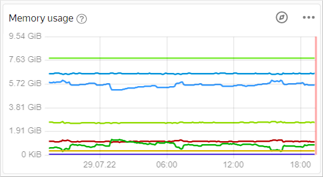
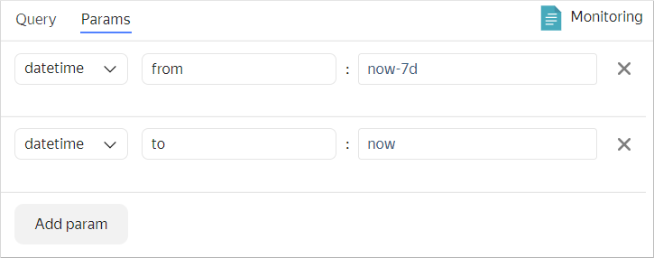
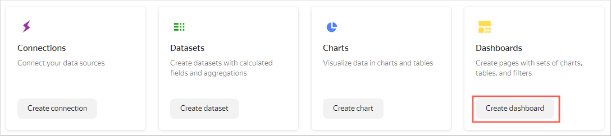
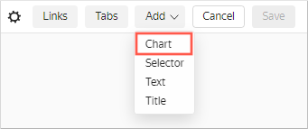
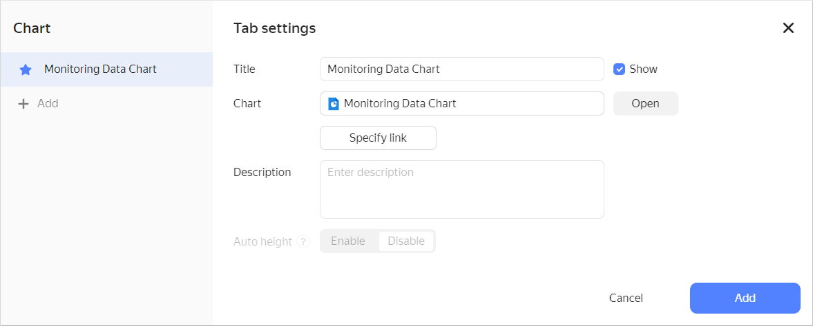
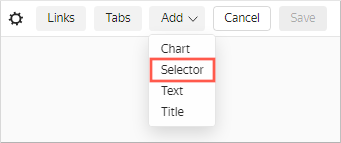
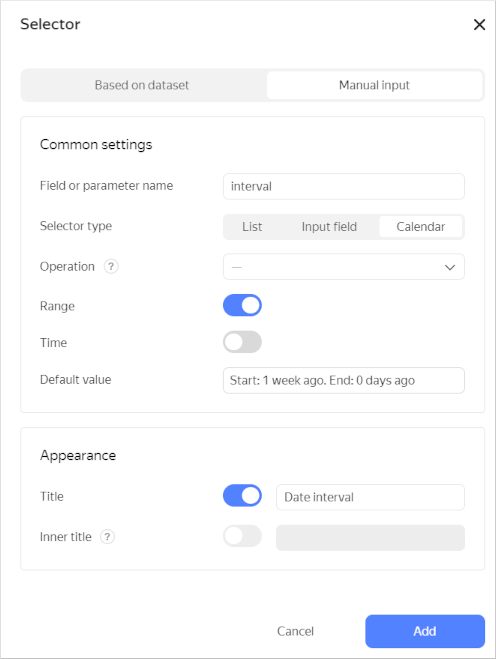
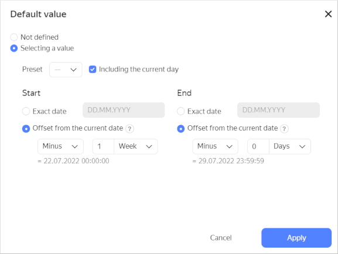
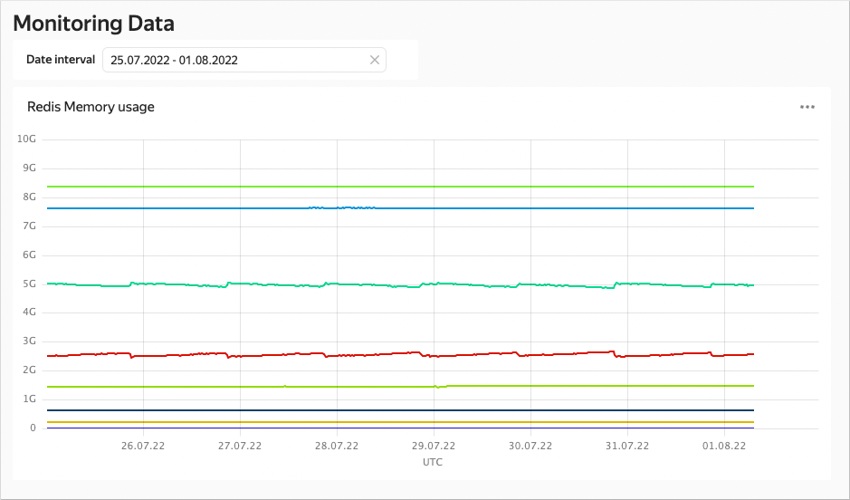

# Visualizing {{ monitoring-name }} data


The scenario will be useful to those users who have already deployed and launched one of the {{ yandex-cloud }} services.

You will create a chart based on the [{{ monitoring-full-name }} query language](../../monitoring/concepts/querying.md) and place it on the dashboard.


To visualize and explore data, [set up {{ datalens-short-name }}](#before-you-begin) and follow the steps below:


1. [Create a connection](#create-connection).
1. [Create a QL chart](#create-sql-chart).
1. [Create a dashboard](#create-dashboard).
1. [Add the QL chart to the dashboard](#add-sql-chart-to-dashboard).
1. [Add selectors to the dashboard](#add-selectors-to-dashboard).


## Getting started {#before-you-begin}

To get started with {{ datalens-short-name }}:

1. [Log in]({{ link-passport-login }}) to your Yandex account.
1. Open the {{ datalens-short-name }} [home page]({{ link-datalens-main }}).
1. Click **Open Datalens**.
1. Select one of the options:

   * If you already have an organization, select it from the drop-down menu in the **Organizations** tab and click **Open DataLens**.

      

      To activate a {{ datalens-short-name }} instance, the user must have the `admin` or `owner` role. For more information about roles, see [{#T}](../../organization/security/index.md).

      

   * If you have a cloud but no organization, click **Add new DataLens**. In the window that opens, enter your organization's name and description and click **Create organization and DataLens**. For more information about working with organizations, see [Getting started with organizations](../../organization/quickstart.md).

   If you have any technical questions about the service, please contact the {{ yandex-cloud }} [support]({{ link-console-support }}). To ask for advice, discuss the solution to your problem or best practices of the service, write to the [{{ datalens-short-name }}](https://t.me/YandexDataLens) chat in Telegram.


## Create a connection {#create-connection}



To create a connection, you need a [service account](../../iam/concepts/users/service-accounts.md) with the `{{ roles-monitoring-viewer }}` or `{{ roles-viewer }}` [role](../../iam/operations/sa/assign-role-for-sa.md).
Use the [{{ monitoring-full-name }} query language](../../monitoring/concepts/querying.md) to write queries in QL charts.



### Connecting to {{ monitoring-name }} {#monitoring-connection}

To create a {{ monitoring-name }} connection:

1. Go to the [connections page]({{ link-datalens-main }}/connections).
1. Click **Create connection**.
1. Select a **{{ monitoring-name }}** connection.
1. Specify the connection parameters:

   * **Cloud and folder**: Select the folder where your service account is located.
   * **Service account**: Select an existing service account or create a new one.

1. Click **Create connection**.
1. Enter the connection name and click **Create**. The connection will appear in the list.

## Create a QL chart {#create-sql-chart}

1. Go to the created connection.
1. In the top-right corner, click **Create QL chart**.
1. On the **Query** tab, enter the query code. You can either write it or copy it from {{ monitoring-name }}.

   

   1. Go to the dashboard you need in {{ monitoring-name }}. For dashboard availability, you must be running one of the {{ yandex-cloud }} services.
   1. To open the required chart in Metric Explorer, click  in the top-right corner of the chart.

      

   1. At the bottom of the screen, go to the **Queries** tab.
   1. In the line with the required query, click  and select **Copy as text**. In {{ datalens-short-name }}, enter the query without the `folderId` parameter.

      Example of a query in {{ monitoring-name }}:

      ```sql
      "cpu_usage"{folderId="b1g9r5h41935********", service="compute", resource_id="charts-prod-vla-1"}
      ```
      In {{ datalens-short-name }}, enter the query without the `folderId` parameter:

      ```sql
      "cpu_usage"{service="compute", resource_id="charts-prod-vla-1"}
      ```

   

1. On the **Parameters** tab, specify the required time interval.

   

1. Click **Start**. Check that the query is executed without errors and the chart with the data is displayed.
1. In the top-right corner, click **Save**.
1. Enter the chart name `Monitoring Data Chart` and click **Save**.

You can place the chart created on the dashboard. You can also add a selector to the dashboard to control the QL chart `interval` parameter.

## Create a dashboard {#create-dashboard}

Create a [dashboard](../../datalens/concepts/dashboard.md) to add these charts to.

1. Go to the {{ datalens-short-name }} [home page]({{ link-datalens-main }}).

1. Click **Create dashboard**.

   

## Add the QL chart to the dashboard {#add-sql-chart-to-dashboard}

1. At the top of the page, click **Add** and select **Chart**.

   

1. In the **Chart** field, click **Select** and select the previously created `Monitoring Data Chart` chart from the chart list.

   

   Click **Add**.

1. The chart is displayed on the dashboard. Stretch it to improve visualization.
1. Save the dashboard:

   1. In the top-right corner, click **Save**.
   1. Enter `Monitoring Data` as the dashboard name and click **Create**.

## Add selectors to the dashboard {#add-selectors-to-dashboard}

Add a [selector](../../datalens/dashboard/selector.md) to select the time interval for which the data is displayed:

1. At the top of the page, click **Add**.
1. Choose **Selector**.

   

1. Select **Manual input** as the source type.
1. Under **Field or parameter name**, enter `interval`. Certain selector values will be passed into this query variable.
1. Choose **Calendar** as your selector type.
1. Enable **Range**.

   

1. In the **Default value** field, specify the values in offsets from the current date and click **Apply**.

   

1. Enable the **Name** option and enter `Date interval`.
1. Click **Add**.
1. Place the selector on the dashboard under the chart.
1. Save the dashboard.
1. Your dashboard is ready. You can now select the time interval using the selector.

   

#### See also {#see-also}

* [{#T}](../../datalens/operations/dashboard/add-chart.md)
* [{#T}](../../datalens/operations/dashboard/add-selector.md)
* [{#T}](../../datalens/operations/chart/create-sql-chart.md)
* [QL chart](../../datalens/concepts/chart/index.md#sql-charts)
