# Analyzing Yandex Music podcast statistics (for podcasters)

A podcast from Yandex Music that you have access to will serve as your data source.
Podcast analytics let you retrieve statistics and analyze podcast listening and subscriber data in Yandex Music. To work with podcast analytics, you must have access to one or more podcasts.

To visualize and analyze the data, follow these steps:

1. [Set up a connection](#configure-connection).
   1. [Set up {{ datalens-short-name }}](#before-you-begin).
   1. [Create a connection](#create-connection).
   1. [Review podcast statistics in DataLens](#podcasts-in-datalens).
1. [Edit and create a chart or a dashboard](#edit-dashboard-chart).
   1. [Edit a dashboard](#changing-dashboard).
   1. [Edit the chart](#changing-chart).
   1. [Create a new chart and add it to the dashboard](#creating-chart).
1. [Share podcast analytics with other users](#share-analytics).
   1. [Grant access to DataLens](#open-access).
   1. [Share analytics on a particular podcast or episode](#share-analytics-on-podcast-or-episode).
      1. [Restrict shared access](#restrict-access).
      1. [Restrict access to data (podcasts/episodes)](#provide-access-to-podcast).
      1. [Grant access to your DataLens instance](#access-to-datalens-instance).
      1. [Grant an individual user limited access to data](#provide-access-to-podcast-episode).
   1. [Revoke a user's access privileges](#revoke-access).
1. [Make a dashboard or chart public](#publish-dashboard-chart).
1. [Add a chart or dashboard to your website](#add-dashboard-chart).

We recommend that you review the [Questions and answers](#qa) section to help you get answers to the most common questions users of Yandex Music podcast statistics may have.

## 1. Set up a connection {#configure-connection}

### 1.1 Set up {{ datalens-short-name }} {#before-you-begin}

{{ datalens-full-name }} is deployed on the {{ yandex-cloud }} platform.

Set up {{ datalens-short-name }} based on your experience:

* You're a new user (you only want to use {{ datalens-full-name }} for podcast analysis).
* You're already using {{ datalens-full-name }} (for other purposes).



### 1.2. Create a connection {#create-connection}



Only users with privileges to a Yandex Music podcast are able to create connections and process podcast analytics. If you don't have access to any podcast, no data will be displayed on the dashboard.

You will get access after uploading a podcast to Yandex Music. The podcast is linked to the Yandex email address specified when uploading it.



1. Follow the link you received in the email and fill out the form for your connection.
1. Enter a name for the connection like **My Podcast** (it can be anything).
1. Click **Get key**. If this is your first time creating a connection to Yandex Music podcasts, grant the service the required permissions.

   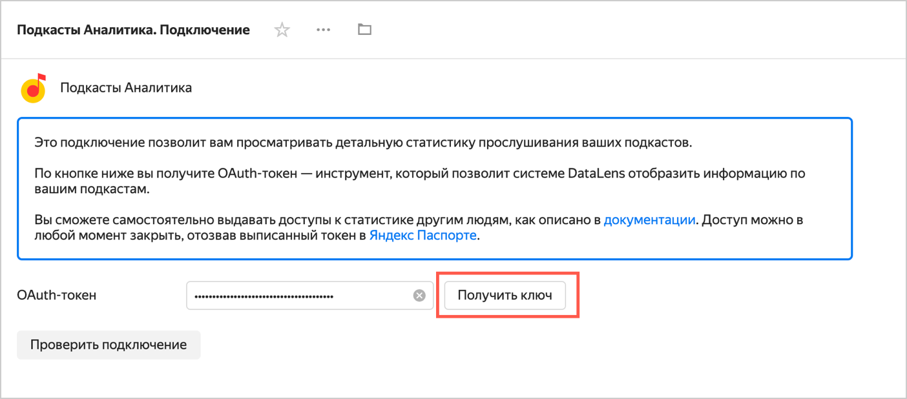

1. Click **Check connection**.
1. After successfully checking the connection, click **Create**.
1. Go to the **Dashboards** menu and open the **Yandex Music podcast analytics** dashboard. If there isn't any data, please make sure your current account has podcast access by writing to [technical support](https://yandex.com/support/music/podcast-authors/statistics.html).

### 1.3. Review podcast statistics in {{ datalens-short-name }} {#podcasts-in-datalens}

1. When the connection is created, a folder containing a set of standard objects that your statistics are based on opens:

    The **Yandex Music podcast analytics** dashboard is the primary page for viewing statistics and has all the widgets (charts, tables, and filters) available. To quickly access the dashboard, save the page link to a convenient location.

   

   *  A connection is a set of parameters for accessing podcast data. This is the key that the user needs to open the statistics.
   *  Datasets are sets of dimensions and measures that are used for creating charts.
      * Dataset **D01. Podcast listens**: A dataset with listening statistics.
      * Dataset **D02. Podcast subscribers**: A dataset with data on subscribers.
   *  Charts are sets of individual visualizations in the form of diagrams and tables used on the dashboard.
   *  The **Metrica Live Demo Dashboard** and the **Sales Dashboard** are demos that may open in your connection. You can delete them if you wish.

   

1. Open the **Yandex Music podcast analytics** dashboard.

   1. The dashboard contains four tabs:

      * Listens: General listening statistics, listening dynamics, statistics on the number of times individual episodes were listened to, and distribution of listening by day of week and time of day.
      * Audience: Podcast audience statistics, including socio-demographic data on listeners.
      * Subscribers: Audience statistics, subscribe/unsubscribe dynamics, and socio-demographic data on subscribers.
      * Reference: A reference on estimated measures and terms used in data and dashboards.

        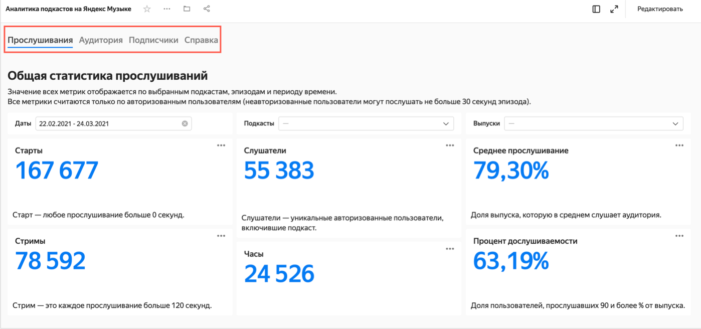

   1. Each tab contains:

      * Text widgets are headers, comments, and hints.
      * Selectors: Filters by different dimensions that can be used to filter the contents of dashboards.
      * Charts: Graphs, tables, and other visualizations.

        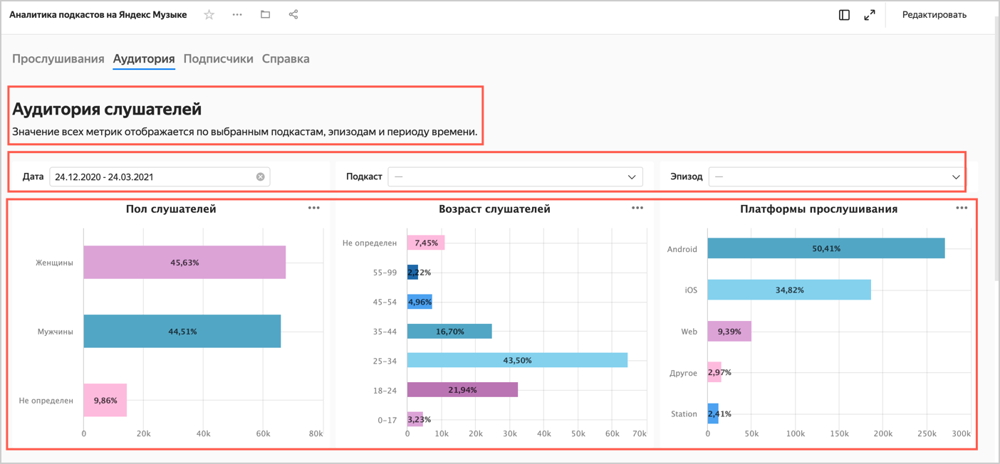

You can edit it and add standard objects as you wish. For example, delete an unnecessary chart from the dashboard or add a new one, change an existing chart, or add a selector to the dashboard.

## 2. Edit a dashboard and chart, and create new ones {#edit-dashboard-chart}

### 2.1. Edit a dashboard {#changing-dashboard}

You can change the order of charts and selectors, increase or decrease them, discard some data and, vice versa, put together the most necessary information. Try to edit the dashboard after making a copy of it:

1. In the menu on the left, go to the **Dashboards** section.
1. Next to the **Yandex Music podcast analytics** dashboard, click  and select **Copy**.
1. Open the dashboard copy and go to the **Audience** tab.
1. Click **Edit** in the upper-right corner.
1. Let's say you want to delete the **Listening platforms** chart. To do this, click  in the upper-right corner of the chart and select **Delete**.

   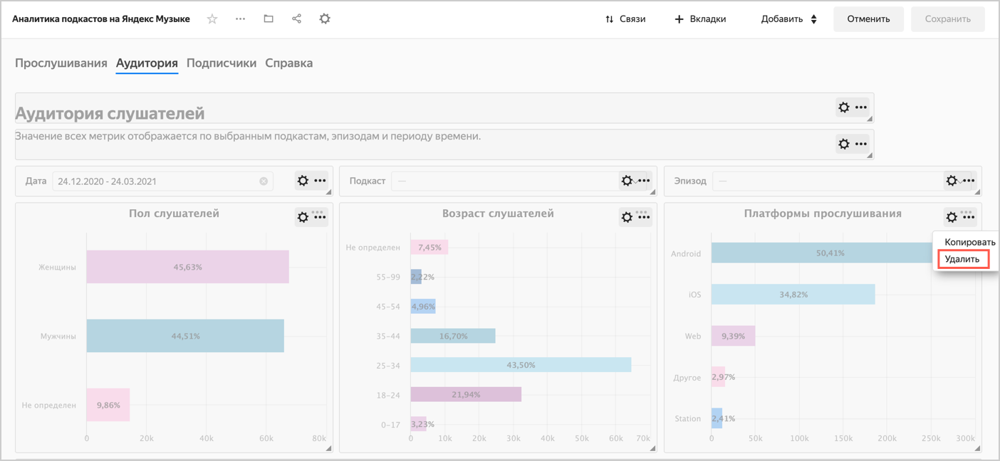

1. Try to position the **Listener gender** and **Listener age** charts so that they fill in the empty space left after deleting the chart in the previous step.

   1. Drag the chart by clicking on the chart itself. Resize the chart using the triangle in the lower-right corner.

   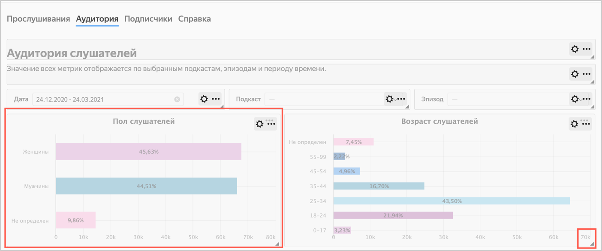

1. Click **Add** and choose **Selector**.

   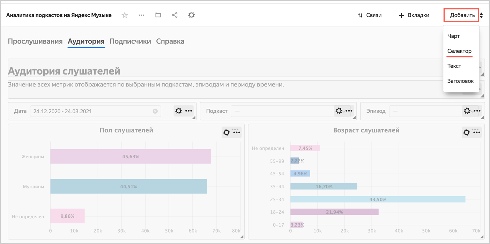

   1. Select the dataset named **D02.Podcast subscribers**.
   1. Select the **Country** field. This automatically fills in the **Title** with the name of the selected field.
   1. Activate the **Show next to the selector title** option.
   1. Click the **Show** checkbox next to the selector title.
   1. Enable the **Multiple choice** option.
   1. In the **Default value** list, select **Russia** (or any other country).
   1. Click **Add**.

      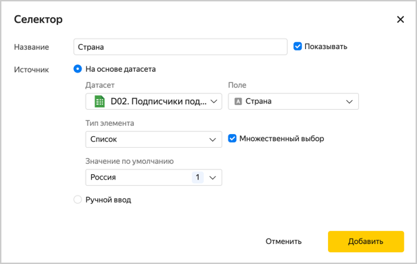

1. Move the selector to the top. If necessary, resize the charts.
1. Place the selectors on the same line, changing their size.

   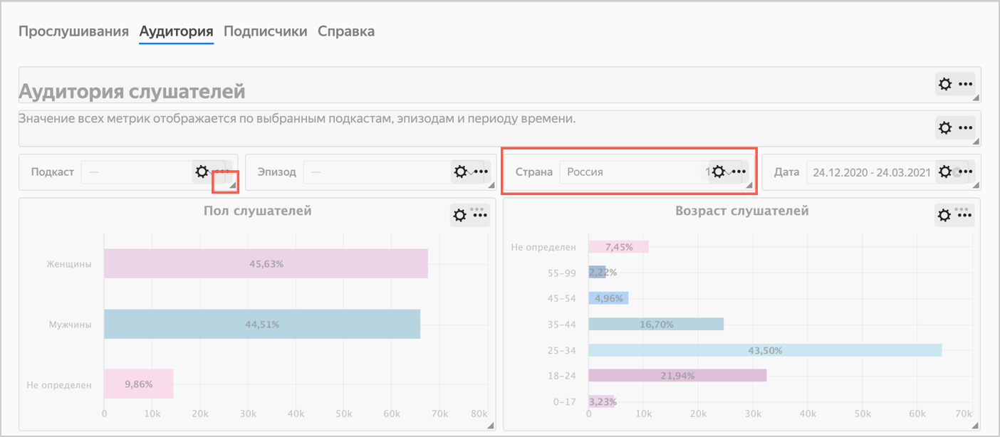

1. Click **Save** in the top right-hand corner of the dashboard.

### 2.2. Edit a chart {#changing-chart}

You can edit and configure any charts. Let's say we want to see on the chart the relative activity of listeners of different genders during the day.

1. Open the **Yandex Music podcast analytics** dashboard and click the **Listens** tab.
1. Scroll the dashboard down to the **Listening time by time of day** chart.
1. Click  in the upper-right corner of the chart and select **Edit**.

   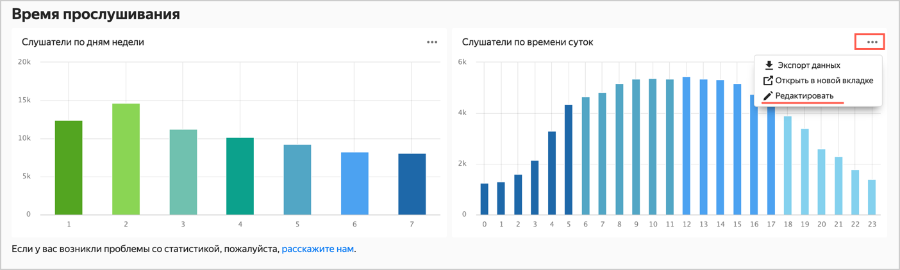

1. The chart configuration area (wizard) consists of three main parts:

   * A selection panel with a list of available dimensions and measures for creating a chart.
   * A visualization settings panel with various sections that you can use to configure your chart.
   * Chart preview.

     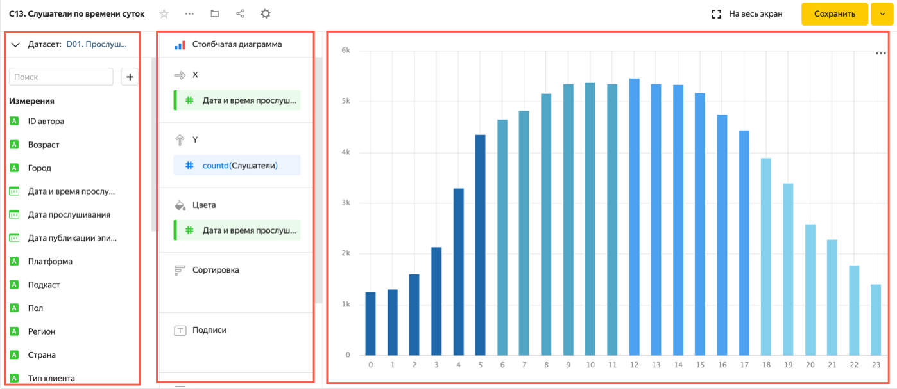

1. Delete the **Listening date and time** dimension from the **Colors** section.
1. Add a dimension named **Gender** to the **Colors** section.

   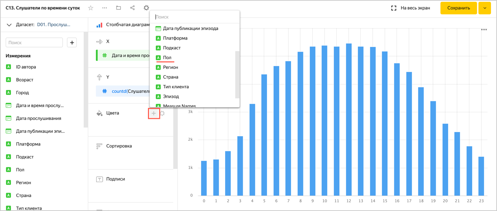

1. Select a different visualization type: **Normalized column chart**.

   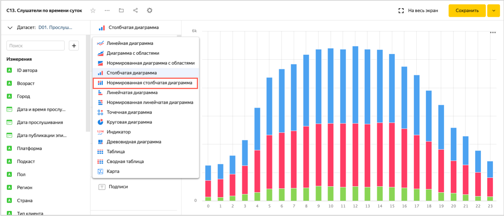

1. Now, each column shows the relative distribution of **Listeners** by **Gender** in terms of **Time of day**. Click **Save** in the upper-right corner of the chart.

   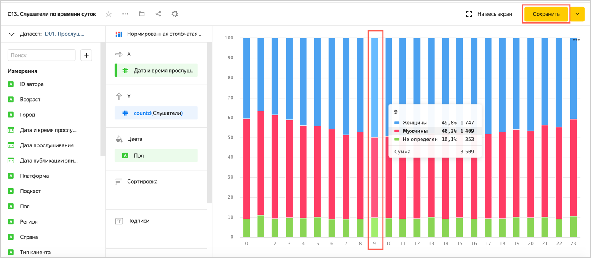

Refresh the dashboard page to apply the chart changes.

### 2.3. Create a new chart and add it to the dashboard {#creating-chart}

Let's say we want to build a chart with the total number of times streams were listened to over the entire period.

1. Open the [service home page]({{ link-datalens-main }}).
1. Click **Create chart**.
1. Go to the **Podcasts** folder.
1. Choose the dataset **D01. Podcast listens**.

   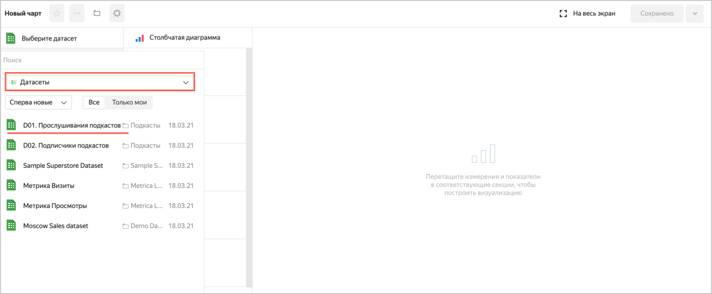

1. Select **Stacked area chart** as the visualization type.
1. Add a dimension named **Listening date** to the **X** section.
1. Add a measure named **Listeners** to the **Y** section.
1. Add the **Listening date** dimension to the **Chart filters** section.

   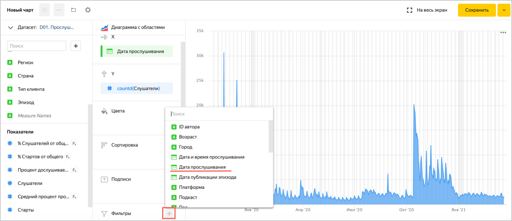

   1. Click  in the **Listening date** field under **Chart filters**.

      1. In the **Preset** list, select **Last 365 days** and click **Apply filter**.

1. Click  in the **Listening date** under **X**.

   1. In the **Grouping** list, select **Month** and click **Apply**.

1. Add a dimension named **Episode** to the **Colors** section.
1. If you have too many episodes, hide the legend at the bottom of the chart. To do this, click  ⟶ **Hide**, then **Apply**.

   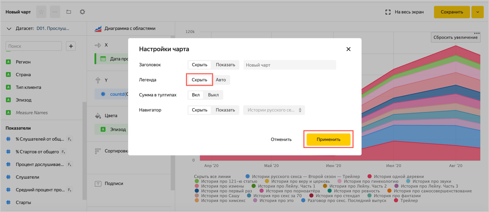

1. Click **Save** in the upper-right corner of the chart.

   1. Enter the name **Episode listening dynamics** and click **Apply filter**.

   

   If the **Listening date** field filter is added to the dashboard, filtering by this field in the chart is ignored.

   

1. Go to the chart's top panel and click the navigation icon .
1. In the resulting window, select the **Yandex Music podcast analytics** dashboard.
1. In the upper-right corner of the dashboard, click **Edit**.
1. Click **Add** ⟶ **Chart**.

   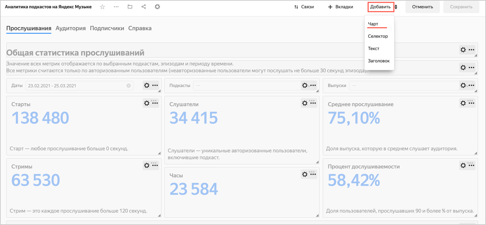

1. In the window that opens, click **Select**.

   1. Choose the **Episode listening dynamics** chart. This automatically fills in the **Title** field with the name of the selected chart.
   1. Click **Add**.

1. Place the chart next to the table in the **Episode listening statistics** section and click **Save**.

   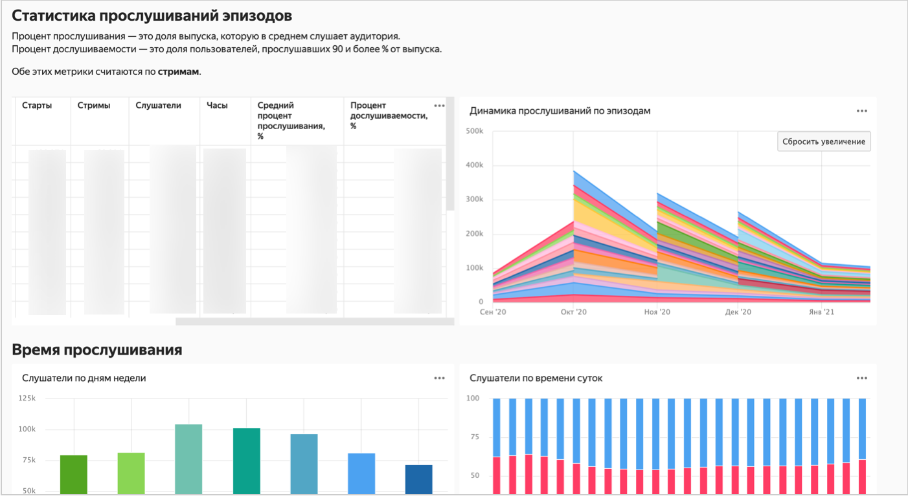

## 3. Share podcast analytics {#share-analytics}

### 3.1. Grant access to {{ datalens-short-name }} {#open-access}

You can grant access to your personal dashboard to other users. To do this, you only need a Yandex account.

Set up access to {{ datalens-full-name }}:

1. Go to [Access control]({{ link-console-access-management }}).
1. In the top right-hand corner, click **Add user**.
1. Enter the user's Yandex email address. The new user appears in the list of users.
1. Click  next to the new user and select **Edit roles**.
1. Under **Roles in folders**, select a folder. In the **Roles** column, click . Assign the `datalens.instances.user` role.

   After that, you can share a link to the dashboard with the new user.

1. Make sure that the new user has access rights to the dashboard with podcast statistics. Open the dashboard.
1. Click  → **Access rights**.

   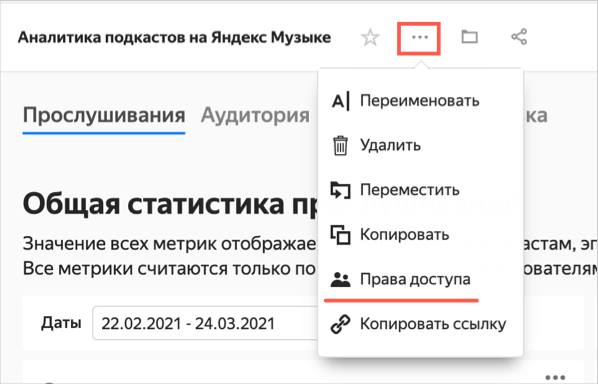

1. Permissions must be assigned to the **All** group or a specific user. If permissions are missing, click **Add**.
1. In the **Add member** field, enter "All" or the name of the user who needs extended permissions.
1. Go to the **Current object** section and set access permissions for the **Yandex Music podcast analytics** dashboard:

   * Execute — execution of requests to the object is available.
   * Read — read only is available.
   * Write — view and edit options are available.
   * Admin — view, edit, and manage options are available.

   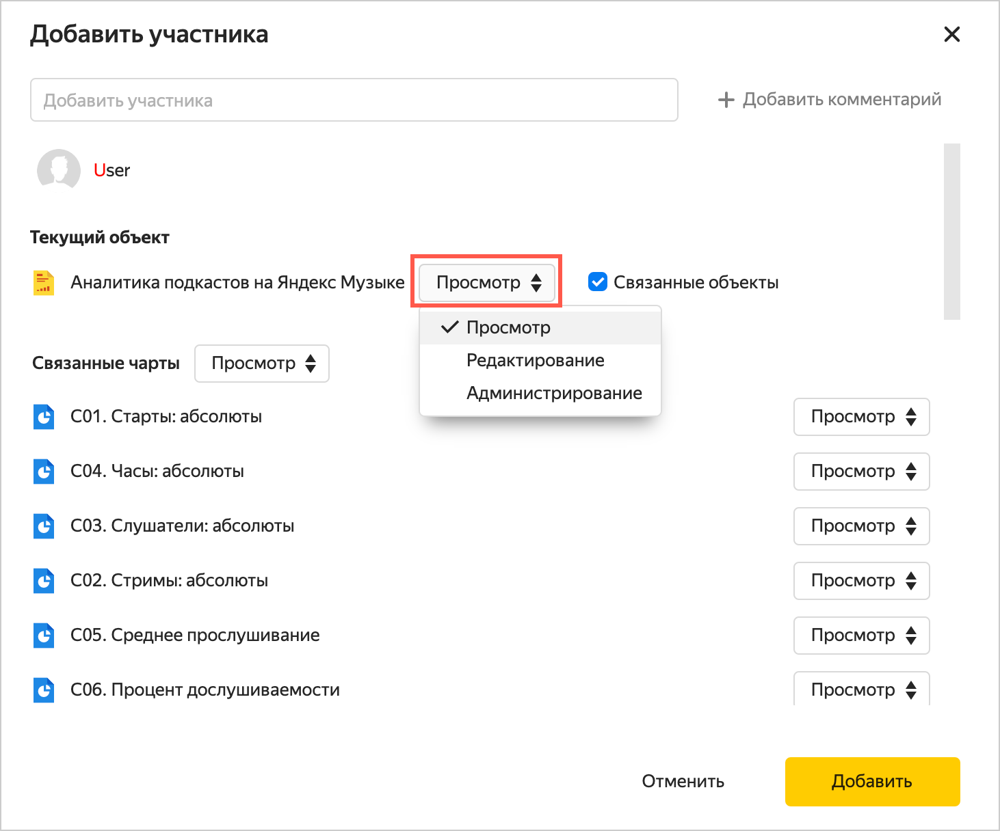

1. Enable the **Linked objects** option to grant permissions to other dashboard-related objects (connections, dashboards, and charts).

   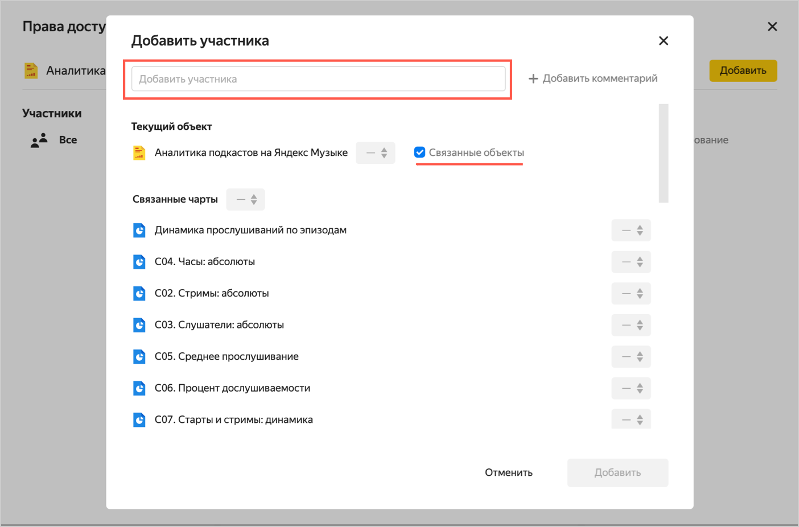



The user will be able to view statistics immediately, and you can set up additional permissions for the user's account in a few hours.

Permissions can be set up for each object separately. Learn more about [permissions in DataLens](../../datalens/security/index.md#permissions).



### 3.2. Share analytics on a particular podcast or episode {#share-analytics-on-podcast-or-episode}

You can grant a user, such as a partner or advertiser, access not to the entire dashboard with podcaster statistics, but to statistics for an individual podcast or episode. For that, the user will also need a Yandex account.

For a user to be able to request data on an episode via charts but not view or edit connection or dataset settings, [restrict shared access](#restrict-access).

Then grant the user access to the objects: **Podcasts Analytics. Connection**, **D01. Podcast listens** and **D02. Podcast subscribers**. Specify which podcast or episode you grant access to.

#### 3.2.1. Restrict shared access {#restrict-access}

To restrict shared access:

1. Open the **Yandex Music podcast analytics** dashboard.
1. Go to the chart's top panel and click the navigation icon .
1. In the window that opens, select the connection **Podcasts Analytics. Connection**. Click  → **Access rights**.
1. Click on the All group and set the permissions to **Execute**. Shared access will be restricted: other users will be able to view statistics on the dashboard, for example, only for individual episodes, but won't be able to change these settings.

Repeat the action for datasets **D01. Podcast listens** and **D02. Podcast subscribers**.
If you don't want to share podcast subscriber analytics with users, you can revoke permission of dataset **D02. Podcast subscribers** for the All group.

#### 3.2.2. Restrict access to data (podcasts/episodes) {#provide-access-to-podcast}

When setting up permissions to individual podcasts and episodes, specify the following:

* The users who will be granted permissions to a podcast or episode.
* The users who will be able to access everything.

In this step, retain permissions to all podcasts for yourself and your colleagues.

Choose which data you want to restrict access to:



- Podcasts

  1. Open the dataset named **D01. Podcast listens**.
  1. In the **Podcast** field menu, click **Permissions**.

     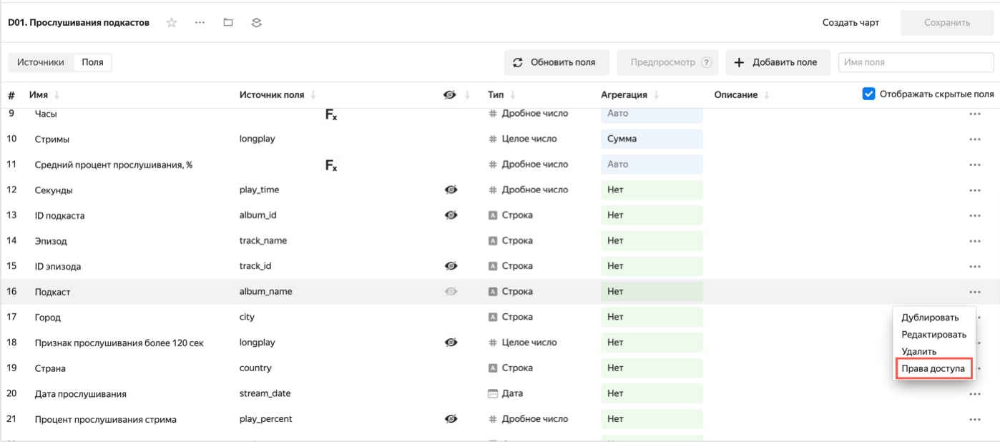

  1. In the **Field permission settings** window, set a filter like:

     `* : my-login@yandex.com`
     where:
     * `*`: Access to all podcasts.
     * `my-login@yandex.com`: Your username.

     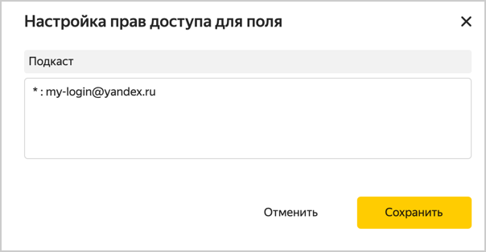

  1. Click **Save**. Once you save the dataset, its data will only be available to one user: `my-login@yandex.com`.
  1. If necessary, specify the comma-separated usernames of the other users who need permission to all podcasts and episodes. For example, `* : my-login@yandex.com, friend-login@yandex.com`.

- Episodes

  1. Open the dataset named **D01. Podcast listens**.
  1. In the **Episode** field menu, click **Permissions**.

     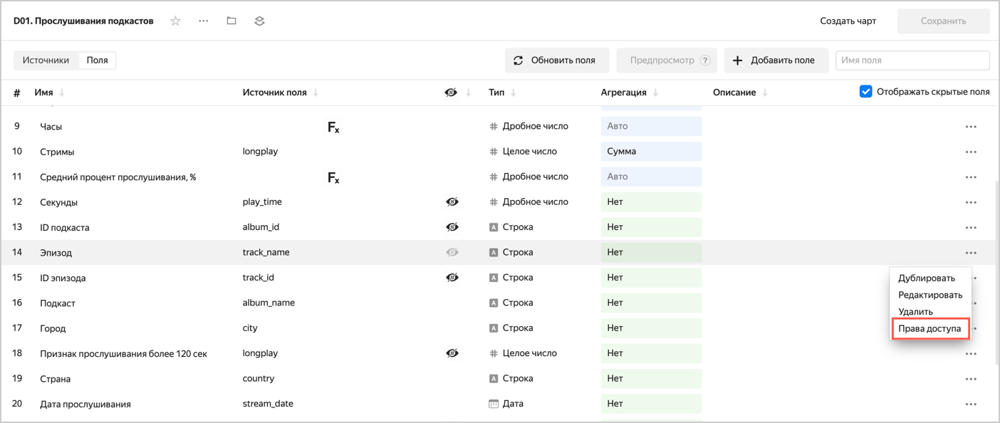

  1. In the **Field permission settings** window, set a filter like:

     `* : my-login@yandex.com`
     where:
     * `*`: Access to all episodes.
     * `my-login@yandex.com`: Your username.

     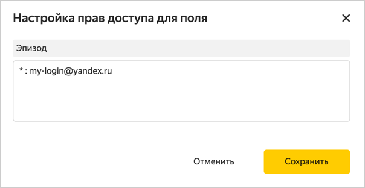

  1. Click **Save**. Once you save the dataset, its data will only be available to one user: `my-login@yandex.com`.
  1. If necessary, specify the comma-separated usernames of the other users who need permission to all podcasts and episodes. For example, `* : my-login@yandex.com, friend-login@yandex.com`.



#### 3.2.3. Grant access to your {{ datalens-short-name }} instance {#access-to-datalens-instance}

To grant a user access to your {{ datalens-short-name }} instance:

1. Go to [Access control]({{ link-console-access-management }}).
1. In the top right-hand corner, click **Add user**.
1. Enter the user's Yandex email address. The new user appears in the list of users.
1. Click  next to the new user and select **Edit roles**.
1. Under **Roles in folders**, select a folder. In the **Roles** column, click . Assign the `datalens.instances.user` role.



The user will be able to view statistics immediately, and you can set up additional permissions for the user's account in a few hours.



#### 3.2.4. Grant an individual user limited access to data {#provide-access-to-podcast-episode}

1. Open the dataset named **D01. Podcast listens**.
1. Choose which data you want to restrict access to for an individual user:

   

   - Podcasts

     1. In the **Podcast** field menu, click **Permissions**.

        

     1. In the **Field permission settings** window, set a filter like:

        `'The most interesting podcast': partner-login@yandex.com`
        where:
        * `The most interesting podcast`: The podcast name.
        * `partner-login@yandex.com`: A partner's username.

        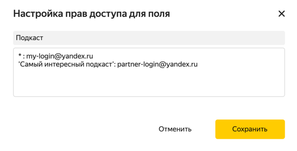

   - Episodes

     1. Open the dataset named **D01. Podcast listens**.
     1. In the **Episode** field menu, click **Permissions**.

         

     1. In the **Field permission settings** window, set a filter like:

         `'Episode No. 5': partner-login@yandex.com`
         where:
         * `Episode No. 5`: The name of the episode.
         * `partner-login@yandex.com`: A partner's username.

         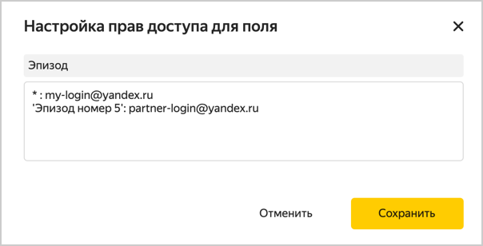

      

   If you want to grant permission to multiple episodes, add additional lines for each episode individually.
   Learn more about [data-level permissions](../../datalens/security/row-level-security.md).

   

   Specify the same names as in the service (filtering is case-sensitive).

   

   A user's permissions will remain valid until they are [revoked](#revoke-access).

1. Share a link to the **Yandex Music podcast analytics** dashboard with the user. To do this, click  → **Copy link** on the dashboard.

### 3.3. Revoke a user's access privileges {#revoke-access}

If necessary, you can revoke a user's permissions:

1. Go to the connection **Podcasts Analytics. Connection**.
1. Click  and select **Access rights**.
1. Select the user to revoke permissions from.
1. In the window that opens, click **Revoke permissions**.
1. To completely disable the user's access to your dashboard with podscaster statistics:

   1. Go to [Access control]({{ link-console-access-management }}).
   1. Find the user, click the icon next to the new user, and select **Delete**.

## 4. Make a dashboard or chart public {#publish-dashboard-chart}

Data in {{ datalens-short-name }} is only available to users of a specific instance. If you want to provide unlimited public access to podcast analytics, publish a dashboard or a particular chart in [DataLens Public](../../datalens/concepts/datalens-public.md).



- Publishing dashboards

  1. Open the **Yandex Music podcast analytics** dashboard.
  1. At the top of the dashboard interface, click .
  1. In the public access settings window that opens, enable **Access via link**.
  1. Confirm the publishing and click **Next**.
  1. Select the charts you want to publish with the dashboard.
  1. Copy the public link and click **Apply**.

- Publishing a chart

  1. On the navigation page, find a chart like **C07. Starts and streams: dynamics** and open it.
  1. At the top of the chart interface, click .
  1. In the public access settings window that opens, enable **Access via link**.
  1. Confirm the publishing and click **Next**.
  1. Copy the public link and click **Apply**.



## 5. Add a chart or dashboard to your website {#add-dashboard-chart}

You can embed the published charts into a website or app using the `iframe` element. To do this:

1. Follow the public link to the chart.
1. Click  in the upper-right corner of the chart and select **Embed code**.
1. Copy the `iframe` code to embed in a light or dark theme.
1. Embed the code into your website.



You can only embed individual charts. Embedding the entire dashboard is not supported.



## Questions and answers {#qa}



Using a Yandex account in Yandex Music and {{ datalens-short-name }} ensures high data security.





Data is updated daily at 13:00. If someone listens to a podcast after this time, the data will only appear in the statistics the next day. Playbacks of less than 1 second are not included in the statistics.





New subscribers appear in the service instantly, while in the statistics only the next day. If a person subscribes to a podcast today, the number of subscribers in the statistics will increase tomorrow.





The statistics only show episodes that are already listened to. If you don't see a certain episode at the moment, it will appear on charts later as soon as it is listened to for the first time.





Promo periods and titles aren't displayed in the statistics separately, but a sharp increase in listens may indicate that the podcast was promoted.





Yes, you can edit the dashboard and related objects.





Re-create a connection and the dashboard will expand again.





{{ datalens-short-name }} is a full-fledged data analysis and visualization tool. Use its rich set of settings to create different types of visualizations that meet a variety of user requirements.





You are not restricted to using {{ datalens-short-name }}. You can connect to your own data sources, build charts and dashboards, and share them with your colleagues.


