# Yandex Music podcasts: Statistics

Let’s use a podcast from Yandex Music you have access to as your data source. 
With podcast analytics, you can get statistics and analyze podcast listening and subscriber data in Yandex Music. To work with podcast analytics, you must have access to at least one podcast.



To visualize and analyze the data, follow these steps:

1. [Set up your connection](#configure-connection).

   1. [Set up {{ datalens-short-name }}](#before-you-begin).
   1. [Create a connection](#create-connection).
   1. [Review podcast statistics in {{ datalens-short-name }}](#podcasts-in-datalens). 

1. [Edit a dashboard and chart, and create new ones](#edit-dashboard-chart).

   1. [Edit a dashboard](#changing-dashboard).
   1. [Edit a chart](#changing-chart).
   1. [Create a new chart and add it to the dashboard](#creating-chart).

1. [Share podcast analytics with other users](#share-analytics).

   1. [Grant access to {{ datalens-short-name }}](#open-access).
   1. [Share analytics on a particular podcast or episode](#share-analytics-on-podcast-or-episode).

      1. [Restrict shared access](#restrict-access). 
      1. [Restrict access to data (podcasts/episodes)](#provide-access-to-podcast).
      1. [Grant access to your {{ datalens-short-name }} instance](#access-to-datalens-instance).
      1. [Grant restricted access to data to an individual user](#provide-access-to-podcast-episode).

   1. [Revoke a user's access permissions](#revoke-access).

1. [Make a dashboard or chart public](#publish-dashboard-chart).
1. [Add a chart or dashboard to your website](#add-dashboard-chart).

We recommend checking out [this FAQ](#qa) covering questions commonly asked by Yandex Music podcast statistics users.

## 1. Set up your connection {#configure-connection}

### 1.1 Set up {{ datalens-short-name }} {#before-you-begin}

{{ datalens-full-name }} is deployed on the {{ yandex-cloud }} platform. 

Set up {{ datalens-short-name }} depending on your experience:

* You are a new user (you only want to use {{ datalens-full-name }} for podcast analysis).
* You are already using {{ datalens-full-name }} (for other purposes).



### 1.2. Create a connection {#create-connection}



Only users with permissions for a Yandex Music podcast can create connections and process podcast analytics. If you do not have access to any podcast, no data will be displayed on the dashboard.
 
You will get access after uploading a podcast to Yandex Music. The podcast is linked to the Yandex email address you specified when uploading it.
   


1. Follow the link you received in the email after filling out the form for your connection.
1. Enter a name for the connection, e.g., `My Podcast` (you can use any name).
1. Click **Get key**. If this is your first time creating a connection to Yandex Music podcasts, grant the service the required permissions.

   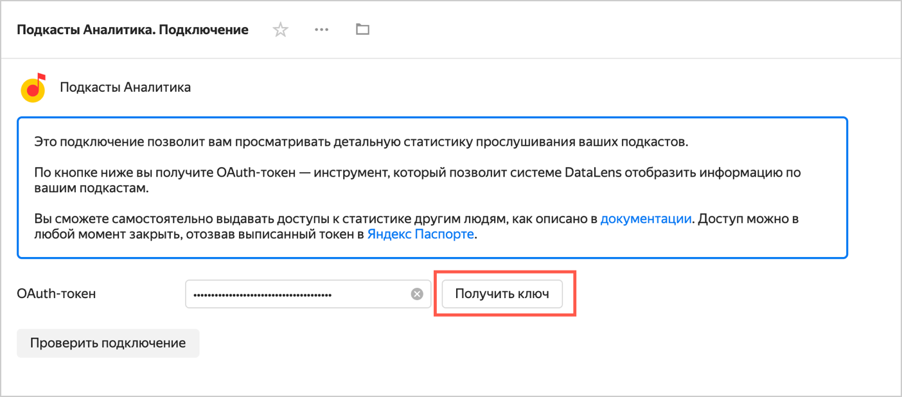

1. Click **Check connection**.
1. After successfully checking the connection, click **Create**.
1. Go to the **Dashboards** menu and open the `Yandex Music podcast analytics` dashboard. If there is no data, make sure your current account has access to podcasts by contacting the [support team](https://yandex.com/support/music/podcast-authors/statistics.html).

### 1.3. Review podcast statistics in {{ datalens-short-name }} {#podcasts-in-datalens}

1. After you created the connection, a folder containing a set of standard objects that your statistics are based on opens:

    The `Yandex Music podcast analytics` dashboard is the main statistics page featuring all the widgets, such as charts, tables, and filters. Save the page link to quickly access the dashboard.
        
   
    
   *  Connection: Set of parameters for accessing podcast data. It is the key the user needs to open the statistics.
   *  Datasets: Sets of dimensions and measures used to create charts.

     * `D01. Podcast listens`: Dataset with data on listens.
     * `D02. Podcast subscribers`: Dataset with data on subscribers.

   *  Charts: Set of individual visualizations (diagrams and tables) used on the dashboard.
   *  The `Metrica Live Demo Dashboard` and the `Sales Dashboard` are demos that may open in your connection. You can delete them if you need to.
   
   
 
1. Open the `Yandex Music podcast analytics` dashboard.

   1. The dashboard has four tabs:

      * Listens: General listening statistics, listening dynamics, statistics on the number of times individual episodes were listened to, and distribution of listening by day of week and time of day.
      * Audience: Podcast audience statistics, including socio-demographic data on listeners.
      * Subscribers: Audience statistics, subscribe/unsubscribe dynamics, and socio-demographic data on subscribers.
      * Reference: Reference on estimated measures and terms used in data and dashboards.
    
      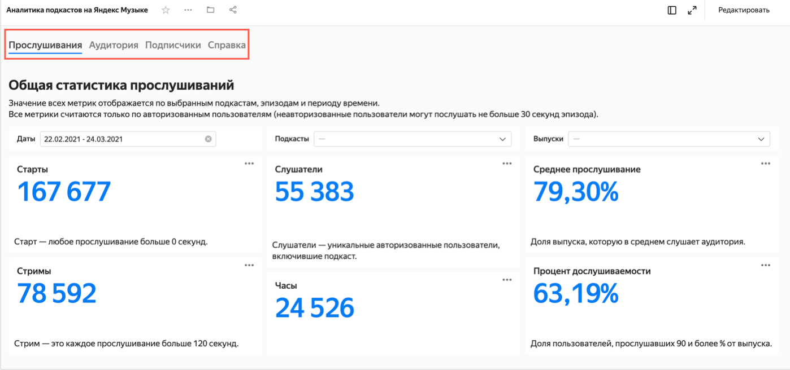
   
   1. Each tab contains:

      * Text widgets: Headers, comments, and tooltips.
      * Selectors: Filters by different dimensions that can be used to filter the contents of dashboards.
      * Charts: Graphs, tables, and other visualizations.
 
      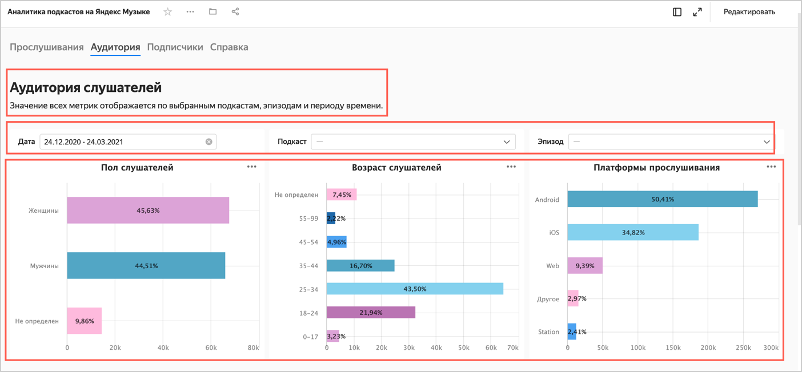
    
You can edit it and add standard objects as needed. For example, delete an unnecessary chart from the dashboard or add a new one, change an existing chart, or add a selector to the dashboard.

## 2. Edit a dashboard and chart, and create new ones {#edit-dashboard-chart}

### 2.1. Edit a dashboard {#changing-dashboard}

You can change the order of charts and selectors, resize them, discard some data and, vice versa, put together the most relevant information. Try to edit the dashboard after making a copy of it:

1. In the left-hand menu, go to the **Dashboards** section.
1. Next to the `Yandex Music podcast analytics` dashboard, click  and select **Copy**.
1. Open the dashboard copy and go to the `Audience` tab.
1. Click **Edit** in the top-right corner.
1. Let's say you want to delete the `Listening platforms` chart. To do this, click  in the top-right corner of the chart and select **Delete**.
   
   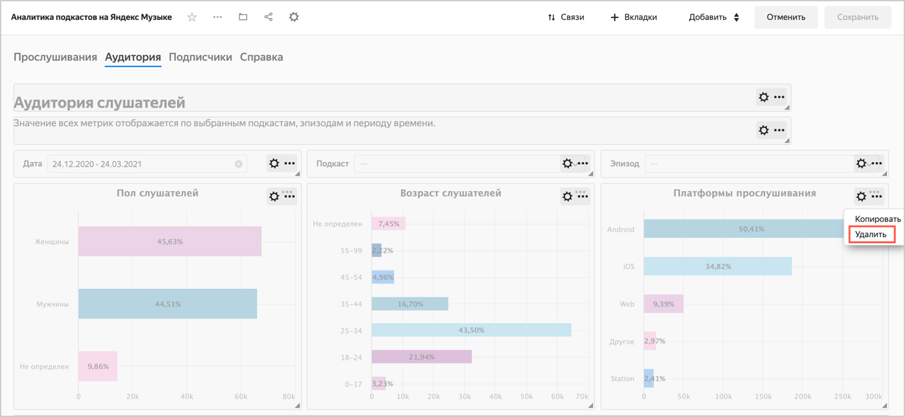
    
1. Position the `Listener gender` and `Listener age` charts so that they fill in the empty space left after deleting the chart in the previous step.

   1. Drag the chart by clicking it. Resize the chart using the triangle in the bottom-right corner.
    
   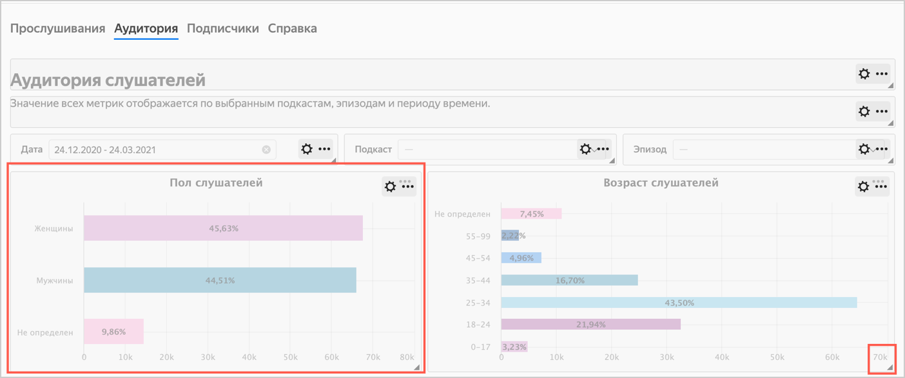  
    
1. Click **Add** and choose **Selector**.
    
   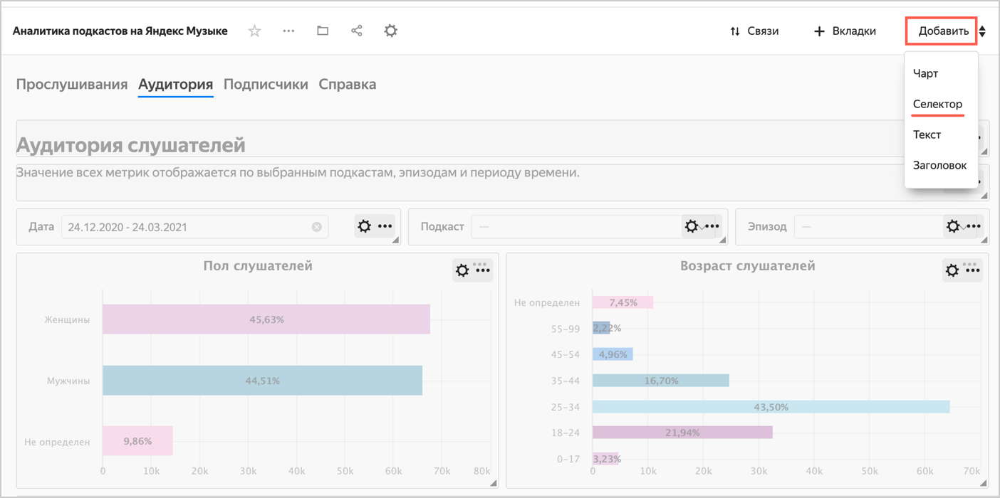
    
   1. Select the dataset named `D02.Podcast subscribers`.
   1. Select the `Country` field. This will automatically populate the **Title** with the name of the selected field.
   1. Activate the **Show next to the selector title** option.
   1. Click the **Show** checkbox next to the selector header.
   1. Enable **Multiple choice**.
   1. In the **Default value** list, select `Russia` (or any other country).
   1. Click **Add**.
   
   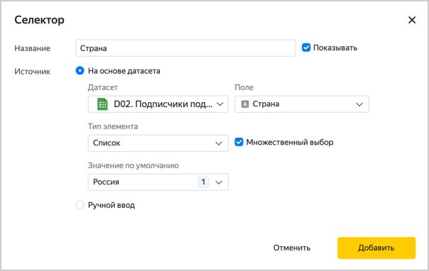 
   
1. Move the selector to the top. You can resize the charts if needed.
1. Place the selectors on the same line, resizing them.

   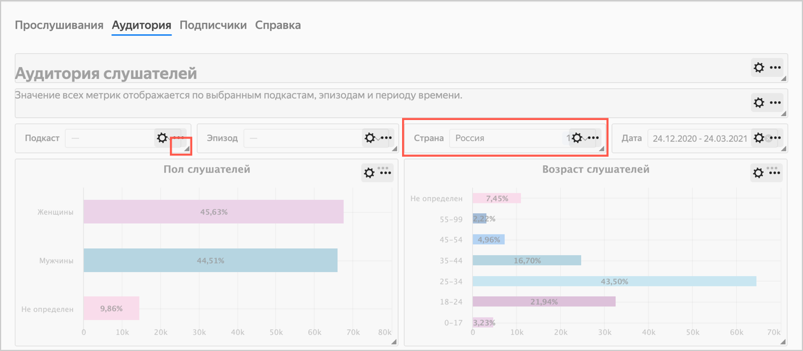 
     
1. Click **Save** in the top-right corner of the dashboard.

### 2.2. Edit a chart {#changing-chart}

You can edit and configure any charts. Let's say we want to see on the chart the relative activity of listeners of different genders during the day.

1. Open the `Yandex Music podcast analytics` dashboard and click the `Listens` tab.
1. Scroll the dashboard down to the `Listening time by time of day` chart.
1. Click  in the top-right corner of the chart and select **Edit**.

   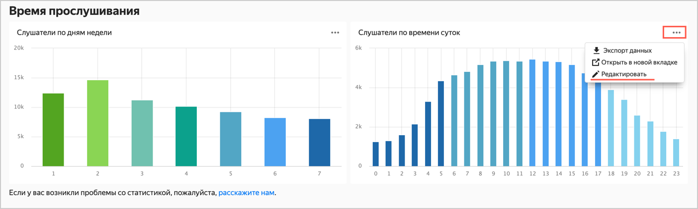 

1. The chart configuration area (wizard) consists of these three main parts:

   * Selection panel with a list of available dimensions and measures for building a chart.
   * Visualization settings panel with various sections you can use to configure your chart.
   * Chart preview.
   
   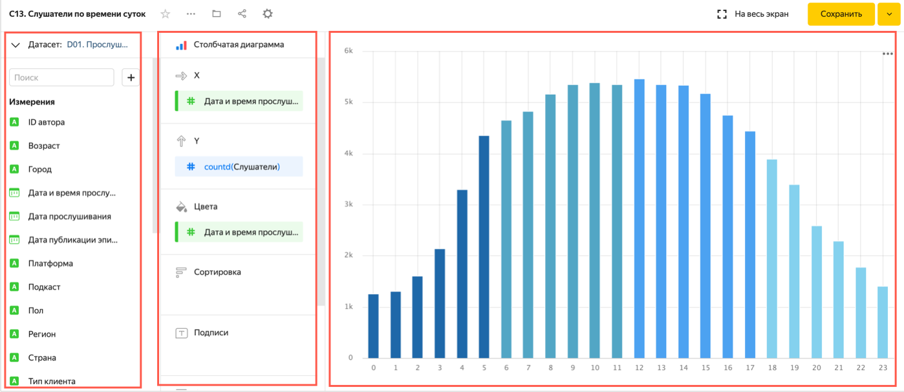 
   
1. Delete the `Listening date and time` dimension from the **Colors** section.
1. Add a dimension named `Gender` to the **Colors** section.

   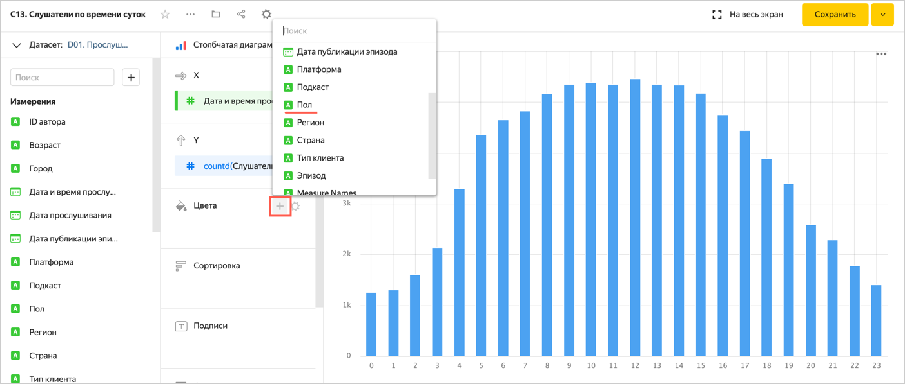 
    
1. Select a different visualization type: **Normalized column chart**.
    
   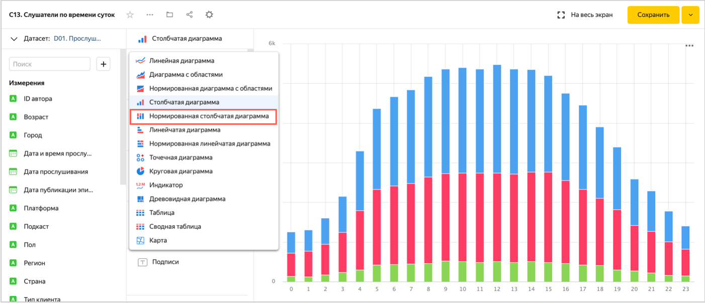 

1. Now, each column shows the relative distribution of `Listeners` by `Gender` in terms of `Time of day`. Click **Save** in the top-right corner of the chart.

   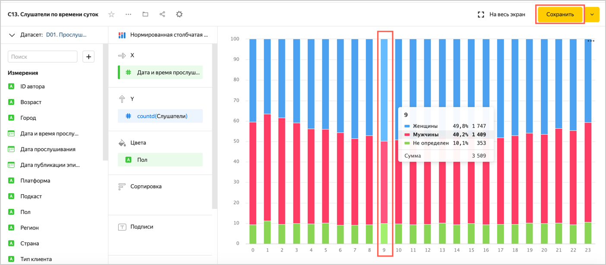  

Refresh the dashboard page to apply the chart changes.

### 2.3. Create a new chart and add it to the dashboard {#creating-chart}

Let's say we want to build a chart with the total number of listens by stream over the entire period.
1. Open the [service home page]({{ link-datalens-main-skip-promo }}).
1. Click **Create chart**.
1. Go to the `Podcasts` folder.
1. Select the `D01. Podcast listens` dataset.

   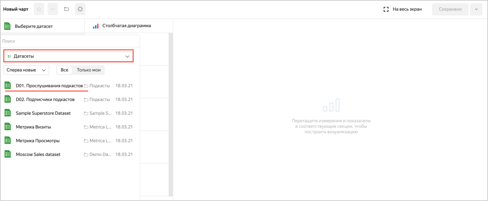  

1. Select **Area chart** as the visualization type.
1. Add a dimension named `Listening date` to the **X** section.
1. Add a measure named `Listeners` to the **Y** section.
1. Add the `Listening date` dimension to the **Filters** section.

   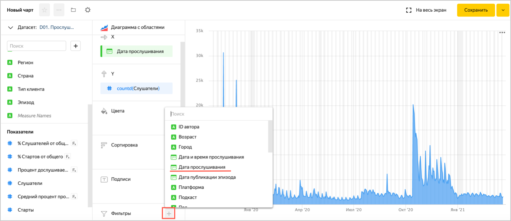 
   
   1. Click  in the `Listening date` field under **Filters**.

      1. In the **Preset** list, select **Last 365 days** and click **Apply filter**.

1. Click  in the `Listening date` field under **X**.

   1. In the **Grouping** list, select **Month** and click **Apply**.

1. Add the `Episode` dimension to the **Colors** section.
1. If you have too many episodes, hide the legend at the bottom of the chart. To do this, click  ⟶ **Hide**, then **Apply**.

   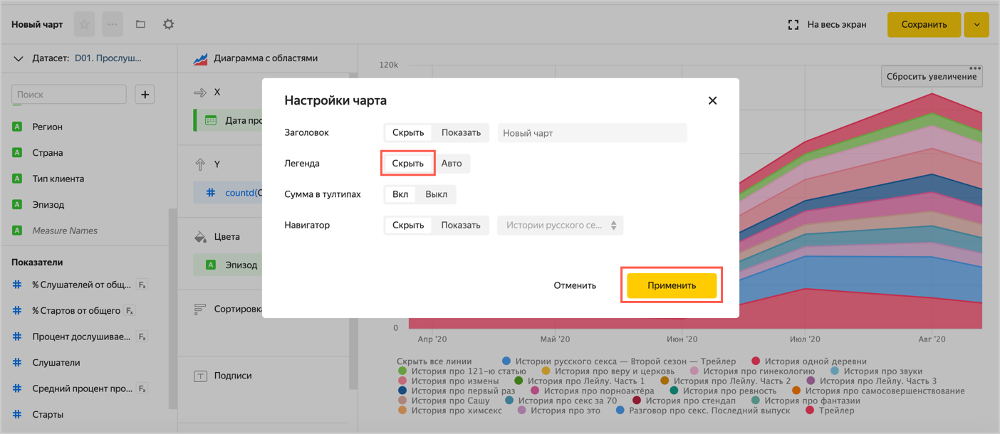 

1. Click **Save** in the top-right corner of the chart.

   1. Enter the name `Episode listening dynamics` and click **Apply filter**.
   
   
    
   If the `Listening date` field filter is added to the dashboard, filtering by this field in the chart is ignored.
  
   

1. Go to the chart's top panel and click the  navigation icon. 
1. In the window that opens, select the `Yandex Music podcast analytics` dashboard.
1. In the top-right corner of the dashboard, click **Edit**.
1. Click **Add** ⟶ **Chart**.

   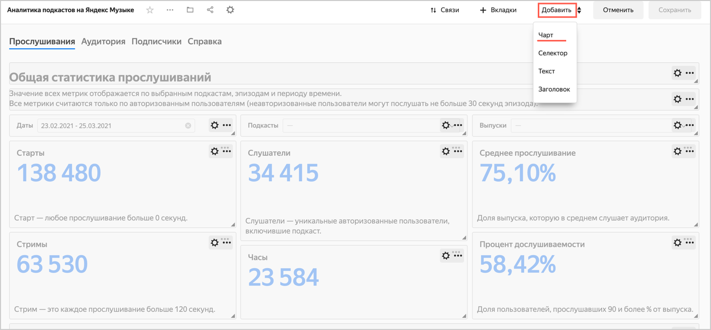

1. In the window that opens, click **Select**.

   1. Select the `Episode listening dynamics` chart. This will automatically populate the **Title** field with the name of the selected chart.
   1. Click **Add**.

1. Place the chart next to the table in the `Episode listening statistics` section and click **Save**. 
    
   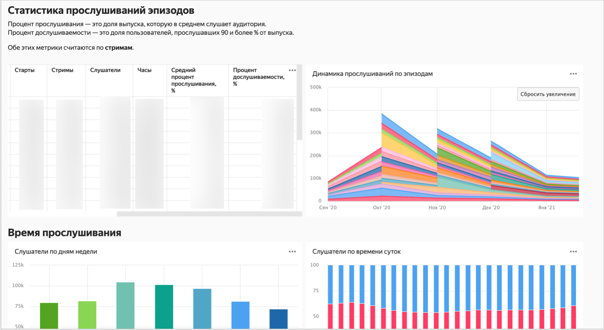

## 3. Share podcast analytics {#share-analytics}



Optionally, purchase additional seats for users you want to share podcast analytics with.

For more information, see our [pricing policy](../../datalens/pricing.md) for {{ datalens-short-name }}.

### 3.1. Grant access to {{ datalens-short-name }} {#open-access}

You can grant access to your personal dashboard to other users. To do this, you only need a Yandex account.

Set up access to {{ datalens-full-name }}:

1. Go to [Access control]({{ link-console-access-management }}).
1. In the top-right corner, click **Add user**. 
1. Enter the user's Yandex email address. The new user will appear in the list of users.
1. Click  next to the new user and select **Change roles**.
1. Under **Roles in folders**, select a folder. In the **Roles** column, click . Assign the `datalens.instances.user` role.
   After that, you can share a link to the dashboard with the new user.
1. Make sure the new user has the permissions to access the dashboard with podcast statistics depending on its location:

   

   - Workbook {#workbook}

     Workbook permissions apply to all objects within the workbook. Grant access to the workbook the podcast statistics dashboard is in:

     1. At the top of the workbook, click  **Access**.
     1. Permissions must be assigned to a specific user or a group the user is a member of. If there are no permissions, click **Add user**.
     1. In the window that opens, select a user or user group and specify an access permission for the workbook:

        * `Limited view`: Allows viewing the workbook’s nested charts and dashboards and the info on the access permissions for it.
        * `View`: Allows viewing all the workbook’s nested objects and the info on the access permissions for them.
        * `Edit`: Allows editing the workbook and all its nested objects.
        * `Administration`: Allows managing the workbook, access to it, and all its nested objects.

     1. Click **Save**. The user or user group will get permissions for this object.

        
        
        The user will be able to view statistics immediately, and you can set up additional permissions for the user's account in a few hours.

        Learn more about [roles in {{ datalens-short-name }}](../../datalens/security/roles.md).
        
        

   - Directory {#folder}

     1. Open the dashboard.
     1. At the top right, click  →  **Access permissions**.
     1. Permissions must be assigned to the **All** group or a specific user. If there are no permissions, click **Dashboard permissions**.
     1. In the **Add member** field, enter the username or the **All** group.
     1. Under **Current object**, set access permissions for the `Yandex Music podcast analytics` dashboard:

        * `Execute`: Allows queries to the object.
        * `View`: Viewing only.
        * `Edit`: Viewing and editing.
        * `Administration`: Viewing, editing, and management.

        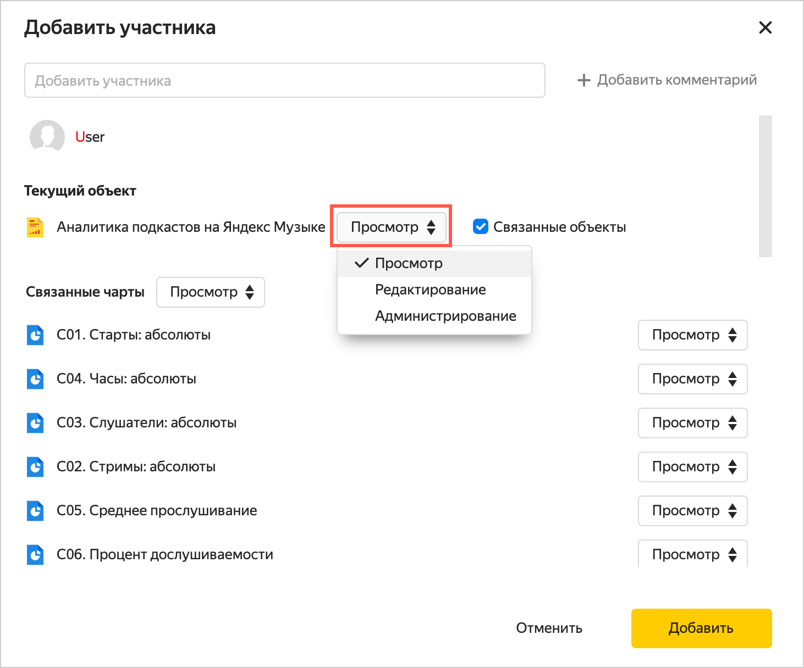

     1. Enable the **Linked objects** option to grant permissions for other objects linked to the dashboard, i.e., the connection, datasets, and charts.

        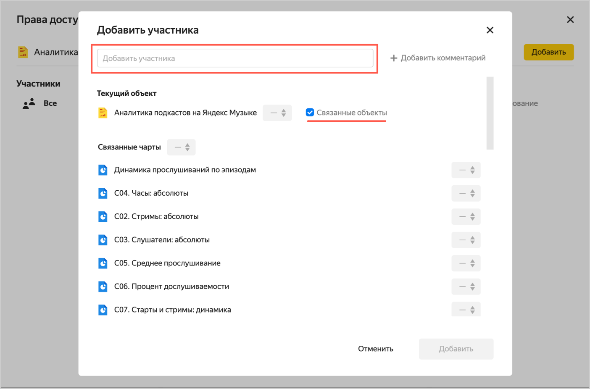

        

        The user will be able to view statistics immediately, and you can set up additional permissions for the user's account in a few hours.

        You can set up permissions for each [object](../../datalens/security/manage-access.md) separately.

        
   
   
  
### 3.2. Share analytics on a particular podcast or episode {#share-analytics-on-podcast-or-episode}

You can grant a user, such as a partner or advertiser, access to statistics for an individual podcast or episode rather than to the entire podcaster statistics dashboard. For that, the user will also need a Yandex account.

If you want the user to be able to request data on an episode via charts without viewing or editing the connection or dataset settings, [restrict shared access](#restrict-access). 

Then, grant the user access to these objects: `Podcasts Analytics. Connection`, `D01. Podcast listens`, and `D02. Podcast subscribers`. Specify which podcast or episode you want to grant access to.

#### 3.2.1. Restrict shared access {#restrict-access}

To restrict shared access:



- Workbook {#workbook}

  1. Open the workbook with the `Yandex Music podcast analytics` dashboard.
  1. At the top of the workbook, click  **Access**.
  1. Click **Add user**.
  1. In the window that opens, select the `All users in the <organization_name> organization` and specify the `Limited view` access permission for the workbook. Shared access will be restricted: other users will be able to view statistics on the dashboard, e.g., only for individual episodes, but will not be able to change these settings.  

- Directory {#folder}

  1. Open the `Yandex Music podcast analytics` dashboard.
  1. Go to the chart's top panel and click the  navigation icon. 
  1. In the window that opens, select `Podcasts Analytics. Connection`. Click  → **Access permissions**. 
  1. Click the **All** group and set the `Execute` permissions. Shared access will be restricted: other users will be able to view statistics on the dashboard, e.g., only for individual episodes, but will not be able to change these settings.

  Repeat the action for `D01. Podcast listens` and `D02. Podcast subscribers`.
  If you do not want to share podcast subscriber analytics with users, you can revoke permissions for the `D02. Podcast subscribers` dataset from the **All** group.


   
#### 3.2.2. Restrict access to data (podcasts/episodes) {#provide-access-to-podcast}

When setting up permissions for individual podcasts and episodes, specify the following:

* Users who will get the permissions for a podcast or episode.
* Users who will have full access. 

In this step, retain permissions to all podcasts for yourself and your colleagues.

Choose which data you want to restrict access to:



- Podcasts

  1. Open the `D01. Podcast listens` dataset.
  1. In the `Podcast` field menu, click **Permissions**.
    
     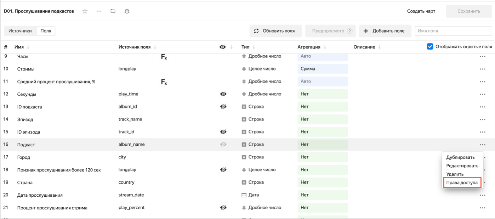
    
  1. In the **Configuring access permissions for a field** window, set a filter as shown in this example:

     `* : my-login@yandex.com`
     Where:

     * `*`: Access to all podcasts.
     * `my-login@yandex.com`: Your username.
        
     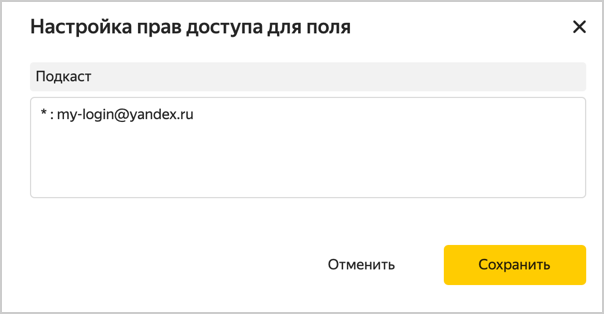 
    
  1. Click **Save**. After you save the dataset, its data will only be available to `my-login@yandex.com`.
  1. You can specify the usernames of other users who need access to all podcasts and episodes in a comma-separated list, e.g., `* : my-login@yandex.com, friend-login@yandex.com`.
    
- Episodes

  1. Open the `D01. Podcast listens` dataset.
  1. In the `Episode` field menu, click **Permissions**.
    
     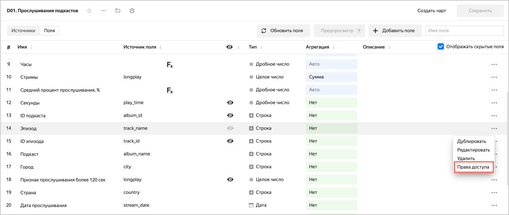
    
   1. In the **Configuring access permissions for a field** window, set a filter as shown in this example:

      `* : my-login@yandex.com`

      Where:

      * `*`: Access to all episodes.
      * `my-login@yandex.com`: Your username.
        
      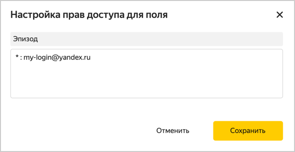 
    
  1. Click **Save**. After you save the dataset, its data will only be available to `my-login@yandex.com`.
  1. You can specify the usernames of other users who need access to all podcasts and episodes in a comma-separated list, e.g., `* : my-login@yandex.com, friend-login@yandex.com`.



#### 3.2.3. Grant access to your {{ datalens-short-name }} instance {#access-to-datalens-instance}

To grant access to your {{ datalens-short-name }} instance to a user:

1. Go to [Access management]({{ link-console-access-management }}).
1. In the top-right corner, click **Add user**. 
1. Enter the user's Yandex email address. The new user will appear in the list of users.
1. Click  next to the new user and select **Change roles**.
1. Under **Roles in folders**, select a folder. In the **Roles** column, click . Assign the `datalens.instances.user` role.



The user will be able to view statistics immediately, and you can set up additional permissions for the user's account in a few hours.



#### 3.2.4. Grant restricted access to data to an individual user {#provide-access-to-podcast-episode}

1. Open the `D01. Podcast listens` dataset.
1. Choose which data you want to restrict access to for an individual user:

   
    
   - Podcasts
     
     1. In the `Podcast` field menu, click **Permissions**.
        
        
        
     1. In the **Configuring access permissions for a field** window, set a filter as shown in this example:

        `'The most interesting podcast': partner-login@yandex.com`

        Where:

        * `The most interesting podcast`: Podcast name.
        * `partner-login@yandex.com`: Partner username.
        
        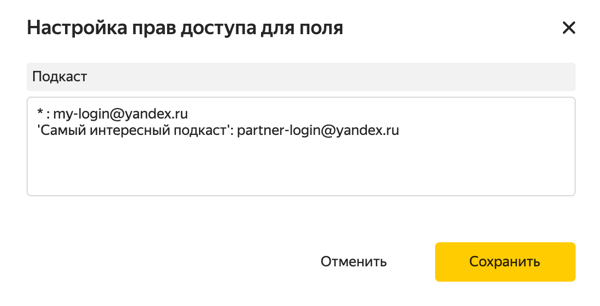
    
   - Episodes
     
     1. Open the `D01. Podcast listens` dataset.
     1. In the `Episode` field menu, click **Permissions**.
      
        
     
     1. In the **Configuring access permissions for a field** window, set a filter as shown in this example:

        `'Episode No. 5': partner-login@yandex.com`

        Where:

        * `Episode No. 5`: Episode name.
        * `partner-login@yandex.com`: Partner username.
        
        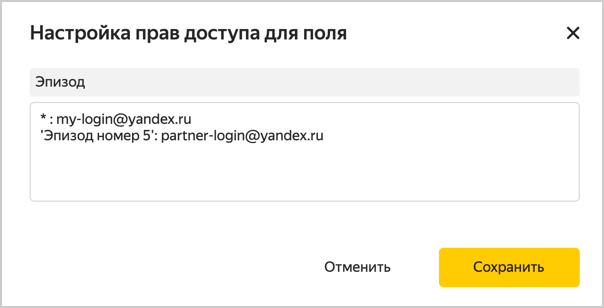
    
   
    
   If you want to grant permission for multiple episodes, add additional lines for each episode individually.
   Learn more about data-level permissions [here](../../datalens/security/row-level-security.md).

   
    
   Specify the same names as in the service (filtering is case-sensitive).
    
   

   A user's permissions will remain valid until they are [revoked](#revoke-access).

1. Share a link to the `Yandex Music podcast analytics` dashboard with the user. To do this, click  → **Copy link** on the dashboard.

### 3.3. Revoke a user's access permissions {#revoke-access}

You can revoke a user's permissions:



- Workbook {#workbook}

  1. Open the workbook with the `Yandex Music podcast analytics` dashboard and click  **Access** at the top right.
  1. Under **Direct permissions**, click  next to the user or user group to revoke the permissions from.
  1. In the window that opens, click **Revoke role**.

- Directory {#folder}

  1. Go to `Podcasts Analytics. Connection`.
  1. Click  and select **Access permissions**.
  1. Select the user to revoke the permissions from.
  1. In the window that opens, click **Revoke permissions**.
  1. To completely deny the user access to your podcaster statistics dashboard:

     1. Go to [Access control]({{ link-console-access-management }}).
     1. Find the user, click the icon next to the new user, and select **Delete**.



## 4. Make a dashboard or chart public {#publish-dashboard-chart}

Data in {{ datalens-short-name }} is only available to users of a specific instance. If you want to provide unrestricted public access to podcast analytics, [publish](../../datalens/concepts/datalens-public.md) your dashboard or a particular chart.



- Publishing a dashboard {#dashboard} 
  
  1. Open the `Yandex Music podcast analytics` dashboard.
  1. At the top of the dashboard interface, click .
  1. In the public access settings window that opens, enable **Access via link**.
  1. Confirm publishing and click **Next**.
  1. Select the charts you want to publish with the dashboard.
  1. Copy the public link and click **Apply**.
 
- Publishing a chart {#chart}

  1. On the navigation page, find a chart, e.g., `C07. Starts and streams: Dynamics`, and open it.
  1. At the top of the chart interface, click .
  1. In the public access settings window that opens, enable **Access via link**.
  1. Confirm the publishing and click **Next**.
  1. Copy the public link and click **Apply**.



## 5. Add a chart or dashboard to your website {#add-dashboard-chart}

You can embed the published charts into a website or app using the `iframe` element. Follow these steps:

1. Follow the public link to the chart.
1. Click  in the top-right corner of the chart and select **Embed code**.
1. Copy the `iframe` embed code in the light or dark theme.
1. Embed the code into your website.



You can only embed individual charts. Embedding the entire dashboard is not supported.



## FAQ {#qa}



Using your Yandex account in Yandex Music and {{ datalens-short-name }} ensures enhanced data security.




   
Data is updated daily at 13:00. If someone listens to a podcast after this time, the data will only appear in the statistics the next day. Plus, playbacks of less than one second are not included in the statistics.

 



New subscribers appear in the service instantly, while in the statistics, only the next day. If a person has subscribed to a podcast today, the number of subscribers in the statistics will increase tomorrow.




 
The statistics only show episodes with a history of listens. The episode you cannot see now will appear on the charts as soon as somebody listens to it.
   




Promo periods and titles are not displayed in the statistics separately; however, a spike in listens may indicate that the podcast was promoted.




  
Yes, you can edit a dashboard and linked objects.
   



   
Recreate a connection and the dashboard will appear again.
   



   
{{ datalens-short-name }} is a full-fledged data analysis and visualization tool. Use its wide range of settings to create different types of visualizations that meet a variety of user requirements.





There are many ways you can use {{ datalens-short-name }}. You can connect to your own data sources, build charts and dashboards, and share them with your colleagues.


