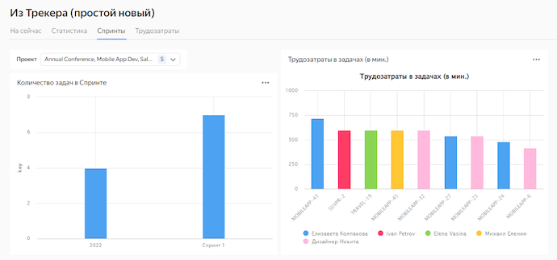
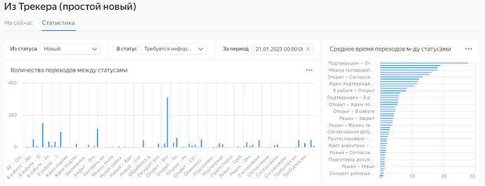

# Visualizing data from {{ tracker-full-name }}

Visualizing data from {{ tracker-short-name }} to {{ datalens-full-name }} allows you to build more advanced analytics than when using the {{ tracker-short-name }} tools.

To visualize data from {{ tracker-short-name }} to {{ datalens-short-name }}:
* Set up regular export of data to external storage.
* Visualize the necessary metrics and data using {{ datalens-short-name }}.

To visualize the data, follow these steps:
1. [Prepare your cloud](#before-you-begin).
1. [Create a DB for storing the {{ tracker-short-name }} data](#database-create).
1. [Create an OAuth token for {{ tracker-short-name }} access](#oauth-token).
1. [Create a {{ sf-name }} function for importing the data](#function-import).
1. [Create a connection to {{ datalens-short-name }}](#connection-create).
1. [Create a dashboard in {{ datalens-short-name }}](#dashboard-create).
1. [Create a dataset](#dataset-create).
1. [Create a chart](#chart-create).
1. [Add charts to the dashboard](#dashboard-create).

## Getting started {#before-you-begin}




We recommend [creating](../../tracker/enable-tracker.md) a separate {{ tracker-short-name }} account to use the service.







### Required paid resources {#paid-resources}

* Continuously running {{ mch-name }} cluster (see [{{ mch-name }} pricing](../../managed-clickhouse/pricing.md)).
* {{ sf-name }} function usage (see [{{ sf-name }} pricing](../../functions/pricing.md)).

If you no longer need the resources you created, [delete them](#clear-out).


## Create a DB for storing the {{ tracker-short-name }} data {#database-create}

1. Go to the [management console]({{ link-console-main }}).
1. In the top-left corner, click  **All services**.
1. Select **Data platform** → **{{ mch-name }}**.
1. Click **Create {{ CH }} cluster**.
1. Specify the cluster parameters:
   * Basic parameters:
      * **Environment**: `PRODUCTION`.
      * **Version**: `22.8 LTS`.
   * Resources:
      * **Platform**: `Intel Ice Lake`.
      * **Type**: `Standard`.
      * **Host class**: `{{ s3-c2-m8 }}`.
   * Storage size: `30 GB`.
   * Hosts:
      * **Public access**: `Enabled`.
   * DBMS settings:
      * **User management via SQL**: `Disabled`.
      * **Database management via SQL**: `Disabled`.
      * **Username**: `tracker_data`.
      * **DB name**: `db1`.
   * Service settings:
      * **Access from {{ datalens-short-name }}**: `Enabled`.
      * **Access from Serverless**: `Enabled`.
         For a full list of settings, see [{{ mch-name }} settings](../../managed-clickhouse/concepts/settings-list.md).
1. Click **Create cluster**. Wait for the created cluster's status to change to `Alive`.
1. Copy and save the host name for further setup.
   ![tracker-host-name]{{ sf-name }}(../../_assets/dl-tracker-host-name.png =680x372)

## Create an OAuth token for {{ tracker-short-name }} access {#oauth-token}

1. Go to the [Create an app](https://oauth.yandex.ru/client/new) page.
1. Fill out the fields below:
   * **Service name**.
   * **Platforms**: `Web services`.
   * **Redirect URI**: Click **Enter URL for debugging** or type `https://oauth.yandex.ru/verification_code`.
1. Under **Data access**, specify:
   * `Read from tracker`.
   * `Write in tracker`.
1. Click **Create app**.
1. In the window that appears, enter the following URL in the browser search bar:

   ```
   https://oauth.yandex.ru/authorize?response_type=token&client_id=ID
   ```

   Where `ID` is the ID of the created app from the **ClientID** field.

1. Log in under the {{ tracker-short-name }} account to be used for data visualization.
1. Save the received [OAuth token](https://cloud.yandex.ru/docs/tracker/concepts/access#section_about_OAauth).

## Create a {{ sf-name }} function for importing the data {#function-import}

1. Go to the [management console]({{ link-console-main }}).
1. In the top-left corner, click  **All services**.
1. Select **Serverless computing** → **{{ sf-name }}**.
1. Click **Create function**.
1. Specify a name for the function and click **Create**.
1. In the **Editor** window that opens, select `Python / 3.9` runtime environment.
1. Click **Next**.
1. In the **Method** field, click **ZIP archive**.
1. Attach a [test archive](https://github.com/yandex-cloud/yc-architect-solution-library/raw/main/yc-tracker/tracker-data-import/build/tracker-data-import.zip).
1. In the **Entry point** field, specify `tracker-import.handler`.
1. Under **Parameters**, specify:
   * **Timeout, sec**: `60`.
   * **RAM**: `1024`.
   * **Environment variables**:
      * `TRACKER_ORG_ID`: [Organization ID](https://tracker.yandex.ru/admin/orgs).
      * `TRACKER_OAUTH_TOKEN`: [OAuth token](#oauth-token) of the {{ tracker-short-name }} account.
      * `CH_HOST`: [Host](#database-create) name.
      * `CH_DB`: [Database](#database-create) name.
      * `CH_USER`: [Username](#database-create).
      * `CH_PASSWORD`: [Password](#database-create).
      * `CH_ISSUES_TABLE`: `tracker_issues`.
      * `CH_CHANGELOG_TABLE`: `tracker_changelog`.
      * `TRACKER_INITIAL_HISTORY_DEPTH`: `1d`.
         * `CH_STATUSES_VIEW`: `v_tracker_statuses`.
1. Click **Create version**.
1. In the **Testing** tab, click **Run test**.
1. The test result is a data import log:
   ```json
   {
       "statusCode": 200,
       "headers": {
       "Content-Type": "text/plain"
       },
       "isBase64Encoded": false,
       "body": "OK"
   }
   ```
1. Create a [trigger](../../functions/concepts/trigger/index.md) to regularly export new data to the DB:
   1. Open the **{{ sf-name }}** section.
   1. Click  → **Create trigger**.
   1. Set the trigger type to **Timer**.
   1. In the **Cron expression** field, select `Every day`.
   1. Under **Function settings**, click **Create new**.
   1. Enter the account name. By default, the account is assigned the `serverless.functions.invoker` role to work with the trigger.
   1. Click **Create**.
   1. Click **Create trigger**.

## Create a connection in {{ datalens-short-name }} {#connection-create}

1. Open the **{{ mch-name}}** [cluster](#database-create).
1. Open the **{{ datalens-short-name }}** tab.
1. Click **Create connection**.
1. Specify the connection settings:
   * **Connection**: `Select in a folder`.
   * **Cluster**: Cluster specified when [creating a database](#database-create).
   * **Hostname**: Host specified when [creating a database](#database-create).
   * **HTTP interface port**: `8443`.
   * **Username**: Username specified when [creating a database](#database-create).
   * **Password**: Password specified when [creating a database](#database-create).
   * **Cache TTL in seconds**: `Default`.
   * **Raw SQL level**: `Forbid`.
   * **HTTPS**: `Enabled`.
      
1. Click **Create connection**.

## Create a dataset {#dataset-create}

1. Go to the [connections page]({{ link-datalens-main }}/connections).
1. Select a [connection](#connection-create).
1. In the top-right corner, click **Create dataset**.
1. Drag one or more tables to the workspace:
   * `db1.v_tracker_issues`: Current (most recent) issue cross-section.
   * `db1.v_tracker_changelog`: Issue parameter change history.
   * `Db1.v_tracker_statuses`: Status transition time based on the issue change history.
1. Click **Save**.

## Create a chart {#chart-create}


1. Go to the [{{ datalens-short-name }}] homepage({{ link-datalens-main }}).
1. Click **Create chart**.
1. In the top-left corner, click  **Select dataset**.
1. In the **Datasets** drop-down list, select the [dataset](#dataset-create) you created in the previous step.


1. On the top panel, select a [visualization type](../../datalens/visualization-ref/index.md). By default, the **Column chart** type is selected.

## Create a dashboard {#dashboard-create}

1. On the [{{ datalens-full-name }}]({{ link-datalens-main }}) homepage, click **Create dashboard**.
1. In the window that opens, enter a name for the dashboard. The dashboard appears in the list on the navigation page.

For more information about setting up dashboards, see [{{ datalens-full-name }} dashboard](../../datalens/concepts/dashboard.md).

## Add charts to the dashboard {#add-charts}

1. At the top of the [dashboard](#dashboard-create) page, click **Add**→ **Chart**.
1. Fill in the widget parameters. Pay close attention to the following fields:
   * **Name**. Sets the name of the widget. It's displayed on top of the widget.
   * **Chart**. Sets the widget to add.
   * **Description**. Sets the description of the widget. It's displayed at the bottom of the widget.
   * **Auto height**. Sets the automatic height for **Table** and **Markdown** widgets. If this parameter is disabled, you can set the height of the widget on the page using the mouse.
1. Click **Add**. The widget is displayed on the dashboard.













## How to delete the resources you created {#clear-out}

To stop paying for the resources you created:
* [Delete the {{ CH }} cluster](../../managed-clickhouse/operations/cluster-delete.md).
* [Delete the {{ sf-name }} function](../../functions/operations/function/function-delete.md).