# Visualizing {{ objstorage-full-name }} data in {{ datalens-full-name }}


By integrating {{ yq-full-name }} with {{ datalens-full-name }}, you can visualize data stored in {{ objstorage-full-name }}. {{ datalens-short-name }} generates a YQL query, while {{ yq-full-name }} runs the query and returns the results, which are visualized using charts.

For the solution architecture, see below.

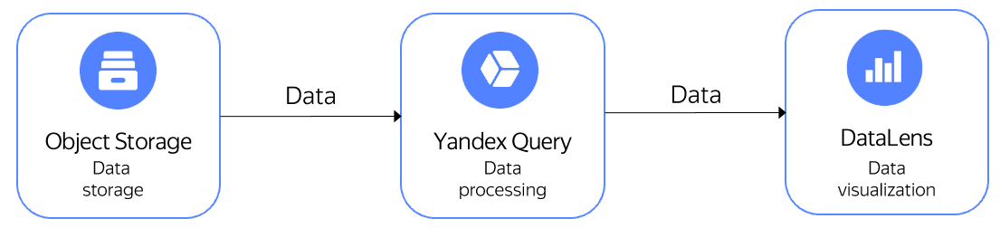

As an example, let's visualize how the time of day affects the number and average cost of New York City yellow taxi trips. The data was pre-uploaded to a public {{ objstorage-full-name }} bucket named `yq-sample-data`, the `nyc_taxi_csv` folder.







To visualize and explore data, [set up your cloud](#before-you-begin) and follow the steps below:

1. [Connect to data in {{ objstorage-name }}](#create_connection).
1. [Create a connection in {{ datalens-full-name }}](#create_connection_lens).
1. [Configure the dataset fields](#create_dataset).
1. [Configure visualization](#create_comdo_chart).

## Getting started {#before-you-begin}





To create a {{ datalens-short-name }} connection to {{ yq-full-name }}, you need a [service account](../../iam/concepts/users/service-accounts.md) with the `{{ roles-editor }}` [role](../../iam/operations/sa/assign-role-for-sa.md) for the folder where the {{ objstorage-short-name }} [bucket](../../storage/concepts/bucket.md) [connection will be created](#create_connection).



## Connect to data in {{ objstorage-name }} {#create_connection}

1. In the [management console]({{ link-console-main }}), select the folder where you want to create a [connection](../../query/concepts/glossary.md#connection).

   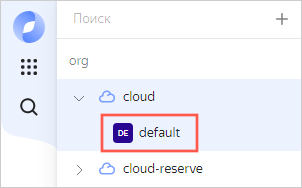

1. In the list of services, select **{{ ui-key.yacloud.iam.folder.dashboard.label_yq_ru }}**.

   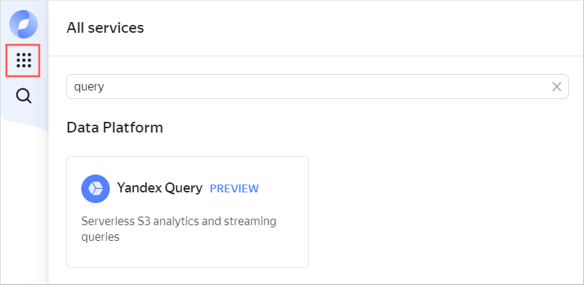

1. In the left-hand panel, select  **{{ ui-key.yql.yq-navigation.tutorial.menu-text }}**.
1. Click **{{ ui-key.yql.yq-tutorial.create-connection.button-label }}**. In the Create connection section, all parameter fields are pre-filled. Enter a description (optional) and click **{{ ui-key.yql.yq-connection-form.create.button-text }}**. This will take you to the screen for creating a data [binding](../../query/concepts/glossary.md#binding).
1. Enter the data binding description (optional) and click **{{ ui-key.yql.yq-binding-form.binding-create.button-text }}**. Appropriate training resources will be created.

## Create a connection in {{ datalens-full-name }} {#create_connection_lens}

To create a {{ yq-full-name }} connection:

1. Go to the {{ datalens-short-name }} [home page]({{ link-datalens-main }}).
1. In the left-hand panel, select  **Connections** and click **Create connection**.
1. Select a **{{ yq-full-name }}** connection.
1. Specify the connection parameters:

   * **Cloud and folder**: Select the folder where your service account is located.
   * **Service account**: Select an existing [service account](../../iam/concepts/users/service-accounts.md) or create a new one.
   * **Cache TTL in seconds**: Specify the cache time-to-live or leave the default value.
   * **Raw SQL level**: Select **Allow subqueries in datasets and queries from charts**.

1. Click **Create connection**.
1. Enter a connection name, e.g., `yq-connect`, and click **Create**.

## Configure the dataset fields {#create_dataset}

1. In the top-right corner of the page where you created the connection, click **Create dataset**.

   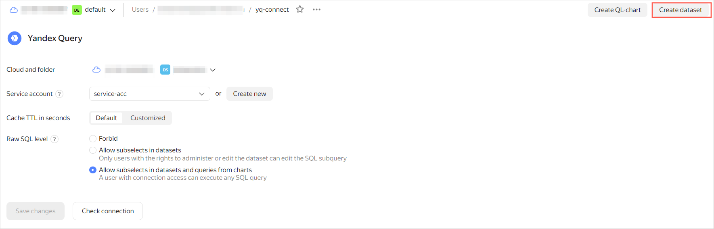

1. In the window that opens, enter the query text provided below and click **Create**.

   ```sql
   SELECT 
       *
   FROM 
       bindings.`tutorial-analytics`
   ```

   If everything is set up correctly, the **Preview** section in the lower part of the screen will contain the following data:

   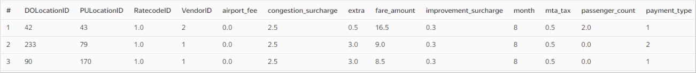

1. Create a calculated field with the pick-up time data:

   1. Go to the **Fields** tab and click **Add field**.

      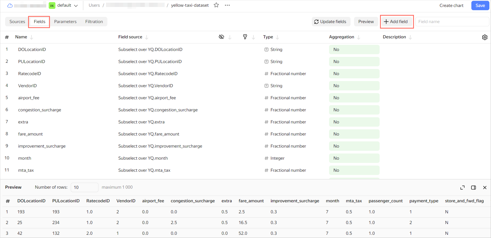

   1. In **Field name**, specify `hour_trip`.
   1. In the formula line, enter:

      ```sql
      HOUR([tpep_pickup_datetime])
      ```

   1. Click **Create**. The new `hour_trip` field will appear in the list of dataset fields.

1. In the **Aggregation** column, select the `Average` aggregation type for the **total_amount** field.

   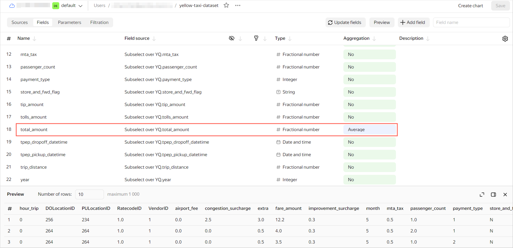

1. In the top-right corner, click **Save**. Enter the dataset name, `yellow-taxi-dataset`, and click **Create**.
1. When the dataset is saved, click **Create chart** in the top-right corner.

   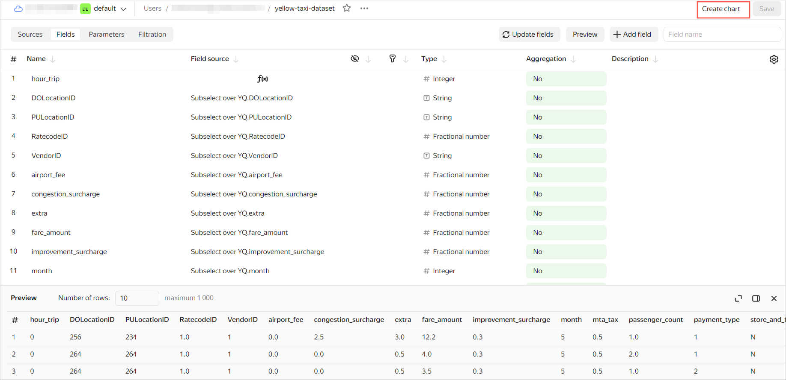

## Configure visualization {#create_comdo_chart}

To visualize and analyze the data, use a [combined](../../datalens/concepts/chart/index.md) [chart](../../datalens/visualization-ref/combined-chart.md).

1. For the visualization type, choose **Combined chart**.

   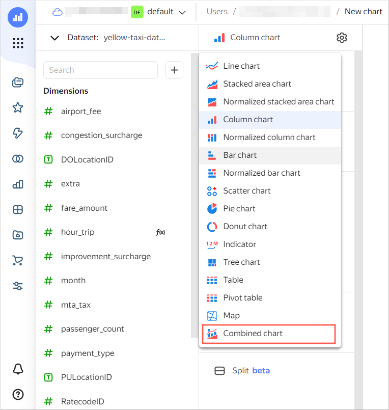

1. Drag the `hour_trip` dimension to the **X** section. In the **X** section, the dimension will be common for all layers.
1. For the first layer, choose **Bar chart**.

   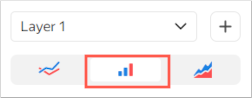

1. Drag the `total_amount` measure to the **Y** section. You will see a bar chart in the visualization area.
1. Add a layer. To do this, click the  icon to the right of the first layer name.
1. For the second layer, choose **Line chart**.

   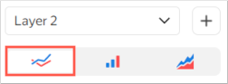

1. Add a field to the chart:

   1. At the top left, click  and select **Field**.

      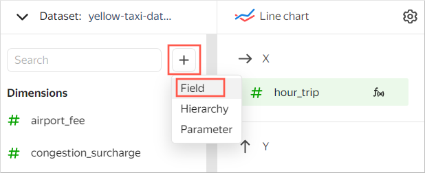

   1. In the window that opens:

      * Under **Field name**, enter `count_trip`.
      * In the formula line, enter `COUNT()`.

        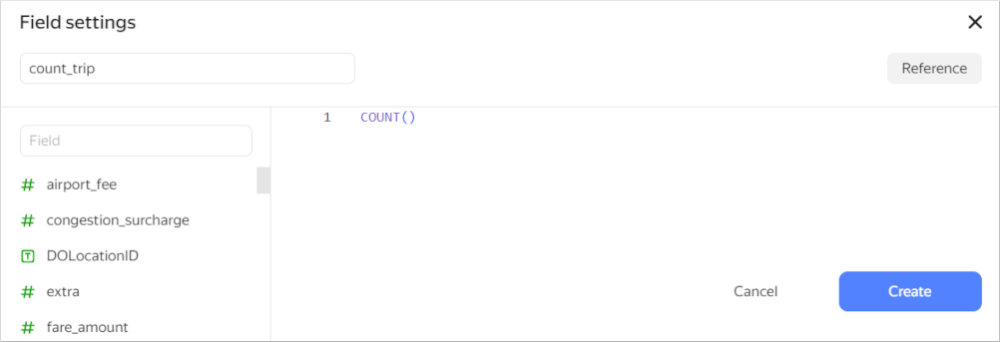

   1. Click **Create**.

1. Drag the new `count_trip` measure to the **Y2** section. You will see a line chart on top of the first chart in the visualization area.
1. In the top-right corner, click **Save**. Enter `yellow-taxi-combo-chart` as the chart name and click **Save**.

The chart you created shows how the time of day affects the number of trips (line chart) and the average trip cost (bar chart).

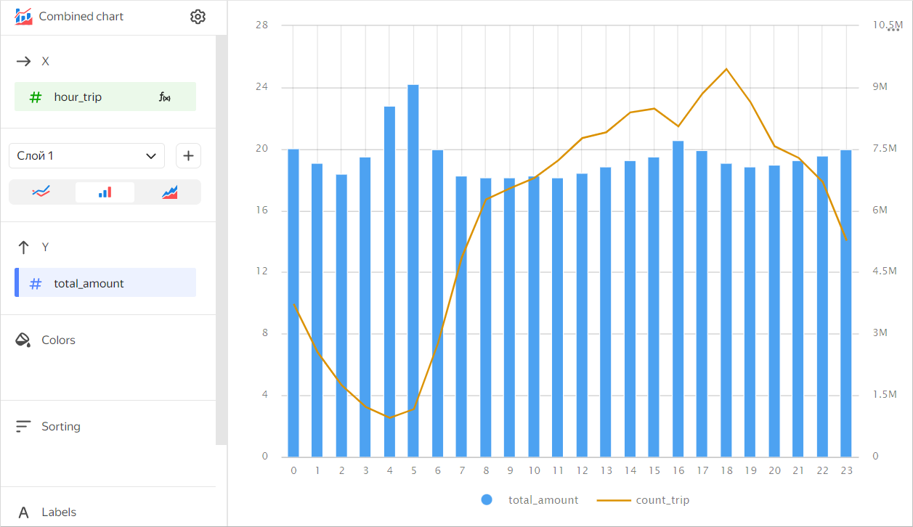

In the same way, you can create additional [charts](../../datalens/operations/chart/create-chart.md) and [dashboards](../../datalens/operations/dashboard/create.md) or [share the results](../../datalens/concepts/datalens-public.md) with your teammates.
