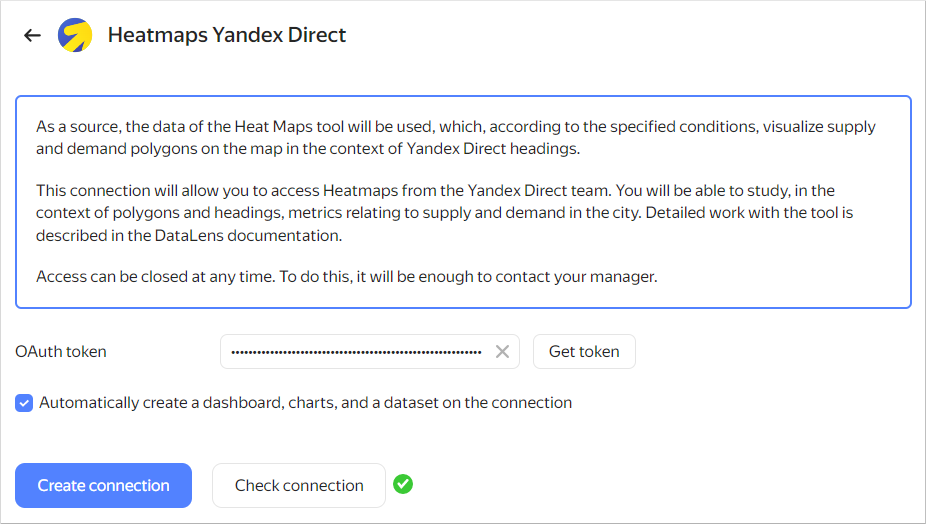
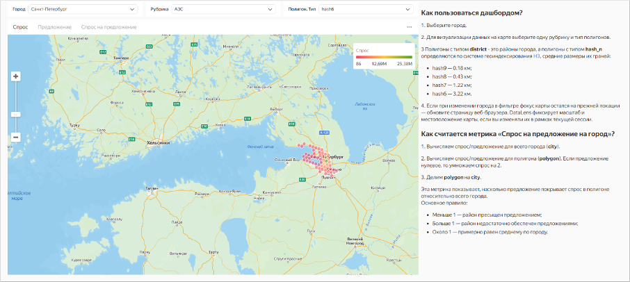

# Visualizing data using Heat Maps

As a source, we will use data from **Heat Maps**, a tool that visualizes supply and demand polygons by Yandex Direct category based on set criteria.

**Heat maps** provide statistics that show supply and demand for companies and their services:

* **Demand** shows where Yandex users are searching for companies within 3 km of your location.
* **Supply** shows the number of existing companies on Yandex Maps.
* **Supply geography** shows company locations on Yandex Maps.

You can use **Heat maps** to:

* Choose a good location for your offline point of sale.
* Launch ads in the Yandex Advertising Network where your potential customers can see them.
* Analyze your competitors.



A user gets access to data on the **Heat Maps** dashboard if:

* They have a Yandex Direct account.
* They have permissions for the **Heat Maps** dashboard.

A user gets access to the **Heat Maps** dashboard after a manager submits an internal request.



To visualize and analyze the data, follow these steps:

1. [Set up your connection](#configure-connection).
    1. [Set up {{ datalens-short-name }}](#before-you-begin).
    1. [Create a connection](#create-connection).
1. [Explore Heat Maps](#view-dashboard).
    1. [Review the contents of the folder](#view-catalog).
    1. [Set up the dashboard](#dashboard-settings).
1. [Share supply and demand statistics with other users](#share-statistics).
1. [Make a dashboard or chart public](#publish-dashboard-chart).
1. [Add a chart or dashboard to your website](#add-dashboard-chart).

We recommend checking out [this FAQ](#qa) covering questions commonly asked by supply and demand statistics users.

## 1. Set up your connection {#configure-connection}

### 1.1 Set up {{ datalens-short-name }} {#before-you-begin}

{{ datalens-full-name }} is deployed on the {{ yandex-cloud }} platform.

Set up {{ datalens-short-name }} depending on your experience:

* You are a new user (you only want to use {{ datalens-full-name }} for podcast analysis).
* You are already using {{ datalens-full-name }} (for other purposes).



### 1.2. Create a connection {#create-connection}

To connect to the **Heat Maps** dashboard:

1. Follow the [link]({{ link-datalens-main }}/connections/new/smb_heatmaps) and click **Get token**.

   

1. Once the token is authorized, check your connection. by clicking **Check connection**.
1. Leave the **Automatically create dashboard, charts, and dataset on top of connection** option enabled.
1. Click **Create connection**. Enter **Heatmaps Connection** or any other connection name and click **Create**.

## 2. Explore Heat Maps {#view-dashboard}

### 2.1. Review the contents of the folder {#view-catalog}

1. After you created the connection, a folder containing a set of standard objects that your statistics are based on opens:

   *  **Supply and demand** dashboard: Main page with all the widgets (charts, tables, and filters) where you can view the statistics. Save the page link to quickly access the dashboard.
   *  **smb_geo_heat_maps_dataset** dataset: Dataset with dimensions and measures used to create charts.
   *  Charts: Set of individual visualizations (diagrams and tables) used on the dashboard.

1. Open the **Supply and demand** dashboard.

   The dashboard has three tabs: **Demand**, **Supply**, and **Demand-to-supply ratio**. Each tab contains:

      * Text widgets: Headers, comments, and tooltips.
      * Selectors: Filters by different dimensions that can be used to filter the contents of dashboards.
      * Charts: Graphs, tables, and other visualizations.

   

1. Add the dashboard to **Favorites** by clicking  next to the dashboard name at the top of the screen. To access the **Favorites** folder, click  in the left-hand panel.

You can edit it and add standard objects as needed.

### 2.2. Set up the dashboard {#dashboard-settings}

1. Select a city.
1. To visualize data on the map, select a category and polygon type.

Polygons of the `district` type are city districts; polygons of the `hash_n` type are defined using the `H3` geospatial indexing system with the following average sizes of their sides:

   * `hash9`: 0.18 km
   * `hash8`: 0.43 km
   * `hash7`: 1.22 km
   * `hash6`: 3.22 km

If you select a different city and the map focus remains at the same location, refresh the page. {{ datalens-short-name }} saves the data automatically: you can always continue from where you left off.

The **Demand-to-supply ratio per city** measure shows the demand for products and services in a specific city or district. It is calculated as follows:

1. Calculating the demand to supply ratio for the entire `city`.
1. Calculating the demand to supply ratio for the `polygon`. If the supply value is zero, the demand value is multiplied by 2.
1. Calculating `polygon` to `city` ratio.



The main principle is as follows:

* A value less than 1 indicates that supply in the district is too high.
* A value greater than 1 indicates that there is insufficient supply in the district.
* If the value is about 1, supply is approximately equal to the average value across the city.



Pay attention to the supply and demand scale in the top-right corner. The greener the area, the higher the demand in the district or your city's hexagon. The colder the color (such as blue or red), the lower the supply.

## 3. Share supply and demand statistics with other users {#share-statistics}

To allow another user to open your dashboard, configure access to {{ datalens-full-name }}:

1. [Invite a user](../../organization/operations/add-account.md#send-invitation) with a Yandex account or add a [federated](../../organization/operations/add-account.md#add-user-sso) or [local](../../organization/operations/add-account.md#local) user.
1. Make sure the user has access permissions for the dashboard:

   1. Open the dashboard.
   1. In the **Add member** field, enter _All_ or the name of the user who needs extended permissions.
   1. Go to the **Current object** section and set the permissions for the dashboard:

      * View: Viewing only.
      * Edit: Viewing and editing.
      * Administration: Viewing, editing, and management.

   1. Enable the **Linked objects** option to grant permissions for other objects linked to the dashboard, i.e., the connection, datasets, and charts.

The user will get access to your {{ datalens-short-name }} instance and objects with **All** permissions. You can assign this user individual permissions for objects.

You can send the link to the dashboard from the browser. For more information about permissions for {{ datalens-short-name }} objects, see [this guide](../../datalens/security/index.md#permissions).

## 4. Make a dashboard or chart public {#publish-dashboard-chart}

Data in {{ datalens-short-name }} is only available to users of a specific instance. If you want to provide unrestricted public access to supply and demand statistics, publish your dashboard or a individual chart in [{{ datalens-short-name }} Public](../../datalens/concepts/datalens-public.md).



- Publishing a dashboard {#dashboard}

  1. Open the **Supply and demand** dashboard.
  1. At the top of the dashboard interface, click .
  1. In the public access settings window that opens, enable **Access via link**.
  1. Confirm publishing and click **Next**.
  1. Select the charts you want to publish with the dashboard.
  1. Copy the public link and click **Apply**.

- Publishing a chart {#chart}

  1. On the navigation page, find a chart, e.g., **Demand-to-supply ratio map**, and open it.
  1. At the top of the chart interface, click .
  1. In the public access settings window that opens, enable **Access via link**.
  1. Confirm publishing and click **Next**.
  1. Copy the public link and click **Apply**.



## 5. Add a chart or dashboard to your website {#add-dashboard-chart}

You can embed the published charts into a website or app using the `iframe` element. Follow these steps:

1. Follow the public link to the chart.
1. Click  in the top-right corner of the chart and select **Embed code**.
1. Copy the `iframe` embed code in the light or dark theme.
1. Embed the code into your website.



You can only embed individual charts. Embedding the entire dashboard is not supported.



## FAQ {#qa}



   Using a Yandex account in {{ datalens-short-name }} ensures enhanced data security.





   Yes, you can edit a dashboard and linked objects.





   Recreate a connection and the dashboard will appear again.





   {{ datalens-short-name }} is a full-fledged data analysis and visualization tool. Use its wide range of settings to create different types of visualizations that meet a variety of user requirements.





   There are many ways you can use {{ datalens-short-name }}. You can connect to your own data sources, build charts and dashboards, and share them with your colleagues.


