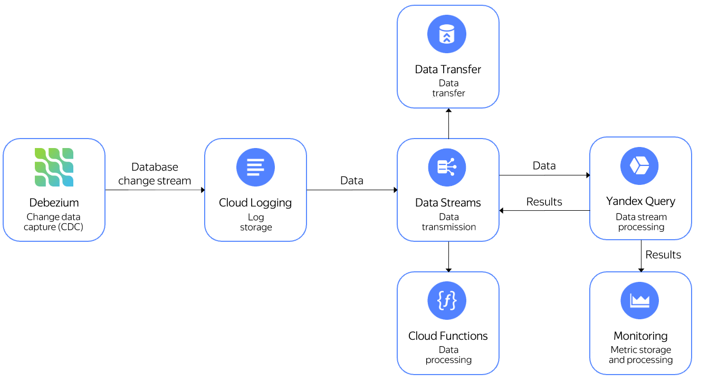

# Processing Debezium CDC streams

[Debezium](https://debezium.io) is a change data capture (CDC) tool that sends database changes to other systems for processing. You can use {{ yds-full-name }} to capture these changes and {{ yq-full-name }} to process them. You can do the following with processed data:

* Send it to {{ monitoring-full-name }} to make charts and use it in alerting.
* Write it to a stream in {{ yds-short-name }} and then send to {{ sf-full-name }} for processing.
* Write it to a stream in {{ yds-short-name }} and then transfer to {{ data-transfer-full-name }} to then [distribute to various storage systems](../../data-streams/tutorials/data-ingestion.md).



In this use case, you will send [{{ PG }}](https://www.postgresql.org/) database changes to a stream in {{ yds-short-name }} using Debezium and then query them with {{ yq-name }}. The query will return the number of changes in DB tables grouped by 10s interval. It is assumed that Debezium is installed on the server with {{ PG }} set up and running.

For this tutorial:

1. [Create a data stream in {{ yds-name }}](#create-yds-stream).
1. [Set the stream connection credentials](#credentials).
1. [Set up Debezium Server](#debezium-server).
1. [Connect {{ yq-name }} to your data stream](#connect-query).
1. [Query the data](#query).

## Getting started {#before-you-begin}



## Create a data stream in {{ yds-name }} {#create-yds-stream}

[Create a data stream](../../data-streams/operations/manage-streams.md#create-data-stream) named `debezium`.

## Set the stream connection credentials {#credentials}

1. [Create](../../iam/operations/sa/create.md) a service account and [assign](../../iam/operations/sa/assign-role-for-sa.md) it the `editor` role for your folder.
1. [Create](../../iam/operations/authentication/manage-access-keys.md#create-access-key) a static access key.
1. On the server where {{ PG }} is set up and running, configure the [AWS CLI](https://docs.aws.amazon.com/cli/latest/userguide/cli-chap-welcome.html):
    1. [Install the AWS CLI](https://docs.aws.amazon.com/cli/latest/userguide/getting-started-install.html) and run this command:

        ```bash
        aws configure
        ```

    1. Enter the following, one by one:

        * `AWS Access Key ID [None]:`: Service account [key ID](../../iam/concepts/authorization/access-key.md).
        * `AWS Secret Access Key [None]:`: Service account [secret key](../../iam/concepts/authorization/access-key.md).
        * `Default region name [None]:`: `{{ region-id }}` availability zone.

## Set up Debezium Server {#debezium-server}

On the server where PostgreSQL is set up and running:



## Connect {{ yq-name }} to your data stream {#connect-query}

1. [Create a connection](../../query/operations/connection.md#create) named `yds-connection` of the `{{ ui-key.yql.yq-connection.action_datastreams }}` type.
1. On the binding creation page:
    * Enter the binding name: `debezium`.
    * Specify the data stream: `cdebezium`.
    * Add a column titled `data` with `JSON` for type.
1. Click **{{ ui-key.yql.yq-connection-form.create.button-text }}**.

## Query the data {#query}

Open the query editor in the {{ yq-name }} interface and run this query:

```sql
$debezium_data = 
SELECT 
    JSON_VALUE(data,"$.payload.source.table") AS table_name, 
    DateTime::FromMilliseconds(cast(JSON_VALUE(data,"$.payload.source.ts_ms") AS Uint64)) AS `timestamp`
FROM bindings.`debezium`;

SELECT 
    table_name, 
    HOP_END() 
FROM 
    $debezium_data 
GROUP BY 
    HOP(`timestamp`, "PT10S", "PT10S", "PT10S"),
    table_name
LIMIT 2;
```



## See also {#see-also}

* [{#T}](../../query/sources-and-sinks/data-streams.md)