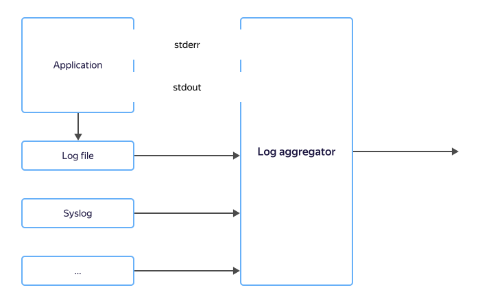

# Smart log processing

Apps generate logs to enable diagnostics. However, these logs alone are not enough for analysis: you need to be able to store and process them in a convenient way. This is why logs go to storage systems, such as [Hadoop](/services/data-proc), [{{ CH }}](/services/managed-clickhouse), or specialized cloud systems like [{{ cloud-logging-name }}](../../logging/).

Applications do not usually write logs to storage systems directly. Instead, they send them to intermediate log aggregators. These aggregators can capture logs from stdout/stderr, read log files from disk, get them via syslog or over HTTP, and in many other ways.

After receiving logs, aggregators buffer them and then send them to different targets via plugins. This approach enables app developers to stay focused on coding while delegating log delivery to dedicated systems.

Standard log delivery systems are [fluentd](https://www.fluentd.org), [fluentbit](https://fluentbit.io), [logstash](https://www.elastic.co/logstash/), and more.

Aggregators can write data directly to storage systems; however, for greater reliability, data first goes to an intermediate buffer (data streaming bus, message broker), i.e., {{ yds-full-name }}, and only from there, to storage systems.

Logs often contain too much data or restricted information. You can mask irrelevant or confidential information by adding more processing steps, e.g., in {{ sf-name }}.

## Benefits {#advantages}

### Reliability {#reliability}

To increase reliability, applications only need to configure a log aggregator to deliver data to a bus as quickly as possible, and the bus will ensure reliable data storage up to the point when the data is processed and written to storage systems.

### Multiple storage systems {#multiple}

The same logs are often stored across multiple storage systems at once: {{ CH }} manages rapid analytics, while {{ objstorage-name }}, long-term storage. To implement this, you can set up your aggregators to send two data streams: one to {{ CH }} and the other one to {{ objstorage-name }}.

Using a data bus makes this easier: you only need to send the log once to the data bus and from there, run two data transfer processes within {{ yandex-cloud }}. This solution will also enable you to add a third storage system, such as {{ GP }} or {{ ES }}, at any time.

The multiple storage system approach is very convenient for ensuring compliance with FZ-152, PCI DSS, and other standards that require log retention for at least one year. In which case, while the last month's logs go to a quick access storage system, the rest of the data may be sent to a long-term "cold" storage in {{ objstorage-name }}.

### Masking data and processing logs {#mask}

Log access is limited across employees. For example, certain logs may include personal user information that requires restricted access.

You can send logs to {{ sf-name }} for masking or any additional data processing as needed.

Once processed, the logs can be sent to multiple target systems at once: access to the logs containing masked personal data can be granted to all employees, while access to the full logs, to administrators only.

## Setup {#setup}

To configure smart log processing:

1. [Create a data stream](../../data-streams/quickstart/create-stream.md) in {{ yds-short-name }}.
1. Set up a log aggregator: [fluentd](../../data-streams/quickstart/fluentd.md), [logstash](../../data-streams/quickstart/logstash.md), or any other aggregator that supports the [Kinesis Data Streams API](../../data-streams/kinesisapi/api-ref.md).
1. Configure {{ data-transfer-full-name }} to transfer data to the selected storage system.

    For an example of setting up data delivery from {{ yds-short-name }}, see the [tutorial on how to save data to {{ CH }}](../../data-streams/tutorials/send-to-clickhouse.md).

1. Connect any data processing function to {{ data-transfer-full-name }}. [This GitHub example](https://github.com/yandex-cloud-examples/yc-nginx-logs-data-transfer) illustrates the function code.

