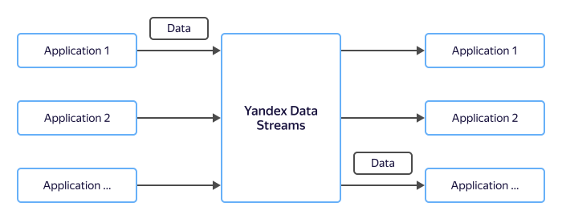

# Data transfer in microservice architectures

Modern applications are migrating from monolithic to microservice architectures. A growing number of components are now working together seamlessly, written in different programming languages and running on various devices.

Using data streaming buses for exchanging information between these components makes it easier to develop a microservice architecture, while enhancing reliability and scalability.

## Benefits {#advantages}

### Reliability {#reliability}

Microservice architectures are typically distributed by design. Reliability is a key factor in a distributed architecture. Implementing a complete failure model in each application is challenging. Therefore, fault tolerance is only built into infrastructure components, with other apps relying on them to stay fault-tolerant.

### Different lifetime {#ttl}

In a monolithic architecture, all components are continuously available for data exchange. Components of a microservice architecture have different lifetimes and cannot rely on direct data exchange between them. You need to either buffer the data or send it via a data streaming bus.

### Scalability {#scaling}

As applications grow, they are expected to remain just as efficient. With data streaming buses, you can simply follow a built-in interaction scenario to make your applications scalable.

## Comparison with {{ KF }} {#comparison}

The table below shows a comparison of {{ yds-short-name }} and {{ KF }}, a widely used data streaming platform.

Parameter | {{ yds-full-name }} | {{ KF }}
----|-----|-----
Supported protocol | Amazon Kinesis Data Streams API | {{ KF }}
Supported SDKs | HTTP, Java, C++, Go, and more | HTTP, Java, C++, Go, and more
Cost | Fee for using resources: speed and retention period | Fee for reserving resources: VMs
Operation complexity | No user administration required | The system is administered by the user, {{ yandex-cloud }} is only responsible for the infrastructure
Scaling | Zero service downtime (currently, the system only supports scaling up) | Service downtime while restarting a cluster
Integration with {{ yandex-cloud }} | High: {{ sf-name }} triggers, {{ api-gw-name }}, and more |Basic
Security | Authorization with an IAM token and access key | Authorization with a username and password
Reliability | High reliability with data stored across three availability zones | High reliability with user customization
Message delivery time | Less than a second | Less than a second
Data retention period | Set at creation, 1 to 24 hours | Limited by VM disk capacity
Customizability | Basic parameters | High, as long as {{ yandex-cloud }} supports the configurations

## Setup {#setup}

To set up data transfer between components:

1. [Create a data stream](../../data-streams/quickstart/create-stream.md) in {{ yds-short-name }}.
1. [Configure](../../data-streams/quickstart/index.md) the AWS SDK.
1. Use the following SDKs:
    * [Go](https://docs.aws.amazon.com/sdk-for-go/api/service/kinesis/)
    * [C++](https://sdk.amazonaws.com/cpp/api/LATEST/class_aws_1_1_kinesis_1_1_kinesis_client.html)
    * [Java](https://docs.aws.amazon.com/AWSJavaSDK/latest/javadoc/com/amazonaws/services/kinesis/AmazonKinesisClient.html)
    * [JavaScript](https://docs.aws.amazon.com/AWSJavaScriptSDK/v3/latest/clients/client-kinesis/index.html)
    * [Python](https://boto3.amazonaws.com/v1/documentation/api/latest/reference/services/kinesis.html)
    * [HTTP Kinesis Data Streams API](../../data-streams/kinesisapi/api-ref.md)
