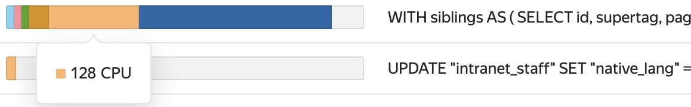

# Searching for {{ mpg-name }} cluster performance issues

If there are performance issues with a {{ mpg-name }} cluster, troubleshoot it. This way you will know what caused the issues and will be able prevent them in the future.

To search for issues and their causes, there are several tools for checking the cluster state. It is important to use them in combination as there can often be multiple abnormalities at once.

As an example, let's assume there was increased CPU utilization in the {{ mpg-name }} cluster. To troubleshoot:

1. [Check the cluster state using {{ monitoring-full-name }}](#monitoring).
1. [Check the cluster performance](#performance-diagnostics).
1. [View the cluster logs](#logs).

You can then [optimize the cluster performance](../../managed-postgresql/tutorials/profiling.md) and reduce the risk of the issue recurring.

## Check the cluster state using {{ monitoring-full-name }} {#monitoring}

1. Go to the [folder page]({{ link-console-main }}) and select **{{ ui-key.yacloud.iam.folder.dashboard.label_managed-postgresql }}**.
1. Click the cluster name and open the **{{ ui-key.yacloud.postgresql.cluster.switch_monitoring }}** tab.
1. 
1. On the **Average CPU usage** chart, find the area where the chart was constantly growing and then plateaued.

   The chart shows the average load on processor cores. The plateau in the chart means that CPU usage was higher than normal. To find the plateau, adjust the period for which to plot the chart.

1. Check other charts. Look for spikes or plateaus during the same period when there was increased CPU utilization.

   Check the following charts:

   * **Session CPU usage cores**: Shows CPU usage by session type. Thus you can find out which user session and which database utilized more CPU than normal.

      Typically, users cause high CPU utilization when they run long queries (e.g., analytic queries without indexes for tables). You can track such queries on the **Age of oldest transaction/statement** chart.

   * **Age of oldest transaction/statement**: Shows the duration of transactions and queries. A spike in the chart means that a certain query took longer than usual to run.

      Let's assume, there is a spike in the **Age of oldest transaction/statement** chart at the same time as the spikes or plateaus in the **Session CPU usage cores** and **Average CPU usage** charts. This means that the increased CPU usage was caused by long-running queries.

   1. (Optional) Check other charts:

      * **Average transaction/statement time**: Shows the average time taken to run transactions and queries. If the chart line is rising, some queries may be taking longer to complete.

      * **Log errors**: Shows the error stream in the cluster. If there is a spike in the chart, check the cluster logs.

      * **OOM Count**: Shows whether there are Out-Of-Memory Killer processes. They stop apps that use up all the memory on the machine and prevent the OS from crashing. If the **OOM Count** chart shows Out-Of-Memory Killer processes, check the cluster memory usage in the **Maximum memory usage** chart and free up memory for apps.

      * **{{ PG }} Alive, [boolean]**: Shows the availability of {{ PG }} on the cluster hosts. If you cannot connect to any cluster host, check its availability in this chart.

      * **Sessions per wait event**: Number of waiting sessions by event type. For example, these types include blocking or waiting for the CPU or memory to free up. A spike in the chart means that the cluster is running out of resources.

      * **Sessions read bytes** and **Sessions write bytes**: Show the amount of data read and written by session. If this value reaches the limit, the cluster may slow down.

      * **Transactions/statements per second**: Shows the number of queries and transactions per second. If there is a high load on the cluster, the chart will show whether it is caused by a large number of queries. If the cluster runs out of resources, the chart shows a dip.

      You can find the full list of charts in [{#T}](../../managed-postgresql/operations/monitoring.md).

## Check the cluster performance {#performance-diagnostics}

Once you have determined when the CPU usage was high, look for the queries that caused the issue. To do this, use the [performance diagnostics](../../managed-postgresql/operations/performance-diagnostics.md) in the {{ mpg-name }} cluster:

1. [Enable the **{{ ui-key.yacloud.mdb.forms.field_diagnostics-enabled }}** option](../../managed-postgresql/operations/update.md#change-additional-settings) if it is not enabled yet.
1. On the cluster page, select  **{{ ui-key.yacloud.postgresql.cluster.switch_diagnostics }}** in the left-hand panel.
1. On the tab that opens, find the area where the chart was constantly rising and then plateaued. It should match in time the areas in the charts you [found in {{ monitoring-full-name }}](#monitoring).

   To find the plateau, adjust the period for which to plot the chart.

1. On the **{{ ui-key.yacloud.mdb.cluster.diagnostics.label_sessions }}** tab, in the **Slice** field, select **WAIT_EVENT**.
1. Find the wait events that caused the high CPU usage by hovering over the plateau. A pop-up window will display all the possible wait events. Events with the highest values affect the issue the most.
1. In the list of queries below the chart, look for queries that show a large number of detected wait events.

   Let's assume the chart showed a lot of **CPU** type wait events. It means that problematic queries also contain a large number of such events. You can see this in the diagrams on the query rows in the list:

   

These are the queries that caused increased CPU utilization.

## View the cluster logs {#logs}

Let's assume in {{ monitoring-full-name }}, the **Log errors** chart shows spikes. To find out what caused them, check the cluster logs. We recommend checking them daily, not just in case of incidents. This way, you will be aware of the current cluster state.

To view the logs:

1. On the {{ mpg-name }} cluster page, select  **{{ ui-key.yacloud.postgresql.cluster.switch_logs }}** in the left-hand panel.
1. Specify the period when the CPU usage was increased.
1. In the **{{ ui-key.yacloud.mdb.cluster.logs.label_severity }}** field, select **ERROR**, **PANIC**, and **FATAL**.
1. Check the error list you get. It shows what happened when the CPU utilization was increased.

   An error may appear in the logs several times. For example, if a user sent too long-running queries, the **canceling statement due to user request** error may repeat in the logs. This means the DB was unable to process the queries in the expected time interval, and they were canceled.

1. Change the logging level to **LOG** and **WARNING**.
1. View the list of events that occurred during the specified period.

   The logs display queries that were run. If the [log_min_duration_statement](../../managed-postgresql/concepts/settings-list.md#setting-log-min-duration-statement) DBMS parameter is [preconfigured](../../managed-postgresql/operations/update.md#change-postgresql-config) in the cluster, the logs also show the query run time. This way, you can find long-running queries.

   

   If the value of `log_min_duration_statement` is set to zero, all queries are logged regardless of their run time. This may lead to available storage space quickly running out.

   

   Logs of the **LOG** and **WARNING** type contain more than just completed queries. For example, the logs may contain the **temporary file: path "<file_path>" size <file_size>** record. Multiple repetitions of this record show that the queries are not optimal. Sorting or aggregating them consumes too much [work_mem]({{ pg-docs }}/runtime-config-resource.html#RUNTIME-CONFIG-RESOURCE-MEMORY) memory allocated for database operations. As a result, there is not enough memory in the cluster buffer.

Thus, you have determined when and why the CPU usage was increased, which users and queries caused it, and what events affected the issue. To prevent the issue from reoccurring in the {{ mpg-name }} cluster in the future, [optimize its operation](../../managed-postgresql/tutorials/profiling.md).
