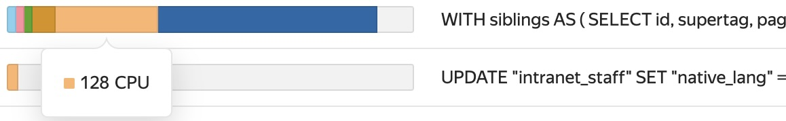

# Diagnosing {{ mpg-name }} cluster performance issues

If you experience {{ mpg-name }} cluster performance issues, run diagnostics. This will help you identify the root cause and prevent future problems.

To identify issues and their causes, you can use several cluster health monitoring tools. These tools should be used together, as issues are frequently caused by multiple anomalies occuring at once.

Suppose, for example, your {{ mpg-name }} cluster experiences high CPU usage. To diagnose why this is happening:

1. [Check the cluster’s health using {{ monitoring-full-name }}](#monitoring).
1. [Perform cluster performance diagnostics](#performance-diagnostics).
1. [Review the cluster logs](#logs).

This will allow you to [optimize the cluster performance](../../managed-postgresql/tutorials/profiling.md) and reduce the risk of the issue recurring.

## Check the cluster’s health using {{ monitoring-full-name }} {#monitoring}

1. In the [management console]({{ link-console-main }}), select a folder.
1. [Navigate to](../../console/operations/select-service.md#select-service) the **{{ ui-key.yacloud.iam.folder.dashboard.label_managed-postgresql }}** service.
1. Click the name of your cluster and select the **{{ ui-key.yacloud.postgresql.cluster.switch_monitoring }}** tab.
1. 
1. On the **Average CPU usage** chart, identify the period where the line shows a steady increase followed by a plateau.

   This chart shows average CPU core utilization. The plateau indicates higher than normal CPU usage. To find the plateau, adjust the time window of the chart.

1. Review other charts for corresponding spikes or plateaus during the same time period of high CPU usage.

   Check the following charts:

   * **Session CPU usage cores**: Shows CPU utilization broken down by session type. This allows you to identify the user session and database that caused high CPU usage.

      High CPU utilization is often caused by users executing long-running queries, such as analytical queries on unindexed tables. You can track such queries on the **Age of oldest transaction/statement** chart.

   * **Age of oldest transaction/statement**: Shows the duration of transactions and queries. A spike in this chart indicates that some queries were running longer than usual.

      Suppose a spike in the **Age of oldest transaction/statement** chart coincides with spikes or plateaus in the **Session CPU usage cores** and **Average CPU usage** charts. It shows that high CPU consumption was caused by long-running queries.

   1. Optionally, review other charts:

      * **Average transaction/statement time**: Shows the average execution time for transactions and queries. A rising trend in this chart may indicate that some queries are now running longer.

      * **Log errors**: Shows the frequency of errors generated across the cluster. If you see a spike in this chart, check the cluster logs.

      * **OOM Count**: Shows the number of Out-Of-Memory Killer events. OOM Killer mechanism terminates memory exhausting applications, preventing the OS from crashing. If **OOM Count** chart shows Out-Of-Memory Killer being invoked, check the cluster memory usage on the **Maximum memory usage** chart and take steps to free up memory.

      * **{{ PG }} Alive, [boolean]**: Shows whether {{ PG }} is available on each host in the cluster. If you cannot connect to a cluster host, check its availability using this chart.

      * **Sessions per wait event**: Number of waiting session broken down by wait event type. Common wait event types include row and table locks, as well as waits for CPU or memory to become available. A spike in this chart indicates that your cluster is running low on critical resources.

      * **Sessions read bytes** and **Sessions write bytes**: Show the volume of data read from and written to the database, broken down by session. If I/O volume reaches its limit, cluster performance may degrade.

      * **Transactions/statements per second**: Shows the number of queries and transactions per second. This chart helps diagnose high cluster load by showing whether it is caused by high query volume. If your cluster is running out of resources, you will see a dip in this chart.

      For a full list of charts, see [{#T}](../../managed-postgresql/operations/monitoring.md).

## Perform cluster performance diagnostics {#performance-diagnostics}

Once you have identified the time period of high CPU usage, locate the specific queries that caused it. Use the {{ mpg-name }} cluster’s [performance diagnostics](../../managed-postgresql/operations/performance-diagnostics.md) tool and complete the following steps:

1. Make sure the **{{ ui-key.yacloud.mdb.forms.field_diagnostics-enabled }}** option is [enabled](../../managed-postgresql/operations/update.md#change-additional-settings).
1. On the cluster page, select  **{{ ui-key.yacloud.postgresql.cluster.switch_diagnostics }}** in the left-hand panel.
1. On the tab that opens, locate the segment where the chart shows a steady increase followed by a plateau. Its timeframe should align with the segments you identified in the [{{ monitoring-full-name }}](#monitoring) charts.

   To find the plateau, adjust the time window of the chart.

1. On the **{{ ui-key.yacloud.mdb.cluster.diagnostics.label_sessions }}** tab, select **WAIT_EVENT** in the **Slice** field.
1. To identify the wait events that caused the high CPU usage, hover over the plateau. A pop-up window will appear, showing all relevant wait events. The wait events with highest values are the primary contributors to the performance issue.
1. In the list of queries below the chart, identify the queries associated with a high count of wait events.

   Suppose the chart shows a high number of **CPU** wait events. In this case, the offending queries will also show a high count of these events, as evident from the mini-charts next to each query in the list.

   

You have now pinpointed the queries responsible for the high CPU usage.

## Review the cluster logs {#logs}

Suppose you see spikes in the **Log errors** chart in {{ monitoring-full-name }}. To find out what caused them, examine the cluster logs. A good practice is to review the cluster logs daily, not merely when problems arise. Doing this will keep you informed of the cluster’s current health.

To view the logs:

1. On the cluster page, select  **{{ ui-key.yacloud.postgresql.cluster.switch_logs }}** in the left-hand panel.
1. Set the time range to match the period of elevated CPU consumption.
1. In the **{{ ui-key.yacloud.mdb.cluster.logs.label_severity }}** checkbox, check **ERROR**, **PANIC**, and **FATAL**.
1. Examine the list of errors that appears. These errors reveal system events that coincided with the CPU usage spike.

   The logs may contain multiple instances of the same error. For example, if a user query runs too long, you might see repeated log entries of the **canceling statement due to user request** error. This indicates that the database was unable to process the query within the expected timeframe, and therefore it was canceled.

1. Set the log level to show **LOG** and **WARNING** messages.
1. Review the event list for the period you selected.

   You will see all queries run against the database. With the [log_min_duration_statement](../../managed-postgresql/concepts/settings-list.md#setting-log-min-duration-statement) DBMS setting [enabled](../../managed-postgresql/operations/update.md#change-postgresql-config), the logs will also include query execution time. This allows you to identify long-running queries.

   

   If `log_min_duration_statement` is set to zero, the system logs all queries, regardless of their execution time. This can lead to the rapid exhaustion of the available storage space.

   

   The **LOG** and **WARNING** logs also include other information besides executed queries, such as records like: **temporary file: path "<file_path>" size <file_size>**. If this log entry appears multiple times, it means that the queries are not optimized, and their sorting and aggregation is consuming too much of the [work_mem]({{ pg-docs }}/runtime-config-resource.html#RUNTIME-CONFIG-RESOURCE-MEMORY) memory allocated for database operations, resulting in a shortage of memory for the cluster buffer.

This allows you to identify the timing and cause of the CPU usage spike, pinpoint the responsible users and queries, and correlate the relevant events. To prevent future recurrences of this problem in the {{ mpg-name }} cluster, [optimize its operation](../../managed-postgresql/tutorials/profiling.md).
