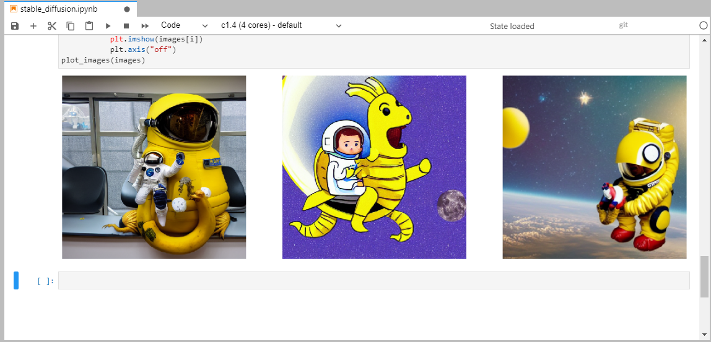

# Image generation using Stable Diffusion model

In {{ ml-platform-name }}, you can deploy a neural network based on the Stable Diffusion model and generate images by their text description.

[Stable Diffusion](https://github.com/CompVis/stable-diffusion/blob/main/README.md) is an open-source text-to-image model developed by [stability.ai](https://stability.ai/).

In this tutorial, you will generate an image based on a text description using an implementation of the Stable Diffusion model in the [KerasCV](https://keras.io/keras_cv/) library. Compared to other Stable Diffusion model implementations, KerasCV has a number of advantages that ensure a high image generation rate. These include [XLA complilation](https://www.tensorflow.org/xla) and support for [mixed precision](https://www.tensorflow.org/guide/mixed_precision).

To generate an image using the Stable Diffusion model:

1. [Prepare your infrastructure](#infra).
1. [Create a model and generate an image](#generate).

If you no longer need the resources you created, [delete them](#clear-out).

## Getting started {#before-you-begin}





### Required paid resources {#paid-resources}

The cost of using the model includes a fee for running code cells (see [{{ ml-platform-name }} pricing](../../datasphere/pricing.md)).

## Prepare the infrastructure {#infra}

### Create a project {#create-project}

1. Open the {{ ml-platform-name }} [home page]({{ link-datasphere-main }}).
1. In the left-hand panel, select  **{{ ui-key.yc-ui-datasphere.common.spaces }}**.
1. Select the community to create a project in.
1. On the community page, click  **{{ ui-key.yc-ui-datasphere.projects.create-project }}**.
1. In the window that opens, enter `Stable Diffusion` as your project name and add a description (optional).
1. Click **{{ ui-key.yc-ui-datasphere.common.create }}**.

### Create a notebook and install the libraries {#install-libraries}



In this tutorial, all computations are made in the g1.1 configuration. However, you can also run the model in other configurations.



1. In the {{ ml-platform-name }} interface, open the project you created.
1. Create a new notebook:

   1. In the top panel of the project window, click **File** → **New** → **Notebook**.
   1. In the window that opens, select **{{ ml-platform-name }} Kernel**.

1. Update the [TensorFlow](https://www.tensorflow.org/) library. Paste the below code into the cell and click :

   ```python
   %pip install tensorflow==2.11.0
   ```

1. Install the KerasCV library:

   ```python
   %pip install keras_cv==0.4.2
   ```

1. Install the [NumPy](https://numpy.org/) library, version 1.21:

   ```python
   %pip install numpy==1.21
   ```

1. Install the Protocol Buffers library, version 3.20:

   ```python
   %pip install protobuf==3.20
   ```

1. Restart the kernel by clicking **Kernel** → **Restart kernel** in the top panel of the project window.

## Create a model and generate an image {#generate}

1. Import the libraries to the project:

   ```python
   #!g1.1
   import time
   import keras_cv
   from tensorflow import keras
   import matplotlib.pyplot as plt
   ```

1. Create a model:

   ```python
   #!g1.1
   model = keras_cv.models.StableDiffusion(img_width=512, img_height=512)
   ```

1. Generate an image by its description:

   ```python
   #!g1.1
   images = model.text_to_image("photograph of an astronaut riding a banana with old dragon", batch_size=3)
   ```

1. Create an image plotting function:

   ```python
   #!g1.1
   def plot_images(images):
       plt.figure(figsize=(20, 20))
       for i in range(len(images)):
           ax = plt.subplot(1, len(images), i + 1)
           plt.imshow(images[i])
           plt.axis("off")
   ```

1. Display the image you got:

   ```python
   #!g1.1
   plot_images(images)
   ```

   Result:

   

## How to delete the resources you created {#clear-out}

If you no longer plan to use the `Stable Diffusion` project, [delete it](../../datasphere/operations/projects/delete.md#delete-project).
