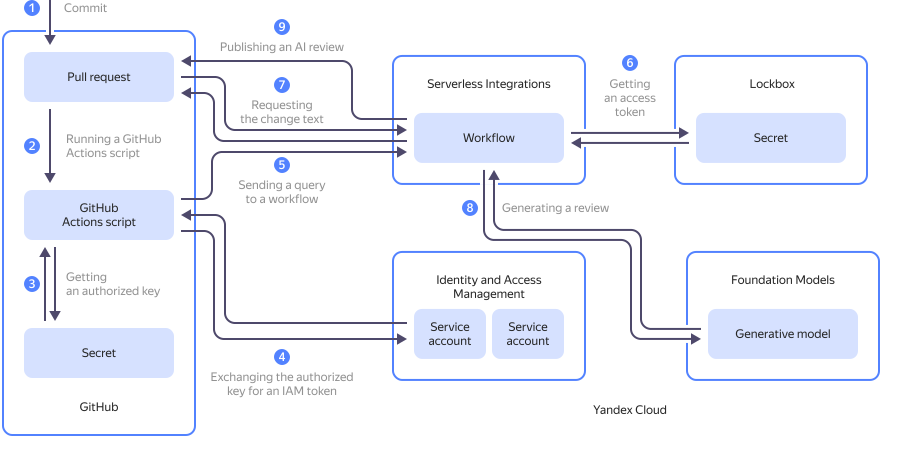

In this tutorial, you will use {{ foundation-models-full-name }} [text generation capabilities](../../foundation-models/concepts/generation/models.md) to implement the scenario of automatic [review](https://docs.github.com/en/get-started/learning-about-github/github-glossary#review) of proposed code changes on [GitHub](https://github.com/).

This solution uses a [GitHub Actions](https://docs.github.com/en/actions/get-started/understand-github-actions) script to request {{ yandex-cloud }} for an AI review of changes in the [pull request](https://docs.github.com/en/get-started/learning-about-github/github-glossary#pull-request). The steps of pulling the changes, requesting a review from the generative model, and publishing the review to GitHub are performed by a {{ sw-full-name }} [workflow](../../serverless-integrations/concepts/workflows/workflow.md).



On the diagram:

1. User adds a [commit](https://docs.github.com/en/get-started/learning-about-github/github-glossary#commit) to a pull request on GitHub.
1. When the new commit appears in the pull request, a GitHub Actions script is run.
1. The GitHub Actions script gets the {{ yandex-cloud }} service account's [authorized key](../../iam/concepts/authorization/key.md) stored in a GitHub [repository secret](https://docs.github.com/en/actions/how-tos/write-workflows/choose-what-workflows-do/use-secrets).
1. The GitHub Actions script requests an [IAM token](../../iam/concepts/authorization/iam-token.md) in exchange for the [service account's](../../iam/concepts/users/service-accounts.md) authorized key in {{ iam-full-name }}. The IAM token is required for authentication in the {{ si-full-name }} API.
1. The GitHub Actions script uses the IAM token to send an HTTP request to the {{ sw-full-name }} workflow to generate a review. The pull request number is at the same time provided to the {{ sw-name }} workflow.
1. The {{ sw-name }} workflow gets the [access token](https://docs.github.com/en/authentication/keeping-your-account-and-data-secure/managing-your-personal-access-tokens#about-personal-access-tokens) named `personal access token (classic)` for access to the GitHub repository in a {{ lockbox-full-name }} [secret](../../lockbox/concepts/secret.md).
1. The {{ sw-name }} workflow uses the access token to pull the changes proposed in the pull request from the GitHub repository.
1. The {{ sw-name }} workflow requests the {{ foundation-models-full-name }} [model](../../foundation-models/concepts/generation/models.md) to review the changes proposed in the pull request. The model returns the review with its comments and tips on how to improve the code.
1. The {{ sw-name }} workflow uses the access token to publish the review in the GitHub pull request.

To set up automatic AI reviewing of GitHub pull requests:

1. [Create a repository on GitHub](#create-github-repo).
1. [Get your cloud ready](#prepare-cloud).
1. [Create a {{ sw-name }} workflow](#create-si-workflow).
1. [Configure a GitHub Actions script](#github-actions-workflow).
1. [Test the script](#test).

If you no longer need the resources you created, [delete them](#clear-out).

## Create a repository in GitHub {#create-github-repo}

[Create](https://docs.github.com/en/repositories/creating-and-managing-repositories/creating-a-new-repository) a new GitHub repository or use an existing one where you have permissions to view and run GitHub Actions.

[Create](https://docs.github.com/en/authentication/keeping-your-account-and-data-secure/managing-your-personal-access-tokens#creating-a-personal-access-token-classic) and save a _personal access token (classic)_ with the `repo` or `public_repo` [access scope](https://docs.github.com/en/apps/oauth-apps/building-oauth-apps/scopes-for-oauth-apps#available-scopes).

## Get your cloud ready {#prepare-cloud}



### Required paid resources {#paid-resources}

The infrastructure support costs for implementing a scenario for automatic AI review of pull requests include:
* Text generation fee (see [{{ foundation-models-full-name }} pricing](../../foundation-models/pricing.md)).
* Fee for storing the secret and operations with it (see [{{ lockbox-full-name }} pricing](../../lockbox/pricing.md)).
* Fee for data logging and storage in a [log group](../../logging/concepts/log-group.md) if using [{{ cloud-logging-name }}](../../logging/) (see [{{ cloud-logging-full-name }} pricing](../../logging/pricing.md)).

### Create a {{ lockbox-name }} secret {#create-secret}

Create a {{ lockbox-full-name }} [secret](../../lockbox/concepts/secret.md) to safely store the GitHub access token.



- Management console {#console}

   1. In the [management console]({{ link-console-main }}), select the folder where you are going to create your infrastructure.
   1. In the list of services, select **{{ ui-key.yacloud.iam.folder.dashboard.label_lockbox }}**.
   1. Click **{{ ui-key.yacloud.lockbox.button_create-secret }}**.
   1. In the **{{ ui-key.yacloud.common.name }}** field, enter a name for the secret: `github/pat-for-workflows`.
   1. In the **{{ ui-key.yacloud.lockbox.forms.title_secret-type }}** field, select `{{ ui-key.yacloud.lockbox.forms.title_secret-type-custom }}`.
   1. In the **{{ ui-key.yacloud.lockbox.forms.label_key }}** field, enter `token`.
   1. In the **{{ ui-key.yacloud.lockbox.forms.label_value }}** field, enter the `personal access token (classic)` access token previously obtained on GitHub.
   1. Click **{{ ui-key.yacloud.common.create }}**.

  The action will open a window containing a table with information about the new secret. Save its ID as you will need it later to create the workflow.

- CLI {#cli}

  

  

  Run the command by specifying the `personal access token (classic)` token you got earlier on GitHub.

  ```bash
  yc lockbox secret create \
    --name github/pat-for-workflows \
    --payload '[{"key":"token","textValue":"<access_token>"}]'
  ```

  Result:

  ```text
  done (1s)
  id: e6q034pgt99k********
  folder_id: b1gt6g8ht345********
  created_at: "2025-08-20T15:39:05.873Z"
  name: github/pat-for-workflows
  status: ACTIVE
  current_version:
    id: e6quqngm8om0********
    secret_id: e6q034pgt99k********
    created_at: "2025-08-20T15:39:05.873Z"
    status: ACTIVE
    payload_entry_keys:
      - token
  ```

  Save the new secret's ID (the `secret_id` field value) as you will need it later to create the workflow.

- API {#api}

  Use the [create](../../lockbox/api-ref/Secret/create.md) REST API method for the [Secret](../../lockbox/api-ref/Secret/index.md) resource or the [SecretService/Create](../../lockbox/api-ref/grpc/Secret/create.md) gRPC API call.



### Create service accounts {#create-sa}

Create two [service accounts](../../iam/concepts/users/service-accounts.md):
* `workflow-sa`: This one will be used to run the {{ sw-name }} [workflow](../../serverless-integrations/concepts/workflows/workflow.md).
* `github-worker`: This one will be used to execute the workflow on a request from the GitHub Actions script.

1. Create a service account named `workflow-sa` and assign the [`{{ roles-lockbox-payloadviewer }}`](../../lockbox/security/index.md#lockbox-payloadViewer) and [`ai.languageModels.user`](../../foundation-models/security/index.md#languageModels-user) [roles](../../iam/concepts/access-control/roles.md) to it.

    

    - Management console {#console}

        1. In the [management console]({{ link-console-main }}), select the folder where you are deploying your infrastructure.
        1. In the list of services, select **{{ ui-key.yacloud.iam.folder.dashboard.label_iam }}**.
        1. Click **{{ ui-key.yacloud.iam.folder.service-accounts.button_add }}**.
        1. Specify the service account name: `workflow-sa`.
        1. Click  **{{ ui-key.yacloud.component.acl.update-dialog.button_add-role }}** and select the [`{{ roles-lockbox-payloadviewer }}`](../../lockbox/security/index.md#lockbox-payloadViewer) and [`ai.languageModels.user`](../../foundation-models/security/index.md#languageModels-user) roles.
        1. Click **{{ ui-key.yacloud.iam.folder.service-account.popup-robot_button_add }}**.

    - CLI {#cli}

      1. To create a service account, run the following command:

          ```bash
          yc iam service-account create \
            --name workflow-sa
          ```

          Result:

          ```text
          done (1s)
          id: aje4rh1vb737********
          folder_id: b1gt6g8ht345********
          created_at: "2025-08-21T13:49:54.097378917Z"
          name: workflow-sa
          ```

          Save the new service account's ID (the `secret_id` field value) as you will need it later to assign a role and create the workflow.

      1. Run this command to assign the `lockbox.payloadViewer` role to the new service account:

          ```bash
          yc resource-manager folder add-access-binding <folder_ID> \
            --role lockbox.payloadViewer \
            --subject serviceAccount:<service_account_ID>
          ```

          Where:

          * `<folder_ID>`: [ID of the folder](../../resource-manager/operations/folder/get-id.md) you are creating the infrastructure in.
          * `<service_account_ID>`: Service account ID saved in the previous step.

          Result:

          ```text
          done (2s)
          effective_deltas:
            - action: ADD
              access_binding:
                role_id: lockbox.payloadViewer
                subject:
                  id: aje4rh1vb737********
                  type: serviceAccount
          ```
      1. Similarly, assign the `ai.languageModels.user` role to the new service account.

    - API {#api}

      To create a service account, use the [create](../../iam/api-ref/ServiceAccount/create.md) REST API method for the [ServiceAccount](../../iam/api-ref/ServiceAccount/index.md) resource or the [ServiceAccountService/Create](../../iam/api-ref/grpc/ServiceAccount/create.md) gRPC API call.

      To assign the service account a role for the folder, use the [updateAccessBindings](../../resource-manager/api-ref/Folder/updateAccessBindings.md) REST API method for the [Folder](../../resource-manager/api-ref/Folder/index.md) resource or the [FolderService/UpdateAccessBindings](../../resource-manager/api-ref/grpc/Folder/updateAccessBindings.md) gRPC API call.

    

1. Similarly, create a service account named `github-worker` and assign the `serverless.workflows.executor` [role](../../iam/concepts/access-control/roles.md) to it.

### Create an authorized key for the service account {#create-authorized-key}

Create an [authorized key](../../iam/concepts/authorization/key.md) for the `github-worker` service account. An authorized key will allow the GitHub Actions script to get an IAM token for authentication in the {{ yandex-cloud }} API.




- Management console {#console}

  1. In the [management console]({{ link-console-main }}), select the folder where you are deploying your infrastructure.
  1. In the list of services, select **{{ ui-key.yacloud.iam.folder.dashboard.label_iam }}**.
  1. In the list that opens, select `github-worker`.
  1. In the top panel, click  **{{ ui-key.yacloud.iam.folder.service-account.overview.button_create-key-popup }}** and select `{{ ui-key.yacloud.iam.folder.service-account.overview.button_create_key }}`.
  1. Click **{{ ui-key.yacloud.iam.folder.service-account.overview.popup-key_button_create }}**.
  1. In the window that opens, click **{{ ui-key.yacloud.iam.folder.service-account.overview.action_download-keys-file }}** and then click **{{ ui-key.yacloud.iam.folder.service-account.overview.popup-key_button_close }}**.

  The action will download to your computer a file named `authorized_key.json` containing the authorized key. Save it as you will need it later to configure GitHub Actions.

- CLI {#cli}

  Run this command:

  ```bash
  yc iam key create \
    --service-account-name github-worker \
    -o authorized_key.json
  ```

  The action will create on your computer a file named `authorized_key.json` containing the authorized key. Save it as you will need it later to configure GitHub Actions.

- API {#api}

  Use the [create](../../iam/api-ref/Key/create.md) REST API method for the [Key](../../iam/api-ref/Key/index.md) resource or the [KeyService/Create](../../iam/api-ref/grpc/Key/create.md) gRPC API call.



## Create a {{ sw-name }} workflow {#create-si-workflow}

Create a {{ sw-name }} [workflow](../../serverless-integrations/concepts/workflows/workflow.md) on the {{ yandex-cloud }} side.

1. Create a file named `yawl-spec.yaml` with the following [YaWL specification](../../serverless-integrations/concepts/workflows/yawl/index.md) of the workflow:

    **yawl-spec.yaml**

    ```yml
    yawl: '0.1'
    start: GetDiff
    steps:
      GetDiff:
        httpCall:
          url: >-
            https://api.github.com/repos/<organization_name_on_GitHub>/<repository_name>/pulls/\(.input)
          method: GET
          headers:
            Accept: application/vnd.github.v3.diff
            Authorization: Bearer \(lockboxPayload("<secret_ID>"; "token"))
          output: '\({diff: .})'
          next: Review
          catch: []
      Review:
        aiAgent:
          agentConfig:
            role: >-
              Experienced software developer specializing in reviewing
              changes in repositories in the project’s language(s).
            goal: >-
              Review the diff: find logical errors, vulnerabilities, style
              issues, suggest improvements and tests.
            model:
              # You can select 'yandexgpt' or another model
              name: <model_name>
          tasks:
            - result: >-
                Text with comments for publication on GitHub. Structure:

                1) Logical errors
                2) Potential security issues
                3) Code style and minor comments
                4) Suggestions for testing and refactoring
              description: 'Review these changes: \(.diff)'
          output: '\({review: .Result})'
          next: PostComment
      PostComment:
        httpCall:
          # POST comment on issues (pull request comments go through the issues API)
          url: >-
            https://api.github.com/repos/<organization_name_on_GitHub>/<repository_name>/issues/\(.input)/comments
          method: POST
          body: |-
            \({
              body: .review
            })
          headers:
            Authorization: Bearer \(lockboxPayload("<secret_ID>"; "token"))
            X-GitHub-Api-Version: '2022-11-28'
    ```

    Where:
    * `<organization_name_on_GitHub>`: Name of user or organization owning the GitHub repository.
    * `<repository_name>`: GitHub repository name.
    * `<secret_ID>`: {{ lockbox-name }} secret ID you saved earlier.
    * `<model_name>`: [Name](../../foundation-models/concepts/generation/models.md#generation) of the {{ foundation-models-full-name }} text generation model, e.g., `qwen3-235b-a22b-fp8`.

1. Create a workflow:

    

    - Management console {#console}

      1. In the [management console]({{ link-console-main }}), go to the folder you want to create an infrastructure in.
      1. In the list of services, select **{{ ui-key.yacloud.iam.folder.dashboard.label_serverless-integrations }}**.
      1. In the left-hand panel, click  **{{ ui-key.yacloud.serverless-workflows.label_service }}**.
      1. In the top-right corner, click **{{ ui-key.yacloud.serverless-workflows.button_create-workflow }}**.
      1. Choose the `{{ ui-key.yacloud.serverless-workflows.spec-editor-type_label_text-editor }}` method.
      1. In the code editor, paste the contents of the `yawl-spec.yaml` file you created earlier.
      1. Expand **{{ ui-key.yacloud.serverless-workflows.label_additional-parameters }}**.
      1. In the **{{ ui-key.yacloud.common.name }}** field, enter the workflow name, e.g., `github-ai-review-workflow`.
      1. In the **{{ ui-key.yacloud.serverless-workflows.label_service-account }}** field, select the previously created service account named `workflow-sa`.
      1. Optionally, [configure](../../serverless-integrations/operations/workflows/workflow/logs-write.md) logging for workflow runs.
      1. Click **{{ ui-key.yacloud.common.create }}**.

      The action will open a window containing a table with information about the new workflow. Save its ID as you will need it later to configure the GitHub Actions script.

    - CLI {#cli}

      Run this command:

      ```bash
      yc serverless workflow create \
        --yaml-spec <specification_file_path> \
        --name <workflow_name> \
        --service-account-id <service_account_ID> \
        --no-logging
      ```

      Where:

      * `--yaml-spec`: Path to the previously created YaWL specification file, e.g., `./yawl-spec.yaml`.
      * `--name`: Name of the new workflow, e.g., `github-ai-review-workflow`.
      * `--service-account-id`: ID of the `workflow-sa` service account you saved earlier.
      * `--no-logging`: Parameter that disables logging of workflow runs. This is an optional parameter. If the parameter is not specified, workflow runs are logged to the default [log group](../../logging/concepts/log-group.md) of the folder the workflow was created in.

      Result:

      ```text
      done (4s)
      id: dfq58scovpo5********
      folder_id: b1gt6g8ht345********
      specification:
        spec_yaml: |-
        ...
      created_at: "2025-08-21T19:09:18.299850Z"
      name: github-ai-review-workflow
      status: ACTIVE
      log_options:
        disabled: true
      service_account_id: ajerhj18qmdd********
      ```

      Save the new workflow's ID (the `id` field value) as you will need it later to configure the GitHub Actions script.

    - API {#api}

      To create a workflow, use the [Create](../../serverless-integrations/workflows/api-ref/Workflow/create.md) REST API method for the [Workflows](../../serverless-integrations/workflows/api-ref/Workflow/index.md) resource or the [WorkflowService/Create](../../serverless-integrations/workflows/api-ref/grpc/Workflow/create.md) gRPC API call.

    

## Configure a GitHub Actions script {#github-actions-workflow}

1. In the GitHub interface, [create](https://docs.github.com/en/actions/how-tos/write-workflows/choose-what-workflows-do/use-secrets#creating-secrets-for-a-repository) a repository secret named `YC_SA_JSON_CREDENTIALS` and copy the content of the [previously](#create-authorized-key) obtained authorized key file into it.
1. Clone your repository if you have not done so already:

    ```bash
    git clone <repository_URL>
    ```
1. In the local copy of your repository, create a directory named `.github/workflows/` (if it is not there yet) and create in it a file named `ai-review.yml`.
1. Paste the following code into `ai-review.yml` with the previously saved ID of the {{ sw-name }} workflow in the `workflowId` field:

    ```yaml
    name: Pull Request Automated Checks
    on:
      pull_request:
        branches:
          - main

    jobs:
      neuro-review:
        runs-on: ubuntu-latest
        steps:
          - name: Get IAM Token (Yandex)
            id: issue-iam-token
            uses: yc-actions/yc-iam-token@v1
            with:
              # Keep the JSON key of the SA authorized key in secrets
              yc-sa-json-credentials: $not_var{{ secrets.YC_SA_JSON_CREDENTIALS }}

          - name: Start Review Workflow
            uses: fjogeleit/http-request-action@v1
            with:
              url: 'https://serverless-workflows.api.cloud.yandex.net/workflows/v1/execution/start'
              method: 'POST'
              bearerToken: "$not_var{{ steps.issue-iam-token.outputs.token }}"
              data: |
                {
                  "workflowId": "<workflow_ID>",
                  "input": {
                    "inputJson": "$not_var{{ github.event.pull_request.number }}"
                  }
                }
    ```

1. Save the file and submit the changes to the remote repository:

    ```bash
    git add . && git commit -m "Added ai-review.yml" && git push
    ```

## Test the script {#test}

To test the script, create a new pull request in your GitHub repository. When creating a pull request and on each subsequent commit to the pull request, the GitHub Actions script will be executed to initiate a review of proposed changes on the {{ yandex-cloud }} side and publish that review in the pull request.

## Delete the resources you created {#clear-out}

To stop paying for the resources you created:

1. [Delete](../../lockbox/operations/secret-delete.md) the {{ lockbox-name }} secret.
1. [Delete](../../serverless-integrations/operations/workflows/workflow/delete.md) the {{ sw-name }} workflow.
1. [Delete](../../logging/operations/delete-group.md) the log group if you had activated workflow run logging.
1. Optionally, [delete](../../iam/operations/sa/delete.md) the service accounts.
