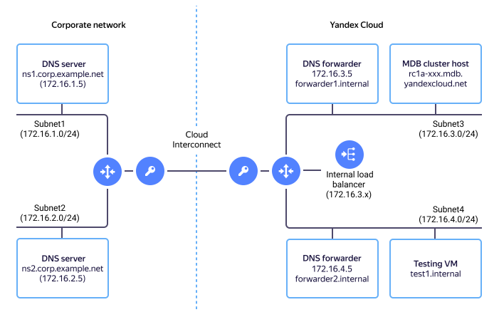

If you have your own corporate networks connected to internal networks in your {{ yandex-cloud }} cloud(for example, via [{{ interconnect-name }}](../interconnect/concepts/index.md)), then you can integrate {{ dns-name }} with your corporate DNS. This lets you access resources and services by their name, regardless of their location, both in corporate and cloud networks.

You can't delegate DNS record management in [private zones](../dns/concepts/dns-zone.md#private-zones) in {{ yandex-cloud }} to your DNS servers in the corporate network, because NS records are ignored for private zones. To ensure domain name recognition for cloud network services and resources in private zones, configure separate DNS forwarders in your cloud subnets. _DNS forwarders_ are DNS servers that redirect requests differently depending on the name specified in the request.



As examples of such servers, we use [CoreDNS](https://coredns.io/) and [unbound](https://www.nlnetlabs.nl/projects/unbound/). You can use any other DNS forwarder.



To set up name recognition for corporate services and resources in {{ yandex-cloud }} cloud networks:

* [Read the integration example](#network-desc).
* [Set up Cloud DNS](#setup-cloud-dns).
* [Set up corporate DNS servers](#setup-on-prem-dns).
* [Check the service](#check-dns-service).

If you no longer need the created resources, [delete them](#clear-out).

## Integration example {#network-desc}



1. The corporate network consists of two subnets: `172.16.1.0/24` and `172.16.2.0/24`.

1. Each subnet has one DNS server:
    * `172.16.1.5`: ns1.corp.example.net
    * `172.16.2.5`: ns2.corp.example.net

    These servers serve the corp.example.net zone.

1. The {{ yandex-cloud }} cloud network also consists of two subnets:
   * `172.16.3.0/24`: subnet3, in the `{{ region-id }}-a` availability zone
   * `172.16.4.0/24`: subnet4, in the `{{ region-id }}-b` availability zone

    {{ yandex-cloud }} DNS servers are hosted in these subnets: `172.16.3.2` and `172.16.4.2`.

    The servers serve [internal DNS zones in the cloud network](../dns/concepts/dns-zone.md).

1. The corporate and cloud networks are interconnected so that all subnets of one network are accessible from subnets of the other network and vice versa.

Next, let's set up two DNS forwarders in the cloud network:

* `172.16.3.5`: forwarder1.internal
* `172.16.4.5`: forwarder2.internal

They will redirect DNS requests as follows:

* Requests to the `corp.example.net` zone — via corporate DNS servers `172.16.1.5` and `172.16.2.5`.
* All other requests (to the `.` zone) — via internal {{ yandex-cloud }} DNS servers to the corresponding subnets: `172.16.3.2` and `172.16.4.2`.

To ensure fault tolerance for DNS forwarders, they will be placed behind the [internal network load balancer](../network-load-balancer/concepts/index.md) of {{ network-load-balancer-full-name }}. All requests to DNS forwarders (both from the cloud network and from the corporate network) will pass through this load balancer.

## Before you start {#before-you-begin}

1. To install DNS forwarders in each of the cloud subnets (both in `subnet3` and `subnet4`), [create a VM instance](../compute/operations/vm-create/create-linux-vm.md) from a public Ubuntu 20.04 image using the following parameters:
    * **Name**:
        * `forwarder1`: For the VM in `subnet3`.
        * `forwarder2`: For the VM in `subnet4`.
    * Under **Network settings**:
      * **Public address**: No address.
      * **Internal address**: Select **Manual** and specify:
        * 172.16.3.5: For the `forwarder1` VM.
        * 172.16.4.5: For the `forwarder2` VM.

1. To connect from the internet and check the service in `subnet4`, create other VM instance from the Ubuntu 20.04 public image with the following parameters:
    * **Name**: `test1`.
    * Under **Network settings**:
      * **Public address**: Auto.
      * **Internal address**: Auto.

1. To be able to install software from the internet in `subnet3` and `subnet4`: [Enable Egress NAT](../vpc/operations/enable-nat.md).

## Set up Cloud DNS {#setup-cloud-dns}

1. [Set up DNS forwarders](#setup-dns-forwarders).
1. [Set up the network load balancer](#setup-cloud-balancer).
1. [Set up DHCP](#setup-cloud-dhcp).

### Set up DNS forwarders {#setup-dns-forwarders}



* CoreDNS

  1. [Connect to the VM instance](../compute/operations/vm-connect/ssh) to install a DNS forwarder via the `test1` intermediate VM instance.

  1. Download the current `CoreDNS` version from the [developer page](https://github.com/coredns/coredns/releases/latest) and install it:

      ```bash
      cd /var/tmp && wget <package URL> -O - | tar -zxvf
      sudo mv coredns /usr/local/sbin
      ```

  1. Create the `CoreDNS` configuration file:

      ```bash
      sudo mkdir /etc/coredns
      sudo tee /etc/coredns/Corefile
      <paste the Corefile section>
      ```

      `Corefile for forwarder1`

      ```text
      corp.example.net {
        forward . 172.16.1.5 172.16.2.5
      }
      . {
        forward . 172.16.3.2
        health
      }
      ```

      `Corefile for forwarder2`

      ```text
      corp.example.net {
        forward . 172.16.1.5 172.16.2.5
      }
      . {
        forward . 172.16.4.2
        health
      }
      ```

      

  1. Enable automatic startup for `CoreDNS`:

      ```bash
      sudo tee /etc/systemd/system/coredns.service
      <paste the coredns.service section>
      sudo systemctl enable --now coredns
      ```

      

      ```text
      [Unit]
      Description=CoreDNS
      After=network.target
      
      [Service]
      User=root
      ExecStart=/usr/local/sbin/coredns -conf /etc/coredns/Corefile
      StandardOutput=append:/var/log/coredns.log
      StandardError=append:/var/log/coredns.log
      RestartSec=5
      Restart=always
      
      [Install]
      WantedBy=multi-user.target
      ```

      

  1. Disable the DNS name resolution system service to delegate its function to the local DNS forwarder. In Ubuntu 20.04, this can be done with the commands:

      ```bash
      sudo systemctl disable --now systemd-resolved
      rm /etc/resolv.conf
      echo "nameserver 127.0.0.1" | sudo tee /etc/resolv.conf
      ```

* unbound

  1. [Connect to the VM instance](../compute/operations/vm-connect/ssh) of the DNS forwarder via the `test1` intermediate VM instance.

  1. Install the `unbound` package:

      ```bash
      sudo apt update && sudo apt install --yes unbound
      ```

  1. Set up and restart the DNS forwarder:

      ```bash
      sudo tee --append /etc/unbound/unbound.conf
      <paste the unbound.conf section>
      sudo systemctl restart unbound
      ```

      

      ```text
      server:
        module-config: "iterator"
        interface: 0.0.0.0
        access-control: 127.0.0.0/8   allow
        access-control: 172.16.0.0/21 allow
      
      forward-zone:
        name: "corp.example.net"
        forward-addr: 172.16.1.5
        forward-addr: 172.16.2.5
      
      forward-zone:
        name: "."
        forward-addr: 172.16.3.2
      ```

      

      

      ```text
      server:
        module-config: "iterator"
        interface: 0.0.0.0
        access-control: 127.0.0.0/8   allow
        access-control: 172.16.0.0/21 allow
      
      forward-zone:
        name: "corp.example.net"
        forward-addr: 172.16.1.5
        forward-addr: 172.16.2.5
      
      forward-zone:
        name: "."
        forward-addr: 172.16.4.2
      ```

      

  1. Disable the DNS name resolution system service to delegate its function to the local DNS forwarder. In Ubuntu 20.04, this can be done with the commands:

      ```bash
      sudo systemctl disable --now systemd-resolved
      rm /etc/resolv.conf
      echo "nameserver 127.0.0.1" | sudo tee /etc/resolv.conf
      ```



### Set up the network load balancer {#setup-cloud-balancer}

Create a [network load balancer](../network-load-balancer/operations/internal-lb-create.md) with the following parameters:

* **Type**: **Internal**.

* In the **Listeners** section:
  * **Subnet**: Select `subnet3` from the list.
  * **Protocol**: **UDP**.
  * **Port**: `53`.
  * **Target port**: `53`.

* Under **Target groups**:

  * Create a group with the `forwarder1` and `forwarder2` hosts.

  * Under **Health check**, specify the parameters:

    

    * CoreDNS
      * Type: `HTTP`.
      * Path: `/health`.
      * Port: `8080`.

    * unbound
      * Type: `TCP`.
      * Port: `53`.

    

When you create a load balancer, it's automatically assigned an IP address from `subnet3`.



The internal network load balancer won't respond to DNS requests from forwarders that make up its target group: `forwarder1` and `forwarder2`. This has to do with its implementation. For more information, see [{#T}](../network-load-balancer/concepts/internal-load-balancer.md).



### Set up DHCP {#setup-cloud-dhcp}

To make sure that hosts in the cloud network automatically use the corporate DNS service, in the [DHCP settings](../vpc/concepts/dhcp-options.md) for `subnet3` and `subnet4`, specify:

1. **DNS server address**: The IP address that was [assigned to the load balancer](#setup-cloud-balancer).
1. (Optional) **Domain name**: `corp.example.net`.

To update the network settings on the `forwarder1`, `forwarder2`, and `test1` hosts, run the command:

```bash
sudo netplan apply
```

Once the network settings are updated, the hosts in the cloud network will use the load balancer instead of the {{ yandex-cloud }} DNS server.

## Set up corporate DNS servers {#setup-on-prem-dns}

Configure the corporate servers so that DNS queries to the [{{ yandex-cloud }} private zones](../dns/concepts/dns-zone#private-zones) are forwarded to the IP address that was [assigned to the load balancer](#setup-cloud-balancer).

## Run a health check for the service {#check-dns-service}

1. Check that on the `forwarder1`, `forwarder2`, and `test1` cloud hosts, domain names are resolved in the private zone `corp.example.net`:

    ```bash
    host ns1.corp.example.net
    ns1.corp.example.net has address 172.16.1.5
    ```

1. Check that on the `forwarder1`, `forwarder2`, and `test1` cloud hosts, domain names are resolved in public zones, for example:

    ```bash
    host cisco.com
    cisco.com has address 72.163.4.185
    ...
    ```

1. Check that on the corporate DNS servers `ns1` and `ns2`, internal {{ yandex-cloud }} names are resolved, for example:

    ```bash
    host ns.internal
    ns.internal has address 10.130.0.2
    ```

1. To make sure that the services start up automatically, restart the `forwarder1`, `forwarder2`, and `test1` VM instances and then re-run the health checks.

## Delete the resources you no longer need {#clear-out}

* If you no longer need some of the created VM instances, [delete them](../compute/operations/vm-control/vm-delete).
* Delete the [target groups](../network-load-balancer/operations/target-group-delete.md), [listeners](../network-load-balancer/operations/listener-remove.md), and [network load balancer](../network-load-balancer/operations/load-balancer-delete.md).
