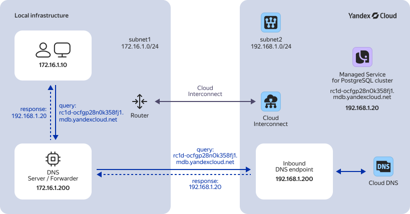

If you have your own corporate networks connected to {{ yandex-cloud }} [networks](../../vpc/concepts/network.md#network) (e.g., via [{{ interconnect-full-name }}](../../interconnect/index.yaml)), you can integrate your corporate DNS with internal DNS zones in {{ yandex-cloud }} and implement resolution of DNS names of cloud resources within your corporate networks. This will allow you to access cloud resources and {{ yandex-cloud }} services by name from your corporate networks.

To configure resolution of internal cloud DNS names by clients in your corporate network, you will create an [inbound DNS connection](../../dns/concepts/dns-connection.md#dns-inbound) on the {{ yandex-cloud }} side to redirect DNS requests from the corporate network to [DNS resolvers](../../dns/concepts/dns-resolver.md) in {{ vpc-name }} subnets. On the corporate network side, you will set up a DNS server, so that all DNS requests to cloud resources are redirected to the IP address of your new inbound DNS connection.

In this scenario, a user connected to a corporate subnet in `subnet1` resolves a DNS name of a {{ mpg-full-name }} [cluster](../../managed-postgresql/concepts/index.md) host by sending DNS requests via a local [DNS forwarder](*dns_forwarder).

You can see the solution architecture in the diagram below:



1. Corporate network:

    * Consists of the `subnet1` subnet with the `172.16.1.0/24` address range.
    * `subnet1` hosts a DNS server (DNS forwarder) with the `172.16.1.200` IP address.

        This server serves the DNS zone in the `subnet1` subnet and redirects DNS requests from the user's computer `172.16.1.10` to the cloud network, namely to the IP address of the [inbound DNS connection](../../dns/concepts/dns-connection.md#dns-inbound) created on the {{ yandex-cloud}} side.
1. {{ yandex-cloud }} network:

    * Consists of the `subnet2` [subnet](../../vpc/concepts/network.md#subnet) with the `192.168.1.0/24` address range.
    * `subnet2` hosts a {{ mpg-full-name }} cluster.
    
        In this tutorial, you will set up integration in such a way that the DNS name (FQDN) of that cluster’s host successfully resolves from within the corporate network.
    * The cloud network has an [inbound DNS connection](../../dns/concepts/dns-connection.md#dns-inbound) allowing the corporate network clients to resolve DNS names in {{ yandex-cloud }} [internal DNS zones](../../dns/concepts/dns-zone.md#private-zones).

        The inbound DNS connection was assigned the `192.168.1.200` IP address which belongs to `subnet2` and is reserved in {{ vpc-full-name }}.
1. Thanks to {{ interconnect-full-name }}, the corporate and cloud networks are linked together in such a way that all the subnet IP addresses in one network are accessible from the other network's subnet, and vice versa.

To configure the resolution of the DNS names of {{ yandex-cloud }} resources and services in corporate networks:

1. [Get your cloud ready](#before-you-begin).
1. [Configure your cloud infrastructure](#setup-cloud-dns).
1. [Configure your corporate network](#setup-on-prem-dns).
1. [Test the integration](#check-dns-service).

If you no longer need the resources you created, [delete them](#clear-out).

## Getting started {#before-you-begin}



### Required paid resources {#paid-resources}

The cost of support for the new infrastructure includes:

* {{ mpg-name }} cluster fee: computing resources allocated to hosts, storage and backup size (see [{{ mpg-name }} pricing](../../managed-postgresql/pricing.md)).
* {{ interconnect-full-name }} fee (see [{{ interconnect-name }} pricing](../../interconnect/pricing.md)).

## Configure your cloud infrastructure {#setup-cloud-dns}

On the {{ yandex-cloud }} side, you will create a cloud network with a single subnet, a {{ mpg-name }} cluster with a single host, and an inbound DNS connection.

### Create a cloud network {#create-network}



- Management console {#console}

  1. In the [management console]({{ link-console-main }}), select the [folder](../../resource-manager/concepts/resources-hierarchy.md#folder) in which you are going to create your cloud infrastructure.
  1. Navigate to **{{ ui-key.yacloud.iam.folder.dashboard.label_vpc }}** and click **{{ ui-key.yacloud.vpc.networks.button_create }}**.
  1. In the **{{ ui-key.yacloud.vpc.networks.create.field_name }}** field, enter a [name](*name) for the cloud network: `my-vpc-network`.
  1. Disable **{{ ui-key.yacloud.vpc.networks.create.field_is-default }}**.
  1. Click **{{ ui-key.yacloud.vpc.networks.button_create }}**.



### Create a subnet {#create-subnet}



- Management console {#console}

  1. In the [management console]({{ link-console-main }}), select the folder where you are deploying your infrastructure.
  1. Navigate to **{{ ui-key.yacloud.iam.folder.dashboard.label_vpc }}**.
  1. In the left-hand panel, select  **{{ ui-key.yacloud.vpc.switch_networks }}** and click **{{ ui-key.yacloud.vpc.subnetworks.button_action-create }}**.
  1. In the **{{ ui-key.yacloud.vpc.subnetworks.create.field_name }}** field, enter a [name](*name) for the subnet: `subnet2`.
  1. In the **{{ ui-key.yacloud.vpc.subnetworks.create.field_zone }}** field, select the `{{ region-id }}-b` [availability zone](../../overview/concepts/geo-scope.md).
  1. In the **{{ ui-key.yacloud.vpc.subnetworks.create.field_network }}** field, select the `my-vpc-network` cloud network you created earlier.
  1. In the **{{ ui-key.yacloud.vpc.subnetworks.create.field_ip }}** field, specify the `192.168.1.0/24` subnet CIDR.
  1. Click **{{ ui-key.yacloud.vpc.subnetworks.create.button_create }}**.



### Create a {{ mpg-full-name }} cluster {#create-cluster}



- Management console {#console}

  1. In the [management console]({{ link-console-main }}), select the folder where you are deploying your infrastructure.
  1. Navigate to **{{ ui-key.yacloud.iam.folder.dashboard.label_managed-postgresql }}** and click **{{ ui-key.yacloud.mdb.clusters.button_create }}**.
  1. In the **{{ ui-key.yacloud.mdb.forms.base_field_name }}** field, enter a [name](*name) for the cluster: `my-postgresql-cluster`.
  1. Under **{{ ui-key.yacloud.mdb.forms.section_database }}**, select `{{ ui-key.yacloud.component.password-input.label_button-generate }}` in the **{{ ui-key.yacloud.mdb.forms.database_field_user-password }}** field.
  1. Under **{{ ui-key.yacloud.mdb.forms.section_network }}**, select the cloud network you created earlier, i.e., `my-vpc-network`.
  1. Under **{{ ui-key.yacloud.mdb.forms.section_host }}**, leave one host in the `{{ region-id }}-b` availability zone.

      To delete hosts you do not need, click  next to host and select  **{{ ui-key.yacloud.common.delete }}**.
  
      

      A single host is enough to test the discussed solution.
      
      In production scenarios, we do not recommend creating a single-host cluster. It is a cheaper option but does not ensure [high availability](../../managed-postgresql/concepts/high-availability.md#host-configuration).

      

  1. Leave all the other parameters unchanged and click **{{ ui-key.yacloud.mdb.forms.button_create }}**.



### Create an inbound DNS connection {#create-inbound-endpoint}

Create an [inbound DNS connection](../../dns/concepts/dns-connection.md#dns-inbound) through which clients from the corporate network will be able to resolve DNS names in {{ yandex-cloud }} internal DNS zones:



- Management console {#console}

  1. In the [management console]({{ link-console-main }}), navigate to the page of the folder you are creating your infrastructure in.
  1. Navigate to **{{ ui-key.yacloud.iam.folder.dashboard.label_dns }}**.
  1. In the left-hand panel, select  **{{ ui-key.yacloud.dns.label_inbound-endpoints }}** and click **{{ ui-key.yacloud.dns.DnsInboundEndpointsListScreen.create_button }}**. In the window that opens:

      1. In the **{{ ui-key.yacloud.common.name }}** field, specify the [name](*name): `corp-example-net-inbound`.
      1. Under **{{ ui-key.yacloud.dns.DnsInboundEndpointForm.network_settings_title }}**, select the `my-vpc-network` cloud network in the **{{ ui-key.yacloud.vpc.label_network }}** field.
      1. In the **{{ ui-key.yacloud.entity.ipAddress }}** field, click **{{ ui-key.yacloud.component.internal-v4-address-field.button_internal-address-reserve }}** to reserve a static internal IP address for the new DNS connection. In the window that opens:

          1. In the **{{ ui-key.yacloud.common.name }}** field, specify the reserved address [name](*name): `corp-example-net-inbound-address`.
          1. In the **{{ ui-key.yacloud.common.label_subnet }}** field, select the subnet named `subnet2` to reserve an IP address in.

              

              The IP address of the inbound DNS connection can belong to any of the subnets in the cloud network you select. However, you cannot specify IP addresses already used by {{ yandex-cloud }} resources.

              

          1. In the **{{ ui-key.yacloud.vpc.addresses.popup-create_field_internal-v4-address }}** field, specify the `192.168.1.200` IP address (belongs to the address range of `subnet2`).
          1. Click **{{ ui-key.yacloud.common.create }}** to reserve the address.
    1. Click **{{ ui-key.yacloud.common.create }}** to create an inbound DNS connection.



## Configure your corporate network {#setup-on-prem-dns}

Configure your corporate network so that DNS requests to [{{ yandex-cloud }} internal zones](../../dns/concepts/dns-zone.md#private-zones) are forwarded to the reserved internal IP address (`192.168.1.200`) [assigned](#create-inbound-endpoint) to the inbound DNS connection.

For example, you can create a [DNS forwarder](*dns_forwarder) in the corporate subnet and specify its IP address as the main DNS server address in the network interface settings of the corporate subnet (`subnet1`) clients. To create DNS forwarders, we recommend you to use [CoreDNS](https://coredns.io/) or [Unbound](https://www.nlnetlabs.nl/projects/unbound/).





- Configuring DNS forwarding using CoreDNS

  1. Connect to the host you are going to set up a DNS forwarder on.
  1. Download the latest `CoreDNS` version from [GitHub](https://github.com/coredns/coredns/releases/latest) and install it:

      ```bash
      cd /var/tmp && wget <package_URL> -O - | tar -xz
      sudo mv coredns /usr/local/sbin
      ```
  1. Create a `CoreDNS` configuration file: 

      ```bash
      sudo mkdir /etc/coredns
      sudo tee >> /etc/coredns/Corefile <<EOF
      {{ dns-zone }} {
        forward . 192.168.1.200
      }
      . {
        forward . <main_DNS_server_IP_address_in_corporate_subnet>
      }
      EOF
      ```
  1. Enable running `CoreDNS` at boot:

      ```bash
      sudo tee >> /etc/systemd/system/coredns.service <<EOF
      [Unit]
      Description=CoreDNS
      After=network.target

      [Service]
      User=root
      ExecStart=/usr/local/sbin/coredns -conf /etc/coredns/Corefile
      StandardOutput=append:/var/log/coredns.log
      StandardError=append:/var/log/coredns.log
      RestartSec=5
      Restart=always

      [Install]
      WantedBy=multi-user.target
      EOF
      sudo systemctl enable --now coredns
      ```
  1. Disable system DNS resolution to delegate it to the local DNS forwarder. For example, in Linux Ubuntu 20.04, you can use these commands:

      ```bash
      sudo systemctl disable --now systemd-resolved
      rm /etc/resolv.conf
      echo "nameserver 127.0.0.1" | sudo tee /etc/resolv.conf
      ```

- Configuring DNS forwarding using Unbound

  1. Connect to the host you are going to set up a DNS forwarder on.
  1. Install the `unbound` package (example for Linux Ubuntu):

      ```bash
      sudo apt update && sudo apt install --yes unbound
      ```
  1. Create a `unbound` configuration file:
   
      ```bash
      sudo tee -a /etc/unbound/unbound.conf <<EOF
      server:
        module-config: "iterator"
        interface: 0.0.0.0
        access-control: 127.0.0.0/8   allow
        access-control: 192.168.0.0/21 allow

      forward-zone:
        name: "{{ dns-zone }}"
        forward-addr: 192.168.1.200

      forward-zone:
        name: "."
        forward-addr: <main_DNS_server_IP_address_in_corporate_subnet>
      EOF
      ``` 
  1. Restart Unbound:

      ```bash
      sudo systemctl restart unbound
      ```

  1. Disable system DNS resolution to delegate it to the local DNS forwarder. For example, in Linux Ubuntu 20.04, you can use these commands:

      ```bash
      sudo systemctl disable --now systemd-resolved
      rm /etc/resolv.conf
      echo "nameserver 127.0.0.1" | sudo tee /etc/resolv.conf
      ```






## Test the integration {#check-dns-service}

1. Get the FQDN of the `my-postgresql-cluster` host you created earlier.

    To learn how to get a host FQDN, see [{#T}](../../managed-postgresql/operations/connect/fqdn.md).
1. Make sure a corporate network computer can resolve names in a {{ yandex-cloud }} internal DNS zone (`{{ dns-zone }}`). Do it by executing a command with the cluster host FQDN specified.

    Here is an example:

    ```bash
    host rc1d-oсfgp28n0k358fj1.{{ dns-zone }}
    ```

    Result:

    ```text
    rc1d-oсfgp28n0k358fj1.{{ dns-zone }} has address 192.168.1.20
    ```
1. Make sure a corporate network computer can resolve names in public zones, for example:

    ```bash
    host cisco.com
    ```

    Result:

    ```text
    cisco.com has address 72.163.4.185
    ...
    ```

## How to delete the resources you created {#clear-out}

To stop paying for the resources:

* [Delete the {{ mpg-name }} cluster](../../managed-postgresql/operations/cluster-delete.md).
* [Delete the inbound DNS connection](../../dns/operations/connection-inbound-delete.md).
* [Delete the reserved internal IP address](../../vpc/operations/private-ip-delete.md).
* [Delete the subnet](../../vpc/operations/subnet-delete.md).
* [Delete the cloud network](../../vpc/operations/network-delete.md).

[*name]: 

[*dns_forwarder]: A DNS forwarder is a special DNS server which forwards DNS requests differently depending on the domain name specified in the request.
