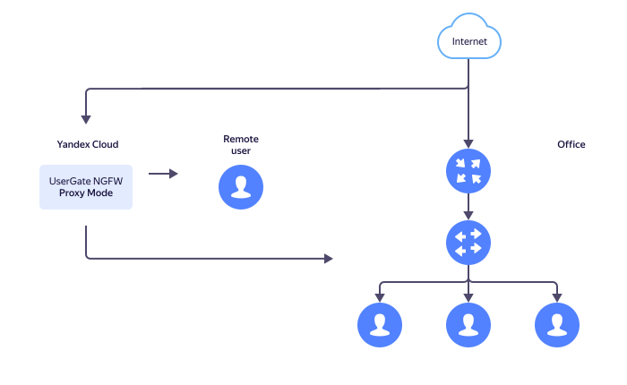

# Creating and configuring a UserGate gateway in proxy server mode


[UserGate](https://www.usergate.com/products/enterprise-firewall) is a next-generation firewall from UserGate, a Russia-based cyber and network security company.

You will create a UserGate virtual machine in {{ yandex-cloud }} and set up the gateway in the proxy server mode. As a result, your employees will have secure internet access from anywhere (office, home, cafe, other public areas). To learn about advanced UserGate features, take the free course [UserGate Getting Started](https://university.tssolution.ru/usergate-getting-started-v6).

A typical diagram of running UserGate in the proxy server mode in {{ yandex-cloud }} is shown in the picture below.



To deploy a UserGate gateway:

1. [Prepare your cloud](#before-you-begin).
1. [Create a cloud network and subnet](#create-network).
1. [Reserve a static public IP address](#get-static-ip).
1. [Create a UserGate VM](#create-vm).
1. [Set up the UserGate NGFW via the admin console](#admin-console).

If you no longer need the resources you created, [delete them](#clear-out).

## Getting started {#before-you-begin}




### Required paid resources {#paid-resources}

The price for the UserGate gateway includes:

* Fee for a continuously running VM (see [{{ compute-full-name }} pricing](../../compute/pricing.md)).
* Fee for using [UserGate NGFW](/marketplace/products/usergate/ngfw).
* Fee for using a public static IP address (see [{{ vpc-full-name }} pricing](../../vpc/pricing.md)).


## Create a cloud network and subnet {#create-network}

Create a cloud [network](../../vpc/concepts/network.md#network) with [subnets](../../vpc/concepts/network.md#subnet) in the [availability zones](../../overview/concepts/geo-scope.md) that will host your VM.



- Management console {#console}

  1. On the folder page in the [management console]({{ link-console-main }}), click **{{ ui-key.yacloud.iam.folder.dashboard.button_add }}** in the top-right corner and select **{{ ui-key.yacloud.iam.folder.dashboard.value_vpc }}**.
  1. Enter the network name: `usergate-network`.
  1. In the **{{ ui-key.yacloud.vpc.networks.create.field_advanced }}** field, enable the **{{ ui-key.yacloud.vpc.networks.create.field_is-default }}** option.
  1. Click **{{ ui-key.yacloud.vpc.networks.create.button_create }}**.

- CLI {#cli}

  

  

  1. Create a network named `usergate-network`:
  
     ```bash
     yc vpc network create usergate-network
     ```

     Result:
       
     ```text
     id: enptrcle5q3d********
     folder_id: b1g9hv2loamq********
     created_at: "2022-06-08T09:25:03Z"
     name: usergate-network
     default_security_group_id: enpbsnnop4ak********
     ```

     For more information about the `yc vpc network create` command, see the [CLI reference](../../cli/cli-ref/managed-services/vpc/network/create.md).
     
  1. Create a subnet named `usergate-subnet-{{ region-id }}-a` in the `{{ region-id }}-a` availability zone:
  
     ```bash
     yc vpc subnet create usergate-subnet-{{ region-id }}-a \
       --zone {{ region-id }}-a \
       --network-name usergate-network \
       --range 10.1.0.0/16
     ```

     Result:
    
     ```text
     id: e9bnnssj8sc8********
     folder_id: b1g9hv2loamq********
     created_at: "2022-06-08T09:27:00Z"
     name: usergate-subnet-{{ region-id }}-a
     network_id: enptrcle5q3d********
     zone_id: {{ region-id }}-a
     v4_cidr_blocks:
     - 10.1.0.0/16
     ```

     For more information about the `yc vpc subnet create` command, see the [CLI reference](../../cli/cli-ref/managed-services/vpc/subnet/create.md).

- {{ TF }} {#tf}

  1. In the configuration file, describe the network parameters for `usergate-network` and its `usergate-subnet-{{ region-id }}-a` subnet:

     ```hcl
     resource "yandex_vpc_network" "usergate-network" {
       name = "usergate-network"
     }

     resource "yandex_vpc_subnet" "usergate-subnet" {
       name           = "usergate-subnet-{{ region-id }}-a"
       zone           = "{{ region-id }}-a"
       network_id     = "${yandex_vpc_network.usergate-network.id}"
       v4_cidr_blocks = ["10.1.0.0/16"]
     }
     ```

     For more information, see the descriptions of the [yandex_vpc_network]({{ tf-provider-resources-link }}/vpc_network) and [yandex_vpc_subnet]({{ tf-provider-resources-link }}/vpc_subnet) resources in the {{ TF }} provider documentation.
     
  1. Make sure the configuration files are correct.

     1. In the command line, go to the folder where you created the configuration file.
     1. Run a check using this command:

        ```bash
        terraform plan
        ```

     If the configuration is described correctly, the terminal will display a list of created resources and their parameters. If the configuration contains any errors, {{ TF }} will point them out. 

  1. Deploy cloud resources.
  
     1. If the configuration does not contain any errors, run this command:

        ```bash
        terraform apply
        ```

     1. Confirm creating the resources: type `yes` in the terminal and press **Enter**.

- API {#api}

  1. Create a network named `usergate-network` using the [NetworkService/Create](../../vpc/api-ref/grpc/Network/create.md) gRPC API call or the [create](../../vpc/api-ref/Network/create.md) REST API method for the Network resource.
  1. Create a subnet named `usergate-subnet-{{ region-id }}-a` using the [SubnetService/Create](../../vpc/api-ref/grpc/Subnet/create.md) gRPC API call or the [create](../../vpc/api-ref/Subnet/create.md) REST API method for the Subnet resource.



## Create a security group {#create-security-group}



- Management console {#console}

  1. In the [management console]({{ link-console-main }}), go to the page of the folder where you want to create a group.
  1. In the list of services, select **{{ ui-key.yacloud.iam.folder.dashboard.label_vpc }}**.
  1. In the left-hand panel, select  **{{ ui-key.yacloud.vpc.switch_security-groups }}**.
  1. Click **{{ ui-key.yacloud.vpc.network.security-groups.button_create }}**.
  1. Enter a name for the security group: `usergate-sg`.
  1. In the **{{ ui-key.yacloud.vpc.network.security-groups.forms.field_sg-network }}** field, select `usergate-network`.
  1. Under **{{ ui-key.yacloud.vpc.network.security-groups.forms.label_section-rules }}**, create the following rules using the instructions below the table:
   
     | Traffic<br/>direction | {{ ui-key.yacloud.vpc.network.security-groups.forms.field_sg-rule-description }} | {{ ui-key.yacloud.vpc.network.security-groups.forms.field_sg-rule-port-range }} | {{ ui-key.yacloud.vpc.network.security-groups.forms.field_sg-rule-protocol }} | {{ ui-key.yacloud.vpc.network.security-groups.forms.field_sg-rule-destination }} /<br/>{{ ui-key.yacloud.vpc.network.security-groups.forms.field_sg-rule-source }} | {{ ui-key.yacloud.vpc.network.security-groups.forms.field_sg-rule-cidr-blocks }} |
     | --- | --- | --- | --- | --- | --- |
     | Outgoing | `any` | `All` | `{{ ui-key.yacloud.vpc.network.security-groups.forms.value_any }}` | `{{ ui-key.yacloud.vpc.network.security-groups.forms.value_sg-rule-destination-cidr }}` | `0.0.0.0/0` |
     | Incoming | `icmp` | `All` | `{{ ui-key.yacloud.vpc.network.security-groups.forms.value_ipv6-icmp }}` | `{{ ui-key.yacloud.vpc.network.security-groups.forms.value_sg-rule-destination-cidr }}` | `0.0.0.0/0` |
     | Incoming | `rdp` | `3389` | `{{ ui-key.yacloud.common.label_tcp }}` | `{{ ui-key.yacloud.vpc.network.security-groups.forms.value_sg-rule-destination-cidr }}` | `0.0.0.0/0` |
     | Incoming | `ssh` | `22` | `{{ ui-key.yacloud.common.label_tcp }}` | `{{ ui-key.yacloud.vpc.network.security-groups.forms.value_sg-rule-destination-cidr }}` | `0.0.0.0/0` |
     | Incoming | `usergate 8001` | `8001` | `{{ ui-key.yacloud.common.label_tcp }}` | `{{ ui-key.yacloud.vpc.network.security-groups.forms.value_sg-rule-destination-cidr }}` | `0.0.0.0/0` |
     | Incoming | `usergate 8090` | `8090` | `{{ ui-key.yacloud.common.label_tcp }}` | `{{ ui-key.yacloud.vpc.network.security-groups.forms.value_sg-rule-destination-cidr }}` | `0.0.0.0/0` |
      
     1. Go to the **{{ ui-key.yacloud.vpc.network.security-groups.label_egress }}** or **{{ ui-key.yacloud.vpc.network.security-groups.label_ingress }}** tab.
     1. Click **{{ ui-key.yacloud.vpc.network.security-groups.button_add-rule }}**. In the window that opens:
        1. In the **{{ ui-key.yacloud.vpc.network.security-groups.forms.field_sg-rule-port-range }}** field, specify a single port or a range of ports the traffic will come to or from.
        1. In the **{{ ui-key.yacloud.vpc.network.security-groups.forms.field_sg-rule-protocol }}** field, specify the appropriate protocol or leave **{{ ui-key.yacloud.vpc.network.security-groups.forms.value_any }}** to allow traffic transmission over any protocol.
        1. In the **{{ ui-key.yacloud.vpc.network.security-groups.forms.field_sg-rule-destination }}** or **{{ ui-key.yacloud.vpc.network.security-groups.forms.field_sg-rule-source }}** field, select the purpose of the rule:
            * **{{ ui-key.yacloud.vpc.network.security-groups.forms.value_sg-rule-destination-cidr }}**: Rule will apply to the range of IP addresses. In the **{{ ui-key.yacloud.vpc.network.security-groups.forms.field_sg-rule-cidr-blocks }}** field, specify the CIDR and masks of subnets that traffic will come to or from. To add multiple CIDRs, click **{{ ui-key.yacloud.vpc.subnetworks.create.button_add-cidr }}**.
            * **{{ ui-key.yacloud.vpc.network.security-groups.forms.value_sg-rule-destination-sg }}**: Rule will apply to the VMs from the current group or the selected security group.
         
        1. Click **{{ ui-key.yacloud.common.save }}**.
   
  1. Click **{{ ui-key.yacloud.common.save }}**.

- CLI {#cli}

  Run the following command:

  ```bash
  yc vpc security-group create usergate-sg \
    --network-name usergate-network \
    --rule direction=egress,port=any,protocol=any,v4-cidrs=[0.0.0.0/0] \
    --rule direction=ingress,protocol=icmp,v4-cidrs=[0.0.0.0/0] \
    --rule direction=ingress,port=3389,protocol=tcp,v4-cidrs=[0.0.0.0/0] \
    --rule direction=ingress,port=22,protocol=tcp,v4-cidrs=[0.0.0.0/0] \
    --rule direction=ingress,port=8001,protocol=tcp,v4-cidrs=[0.0.0.0/0] \
    --rule direction=ingress,port=8090,protocol=tcp,v4-cidrs=[0.0.0.0/0]
  ```

  Result:
  
  ```text
  id: enpu0e0nrqdn********
  folder_id: b1g86q4m5vej********
  created_at: "2022-06-29T09:38:40Z"
  name: usergate-sg
  network_id: enp3srbi9u49********
  status: ACTIVE
  rules:
  - id: enpdp9d0ping********
    direction: EGRESS
    protocol_name: ANY
    protocol_number: "-1"
    cidr_blocks:
      v4_cidr_blocks:
      - 0.0.0.0/0
  - id: enps2r5ru3s1********
    direction: INGRESS
    protocol_name: ICMP
    protocol_number: "1"
    cidr_blocks:
      v4_cidr_blocks:
      - 0.0.0.0/0
  - id: enpgonbui61a********
    direction: INGRESS
    ports:
      from_port: "3389"
      to_port: "3389"
    protocol_name: TCP
    protocol_number: "6"
    cidr_blocks:
      v4_cidr_blocks:
      - 0.0.0.0/0
  - id: enpbg1jh11hv********
    direction: INGRESS
    ports:
      from_port: "22"
      to_port: "22"
    protocol_name: TCP
    protocol_number: "6"
    cidr_blocks:
      v4_cidr_blocks:
      - 0.0.0.0/0
  - id: enpgdavevku7********
    direction: INGRESS
    ports:
      from_port: "8001"
      to_port: "8001"
    protocol_name: TCP
    protocol_number: "6"
    cidr_blocks:
      v4_cidr_blocks:
      - 0.0.0.0/0
  - id: enp335ibig9k********
    direction: INGRESS
    ports:
      from_port: "8090"
      to_port: "8090"
    protocol_name: TCP
    protocol_number: "6"
    cidr_blocks:
      v4_cidr_blocks:
      - 0.0.0.0/0
  ```

  For more information about the `yc vpc security-group create` command, see the [CLI reference](../../cli/cli-ref/managed-services/vpc/security-group/create.md).

- {{ TF }} {#tf}

  1. Add the `usergate-sg` security group parameters to the configuration file:
  
     ```hcl
     resource "yandex_vpc_security_group" "usergate-sg" {
       name       = "usergate-sg"
       network_id = "${yandex_vpc_network.usergate-network.id}"
     
       egress {
         protocol       = "ANY"
         port           = "ANY"
         v4_cidr_blocks = ["0.0.0.0/0"]
       }
     
       ingress {
         protocol       = "ICMP"
         port           = "ANY"
         v4_cidr_blocks = ["0.0.0.0/0"]
       }

       ingress {
         protocol       = "TCP"
         port           = 3389
         v4_cidr_blocks = ["0.0.0.0/0"]
       }
     
       ingress {
         protocol       = "TCP"
         port           = 22
         v4_cidr_blocks = ["0.0.0.0/0"]
       }

       ingress {
         protocol       = "TCP"
         port           = 8001
         v4_cidr_blocks = ["0.0.0.0/0"]
       }

       ingress {
         protocol       = "TCP"
         port           = 8090
         v4_cidr_blocks = ["0.0.0.0/0"]
       }
     }
     ```

     For more information about the `yandex_vpc_security_group` resource, see the {{ TF }} provider [documentation]({{ tf-provider-resources-link }}/vpc_security_group).
     
  1. Make sure the configuration files are correct.

     1. In the command line, go to the folder where you created the configuration file.
     1. Run a check using this command:

        ```bash
        terraform plan
        ```

     If the configuration is described correctly, the terminal will display a list of created resources and their parameters. If the configuration contains any errors, {{ TF }} will point them out.

  1. Deploy cloud resources.
  
     1. If the configuration does not contain any errors, run this command:

        ```bash
        terraform apply
        ```

     1. Confirm creating the resources: type `yes` in the terminal and press **Enter**.

- API {#api}

  Use the [SecurityGroupService/Create](../../vpc/api-ref/grpc/SecurityGroup/create.md) gRPC API call or the [create](../../vpc/api-ref/SecurityGroup/create.md) REST API method.
     


## Reserve a static public IP address {#get-static-ip}

The gateway will need a static [public IP address](../../vpc/concepts/address.md#public-addresses).



- Management console {#console}
  
  1. In the [management console]({{ link-console-main }}), go to the page of the folder where you want to reserve an IP address.
  1. In the list of services, select **{{ ui-key.yacloud.iam.folder.dashboard.label_vpc }}**.
  1. In the left-hand panel, select  **{{ ui-key.yacloud.vpc.switch_addresses }}**.
  1. Click **{{ ui-key.yacloud.vpc.addresses.button_create }}**.
  1. In the window that opens, select the `{{ region-id }}-a` [availability zone](../../overview/concepts/geo-scope.md) in the **{{ ui-key.yacloud.vpc.addresses.popup-create_field_zone }}** field.
  1. Click **{{ ui-key.yacloud.vpc.addresses.popup-create_button_create }}**.
  
- CLI {#cli}

  Run this command:

  ```bash
  yc vpc address create --external-ipv4 zone={{ region-id }}-a
  ```

  Result:

  ```text
  id: e9b6un9gkso6********
  folder_id: b1g7gvsi89m3********
  created_at: "2022-06-08T17:52:42Z"
  external_ipv4_address:
    address: 178.154.253.52
    zone_id: {{ region-id }}-a
    requirements: {}
  reserved: true
  ```

  For more information about the `yc vpc address create` command, see the [CLI reference](../../cli/cli-ref/managed-services/vpc/address/create.md).



## Create a UserGate VM {#create-vm}



- Management console {#console}

  1. On the [folder page](../../resource-manager/concepts/resources-hierarchy.md#folder) in the [management console]({{ link-console-main }}), click **{{ ui-key.yacloud.iam.folder.dashboard.button_add }}** and select `{{ ui-key.yacloud.iam.folder.dashboard.value_compute }}`.  
  1. Under **{{ ui-key.yacloud.compute.instances.create.section_image }}**, in the **{{ ui-key.yacloud.compute.instances.create.placeholder_search_marketplace-product }}** field, enter `UserGate NGFW` and select a public [UserGate NGFW](/marketplace/products/usergate/ngfw) image.
  1. Under **{{ ui-key.yacloud.k8s.node-groups.create.section_allocation-policy }}**, select the `{{ region-id }}-a` [availability zone](../../overview/concepts/geo-scope.md).
  1. Under **{{ ui-key.yacloud.compute.instances.create.section_platform }}**, navigate to the `{{ ui-key.yacloud.component.compute.resources.label_tab-custom }}` tab and specify the required [platform](../../compute/concepts/vm-platforms.md), number of vCPUs, and the amount of RAM:

      * **{{ ui-key.yacloud.component.compute.resources.field_platform }}**: `Intel Ice Lake`.
      * **{{ ui-key.yacloud.component.compute.resources.field_cores }}**: `4`.
      * **{{ ui-key.yacloud.component.compute.resources.field_core-fraction }}**: `100%`
      * **{{ ui-key.yacloud.component.compute.resources.field_memory }}**: `8 {{ ui-key.yacloud.common.units.label_gigabyte }}`

      

      These parameters are appropriate for functional testing of the gateway. To calculate the parameters for the production workload, read the UserGate [official recommendations](https://www.usergate.com/products/usergate-vm).

      

  1. Under **{{ ui-key.yacloud.compute.instances.create.section_network }}**:

      * In the **{{ ui-key.yacloud.component.compute.network-select.field_subnetwork }}** field, select `usergate-network` and `usergate-subnet-{{ region-id }}-a`.
      * In the **{{ ui-key.yacloud.component.compute.network-select.field_external }}** field, select `{{ ui-key.yacloud.component.compute.network-select.switch_list }}` and then select the previously reserved IP from the list that opens.
      * In the **{{ ui-key.yacloud.component.compute.network-select.field_security-groups }}** field, select the `usergate-sg` group from the list.

  1. Under **{{ ui-key.yacloud.compute.instances.create.section_access }}**, select **{{ ui-key.yacloud.compute.instance.access-method.label_oslogin-control-ssh-option-title }}** and specify the VM access data:

      * Under **{{ ui-key.yacloud.compute.instances.create.field_user }}**, enter the username. Do not use `root` or other names reserved by the OS. To perform operations requiring superuser permissions, use the `sudo` command.
      * 

  1. Under **{{ ui-key.yacloud.compute.instances.create.section_base }}**, specify the VM name: `usergate-proxy`.
  1. Click **{{ ui-key.yacloud.compute.instances.create.button_create }}**.

- CLI {#cli}
  
  1. [Create](../../compute/operations/vm-connect/ssh.md#creating-ssh-keys) an SSH key pair.
  1. Get the `usergate-sg` security group ID:

     ```bash
     yc vpc security-group get usergate-sg | grep "^id"
     ```

     For more information about the `yc vpc security-group get` command, see the [CLI reference](../../cli/cli-ref/managed-services/vpc/security-group/get.md).

  1. Run this command:

     ```bash
     yc compute instance create \
       --name usergate-proxy \
       --memory 8 \
       --cores 4 \
       --zone {{ region-id }}-a \
       --network-interface subnet-name=usergate-subnet-{{ region-id }}-a,nat-ip-version=ipv4,security-group-ids=<usergate-sg_security_group_ID> \
       --create-boot-disk image-folder-id=standard-images,image-family=usergate-ngfw \
       --ssh-key <path_to_public_part_of_SSH_key> \
     ```

     Result:

     ```text
     id: fhm2na1siftp********
     folder_id: b1g86q4m5vej********
     created_at: "2022-06-09T11:15:52Z"
     name: usergate-proxy
     zone_id: {{ region-id }}-a
     platform_id: standard-v2
     resources:
       memory: "8589934592"
       cores: "4"
       core_fraction: "100"
     status: RUNNING
     boot_disk:
       mode: READ_WRITE
       device_name: fhmiq60rni2t********
       auto_delete: true
       disk_id: fhmiq60rni2t********
     network_interfaces:
     - index: "0"
       mac_address: d0:0d:2b:a8:3c:93
       subnet_id: e9bqlr188as7********
       primary_v4_address:
         address: 10.1.0.27
         one_to_one_nat:
           address: 51.250.72.1
           ip_version: IPV4
     fqdn: fhm2na1siftp********.auto.internal
     scheduling_policy: {}
     network_settings:
       type: STANDARD
     placement_policy: {}
     ```

     For more information about the `yc compute instance create` command, see the [CLI reference](../../cli/cli-ref/managed-services/compute/instance/create.md).

- {{ TF }} {#tf}

  1. [Get](../../compute/operations/images-with-pre-installed-software/get-list.md) an ID of the latest version of the UserGate NGFW gateway from the list of public images.
  1. In the configuration file, describe the parameters of the `usergate-proxy` VM:

     ```hcl
     resource "yandex_compute_disk" "boot-disk" {
       name     = "boot-disk"
       type     = "network-hdd"
       zone     = "{{ region-id }}-a"
       size     = "110"
       image_id = "<UserGate_NGFW_image_ID>"
     }

     resource "yandex_compute_instance" "usergate-proxy" {
       name        = "usergate-proxy"
       platform_id = "standard-v3"
       zone        = "{{ region-id }}-a"
       hostname    = "usergate"
       resources {
         cores         = 4
         core_fraction = 100
         memory        = 8
       }

       boot_disk {
         disk_id = yandex_compute_disk.boot-disk.id
       }

       network_interface {
         subnet_id          = "${yandex_vpc_subnet.usergate-subnet.id}"
         nat                = true
         security_group_ids = <usergate-sg_security_group_ID>
       }
     }
     ```

     For more information, see the [yandex_compute_instance]({{ tf-provider-resources-link }}/compute_instance) resource description in the {{ TF }} provider documentation.
     
  1. Make sure the configuration files are correct.

     1. In the command line, go to the folder where you created the configuration file.
     1. Run a check using this command:

        ```bash
        terraform plan
        ```

     If the configuration is described correctly, the terminal will display a list of created resources and their parameters. If the configuration contains any errors, {{ TF }} will point them out. 

  1. Deploy cloud resources.
  
     1. If the configuration does not contain any errors, run this command:

        ```bash
        terraform apply
        ```

     1. Confirm creating the resources: type `yes` in the terminal and press **Enter**.

- API {#api}

  Create the `usergate-proxy` VM using the [create](../../compute/api-ref/Instance/create.md) REST API method for the Instance resource.



## Set up the UserGate NGFW via the admin console {#admin-console}

To set up the gateway, go to the UserGate NGFW admin console at `https://<VM_public_IP>:8001` and log in with the default credentials: `Admin` for username and `utm` for password.

When you are logged in, the system prompts you to change the default password and update the OS.

### Set up the gateway to run in the proxy server mode {#proxy-setup}

Set up the UserGate NGFW for running in the proxy server mode:

1. In the top menu, select **Settings**.
1. In the menu on the left, go to **Network** ⟶ **Zones**.
1. Click the `Trusted` zone name.
1. Click **Access control**, then enable **Administration console**. Click **Save**.
1. In the menu on the left, go to **Network** ⟶ **Interfaces**.
1. Click the `port0` network interface name.
1. On the **General** tab, select the `Trusted` zone from the list in the **Zone** field. Click **Save**.
1. In the menu on the left, click **Network policies** ⟶ **Firewall**.
1. Click the name of the `Allow trusted to untrusted` preset rule.
1. Go to the **Destination** tab and disable the `Untrusted` zone. Click **Save**.
1. Enable the `Allow trusted to untrusted` rule. To do this, select the line with the rule and click **Enable** at the top of the screen.
1. In the menu on the left, click **Network policies** ⟶ **NAT and routing**.
1. Click the name of the `NAT from Trusted to Untrusted` preset rule.
1. Go to the **Destination** tab and change the destination zone from `Untrusted` to `Trusted`. Click **Save**.
1. Enable the `NAT from Trusted to Untrusted` rule. To do this, select the line with the rule and click **Enable** at the top of the screen.
 
Now the gateway has been set up. You can now use UserGate as a proxy server by specifying a public IP address and the `8090` port in the browser settings.

### Set up the traffic filtering rules {#traffic-rules}

We recommend using the following default policies: `Block to botnets`, `Block from botnets`, and `Example block RU RKN by IP list`. First change several parameters in them:

1. Click **Network policies** ⟶ **Firewall**.
1. Click the name of the preset rule.
1. Go to the **Source** tab and change the source zone from `Untrusted` to `Trusted`. 
1. Go to the **Destination** tab and disable the `Untrusted` zone.
1. Click **Save**.
1. Enable the selected rule. To do this, select the line with the rule and click **Enable** at the top of the screen.

For higher security, set up more traffic filtering rules:

1. Click **Network policies** ⟶ **Firewall**.
1. Add the first blocking rule:
   
   1. At the top of the screen, click **Add**.
   1. Specify the rule parameters:
      
      * **Name**: `Block QUIC protocol`.
      * **Action**: Deny.

   1. Go to the **Source** tab and select `Trusted`.
   1. Click **Service**.
   1. Click **Add**.
   1. Select `Quick UDP Internet Connections` and click **Add**. After that, click **Close**.
   1. Click **Save**.

1. Add the second blocking rule:
   
   1. At the top of the screen, click **Add**.
   1. Specify the rule parameters:

      * **Name**: `Block Windows updates`.
      * **Action**: Deny.
   
   1. Go to the **Source** tab and select `Trusted`.
   1. Click **Applications**.
   1. Click **Add** ⟶ **Add applications**.
   1. Select the `Microsoft Update` app and click **Add**.
   1. Select the `WinUpdate` app and click **Add**. After that, click **Close**.
   1. Click **Save**.

You can also add other traffic filtering rules. We don't recommend combining services and applications in the same rule. The rule might not trigger in this case.

### Set up the content filtering rules {#content-rules}

We recommend enabling the following default policies: `Example black list`, `Example threats sites`, and `Example AV check`:

1. Go to the **Security policies** ⟶ **Content filtering** section.
1. Click the line with the selected rule, then click **Enable** at the top of the screen.

For higher security, set up more content filtering rules:

1. Go to the **Security policies** ⟶ **Content filtering** section.
1. Add the filtering rule:

   1. At the top of the screen, click **Add**.
   1. Specify the rule parameters:
      
      * **Name**: `Block social media`.
      * **Actions**: Deny.

   1. Go to the **Source** tab and select `Trusted`.
   1. Click **Categories**.
   1. Click **Add**.
   1. Type `Social media` in the search bar, then click **Add**. After that, click **Close**.
   1. Click **Save**.

You can also add other content filtering rules. We don't recommend adding multiple parameters to the same rule. The rule might not trigger in this case.

### Set up SSL inspection {#ssl}

By default, UserGate uses its own `CA (Default)` certificate to decrypt traffic. You can also add your own certificate.

To add a certificate:

1. Click **UserGate** ⟶ **Certificates**.
1. At the top of the screen, click **Import**.
1. Fill out the certificate parameters:

   * **Name**: Type any name.
   * **Certificate file**: Select the certificate file in the DER, PEM, or PKCS12 format.
   * (Optional) **Private key**: Select a private key for the certificate.
   * (Optional) **Password**: Password for your private key or PKCS12 container.
   * (Optional) **Certificate chain**: Select a file if you need to return a complete certificate chain to your clients.

1. Click **Save**.
1. Click the name of the certificate you added.
1. In the **Used** field, select **SSL inspection**.
1. Click **Save**.
1. Add a rule for SSL inspection:

   1. Go to the **Security policies** ⟶ **SSL inspection** section.
   1. At the top of the screen, click **Add**.
   1. Fill out the rule parameters and click **Save**.

      You can also use the `Decrypt all for unknown users` default rule to enable SSL inspection.

## How to delete the resources you created {#clear-out}

To stop paying for the resources you created:

1. [Delete the `usergate-proxy` VM](../../compute/operations/vm-control/vm-delete.md).
1. [Delete the static public IP address](../../vpc/operations/address-delete.md).
