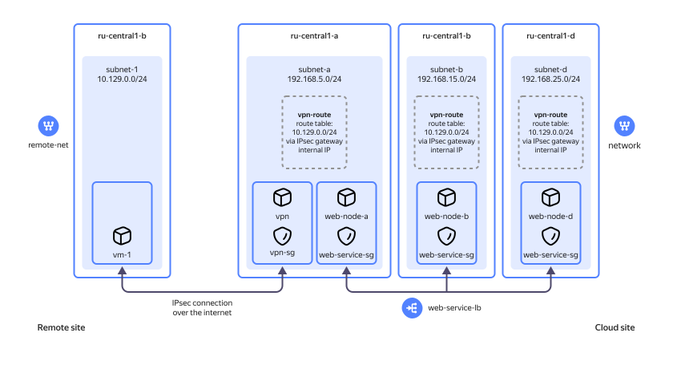

# Architecture and protection of a basic internet service


In this tutorial, you will set up a basic web service infrastructure consisting of multiple VMs and accessible from the internet. You will use [security groups](../../vpc/concepts/security-groups.md) to restrict access to the VMs and a [network load balancer](../../network-load-balancer/concepts/index.md) to distribute traffic across web servers. 

The diagram below shows how a remote site communicates with your web service:



Remote site:

* `remote-net` network with `subnet-1` (`10.129.0.0/24`).
* `vm-1` Ubuntu VM residing in `subnet-1` and used to test your cloud infrastructure.



You can also use your PC as the remote site. To do this, you need to know your public IP address and your subnet CIDR.



Cloud site:

* `network` with the following subnets: `subnet-a` (`192.168.5.0/24`), `subnet-b` (`192.168.15.0/24`), and `subnet-d` (`192.168.25.0/24`).
* `vpn` IPsec gateway residing in `subnet-a` to provide an IPsec connection to a remote site and network connectivity between cloud VMs.
* Route table containing static `vpn-route` directing `subnet-1` traffic through the IPsec gateway to the cloud VMs.
* `web-node-a`, `web-node-b`, and `web-node-d` Drupal internet service VMs residing in `subnet-a`, `subnet-b`, and `subnet-d`, respectively.
* `vpn-sg` security group managing traffic between `vpn` and the remote site and `web-service-sg` security group managing traffic between `web-node-a`, `web-node-b`, and `web-node-d`. 
* `web-service-lb` load balancer distributing incoming traffic across `web-node-a`, `web-node-b`, and `web-node-d`.

To create a web service infrastructure:

1. [Get your cloud ready](#before-begin).
1. [Set up your remote site](#remote-setup).
1. [Set up your cloud site](#cloud-setup).
1. [Test the solution](#test).

If you no longer need the resources you created, [delete](#clear-out) them.

## Get your cloud ready {#before-begin}



### Required paid resources {#paid-resources}

The cost of the web service infrastructure support includes:

* Fee for continuously running virtual machines (see [{{ compute-full-name }} pricing](../../compute/pricing.md)).
* Fee for public static IP addresses (see [{{ vpc-full-name }} pricing](../../vpc/pricing.md)).
* Fee for using a network load balancer (see [{{ network-load-balancer-full-name }} pricing](../../network-load-balancer/pricing.md)).

## Set up your remote site {#remote-setup}

In this step, you will set up your remote site infrastructure, including a network, a subnet, and a VM you will use to access the web service.



You can use your PC as the remote site. To do this, you need to know your public IP address and your subnet CIDR.

If you are going to use your PC as the remote site, you can skip this section and go to [Set up your cloud site](#cloud-setup).



### Create a network with a subnet {#remote-net}

1. Create the `remote-net` [network](../../vpc/operations/network-create.md) with the **{{ ui-key.yacloud.vpc.networks.create.field_is-default }}** option disabled.
1. [Create a subnet](../../vpc/operations/subnet-create.md) for your remote site test VM, configuring it as follows:

    * **{{ ui-key.yacloud.vpc.subnetworks.create.field_name }}**: `subnet-1`.
    * **{{ ui-key.yacloud.vpc.subnetworks.create.field_zone }}**: `{{ region-id }}-b`.
    * **{{ ui-key.yacloud.vpc.subnetworks.create.field_network }}**: `remote-net`.
    * **{{ ui-key.yacloud.vpc.subnetworks.create.field_ip }}**: `10.129.0.0/24`.

### Create a test VM {#remote-test-vm}

Create a VM you will use to test whether your web service is accessible from the internet.



- Management console {#console}

    1. In the [management console]({{ link-console-main }}), select the [folder](../../resource-manager/concepts/resources-hierarchy.md#folder) where you want to create your VM.
    1. In the list of services, select **{{ ui-key.yacloud.iam.folder.dashboard.label_compute }}**.
    1. In the left-hand panel, select  **{{ ui-key.yacloud.compute.instances_jsoza }}**.
    1. Click **{{ ui-key.yacloud.compute.instances.button_create }}**.
    1. Under **{{ ui-key.yacloud.compute.instances.create.section_image }}**, select [Ubuntu 22.04 LTS OS Login](/marketplace/products/yc/ubuntu-2204-lts-oslogin).
    1. Under **{{ ui-key.yacloud.k8s.node-groups.create.section_allocation-policy }}**, select the `{{ region-id }}-b` [availability zone](../../overview/concepts/geo-scope.md).
    1. Under **{{ ui-key.yacloud.compute.instances.create.section_network }}**:

        * In the **{{ ui-key.yacloud.component.compute.network-select.field_subnetwork }}** field, select `subnet-1`. 
        * In the **{{ ui-key.yacloud.component.compute.network-select.field_external }}** field, select `{{ ui-key.yacloud.component.compute.network-select.switch_auto }}`.
    1. Under **{{ ui-key.yacloud.compute.instances.create.section_access }}**, select **{{ ui-key.yacloud.compute.instance.access-method.field_os-login-access-method }}** to [connect](../../compute/operations/vm-connect/os-login.md) to your VM and manage its access using {{ org-full-name }} [{{ oslogin }}](../../organization/concepts/os-login.md).

        With {{ oslogin }}, you can connect to VMs with SSH keys and certificates via a standard SSH client or [CLI](../../cli/quickstart.md). {{ oslogin }} also enables you to rotate these SSH keys ensuring better [security](../../security/domains/iaas-checklist.md#vm-security).

    1. Under **{{ ui-key.yacloud.compute.instances.create.section_base }}**, specify the VM name: `vm-1`.
    1. Click **{{ ui-key.yacloud.compute.instances.create.button_create }}**.
    1. Get the new VM public IP address:

        1. Once the `vm-1` status changes to `Running`, click its name.
        1. In the VM overview page that opens, copy **{{ ui-key.yacloud.compute.instance.overview.label_public-ipv4 }}** under **{{ ui-key.yacloud.compute.instance.overview.label_network-interface }}**.

            Save the copied IP address as you will need it later when [creating a security group](#create-vpn-sg).



## Set up your cloud site {#cloud-setup}

### Set up a cloud network {#setup-cloud-net}



- Management console {#console}

  1. In the [management console]({{ link-console-main }}), navigate to the folder where you want to deploy your infrastructure.
  1. In the list of services, select **{{ vpc-name }}**.
  1. [Create a cloud network](../../vpc/operations/network-create.md) named `network` with the **{{ ui-key.yacloud.vpc.networks.create.field_is-default }}** option disabled.
  1. In `network`, [create subnets](../../vpc/operations/subnet-create.md) with the following settings:
  
      1. Subnet hosting the `web-node-a` VM and the `vpn` IPSec gateway:
          * **{{ ui-key.yacloud.vpc.subnetworks.create.field_name }}**: `subnet-a`.
          * **{{ ui-key.yacloud.vpc.subnetworks.create.field_zone }}**: `{{ region-id }}-a`.
          * **{{ ui-key.yacloud.vpc.subnetworks.create.field_network }}**: `network`.
          * **{{ ui-key.yacloud.vpc.subnetworks.create.field_ip }}**: `192.168.5.0/24`.
  
      1. Subnet hosting the `web-node-b` VM:
          * **{{ ui-key.yacloud.vpc.subnetworks.create.field_name }}**: `subnet-b`.
          * **{{ ui-key.yacloud.vpc.subnetworks.create.field_zone }}**: `{{ region-id }}-b`.
          * **{{ ui-key.yacloud.vpc.subnetworks.create.field_network }}**: `network`.
          * **{{ ui-key.yacloud.vpc.subnetworks.create.field_ip }}**: `192.168.15.0/24`.
  
      1. Subnet hosting the `web-node-d` VM:
          * **{{ ui-key.yacloud.vpc.subnetworks.create.field_name }}**: `subnet-d`.
          * **{{ ui-key.yacloud.vpc.subnetworks.create.field_zone }}**: `{{ region-id }}-d`.
          * **{{ ui-key.yacloud.vpc.subnetworks.create.field_network }}**: `network`.
          * **{{ ui-key.yacloud.vpc.subnetworks.create.field_ip }}**: `192.168.25.0/24`.



### Reserve two static public IP addresses {#reserve-ips}

You will need two static public IP addresses: one for your VPN gateway and another for the network load balancer.



- Management console {#console}

    1. In the [management console]({{ link-console-main }}), navigate to the folder where you will reserve your IP addresses.
    1. In the list of services, select **{{ ui-key.yacloud.iam.folder.dashboard.label_vpc }}**.
    1. In the left-hand panel, select  **{{ ui-key.yacloud.vpc.switch_addresses }}**.
    1. Click **{{ ui-key.yacloud.vpc.addresses.button_create }}**.
    1. In the window that opens, select the `{{ region-id }}-a` availability zone and click **{{ ui-key.yacloud.vpc.addresses.popup-create_button_create }}**.
    1. Repeat steps 4 and 5 and reserve the second IP address in the `{{ region-id }}-b` availability zone.



### Create and configure security groups {#create-security-group}

To isolate traffic between network segments, create security groups with rules for inbound and outbound traffic.

#### Create a VPN gateway security group {#create-vpn-sg}

You need to allow inbound and outbound internet traffic on UDP ports `500` and `4500` used by the IPsec VPN. You also need to allow traffic between the subnets of your virtual network and the remote site network.



- Management console {#console}

    1. In the [management console]({{ link-console-main }}), navigate to the folder where you want to create a security group. 
    1. In the list of services, select **{{ ui-key.yacloud.iam.folder.dashboard.label_vpc }}**.
    1. In the left-hand panel, select  **{{ ui-key.yacloud.vpc.label_security-groups }}**.
    1. Click **{{ ui-key.yacloud.vpc.network.security-groups.button_create }}**.
    1. Specify the security group name: `vpn-sg`.
    1. In the **{{ ui-key.yacloud.vpc.network.security-groups.forms.field_sg-network }}** field, select `network`.
    1. Under **{{ ui-key.yacloud.vpc.network.security-groups.forms.label_section-rules }}**, [create](../../vpc/operations/security-group-add-rule.md) rules from the table below:

       #|
       || **Traffic<br/>direction** | **{{ ui-key.yacloud.vpc.network.security-groups.forms.field_sg-rule-description }}** | **{{ ui-key.yacloud.vpc.network.security-groups.forms.field_sg-rule-port-range }}** | **{{ ui-key.yacloud.vpc.network.security-groups.forms.field_sg-rule-protocol }}** | **{{ ui-key.yacloud.vpc.network.security-groups.forms.field_sg-rule-source }} /<br/>{{ ui-key.yacloud.vpc.network.security-groups.forms.field_sg-rule-destination }}** | **{{ ui-key.yacloud.vpc.network.security-groups.forms.field_sg-rule-cidr-blocks }}** ||
       || Inbound | `udp500` | `500` | `{{ ui-key.yacloud.common.label_udp }}` | `{{ ui-key.yacloud.vpc.network.security-groups.forms.value_sg-rule-destination-cidr }}` | `<remote_VM_public_IP_address>/32` ||
       || Inbound | `udp4500` | `4500` | `{{ ui-key.yacloud.common.label_udp }}` | `{{ ui-key.yacloud.vpc.network.security-groups.forms.value_sg-rule-destination-cidr }}` | `<remote_VM_public_IP_address>/32` ||
       || Inbound | `internal` | `0-65535` | `{{ ui-key.yacloud.vpc.network.security-groups.forms.value_any }}` | `{{ ui-key.yacloud.vpc.network.security-groups.forms.value_sg-rule-destination-cidr }}` | 
         * `192.168.5.0/24`
         * `192.168.15.0/24`
         * `192.168.25.0/24`
         * `10.129.0.0/24` ^1^ ||
       || Outbound | `udp500` | `500` | `{{ ui-key.yacloud.common.label_udp }}` | `{{ ui-key.yacloud.vpc.network.security-groups.forms.value_sg-rule-destination-cidr }}` | `<remote_VM_public_IP_address>/32` ||
       || Outbound | `udp4500` | `4500` | `{{ ui-key.yacloud.common.label_udp }}` | `{{ ui-key.yacloud.vpc.network.security-groups.forms.value_sg-rule-destination-cidr }}` | `<remote_VM_public_IP_address>/32` ||
       || Outbound | `intersubnet` | `0-65535` | `{{ ui-key.yacloud.vpc.network.security-groups.forms.value_any }}` | `{{ ui-key.yacloud.vpc.network.security-groups.forms.value_sg-rule-destination-cidr }}` | 
         * `192.168.5.0/24`
         * `192.168.15.0/24`
         * `192.168.25.0/24`
         * `10.129.0.0/24` ^1^ ||
       |#

       ^1^ If you are using your local PC as the test VM, specify your home subnet CIDR here.

    1. Click **{{ ui-key.yacloud.common.create }}**.



#### Create a security group for your web service VMs {#create-service-sg}



- Management console {#console}
  
    1. In the [management console]({{ link-console-main }}), navigate to the folder where you want to create a security group. 
    1. In the list of services, select **{{ ui-key.yacloud.iam.folder.dashboard.label_vpc }}**.
    1. In the left-hand panel, select  **{{ ui-key.yacloud.vpc.label_security-groups }}**.
    1. Click **{{ ui-key.yacloud.vpc.network.security-groups.button_create }}**.
    1. Specify the security group name: `web-service-sg`.
    1. In the **{{ ui-key.yacloud.vpc.network.security-groups.forms.field_sg-network }}** field, select `network`.
    1. Under **{{ ui-key.yacloud.vpc.network.security-groups.forms.label_section-rules }}**, [create](../../vpc/operations/security-group-add-rule.md) rules from the table below:
   
       #|
       || **Traffic<br/>direction** | **{{ ui-key.yacloud.vpc.network.security-groups.forms.field_sg-rule-description }}** | **{{ ui-key.yacloud.vpc.network.security-groups.forms.field_sg-rule-port-range }}** | **{{ ui-key.yacloud.vpc.network.security-groups.forms.field_sg-rule-protocol }}** | **{{ ui-key.yacloud.vpc.network.security-groups.forms.field_sg-rule-source }} /<br/>{{ ui-key.yacloud.vpc.network.security-groups.forms.field_sg-rule-destination }}** | **{{ ui-key.yacloud.vpc.network.security-groups.forms.field_sg-rule-cidr-blocks }}** /<br/>**{{ ui-key.yacloud.vpc.network.security-groups.forms.field_sg-rule-sg-type }}** ||
       || Inbound | `ssh` | `22` | `{{ ui-key.yacloud.common.label_tcp }}` | `{{ ui-key.yacloud.vpc.network.security-groups.forms.value_sg-rule-destination-cidr }}` | `0.0.0.0/0` ||
       || Inbound | `anyself` | `0-65535` | `{{ ui-key.yacloud.vpc.network.security-groups.forms.value_any }}` | `{{ ui-key.yacloud.vpc.network.security-groups.forms.value_sg-rule-destination-sg }}` | `{{ ui-key.yacloud.vpc.network.security-groups.forms.value_sg-rule-sg-type-self }}` ||
       || Inbound | `healthchecks` | `80` | `{{ ui-key.yacloud.common.label_tcp }}` | `{{ ui-key.yacloud.vpc.network.security-groups.forms.value_sg-rule-sg-type-balancer }}` | — ||
       || Outbound | `self` | `0-65535` | `{{ ui-key.yacloud.vpc.network.security-groups.forms.value_any }}` | `{{ ui-key.yacloud.vpc.network.security-groups.forms.value_sg-rule-destination-sg }}` | `{{ ui-key.yacloud.vpc.network.security-groups.forms.value_sg-rule-sg-type-self }}` ||
       |#

    1. Click **{{ ui-key.yacloud.common.create }}**.



### Create and configure your cloud VMs {#setup-cloud-vms}

#### Create web service VMs in all availability zones {#create-vms}



- Management console {#console}

    1. In the [management console]({{ link-console-main }}), select the folder where you want to create your VMs.
    1. In the list of services, select **{{ ui-key.yacloud.iam.folder.dashboard.label_compute }}**.
    1. In the left-hand panel, select  **{{ ui-key.yacloud.compute.instances_jsoza }}**.
    1. Click **{{ ui-key.yacloud.compute.instances.button_create }}**.
    1. Under **{{ ui-key.yacloud.compute.instances.create.section_image }}**, navigate to the **{{ ui-key.yacloud.compute.instances.create.image_value_marketplace }}** tab and select [Drupal 10](/marketplace/products/yc/drupal-8).
    1. Under **{{ ui-key.yacloud.k8s.node-groups.create.section_allocation-policy }}**, select the `{{ region-id }}-a` availability zone.
    1. Under **{{ ui-key.yacloud.compute.instances.create.section_network }}**:

       * Select `subnet-a`. 
       * In the **{{ ui-key.yacloud.component.compute.network-select.field_external }}** field, select `{{ ui-key.yacloud.component.compute.network-select.switch_none }}`.
       * Select the `web-service-sg` security group.
    1. Under **{{ ui-key.yacloud.compute.instances.create.section_access }}**:

        * Select the **SSH key** connection option.
        * In the **{{ ui-key.yacloud.compute.instances.create.field_user }}** field, set a username.

            

            Do not use `root` or other reserved usernames. To perform operations requiring root privileges, use the `sudo` command.

            

        * In the **{{ ui-key.yacloud.compute.instances.create.field_key }}** field, select the SSH key saved in your [organization user](../../organization/concepts/membership.md) profile.

            If there are no SSH keys in your profile or you want to add a new key:
            * Click **Add key**.
            * Enter a name for the SSH key.
            * Upload or paste the contents of the public key file. You need to [create](../../compute/operations/vm-connect/ssh.md#creating-ssh-keys) a key pair for the SSH connection to a VM on your own.
            * Select an expiration date for the key.
            * Click **{{ ui-key.yacloud.common.add }}**.

            The system will add the SSH key to your organization user profile.

            If, due to organization restrictions, you cannot add SSH keys to your organization user profile, the system will only save it to the new VM user profile.
       
    1. Under **{{ ui-key.yacloud.compute.instances.create.section_base }}**, specify the VM name: `web-node-a`.
    1. Click **{{ ui-key.yacloud.compute.instances.create.button_create }}**.
    1. Repeat steps 4 through 10 to create the `web-node-b` and `web-node-d` VMs in the `{{ region-id }}-b` and `{{ region-id }}-d` availability zones and `subnet-b` and `subnet-d` subnets, respectively.



#### Create an IPSec remote access gateway {#create-ipsec-instance}

Create an IPSec gateway to provide secure access to your cloud resources.



- Management console {#console}

    1. In the [management console]({{ link-console-main }}), navigate to the folder where you want to create your VM.
    1. In the list of services, select **{{ ui-key.yacloud.iam.folder.dashboard.label_compute }}**.
    1. In the left-hand panel, select  **{{ ui-key.yacloud.compute.instances_jsoza }}**.
    1. Click **{{ ui-key.yacloud.compute.instances.button_create }}**.
    1. Under **{{ ui-key.yacloud.compute.instances.create.section_image }}**, navigate to the **{{ ui-key.yacloud.compute.instances.create.image_value_marketplace }}** tab and select the [IPSec instance](/marketplace/products/yc/ipsec-instance-ubuntu).
    1. Under **{{ ui-key.yacloud.k8s.node-groups.create.section_allocation-policy }}**, select the `{{ region-id }}-a` availability zone.
    1. Under **{{ ui-key.yacloud.compute.instances.create.section_network }}**:

        * Select `subnet-a`.
        * In the **{{ ui-key.yacloud.component.compute.network-select.field_external }}** field, select `{{ ui-key.yacloud.component.compute.network-select.switch_list }}` and then select the previously reserved IP address from the list that opens.
        * Select the `vpn-sg` security group.

    1. Under **{{ ui-key.yacloud.compute.instances.create.section_access }}**, select **{{ ui-key.yacloud.compute.instance.access-method.label_oslogin-control-ssh-option-title }}** and specify the VM access credentials:

        * Under **{{ ui-key.yacloud.compute.instances.create.field_user }}**, enter the username. Do not use `root` or other reserved usernames. To perform operations requiring root privileges, use the `sudo` command.
        * 

    1. Under **{{ ui-key.yacloud.compute.instances.create.section_base }}**, specify the VM name: `vpn`.
    1. Click **{{ ui-key.yacloud.compute.instances.create.button_create }}**.
    1. Once the `vpn` VM status changes to `Running`, click its name. In the VM overview page that opens, copy **{{ ui-key.yacloud.compute.instances.column_internal-ip }}** of your VM.
    
        Save the copied internal gateway address as you will need it when configuring a static route.



### Configure VPN routing {#vpn-routing}

Configure routing between your remote site subnet and IPSec gateway.

#### Create a route table {#create-route-table}

Create a [route table](../../vpc/concepts/routing.md#rt-vpc) and add [static routes](../../vpc/concepts/routing.md#static):



- Management console {#console}

    1. In the [management console]({{ link-console-main }}), navigate to your cloud network folder.
    1. In the list of services, select **{{ ui-key.yacloud.iam.folder.dashboard.label_vpc }}**.
    1. Select `network`.
    1. In the left-hand panel, select  **{{ ui-key.yacloud.vpc.network.switch_route-table }}**.
    1. Click **{{ ui-key.yacloud.vpc.network.overview.button_create_route-table }}**.
    1. Specify the route table name: `vpn-route`.
    1. Under **{{ ui-key.yacloud.vpc.route-table-form.section_static-routes }}**, click **{{ ui-key.yacloud.vpc.route-table-form.label_add-static-route }}**.
    1. In the window that opens:
       * In the **{{ ui-key.yacloud.vpc.add-static-route.field_destination-prefix }}** field, enter `10.129.0.0/24`.

           If you are using your local PC as the test VM, specify your home subnet CIDR.
       * In the **{{ ui-key.yacloud.vpc.add-static-route.field_next-hop-address }}** field, specify the IPSec gateway internal IP address you saved previously.
       * Click **{{ ui-key.yacloud.vpc.add-static-route.button_add }}**.
    1. Click **{{ ui-key.yacloud.vpc.route-table.create.button_create }}**.



#### Link the route table to all subnets {#associate-route-table}

To make static routes available in your cloud `network`, link the route table to all its subnets.



- Management console {#console}

    1. In the [management console]({{ link-console-main }}), navigate to your cloud network folder.
    1. In the list of services, select **{{ ui-key.yacloud.iam.folder.dashboard.label_vpc }}**.
    1. In the left-hand panel, select  **{{ ui-key.yacloud.vpc.switch_networks }}**.
    1. Click  next to `subnet-a` and select **{{ ui-key.yacloud.vpc.subnetworks.button_action-add-route-table }}**.
    1. In the window that opens, select the `vpn-route` table in the **{{ ui-key.yacloud.vpc.subnet.add-route-table.field_route-table-id }}** field.
    1. Click **{{ ui-key.yacloud.vpc.subnet.add-route-table.button_add }}**.
    1. Repeat steps 4 through 6 to link the `vpn-route` route table to `subnet-b` and `subnet-d`.



### Create a network load balancer {#create-load-balancer}

The network load balancer will distribute incoming traffic across your web service VMs in the target group. 

To create a network load balancer:



- Management console {#console}

  1. In the [management console]({{ link-console-main }}), navigate to the folder where you want to create a load balancer.
  1. In the list of services, select **{{ ui-key.yacloud.iam.folder.dashboard.label_load-balancer }}**.
  1. Click **{{ ui-key.yacloud.load-balancer.network-load-balancer.button_create }}**.
  1. Specify the load balancer name: `web-service-lb`.
  1. In the **{{ ui-key.yacloud.load-balancer.network-load-balancer.form.label_address-type }}** field, select `{{ ui-key.yacloud.common.label_list }}` and then select the previously reserved public IP address from the list that opens.
  1. Under **{{ ui-key.yacloud.load-balancer.network-load-balancer.form.section_listeners }}**, click **{{ ui-key.yacloud.load-balancer.network-load-balancer.form.label_add-listener }}**. In the window that opens:

      1. Specify the listener name: `web-service-lb-listener`.
      1. In the **{{ ui-key.yacloud.load-balancer.network-load-balancer.form.field_listener-port }}** field, specify `80`.
      1. In the **{{ ui-key.yacloud.load-balancer.network-load-balancer.form.field_listener-target-port }}** field, specify `80`.
      1. Click **{{ ui-key.yacloud.common.add }}**.
  1. Under **{{ ui-key.yacloud.load-balancer.network-load-balancer.form.section_target-groups }}**, click **{{ ui-key.yacloud.load-balancer.network-load-balancer.form.label_add-target-group }}**.

      1. In the **{{ ui-key.yacloud.load-balancer.network-load-balancer.form.label_target-group-id }}** field, select  **{{ ui-key.yacloud.load-balancer.network-load-balancer.form.button_create-target-group }}**. In the window that opens:

          1. Specify the target group name: `web-tg`.
          1. Select the `web-node-a`, `web-node-b`, and `web-node-d` VMs.
          1. Click **{{ ui-key.yacloud.common.create }}**.
      1. Select the `web-tg` target group.
  1. In the selected target group section:

      1. Click **{{ ui-key.yacloud.load-balancer.network-load-balancer.form.label_edit-health-check }}**.
      1. In the window that opens, select `{{ ui-key.yacloud.common.label_tcp }}` in the **{{ ui-key.yacloud.load-balancer.network-load-balancer.label_health-check-protocol }}** field and click **{{ ui-key.yacloud.common.apply }}**.
  1. Click **{{ ui-key.yacloud.common.create }}**.



## Test the solution {#test}

Check that your infrastructure works properly and your internet service VMs do not receive any external traffic:

1. Run the following command on your remote site VM:

    ```bash
    curl <public_IP_address_of_network_load_balancer>
    ```
    
    You should get no response because the system blocks traffic to your Drupal servers.
1. [Add](../../vpc/operations/security-group-add-rule.md) two new inbound traffic rules to the `web-service-sg` security group:

   #|
   || **{{ ui-key.yacloud.vpc.network.security-groups.forms.field_sg-rule-description }}** | **{{ ui-key.yacloud.vpc.network.security-groups.forms.field_sg-rule-port-range }}** | **{{ ui-key.yacloud.vpc.network.security-groups.forms.field_sg-rule-protocol }}** | **{{ ui-key.yacloud.vpc.network.security-groups.forms.field_sg-rule-source }} /<br/>{{ ui-key.yacloud.vpc.network.security-groups.forms.field_sg-rule-destination }}** | **{{ ui-key.yacloud.vpc.network.security-groups.forms.field_sg-rule-cidr-blocks }}** ||
   || http-external-vm | 80 | TCP | CIDR | `<remote_VM_public_IP_address>/32` ||
   || https-external-vm | 443 | TCP | CIDR | `<remote_VM_public_IP_address>/32` ||
   |#

   These rules allow access to the network load balancer’s target group instances from your remote VM public IP address.

1. Run this command on your remote VM again:

    ```bash
    curl <public_IP_address_of_network_load_balancer>
    ```

    You should see the Drupal home page HTML code, which means the system successfully applied the rules allowing network access to the Drupal VMs from your remote VM.

## How to delete the resources you created {#clear-out}

To stop paying for the resources you created:
1. [Delete](../../compute/operations/vm-control/vm-delete.md) the VMs.
1. [Delete](../../network-load-balancer/operations/load-balancer-delete.md) the network load balancer.
1. [Delete](../../vpc/operations/address-delete.md) the static public IP addresses you reserved.
1. You can also delete the [route table](../../vpc/operations/delete-route-table.md), [security groups](../../vpc/operations/security-group-delete.md), [subnets](../../vpc/operations/subnet-delete.md), and [networks](../../vpc/operations/network-delete.md).