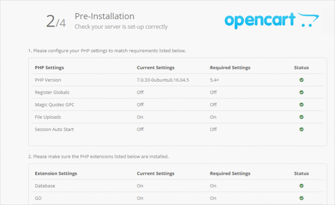
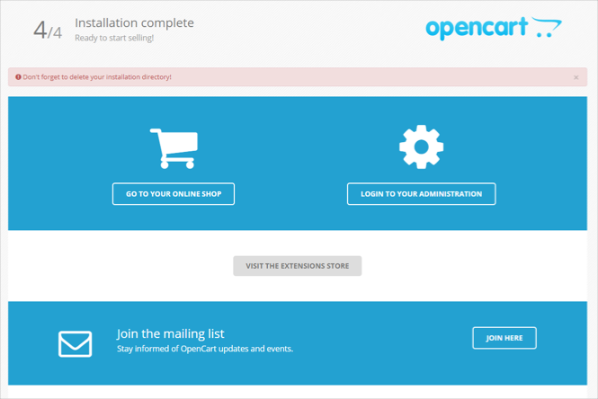

# OpenCart online shop

[OpenCart](https://en.wikipedia.org/wiki/OpenCart) is a platform where you can create your own online store. The platform is free and open-source. With OpenCart, you can create an online store of any complexity using a wide selection of community-supported extensions.

In this guide, you create and configure an online store built on OpenCart. To do this, you deploy a VM with the pre-installed OpenCart platform and the programs it needs to run, specifically the {{ MY }} server.

This scenario describes how to configure a local {{ MY }} server and deploy a {{ mmy-name }} database cluster if your local DBMS doesn't offer high enough performance or functionality. If you don't need a cluster, skip this step.

To set up your online store on OpenCart:

1. [Before you start](#before-you-begin)
1. [Create a VM with the OpenCart platform](#create-vm)
1. [(optional) Create a MySQL DB cluster](#create-mysql)
1. [Configure OpenCart](#configure-opencart)

## Before you start {#before-you-begin}





### Required paid resources

The infrastructure support cost for OpenCart includes:

* A fee for a continuously running VM (see [{{ compute-full-name }} pricing](../../compute/pricing.md)).
* A fee for using a dynamic or static external IP address (see [{{ vpc-full-name }} pricing](../../vpc/pricing.md)).
* If you plan to set up a managed database, the fee also includes the DB cluster fee (see [{{ mmy-name }} pricing](../../managed-mysql/pricing.md)).



## Create a VM with the OpenCart platform {#create-vm}

To create a VM:

1. On the folder page in the [management console]({{ link-console-main }}), click **Create resource**, and select **Virtual machine**.

1. In the **Name** field, enter a name for the VM, such as `opencart`.

   

1. Select the [availability zone](../../overview/concepts/geo-scope.md) to host the VM in.

1. Under **Image/boot disk selection**, click the **{{ marketplace-name }}** tab, and select the public [OpenCart](/marketplace/products/yc/opencart-3) image.

   The OpenCart platform and the necessary components, including PHP and MySQL, are pre-installed on the boot disk.

1. Under **Disks**, select an SSD with 13 GB.

1. Under **Computing resources**, specify the following configuration:
   * **Platform**: Intel Ice Lake.
   * **Guaranteed vCPU share**: 20%.
   * **vCPU**: 2.
   * **RAM**: 4 GB.

1. Under **Network settings**:
   - Select the network and subnet to connect the VM to. If you don't have a network or subnet yet, you can create them on the VM creation page: click **Create new network** or **Create new subnet**.
   - In the **Public address** field, leave the **Auto** value to assign a random external IP address from the {{ yandex-cloud }} pool, or select a static address from the list if you reserved one in advance.

1. Under **Access**, specify the information required to access the VM:
   - In the **Login** field, enter your preferred username to be created on the VM, for example, `ubuntu`.
   - In the **SSH key** field, paste your public SSH key. You need to create a key pair for the SSH connection yourself. Learn [how to connect to VMs via SSH](../../compute/operations/vm-connect/ssh.md).

1. Click **Create VM**.

## Create the database cluster {{ MY }} {#create-mysql}

If you expect a significant load on the database or would like to use a managed DBMS service, deploy the DB cluster using {{ mmy-name }}. The service takes control of DBMS support and maintenance. In other words, it monitors the status and current activity and enables automatic backup and easily configurable fault tolerance functionality.

To create a database cluster:

1. On the folder page in the [management console]({{ link-console-main }}), click **Create resource** and select **MySQL cluster**.

1. Specify a name for the cluster, such as `opencart`.

1. Under **Host class**, select **s2.micro**. These characteristics are enough for the system to run under a normal workload.

1. Under **Database**, enter:
   - **DB name**: Leave the default value, `db1`.
   - **Username** to connect to the database: Leave the default value, `user1`.
   - **Password** for OpenCart to use to access the {{ MY }} database.

1. Under **Hosts**, change the **Availability zone** for the database. To do this, click  to the right of the currently selected availability zone, and select the availability zone from the drop-down list.

   

   We recommend selecting the same availability zone as when you created the VM. This reduces latency between the VM and database.

   

1. (optional) If you want to ensure fault tolerance for the database, add additional hosts to the cluster by clicking **Add host** and specify the availability zone for the host.

1. Leave the other fields as they are.

1. Click **Create cluster**.

Creating the DB cluster may take several minutes.

## Configure OpenCart {#configure-opencart}

1. Open the web interface of the OpenCart online store. To do this, open the address `http://<VM-public-IP-address>/` in the browser. The OpenCart settings page opens.

1. Read the license and click **Continue**.

   

1. Make sure that all the lines with system requirements are marked green and click **Continue**.

   

1. Configure database access:

   

   - Local server {{ MY }}

     DB connection attributes are generated in a special file when a VM is created:
     1. Log in to the created VM via SSH.
     1. Switch to `sudo -i` administration mode.
     1. Open `default_passwords.txt` in the admin's home directory:

        ```bash
        root@opencart:~# cat default_passwords.txt
        MYSQL_USER=opencart
        MYSQL_PASS=qDbvN1R6tA6ET
        MYSQL_ROOT_PASS=5DiVb80l1kXVz
        MYSQL_DB=opencart
        ```
     1. In the OpenCart settings page database section, enter the relevant data:
        - **Username**: The `MYSQL_USER` variable value.
        - **Database**: The `MYSQL_DB` variable value.
        - **Password**: The `MYSQL_PASS` variable value.
     Leave the other fields as they are.

   - Cluster {{ mmy-name }}

     If you're using a {{ mmy-name }} cluster, enter the required cluster attributes:
       - **Hostname**: Enter the Fully Qualified Domain Name (FQDN) of the created database. To find it:
         1. Open the [management console]({{ link-console-main }}) folder page in a new browser tab.
         1. Go to the section **{{ mmy-name }}**.
         1. Select the cluster you created in the table.
         1. Select the **Hosts** tab in the left menu.
         1. Move the cursor to the **Hostname** field (for example, `rc1c-vok617m35g3dj23i`) and copy the full database domain name by clicking the icon  that appears.
       - **Username**: The username (`user1` in the example).
       - **Database**: The DB name (`db1` in the example).
       - **Password**: The user password you specified.
     Leave the other fields as they are.

   

1. Enter the administrator's name, their password, and current email address. Then click **Continue**.

   

1. A page opens notifying you that the system configuration is  complete. To set up the online store, click **Login to your administration** and enter your admin username and password.

   

1. When the installation is complete, log in to the VM via SSH and delete the installation files you don't need anymore:

   ```
   user@opencart:~$ sudo -i
   root@opencart:~# rm -rf /var/www/opencart/install/
   ```

1. To check the home page, go to `http://<VM-public-IP-address>/`. You see the home page of your website as users visiting your online store see it.

   

## How to delete created resources {#clear-out}

To stop paying for your deployed server, you need to delete your virtual machine and database cluster (if you created one):

  * [Delete the VM](../../compute/operations/vm-control/vm-delete.md) (in the example, the VM is named `opencart`).
  * [Delete the {{ mmy-name }}](../../managed-mysql/operations/cluster-delete.md) cluster (in the example, the DB cluster is named `opencart`).

If you reserved a static public IP address specifically for this VM:

1. Select the **{{ vpc-short-name }}** in your folder.
1. Go to the **IP addresses** tab.
1. Find the address you need, click , and select **Delete**.

