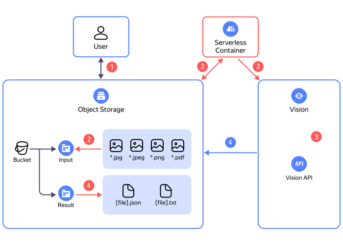

# Regular recognition of images and PDF documents from an {{ objstorage-short-name }} bucket

In this tutorial, you will use [{{ vision-full-name }}](../../vision/) to set up automatic recognition of [supported image formats](../../vision/concepts/ocr/index.md#image-requirements) and PDF documents regularly uploaded to a [{{ objstorage-full-name }}](../../storage/) [bucket](../../storage/concepts/bucket.md).


## Recognition process {#ocr}



1. The user uploads images or documents to the `input` directory ([prefix](../../storage/concepts/object.md#folder)) in a {{ objstorage-full-name }} bucket.
1. The [{{ sf-full-name }}](../../functions/) [trigger](../../functions/concepts/trigger/index.md) is launched by a timer and checks for files in the `input` folder. Next, the files are sent for recognition to the [{{ serverless-containers-full-name }}](../../serverless-containers/) [container](../../serverless-containers/concepts/container.md).
1. The file recognition process is in progress, the operation ID is saved in the `process` folder in the source bucket.
1. After the operation is successfully completed, the recognition results are saved in the `result` folder as JSON and TXT files. The ID of the successful operation is deleted from the `process` folder.

The infrastructure is created with the help of the [{{ yandex-cloud }} {{ TF }} provider]({{ tf-provider-link }}). For the source code discussed in the tutorial, visit [GitHub](https://github.com/yandex-cloud-examples/yc-vision-ocr-recognizer).

To set up automatic image recognition using {{ vision-name }}:
1. [Get your cloud ready](#before-you-begin).
1. [Create your infrastructure](#deploy).
1. [Upload the files for recognition and test {{ vision-name }}](#test).

If you no longer need the resources you created, [delete them](#clear-out).


## Get your cloud ready {#before-begin}




### Required paid resources {#paid-resources}

The cost of infrastructure support for regular image and document recognition includes:
* Fee for [bucket](../../storage/concepts/bucket.md) data storage and data [operations](../../storage/operations/index.md) (see [{{ objstorage-name }} pricing](../../storage/pricing.md)).
* Fee for using {{ vision-name }} (see [{{ vision-name }} pricing](../../vision/pricing.md)).
* Fee for the number of [container](../../serverless-containers/concepts/container.md) invocations, computing resources allocated for the application, and outbound traffic (see [{{ serverless-containers-name }} pricing](../../serverless-containers/pricing.md)).
* Fee for [secret](../../lockbox/concepts/secret.md) storage and operations (see [{{ lockbox-name }} pricing](../../lockbox/pricing.md)).


## Create your infrastructure {#deploy}



To create an infrastructure using {{ TF }}:
1. [Install {{ TF }}](../../tutorials/infrastructure-management/terraform-quickstart.md#install-terraform), [get the credentials](../../tutorials/infrastructure-management/terraform-quickstart.md#get-credentials), and specify the source for installing {{ yandex-cloud }} (see [{#T}](../../tutorials/infrastructure-management/terraform-quickstart.md#configure-provider), step 1).

1. Prepare your infrastructure description files:

    1. Clone the repository with configuration files.

        ```bash
        git clone https://github.com/yandex-cloud-examples/yc-vision-ocr-recognizer.git
        ```

    1. Go to the `terraform` directory inside the repository.

    1. In the `variables.auto.tfvars` file, set the following user-defined properties:
        * `cloud_id`: Cloud ID
        * `folder_id`: [Folder ID](../../resource-manager/operations/folder/get-id.md)
        * `zone`: Availability zone

1. Create the resources:

   

A bucket with a name in `ocr-recognition-...` format will be created.


## Upload the files for recognition and test {{ vision-name }} {#test}

1. [Upload](../../storage/operations/objects/upload.md) the files for recognition to the `input` folder inside the bucket you created earlier.
1. Open the `result` folder in the bucket. The folder should contain the recognition results in the form of .txt and .json files.


## How to delete the resources you created {#clear-out}

To stop paying for the resources you created:

1. Delete the files from the bucket.
1. Open the `main.tf` file and delete your infrastructure description from it.
1. Apply the changes:

    
