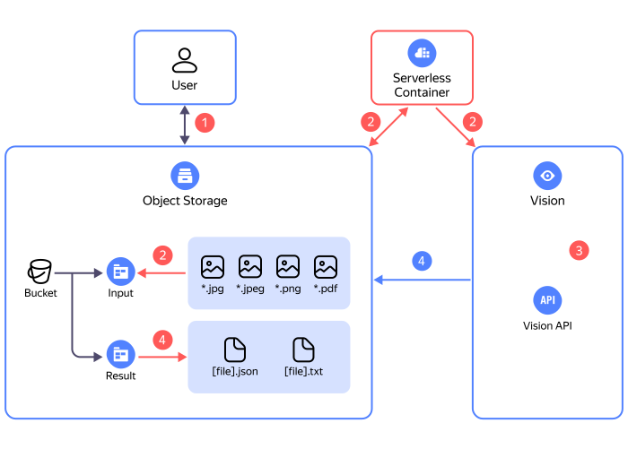

# Scheduled image and PDF recognition in an {{ objstorage-short-name }} bucket

In this tutorial, you will learn how to use [{{ vision-full-name }}]({{ link-docs-ai }}vision/concepts/ocr/index) to set up automatic recognition of new images (in [supported formats]({{ link-docs-ai }}vision/concepts/ocr/index#image-requirements)) and PDFs in an [bucket]({{ link-docs }}/storage/concepts/bucket).


## Recognition steps {#ocr}



1. The user uploads images or documents to the `input` directory ([prefix]({{ link-docs }}/storage/concepts/object#folder)) in a {{ objstorage-full-name }} bucket.
1. The [{{ sf-full-name }}]({{ link-docs }}/functions/) [trigger]({{ link-docs }}/functions/concepts/trigger/index), activated on schedule, checks for new files in the `input` folder. Next, the system sends files to the [{{ serverless-containers-full-name }}]({{ link-docs }}/serverless-containers/) [container]({{ link-docs }}/serverless-containers/concepts/container) for recognition.
1. During the recognition process, the operation ID is stored in the `process` folder of the source bucket.
1. Once the operation is completed, the recognition results are saved to the `result` folder as JSON and TXT files. The operation ID is deleted from the `process` folder.

The infrastructure is built using the [{{ yandex-cloud }} {{ TF }} provider]({{ tf-provider-link }}). The source code for this guide is available on [GitHub](https://github.com/yandex-cloud-examples/yc-vision-ocr-recognizer).

To set up automatic image recognition via {{ vision-name }}:
1. [Get your cloud ready](#before-you-begin).
1. [Create the infrastructure](#deploy).
1. [Upload files for recognition and check how the {{ vision-name }} service works](#test).

If you no longer need the resources you created, [delete them](#clear-out).


## Get your cloud ready {#before-begin}




### Required paid resources {#paid-resources}

The infrastructure support cost for scheduled image and document recognition includes:
* Fee for data storage in a bucket and data operations (see [{{ objstorage-name }} pricing]({{ link-docs }}/storage/pricing)).
* Fee for using {{ vision-name }} (see [{{ vision-name }} pricing]({{ link-docs-ai }}vision/pricing)).
* Fee for container invocation count, computing resources allocated to run the application, and outbound traffic (see [{{ serverless-containers-name }} pricing]({{ link-docs }}/serverless-containers/pricing)).
* Fee for storing the [secret]({{ link-docs }}/lockbox/concepts/secret) and operations with it (see [{{ lockbox-name }} pricing]({{ link-docs }}/lockbox/pricing)).


## Create the infrastructure {#deploy}



To create your infrastructure via {{ TF }}:
1. [Install {{ TF }}](../../tutorials/infrastructure-management/terraform-quickstart.md#install-terraform), [get the authentication credentials]({{ link-docs }}/tutorials/infrastructure-management/terraform-quickstart#get-credentials), and specify the source for installing the {{ yandex-cloud }} provider (see [{#T}](../../tutorials/infrastructure-management/terraform-quickstart.md#configure-provider), Step 1).

1. Prepare your infrastructure description files:

    1. Clone the repository containing the configuration files.

        ```bash
        git clone https://github.com/yandex-cloud-examples/yc-vision-ocr-recognizer.git
        ```

    1. Navigate to the `terraform` directory within the repository.

    1. In the `variables.auto.tfvars` file, specify these custom settings:
        * `cloud_id`: Cloud ID.
        * `folder_id`: [Folder ID](../../resource-manager/operations/folder/get-id.md).
        * `zone`: Availability zone.

1. Create the resources:

   

The system will create a bucket named `ocr-recognition-...`.


## Upload files for recognition and check how the {{ vision-name }} service works {#test}

1. [Upload](../../storage/operations/objects/upload.md) the files for recognition to the `input` folder inside the bucket you created earlier.
1. Open the `result` folder in your bucket. The folder should contain the recognition results as TXT and JSON files.


## How to delete the resources you created {#clear-out}

To stop incurring costs for the resources you created:

1. Delete all files from the bucket.
1. Open the `main.tf` configuration file and delete your infrastructure description from it.
1. Apply the changes:

    
