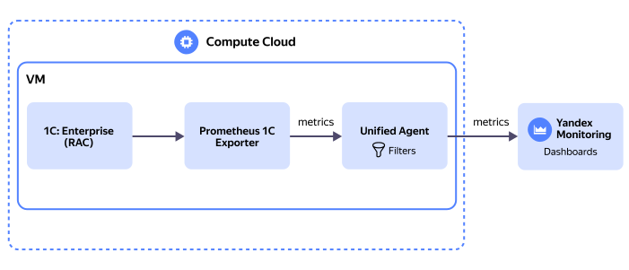

# Collecting 1C:Enterprise Linux cluster metrics

Follow this guide to configure collection of 1C:Enterprise Linux cluster metrics in {{ prometheus-name }} format and their visualization in [{{ monitoring-full-name }}](../../monitoring/concepts/visualization/metric-explorer.md). In addition to visualization, {{ monitoring-name }} allows you to set up alerts, create hybrid dashboards with metrics from various {{ yandex-cloud }} services and offers extensive scaling capabilities.

Cluster metrics will be collected using the freely distributed [{{ prometheus-name }} 1C Exporter](https://github.com/LazarenkoA/prometheus_1C_exporter) utility, transferred to [{{ unified-agent-full-name }}](../../monitoring/concepts/data-collection/unified-agent/index.md), and then to {{ monitoring-name }}.



To use this tutorial, you need to have a 1C:Enterprise cluster deployed on a [{{ compute-full-name }}](../../compute/quickstart/index.md) VM. For a deployment example, see [{#T}](../../tutorials/infrastructure-management/1c-postgresql-linux.md).

To get started with metrics in {{ monitoring-full-name }}:

1. [Install and configure {{ prometheus-name }} 1C Exporter](#configure-exporter).
1. [Install and configure {{ unified-agent-short-name }}](#configure-ua).
1. [Create a service account and link it to your VM](#sa-create).
1. [Make sure {{ monitoring-name }} receives the metrics](#check-metrics).
1. [Create a dashboard to monitor metrics](#dashboard-create).

If you no longer need the resources you created, [delete them](#clear-out).

## Required paid resources {#paid-resources}

Fee for sending metrics to {{ monitoring-name }} (see [{{ monitoring-name }} pricing](../../monitoring/pricing.md)).

## Install and configure {{ prometheus-name }} 1C Exporter {#configure-exporter}

1. Download {{ prometheus-name }} 1C Exporter to the 1C:Enterprise VM:

   ```bash
   wget https://github.com/LazarenkoA/prometheus_1C_exporter/releases/download/v1.5.0/prometheus_1C_exporter-linux-amd64
   ```
1. Rename the exporter and move it to the system folder:

   ```bash
   mv prometheus_1C_exporter-linux-amd64 exporter_1C
   sudo mv exporter_1C /usr/local/bin/exporter_1C
   ```
1. Make the file executable:

   ```bash
   sudo chmod +x /usr/local/bin/exporter_1C
   ```
1. Create a configuration file for the exporter:
   
   ```bash
   sudo mkdir /etc/exporter_1C/
   sudo vi /etc/exporter_1C/settings.yaml
   ```

1. Add the configuration below to the `settings.yaml` file and, if necessary, customize the list of metrics to collect.

   

   ```yaml
   # Metric values you can collect using the exporter:
   # ClientLic: Client licenses.
   # AvailablePerformance: Available performance (via RAC).
   # ScheduleJob: Checking the `Block scheduled jobs` option.
   # Session: Sessions.
   # Connect: Connections.
   # SessionsData: Various indicators from the 1C console (via RAC).
   # ProcData: Process data (collects Linux OS metrics).
   # CPU: Processor utilization.
   # disk: Disk metrics (currently only Linux and WeightedIO are supported).
   # Property: Additional parameters specific to each metric.
   # Processes: Additional ProcData parameter which defines the list of processes to monitor.
   
   # You can enable or disable any set of metrics for monitoring.
   Exporters:
   - Name: client_lic
   - Name: available_performance
   # - Name: processes
   # - Name: cpu
   # - Name: disk
   # - Name: shedule_job
   # - Name: session
   - Name: connect
   # - Name: sessions_data


   # HTTP service that returns a JSON array with database access parameters.
   # Required for the ScheduleJob metric.
   # JSON example:
   #[
   #  {
   #    "Name": "hrmcorp-n17", # 1C database name
   #    "UserName": "",
   #    "UserPass": ""
   #  }
   #]
   #DBCredentials: # This is a required parameter for the shedule_job metric.
   #  Address used by 1C to return a list of databases in JSON format:
   #  URL: http://ca-fr-web-1/fresh/int/sm/hs/PTG_SysExchange/GetDatabase
   #  User: ""
   #  Password: ""
   #  TLSSkipVerify: true # true: Ignore certificate verification errors when accessing the service.

   RAC:
   Path: "/usr/local/bin/rac"
   Port: "1545"      # This is an optional parameter.
   Host: "localhost" # This is an optional parameter.
   Login: ""         # This is an optional parameter.
   Pass: ""          # This is an optional parameter.

   LogDir:        # If the folder is not specified, logs will be written to the folder with the exporter’s executable file.
   LogLevel:  5   # Logging level: 2 (error), 3 (warning), 4 (information), 5 (debugging).
   ```
   

   This configuration enables sending the following metrics:

   * `available_performance`: Host’s available performance (Histogram).
   * `client_lic`: 1C client licenses (Histogram).
   * `connect`: 1C connections (Histogram).

   You can add [other metrics](https://github.com/LazarenkoA/prometheus_1C_exporter) if required.

1. Create a symbolic link for the 1C RAC management utility:

   ```bash
   sudo ln -s /opt/<1C_installation_path>/rac /usr/local/bin/rac
   ```

1. Create a unit file for systemd to manage the exporter:

   ```bash
   sudo vi /etc/systemd/system/exporter_1C.service
   ```

   
   ```
   [Unit]
   Description=Prometheus 1C exporter
   After=local-fs.target network-online.target network.target
   Wants=local-fs.target network-online.target network.target

   [Service]
   Type=simple
   ExecStart=/usr/local/bin/exporter_1C -port=9095 --settings=/etc/exporter_1C/settings.yaml
   ExecReload=/bin/kill -s HUP $MAINPID

   [Install]
   WantedBy=multi-user.target
   ```

   This configuration starts the exporter after the OS and network boot up. The exporter starts listening to port `9095` according to the parameters in `settings.yaml`.

   

1. Start the exporter:

   ```bash
   sudo systemctl daemon-reload
   sudo systemctl start exporter_1C.service
   sudo systemctl enable exporter_1C.service
   ```

1. Check the exporter status and make sure the service is `active (running)`.

   ```bash
   sudo systemctl status exporter_1C.service
   ```

After you start the exporter, metrics will be available at `curl http://localhost:9095/metrics`. To work with metrics in {{ monitoring-full-name }}, you need to install {{ unified-agent-short-name }} and configure it to receive metrics from this address and send them to {{ monitoring-name }}.

## Create a service account and link it to your VM {#sa-create}

You need a service account to send metrics from the VM to {{ monitoring-name }}.

1. [Create](../../iam/operations/sa/create.md) a service account named `sa-1c-monitoring` in the folder you want to write metrics to.
1. [Assign](../../iam/operations/roles/grant.md) the `monitoring.editor` [role](../../monitoring/security/index.md#monitoring.editor) to the service account.
1. [Link](../../compute/operations/vm-control/vm-connect-sa.md) the service account to the VM where 1C:Enterprise is installed.

## Install and configure {{ unified-agent-short-name }} {#configure-ua}

1. Download the latest deb package:

   ```bash
   ubuntu_name="<OS_version>" ua_version=$(curl --silent https://storage.yandexcloud.net/yc-unified-agent/latest-version) bash -c 'curl --silent --remote-name https://storage.yandexcloud.net/yc-unified-agent/releases/${ua_version}/deb/${ubuntu_name}/yandex-unified-agent_${ua_version}_amd64.deb'
   ```

1. Check the deb package version using the `ls` command.
   
1. Install {{ unified-agent-short-name }} from the deb package by specifying its version:

   ```bash
   sudo dpkg -i yandex-unified-agent_<agent_version>_amd64.deb
   ```
   
   You can find other installation methods in [{#T}](../../monitoring/concepts/data-collection/unified-agent/installation.md). 

1. Check that {{ unified-agent-short-name }} is running:

   ```bash
   sudo systemctl status unified-agent.service
   ```

1. Open the {{ unified-agent-short-name }} configuration file:
   
   ```bash
   sudo vi /etc/yandex/unified_agent/config.yml
   ```

1. Replace the file contents with the configuration below. Add the ID of the folder you want to send metrics to.

   
   ```yaml
   monitoring:
     port: 16300

   status:
   port: 16301

   channels:
   - name: yc_metrics_channel
      channel:
         output:
         plugin: yc_metrics
         config:
            folder_id: "<folder_ID>"
            iam:
               cloud_meta: {}
   - name: monitoring_1c
      channel:
         output:
         plugin: yc_metrics
         config:
            folder_id: "<folder_ID>"
            iam:
               cloud_meta: {}

   routes:
   - input:
         id: linux_metrics_input
         plugin: linux_metrics
         config:
         poll_period: 15s
      channel:
         channel_ref:
         name: yc_metrics_channel
   - input:
         plugin: metrics_pull
         config:
         url: http://localhost:9095/metrics
         format:
            prometheus: {}
         namespace: app1c
      channel:
         pipe:
         - filter:
               plugin: transform_metric_label
               config:
               label: cluster
               rename_to: cluster_1c
         - filter:
               plugin: transform_metric_labels
               config:
               labels:
                  - servicename: "-"
         - filter:
               plugin: transform_metric_labels
               config:
               labels:
                  - user: "-"
         - filter:
               plugin: transform_metric_labels
               config:
               labels:
                  - base: "-"
         - filter:
               plugin: transform_metric_labels
               config:
               labels:
                  - licSRV: "-"
         channel_ref:
         name: monitoring_1c

   import:
   - /etc/yandex/unified_agent/conf.d/*.yml
   ```
  
   This configuration sets the `app1c_` prefix for metrics from the `/metrics` endpoint. You can use any prefix.

   {{ monitoring-full-name }} has restrictions on labels and their values:

    * Label name must not be empty.
    * Label name and metric value may only contain Latin letters.
    * You cannot use the `cluster` label.

   To comply with these restrictions, the {{ unified-agent-short-name }} configuration file instructs to:
    * Rename the `cluster` label to `cluster_1c`.
    * Filter (remove) labels containing non-Latin characters: `servicename`, `user`, `base`, and `licSRV`.

   To learn more about configuring {{ unified-agent-short-name }}, see [{#T}](../../monitoring/concepts/data-collection/unified-agent/configuration.md).

   

1. Make sure the configuration file is correct. The command should output the contents of the file:

   ```bash
   unified_agent check-config -c /etc/yandex/unified_agent/config.yml
   ```

1. Restart {{ unified-agent-short-name }} to apply the updated configuration:

   ```bash
   sudo systemctl restart unified-agent.service
   ```

1. Check the {{ unified-agent-short-name }} status:

   ```bash
   sudo systemctl status unified-agent.service
   ```

## Make sure {{ monitoring-name }} receives the metrics {#check-metrics}



- Management console {#console}

    1. On the {{ monitoring-name }} [home page]({{ link-monitoring }}), select **{{ ui-key.yacloud_monitoring.aside-navigation.menu-item.explorer.title }}** in the left-hand panel.
    1. In the query string, specify the following:
       * Folder for storing collected metrics.
       * `service` label value: `custom`.
       * `name` label value prefixed with `app1c_`, e.g., `app1c_available_performance`.
       * `host` label value: Name of the 1C:Enterprise cluster VM.

    1. Click **Execute query**.



## Create a dashboard to monitor metrics {#dashboard-create}

Below is an example of a dashboard for monitoring metrics provided in the exporter configuration.



- Management console {#console}

    1. On the {{ monitoring-name }} [home page]({{ link-monitoring }}), click **{{ ui-key.yacloud_monitoring.homepage.button_dashboards-action }}**.
    1. At the top right, click  and select  **{{ ui-key.yacloud_monitoring.dashboard.widget-placeholder.add-graph }}**.
    1. Switch the query string to [text mode](../../monitoring/concepts/visualization/query-string.md#query-text). To do this, click  to the right of the string. Text mode makes it easier to add pre-written queries.
    1. Specify the query for available host performance:

         ```
         "app1c.available_performance"{folderId = "<folder_ID>", service = "custom", quantile = "0.99", type = "available", host = "<1C_VM_name>"}
         ```
    1. Click  **{{ ui-key.yacloud_monitoring.actions.common.save }}** at the top right.
    1. Add the following charts to the dashboard in the same way:
    
       * Use of client licenses:
         ```
         "app1c.client_lic"{folderId = "<your-folder-id>", service = "custom", quantile = "0.99", host = "<1C_VM_name>"}
         ```

       * Connections:
         ```
         "app1c.connect"{folderId = "<your-folder-id>", service = "custom", quantile = "0.99"}
         ```



For additional dashboard settings, see [{#T}](../../monitoring/operations/dashboard/add-widget.md).

## Delete the resources you created {#delete-resources}

Stop reading and writing metrics by doing one of the following:

* [Stop {{ unified-agent-short-name }}](../../monitoring/concepts/data-collection/unified-agent/run-and-stop.md#stop).
* In the {{ unified-agent-short-name }} [configuration file](../../monitoring/concepts/data-collection/unified-agent/configuration.md), remove the settings for collecting and sending metrics.
* [Delete {{ unified-agent-short-name }}](../../monitoring/concepts/data-collection/unified-agent/delete.md).