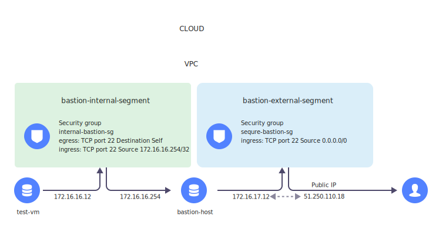

# Creating a bastion host


If you have ever had an interest in early modern fortifications, the word _bastion_ should sound familiar to you. A bastion is a structure projecting outward from the outer wall of a fortification. Just like early modern fortresses, computer networks require multi-layer protection against external attacks. Such network bastions are called bastion hosts, and they form part of a network perimeter.

A bastion host is a virtual machine with a public IP address assigned to it to enable SSH access. Once set up, the bastion host acts as a [jump server](https://en.wikipedia.org/wiki/Jump_server) allowing you to securely connect to VMs with no public IP addresses. In this guide, you will learn how to deploy a bastion host and secure your access to remote virtual machines residing inside your virtual private cloud (VPC).

A bastion host will help you make your VPC servers less vulnerable. Administration of specific servers will be carried out within a proxy connection via a bastion host over SSH.

To create a bastion host:

1. [Prepare your cloud](#before-you-begin).
1. [Create an SSH key pair](#create-ssh-keys).
1. [Create networks](#create-networks).
1. [Create security groups](#create-sg).
1. [Reserve a static public IP address](#get-static-ip).
1. [Create a virtual machine for your bastion host](#create-bastion-instance).
1. [Test your bastion host](#test-bastion).
1. [Add a virtual server to your bastion host's internal segment](#add-virtual-server).
1. [Connect to the VM you created](#connect-to-instance).

If you no longer need the resources you created, [delete them](#clear-out).



## Getting started {#before-you-begin}



### Required paid resources {#paid-resources}

The infrastructure support cost includes:

* Fee for disks and continuously running VMs (see [{{ compute-full-name }} pricing](../../compute/pricing.md)).
* Fee for using an external IP address (see [{{ vpc-full-name }} pricing](../../vpc/pricing.md#prices-public-ip)).

## Create an SSH key pair {#create-ssh-keys}





Save the private key in a secure location, as you will not be able to connect to the VM without it.



## Create an external network and an internal one {#create-networks}

### Create an external network and subnet {#create-external-network}



- Management console {#console}

  1. In the [management console]({{ link-console-main }}), go the folder where you want to create an infrastructure for your bastion host.
  1. In the list of services, select **{{ ui-key.yacloud.iam.folder.dashboard.label_vpc }}**.
  1. In the top-right corner, click **{{ ui-key.yacloud.vpc.networks.button_create }}**.
  1. Enter a name for the network: `external-bastion-network`.
  1. Disable the **{{ ui-key.yacloud.vpc.networks.create.field_is-default }}** option.
  1. Click **{{ ui-key.yacloud.vpc.networks.button_create }}**.
  1. Create a subnet:

     1. At the top right, click **{{ ui-key.yacloud.vpc.network.overview.button_create_subnetwork }}**.
     1. Specify the subnet parameters:

        * **{{ ui-key.yacloud.vpc.subnetworks.create.field_name }}**: `bastion-external-segment`.
        * **{{ ui-key.yacloud.vpc.subnetworks.create.field_zone }}**: `{{ region-id }}-b`.
        * **{{ ui-key.yacloud.vpc.subnetworks.create.field_ip }}**: `172.16.17.0/28`.

     1. Click **{{ ui-key.yacloud.vpc.subnetworks.create.button_create }}**.



### Create an internal network and subnet {#create-internal-network}



- Management console {#console}

  1. In the [management console]({{ link-console-main }}), go the folder where you want to create an infrastructure for your bastion host.
  1. In the list of services, select **{{ ui-key.yacloud.iam.folder.dashboard.label_vpc }}**.
  1. In the top-right corner, click **{{ ui-key.yacloud.vpc.networks.button_create }}**.
  1. Enter a name for the network: `internal-bastion-network`.
  1. Disable the **{{ ui-key.yacloud.vpc.networks.create.field_is-default }}** option.
  1. Click **{{ ui-key.yacloud.vpc.networks.button_create }}**.
  1. Create a subnet:

     1. At the top right, click **{{ ui-key.yacloud.vpc.network.overview.button_create_subnetwork }}**.
     1. Specify the subnet parameters:

        * **{{ ui-key.yacloud.vpc.subnetworks.create.field_name }}**: `bastion-internal-segment`.
        * **{{ ui-key.yacloud.vpc.subnetworks.create.field_zone }}**: `{{ region-id }}-b`.
        * **{{ ui-key.yacloud.vpc.subnetworks.create.field_ip }}**: `172.16.16.0/24`.

     1. Click **{{ ui-key.yacloud.vpc.subnetworks.create.button_create }}**.



## Create security groups {#create-sg}

### Create a security group for your bastion host {#create-internet-sg}

Create a [security group](../../vpc/concepts/security-groups.md) and configure the rules for the bastion host's inbound traffic for it to be accessible from the internet.



- Management console {#console}

  1. In the [management console]({{ link-console-main }}), go the folder where you want to create an infrastructure for your bastion host.
  1. In the list of services, select **{{ ui-key.yacloud.iam.folder.dashboard.label_vpc }}** and the `external-bastion-network` network.
  1. In the left-hand menu, select  **{{ ui-key.yacloud.vpc.network.switch_security-groups }}**.
  1. Click **{{ ui-key.yacloud.vpc.network.security-groups.button_create }}**.
  1. Enter the security group name: `secure-bastion-sg`.
  1. Under **{{ ui-key.yacloud.vpc.network.security-groups.forms.label_section-rules }}**, go to the **{{ ui-key.yacloud.vpc.network.security-groups.label_ingress }}** tab and click **{{ ui-key.yacloud.vpc.network.security-groups.button_add-rule }}**.
  1. Specify the rule settings:

     * **{{ ui-key.yacloud.vpc.network.security-groups.forms.field_sg-rule-port-range }}**: `22`.
     * **{{ ui-key.yacloud.vpc.network.security-groups.forms.field_sg-rule-protocol }}**: `{{ ui-key.yacloud.common.label_tcp }}`.
     * **{{ ui-key.yacloud.vpc.network.security-groups.forms.field_sg-rule-source }}**: `{{ ui-key.yacloud.vpc.network.security-groups.forms.value_sg-rule-destination-cidr }}`.
     * **{{ ui-key.yacloud.vpc.network.security-groups.forms.field_sg-rule-cidr-blocks }}**: `0.0.0.0/0`.

  1. Click **{{ ui-key.yacloud.common.save }}** in the rule creation window and then in the security group creation window.



### Create a security group for internal hosts {#create-internal-hosts-sg}

Create a security group and set up rules for incoming traffic from the bastion host to internal hosts:



- Management console {#console}

  1. In the [management console]({{ link-console-main }}), go the folder where you want to create an infrastructure for your bastion host.
  1. In the list of services, select **{{ ui-key.yacloud.iam.folder.dashboard.label_vpc }}** and the `internal-bastion-network` network.
  1. In the left-hand menu, select  **{{ ui-key.yacloud.vpc.network.switch_security-groups }}**.
  1. Click **{{ ui-key.yacloud.vpc.network.security-groups.button_create }}**.
  1. Enter the security group name: `internal-bastion-sg`.
  1. Under **{{ ui-key.yacloud.vpc.network.security-groups.forms.label_section-rules }}**, go to the **{{ ui-key.yacloud.vpc.network.security-groups.label_ingress }}** tab and click **{{ ui-key.yacloud.vpc.network.security-groups.button_add-rule }}**.
  1. Specify the rule settings:

     * **{{ ui-key.yacloud.vpc.network.security-groups.forms.field_sg-rule-port-range }}**: `22`.
     * **{{ ui-key.yacloud.vpc.network.security-groups.forms.field_sg-rule-protocol }}**: `{{ ui-key.yacloud.common.label_tcp }}`.
     * **{{ ui-key.yacloud.vpc.network.security-groups.forms.field_sg-rule-source }}**: `{{ ui-key.yacloud.vpc.network.security-groups.forms.value_sg-rule-destination-cidr }}`.
     * **{{ ui-key.yacloud.vpc.network.security-groups.forms.field_sg-rule-cidr-blocks }}**: `172.16.16.254/32`.

  1. Click **{{ ui-key.yacloud.common.save }}** in the rule creation window.
  1. Go to the **{{ ui-key.yacloud.vpc.network.security-groups.label_egress }}** tab and click **{{ ui-key.yacloud.vpc.network.security-groups.button_add-rule }}**.
  1. Specify the rule settings:

     * **{{ ui-key.yacloud.vpc.network.security-groups.forms.field_sg-rule-port-range }}**: `22`.
     * **{{ ui-key.yacloud.vpc.network.security-groups.forms.field_sg-rule-protocol }}**: `{{ ui-key.yacloud.common.label_tcp }}`.
     * **{{ ui-key.yacloud.vpc.network.security-groups.forms.field_sg-rule-destination }}**: `{{ ui-key.yacloud.vpc.network.security-groups.forms.value_sg-rule-destination-sg }}`.
     * **{{ ui-key.yacloud.vpc.network.security-groups.forms.field_sg-rule-sg-type }}**: `{{ ui-key.yacloud.vpc.network.security-groups.forms.value_sg-rule-sg-type-self }}`.

  1. Click **{{ ui-key.yacloud.common.save }}** in the rule creation window and then in the security group creation window.



## Reserve a static public IP address {#get-static-ip}

The bastion host will need a static [public IP address](../../vpc/concepts/address.md#public-addresses) to run.



- Management console {#console}

  1. In the [management console]({{ link-console-main }}), go the folder where you want to create an infrastructure for your bastion host.
  1. In the list of services, select **{{ ui-key.yacloud.iam.folder.dashboard.label_vpc }}**.
  1. In the left-hand panel, select  **{{ ui-key.yacloud.vpc.switch_addresses }}**.
  1. Click **{{ ui-key.yacloud.vpc.addresses.button_create }}**.
  1. In the window that opens, select the `{{ region-id }}-b` [availability zone](../../overview/concepts/geo-scope.md).
  1. Click **{{ ui-key.yacloud.vpc.addresses.popup-create_button_create }}**.
  


## Create a VM for the bastion host {#create-bastion-instance}

After you created the subnet and security group, proceed to create a virtual server for the bastion host:



- Management console {#console}

  1. On the [folder page](../../resource-manager/concepts/resources-hierarchy.md#folder) in the [management console]({{ link-console-main }}), click **{{ ui-key.yacloud.iam.folder.dashboard.button_add }}** and select `{{ ui-key.yacloud.iam.folder.dashboard.value_compute }}`.  
  1. Under **{{ ui-key.yacloud.compute.instances.create.section_image }}**, in the **{{ ui-key.yacloud.compute.instances.create.placeholder_search_marketplace-product }}** field, enter `NAT instance based on Ubuntu 22.04 LTS` and select a public [NAT instance based on Ubuntu 22.04 LTS](/marketplace/products/yc/nat-instance-ubuntu-22-04-lts) image.
  1. Under **{{ ui-key.yacloud.k8s.node-groups.create.section_allocation-policy }}**, select the `{{ region-id }}-b` [availability zone](../../overview/concepts/geo-scope.md).
  1. Under **{{ ui-key.yacloud.compute.instances.create.section_network }}**, configure the first network interface:

      * **{{ ui-key.yacloud.component.compute.network-select.field_subnetwork }}**: `bastion-external-segment`.
      * **{{ ui-key.yacloud.component.compute.network-select.field_external }}**: Click `{{ ui-key.yacloud.component.compute.network-select.switch_list }}` and select the [IP address reserved earlier](#get-static-ip).
      * **{{ ui-key.yacloud.component.compute.network-select.field_security-groups }}**: `secure-bastion-sg`.

  1. Click **{{ ui-key.yacloud.compute.instances.create.label_add-network-interface }}** and configure the second network interface:

      * **{{ ui-key.yacloud.component.compute.network-select.field_subnetwork }}**: `bastion-internal-segment`.
      * **{{ ui-key.yacloud.component.compute.network-select.field_external }}**: `{{ ui-key.yacloud.component.compute.network-select.switch_none }}`.
      * **{{ ui-key.yacloud.component.compute.network-select.field_security-groups }}**: `internal-bastion-sg`.
      * Expand the **{{ ui-key.yacloud.component.compute.network-select.section_additional }}** section; in the **{{ ui-key.yacloud.component.internal-v4-address-field.field_internal-ipv4-address }}** field, select `{{ ui-key.yacloud.component.compute.network-select.switch_manual }}`.
      * In the input field that appears, enter `172.16.16.254`.

      

      Make sure the first interface on the new VM belongs to an external segment; the default gateway will be automatically set on that interface.

      

      Specify a public IP address for the external segment only. For the internal segment, specify an internal static IP address.

  1. Under **{{ ui-key.yacloud.compute.instances.create.section_access }}**, select **{{ ui-key.yacloud.compute.instance.access-method.label_oslogin-control-ssh-option-title }}** and specify the VM access data:

      * In the **{{ ui-key.yacloud.compute.instances.create.field_user }}** field, enter the username: `bastion`.
      * 

  1. Under **{{ ui-key.yacloud.compute.instances.create.section_base }}**, specify the VM name: `bastion-host`.
  1. Click **{{ ui-key.yacloud.compute.instances.create.button_create }}**.

  As soon as the server VM starts and gets the **Running** status, you will see the public IP address assigned to it in the **{{ ui-key.yacloud.compute.group.overview.label_instance-address }}** field.



## Test the bastion host {#test-bastion}

After you start your bastion host, try to connect to it via the SSH client:

```bash
ssh -i ~/.ssh/<name_of_private_key_file> bastion@<public_IP_address_of_bastion_host>
```

## Add a virtual server to the internal segment of the bastion host {#add-virtual-server}

To administer your servers, add a network interface to the internal network segment of the bastion host, `bastion-internal-segment`.

If you already have a virtual machine, [add](../../compute/operations/vm-control/attach-network-interface.md) another network interface to it. If not, create a new machine to test your bastion host configuration:



- Management console {#console}

  1. On the [folder page](../../resource-manager/concepts/resources-hierarchy.md#folder) in the [management console]({{ link-console-main }}), click **{{ ui-key.yacloud.iam.folder.dashboard.button_add }}** and select `{{ ui-key.yacloud.iam.folder.dashboard.value_compute }}`.  
  1. Under **{{ ui-key.yacloud.compute.instances.create.section_image }}**, select a public image with any OS, e.g., [Ubuntu 22.04 LTS](/marketplace/products/yc/ubuntu-22-04-lts).
  1. Under **{{ ui-key.yacloud.k8s.node-groups.create.section_allocation-policy }}**, select the `{{ region-id }}-b` [availability zone](../../overview/concepts/geo-scope.md).
  1. Under **{{ ui-key.yacloud.compute.instances.create.section_network }}**, configure a network interface:

      * **{{ ui-key.yacloud.component.compute.network-select.field_subnetwork }}**: `bastion-internal-segment`.
      * **{{ ui-key.yacloud.component.compute.network-select.field_external }}**: `{{ ui-key.yacloud.component.compute.network-select.switch_none }}`.
      * **{{ ui-key.yacloud.component.compute.network-select.field_security-groups }}**: `internal-bastion-sg`.
      * Expand the **{{ ui-key.yacloud.component.compute.one-to-one-nat-form.field_advanced }}** section; in the **{{ ui-key.yacloud.component.compute.network-select.field_internal-ipv4 }}** field, select `{{ ui-key.yacloud.component.compute.network-select.switch_auto }}`.

  1. Under **{{ ui-key.yacloud.compute.instances.create.section_access }}**, select **{{ ui-key.yacloud.compute.instance.access-method.label_oslogin-control-ssh-option-title }}** and specify the VM access data:

      * In the **{{ ui-key.yacloud.compute.instances.create.field_user }}** field, enter the username: `test`.
      * 

  1. Under **{{ ui-key.yacloud.compute.instances.create.section_base }}**, specify the VM name: `test-vm`.
  1. Click **{{ ui-key.yacloud.compute.instances.create.button_create }}**.



## Connect to the created VM {#connect-to-instance}

If connecting to the VM over SSH via an internal IP address, you will use your bastion host as a jump host.

To simplify and configure SSH access, add the `-J` (ProxyJump) parameter to the SSH command:

```bash
ssh -i ~/.ssh/<name_of_private_key_file> -J bastion@<public_IP_address_of_bastion_host> test@<internal_IP_address_of_virtual_server>
```

The SSH client will automatically connect to the internal server.

You can use the `-J` flag in OpenSSH version 7.3 or higher. In earlier versions, `-J` is not available. The easiest and most secure alternative is to use standard I/O redirection (the `-W` flag) to forward the connection through the bastion host. Here is an example:

```bash
ssh -i ~/.ssh/<name_of_private_key_file> -o ProxyCommand="ssh -W %h:%p bastion@<public_IP_address_of_bastion_host>" test@<internal_IP_address_of_virtual_server>
```

## Additional connection options {#more-options}

### Using an SSH agent for connections via the bastion host {#using-ssh-agent}

By default, server access is only set up for authentication using a public SSH key. We do not recommend storing keys directly on your bastion hosts, especially without a passphrase. Use an SSH agent instead. In this case, private SSH keys will only be stored on your computer and you will be able to safely use them for authentication on the next server.

To add a key to an authentication agent, use the `ssh-add` command. If the key is stored in the `~/.ssh/id_rsa` file, it is added automatically. You can also set a specific key to use by running the command below:

```bash
ssh-add <key_file_path>
```

If using macOS, you can create the `~/.ssh/config` file. In this case, you can use the following command to upload the keys to the agent:

```bash
AddKeysToAgent yes
```

The following command used to connect to the bastion host allows you to perform agent forwarding and log in to the next server by providing the credentials from your local machine:

```bash
ssh -A bastion@<public_IP_address_of_bastion_host>
```

Windows users can use Pageant and upload their private key file to it. Next, to ensure agent forwarding, open the [PuTTY](https://www.chiark.greenend.org.uk/~sgtatham/putty/) configuration window and select **Connection** → **SSH** → **Authentication**.

### Access to services through SSH tunnels {#ssh-tunneling}

Sometimes, SSH access alone is not enough to complete your task. If that is the case, use SSH tunnels to easily connect to web applications and other services used to process inbound connections.

The main types of SSH tunnels are local, remote, and dynamic:

* A **local** tunnel is an open port in a local loopback interface, which connects to the `IP:port` address on your SSH server.

   For example, you can connect local port 8080 to the `web_server_IP_address:80` address accessible from your bastion host and then open `http://localhost:8080` in your browser:

   ```bash
   ssh bastion@<public_IP_address_of_bastion_host> -L 8080:<web_server_IP_address>:80
   ```

* A **remote** tunnel works in the direction opposite to that of the local tunnel by opening a local port for connection to a remote server.
* A **dynamic** tunnel provides a SOCKS proxy on a local port with connections established from a remote host. For example, you can set up a dynamic tunnel on port 1080 and then specify it as a SOCKS proxy in your browser. As a result, you will be able to connect to any resources that are accessible from your bastion host and reside in a private subnet.

   ```bash
   ssh bastion@<public_IP_address_of_bastion_host> -D 1080
   ```

These methods rely on simple replacement that often requires a VPN connection as well as a combination with ProxyJump or ProxyCommand connections.

Windows users can set up tunnels using PuTTY by selecting **Connection** → **SSH** → **Tunnels**.

For easy connections to Remote Desktop Services (RDS), i.e., Windows hosts running in a cloud, you can use port redirection (the local one in particular) by establishing a tunnel connection to port 3389 and then connecting to `localhost` via an RDS client. If the RDS client is already awaiting connection on the local machine, you can choose a different port as shown in the example below:

```bash
ssh bastion@<public_IP_address_of_bastion_host> -L 3390:<Windows_host_IP_address>:3389
```

### Transferring files {#file-transfers}

For Linux clients and servers, you can configure [SCP](https://en.wikipedia.org/wiki/Secure_copy_protocol) to securely transfer files through the bastion host to internal hosts and back. Do this using the same ProxyCommand and ProxyJump options specified in the SSH command line. For example:

```bash
scp -o "ProxyJump bastion@<public_IP_address_of_bastion_host>" <file_name> bastion@<internal_IP_address_of_virtual_server>:<path_to_file>
```

If you are a Windows client user, one of the most popular SCP applications for Windows is [WinSCP](https://winscp.net). To transfer files via your bastion host to a remote Linux machine:

1. Create a session to connect to a private host IP without a password. Set up an SSH key on the Linux machine.
1. In the left-hand navigation menu, click **Advanced** and select **Tunnel**.
1. Enter the IP address and username for your bastion host. In the **Private key file** field, select and set the private key file to use for authentication on your bastion host.
1. In the left-hand navigation menu, select **Authentication** under **SSH**.
1. Make sure to select **Allow agent forwarding**.
1. Choose the private key to use for authentication on a private host.

This configuration enables a direct file transfer between your Windows machine and Linux private host. The bastion host will secure connections between them.

If using Windows hosts residing behind a Linux bastion, you can transfer files using [RDP](https://en.wikipedia.org/wiki/Remote_Desktop_Protocol) via a tunnel. This method ensures an efficient and secure file transfer.

## How to delete the resources you created {#clear-out}

To stop paying for the resources you created:

* [Delete](../../compute/operations/vm-control/vm-delete.md) the VM.
* [Delete](../../vpc/operations/address-delete.md) the static public IP address.
