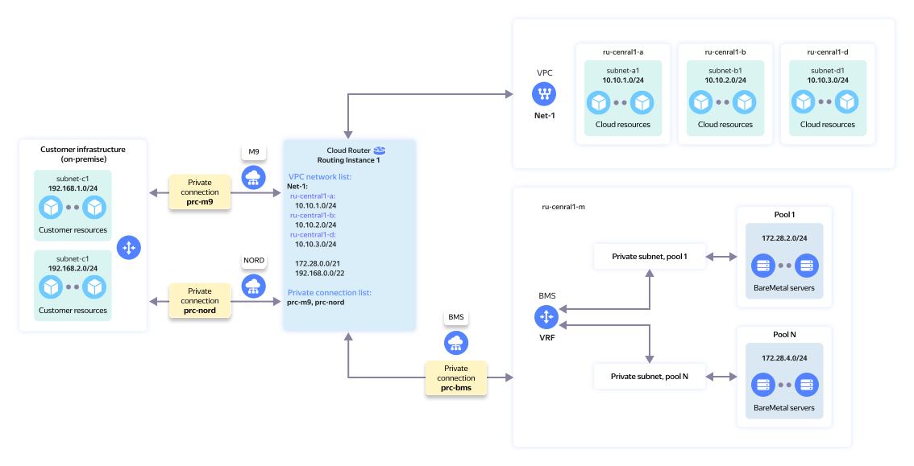

# Establishing network connectivity between {{ baremetal-full-name }} subnets and on-premise environment with {{ interconnect-name }}


In this tutorial, you will set up network connectivity between a {{ baremetal-name }} [server](../../baremetal/concepts/servers.md) located in a [private {{ baremetal-full-name }} subnet](../../baremetal/concepts/private-network.md) and your on-premise resources. Network connectivity will be established using [{{ interconnect-name }}](../../interconnect/index.yaml) and [{{ cr-name }}](../../cloud-router/index.yaml).

You can see the solution architecture in the diagram below:



The diagram above shows network connectivity between the {{ baremetal-full-name }} segment resources and customer’s remote on-premise resources connected to {{ yandex-cloud }} via {{ interconnect-name }}.

To set up network connectivity between these resources and the virtual network, you need to add the relevant {{ vpc-name }} subnet IP prefixes to the virtual router. For more on configuring this type of network connectivity, see the [relevant documentation](../../cloud-router/tutorials/bm-vrf-and-vpc-interconnect.md). 



It is assumed that the on-premises connection to {{ yandex-cloud }} via {{ interconnect-name }} has already been established and is operational. You must have an active trunk and an active private connection.



To set up network connectivity between {{ baremetal-name }} private subnets and on-premise resources using {{ interconnect-name }}, do the following:

1. [Get your cloud ready](#before-you-begin).
1. [Create a cloud infrastructure](#setup-infrastructure).
1. [Set up a virtual router](#create-routing-instance).
1. [Create a private connection](#create-private-connection).
1. [Check network connectivity](#check-connectivity).

If you no longer need the resources you created, [delete them](#clear-out).

## Getting started {#before-you-begin}



### Required paid resources {#paid-resources}

The cost of infrastructure for network connectivity includes:

* Fee for renting a {{ baremetal-name }} server (see [{{ baremetal-full-name }} pricing](../../baremetal/pricing.md)).
* Fee for using {{ interconnect-name }} (see [{{ interconnect-name }} pricing](../../interconnect/pricing.md)).

## Create a cloud infrastructure {#setup-infrastructure}

Create the {{ yandex-cloud }} infrastructure you will use to set up network connectivity.

To set it up, you will need a private routable [subnet](../../baremetal/concepts/private-network.md#private-subnet) and a [VRF](../../baremetal/concepts/private-network.md#vrf-segment) in {{ baremetal-name }}, a {{ baremetal-name }} server, an active {{ interconnect-name }} private connection, and a {{ cr-name }} virtual router.

### Create a VRF segment and a {{ baremetal-name }} private subnet {#setup-vrf}

Create a virtual network segment (VRF) and a private subnet in the `{{ region-id }}-m3` [server pool](../../baremetal/concepts/servers.md#server-pools):



- Management console {#console}

  1. In the [management console]({{ link-console-main }}), select the folder where you are going to create your infrastructure.
  1. In the list of services, select **{{ ui-key.yacloud.iam.folder.dashboard.label_baremetal }}**.
  1. Create a virtual routing and forwarding segment:

        1. In the left-hand panel, select  **{{ ui-key.yacloud.baremetal.label_networks_kHgng }}** and click **{{ ui-key.yacloud.baremetal.label_create-network }}**.
        1. In the **{{ ui-key.yacloud.baremetal.field_name }}** field, name your VRF segment: `my-vrf`.
        1. Click **{{ ui-key.yacloud.baremetal.label_create-network }}**.

  1. Create a private subnet:

        1. In the left-hand panel, select  **{{ ui-key.yacloud.baremetal.label_subnetworks_uU4LH }}** and click **{{ ui-key.yacloud.baremetal.label_create-subnetwork }}**.
        1. In the **{{ ui-key.yacloud.baremetal.field_hardware-pool-id }}** field, select the `{{ region-id }}-m3` server pool.
        1. In the **{{ ui-key.yacloud.baremetal.field_name }}** field, enter the subnet name: `subnet-m3`.
        1. Enable **{{ ui-key.yacloud.baremetal.title_routing-settings }}**.
        1. In the **{{ ui-key.yacloud.baremetal.field_network-id }}** field, select `my-vrf`.
        1. In the **{{ ui-key.yacloud.baremetal.field_CIDR_rwYMi }}** field, specify `192.168.1.0/24`.
        1. In the **{{ ui-key.yacloud.baremetal.field_gateway_t7LLk }}** field, keep the default value, `192.168.1.1`.
        1. Enable the **{{ ui-key.yacloud.baremetal.field_dhcp-settings }}** option and in the **{{ ui-key.yacloud.baremetal.field_dhcp-ip-range }}** field that appears, leave the default values, `192.168.1.1`-`192.168.1.254`.
        1. Click **{{ ui-key.yacloud.baremetal.label_create-subnetwork }}**.




### Rent a {{ baremetal-name }} server {#rent-bms}



- Management console {#console}

  1. In the [management console]({{ link-console-main }}), select the folder where you are deploying your infrastructure.
  1. 
  1. Click **{{ ui-key.yacloud.baremetal.label_create-server }}** and, in the window that opens, select `{{ ui-key.yacloud_components.baremetal.StockConfigurations }}` and a suitable {{ baremetal-name }} server [configuration](../../baremetal/concepts/server-configurations.md) in the `{{ region-id }}-m3` server pool.

      Do it by selecting the `{{ region-id }}-m3` server pool in the filter on the right side of the window, under **{{ ui-key.yacloud_components.baremetal.poolFilter }}**.

      To select the suitable server configuration, click the section with its name in the central part of the screen.

      

  1. In the server configuration window that opens:

      1. 
      1. Under **{{ ui-key.yacloud.baremetal.title_section-server-product }}**, select an image, e.g., `Ubuntu 24.04`.
      1. 
      1. Under **{{ ui-key.yacloud.baremetal.title_section-network-interfaces }}**:

          1. In the **{{ ui-key.yacloud.baremetal.field_subnet-id }}** field, select the `subnet-m3` subnet you created earlier.
          1. In the **{{ ui-key.yacloud.baremetal.field_needed-public-ip }}** field, select `{{ ui-key.yacloud.baremetal.label_public-ip-no }}`.

      1. Under **{{ ui-key.yacloud.baremetal.title_server-access }}**:

          

      1. Under **{{ ui-key.yacloud.baremetal.title_section-server-info }}**, in the **{{ ui-key.yacloud.baremetal.field_name }}** field, enter the server name: `server-m3`.
      1. 





Server setup and OS installation may take up to 45 minutes. The server will have the `Provisioning` status during this time. After OS installation is complete, the server status will change to `Ready`.



## Set up a virtual router {#create-routing-instance}

1. [Make sure](../../cloud-router/operations/ri-get-info.md) you have a virtual router configured to connect your on-premise infrastructure to {{ yandex-cloud }}.
1. If you do not have a virtual router, [create one](../../cloud-router/operations/ri-create.md).
1. Make sure your active private {{ interconnect-name }} connection is added to the selected virtual router. [Add it](../../cloud-router/operations/ri-priv-con-add.md) if needed.
1. Make sure your network hardware announces on-premise IP prefixes to the private connection over BGP.

The virtual router receives on-premise IP prefixes over BGP. You do not need to add them as cloud network prefixes.

## Create a private connection {#create-private-connection}

Once your virtual router is ready, create a [private {{ interconnect-name }} connection](../../baremetal/concepts/private-network.md#private-connection-to-vpc) in {{ baremetal-name }}:



## Test network connectivity {#check-connectivity}

As soon as the status of the new private connection changes to `Ready`, network connectivity between the {{ baremetal-name }} subnet and on-premises will be established, and you can start checking it.

A network connectivity check assumes that:

* The private connection has been successfully set up, and its status has changed to `Ready`.
* The local firewall on the {{ baremetal-name }} server allows [ICMP](https://en.wikipedia.org/wiki/Internet_Control_Message_Protocol) traffic.
* The routing table in the {{ baremetal-name }} server OS contains a route to the on-premise prefix.
* The firewall on the on-premise resource allows ICMP traffic from the {{ baremetal-name }} subnet.

### Test network connectivity from the private {{ baremetal-name }} subnet to the on-premise resources {#check-bms-to-onprem}



- Management console {#console}

  1. In the [management console]({{ link-console-main }}), select the folder where you created the infrastructure.
  1. In the list of services, select **{{ ui-key.yacloud.iam.folder.dashboard.label_baremetal }}**.
  1. Next to `server-m3`, click  and select **{{ ui-key.yacloud.baremetal.label_kvm-console_37Kma }}**.
  
      The KVM console terminal window will open, showing a login prompt:
      
      ```
      server-m3 login:
      ```

      If you do not see this prompt, try [restarting](../../baremetal/operations/servers/server-stop-and-start.md#restart) the server.

  1. In the KVM console terminal, specify `root` for the username and press **ENTER**.
  1. Paste the password generated when renting the server in the password input line and press **ENTER**. Note that when typing or pasting a password in Linux, the characters you enter will not appear on the screen.

      

      Result:

      ```text
      Welcome to Ubuntu 24.04.2 LTS (GNU/Linux 6.8.0-53-generic x86_64)
      ...
      root@server-m3:~# _
      ```

      If you did not save the server administrator password, you can create a new password following [this guide](../../baremetal/operations/servers/reset-password.md) or [reinstall](../../baremetal/operations/servers/reinstall-os-from-marketplace.md) the server OS.
  1. In the KVM console terminal, run the `ping` command to make sure you can access the on-premise resource:

      ```bash
      ping <on_premise_resource_IP_address> -c 5
      ```

      If packets are transmitted with zero loss, network connectivity from the {{ baremetal-name }} server to on-premises is working correctly.



### Test network connectivity from the on-premise resource to the private {{ baremetal-name }} subnet {#check-onprem-to-bms}

On the on-premise resource, run the `ping` command to make sure you can access `server-m3` by its private IP address:

```bash
ping <server_private_IP_address> -c 5
```

You can find your {{ baremetal-name }} server's private IP address in the management console under **Network settings** on the server information page.

If packets are transmitted with zero loss, network connectivity from on-premises to the {{ baremetal-name }} server is working correctly.

## How to delete the resources you created {#clear-out}

To stop paying for the resources you created:

1. You cannot delete a {{ baremetal-name }} server. Instead, [cancel](../../baremetal/operations/servers/server-lease-cancel.md) the server lease renewal.
1. Delete the private connection if you no longer need it:

    

    - Management console {#console} 
    
      1. In the [management console]({{ link-console-main }}), select the folder where you created the infrastructure.
      1. In the list of services, select **{{ ui-key.yacloud.iam.folder.dashboard.label_baremetal }}**.
      1. In the left-hand panel, click  **{{ ui-key.yacloud.baremetal.label_networks_kHgng }}** and select `my-vrf`.
      1. Under **{{ ui-key.yacloud.baremetal.title_vrf-interconnect-section }}**, click  and select  **{{ ui-key.yacloud.baremetal.action_delete-external-connection }}**.
      1. In the window that opens, confirm the deletion.

      The connection status will change to `Deleting`. Once all links are deleted, the connection will disappear from the list.

    

1. If you created a new virtual router for this tutorial, [delete the private connection from it](../../cloud-router/operations/ri-priv-con-del.md) and then [delete the router](../../cloud-router/operations/ri-delete.md).
