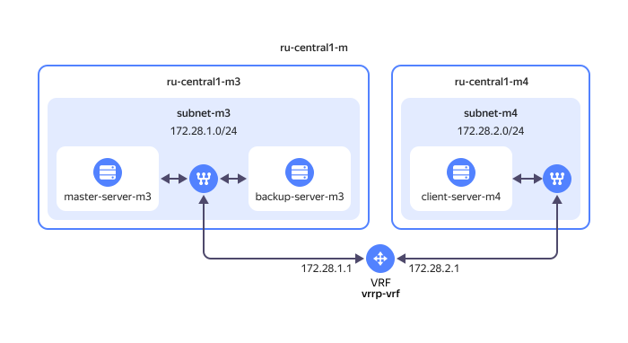

# Configuring VRRP for a {{ baremetal-name }} server cluster using Keepalived 



{{ baremetal-full-name }} is at the [Preview](../../overview/concepts/launch-stages.md) stage.



[VRRP](https://en.wikipedia.org/wiki/Virtual_Router_Redundancy_Protocol) (Virtual Router Redundancy Protocol) is a network protocol that increases fault tolerance of routers used as a default gateway. 

To implement fault tolerance, two or more routers are grouped into a single virtual router acting as the default gateway for the associated network segments. VRRP enables creating a virtual IP address which is shared among the grouped routers to increase the gateway availability.

This tutorial provides an example of setting up a high-availability proxy server configuration on {{ baremetal-name }} [servers](../../baremetal/concepts/servers.md), where proxying functions are configured symmetrically on two or more [HAProxy](https://en.wikipedia.org/wiki/HAProxy) nodes and a virtual IP address is generated and shared among these nodes using [Keepalived](https://keepalived.org/).

## Solution architecture {#solution-overview}



In the `{{ region-id }}-m` availability zone, you will set up an environment of two [private subnets](../../baremetal/concepts/network.md#private-subnet), `subnet-m3` and `subnet-m4`, created in the `{{ region-id }}-m3` and `{{ region-id }}-m4` [server pools](../../baremetal/concepts/servers.md#server-pools), respectively. You will group these subnets into a [virtual routing and forwarding (VRF) network segment](../../baremetal/concepts/network.md#vrf-segment) named `vrrp-vrf`.

In `subnet-m3`, you will create two {{ baremetal-name }} servers, `master-server-m3` and `backup-server-m3`, which will have the `MASTER` and `BACKUP` roles, respectively, in the VRRP group. On these two servers, you will run Keepalived and use it to set up a virtual IP address for the server group in the `{{ region-id }}-m3` pool.

In `subnet-m4` of the `{{ region-id }}-m4` server pool, you will create a {{ baremetal-name }} server named `client-server-m4`, which will serve as a client when using the virtual IP address created in the `{{ region-id }}-m3` pool.

This solution fully demonstrates the operation of an isolated client VRF with the [OSI](https://en.wikipedia.org/wiki/OSI_model) L3 routing between the `{{ region-id }}-m3` and `{{ region-id }}-m4` server pools as well as the L2-level operation of the broadcast VRRP in the `{{ region-id }}-m3` server pool.



At L2 of the OSI network model, broadcasting works only within one server pool and only for a group of servers in the same network.



To configure a fault-tolerant cluster of {{ baremetal-name }} servers using VRRP:

1. [Get your cloud ready](#before-you-begin).
1. [Create a virtual network segment](#create-vrf).
1. [Create private subnets](#create-subnetworks).
1. [Lease {{ baremetal-name }} servers](#rent-servers).
1. [Configure Keepalived on the servers of the {{ region-id }}-m3 pool](#setup-keepalived).
1. [Test the solution](#test-solution).

If you no longer need the resources you created, [delete them](#clear-out).

## Getting started {#before-you-begin}



## Create a virtual network segment {#create-vrf}

To link several private subnets at the L3 level of the OSI network model, you need to group them into a virtual routing and forwarding (VRF) network fragment.

Create a new VRF:



- Management console {#console}

  1. In the [management console]({{ link-console-main }}), select the folder to create your infrastructure in.
  1. From the list of services, select **{{ ui-key.yacloud.iam.folder.dashboard.label_baremetal }}**.
  1. In the left-hand panel, select  **{{ ui-key.yacloud.baremetal.label_networks }}** and click **{{ ui-key.yacloud.baremetal.label_create-network }}**.
  1. In the **{{ ui-key.yacloud.baremetal.field_name }}** field, enter a name for the VRF: `vrrp-vrf`.
  1. Click **{{ ui-key.yacloud.baremetal.label_create-network }}**.



## Create private subnets {#create-subnetworks}

Create two private subnets in different [server pools](../../baremetal/concepts/servers.md#server-pools) and add them to the VRF you created earlier:



- Management console {#console}

  1. In the [management console]({{ link-console-main }}), select the folder to create your infrastructure in.
  1. From the list of services, select **{{ ui-key.yacloud.iam.folder.dashboard.label_baremetal }}**.
  1. In the left-hand panel, select  **{{ ui-key.yacloud.baremetal.label_subnetworks }}** and click **{{ ui-key.yacloud.baremetal.label_create-subnetwork }}**.
  1. In the **{{ ui-key.yacloud.baremetal.field_server-pool }}** field, select the `{{ region-id }}-m3` server pool.
  1. In the **{{ ui-key.yacloud.baremetal.field_name }}** field, enter a name for the subnet: `subnet-m3`.
  1. Enable **{{ ui-key.yacloud.baremetal.title_routing-settings }}**.
  1. In the **{{ ui-key.yacloud.baremetal.field_network-id }}** field, select the previously created VRF, `vrrp-vrf`.
  1. In the **{{ ui-key.yacloud.baremetal.field_CIDR }}** field, specify `172.28.1.0/24`.
  1. Click **{{ ui-key.yacloud.baremetal.label_create-subnetwork }}**.
  1. Similarly, create a private subnet named `subnet-m4` in the `{{ region-id }}-m4` server pool with the `172.28.2.0/24` CIDR.



## Lease {{ baremetal-name }} servers {#rent-servers}



- Management console {#console}

  1. In the [management console]({{ link-console-main }}), select the folder to create your infrastructure in.
  1. In the list of services, select **{{ ui-key.yacloud.iam.folder.dashboard.label_baremetal }}** and click **{{ ui-key.yacloud.baremetal.label_create-server }}**.
  1. In the **{{ ui-key.yacloud.baremetal.field_server-pool }}** field, select the `{{ region-id }}-m3` server pool.
  1. Under **{{ ui-key.yacloud.baremetal.title_section-server-config }}**, select the appropriate [server configuration](../../baremetal/concepts/server-configurations.md).
  1. (Optionally) Under **{{ ui-key.yacloud.baremetal.title_section-disk }}**, configure disk partitioning:

        1. Click **{{ ui-key.yacloud.baremetal.action_disk-layout-settings }}**.
        1. Specify the partitioning parameters. To create a new partition, click  **{{ ui-key.yacloud.baremetal.actions_add-partition }}**.

           

           To build RAID arrays and configure disk partitions yourself, click **{{ ui-key.yacloud.baremetal.action_destroy-raid }}**.

           

        1. Click **{{ ui-key.yacloud.common.save }}**.

  1. Under **{{ ui-key.yacloud.baremetal.title_section-server-product }}**, select the [Ubuntu 24.04](/marketplace/products/yc/ubuntu-2404-lts-oslogin) image.
  1. Under **{{ ui-key.yacloud.baremetal.title_section-lease-conditions }}**, select the period you want to lease the server for. When this period expires, server lease will be automatically renewed for the same period.
  1. Under **{{ ui-key.yacloud.baremetal.title_section-server-network-settings }}**:

     1. In the **{{ ui-key.yacloud.baremetal.field_subnet-id }}** field, select the `subnet-m3` subnet you created earlier.
     1. In the **{{ ui-key.yacloud.baremetal.field_needed-public-ip }}** field, select `{{ ui-key.yacloud.baremetal.label_public-ip-auto }}`.

  1. 
  1. Under **{{ ui-key.yacloud.baremetal.title_section-server-info }}** in the **{{ ui-key.yacloud.baremetal.field_name }}** field, enter a name for the server: `master-server-m3`.
  1. Click **{{ ui-key.yacloud.baremetal.label_create-server }}**.
  1. Similarly, lease two more servers: one named `backup-server-m3` in the `{{ region-id }}-m3` server pool and another one named `client-server-m4` with the `subnet-m4` subnet in the `{{ region-id }}-m4` server pool.



On the page with a list of {{ baremetal-name }} servers that opens, you will see information about all the servers you created. In the **{{ ui-key.yacloud.baremetal.field_needed-public-ip }}** field of the table, copy the server public IP addresses as you will need them to connect to the servers over SSH.



Getting servers ready and installing operating systems on them may take up to 45 minutes. The servers will have the `Provisioning` status during this time. After OS installation is complete, the server status will change to `Ready`.



## Configure Keepalived on the servers of the {{ region-id }}-m3 pool {#setup-keepalived}

At this step, you will install, configure, and run [Keepalived](https://keepalived.org/) on the servers created in the `{{ region-id }}-m3` pool.

Follow the steps below to configure both servers, `master-server-m3` and `backup-server-m3`.

1. [Connect](../../compute/operations/vm-connect/ssh.md) to the server over SSH by using the server’s public IP address you saved in the previous step. 
1. Install Keepalived by running this command:

    ```bash
    sudo apt update && sudo apt install keepalived -y
    ```
1. View the list of the server’s network interfaces:

    ```bash
    ip a
    ```

    Result:

    ```text
    ...
    5: etx2: <BROADCAST,MULTICAST,UP,LOWER_UP> mtu 1500 qdisc mq state UP group default qlen 1000
        link/ether 00:02:c9:35:fd:31 brd ff:ff:ff:ff:ff:ff
        altname enp6s0d1
        inet 172.28.1.2/24 metric 100 brd 172.28.1.255 scope global dynamic etx2
           valid_lft 3512sec preferred_lft 3512sec
        inet6 fe80::202:c9ff:fe35:fd31/64 scope link
           valid_lft forever preferred_lft forever
    ```

    In the command output, find an interface with an IP address in the `172.28.1.0/24` range allocated for the private subnet named `subnet-m3`. In the example above, such an interface has the `etx2` ID. You will need the interface ID in later steps to configure Keepalived.
1. Create a Keepalived configuration file:

    ```
    sudo nano /etc/keepalived/keepalived.conf
    ```
1. Add the following configuration into the file you created:

    

    - Master

      ```text
      vrrp_instance M3_1 {
          state MASTER
          interface etx2
          virtual_router_id 51
          priority 100
          advert_int 1

          authentication {
              auth_type PASS
              auth_pass hGoVjTjSYQq3Epm
          }

          virtual_ipaddress {
              172.28.1.254
          }

          preempt
      }
      ```

    - Backup

      ```text
      vrrp_instance M3_2 {
          state BACKUP
          interface etx2
          virtual_router_id 51
          priority 90
          advert_int 1

          authentication {
              auth_type PASS
              auth_pass hGoVjTjSYQq3Epm
          }

          virtual_ipaddress {
              172.28.1.254
          }

          preempt
      }
      ```

    

    Where:

    * `vrrp_instance`: Virtual router name:
    
        * `M3_1` for the server with the `MASTER` role.
        * `M3_2` for the server with the `BACKUP` role.
    * `state`: Server state, `MASTER` or `BACKUP`.
    * `interface`: ID of the network interface where the virtual IP address will be used. In the example above, it is `etx2`.
    * `virtual_router_id`: Unique VRRP ID for the group of virtual routers. This value must be the same for all servers in the group.
    * `priority`: Priority that allows you to set the master and backup nodes. Set a server’s priority to `100` to make it the master node or to `90` to make it the backup one.
    * `advert_int`: Interval between state announcements in seconds.
    * `authentication`: Section with authentication settings to provide security. Contents of this section must be the same for all servers in a group.
    * `virtual_ipaddress`: Virtual IP address that the current node will manage. Virtual IP address requirements:

        * It must belong to the CIDR range allocated for the virtual subnet where you created the server group.
        * It must be unused.
        * All servers in the group must have the same address.
    * `preempt`: Enables the server to change its state to `MASTER` if it has a higher priority than the current master in the group.
1. Restart Keepalived:

    ```bash
    systemctl restart keepalived.service
    ```
1. View Keepalived logs to make sure the service is running:

    ```bash
    sudo journalctl -u keepalived.service
    ```

    Result:

    

    - Master

      ```text
      systemd[1]: keepalived.service - Keepalive Daemon (LVS and VRRP) was skipped because of an unmet condition check (ConditionFileNotEmpty=/etc/keepalived/keepalived.conf).
      systemd[1]: Starting keepalived.service - Keepalive Daemon (LVS and VRRP)...
      Keepalived[4045]: Starting Keepalived v2.2.8 (04/04,2023), git commit v2.2.7-154-g292b299e+
      Keepalived[4045]: Running on Linux 6.8.0-53-generic #55-Ubuntu SMP PREEMPT_DYNAMIC Fri Jan 17 15:37:52 UTC 2025 (built for Linux 6.8.0)
      Keepalived[4045]: Command line: '/usr/sbin/keepalived' '--dont-fork'
      Keepalived[4045]: Configuration file /etc/keepalived/keepalived.conf
      Keepalived[4045]: NOTICE: setting config option max_auto_priority should result in better keepalived performance
      Keepalived[4045]: Starting VRRP child process, pid=4046
      Keepalived_vrrp[4046]: (/etc/keepalived/keepalived.conf: Line 10) Truncating auth_pass to 8 characters
      Keepalived[4045]: Startup complete
      systemd[1]: Started keepalived.service - Keepalive Daemon (LVS and VRRP).
      Keepalived_vrrp[4046]: (M3_1) Entering BACKUP STATE (init)
      Keepalived_vrrp[4046]: (M3_1) Entering MASTER STATE
      ```

    - Backup

      ```text
      systemd[1]: keepalived.service - Keepalive Daemon (LVS and VRRP) was skipped because of an unmet condition check (ConditionFileNotEmpty=/etc/keepalived/keepalived.conf).
      systemd[1]: Starting keepalived.service - Keepalive Daemon (LVS and VRRP)...
      Keepalived[2751]: Starting Keepalived v2.2.8 (04/04,2023), git commit v2.2.7-154-g292b299e+
      Keepalived[2751]: Running on Linux 6.8.0-53-generic #55-Ubuntu SMP PREEMPT_DYNAMIC Fri Jan 17 15:37:52 UTC 2025 (built for Linux 6.8.0)
      Keepalived[2751]: Command line: '/usr/sbin/keepalived' '--dont-fork'
      Keepalived[2751]: Configuration file /etc/keepalived/keepalived.conf
      Keepalived[2751]: NOTICE: setting config option max_auto_priority should result in better keepalived performance
      Keepalived[2751]: Starting VRRP child process, pid=2752
      Keepalived_vrrp[2752]: (/etc/keepalived/keepalived.conf: Line 10) Truncating auth_pass to 8 characters
      Keepalived[2751]: Startup complete
      Keepalived_vrrp[2752]: (M3_2) Entering BACKUP STATE (init)
      ```

    

## Test the solution {#test-solution}

1. Make sure the virtual IP address was added to the network interface of the server with the `Master` role:
    1. [Connect](../../compute/operations/vm-connect/ssh.md) to `master-server-m3` over SSH.
    1. View the configuration of the network interface assigned to the `subnet-m3` private subnet.

        ```bash
        ip a
        ```

        Result:

        ```text
        ...
        5: etx2: <BROADCAST,MULTICAST,UP,LOWER_UP> mtu 1500 qdisc mq state UP group default qlen 1000
            link/ether 00:02:c9:35:fd:31 brd ff:ff:ff:ff:ff:ff
            altname enp6s0d1
            inet 172.28.1.2/24 metric 100 brd 172.28.1.255 scope global dynamic etx2
            valid_lft 3575sec preferred_lft 3575sec
            inet 172.28.1.254/32 scope global etx2
            valid_lft forever preferred_lft forever
            inet6 fe80::202:c9ff:fe35:fd31/64 scope link
            valid_lft forever preferred_lft forever
        ```

        The network interface received an additional virtual IP address specified in Keepalived settings: `172.28.1.254/32`.

1. Send [ICMP](https://en.wikipedia.org/wiki/Internet_Control_Message_Protocol) requests from the `subnet-m4` private subnet to make sure the virtual IP address in the `subnet-m3` private subnet is available:

    1. [Connect](../../compute/operations/vm-connect/ssh.md) to `client-server-m4` over SSH.
    1. Run this command:

        ```bash
        ping 172.28.1.254 -s 1024 -c 5
        ```

        Result:

        ```text
        PING 172.28.1.254 (172.28.1.254) 1024(1052) bytes of data.
        1032 bytes from 172.28.1.254: icmp_seq=1 ttl=62 time=0.211 ms
        1032 bytes from 172.28.1.254: icmp_seq=2 ttl=62 time=0.242 ms
        1032 bytes from 172.28.1.254: icmp_seq=3 ttl=62 time=0.264 ms
        1032 bytes from 172.28.1.254: icmp_seq=4 ttl=62 time=0.312 ms
        1032 bytes from 172.28.1.254: icmp_seq=5 ttl=62 time=0.273 ms

        --- 172.28.1.254 ping statistics ---
        5 packets transmitted, 5 received, 0% packet loss, time 4117ms
        rtt min/avg/max/mdev = 0.211/0.260/0.312/0.033 ms
        ```

        The command you have used sends and receives packages of an increased size. All packages were delivered in full.

1. Make sure the Keepalived load balancer works correctly:

    1. [Connect](../../compute/operations/vm-connect/ssh.md) to `client-server-m4` over SSH.
    1. In a separate terminal window, [connect](../../compute/operations/vm-connect/ssh.md) to `master-server-m3` over SSH.

        Move terminal windows so that you see contents of both windows at the same time.
    1. In the terminal window with the `client-server-m4` session, run `ping` once again without a retry limit:

        ```bash
        ping 172.28.1.254 -s 1024
        ```

        During this poll, stop Keepalived in the terminal window with the open `master-server-m3` session by running this command:
        
        ```bash
        sudo systemctl stop keepalived
        ```
        
        When it stops, observe the terminal window with the `client-server-m4` session. If the virtual IP address was shared successfully, ICMP requests should switch to the backup host almost seamlessly without interrupting the running `ping` command.
        
        

        A minor loss of 1 to 3 packages is acceptable, which may happen when the timer for selecting a new group `MASTER` is triggered and the server is assigned the virtual IP address.

        

        Result:

        ```text
        PING 172.28.1.254 (172.28.1.254) 1024(1052) bytes of data.
        1032 bytes from 172.28.1.254: icmp_seq=1 ttl=62 time=0.249 ms
        ...
        1032 bytes from 172.28.1.254: icmp_seq=56 ttl=62 time=0.224 ms
        1032 bytes from 172.28.1.254: icmp_seq=57 ttl=62 time=0.314 ms
        1032 bytes from 172.28.1.254: icmp_seq=58 ttl=62 time=0.278 ms
        ^C
        --- 172.28.1.254 ping statistics ---
        58 packets transmitted, 55 received, 5.17241% packet loss, time 58368ms
        rtt min/avg/max/mdev = 0.185/0.271/0.326/0.035 ms
        ```
    1. In the terminal window with the `master-server-m3` session, run Keepalived using this command:

        ```bash
        sudo systemctl start keepalived
        ```
1. Check Keepalived logs on the server with the `BACKUP` role:

    1. [Connect](../../compute/operations/vm-connect/ssh.md) to `backup-server-m3` over SSH.
    1. View Keepalived logs:

        ```bash
        sudo journalctl -u keepalived.service
        ```

        Result:

        ```text
        ...
        # Logging the transition to MASTER when Keepalived stopped on the initial master node
        Feb 19 07:08:07 backup-server-m3 Keepalived_vrrp[2752]: (M3_2) Entering MASTER STATE

        # Logging the transition to BACKUP when resuming Keepalived on the initial master node.
        Feb 19 07:08:31 backup-server-m3 Keepalived_vrrp[2752]: (M3_2) Master received advert from 172.28.1.2 with higher priority 100, ours 90
        Feb 19 07:08:31 backup-server-m3 Keepalived_vrrp[2752]: (M3_2) Entering BACKUP STATE
        ...
        ```

        As you can see from the service log and comments, `backup-server-m3` was promoted to the master node when Keepalived was stopped on `master-server-m3`. After resuming Keepalived on `master-server-m3`, the server reclaimed its master role and `backup-server-m3`, again, became the backup node.

## How to delete the resources you created {#clear-out}

You cannot delete a {{ baremetal-name }} server. Instead, you can cancel the server lease.

To stop paying for the resources you created, [cancel](../../baremetal/operations/servers/server-lease-cancel.md) the lease of the {{ baremetal-name }} servers you created earlier.