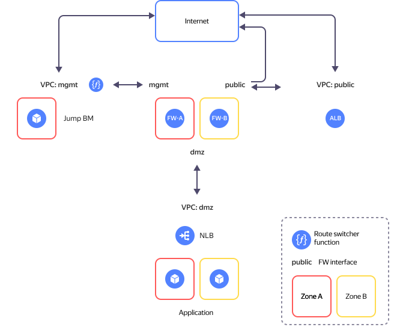

# Implementing a secure high-availability network infrastructure with a dedicated DMZ based on Smart-Soft NGFW

In this tutorial, we will deploy a secure network infrastructure based on [Smart-Soft Traffic Inspector Next Generation (TING)](https://www.smart-soft.ru/). The infrastructure is made up of segments, each containing single-purpose resources, isolated from other resources. For example, the [DMZ](https://en.wikipedia.org/wiki/DMZ_(computing)) segment is reserved for public-facing applications, whereas the `mgmt` segment contains infrastructure management resources. Each segment will have its own cloud folder and a dedicated {{ vpc-short-name }} [cloud network](../../vpc/concepts/network.md#network). The segments communicate with each other via a [next-generation firewall (NGFW)](https://en.wikipedia.org/wiki/Next-generation_firewall) VM, which provides end-to-end protection and traffic control across the segments.

You can see the solution architecture in the diagram below.



The solution comprises these main segments (folders):

* The **public** folder for internet-facing resources.
* The **mgmt** folder for cloud infrastructure management and internal resources. It includes two VMs for infrastructure protection and network segmentation into security zones (`fw-a` and `fw-b`) and a VM with [WireGuard VPN](https://www.wireguard.com/) configured for secure access to the management segment (`jump-vm`).
* **dmz** that enables you to publish open-access applications.

For more information, see the [project repository](https://github.com/yandex-cloud-examples/yc-dmz-with-high-available-ting-ngfw).

To deploy a secure high-availability network infrastructure with a dedicated DMZ based on Smart-Soft TING:

1. [Get your cloud ready](#prepare-cloud).
1. [Set up your environment](#prepare-environment).
1. [Deploy your resources](#create-resources).
1. [Configure the NGFW](#configure-ngfw).
1. [Enable the route switcher](#enable-route-switcher).
1. [Test the solution for performance and fault tolerance](#test-accessibility).
1. [Requirements for production deployment](#deployment-requirements).

If you no longer need the resources you created, [delete them](#clear-out).

### Next-Generation Firewall {#next-generation-firewall}

An NGFW is used for cloud network protection and segmentation with a dedicated DMZ for public-facing applications.

[{{ marketplace-full-name }}]({{ link-cloud-marketplace }}?categories=security) offers multiple NGFW solutions. This scenario uses the [Smart-Soft Traffic Inspector Next Generation (TING)]({{ link-cloud-marketplace }}/products/smartsoft/smart-soft-ting-ngfw-utm-fstek) solution offering this functionality:

* Next generation firewall: Protects the virtual network from unauthorized access from outside, provides NAT, port forwarding, and packet interception.
* Intrusion detection and prevention system: IDS/IPS recognizes sources of attacks and attacked devices based on specific network traffic signatures and effectively _cleans_ traffic.
* General purpose TCP/UDP proxy server: Nginx-based proxy server provides load balancing, web server header overriding, TCP and UDP traffic handling.
* Listed in the Russian Software Register, TING is certified by FSTEC of Russia for compliance with requirements for Safety Class 4 Type B firewalls, Safety Class 4 network-level intrusion detection systems, as well as Trust Level 4 information security requirements.

In this tutorial, Smart-Soft TING uses a basic firewall and NAT rule configuration.

Learn more about what Smart-Soft TING can do in this [documentation]({{ link-cloud-marketplace }}/products/smartsoft/smart-soft-ting-ngfw-utm-fstek#links).

## Get your cloud ready {#prepare-cloud}



### Required paid resources {#paid-resources}

The infrastructure support cost includes:

* Fee for continuously running VMs (see [{{ compute-full-name }} pricing](../../compute/pricing.md)).
* Fee for using {{ alb-name }} (see [{{ alb-full-name }} pricing](../../application-load-balancer/pricing.md)).
* Fee for using {{ network-load-balancer-name }} (see [{{ network-load-balancer-full-name }} pricing](../../network-load-balancer/pricing.md)).
* Fee for using public IP addresses and outgoing traffic (see [{{ vpc-full-name }} pricing](../../vpc/pricing.md)).
* Fee for using functions (see [{{ sf-full-name }} pricing](../../functions/pricing.md)).
* Fee for using [Smart-Soft TING](/marketplace/products/smartsoft/smart-soft-ting-ngfw-utm-fstek).

### Required quotas {#required-quotes}



In this tutorial, you will deploy a resource-intensive infrastructure.



Make sure you have sufficient cloud [quotas](../../overview/concepts/quotas-limits.md) not used by other projects.



   | Resource                            | Quantity         |
   |-------------------------------------|------------------|
   | Folders                             | 3                |
   | Instance groups                     | 1                |
   | Virtual machines                    | 5                |
   | VM vCPUs                            | 14               |
   | VM RAM                              | 22 GB            |
   | Disks                               | 5                |
   | SSD size                            | 200 GB           |
   | HDD size                            | 30 GB            |
   | Networks                            | 3                |
   | Subnets                             | 6                |
   | Route tables                        | 2                |
   | Security groups                     | 6                |
   | Static public IP addresses          | 4                |
   | Public IP addresses                 | 4                |
   | Static routes                       | 5                |
   | Buckets                             | 1                |
   | Functions {{ sf-name }}             | 1                |
   | Triggers                            | 1                |
   | Total RAM for all running functions | 128 MB           |
   | {{ network-load-balancer-name }} load balancers | 2    |
   | {{ network-load-balancer-name }} target groups | 2     |
   | {{ alb-name }} load balancers       | 1                |
   | {{ alb-name }} backend groups       | 1                |
   | {{ alb-name }} target groups        | 1                |



## Set up your environment {#prepare-environment}

### Create a cloud administrator service account {#create-account}
   


- Management console {#console}

   1. In the [management console]({{ link-console-main }}), select the [folder](../../resource-manager/concepts/resources-hierarchy.md#folder) where you want to create your service account.
   1. In the list of services, select **{{ ui-key.yacloud.iam.folder.dashboard.label_iam }}**.
   1. Click **{{ ui-key.yacloud.iam.folder.service-accounts.button_add }}**.
   1. Specify the service account name, e.g., `sa-terraform`.

       The naming requirements are as follows:

       

       

   1. Click **{{ ui-key.yacloud.iam.folder.service-account.popup-robot_button_add }}**.

   1. Assign the admin [role](../../iam/concepts/access-control/roles.md) to the service account:

       1. On the management console [home page]({{ link-console-main }}), select your cloud.
       1. Navigate to the **{{ ui-key.yacloud.common.resource-acl.label_access-bindings }}** tab.
       1. Click **{{ ui-key.yacloud.common.resource-acl.button_configure-access }}**.
       1. In the window that opens, click **{{ ui-key.yacloud_components.acl.label.service-accounts }}** and select the `sa-terraform` service account.
       1. Click  **{{ ui-key.yacloud_components.acl.button.add-role }}** and select the `admin` role.
       1. Click **{{ ui-key.yacloud_components.acl.action.apply }}**.

- CLI {#cli}

   

   

   1. Create a service account:

         ```bash
         yc iam service-account create --name sa-terraform
         ```

         Where `name` is the service account name. The naming requirements are as follows:

         

         Result:

         ```text
         id: ajehr0to1g8b********
         folder_id: b1gv87ssvu49********
         created_at: "2024-01-04T09:03:11.665153755Z"
         name: sa-terraform
         ```
      
   1. Assign the admin [role](../../iam/concepts/access-control/roles.md) to the account:

         ```bash
         yc resource-manager cloud add-access-binding <cloud_ID> \
           --role admin \
           --subject serviceAccount:<service_account_ID>
         ```

         Result:

         ```text
         done (1s)
         ```

- API {#api}

   To create a service account, use the [create](../../iam/api-ref/ServiceAccount/create.md) REST API method for the [ServiceAccount](../../iam/api-ref/ServiceAccount/index.md) resource or the [ServiceAccountService/Create](../../iam/api-ref/grpc/ServiceAccount/create.md) gRPC API call.

   



### Install the required tools {#install-utilities}

1. Install [Git](https://en.wikipedia.org/wiki/Git) using the following command:

   ```bash
   sudo apt install git
   ```

1. Install {{ TF }}:

   1. Navigate to the root directory:

      ```bash
      cd ~
      ```

   1. Create the `terraform` directory and open it:
   
      ```bash
      mkdir terraform
      cd terraform
      ```

   1. [Select](../../tutorials/infrastructure-management/terraform-quickstart.md#install-terraform) the {{ TF }} version and distribution for your platform. In this tutorial, we use the {{ TF }} distribution version 1.12.1 for Linux. Download the file:

      ```bash
      curl \
        --location \
        --remote-name \
        https://hashicorp-releases.yandexcloud.net/terraform/1.12.1/terraform_1.12.1_linux_arm64.zip
      ```

   1. Install `zip` and unpack the ZIP archive:
      
      ```bash
      apt install zip
      unzip terraform_1.12.1_linux_arm64.zip
      ```

   1. Add the path to the directory with the executable to the `PATH` variable: 
      
      ```bash
      export PATH=$PATH:~/terraform
      ```

   1. Make sure {{ TF }} is installed by running this command:
   
      ```bash
      terraform -help
      ```

1. Create a configuration file specifying the {{ TF }} provider source:

   1. Create the `.terraformrc` file in `nano`:

      ```bash
      cd ~
      nano .terraformrc
      ```

   1. Add the following section to the file:

      ```text
      provider_installation {
        network_mirror {
          url = "https://terraform-mirror.yandexcloud.net/"
          include = ["registry.terraform.io/*/*"]
        }
        direct {
          exclude = ["registry.terraform.io/*/*"]
        }
      }
      ```

      For more information about mirror settings, see the relevant [{{ TF }} guides](https://www.terraform.io/cli/config/config-file#explicit-installation-method-configuration).

## Deploy your resources {#create-resources}

1. Clone the GitHub [repository](https://github.com/yandex-cloud-examples/yc-dmz-with-high-available-ting-ngfw) and navigate to the `yc-dmz-with-high-available-ting-ngfw` script directory:
   
   ```bash
   git clone https://github.com/yandex-cloud-examples/yc-dmz-with-high-available-ting-ngfw.git
   cd yc-dmz-with-high-available-ting-ngfw
   ```

1. Set up the CLI profile to run operations under the service account:

   

   - CLI {#cli}

      

      

      1. Create an [authorized key](../../iam/concepts/authorization/key.md) for the service account and save it to the file:
         
         ```bash
         yc iam key create \
           --service-account-id <service_account_ID> \
           --folder-id <ID_of_folder_with_service_account> \
           --output key.json
         ```

         Where:
         
         * `service-account-id`: Service account ID.
         * `folder-id`: ID of the folder where you created the service account.
         * `output`: Authorized key file name.

         Result:
         
         ```text
         id: aje8nn871qo4********
         service_account_id: ajehr0to1g8b********
         created_at: "2023-03-04T09:16:43.479156798Z"
         key_algorithm: RSA_2048
         ```

      1. Create a CLI profile to run operations under the service account:
        
         ```bash
         yc config profile create sa-terraform
         ```

         Result:
         
         ```text
         Profile 'sa-terraform' created and activated
         ```

      1. Configure the profile:
         
         ```bash
         yc config set service-account-key key.json
         yc config set cloud-id <cloud_ID>
         yc config set folder-id <folder_ID>
         ```

         Where:

         * `service-account-key`: Service account authorized key file.
         * `cloud-id`: [Cloud ID](../../resource-manager/operations/cloud/get-id.md).
         * `folder-id`: [Folder ID](../../resource-manager/operations/folder/get-id.md).

      1. Add your credentials to the environment variables:
         
         ```bash
         export YC_TOKEN=$(yc iam create-token)
         ```

   

1. Get your PC's IP address:
      
   ```bash
   curl 2ip.ru
   ```

   Result:
   
   ```text
   192.2**.**.**
   ```

1. Open the `terraform.tfvars` file in `nano` and edit the following:

   1. Cloud ID line:
      
      ```text
      cloud_id = "<cloud_ID>"
      ```

   1. Line with a list of public IP addresses allowed to access `jump-vm`:
      
      ```text
      trusted_ip_for_access_jump-vm = ["<external_IP_address_of_your_PC>/32"]
      ```

   

   | Parameter<br>name | Change<br>required | Description | Type | Example |
   | ----------- | ----------- | ----------- | ----------- | ----------- |
   | `cloud_id` | Yes | Your cloud ID in {{ yandex-cloud }} | `string` | `b1g8dn6s3v2e********` |
   | `az_name_list` | - | List of two {{ yandex-cloud }} <a href="../../overview/concepts/geo-scope">availability zones</a> to host your resources | `list(string)` | `["{{ region-id }}-a", "{{ region-id }}-b"]` |
   | `security_segment_names` | - | List of segment names. The first segment for management resources, the second for internet-facing resources, and the third for DMZ. If you need more segments, add them at the end of the list. When adding a segment, make sure to specify the subnet prefixes in `zone1_subnet_prefix_list` and `zone2_subnet_prefix_list`. | `list(string)` |  `["mgmt", "public", "dmz"]` |
   | `zone1_subnet_prefix_list` | - | List of network prefixes in the first availability zone for subnets as per the `security_segment_names` list. Specify one prefix for each segment from the `security_segment_names` list. | `list(string)` | `["192.168.1.0/24", "172.16.1.0/24", "10.160.1.0/24"]` |
   | `zone2_subnet_prefix_list` | - | List of network prefixes in the second availability zone for subnets as per the `security_segment_names` list. Specify one prefix for each segment from the `security_segment_names` list. | `list(string)` | `["192.168.2.0/24", "172.16.2.0/24", "10.160.2.0/24"]` |
   | `public_app_port` | - | DMZ application's TCP port for connection from the internet | `number` | `80` |
   | `internal_app_port` | - | DMZ application's internal TCP port for incoming NGFW traffic. You may specify the same port as `public_app_port` or a different one. | `number` | `8080` |
   | `trusted_ip_for_access_jump-vm` | Yes | List of public IP addresses and subnets you can use to connect to the jump VM. Used in the incoming rule of the jump VM security group. | `list(string)` | `["A.A.A.A/32", "B.B.B.0/24"]` |
   | `vm_admin_username` | - | Jump VM username for SSH connections | `string` | `vm-admin` |
   | `fw_admin_username` | - | Username for connection to FW via HTTPS and SSH | `string` | `admin` |
   | `wg_port` | - | Jump VM WireGuard inbound UDP port | `number` | `51820` |
   | `wg_client_dns` | - | List of DNS server addresses in the management cloud network the admin workstation will use after establishing the WireGuard tunnel to the jump VM. | `string` | `192.168.1.2, 192.168.2.2` |

   

1. Deploy your cloud resources using {{ TF }}:

   1. Initialize {{ TF }}:
       
      ```bash
      terraform init
      ```

   1. Check the {{ TF }} file configuration:
       
      ```bash
      terraform validate
      ```

   1. Check the list of new cloud resources:
       
      ```bash
      terraform plan
      ```

   1. Create the resources:
       
      ```bash
      terraform apply
      ```

1. Once the process is completed, you will see the list of created resources. You can also display this list with the `terraform output` command:

   

   | Name | Description | Value (example) |
   | ----------- | ----------- | ----------- |
   | `dmz-web-server-nlb_ip_address` | IP address of the load balancer in the `dmz` segment downstream of which there is a target group with web servers to test publishing an application from the DMZ. Configuring destination NAT on the firewall. | `"10.160.1.100"` |
   | `fw-a_admin_password` | Default password for accessing FW-A | `"fv4a3n5eqf2dbddg4t3h"` |
   | `fw-a_ip_address` | FW-A IP address in the management network | `"192.168.1.10"` |
   | `fw-alb_public_ip_address` | ALB public IP address. It is used to access the application published in the DMZ from the internet. | `"C.C.C.C"` |
   | `fw-b_admin_password` | Default password for accessing FW-B | `"epdn4qrm1imbakudbu5c"` |
   | `fw-b_ip_address` | FW-B IP address in the management network | `"192.168.2.10"` |
   | `jump-vm_path_for_WireGuard_client_config` | WireGuard VPN jump VM connection configuration file | `"./jump-vm-wg.conf"` |
   | `jump-vm_public_ip_address_jump-vm` | Jump VM public IP address | `"D.D.D.D"` |
   | `path_for_private_ssh_key` | File with a private key used to connect to the VM (`jump-vm`, `fw-a`, `fw-b`, web servers in the `dmz` segment) over SSH | `"./pt_key.pem"` |
   
   

## Configure the NGFW {#configure-ngfw}

This tutorial describes how to configure firewalls FW-A and FW-B with basic firewall and NAT rules required for performance and fault tolerance tests for the purposes of this guide but insufficient for [production deployment](#deployment-requirements).

### Connect to the management segment via a VPN {#connect-via-vpn}

After deploying the infrastructure, the `mgmt` folder will contain the `jump-vm` Ubuntu instance with the configured [WireGuard VPN](https://www.wireguard.com/) providing secure connection. Set up a VPN tunnel to `jump-vm` on your PC to access the `mgmt`, `dmz`, and `public` segment subnets.

You can also connect to the jump VM over SSH using the SSH key from `terraform output` and the username from the `vm_admin_username` variable.

To set up a VPN tunnel:

1. [Install](https://www.wireguard.com/install/) WireGuard on your PC.
1. Open WireGuard and click **Add Tunnel**.
1. In the dialog that opens, select the `jump-vm-wg.conf` file in the `yc-dmz-with-high-available-ting-ngfw` directory.
1. Click **Activate** to activate the tunnel.
1. Check network connectivity with the management server via the WireGuard VPN tunnel by running the following command in the terminal:
   
   ```bash
   ping 192.168.1.101
   ```

   

   If the packets fail to reach the management server, make sure the `mgmt-jump-vm-sg` [security group](../../vpc/concepts/security-groups.md) rules for incoming traffic have your PC external IP address specified correctly.

   

### Configure the FW-A firewall {#configure-fw-a}

Connect to the FW-A management web interface at `https://192.168.1.10`. Admin credentials: login from the `fw_admin_username` variable value, password from the `terraform output fw-a_admin_password` output (without quotes).

#### Configure your network {#configure-fw-a-network}

1. In the **Summary** section of the left-hand menu, select **Password**. Enter the old password from the `terraform output fw-a_admin_password` output and set a new password.

1. In the **System** section of the left-hand menu, select **Settings** -> **General**. In the **Hostname** field, specify `fw-a`. In the **Time zone** field, select your time zone. Under **DNS servers**, enter `192.168.1.2` as the IP address of the cloud DNS server in the `mgmt` segment. Click **Save**.

1. In the left-hand menu, in the **Services** section, select **Network time** -> **General**. In the **Time servers** section, specify the addresses of NTP servers (see the [list of recommended NTP servers](../../tutorials/infrastructure-management/ntp.md)). Tick the checkbox next to the preferred server in the **Prefer** column. Click **Save**.

1. In the left-hand menu, in the **Interfaces** section, select **\[WAN\]**. In the **Description** field, specify `mgmt`. Click **Save**.

1. In the left-hand menu, in the **System** section, select **Routes** -> **Configuration**. Click `+` to add a route. In the **Network address** field, specify `192.168.2.0/24`. In the **Gateway** field, select `MGMT_DHCP - 192.168.1.1`. In the **Description** field, specify `route to mgmt-zone2`. Click **Save**. Click **Apply**.

1. In the left-hand menu, in the **Interfaces** section, select **Port destinations**. In the **New interface** field, select `vtnet1` for port and put `public` in the **Description** field. Click `+`. In the **New interface** field, select `vtnet2` for port and put `dmz` in the **Description** field. Click `+`. Click **Save**.

1. In the left-hand menu, in the **Interfaces** section, select **\[public\]**. In the **Enabled** field, tick the **Enable interface** checkbox. In the **IPv4 configuration type** field, select `DHCP`. Click **Save**.

1. In the left-hand menu, in the **Interfaces** section, select **\[dmz\]**. In the **Enabled** field, tick the **Enable interface** checkbox. In the **IPv4 configuration type** field, select `DHCP`. Click **Save**.

1. An interface configuration update message will appear at the top of the page. Click **Apply changes**.

1. In the left-hand menu, in the **System** section, select **Routes** -> **Configuration**. Click `+` to add a route. Add static routes based on the table below. Once all routes are added, click **Apply**.

| Network address        | Gateway                   | Description                     |
|-------------------|------------------------|-----------------------------|
| `10.160.2.0/24`   | `DMZ_DHCP - 10.160.1.1` | `route to dmz-zone2`        |
| `198.18.235.0/24` | `MGMT_DHCP - 192.168.1.1` | `route to nlb-healthcheck-net1` |
| `198.18.248.0/24` | `MGMT_DHCP - 192.168.1.1` | `route to nlb-healthcheck-net2` |

1. In the left-hand menu, in the **System** section, select **Gateways** -> **Single**. In the `PUBLIC_DHCP` gateway line, click the pencil symbol. In the **Main gateway** field, tick the checkbox and click **Save**. At the top of the page, click **Apply changes**.

#### Diagnostics for basic settings {#diagnostics-base-settings-fw-a}

1. In the left-hand menu, in the **System** section, select **Routes** -> **Status**. Make sure the routing information output includes the static routes you added and the default `172.16.1.1` gateway.

1. In the left-hand menu, in the **Interfaces** section, select **Diagnostics** -> **View DNS records**. In the **Host name or IP address** field, enter the internet domain name of the resource, e.g., `ya.ru`. Click **View DNS records** and check that the domain name resolves to public IP addresses.

1. In the left-hand menu, in the **Interfaces** section, select **Diagnostics** -> **Ping**. In the **Host** field, enter the internet domain name of the resource, e.g., `ya.ru`. Click **Ping** and check that ping is successful. In the **Host** field, enter the IP address of the default `192.168.1.1` cloud gateway in the `mgmt` segment. Click **Ping** and check that ping is successful.

   ```
   ---  ping statistics ---
   3 packets transmitted, 3 packets received, 0.0% packet loss
   round-trip min/avg/max/stddev = 0.293/0.471/0.664/0.152 ms
   ```

#### Configuring basic security policies {#configure-base-security}

1. In the left-hand menu, in the **Firewall** section, select **Aliases**. Use the `+` button to add aliases based on the table below. After you add all aliases on the **Firewall: Aliases** page, click **Apply**.

| Name            | Type       | Contents                     |
|----------------|-----------|--------------------------------|
| `mgmt`         | Network      | `192.168.1.0/24`<br>`192.168.2.0/24` |
| `dmz`          | Network      | `10.160.1.0/24`<br>`10.160.2.0/24` |
| `public`       | Network      | `172.16.1.0/24`<br>`172.16.2.0/24` |
| `healthcheck_net` | Network     | `198.18.235.0/24`<br>`198.18.248.0/24` |
| `dmz_web_server` | Host  | `10.160.1.100` |
| `TCP_8080`     | Port  | `8080` |
| `yandex`       | Host  | `ya.ru` |

1. In the left-hand menu, in the **Firewall** section, select **Rules** -> **mgmt**. By default, TING has rules that allow access to the FW network interface in the `mgmt` segment via ports `443`, `22`, `80`. Edit these rules by clicking on the pencil symbol next to each rule in turn:
   * The rule for port `80` is used for FW health checks by the `route-switcher-lb-...` NLB. In the **Sender** field, select `healthcheck_net` as alias. In the **Description** field, specify `NLB healthcheck`. Click **Save**.
   * The rule for port `443` is used to manage FW over HTTPS. In the **Sender** field, select `mgmt` as alias. In the **Description** field, specify `HTTPS FW management`. Optionally, in the **Logging** field, tick the **Log packets matching the rule** checkbox. Click **Save**.
   * The rule for port `22` is used to manage FW over SSH. In the **Sender** field, select `mgmt` as alias. In the **Description** field, specify `SSH FW management`. Optionally, in the **Logging** field, tick the **Log packets matching the rule** checkbox. Click **Save**.

1. In the firewall rules for the `mgmt` interface, add a rule for access from the `mgmt` segment to the `dmz` segment for management purposes. To add a rule, click `+`. In the **Sender** field, select `mgmt` as alias. In the **Recipient** field, select `dmz` as alias. In the **Description** field, specify `mgmt to dmz`. Optionally, in the **Logging** field, tick the **Log packets matching the rule** checkbox. Click **Save**.

1. In the left-hand menu, in the **Firewall** section, select **Rules** -> **dmz**. For a performance and fault tolerance test, add a rule to send ICMP packets from the `dmz` segment to the `ya.ru` domain on the internet. To add a rule, click `+`. In the **Protocol** field, select `ICMP`. Leave any ICMP type. In the **Sender** field, select `dmz` as alias. In the **Recipient** field, select `yandex` as alias. In the **Description** field, specify `ping from dmz to ya.ru`. Optionally, in the **Logging** field, tick the **Log packets matching the rule** checkbox. Click **Save**.

1. After adding all the rules on the **Firewall: Rules: dmz** page, click **Apply**.

   

     The network packet is checked for compliance with the rules from the top down. You can reorder the rules in the list.

     If a network packet complies with a rule, the action specified in the rule is applied to the packet. If a rule is applied to a packet, the firewall stops processing the packet: this packet will no longer be checked against the remaining rules in the list.

     If a network packet fails to comply with any of the rules, the packet gets blocked (i.e., discarded without indication to the remote side).

   

1. In the left-hand menu, in the **Firewall** section, select **NAT** -> **Port redirection**. Add a rule to route user requests to the network load balancer in the `dmz` segment downstream of which the application's web server group is located. Click `+` to add a rule. In the **Interface** field, select only the `public` interface. In the **Sender** field, select **Additional**, then select `public` as alias. In the **Recipient** field, select `public address`. In the **Destination port range** field, select `TCP_8080` for the **from:** and **to:** fields. In the **Redirect target IP address** field, select `dmz_web_server` as alias. In the **Redirect target port** field, select `TCP_8080`. Optionally, in the **Logging** field, tick the packet logging checkbox. In the **Description** field, specify `DNAT public to dmz-web-server`. In the **Filter rule association** field, select `Add associated rule`. Click **Save**.

1. In the left-hand menu, in the **Firewall** section, select **NAT** -> **Outbound**. In the **Mode** section, enable `Manual creation of outbound NAT rules (rules will not be created automatically)`. Click **Save**.

1. On the **Firewall: NAT: Outbound** page, add a rule requiring that the application responds through the same firewall the user's request had come through:
   * Click `+` to add a rule.
   * In the **Interface** field, select `dmz`.
   * In the **Protocol** field, select `TCP`.
   * In the **Source IP address** field, select `public` as alias.
   * In the **Destination IP address** field, select `dmz_web_server` as alias.
   * In the **Destination port** field, select `TCP_8080`.
   * In the **Broadcast IP address / target IP address** field, leave `Interface address`.
   * Optionally, in the **Logging** field, tick the **Log packets matching the rule** checkbox.
   * In the **Description** field, specify `SNAT public to dmz-web-server`.
   * Click **Save**.

1. On the **Firewall: NAT: Outbound** page, add a rule to provide access to the internet from the `dmz` segment, so that the headers of packets with requests from the `dmz` segment to the internet were translated to the Source IP of the FW-a interface in the `public` segment:
   * Click `+` to add a rule.
   * In the **Interface** field, select `public`.
   * In the **Source IP address** field, select `dmz` as alias.
   * In the **Broadcast IP address / target IP address** field, leave `Interface address`.
   * Optionally, in the **Logging** field, tick the **Log packets matching the rule** checkbox.
   * In the **Description** field, specify `SNAT dmz to public`.
   * Click **Save**.

1. After you add all NAT rules on the **Firewall: NAT: Outbound** page, select **Apply changes**.

   

     After you are done configuring firewall rules, NAT rules, and checking FW management access, you can disable the management anti-blocking rule. Before you disable anti-blocking, make sure you have a firewall rule in place that allows you to connect to the FW management interface. Otherwise, you will block management access for yourself.

     To disable management anti-blocking, select **Settings** -> **Additional** in the left-hand menu in the **Firewall** section. In the **Disable anti-blocking** field, check **Disable management anti-blocking rule**. Click **Save**.

   

### Configure the FW-B firewall {#configure-fw-b}

Connect to the FW-B management web interface at `https://192.168.2.10`. Admin credentials: login from the `fw_admin_username` variable value, password from the `terraform output fw-b_admin_password` output (without quotes).

#### Configure your network {#configure-fw-b-network}

1. In the **Summary** section of the left-hand menu, select **Password**. Enter the old password from the `terraform output fw-b_admin_password` output and set a new password.

1. In the **System** section of the left-hand menu, select **Settings** -> **General**. In the **Hostname** field, specify `fw-b`. In the **Time zone** field, select your time zone. Under **DNS servers**, enter `192.168.2.2` as the IP address of the cloud DNS server in the `mgmt` segment. Click **Save**.

1. In the left-hand menu, in the **Services** section, select **Network time** -> **General**. In the **Time servers** section, specify the addresses of NTP servers (see the [list of recommended NTP servers](../../tutorials/infrastructure-management/ntp.md)). Tick the checkbox next to the preferred server in the **Prefer** column. Click **Save**.

1. In the left-hand menu, in the **Interfaces** section, select **\[WAN\]**. In the **Description** field, specify `mgmt`. Click **Save**.

1. In the left-hand menu, in the **System** section, select **Routes** -> **Configuration**. Click `+` to add a route. In the **Network address** field, specify `192.168.1.0/24`. In the **Gateway** field, select `MGMT_DHCP - 192.168.2.1`. In the **Description** field, specify `route to mgmt-zone1`. Click **Save**. Click **Apply**.

1. In the left-hand menu, in the **Interfaces** section, select **Port destinations**. In the **New interface** field, select `vtnet1` for port and put `public` in the **Description** field. Click `+`. In the **New interface** field, select `vtnet2` for port and put `dmz` in the **Description** field. Click `+`. Click **Save**.

1. In the left-hand menu, in the **Interfaces** section, select **\[public\]**. In the **Enabled** field, tick the **Enable interface** checkbox. In the **IPv4 configuration type** field, select `DHCP`. Click **Save**.

1. In the left-hand menu, in the **Interfaces** section, select **\[dmz\]**. In the **Enabled** field, tick the **Enable interface** checkbox. In the **IPv4 configuration type** field, select `DHCP`. Click **Save**.

1. An interface configuration update message will appear at the top of the page. Click **Apply changes**.

1. In the left-hand menu, in the **System** section, select **Routes** -> **Configuration**. Click `+` to add a route. Add static routes based on the table below. Once all routes are added, click **Apply**.

   | Network address | Gateway | Description |
   | --- | --- | --- |
   | `10.160.1.0/24` | `DMZ_DHCP - 10.160.2.1` | `route to dmz-zone1` |
   | `198.18.235.0/24` | `MGMT_DHCP - 192.168.2.1` | `route to nlb-healthcheck-net1` |
   | `198.18.248.0/24` | `MGMT_DHCP - 192.168.2.1` | `route to nlb-healthcheck-net2` |

1. In the left-hand menu, in the **System** section, select **Gateways** -> **Single**. In the `PUBLIC_DHCP` gateway line, click the pencil symbol. In the **Main gateway** field, tick the checkbox and click **Save**. At the top of the page, click **Apply changes**.

#### Diagnostics for basic settings {#diagnostics-base-settings-fw-b}

1. In the left-hand menu, in the **System** section, select **Routes** -> **Status**. Make sure the routing information output includes the static routes you added and the default `172.16.2.1` gateway.

1. In the left-hand menu, in the **Interfaces** section, select **Diagnostics** -> **View DNS records**. In the **Host name or IP address** field, enter the internet domain name of the resource, e.g., `ya.ru`. Click **View DNS records** and check that the domain name resolves to public IP addresses.

1. In the left-hand menu, in the **Interfaces** section, select **Diagnostics** -> **Ping**. In the **Host** field, enter the internet domain name of the resource, e.g., `ya.ru`. Click **Ping** and check that `ping` is successful. In the **Host** field, enter the IP address of the default `192.168.2.1` cloud gateway in the `mgmt` segment. Click **Ping** and check that `ping` is successful.

   ```
   ---  ping statistics ---
   3 packets transmitted, 3 packets received, 0.0% packet loss
   round-trip min/avg/max/stddev = 0.371/0.462/0.638/0.125 ms
   ```

#### Configuring basic security policies {#configure-base-security-fw-b}

[Configure basic security policies](#configure-base-security) same as for FW-A.

## Enable the route switcher {#enable-route-switcher}

After you complete the NGFW setup, make sure FW-A and FW-B health checks return `Healthy`. To do this, in the {{ yandex-cloud }} [management console]({{ link-console-main }}), navigate to the `mgmt` folder, select **{{ network-load-balancer-name }}**, and go to the `route-switcher-lb-...` page. Expand the target group and make sure the targets are `Healthy`. If they are `Unhealthy`, check that FW-A and FW-B are up and running and properly [configured](#configure-gateways).

Once FW-A and FW-B get the `Healthy` status, change the `route-switcher` module's `start_module` value to `true` in the `route-switcher.tf` file. To enable the module, run these commands:

```bash
terraform plan
terraform apply
```

Within five minutes, the `route-switcher` module will start working, providing outbound traffic fault tolerance.

## Test the solution for performance and fault tolerance {#test-accessibility}

### Test the system {#test-accessibility}

1. To get the load balancer public IP address, run this command in the terminal:

   ```bash
   terraform output fw-alb_public_ip_address
   ```

1. Make sure your network infrastructure is accessible from outside by opening the following address in your browser:
    
   ```text
   http://<ALB_load_balancer_public_IP_address>
   ```
   You should see the `Welcome to nginx!` page.

1. Make sure the firewall rules allowing traffic are active. Do this by navigating to the `yc-dmz-with-high-available-ting-ngfw` folder on your PC and connecting to one of the DMZ VMs over SSH. Use the login from the `vm_admin_username` variable value for connection:

   ```bash
   cd yc-dmz-with-high-available-ting-ngfw
   ssh -i pt_key.pem <login>@<VM_internal_IP_address_in_DMZ_segment>
   ```

1. Connect to the FW-A management web interface at `https://192.168.1.10`. In the left-hand menu, in the **Firewall** section, select **Logs** -> **Live view**. In the log filter, select `label`, then `contains` and `ping from dmz to ya.ru`. Click `+`.

1. To check whether or not the DMZ VM can access a public resource on the internet, run this command:
   
   ```bash
   ping ya.ru
   ```

   The `ping from dmz to ya.ru` rule should allow the command to run.

1. On the **Firewall: Logs: Live view** page, check whether there is a record for allowed traffic to `ya.ru`. Stop the ping.

1. Make sure the firewall traffic-blocking rules are active.

   To check that `Jump VM` in the `mgmt` segment cannot be accessed from the `dmz` segment, run this command:

   ```bash
   ping 192.168.1.101
   ```
   The command should end with an error as per the firewall's default blocking rule.

### Testing fault tolerance {#fault-tolerance-check}

1. Install the `httping` utility for periodical HTTP requests on your PC:

   ```bash
   sudo apt-get install httping
   ```

1. To get the load balancer public IP address, run this command in the terminal:

   ```bash
   terraform output fw-alb_public_ip_address
   ```

1. Initiate DMZ application inbound traffic by making a request to the ALB public IP address:

   ```bash
   httping http://<ALB_load_balancer_public_IP_address>
   ```

1. Open another terminal window and connect to one of the DMZ VMs over SSH. Use the login from the `vm_admin_username` variable value for connection:
   
   ```bash
   ssh -i pt_key.pem <login>@<VM_internal_IP_address_in_DMZ_segment>
   ```

1. Set a password for the user specified in the `vm_admin_username` variable:

   ```bash
   sudo passwd <user_name>
   ```

1. In the {{ yandex-cloud }} [management console]({{ link-console-main }}), change the settings of this VM:

   1. In the list of services, select **{{ ui-key.yacloud.iam.folder.dashboard.label_compute }}**.
   1. In the left-hand panel, select  **{{ ui-key.yacloud.compute.group.switch_instances }}**.
   1. Click  next to the VM you need and select  **{{ ui-key.yacloud.common.edit }}**.
   1. In the window that opens, under **{{ ui-key.yacloud.compute.instances.create.section_additional }}**, enable **{{ ui-key.yacloud.compute.instance.overview.field_serial-port-enable }}**.
   1. Click **{{ ui-key.yacloud.compute.instance.edit.button_update }}**.

1. Connect to the VM serial console, enter the username specified in the `vm_admin_username` variable and the password you created earlier.

1. Initiate outbound traffic from the DMZ VM to an internet resource by running `ping`:

   ```bash
   ping ya.ru
   ```

1. Emulate the main firewall failure by [stopping](../../compute/operations/vm-control/vm-stop-and-start.md#stop) the `FW-A` VM in the `mgmt` folder of the {{ yandex-cloud }} [management console]({{ link-console-main }}).
1. Monitor the loss of `httping` and `ping` packets. After FW-A fails, you may experience a traffic loss for about one minute, then traffic should recover.
1. Make sure the `dmz-rt` route table uses the FW-B address for `next hop` in the `dmz` folder.
1. Emulate the main firewall recovery by [running](../../compute/operations/vm-control/vm-stop-and-start.md#start) the `FW-A` VM in the {{ yandex-cloud }} [management console]({{ link-console-main }}).
1. Monitor the loss of `httping` and `ping` packets. After FW-A recovers, you may experience a traffic loss for about one minute, then traffic should recover.
1. Make sure the `dmz-rt` route table uses the FW-A address for `next hop` in the `dmz` folder.

## Production deployment requirements {#deployment-requirements}

* Save the `pt_key.pem` private SSH key to a secure location or recreate it without using {{ TF }}.
* Delete the public IP address of the jump VM if you are not going to use it.
* If your plan is to use it for connection to the management segment via WireGuard VPN, change the WireGuard keys both on the jump VM and admin workstation.
* Configure Smart-Soft TING for your specific needs in line with the corporate security policy.
* Do not assign public IP addresses to the VMs in segments where Smart-Soft TING routing tables with a default route of `0.0.0.0/0` are used (more on it [here](../../vpc/concepts/routing.md#restrictions)). The exception is the `mgmt` segment, where routing tables do not use the `0.0.0.0/0` default route. 

## How to delete the resources you created {#clear-out}

To stop paying for the resources you created, run this command:

   ```bash
   terraform destroy
   ```

   

   {{ TF }} will **permanently** delete all resources, such as networks, subnets, VMs, load balancers, folders, etc.

   

As the resources you created reside in folders, a faster way to delete all resources is to delete all the folders using the {{ yandex-cloud }} [management console]({{ link-console-main }}) and then delete the `terraform.tfstate` file from the `yc-dmz-with-high-available-ting-ngfw` folder on your PC.
