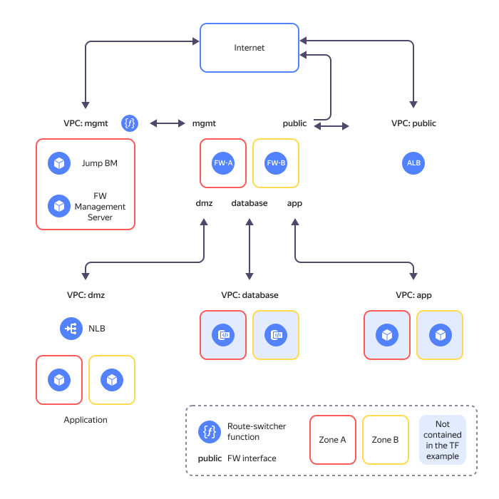

# Implementing a secure high-availability network infrastructure with a dedicated DMZ based on the Check Point NGFW


In this tutorial, we will deploy a high-availability fail-safe network infrastructure with a dedicated [DMZ](https://en.wikipedia.org/wiki/DMZ_(computing)) segment and comprehensive protection based on the [Check Point next-generation firewall](https://www.checkpoint.com/ru/cloudguard/cloud-network-security/iaas-public-cloud-security/).

The infrastructure elements reside in two [availability zones](../../overview/concepts/geo-scope.md); we will also group them by purpose, placing the groups into different [folders](../../resource-manager/concepts/resources-hierarchy.md#folder). This solution enables you to publish web resources, e.g., front-end applications, in a DMZ, restricting access to the internal network and thus ensuring its extra security.



We will use the following folders:

* The **public** folder contains [{{ alb-name }}](../../application-load-balancer/) enabling public access to DMZ applications.
* The **mgmt** folder contains NGFW firewalls and other resources, including `FW-A` and `FW-B` firewall VMs, `mgmt-server`, which is a firewall management server VM, and `jump-vm`, a VM for accessing the VPN protected segment.
* The **dmz** folder contains publicly accessible applications.
* The **app** and **database** folders contain application business logic; we will not use them in this tutorial.

For more information, see the [project repository](https://github.com/yandex-cloud-examples/yc-dmz-with-high-available-ngfw/blob/main/README.md).

To deploy a secure high-availability network infrastructure with a dedicated DMZ based on the Check Point next-generation firewall:

1. [Get your cloud ready](#prepare-cloud).
1. [Prepare the environment](#prepare-environment).
1. [Deploy your resources](#create-resources).
1. [Set up firewall gateways](#configure-gateways).
1. [Enable the route-switcher module](#enable-route-switcher).
1. [Test the solution for performance and fault tolerance](#test-accessibility).

If you no longer need the resources you created, [delete them](#clear-out).

## Next-Generation Firewall {#ngfw}

We will use a next generation firewall for cloud network protection and segmentation, creating a dedicated DMZ for publicly accessible applications. [{{ marketplace-full-name }}]({{ link-cloud-marketplace }}?categories=security) offers multiple NGFW solutions.

In this scenario, we use the [Check Point CloudGuard IaaS]({{ link-cloud-marketplace }}/products/checkpoint/cloudguard-iaas-firewall-tp-payg-m) solution offering the following features:

* Firewalling
* NAT
* Intrusion prevention
* Antivirus
* Bot protection
* Application layer granular traffic control
* Session logging
* Centralized management with Check Point Security Management

In this tutorial, we will configure Check Point CloudGuard IaaS with basic access control and NAT policies.

## Get your cloud ready {#prepare-cloud}



### Required paid resources {#paid-resources}

The infrastructure support cost includes:

* Fee for continuously running VMs (see [{{ compute-full-name }} pricing](../../compute/pricing.md)).
* Fee for using {{ alb-name }} (see [{{ alb-full-name }} pricing](../../application-load-balancer/pricing.md)).
* Fee for using {{ network-load-balancer-name }} (see [{{ network-load-balancer-full-name }} pricing](../../network-load-balancer/pricing.md)).
* Fee for IP addresses and outbound traffic (see [{{ vpc-full-name }} pricing](../../vpc/pricing.md)).
* Fee for using functions (see [{{ sf-full-name }} pricing](../../functions/pricing.md)).
* Fee for using [CheckPoint NGFW](/marketplace/products/checkpoint/cloudguard-iaas-firewall-tp-payg-m).

### Required quotas {#required-quotes}



In this tutorial, you will have to deploy a resource-intensive infrastructure.



Make sure your cloud has sufficient [quotas](../../overview/concepts/quotas-limits.md) that are not used by other projects.



   | Resource | Amount |
   | ----------- | ----------- |
   | Folders | 7 |
   | Instance groups | 1 |
   | Virtual machines | 6 |
   | VM vCPUs | 18 |
   | VM RAM | 30 GB |
   | Disks | 6 |
   | SSD size | 360 GB |
   | HDD size | 30 GB |
   | Cloud networks | 7 |
   | Subnets | 14 |
   | Route tables | 4 |
   | Security groups | 10 |
   | Static public IP addresses | 2 |
   | Public IP addresses | 2 |
   | Static routes | 17 |
   | Buckets | 1 |
   | Cloud functions | 1 |
   | Cloud function triggers | 1 |
   | Total RAM for all running functions | 128 MB |
   | Network load balancers (NLBs) | 2 |
   | NLB target groups | 2 |
   | Application load balancers (ALBs) | 1 |
   | ALB backend groups | 1 |
   | ALB target groups | 1 |



## Prepare the environment {#prepare-environment}

In this tutorial, we will use Windows software and [Windows Subsystem for Linux](https://en.wikipedia.org/wiki/Windows_Subsystem_for_Linux) (WSL).
To deploy the infrastructure, we will use [{{ TF }}](https://www.terraform.io/).

### Configure WSL {#setup-wsl}

1. Check whether WSL is installed on your PC. To do this, run this command in the CLI terminal:

   ```bash
   wsl -l
   ```

   If WSL is installed, the terminal will display a list of available distributions, for example:

   ```bash
   Windows Subsystem for Linux Distributions:
   docker-desktop (Default)
   docker-desktop-data
   Ubuntu
   ```

1. If WSL is not installed, [install](https://learn.microsoft.com/en-us/windows/wsl/install) it and repeat the previous step.
1. Additionally, you can install your preferred Linux distribution, e.g., [Ubuntu](https://ubuntu.com/tutorials/install-ubuntu-on-wsl2-on-windows-11-with-gui-support#1-overview), on top of WSL.
1. To set the installed distribution as default, run this command:

   ```bash
   wsl --setdefault ubuntu
   ```

1. To switch the terminal to Linux, run:

   ```bash
   wsl ~
   ```



Perform all steps below in the Linux terminal.



### Create a cloud administrator service account {#create-account}



- Management console

   1. In the [management console]({{ link-console-main }}), select the [folder](../../resource-manager/concepts/resources-hierarchy.md#folder) where you want to create your service account.
   1. In the list of services, select **{{ ui-key.yacloud.iam.folder.dashboard.label_iam }}**.
   1. Click **{{ ui-key.yacloud.iam.folder.service-accounts.button_add }}**.
   1. Specify the service account name, e.g., `sa-terraform`.

       The name should match the following format:

       

       

   1. Click **{{ ui-key.yacloud.iam.folder.service-account.popup-robot_button_add }}**.

   1. Assign the admin [role](../../iam/concepts/access-control/roles.md) to the service account.

       1. On the management console [home page]({{ link-console-main }}), select your cloud.
       1. Navigate to the **{{ ui-key.yacloud.common.resource-acl.label_access-bindings }}** tab.
       1. Click **{{ ui-key.yacloud.common.resource-acl.button_configure-access }}**.
       1. In the window that opens, click **{{ ui-key.yacloud_components.acl.label.service-accounts}}** and select the `sa-terraform` service account.
       1. Click  **{{ ui-key.yacloud_components.acl.button.add-role }}** and select the `admin` role.
       1. Click **{{ ui-key.yacloud_components.acl.action.apply }}**.

- CLI

   

   

   1. Create a service account:

         ```bash
         yc iam service-account create --name sa-terraform
         ```

         Where `name` is the service account name. The name should meet the following requirements:

         

         Result:

         ```text
         id: ajehr0to1g8bh0la8c8r
         folder_id: b1gv87ssvu497lpgjh5o
         created_at: "2023-03-04T09:03:11.665153755Z"
         name: sa-terraform
         ```

   1. Assign the admin [role](../../iam/concepts/access-control/roles.md) to the account:

         ```bash
         yc resource-manager cloud add-access-binding <cloud_ID> \
           --role admin \
           --subject serviceAccount:<service_account_ID>
         ```

         Result:

         ```text
         done (1s)
         ```

- API

   To create a service account, use the [create](../../iam/api-ref/ServiceAccount/create.md) REST API method for the [ServiceAccount](../../iam/api-ref/ServiceAccount/index.md) resource or the [ServiceAccountService/Create](../../iam/api-ref/grpc/ServiceAccount/create.md) gRPC API call.

   



### Install the required tools {#install-utilities}

1. Install [Git](https://en.wikipedia.org/wiki/Git) using the following command:

   ```bash
   sudo apt install git
   ```

1. Install {{ TF }}:

   1. Navigate to the root directory:

      ```bash
      cd ~
      ```

   1. Create the `terraform` directory and open it:

      ```bash
      mkdir terraform
      cd terraform
      ```

   1. Download the `terraform_1.3.9_linux_amd64.zip` file:

      ```bash
      curl \
        --location \
        --remote-name \
        https://hashicorp-releases.yandexcloud.net/terraform/1.3.9/terraform_1.3.9_linux_amd64.zip
      ```

   1. Install `zip` and unpack the ZIP archive:

      ```bash
      apt install zip
      unzip terraform_1.3.9_linux_amd64.zip
      ```

   1. Add the executable directory to your `PATH`:

      ```bash
      export PATH=$PATH:~/terraform
      ```

   1. Make sure {{ TF }} is installed by running this command:

      ```bash
      terraform -help
      ```

1. Create a configuration file specifying the {{ TF }} provider source:

   1. Create the `.terraformrc` file in `nano`:

      ```bash
      cd ~
      nano .terraformrc
      ```

   1. Add the following section to the file:

      ```text
      provider_installation {
        network_mirror {
          url = "https://terraform-mirror.yandexcloud.net/"
          include = ["registry.terraform.io/*/*"]
        }
        direct {
          exclude = ["registry.terraform.io/*/*"]
        }
      }
      ```

      For more information about mirror settings, see the relevant [{{ TF }}](https://www.terraform.io/cli/config/config-file#explicit-installation-method-configuration) guides.

## Deploy your resources {#create-resources}

1. Clone the `yandex-cloud-examples/yc-dmz-with-high-available-ngfw` GitHub repository and navigate to the `yc-dmz-with-high-available-ngfw` directory:

    ```bash
    git clone https://github.com/yandex-cloud-examples/yc-dmz-with-high-available-ngfw.git
    cd yc-dmz-with-high-available-ngfw
    ```

1. Set up the CLI profile to run operations on behalf of the service account:

   

   - CLI

      

      

      1. Create an [authorized key](../../iam/concepts/authorization/key.md) for your service account and save it to the file:

         ```bash
         yc iam key create \
           --service-account-id <service_account_ID> \
           --folder-id <ID_of_folder_with_service_account> \
           --output key.json
         ```

         Where:

         * `service-account-id`: Service account ID.
         * `folder-id`: ID of the service account folder.
         * `output`: Authorized key file name.

         Result:

         ```text
         id: aje8nn871qo4********
         service_account_id: ajehr0to1g8b********
         created_at: "2023-03-04T09:16:43.479156798Z"
         key_algorithm: RSA_2048
         ```

      1. Create a CLI profile to run operations on behalf of the service account:

         ```bash
         yc config profile create sa-terraform
         ```

         Result:

         ```text
         Profile 'sa-terraform' created and activated
         ```

      1. Configure the profile:

         ```bash
         yc config set service-account-key key.json
         yc config set cloud-id <cloud_ID>
         yc config set folder-id <folder_ID>
         ```

         Where:

         * `service-account-key`: Authorized key file name.
         * `cloud-id`: [Cloud ID](../../resource-manager/operations/cloud/get-id.md).
         * `folder-id`: [Folder ID](../../resource-manager/operations/folder/get-id.md).

      1. Add your credentials to the environment variables:

         ```bash
         export YC_TOKEN=$(yc iam create-token)
         export YC_CLOUD_ID=$(yc config get cloud-id)
         export YC_FOLDER_ID=$(yc config get folder-id)
         ```

    

1. Get your PC IP address:

      ```bash
      curl 2ip.ru
      ```

      Result:

      ```text
      192.2**.**.**
      ```

1. Open the `terraform.tfvars` file in `nano` and edit it as follows:

   1. The cloud ID line:

      ```text
      cloud_id = "<cloud_ID>"
      ```

   1. The line with a list of allowed public IP addresses for `jump-vm` access:

      ```text
      trusted_ip_for_access_jump-vm = ["<PC_external_IP_address>/32"]
      ```

1. Deploy the resources in the cloud with {{ TF }}:

   1. Initialize {{ TF }}:

       ```bash
       terraform init
       ```

   1. Check the {{ TF }} file configuration:

       ```bash
       terraform validate
       ```

   1. Check the list of cloud resources you want to create:

       ```bash
       terraform plan
       ```

   1. Create resources:

       ```bash
       terraform apply
       ```

## Set up firewall gateways {#configure-gateways}

In this tutorial, we will configure `FW-A` and `FW-B` firewalls with basic access management and NAT policies required to test performance and fault tolerance, but insufficient for the production environment.

### Connect to the control segment via a VPN {#connect-via-vpn}

After deploying the infrastructure, the `mgmt` folder will contain an Ubuntu `jump-vm` instance with a configured [WireGuard VPN](https://www.wireguard.com/) allowing secure connections. Set up a VPN tunnel between your PC and `mgmt`, `dmz`, `app`, and `database` segment subnets through `jump-vm`.

To set up the VPN tunnel:

1. Get your Linux username:

   ```bash
   whoami
   ```

1. [Install](https://download.wireguard.com/windows-client/wireguard-installer.exe) WireGuard on your PC.
1. Open WireGuard and click **Add Tunnel**.
1. In the dialog that opens, select the `jump-vm-wg.conf` file in the `yc-dmz-with-high-available-ngfw` directory.

   To find a Linux, e.g., Ubuntu, directory, type the file path in the dialog address bar:

   ```bash
   \\wsl$\Ubuntu\home\<Ubuntu_user_name>\yc-dmz-with-high-available-ngfw
   ```

   Where `<Ubuntu_user_name>` is your Linux username you got in the previous step.

1. Click **Activate** to activate the tunnel.
1. Check whether you can connect to the management server via WireGuard VPN by running this command in the terminal:

   ```bash
   ping 192.168.1.100
   ```

   

   If `ping` fails, make sure the `mgmt-jump-vm-sg` [security group](../../vpc/concepts/security-groups.md) inbound rules include your PC external IP address.

   


### Run SmartConsole {#setup-smartconsole}

To set up and manage [Check Point](https://en.wikipedia.org/wiki/Check_Point), install and run the SmartConsole GUI client: 

1. Connect to the NGFW management server by opening `https://192.168.1.100` in your browser.
1. Sign in using `admin` as both username and password.
1. You will enter Gaia Portal where you can download the SmartConsole GUI client by clicking **Manage Software Blades using SmartConsole. Download Now!**.
1. Install SmartConsole on your PC.
1. Get a password to access SmartConsole by running this command in the terminal:

    ```bash
    terraform output fw_smartconsole_mgmt-server_password
    ```

1. Open SmartConsole and sign in as `admin` with the password you got in the previous step, specifying `192.168.1.100` as your management server IP address.

### Add firewall gateways {#add-gateways}

Use the wizard to add the `FW-A` firewall gateway to the management server:

1. In the **Objects** drop-down list at the top left, select **More object types → Network Object → Gateways and Servers → New Gateway...**.
1. Click **Wizard Mode**.
1. In the dialog that opens, specify the following:

   * **Gateway name**: `FW-A`
   * **Gateway platform**: `CloudGuard IaaS`
   * **IPv4**: `192.168.1.10`

1. Click **Next**.
1. Get the firewall password by running this command in the terminal:

    ```bash
    terraform output fw_sic-password
    ```

1. Enter the received password in the **One-time password** field.
1. Click **Next**, and then **Finish**.

Similarly, add the `FW-B` firewall gateway with the values below:

   * **Gateway name**: `FW-B`
   * **IPv4**: `192.168.2.10`

### Configure the `FW-A` gateway network interfaces {#setup-gateways-fw-a}

Configure the `eth0` network interface:

1. In the **Gateways & Servers** tab, open the `FW-A` gateway setup dialog.
1. In the **Topology** table within the **Network Management** tab, select the `eth0` interface and click **Modify...**.
1. Under **Leads To**, select **Override**.
1. Next to the **Specific** option, hover over the `FW-A-eth0` interface name and click the edit icon in the window that opens.
1. In the dialog that opens, rename `FW-A-eth0` to `mgmt`.
1. Under **Security Zone**, activate **Specify Security Zone** and select **InternalZone**.

Similarly, configure the `eth1`, `eth2`, `eth3`, and `eth4` network interfaces:

1. For the `eth1` interface, select **ExternalZone** under **Security Zone**. Do not rename this interface.
1. Rename the `eth2` interface to `dmz`, enable **Interface leads to DMZ**, and specify **DMZZone**.

   Set up **Automatic Hide NAT** to hide the addresses of internet-facing VMs hosted in the DMZ segment. To do this:

      1. In the `dmz` interface edit dialog, click `Net_10.160.1.0` and navigate to the **NAT** tab.
      1. Enable **Add automatic address translation rules**, select **Hide** from the drop-down list, and then enable **Hide behind gateway**.
      1. Repeat these steps for `Net_10.160.2.0`.

1. Rename the `eth3` interface to `app` and specify **InternalZone**.
1. Rename the `eth4` interface to `database` and specify **InternalZone**.

### Configure the `FW-B` gateway network interfaces {#setup-gateways-fw-b}

Configure the `FW-B` gateway network interfaces the same way as you did for `FW-A`. Give the interfaces existing names from the list.

To select an already specified interface name:

1. Under **Leads To**, select **Override**.
1. Find the relevant name in the drop-down list next to the **Specific** option.



Renaming the interfaces the second time will cause the network object name replication error when setting security policies.




### Create network objects {#create-network-objects}

1. In the **Objects** drop-down list at the top left, select **New Network...** and create `public - a` and `public - b` networks with the following parameters:

    | Name | Network address | Net mask |
    | ----------- | ----------- | ----------- |
    | public - a | 172.16.1.0 | 255.255.255.0 |
    | public - b | 172.16.2.0 | 255.255.255.0 |

1. Select **New Network Group...**, create the `public` group, and add the `public - a` and `public - b` networks to it.
1. Select **New Host...** and create hosts with the following parameters:

    | Name | IPv4 address |
    | ----------- | ----------- |
    | dmz-web-server | 10.160.1.100 |
    | FW-a-dmz-IP | 10.160.1.10 |
    | FW-a-public-IP | 172.16.1.10 |
    | FW-b-dmz-IP | 10.160.2.10 |
    | FW-b-public-IP | 172.16.2.10 |

1. Select **More object types → Network Object → Service → New TCP...** and create a TCP service for the DMZ application, specifying its name: `TCP_8080`  and port: `8080`.

### Set security policy rules {#define-policies}

To add a security rule:

1. In the **Security policies** tab, select **Policy** under **Access Control**.
1. Right-click the rule table area and, in the context menu that opens, select **Above** or **Below** next to **New Rule**.
1. In the new line that appears:
   * In the **Name** column, specify `Web-server port forwarding on FW-a`.
   * In the **Source** column, click `+` and select `public`.
   * In the **Destination** column, select `FW-a-public-IP`.
   * In the **Services & Applications** column, select `TCP_8080`.
   * In the **Action** column, select `Accept`.
   * In the **Track** column, select `Log`.
   * In the **Install On** column, select `FW-a`.


In the same way, add other rules from the table below; these rules will allow you to test the firewall policies, pass NLB health checks, publish a test application from the DMZ segment, and run a fault tolerance test.

   | No | Name | Source | Destination | VPN | Services & Applications | Action | Track | Install On |
   | ----------- | ----------- | ----------- | ----------- | ----------- | ----------- | ----------- | ----------- | ----------- |
   | 1 | Web-server port forwarding on FW-a | public | FW-a-public-IP | Any | TCP_8080 | Accept | Log | FW-a |
   | 2 | Web-server port forwarding on FW-b | public | FW-b-public-IP | Any | TCP_8080 | Accept | Log | FW-b |
   | 3 | FW management & NLB healthcheck | mgmt | FW-a, FW-b, mgmt-server | Any | https, ssh | Accept | Log | Policy Targets (All gateways)  |
   | 4 | Stealth | Any | FW-a, FW-b, mgmt-server | Any | Any | Drop | Log | Policy Targets (All gateways) |
   | 5 | mgmt to DMZ | mgmt | dmz | Any | Any | Accept | Log | Policy Targets (All gateways) |
   | 6 | mgmt to app | mgmt | app | Any | Any | Accept | Log | Policy Targets (All gateways) |
   | 7 | mgmt to database | mgmt | database | Any | Any | Accept | Log | Policy Targets (All gateways) |
   | 8 | ping from dmz to internet | dmz | ExternalZone | Any | icmp-requests (Group) | Accept | Log | Policy Targets (All gateways) |
   | 9 | Cleanup rule | Any | Any | Any | Any | Drop | Log | Policy Targets (All gateways) |

### Set up a static NAT table {#setup-static-nat}

`Source NAT` ensures that the return traffic of the user’s connection returns to the firewall. `Destination NAT` routes user requests to the network load balancer upstream of the group of application web servers.

`Source IP` and `Destination IP` headers of packets coming from {{ alb-name }} to the DMZ application will be translated to the firewall IP and load balancer IP, respectively.

To set up the `FW-A` gateway NAT table:

1. Navigate to the **NAT** section under **Access Control**.
1. Right-click the rule table area and, in the context menu that opens, select **Above** or **Below** next to **New Rule**.
1. In the new line that appears:
   * In the **Original Source** column, click `+` and select `public`.
   * In the **Original Destination** column, select `FW-a-public-IP `.
   * In the **Original Services** column, select `TCP_8080`.
   * In the **Translated Source** column, select `FW-a-dmz-IP`.
   * In the **Translated Destination** column, select `dmz-web-server`.
   * In the **Install On** column, select `FW-a`.
1. Change the NAT method for `FW-a-dmz-IP` by right-clicking `FW-a-dmz-IP` in the table and selecting **NAT Method > Hide** from the context menu.

In the same way, set up the `FW-B` gateway static NAT table based on the table below:

   | No | Original Source | Original Destination | Original Services | Translated Source | Translated Destination | Translated Services | Install On |
   | ----------- | ----------- | ----------- | ----------- | ----------- | ----------- | ----------- | ----------- |
   | 1 | public | FW-a-public-IP | TCP_8080 | FW-a-dmz-IP (Hide) | dmz-web-server | Original | FW-a |
   | 2 | public | FW-b-public-IP | TCP_8080 | FW-b-dmz-IP (Hide) | dmz-web-server | Original | FW-b |

### Apply the security policy rules {#apply-policies}

1. Click **Install Policy** at the top left of the screen.
1. In the dialog that opens, click **Push & Install**.
1. In the next dialog, click **Install** and wait for the process to complete.

## Enable the route-switcher module {#enable-route-switcher}

After completing the NGFW setup, make sure `FW-A` and `FW-B` health checks return `Healthy`. To do this, select **{{ ui-key.yacloud.iam.folder.dashboard.label_load-balancer }}** in the `mgmt` folder of the {{ yandex-cloud }} [management console]({{ link-console-main }}) and navigate to the `route-switcher-lb-...` network load balancer page. Expand the target group and check whether its resources are `Healthy`. If they are `Unhealthy`, make sure `FW-A` and `FW-B` are [configured](#configure-gateways) correctly and running. 

Once the `FW-A` and `FW-B` status changes to `Healthy`, open the `route-switcher.tf` file and change the `route-switcher` `start_module` value to `true`. To enable the module, run these commands:

```bash
terraform plan
terraform apply
```

Within five minutes, the `route-switcher` module will start working, providing outbound traffic fault tolerance.

## Test the solution for performance and fault tolerance {#test-accessibility}

### Test the system {#test-accessibility}

1. To get the load balancer IP address, run this command in the terminal:

    ```bash
    terraform output fw-alb_public_ip_address
    ```

1. Make sure your network infrastructure is accessible from outside by opening the following address in your browser:

    ```bash
    http://<ALB_load_balancer_public_IP_address>
    ```
    If your system is accessible from outside, you will see the `Welcome to nginx!` page.

1. Make sure the firewall rules allowing traffic are active. To do this, navigate to the `yc-dmz-with-high-available-ngfw` folder on your PC and connect to a DMZ VM over SSH:

    ```bash
    cd ~/yc-dmz-with-high-available-ngfw
    ssh -i pt_key.pem admin@<VM_internal_IP_address_in_DMZ_segment>
    ```

1. To check whether there is internet access on the DMZ VM, run this command:

    ```bash
    ping ya.ru
    ```

    The `ping from dmz to internet` rule should allow the command to run.

1. Make sure the firewall traffic-blocking rules are active.

   To check that `Jump VM` in the `mgmt` segment cannot be accessed from the `dmz` segment, run this command:

   ```bash
   ping 192.168.1.101
   ```

   The `Cleanup rule` should block the command.

### Testing fault tolerance {#fault-tolerance-check}

1. Install the `httping` tool for making HTTP requests on your PC:

    ```bash
    sudo apt-get install httping
    ```

1. To get the load balancer IP address, run this command in the terminal:

    ```bash
    terraform output fw-alb_public_ip_address
    ```

1. Emulate the DMZ application inbound traffic by making a request to the ALB public IP address:

    ```bash
    httping http://<ALB_load_balancer_public_IP_address>
    ```

1. Open another terminal window and connect to a DMZ VM over SSH:

    ```bash
    ssh -i pt_key.pem admin@<VM_internal_IP_address_in_DMZ_segment>
    ```

1. Set `admin` password:

    ```bash
    sudo passwd admin
    ```

1. In the {{ yandex-cloud }} [management console]({{ link-console-main }}), change the settings of this VM:

    1. In the list of services, select **{{ ui-key.yacloud.iam.folder.dashboard.label_compute }}**.
    1. In the left-hand panel, select  **{{ ui-key.yacloud.compute.switch_instances }}**.
    1. Click  next to the VM you need and select  **{{ ui-key.yacloud.common.edit }}**.
    1. In the window that opens, under **{{ ui-key.yacloud.compute.instances.create.section_additional }}**, enable **{{ ui-key.yacloud.compute.instances.create.field_serial-port-enable }}**.
    1. Click **{{ ui-key.yacloud.compute.instance.edit.button_update }}**.

1. Connect to the VM serial console, enter the `admin` username and password you set earlier.

1. Emulate the DMZ to internet outbound traffic by running `ping` on the DMZ VM:

    ```bash
    ping ya.ru
    ```

1. Emulate the main firewall failure by [stopping](../../compute/operations/vm-control/vm-stop-and-start.md#stop) the `FW-A` VM in the `mgmt` folder of the {{ yandex-cloud }} [management console]({{ link-console-main }}).
1. Monitor the loss of `httping` and `ping` packets. After `FW-A` fails, you may see a traffic loss for about one minute with the subsequent traffic recovery.
1. Make sure the `dmz-rt` route table in the `dmz` folder uses the `FW-B` address as `next hop`.
1. Emulate the main firewall recovery by [running](../../compute/operations/vm-control/vm-stop-and-start.md#start) the `FW-A` VM in the {{ yandex-cloud }} [management console]({{ link-console-main }}).
1. Monitor the loss of `httping` and `ping` packets. After `FW-A` is restored, you may see a traffic loss for about one minute with the subsequent traffic recovery.
1. Make sure the `dmz-rt` route table in the `dmz` folder uses the `FW-A` address as `next hop`.

## How to delete the resources you created {#clear-out}

To stop paying for the resources you created, run this command:

  ```bash
  terraform destroy
  ```
  {{ TF }} will **permanently** delete all resources, such as networks, subnets, VMs, load balancers, folders, etc.

You can delete the resources faster by deleting all folders in the {{ yandex-cloud }} console and then deleting the `terraform.tfstate` file from the `yc-dmz-with-high-available-ngfw` folder on your PC.
