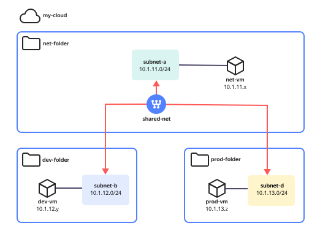

# Setting up networking between resources in different folders


In {{ yandex-cloud }}, network resources, such as cloud network and subnets, are usually created in a single resource cloud folder that is not linked to resources in other cloud folders. When deploying resources in {{ yandex-cloud }}, it is often necessary to ensure networking between resources residing in different folders. One of the ways to do that is using the `Multi-folder VPC` method that extends the scope of an individual {{ vpc-short-name }} network to multiple rather than one folder.

Depending on the selected {{ yandex-cloud }} management interface, a network's scope is extended to other folders by:

* Moving subnets to other cloud folders using the `management console (UI)` and `YC CLI`.
* Creating subnets in target folders using `YC CLI`.
* Creating subnets in target folders using `Terraform`.

After that, you can connect VMs, {{ managed-k8s-name }} clusters, database hosts, load balancers, load testing agents, and other resources residing in these folders, to the subnets hosted in target folders. As a result, your network will ensure connectivity between resources in different folders.

This guide provides an example of how to create an infrastructure consisting of three VM instances, each residing in a different folder. These instances are connected via a shared internal network. Network connectivity between cloud resources hosted in different folders is established by creating a cloud network in one of these folders and then extending its scope to other folders. This way, a single-folder network is extended to multiple folders, which allows connecting required resources to `extended subnets` residing in these folders.



You can only move subnets between folders within a single cloud.



For example, the development environment includes the CI/CD module whose components are hosted in the `net-folder`. This module should enable networking between the **dev**, **stage**, and **prod** components residing in their folders.

This solution pattern is shown below.



This will set up networking between VMs from different environments (folders) connected to different subnets in one network. Furthermore, all VMs will be able to communicate with one another both by IPs and their FQDNs (over DNS).

## Steps to follow {#order}

Depending on the selected management interface, steps to create `Multi-folder VPC` may differ.

To create a test infrastructure and enable networking between resources:

1. [Prepare your cloud](#prepare-cloud).
1. [Create folders without a {{ vpc-short-name }} network](#create-folders).
1. [Create a {{ vpc-short-name }} cloud network with subnets](#create-vpc).
1. [Move the subnets](#move-subnets).
1. [Create VM instances](#create-vms).
1. [Check the networking](#check-connectivity).

If you no longer need the resources you created, [delete them](#clear-out).

## Prepare your cloud {#prepare-cloud}




### Required paid resources {#paid-resources}

The infrastructure support costs include:

* Fee for continuously running VMs (see [{{ compute-full-name }} pricing](../../compute/pricing.md)).
* Fee for using public IP addresses and outgoing traffic (see [{{ vpc-full-name }} pricing](../../vpc/pricing.md)).


### Configure access permissions {#roles}

Set up [access rights for the folder](../../resource-manager/operations/folder/set-access-bindings.md):

* To create networks and manage subnets, assign the `vpc.admin` or the `vpc.privateAdmin`, `vpc.publicAdmin`, and `vpc.securityGroups.admin` service roles to the service account or user.
* To create and manage VMs in the folder, assign the `vpc.user` and `compute.admin` service roles.

For granular network access, use [security groups](../../vpc/concepts/security-groups.md).

## Create folders without a {{ vpc-short-name }} network {#create-folders}

1. Created the `net-folder`, `dev-folder`, and `prod-folder` folders:

   

   - Management console {#console}

     1. In the [management console]({{ link-console-main }}), select a [cloud](../../resource-manager/concepts/resources-hierarchy.md#cloud) and click  **{{ ui-key.yacloud.component.console-dashboard.button_action-create-folder }}**.
     1. Enter the [folder](../../resource-manager/concepts/resources-hierarchy.md#folder) name: `net-folder`.
     1. Disable **{{ ui-key.yacloud.iam.cloud.folders-create.field_default-net }}** to create your network and subnets manually.
     1. Click **{{ ui-key.yacloud.iam.cloud.folders-create.button_create }}**.

     Similarly, create two more folders without the {{ vpc-short-name }} network, and name them `dev-folder` and `prod-folder`.

   - CLI {#cli}

     

     

     To create resources using the CLI, [get authenticated](../../cli/operations/authentication/service-account.md#auth-as-sa) using the [service account](../../iam/concepts/users/service-accounts.md) that has the `admin` [role](../../iam/concepts/access-control/roles.md) for the [cloud](../../resource-manager/concepts/resources-hierarchy.md#cloud).

     

     1. View the description of the create folder command:

        ```bash
        yc resource-manager folder create --help
        ```

     1. Created the `net-folder`, `dev-folder`, and `prod-folder` cloud folders:

        ```bash
        yc resource-manager folder create --name net-folder
        yc resource-manager folder create --name dev-folder
        yc resource-manager folder create --name prod-folder
        ```

   - {{ TF }} {#tf}

     1. 

     1. Specify the {{ yandex-cloud }} Terraform provider configuration:

         ```hcl
        # ==================================
        # Terraform & Provider Configuration
        # ==================================
        terraform {
          required_providers {
              yandex = {
                source  = "yandex-cloud/yandex"
                version = "~> 0.92.0"
              }
          }
        }
        ```

     1. Describe the input variables:

        ```hcl
        variable "cloud_id" {
          description = "YC cloud-id. Taken from environment variable."
        }
        ```

     1. Describe the targets (cloud folders):

        ```hcl
        # ========
        # Folders
        # ========
        resource "yandex_resourcemanager_folder" "net_folder" {
          cloud_id = var.cloud_id
          name     = "net-folder"
        }

        resource "yandex_resourcemanager_folder" "dev_folder" {
          cloud_id = var.cloud_id
          name     = "dev-folder"
        }

        resource "yandex_resourcemanager_folder" "prod_folder" {
          cloud_id = var.cloud_id
          name     = "prod-folder"
        }
        ```

     1. Create the required infrastructure:

        1. Run the following commands:

           ```bash
           export TF_VAR_cloud_id=$(yc config get cloud-id)
           export YC_TOKEN=$(yc iam create-token)
           terraform apply
           ```

        1. Confirm updating the resources and wait for the operation to complete.

   - API {#api}

     Use the [create](../../resource-manager/api-ref/Folder/create.md) REST API method for the [Folder](../../resource-manager/api-ref/Folder/) resource or the [FolderService/Create](../../resource-manager/api-ref/grpc/Folder/create.md) gRPC API call.

   

## Create a {{ vpc-short-name }} cloud network with subnets {#create-vpc}

In `net-folder`, create a network named `shared-net` with three subnets that have the following settings:

| Subnet name | Prefix | Availability zone | Target folder |
| --- | --- | --- | --- |
| `subnet-a` | `10.1.11.0/24` | `{{ region-id }}-a` | `net-folder` |
| `subnet-b` | `10.1.12.0/24` | `{{ region-id }}-b` | `dev-folder` |
| `subnet-d` | `10.1.13.0/24` | `{{ region-id }}-d` | `prod-folder` |

1. Create a [cloud network](../../vpc/concepts/network.md):

   

   - Management console {#console}

     1. In the [management console]({{ link-console-main }}), go to `net-folder`.
     1. In the list of services, select **{{ vpc-name }}**.
     1. Click **{{ ui-key.yacloud.vpc.networks.button_create }}**.
     1. Enter the network name: `shared-net`.
     1. Disable [Create subnets](../../vpc/operations/subnet-create.md) to create subnets manually.
     1. Click **{{ ui-key.yacloud.vpc.networks.button_create }}**.

   - CLI {#cli}

     1. See the description of the CLI command for creating a cloud network:

        ```bash
        yc vpc network create --help
        ```

     1. Create the `shared-net` cloud network in `net-folder`.

        ```bash
        yc vpc network create --folder-name net-folder --name shared-net
        ```

   - {{ TF }} {#tf}

     1. Describe the target (cloud network):

        ```hcl
        # =============
        # VPC Resources
        # =============
        resource "yandex_vpc_network" "shared_net" {
          folder_id = yandex_resourcemanager_folder.net_folder.id
          name      = "shared-net"
        }
        ```

     1. Run the following commands:

        ```bash
        export TF_VAR_cloud_id=$(yc config get cloud-id)
        export YC_TOKEN=$(yc iam create-token)
        terraform apply
        ```

     1. Confirm updating the resources.

     1. Wait for the operation to complete.

   - API {#api}

     Use the [create](../../vpc/api-ref/Network/create.md) REST API method for the [Network](../../vpc/api-ref/Network/) resource or the [NetworkService/Create](../../vpc/api-ref/grpc/Network/create.md) gRPC API call.

   

1. Create [subnets](../../vpc/concepts/network.md#subnet) named `subnet-a`, `subnet-b`, and `subnet-d` in the `{{ region-id }}-a`, `{{ region-id }}-b`, and `{{ region-id }}-d` [availability zones](../../overview/concepts/geo-scope.md), respectively:

   

   - Management console {#console}

     1. In the [management console]({{ link-console-main }}), go to `net-folder`.
     1. In the list of services, select **{{ vpc-name }}**.
     1. Click the `shared-net` name.
     1. Click **{{ ui-key.yacloud.vpc.network.overview.button_create_subnetwork }}**.
     1. Enter the subnet name: `subnet-a`, `subnet-b`, or `subnet-d`, respectively.
     1. Select the availability zone (`{{ region-id }}-a`, `{{ region-id }}-b`, or `{{ region-id }}-d`, respectively) from the drop-down list.
     1. Enter the subnet CIDR: `10.1.11.0` as IP address and `24` as subnet mask. For more information about subnet IP address ranges, see [Cloud networks and subnets](../../vpc/concepts/network.md).
     1. Click **{{ ui-key.yacloud.vpc.subnetworks.create.button_create }}**.

   - CLI {#cli}

     1. See the description of the CLI command for creating a subnet:

        ```bash
        yc vpc subnet create --help
        ```

     1. Create subnets in the target folders:

        ```bash
        yc vpc subnet create --folder-name net-folder --name subnet-a \
          --network-name shared-net --zone {{ region-id }}-a --range 10.1.11.0/24

        yc vpc subnet create --folder-name dev-folder --name subnet-b \
          --network-name shared-net --zone {{ region-id }}-b --range 10.1.12.0/24

        yc vpc subnet create --folder-name prod-folder --name subnet-d \
          --network-name shared-net --zone {{ region-id }}-d --range 10.1.13.0/24
        ```

     1. Check the state of the created subnets:

        ```bash
        yc vpc subnet list --folder-name net-folder
        yc vpc subnet list --folder-name dev-folder
        yc vpc subnet list --folder-name prod-folder
        ```

   - {{ TF }} {#tf}

     1. Describe the targets (cloud subnets):

        ```hcl
        resource "yandex_vpc_subnet" "subnet_a" {
          folder_id      = yandex_resourcemanager_folder.net_folder.id
          name           = "subnet-a"
          description    = "NET folder subnet"
          v4_cidr_blocks = ["10.1.11.0/24"]
          zone           = "{{ region-id }}-a"
          network_id     = yandex_vpc_network.shared_net.id
        }

        resource "yandex_vpc_subnet" "subnet_b" {
          folder_id      = yandex_resourcemanager_folder.dev_folder.id
          name           = "subnet-b"
          description    = "DEV folder subnet"
          v4_cidr_blocks = ["10.1.12.0/24"]
          zone           = "{{ region-id }}-b"
          network_id     = yandex_vpc_network.shared_net.id
        }

        resource "yandex_vpc_subnet" "subnet_d" {
          folder_id      = yandex_resourcemanager_folder.prod_folder.id
          name           = "subnet-d"
          description    = "PROD folder subnet"
          v4_cidr_blocks = ["10.1.13.0/24"]
          zone           = "{{ region-id }}-d"
          network_id     = yandex_vpc_network.shared_net.id
        }
        ```

     1. Run the following commands:

        ```bash
        export TF_VAR_cloud_id=$(yc config get cloud-id)
        export YC_TOKEN=$(yc iam create-token)
        terraform apply
        ```

     1. Confirm updating the resources and wait for the operation to complete.

   - API {#api}

     Use the [create](../../vpc/api-ref/Subnet/create.md) REST API method for the [Subnet](../../vpc/api-ref/Subnet/) resource or the [SubnetService/Create](../../vpc/api-ref/grpc/Subnet/create.md) gRPC API call.

   

## Move the subnets {#move-subnets}

[Move](../../vpc/operations/subnet-move.md) the `subnet-b` subnet to `dev-folder`:



- Management console {#console}

  1. In the [management console]({{ link-console-main }}), go to `net-folder`.
  1. In the list of services, select **{{ vpc-name }}**.
  1. Click the `shared-net` name.
  1. In the `subnet-b` row, click  and select **{{ ui-key.yacloud.vpc.button_move-vpc-object }}**.
  1. In the drop-down list, select `dev-folder`.
  1. Click **{{ ui-key.yacloud.vpc.button_move-vpc-object }}**.

- CLI {#cli}

  1. View a description of the CLI move subnet command:

     ```bash
     yc vpc subnet move --help
     ```

  1. Move the subnet:

     ```bash
     yc vpc subnet move subnet-b \
       --destination-folder-name dev-folder
     ```

- API {#api}

  Use the [move](../../vpc/api-ref/Subnet/move.md) REST API method for the [Subnet](../../vpc/api-ref/Subnet/) resource or the [SubnetService/Move](../../vpc/api-ref/grpc/Subnet/move.md) gRPC API call.



Similarly, move `subnet-d` to `prod-folder`:

## Create VMs {#create-vms}

Create [VMs](../../compute/concepts/vm.md) with the following parameters:

| VM name | Folder | Availability zone | Subnet |
| --- | --- | --- | --- |
| `net-vm` | `net-folder` | `{{ region-id }}-a` | `subnet-a` |
| `dev-vm` | `dev-folder` | `{{ region-id }}-b` | `subnet-b` |
| `prod-vm` | `prod-folder` | `{{ region-id }}-d` | `subnet-d` |



- Management console {#console}

  Create a Linux VM named `net-vm` in `net-folder`:

  1. In the [management console]({{ link-console-main }}), select `net-folder`.
  1. Click **{{ ui-key.yacloud.iam.folder.dashboard.button_add }}** and select `{{ ui-key.yacloud.iam.folder.dashboard.value_compute }}`.
  1. Under **{{ ui-key.yacloud.compute.instances.create.section_image }}**, in the **{{ ui-key.yacloud.compute.instances.create.placeholder_search_marketplace-product }}** field, enter `Ubuntu 22.04 LTS` and select a public [Ubuntu 22.04 LTS](/marketplace/products/yc/ubuntu-22-04-lts) image.
  1. Under **{{ ui-key.yacloud.k8s.node-groups.create.section_allocation-policy }}**, select the `{{ region-id }}-a` [availability zone](../../overview/concepts/geo-scope.md).
  1. Under **{{ ui-key.yacloud.compute.instances.create.section_network }}**:

      * In the **{{ ui-key.yacloud.component.compute.network-select.field_subnetwork }}** field, select `subnet-a`.
      * Under **{{ ui-key.yacloud.component.compute.network-select.field_external }}**, keep `{{ ui-key.yacloud.component.compute.network-select.switch_auto }}` to assign your VM a random external IP address from the {{ yandex-cloud }} pool or select a static address from the list if you reserved one in advance.

  1. Under **{{ ui-key.yacloud.compute.instances.create.section_access }}**, select **{{ ui-key.yacloud.compute.instance.access-method.label_oslogin-control-ssh-option-title }}** and specify the data for access to the VM:

      * In the **{{ ui-key.yacloud.compute.instances.create.field_user }}** field, enter the username: `ycuser`.
      * 

  1. Under **{{ ui-key.yacloud.compute.instances.create.section_base }}**, specify the VM name: `net-vm`.
  1. Leave all other settings unchanged and click **{{ ui-key.yacloud.compute.instances.create.button_create }}**.

  Similarly, create VMs named `dev-vm` and `prod-vm` in the respective folders.

  

  A public and a private IP addresses are assigned to the VM when you create it. Write them down, as you will need them to access the VM and test networking with other VMs.

  

- CLI {#cli}

  1. Describe a template for VM metadata in a separate `vm-init.tpl` file:

     ```bash
     #cloud-config

     datasource:
       Ec2:
         strict_id: false
     ssh_pwauth: yes
     users:
       - name: "${USER_NAME}"
         sudo: ALL=(ALL) NOPASSWD:ALL
         shell: /bin/bash
         ssh_authorized_keys:
           - "${USER_SSH_KEY}"
     ```

  1. Generate a metadata file to deploy the VM:

     ```bash
     export USER_NAME=ycuser
     export USER_SSH_KEY=$(cat ~/.ssh/id_rsa.pub)
 
     envsubst < vm-init.tpl > vm-config.txt
     ```

  1. Create VMs:

     ```bash
     yc compute instance create --name=net-vm --hostname=net-vm \
       --zone={{ region-id }}-a \
       --platform=standard-v3 \
       --cores=2 --memory=4G --core-fraction=100 \
       --create-boot-disk image-folder-id=standard-images,image-family=ubuntu-2204-lts \
       --network-interface subnet-name=subnet-a,ipv4-address=auto,nat-ip-version=ipv4 \
       --metadata-from-file user-data=vm-config.txt

     yc compute instance create --name=dev-vm --hostname=dev-vm \
       --zone={{ region-id }}-b \
       --platform=standard-v3 \
       --cores=2 --memory=4G --core-fraction=100 \
       --create-boot-disk image-folder-id=standard-images,image-family=ubuntu-2204-lts \
       --network-interface subnet-name=subnet-b,ipv4-address=auto,nat-ip-version=ipv4 \
       --metadata-from-file user-data=vm-config.txt

     yc compute instance create --name=prod-vm --hostname=prod-vm \
       --zone={{ region-id }}-d \
       --platform=standard-v3 \
       --cores=2 --memory=4G --core-fraction=100 \
       --create-boot-disk image-folder-id=standard-images,image-family=ubuntu-2204-lts \
       --network-interface subnet-name=subnet-d,ipv4-address=auto,nat-ip-version=ipv4 \
       --metadata-from-file user-data=vm-config.txt
     ```

  1. Save the VM public IPs to use them later:

     ```bash
     NET_VM_IP=$(yc compute instance get net-vm --format=json | jq -r '.network_interfaces[0].primary_v4_address.one_to_one_nat.address')
     DEV_VM_IP=$(yc compute instance get dev-vm --format=json | jq -r '.network_interfaces[0].primary_v4_address.one_to_one_nat.address')
     PROD_VM_IP=$(yc compute instance get prod-vm --format=json | jq -r '.network_interfaces[0].primary_v4_address.one_to_one_nat.address')
     ```

- {{ TF }} {#tf}

  1. Describe the input variables:

     ```hcl
     variable "user_name" {
       description = "VM User Name"
       default     = "ycuser"
     }
   
     variable "user_ssh_key_path" {
       description = "User's SSH public key file"
       default     = "~/.ssh/id_rsa.pub"
     }
     ```

  1. Describe a template for VM metadata in a separate `vm-init.tpl` file:

     ```hcl
     #cloud-config
   
     datasource:
       Ec2:
         strict_id: false
     ssh_pwauth: yes
     users:
       - name: "${USER_NAME}"
         sudo: ALL=(ALL) NOPASSWD:ALL
         shell: /bin/bash
         ssh_authorized_keys:
           - "${USER_SSH_KEY}"
     ```

  1. Describe the targets (VMs):

     ```hcl
     # =================
     # Compute Resources
     # =================
     data "yandex_compute_image" "vm_image" {
       family = "ubuntu-2204-lts"
     }

     resource "yandex_compute_disk" "boot-disk-1" {
       name     = "boot-disk-1"
       type     = "network-hdd"
       zone     = "{{ region-id }}-a"
       size     = "20"
       image_id = yandex_compute_image.vm_image.id
     }

     resource "yandex_compute_disk" "boot-disk-2" {
       name     = "boot-disk-2"
       type     = "network-hdd"
       zone     = "{{ region-id }}-b"
       size     = "20"
       image_id = yandex_compute_image.vm_image.id
     }

     resource "yandex_compute_disk" "boot-disk-3" {
       name     = "boot-disk-3"
       type     = "network-hdd"
       zone     = "{{ region-id }}-d"
       size     = "20"
       image_id = yandex_compute_image.vm_image.id
     }

     resource "yandex_compute_instance" "net_vm" {
       folder_id   = yandex_resourcemanager_folder.net_folder.id
       name        = "net-vm"
       hostname    = "net-vm"
       platform_id = "standard-v3"
       zone        = "{{ region-id }}-a"
       resources {
         cores  = 2
         memory = 4
       }

       boot_disk {
         disk_id = yandex_compute_disk.boot-disk-1.id
       }

       network_interface {
         subnet_id = yandex_vpc_subnet.subnet_a.id
         nat       = true
       }

       metadata = {
         user-data = templatefile("vm-init.tpl", {
           USER_NAME    = var.user_name
           USER_SSH_KEY = file(var.user_ssh_key_path)
         })
       }
     }

     resource "yandex_compute_instance" "dev_vm" {
       folder_id   = yandex_resourcemanager_folder.dev_folder.id
       name        = "dev-vm"
       hostname    = "dev-vm"
       platform_id = "standard-v3"
       zone        = "{{ region-id }}-b"
       resources {
         cores  = 2
         memory = 4
       }

       boot_disk {
         disk_id = yandex_compute_disk.boot-disk-2.id
       }

       network_interface {
         subnet_id = yandex_vpc_subnet.subnet_b.id
         nat       = true
       }

       metadata = {
         user-data = templatefile("vm-init.tpl", {
           USER_NAME    = var.user_name
           USER_SSH_KEY = file(var.user_ssh_key_path)
         })
       }
     }

     resource "yandex_compute_instance" "prod_vm" {
       folder_id   = yandex_resourcemanager_folder.prod_folder.id
       name        = "prod-vm"
       hostname    = "prod-vm"
       platform_id = "standard-v3"
       zone        = "{{ region-id }}-d"
       resources {
         cores  = 2
         memory = 4
       }

       boot_disk {
         disk_id = yandex_compute_disk.boot-disk-3.id
       }

       network_interface {
         subnet_id = yandex_vpc_subnet.subnet_d.id
         nat       = true
       }

       metadata = {
         user-data = templatefile("vm-init.tpl", {
           USER_NAME    = var.user_name
           USER_SSH_KEY = file(var.user_ssh_key_path)
         })
       }
     }

     # =======
     # Outputs
     # =======
     output "NET-vm" {
       value = yandex_compute_instance.network_vm.network_interface.0.nat_ip_address
     }

     output "DEV-vm" {
       value = yandex_compute_instance.dev_vm.network_interface.0.nat_ip_address
     }

     output "PROD-vm" {
       value = yandex_compute_instance.prod_vm.network_interface.0.nat_ip_address
     }
     ```

  1. Run the following commands:

     ```bash
     export TF_VAR_cloud_id=$(yc config get cloud-id)
     export YC_TOKEN=$(yc iam create-token)
     terraform apply
     ```

  1. Confirm updating the resources and wait for the operation to complete.

- API {#api}

  To create a VM, use the [create](../../compute/api-ref/Instance/create.md) REST API method for the [Compute Instance](../../compute/api-ref/Instance/) resource or the [InstanceService/Create](../../compute/api-ref/grpc/Instance/create.md) gRPC API call.



## Check network connectivity across the resources {#check-connectivity}

1. Connect to the `net-vm` VM over SSH:

   ```bash
   ssh ycuser@<net-vm_public_IP_address>
   ```

1. Check the IP connectivity to `dev-vm` inside the VPC:

   ```bash
   ping -c3 <net-vm_internal_IP_address>
   ```

   Result:

   ```text
   PING 10.127.20.4 (10.127.20.4) 56(84) bytes of data.
   64 bytes from 10.127.20.4: icmp_seq=1 ttl=61 time=7.45 ms
   64 bytes from 10.127.20.4: icmp_seq=2 ttl=61 time=5.61 ms
   64 bytes from 10.127.20.4: icmp_seq=3 ttl=61 time=5.65 ms
   --- 10.127.20.4 ping statistics ---
   3 packets transmitted, 3 received, 0% packet loss, time 2003ms
   rtt min/avg/max/mdev = 5.613/6.235/7.446/0.855 ms
   ```

1. Similarly, check the IP connectivity to `prod-vm` inside the VPC.

1. Connect to `dev-vm` over SSH and check the IP connectivity to `net-vm` and `prod-vm` through the **ping** command.

1. Connect to `prod-vm` over SSH and check the IP connectivity to `net-vm` and `dev-vm` through the **ping** command.

## How to delete the resources you created {#clear-out}

To stop paying for the resources you created, [delete](../../compute/operations/vm-control/vm-delete.md) `net-vm`, `dev-vm`, and `prod-vm`.
