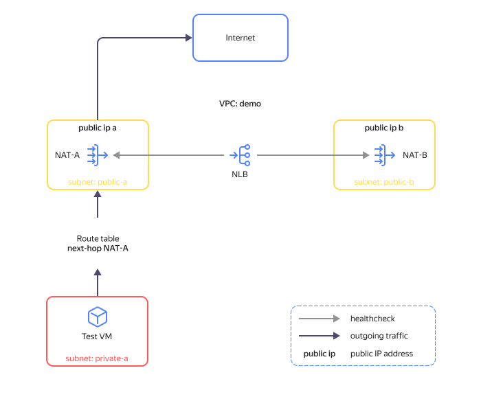

# Implementing fault-tolerant scenarios for network VMs


In {{ yandex-cloud }}, you can deploy a cloud infrastructure using network VMs that provide firewall protection, network security, and traffic routing. With [static routing](../../vpc/concepts/routing.md), traffic is routed from subnets to network VMs.

To ensure high availability, you can deploy multiple network VMs in different [availability zones](../../overview/concepts/geo-scope.md) and set up auto switching of outgoing subnet traffic from one network VM to another using the [route-switcher module](https://github.com/yandex-cloud-examples/yc-route-switcher/tree/main).

This tutorial describes a use case when the route-switcher module provides fault tolerance of a [NAT instance](/marketplace/products/yc/nat-instance-ubuntu-18-04-lts), a network VM with preset routing and IP address translation rules. NAT instances are used to provide internet access for VMs and other cloud resources hosted in {{ yandex-cloud }}.

In the flow chart used in this example, a NAT instance called `NAT-A` is the main one for traffic to the internet and `NAT-B` is a standby NAT instance.





| Element name | Description |
| ----------- | ----------- |
| NAT-A, NAT-B | NAT instances that provide cloud resource access to the internet through translation of the resources' internal IP addresses to the NAT instances' public IPs. |
| VPC: demo | {{ vpc-name }} network |
| private-a | Subnet in the `{{ region-id }}-a` availability zone for hosting resources that require access to the internet. |
| public-a, public-b | Subnets in the `{{ region-id }}-a` and `{{ region-id }}-b` availability zones hosting the NAT instances. |
| public ip a, public ip b | NAT instance public IPs. |
| NLB | Internal network load balancer required for the route-switcher module to run; it checks whether the NAT instances are available by performing health checks on port TCP 22. |



If `NAT-A` fails, the route-switcher will switch outgoing traffic over to `NAT-B` by changing the `Next hop` value to the `NAT-B` internal IP address in the subnet route table. After that, internet access will be provided through `NAT-B`.


As soon as `NAT-A` recovers, the route-switcher will reroute outgoing traffic through `NAT-B` by changing the `Next hop` value to the `NAT-A` instance internal IP address in the route table.

This tutorial will help you create a test infrastructure that shows how the route-switcher module works. The solution has the following basic elements:

* **nat-a**: Main NAT instance.
* **nat-b**: Standby NAT instance.
* **test-vm**: VM within the infrastructure's internal perimeter that internet access through the respective NAT instance is provided for.
* **route-switcher-lb-...**: [Network load balancer](../../network-load-balancer/concepts/index.md) that is required for the route-switcher to run and is used to check if the NAT instances are available.
* **route-switcher-...**: [Cloud function](../../functions/concepts/function.md) that switches outgoing traffic over to the standby NAT instance if the primary one is down.

To deploy the test infrastructure and test the route-switcher:

1. [Prepare your cloud](#prepare-cloud).
1. [Prepare the environment](#prepare-environment).
1. [Deploy your resources](#create-resources).
1. [Enable the route-switcher module](#enable-route-switcher).
1. [Test the solution for performance and fault tolerance](#test-solution).

If you no longer need the resources you created, [delete them](#clear-out).

## Prepare your cloud {#prepare-cloud}




### Required paid resources {#paid-resources}

The infrastructure support cost includes:

* Fee for continuously running VMs (see [{{ compute-full-name }} pricing](../../compute/pricing.md)).
* Fee for using {{ network-load-balancer-name }} (see [{{ network-load-balancer-full-name }} pricing](../../network-load-balancer/pricing.md)).
* Fee for using public IP addresses and outgoing traffic (see [{{ vpc-full-name }} pricing](../../vpc/pricing.md)).
* Fee for using the function (see [{{ sf-full-name }} pricing](../../functions/pricing.md)).


## Configure the CLI profile {#setup-profile}

1. If you do not have the {{ yandex-cloud }} command line interface yet, [install](../../cli/quickstart.md) it and sign in as a user.
1. Create a service account:

   

   - Management console {#console}

      1. In the [management console]({{ link-console-main }}), select the folder where you want to create your service account.
      1. In the **{{ ui-key.yacloud.iam.folder.switch_service-accounts }}** tab, click **{{ ui-key.yacloud.iam.folder.service-accounts.button_add }}**.
      1. Enter a name for the service account, e.g., `sa-terraform`.
      1. Click **{{ ui-key.yacloud.iam.folder.service-account.popup-robot_button_add }}**.

   - CLI {#cli}

      

      Run the command below to create a service account, specifying the `sa-terraform` name:

      ```bash
      yc iam service-account create --name sa-terraform
      ```

      In this command, replace `name` with the name of the service account.

      Result:

      ```yaml
      id: ajehr0to1g8b********
      folder_id: b1gv87ssvu49********
      created_at: "2023-06-20T09:03:11.665153755Z"
      name: sa-terraform
      ```

   - API {#api}

      To create a service account, use the [ServiceAccountService/Create](../../iam/api-ref/grpc/service_account_service.md#Create) gRPC API call or the [create](../../iam/api-ref/ServiceAccount/create.md) REST API method for the `ServiceAccount` resource.

   

1. Assign the service account the administrator [role](../../iam/concepts/access-control/roles.md) for the folder:

   

   - Management console {#console}

      1. On the [start page]({{ link-console-main }}) of the management console, select the folder.
      1. Go to the **{{ ui-key.yacloud.common.resource-acl.label_access-bindings }}** tab.
      1. Find the `sa-terraform` service account in the list and click .
      1. Click **{{ ui-key.yacloud.common.resource-acl.button_assign-binding }}**.
      1. Click **Add role** in the dialog box that opens and select the `admin` role.

   - CLI {#cli}

      Run this command:

      ```
      yc resource-manager folder add-access-binding <folder_ID> \
         --role admin \
         --subject serviceAccount:<service_account_ID>
      ```

   - API {#api}

      To assign the service account a role for the folder, use the [setAccessBindings](../../iam/api-ref/ServiceAccount/setAccessBindings.md) REST API method for the [ServiceAccount](../../iam/api-ref/ServiceAccount/index.md) resource or the [ServiceAccountService/SetAccessBindings](../../iam/api-ref/grpc/service_account_service.md#SetAccessBindings) gRPC API call.

   

1. Set up the CLI profile to run operations on behalf of the service account:

   

   - CLI {#cli}

      1. Create an [authorized key](../../iam/concepts/authorization/key.md) for the service account and save it to the file:

         ```bash
         yc iam key create \
         --service-account-id <service_account_ID> \
         --folder-id <ID_of_folder_with_service_account> \
         --output key.json
         ```

         Where:
         * `service-account-id`: Service account ID.
         * `folder-id`: ID of the folder in which the service account was created.
         * `output`: Name of the file with the authorized key.

         Result:

         ```bash
         id: aje8nn871qo4********
         service_account_id: ajehr0to1g8b********
         created_at: "2023-06-20T09:16:43.479156798Z"
         key_algorithm: RSA_2048
         ```

      1. Create a CLI profile to run operations on behalf of the service account:
         ```bash
         yc config profile create sa-terraform
         ```

         Result:

         ```bash
         Profile 'sa-terraform' created and activated
         ```

      1. Set the profile configuration:

         ```bash
         yc config set service-account-key key.json
         ```

         Where:

         `service-account-key`: File with the authorized key of the service account.

      1. Add the credentials to the environment variables:

         ```bash
         export YC_TOKEN=$(yc iam create-token)
         ```

   

## Prepare an environment for deploying the resources {#setup-environment}

1. [Install {{ TF }}](../../tutorials/infrastructure-management/terraform-quickstart.md#install-terraform).
1. Install [Git](https://en.wikipedia.org/wiki/Git) using the following command:

   ```bash
   sudo apt install git
   ```

1. Clone the `yandex-cloud-examples/yc-route-switcher` repository from GitHub and navigate to the folder:

   ```bash
   git clone https://github.com/yandex-cloud-examples/yc-route-switcher.git
   cd yc-route-switcher/examples
   ```

1. Open the `terraform.tfvars` file, for example, using `nano`:

   ```bash
   nano terraform.tfvars
   ```

1. Edit the following:

   1. String with the folder ID:

      ```text
      folder_id = "<folder_ID>"
      ```

   1. The line with a list of allowed public IP addresses for `test-vm` access:

      ```text
      trusted_ip_for_mgmt = ["<workstation_external_IP>/32"]
      ```

      Where:
      `<workstation_external_IP>` is your workstation's public IP address.

      To find out the external IP of your workstation, run:

      ```bash
      curl 2ip.ru
      ```

      Result:

      ```bash
      192.240.24.87
      ```

## Deploy your resources {#create-resources}

1. Initialize {{ TF }}:

   ```bash
   terraform init
   ```

1. Check the {{ TF }} file configuration:

   ```bash
   terraform validate
   ```

1. Check the list of cloud resources you are about to create:

   ```bash
   terraform plan
   ```

1. Create resources:

   ```bash
   terraform apply
   ```

1. Wait until the resources are deployed and save the resulting command output: {#final-output}

   ```bash
   Outputs:
   nat-a_public_ip_address = "***.***.129.139"
   nat-b_public_ip_address = "***.***.105.234"
   path_for_private_ssh_key = "./pt_key.pem"
   test_vm_password = <sensitive>
   vm_username = "admin"
   ```

## Enable the route-switcher module {#enable-route-switcher}

1. Make sure the NAT instances are running and available within the network:

   

   - Management console {#console}

      1. In the [management console]({{ link-console-main }}), select the appropriate folder.
      1. Select **{{ network-load-balancer-name }}** and go to the `route-switcher-lb-...` network load balancer page.
      1. Open the target group and make sure the targets have the `Healthy` status.

   

1. Open the `route-switcher.tf` file, for example, using the `nano` editor:

   ```bash
   nano route-switcher.tf
   ```

1. Change the `start_module` parameter value for the `route-switcher` to `true`.
1. Run the module with the following command:

   ```bash
   terraform apply
   ```

   Within 5 minutes of resource deployment, the route-switcher module starts providing fault tolerance of outgoing traffic to the internet via the NAT instance.

## Test the solution for performance and fault tolerance {#test-solution}

### Testing the system performance {#accessibility-test}

1. Connect to the `test-vm` serial console:

   

   - Management console {#console}

      1. In the [management console]({{ link-console-main }}), select the appropriate folder.
      1. Select **{{ ui-key.yacloud.iam.folder.dashboard.label_compute }}**.
      1. Select `test-vm` from the list of VMs.
      1. Go to the **{{ ui-key.yacloud.compute.instance.switch_console }}** tab.
      1. Wait for the operating system to start up completely.

   

1. Enter the `admin` username and password.
   To find out the password, run the following command in your workstation's terraform scenario folder:

   ```bash
   terraform output test_vm_password
   ```

1. Make sure that `test-vm` is connected to the internet via the public IP address of the `nat-a` instance. Run the following command in the serial console:

   ```bash
   curl ifconfig.co
   ```

   Compare the IP address with the `nat-a_public_ip_address` value from the [resulting output](#final-output).

1. Enable outgoing traffic from the test VM to a resource on the internet with a `ping`:

   ```bash
   ping ya.ru
   ```

   Make sure that packets are returned:

   ```bash
   PING ya.ru (77.88.55.242) 56(84) bytes of data.
   64 bytes from ya.ru (77.88.55.242): icmp_seq=1 ttl=56 time=4.67 ms
   64 bytes from ya.ru (77.88.55.242): icmp_seq=2 ttl=56 time=3.83 ms
   64 bytes from ya.ru (77.88.55.242): icmp_seq=3 ttl=56 time=3.80 ms
   64 bytes from ya.ru (77.88.55.242): icmp_seq=4 ttl=56 time=3.78 ms
   ```

1. Make sure the `Next hop` value in the route table for the `demo` network matches the internal IP address of the `nat-a` instance.

### Testing the system fault tolerance {#fault-tolerance-test}

1. Disable the main NAT instance by emulating a system failure:

   

   - Management console {#console}

      1. In the [management console]({{ link-console-main }}), select the appropriate folder.
      1. Select **{{ ui-key.yacloud.iam.folder.dashboard.label_compute }}**.
      1. Choose the `nat-a` instance in the list, click , and select **{{ ui-key.yacloud.common.stop }}**.
      1. In the window that opens, click **{{ ui-key.yacloud.compute.instances.popup-confirm_button_stop }}**.

   - CLI {#cli}

      1. View a description of the CLI command to stop a VM:

         ```bash
         yc compute instance stop --help
         ```

      1. Stop the VM:

         ```bash
         yc compute instance stop nat-a
         ```

   - API {#api}

      Use the [stop](../../compute/api-ref/Instance/stop.md) REST API method for the [Instance](../../compute/api-ref/Instance/) resource or the [InstanceService/Stop](../../compute/api-ref/grpc/instance_service.md#Stop) gRPC API call.

   

1. Monitor the loss of packets sent by a `ping`.
   After the main NAT instance is disabled, there may be a traffic loss for 1 minute on average with subsequent traffic recovery.
1. Make sure that internet access is now provided via the public IP address of the `nat-b` instance. Stop the `ping` and run the following command in the serial console:

   ```bash
   curl ifconfig.co
   ```

   Compare the IP address with the `nat-b_public_ip_address` value from the [resulting output](#final-output).
1. Check that the route-switcher has changed the `Next hop` value in the route table for the `demo` network and it now matches the internal IP address of the `nat-b` instance.
1. Enable outgoing traffic from the test VM with a `ping`.
1. Run the main NAT instance by emulating system recovery:

   

   - Management console {#console}

      1. In the [management console]({{ link-console-main }}), select the appropriate folder.
      1. Select **{{ ui-key.yacloud.iam.folder.dashboard.label_compute }}**.
      1. Choose the `nat-a` instance in the list, click , and select **{{ ui-key.yacloud.common.stop }}**.
      1. In the window that opens, click **{{ ui-key.yacloud.compute.instances.popup-confirm_button_start }}**.

   - CLI {#cli}

      1. View a description of the CLI command to stop a VM:

         ```bash
         yc compute instance start --help
         ```

      1. Stop the VM:

         ```bash
         yc compute instance start nat-a
         ```

   - API {#api}

      Use the [start](../../compute/api-ref/Instance/start.md) REST API method for the [Instance](../../compute/api-ref/Instance/) resource or the [InstanceService/Start](../../compute/api-ref/grpc/instance_service.md#Start) gRPC API call.

   

1. Monitor the `ping` utility output. While the NAT-A instance is being recovered, there may be no loss of sent packets.
1. Make sure that internet access is provided via the public IP address of the `nat-a` instance again. Stop the `ping` and run the following command in the serial console:

   ```bash
   curl ifconfig.co
   ```

   Compare the IP address with the `nat-a_public_ip_address` value from the [resulting output](#final-output).
1. Check that the route-switcher has changed the `Next hop` value in the route table for the `demo` network and it matches the internal IP address of the `nat-a` instance again.

## How to delete the resources you created {#clear-out}

To stop paying for the resources you created, run the command:

```bash
terraform destroy
```



{{ TF }} will **permanently** delete all the resources: networks, subnets, VMs, load balancer, etc.


