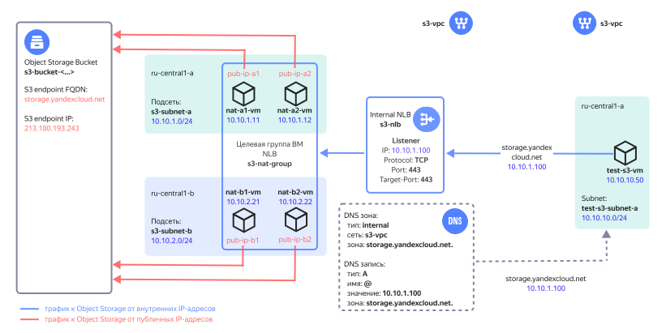

# Connecting to {{ objstorage-name }} from {{ vpc-name }}




In addition to the solution described in this article, you can also access {{ objstorage-name }} from cloud network resources without internet access using the [{{ vpc-short-name }} service connection](../../vpc/concepts/private-endpoint.md). For more information, see [Accessing a bucket using a service connection from {{ vpc-short-name }}](../../storage/operations/buckets/access-via-vpc.md)



In {{ yandex-cloud }}, you can connect to [{{ objstorage-full-name }}](../../storage/) via the appropriate [API endpoint](../../api-design-guide/concepts/endpoints.md) whose FQDN is then translated to a public IP using the DNS service.

This article describes how to deploy a cloud infrastructure in {{ yandex-cloud }} to set up access to {{ objstorage-name }} for resources that are hosted in a {{ vpc-short-name }} [cloud network](../../vpc/concepts/network.md#network) and have no public IPs or access to the internet through a [NAT gateway](../../vpc/concepts/gateways.md).



After the solution is deployed in {{ yandex-cloud }}, the following resources will be created:

| Name | Description |
| ---- | ---- |
| `s3-vpc` | Cloud network with the resources for which access to {{ objstorage-name }} is set up. For deployment, you can specify an existing cloud network as well. |
| `s3-nlb` | [Internal network load balancer](../../network-load-balancer/concepts/nlb-types.md) that accepts traffic to {{ objstorage-name}}. The load balancer accepts TCP traffic with destination port 443 and distributes it across resources (VMs) in a target group. |
| `s3-nat-group` | Load balancer [target group](../../network-load-balancer/concepts/target-resources.md) with VM instances that have the NAT function enabled. |
| `nat-a1-vm`, `nat-a2-vm`, `nat-b1-vm`, `nat-b2-vm` | NAT instances in the `{{ region-id }}-a` and `{{ region-id }}-b` [availability zones](../../overview/concepts/geo-scope.md) for routing traffic to {{ objstorage-name }} and back with translation of IP addresses of traffic sources and targets. |
| `pub-ip-a1`, `pub-ip-a2`, `pub-ip-b1`, `pub-ip-b2` | VM public IPs to which the {{ vpc-short-name }} cloud network translates their internal IPs. |
| `DNS zone and A record` | `{{ s3-storage-host }}.` internal [DNS zone](../../dns/concepts/dns-zone.md) in the `s3-vpc` network with a type `A` [resource record](../../dns/concepts/resource-record.md) that maps the `{{ s3-storage-host }}` domain name to the IP address of the internal network load balancer. |
| `s3-bucket-<...>` | [Bucket](../../storage/concepts/bucket.md) in {{ objstorage-name }}. |
| `s3-subnet-a`, `s3-subnet-b` | Cloud [subnets](../../vpc/concepts/network.md#subnet) to host the NAT instances in the `{{ region-id }}-a` and `{{ region-id }}-b` availability zones. |
| `test-s3-vm` | Test VM to verify access to {{ objstorage-name }}. |
| `test-s3-subnet-a` | Cloud subnet to host the test VM. |

For a cloud network with the resources hosted in [{{ dns-name }}](../../dns/concepts/), create the`{{ s3-storage-host }}.` internal DNS zone and a type `A` resource record that maps the `{{ s3-storage-host }}` domain name of {{ objstorage-name }} to the IP address of the [internal network load balancer](../../network-load-balancer/concepts/nlb-types.md). With this record, traffic from the cloud resources to {{ objstorage-name }} will be routed to the internal load balancer that will distribute the load across the NAT instances.

To deploy the NAT instances, use a [NAT instance based on Ubuntu 22.04 LTS](/marketplace/products/yc/nat-instance-ubuntu-22-04-lts) image from {{ marketplace-name }}. It provides translation of source and target IPs to ensure traffic routing to the {{ objstorage-name }} public IP.

By placing the NAT instances in multiple [availability zones](../../overview/concepts/geo-scope.md), you can ensure fault-tolerant access to {{ objstorage-name }}. By increasing the number of NAT instances, you can scale the solution up if the workload increases. When calculating the number of NAT instances, consider the [locality of traffic handling by the internal load balancer](../../network-load-balancer/concepts/specifics.md#nlb-int-locality).

[{{ objstorage-name }} access policies](../../storage/concepts/policy.md) allow actions with buckets only from the public IPs of NAT instances. Bucket access is only granted to the cloud resources using this solution. You cannot connect to a bucket in {{ objstorage-name }} via a public API endpoint. You can disable this limitation in the {{ TF }} configuration file, if required.

### Test results for NAT instance throughput {#speed-test}

The solution was tested on a single NAT instance with the following [configuration](../../compute/concepts/performance-levels.md):

* Platform: Intel Ice Lake (`standard-v3`)
* Performance level: 100%
* vCPU cores: 2
* RAM: 2 GB

The average {{ objstorage-name }} traffic processing speed was 250 MB/s, both egress and ingress.

The test was performed using the [warp](https://github.com/minio/warp) tool on VM instances that could access {{ objstorage-name }} through this solution. The `warp` command used for the test had the following parameters:

```bash
warp get \
  --host {{ s3-storage-host }} \
  --access-key <static_key_ID> \
  --secret-key <secret_key> \
  --tls \
  --bucket <bucket_name> \
  --obj.randsize \
  --concurrent 20 \
  --warp-client <warp_client_IP_addresses>
```

## Tips for deployment in the production environment {#recommendations}

* When deploying your NAT instances in multiple availability zones, set an even number of VMs to evenly distribute them across the availability zones.
* When selecting the number of NAT instances, consider the [locality of traffic handling by the internal load balancer](../../network-load-balancer/concepts/specifics.md#nlb-int-locality).
* Once the solution is deployed, reduce the number of NAT instances or update the list of availability zones in the `yc_availability_zones` parameter only during a pre-scheduled time window. When the changes are being applied, traffic handling may be interrupted.
* If a NAT instance demonstrates a high `CPU steal time` metric value as the {{ objstorage-name }} workload goes up, we recommend enabling a [software-accelerated network](../..//vpc/concepts/software-accelerated-network.md) for that NAT instance.
* By default, buckets in {{ objstorage-name }} can be accessed via the {{ yandex-cloud }} [management console]({{ link-console-main }}). You can revoke this permission using the `bucket_console_access = false` parameter.
* If you omit `mgmt_ip` when `bucket_private_access = true`, solution deployment using {{ TF }} on a workstation will fail with a bucket access error.
* If you are using your own DNS server, create type `A` resource records in its settings in the following format:

  | Name | Type | Value |
  | ----------- | ----------- | ----------- |
  | `{{ s3-storage-host }}` | `A` | `<internal_load_balancer_IP_address>` |
  | `<bucket_name>.{{ s3-storage-host }}` | `A` | `<internal_load_balancer_IP_address>` |

* Save the `pt_key.pem` private SSH key used to connect to the NAT instances to a secure location or recreate it separately from {{ TF }}.
* Once the solution is deployed, SSH access to the NAT instances will be disabled. To enable access to the NAT instances over SSH, add a rule for incoming SSH traffic (`TCP/22`) in the `s3-nat-sg` [security group](../../vpc/concepts/security-groups.md) to enable access only from certain IP addresses of admin workstations.

## Deployment plan {#deploy-plan}

To deploy the solution and test it:

1. [Prepare your cloud](#prepare-cloud).
1. [Prepare an environment for deploying the resources](#setup-environment).
1. [Deploy the solution](#deploy).
1. [Test the solution](#check).

If you no longer need the resources you created, [delete them](#clear-out).

## Prepare your cloud {#prepare-cloud}




### Required paid resources {#paid-resources}

The infrastructure support costs include:

* Fee for using {{ objstorage-name }} (see [{{ objstorage-full-name }} pricing](../../storage/pricing.md)).
* Fee for using a network load balancer (see [{{ network-load-balancer-name }} pricing](../../network-load-balancer/pricing.md)).
* Fee for continuously running VMs (see [{{ compute-full-name }} pricing](../../compute/pricing.md)).
* Fee for using public IP addresses and outgoing traffic (see [{{ vpc-full-name }} pricing](../../vpc/pricing.md)).


## Prepare an environment for deploying the resources {#setup-environment}

1. [Install {{ TF }}](../../tutorials/infrastructure-management/terraform-quickstart.md#install-terraform).
1. If you do not have the {{ yandex-cloud }} command line interface yet, [install](../../cli/quickstart.md) it and sign in as a user.
1. Check if there is an account in the {{ yandex-cloud }} cloud with `admin` permissions for the folder the solution is being deployed in.
1. [Install Git](https://github.com/git-guides/install-git).
1. Check the cloud quotas to be able to deploy your resources in this use case:

    

    | Resource | Amount |
    | ----------- | ----------- |
    | Virtual machines | 5 |
    | VM vCPUs | 10 |
    | VM RAM | 10 GB |
    | Disks | 5 |
    | HDD size | 30 GB |
    | SSD size | 40 GB |
    | Network load balancer | 1 |
    | Target group for the load balancer | 1 |
    | Networks | 1^1^ |
    | Subnets | 3 |
    | Static public IP addresses | 4 |
    | Security groups | 1 |
    | DNS zone | 1 |
    | Bucket | 1 |  
    | Service accounts | 2 |
    | Static key for the service account | 1 |

    ^1^ If the user did not specify the ID of an existing network in `terraform.tfvars`.

    

## Deploy the solution using {{ TF }} {#deploy}

1. Clone the `yandex-cloud-examples/yc-s3-private-endpoint` [repository](https://github.com/yandex-cloud-examples/yc-s3-private-endpoint) to your workstation and go to the `yc-s3-private-endpoint` folder:

    ```bash
    git clone https://github.com/yandex-cloud-examples/yc-s3-private-endpoint.git
    cd yc-s3-private-endpoint
    ```

1. Set up an environment for authentication in {{ TF }} (for more information, see [Getting started with {{ TF }}](../../tutorials/infrastructure-management/terraform-quickstart.md#get-credentials)):

    ```bash
    export YC_TOKEN=$(yc iam create-token)
    ```

1. Variable parameters of resources to create are defined in the `variables.tf` file. Insert your custom variable values into the `terraform.tfvars` file. Mandatory parameters to be updated are indicated in the table below.

    

    | Parameter<br>name | Replace with<br>a custom<br>value | Description | Type | Example |
    | --- | --- | --- | --- | --- |
    | `folder_id` | Yes | ID of the folder to host the solution components | `string` | `"b1gentmqf1ve********"` |
    | `vpc_id` | — | ID of the cloud network access to {{ objstorage-name }} is set up for. If omitted, a new network will be created. | `string` | `"enp48c1ndilt********"` |
    | `yc_availability_zones` | — | List of [availability zones](../../overview/concepts/geo-scope.md) for deploying NAT instances | `list(string)` | `["{{ region-id }}-a", "{{ region-id }}-b"]` |
    | `subnet_prefix_list` | — | List of prefixes of cloud subnets to host the NAT instances (one subnet in each availability zone from the `yc_availability_zones` list. The prefixes should be listed as {{ region-id }}-a, {{ region-id }}-b, and so on). | `list(string)` | `["10.10.1.0/24", "10.10.2.0/24"]` |
    | `nat_instances_count` | — | Number of NAT instances to deploy. We recommend setting an even number to evenly distribute the instances across the availability zones. | `number` | `4` |
    | `bucket_private_access` | — | Only allow bucket access from the public IPs of NAT instances. If `true`, access is limited. To remove the limit, set `false`. | `bool` | `true` |
    | `bucket_console_access` | — | Allow bucket access via the {{ yandex-cloud }} management console. If `true`, access is allowed. To deny access, set `false`. This parameter is mandatory if the `bucket_private_access` parameter is set to `true`. | `bool` | `true` |
    | `mgmt_ip` | Yes | Public IP of your workstation where you are deploying the infrastructure using {{ TF }}. It is used to allow your workstation to perform actions with the bucket when deploying {{ TF }}. This parameter is mandatory if the `bucket_private_access` parameter is set to `true`. | `string` | `"A.A.A.A"` |
    | `trusted_cloud_nets` | Yes | List of aggregated prefixes of cloud subnets that {{ objstorage-name }} access is allowed for. It is used in the rule for incoming traffic of security groups for the NAT instances.  | `list(string)` | `["10.0.0.0/8", "192.168.0.0/16"]` |
    | `vm_username` | — | NAT instance and test VM user names | `string` | `"admin"` |
    | `s3_ip` | No | {{ objstorage-name }} public IP address | `string` | `213.180.193.243` |
    | `s3_fqdn` | No | {{ objstorage-name }} domain name | `string` | `{{ s3-storage-host }}` |  

    

1. Initialize {{ TF }}:

    ```bash
    terraform init
    ```

1. Check the list of cloud resources you are about to create:

    ```bash
    terraform plan
    ```

1. Create resources:

    ```bash
    terraform apply
    ```

1. Once the `terraform apply` process is completed, the command line will output information required for connecting to the test VM and running test operations with {{ objstorage-name }}. Later on, you can view this information by running the `terraform output` command:

    

    | Name | Description | Sample value |
    | ----------- | ----------- | ----------- |
    | `path_for_private_ssh_key` | File with a private key used to connect to the NAT instances and test VM over SSH | `./pt_key.pem` |
    | `vm_username` | NAT instance and test VM user names | `admin` |
    | `test_vm_password` | `admin` user password for the test VM | `v3RCqU****` |
    | `s3_bucket_name` | Bucket name in {{ objstorage-name }} | `s3-bucket-<...>` |
    | `s3_nlb_ip_address` | IP address of the internal load balancer | `10.10.1.100` |

    

## Test the solution {#check}

1. In the [management console]({{ link-console-main }}), go to the folder where the resources were created.
1. Select **{{ compute-name }}**.
1. Select `test-s3-vm` from the list of VM instances.
1. Go to the **{{ ui-key.yacloud.compute.instance.switch_console }}** tab.
1. Click **{{ ui-key.yacloud.compute.instance.console.connect }}**.
1. Enter the `admin` username and the password from the `terraform output test_vm_password` command output (without quotation marks).

1. Run this command:

    ```bash
    dig {{ s3-storage-host }}
    ```

1. Make sure {{ objstorage-name }} domain name in the DNS server response matches the IP address of the internal load balancer. The output of the type `A` resource record is as follows:

    ```text
    ;; ANSWER SECTION:
    {{ s3-storage-host }}. 300    IN      A       10.10.1.100
    ```

1. Get an object from the bucket in {{ objstorage-name }} using the [AWS CLI](../../storage/tools/aws-cli.md). The bucket name will be fetched from the test VM environment variable.

    ```bash
    aws --endpoint-url=https://{{ s3-storage-host }} \
    s3 cp s3://$BUCKET/s3_test_file.txt s3_test_file.txt
    ```

    Result:

    ```text
    download: s3://<bucket_name>/s3_test_file.txt to ./s3_test_file.txt
    ```

1. You can additionally run a number of commands to test {{ objstorage-name }}. The bucket name will be fetched from the test VM environment variable.

    Upload the downloaded test file to the bucket under a different name:

    ```bash
    aws --endpoint-url=https://{{ s3-storage-host }} \
    s3 cp s3_test_file.txt s3://$BUCKET/textfile.txt
    ```

    Result:

    ```text
    upload: ./s3_test_file.txt to s3://<bucket_name>/textfile.txt
    ```

    Get a list of objects in the bucket:

    ```bash
    aws --endpoint-url=https://{{ s3-storage-host }} \
    s3 ls --recursive s3://$BUCKET
    ```

    Result:

    ```text
    2023-08-16 18:24:05         53 s3_test_file.txt \
    2023-08-16 18:41:39         53 textfile.txt
    ```

    Delete the object you uploaded to the bucket:

    ```bash
    aws --endpoint-url=https://{{ s3-storage-host }} \
    s3 rm s3://$BUCKET/textfile.txt
    ```

    Result:

    ```text
    delete: s3://<bucket_name>/textfile.txt
    ```

## Delete the resources you created {#clear-out}

To delete the resources you created using {{ TF }}, run the `terraform destroy` command.



{{ TF }} will permanently delete all the resources that were created while deploying the solution.


