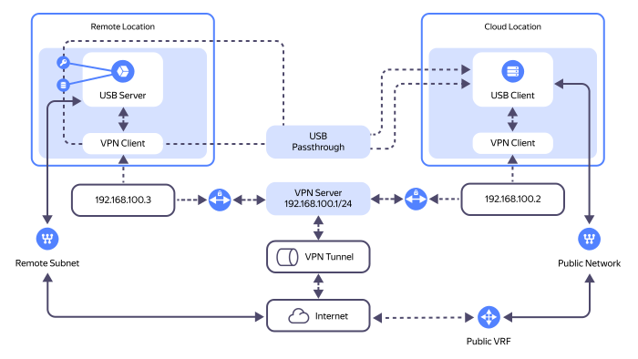

In this tutorial, you will configure forwarding USB devices to a {{ baremetal-full-name }} [server](../../baremetal/concepts/servers.md) via a VPN connection over a public internet segment. You will do it using the _USB over IP_ technology and freely distributed software that comes with [Linux](https://en.wikipedia.org/wiki/Linux) distributions.



In a similar way, you can forward USB devices to a {{ compute-full-name }} [virtual machine](../../compute/concepts/vm.md).



_USB over IP_ allows you to transfer data from USB devices over a network (local or internet) as if they were directly connected to the client computer. This is particularly important in situations where it is difficult or impossible to physically connect USB devices to the computer.

With _USB over IP_:
* You can forward USB devices to cloud services, using {{ compute-name }} VMs or {{ baremetal-name }} servers as clients for remote USB devices.
* You can connect remote USB peripherals, such as printers, scanners, cameras, hardware tokens, and flash drives, to VMs and servers.
* To forward USB devices, you can use both specialized integrated system platforms and open-source software.
* You can place keys, tokens, and smart cards delivered to servers and VMs within a controlled perimeter with limited access.
* You can use common network security tools to restrict connections to remote USB devices.



The _USB over IP_ technology requires a highly reliable network for writes to a remote USB device. In addition, this technology is not suitable for connecting USB devices that require high data transfer rates.



You can see the solution architecture in the diagram below:



* Remote site **USB client**: Windows or Linux-based virtual machine or physical server. In this tutorial, a physical server running Linux Ubuntu 24.04 LTS leased from {{ baremetal-full-name }} will serve as a client.
* Remote site **USB server**: Linux-based device with a connection to a local network and VPN access (if the USB device data is delivered via the internet). USB devices will be physically inserted into the USB ports of the USB server. For a server, you can use microcomputers, e.g., [Raspberry Pi](https://en.wikipedia.org/wiki/Raspberry_Pi). In this tutorial, a computer running Linux Ubuntu 22.04 LTS with several USB ports will be used as the server.
* **Software**: In this tutorial, we will use `usbip` with the standard system tools and core modules from the `linux-tools` package to forward USB devices to the client.
* **Connected USB equipment**:
    * USB data drive
    * USB token
* **USB forwarding method**: Remote USB devices will be forwarded through a VPN connection over a public internet segment using [WireGuard](https://www.wireguard.com/). 

    The proposed WireGuard-based arrangement is for demonstration purposes only; you can use any other technology to connect your remote servers.

To forward USB devices to a {{ baremetal-name }} server using USB over IP:

1. [Get your cloud ready](#before-you-begin).
1. [Set up a cloud network](#setup-vpc).
1. [Create a virtual machine for a VPN server](#create-vpn-server).
1. [Create a {{ baremetal-name }} private subnet](#create-subnet).
1. [Lease a {{ baremetal-name }} server](#rent-server).
1. [Set up a VPN](#setup-vpn).
1. [Configure USB over IP](#setup-usbip).
1. [Test the solution](#test-solution).

If you no longer need the resources you created, [delete them](#clear-out).

## Getting started {#before-you-begin}



### Required paid resources {#paid-resources}

The cost of the proposed solution includes:

* Fee for using the VM [public IP address](../../vpc/concepts/address.md#public-addresses) (see [{{ vpc-full-name }} pricing](../../vpc/pricing.md)).
* Fee for [VM](../../compute/concepts/vm.md) computing resources and disks (see [{{ compute-full-name }} pricing](../../compute/pricing.md)).
* {{ baremetal-name }} server lease fee (see [{{ baremetal-full-name }} pricing](../../baremetal/pricing.md)).


## Set up a cloud network {#setup-vpc}

### Create a cloud network and subnet {#setup-network-and-subnet}

Create a cloud network and subnet to connect the {{ compute-name }} VM (VPN server) to.



- Management console {#console} 

  1. In the [management console]({{ link-console-main }}), select the folder where you are going to create your cloud infrastructure.
  1. In the list of services, select **{{ ui-key.yacloud.iam.folder.dashboard.label_vpc }}**.
  1. Create a cloud network:

      1. At the top right, click **{{ ui-key.yacloud.vpc.networks.button_create }}**.
      1. In the **{{ ui-key.yacloud.vpc.networks.create.field_name }}** field, specify `sample-network`.
      1. In the **{{ ui-key.yacloud.vpc.networks.create.field_advanced }}** field, disable **{{ ui-key.yacloud.vpc.networks.create.field_is-default }}**.
      1. Click **{{ ui-key.yacloud.vpc.networks.button_create }}**.
  1. Create a subnet:

      1. In the left-hand panel, select  **{{ ui-key.yacloud.vpc.switch_networks }}**.
      1. At the top right, click **{{ ui-key.yacloud.vpc.subnetworks.button_action-create }}**.
      1. In the **{{ ui-key.yacloud.vpc.subnetworks.create.field_name }}** field, specify `subnet-{{ region-id }}-b`.
      1. In the **{{ ui-key.yacloud.vpc.subnetworks.create.field_zone }}** field, select `{{ region-id }}-b`.
      1. In the **{{ ui-key.yacloud.vpc.subnetworks.create.field_network }}** field, select `sample-network`.
      1. In the **{{ ui-key.yacloud.vpc.subnetworks.create.field_ip }}** field, specify `192.168.11.0/24`.
      1. Click **{{ ui-key.yacloud.vpc.subnetworks.create.button_create }}**.



### Create a security group {#crete-sg}

Create a [security group](../../vpc/concepts/security-groups.md) named `vpn-sg` for your VM (VPN server).



- Management console {#console}

  1. In the [management console]({{ link-console-main }}), select the folder where you are deploying your cloud infrastructure.
  1. In the list of services, select **{{ ui-key.yacloud.iam.folder.dashboard.label_vpc }}**.
  1. In the left-hand panel, select  **{{ ui-key.yacloud.vpc.label_security-groups }}** and click **{{ ui-key.yacloud.vpc.network.security-groups.button_create }}**.
  1. In the **{{ ui-key.yacloud.vpc.network.security-groups.forms.field_sg-name }}** field, specify `vpn-sg`.
  1. In the **{{ ui-key.yacloud.vpc.network.security-groups.forms.field_sg-network }}** field, select `sample-network` you created earlier.
  1. Under **{{ ui-key.yacloud.vpc.network.security-groups.forms.label_section-rules }}**, [create](../../vpc/operations/security-group-add-rule.md) the following traffic management rules:

      | Traffic<br/>direction | {{ ui-key.yacloud.vpc.network.security-groups.forms.field_sg-rule-description }} | {{ ui-key.yacloud.vpc.network.security-groups.forms.field_sg-rule-port-range }} | {{ ui-key.yacloud.vpc.network.security-groups.forms.field_sg-rule-protocol }} | {{ ui-key.yacloud.vpc.network.security-groups.forms.field_sg-rule-source }} /<br/>{{ ui-key.yacloud.vpc.network.security-groups.forms.field_sg-rule-destination }} | {{ ui-key.yacloud.vpc.network.security-groups.forms.field_sg-rule-cidr-blocks }} /<br/>{{ ui-key.yacloud.vpc.network.security-groups.forms.field_sg-rule-sg-type }} |
      | --- | --- | --- | --- | --- | --- |
      | Ingress | `ssh`            | `22`   | `TCP`  | `{{ ui-key.yacloud.vpc.network.security-groups.forms.value_sg-rule-destination-cidr }}` | `0.0.0.0/0` |
      | Ingress | `vpn`            | `63665`   | `UDP`  | `{{ ui-key.yacloud.vpc.network.security-groups.forms.value_sg-rule-destination-cidr }}` | `0.0.0.0/0` |
      | Egress | `any`           | `All` | `{{ ui-key.yacloud.vpc.network.security-groups.forms.value_any }}` | `{{ ui-key.yacloud.vpc.network.security-groups.forms.value_sg-rule-destination-cidr }}` | `0.0.0.0/0` |
  1. Click **{{ ui-key.yacloud.common.create }}**.



## Create a virtual machine for a VPN server {#create-vpn-server}



- Management console {#console}

  1. In the [management console]({{ link-console-main }}), select the folder where you are deploying your infrastructure.
  1. In the list of services, select **{{ ui-key.yacloud.iam.folder.dashboard.label_compute }}**.
  1. In the left-hand panel, select  **{{ ui-key.yacloud.compute.instances_jsoza }}** and click **{{ ui-key.yacloud.compute.instances.button_create }}**.
  1. Under **{{ ui-key.yacloud.compute.instances.create.section_image }}**, select the [Ubuntu 24.04](/marketplace/products/yc/ubuntu-2404-lts-oslogin) image.
  1. Under **{{ ui-key.yacloud.k8s.node-groups.create.section_allocation-policy }}**, select the `{{ region-id }}-b` [availability zone](../../overview/concepts/geo-scope.md).
  1. Under **{{ ui-key.yacloud.compute.instances.create.section_network }}**:

      * In the **{{ ui-key.yacloud.component.compute.network-select.field_subnetwork }}** field, select `subnet-{{ region-id }}-b`.
      * In the **{{ ui-key.yacloud.component.compute.network-select.field_external }}** field, select `{{ ui-key.yacloud.component.compute.network-select.switch_auto }}`.
      * In the **{{ ui-key.yacloud.component.compute.network-select.field_security-groups }}** field, select `vpn-sg`.

  1. Under **{{ ui-key.yacloud.compute.instances.create.section_access }}**, select **{{ ui-key.yacloud.compute.instance.access-method.label_oslogin-control-ssh-option-title }}** and specify the VM access credentials:

      * In the **{{ ui-key.yacloud.compute.instances.create.field_user }}** field, enter the username: `yc-user`.
      * 

  1. Under **{{ ui-key.yacloud.compute.instances.create.section_base }}**, specify the VM name: `wireguard-vpn-server`.
  1. Click **{{ ui-key.yacloud.compute.instances.create.button_create }}**.





To keep the VPN connection alive if you stop and restart your VPN server, [make](../../vpc/operations/set-static-ip.md) the VPN server's IP address static.




## Create a {{ baremetal-name }} private subnet {#create-subnet}



- Management console {#console}

  1. In the [management console]({{ link-console-main }}), select the folder where you are deploying your cloud infrastructure.
  1. In the list of services, select **{{ ui-key.yacloud.iam.folder.dashboard.label_baremetal }}**.
  1. In the left-hand panel, select  **{{ ui-key.yacloud.baremetal.label_subnetworks }}** and click **{{ ui-key.yacloud.baremetal.label_create-subnetwork }}**.
  1. In the **{{ ui-key.yacloud.baremetal.field_server-pool }}** field, select the `{{ region-id }}-m3` server pool.
  1. In the **{{ ui-key.yacloud.baremetal.field_name }}** field, enter the subnet name: `subnet-m3`.
  1. Without enabling **{{ ui-key.yacloud.baremetal.title_routing-settings }}**, click **{{ ui-key.yacloud.baremetal.label_create-subnetwork }}**.




## Lease a {{ baremetal-name }} server {#rent-server}



- Management console {#console}

  1. In the [management console]({{ link-console-main }}), select the folder where you are deploying your cloud infrastructure.
  1. 
  1. In the **{{ ui-key.yacloud.baremetal.field_server-pool }}** field, select the `{{ region-id }}-m3` server pool.
  1. 
  1. 
  1. Under **{{ ui-key.yacloud.baremetal.title_section-server-product }}**, select the `Ubuntu 24.04` image.
  1. 
  1. Under **{{ ui-key.yacloud.baremetal.title_section-server-network-settings }}**:

     1. In the **{{ ui-key.yacloud.baremetal.field_subnet-id }}** field, select `subnet-m3` you created earlier.
     1. In the **{{ ui-key.yacloud.baremetal.field_needed-public-ip }}** field, select `{{ ui-key.yacloud.baremetal.label_public-ip-ephemeral }}`.

  1. Under **{{ ui-key.yacloud.baremetal.title_server-access }}**:

      

  1. Under **{{ ui-key.yacloud.baremetal.title_section-server-info }}**, in the **{{ ui-key.yacloud.baremetal.field_name }}** field, enter the server name: `my-usbip-client`.
  1. 





Server setup and OS installation may take up to 45 minutes. The server will have the `Provisioning` status during this time. After OS installation is complete, the server status will change to `Ready`.




## Set up a VPN {#setup-vpn}

To enable USB device forwarding to a {{ baremetal-name }} server from a remote computer, set up a VPN connection using a VPN server deployed on a {{ compute-name }} virtual machine and two VPN clients: one on the {{ baremetal-name }} server and one on the remote computer.

In this tutorial, you will use the [WireGuard](https://www.wireguard.com/) open source solution to set up a VPN connection. However, you can set up your VPN connection using other tools.



The server must have port `TCP 3240` open and accessible through the VPN connection.



### Configure a VPN server {#vpn-server-setup}

1. [Connect over SSH](../../compute/operations/vm-connect/ssh.md) to the `wireguard-vpn-server` virtual machine you created earlier.
1. 
1. 
1. Generate VPN traffic encryption keys:

    ```bash
    wg genkey | sudo tee server_private.key | wg pubkey | sudo tee server_public.key > /dev/null
    wg genkey | sudo tee bms_private.key | wg pubkey | sudo tee bms_public.key > /dev/null
    wg genkey | sudo tee remote_private.key | wg pubkey | sudo tee remote_public.key > /dev/null
    ```

    These six files were created in the current directory:

    * `server_private.key`: Contains the private encryption key of the VPN server.
    * `server_private.key`: Contains the public encryption key of the VPN server.
    * `bms_private.key`: Contains the private encryption key of the VPN client ({{ baremetal-name }} server).
    * `bms_public.key`: Contains the public encryption key of the VPN client ({{ baremetal-name }} server).
    * `remote_private.key`: Contains the private encryption key of the remote site VPN client.
    * `remote_public.key`: Contains the public encryption key of the remote site VPN client.

    Save all the encryption keys: you will need them to create WireGuard configuration files on the relevant machines.
1. Create a WireGuard VPN server configuration file:

    1. 
    1. Add the following configuration to the file using the contents of the encryption keys you got in the previous step:

        ```text
        [Interface]
        Address = 192.168.100.1/24
        ListenPort = 63665
        PrivateKey = <server_private.key_file_contents>

        [Peer]
        PublicKey = <bms_public.key_file_contents>
        AllowedIPs = 192.168.100.2/32

        [Peer]
        PublicKey = <remote_public.key_file_contents>
        AllowedIPs = 192.168.100.3/32
        ```
1. 

### Configure VPN clients {#vpn-client-setup}

1. [Connect over SSH](../../compute/operations/vm-connect/ssh.md) to the `my-usbip-client` {{ baremetal-name }} server you leased earlier.
1. 
1. 
1. Create a WireGuard VPN client configuration file:

    1. 
    1. Add the following configuration to the file:

        ```text
        [Interface]
        PrivateKey = <bms_private.key_file_contents>
        Address = 192.168.100.2/32

        [Peer]
        PublicKey = <server_public.key_file_contents>
        Endpoint = <VM_public_IP_address>:63665
        AllowedIPs = 192.168.100.0/24
        PersistentKeepalive = 15
        ```

        Where:

        * `PrivateKey`: Contents of the `bms_private.key` file created when configuring the VPN server. This is the client's private encryption key.
        * `PublicKey`: Contents of the `server_public.key` file created when configuring the VPN server. This is the server's public encryption key.
        * `<VM_public_IP_address>`: Public IP address of the virtual machine with the deployed VPN server. You can look up the VM's public IP address in the [management console]({{ link-console-main }}): see the **{{ ui-key.yacloud.compute.instance.overview.section_network }}** section's **{{ ui-key.yacloud.compute.instance.overview.label_public-ipv4 }}** field on the VM information page.
1. Run WireGuard:

    ```bash
    sudo wg-quick up wg0
    ```

    Result:

    ```text
    [#] ip link add wg0 type wireguard
    [#] wg setconf wg0 /dev/fd/63
    [#] ip -4 address add 192.168.100.2/32 dev wg0
    [#] ip link set mtu 1420 up dev wg0
    [#] ip -4 route add 192.168.100.0/24 dev wg0
    ```
1. Similarly, configure the WireGuard VPN client on the remote computer; in the `PrivateKey` field of the `wg0.conf` WireGuard configuration file, specify the contents of the `remote_private.key` file created when configuring the VPN server with the private encryption key of the remote site VPN client.

### Test the VPN connection {#check-vpn}

By now, your VPN connection should be successfully established. To test it:

1. [Connect over SSH](../../compute/operations/vm-connect/ssh.md) to the `my-usbip-client` {{ baremetal-name }} server and run this command:

    ```bash
    ping 192.168.100.3 -c 5
    ```

    Result:

    ```text
    PING 192.168.100.3 (192.168.100.3) 56(84) bytes of data.
    64 bytes from 192.168.100.3: icmp_seq=1 ttl=63 time=29.9 ms
    64 bytes from 192.168.100.3: icmp_seq=2 ttl=63 time=30.9 ms
    64 bytes from 192.168.100.3: icmp_seq=3 ttl=63 time=35.5 ms
    64 bytes from 192.168.100.3: icmp_seq=4 ttl=63 time=30.5 ms
    64 bytes from 192.168.100.3: icmp_seq=5 ttl=63 time=28.2 ms

    --- 192.168.100.3 ping statistics ---
    5 packets transmitted, 5 received, 0% packet loss, time 4005ms
    rtt min/avg/max/mdev = 28.249/30.987/35.453/2.405 ms
    ```

    Network connectivity between the VPN clients has been established with zero packet loss.
1. Run this command in the remote computer's terminal:

    ```bash
    ping 192.168.100.2 -c 5
    ```

    Result:

    ```text
    PING 192.168.100.2 (192.168.100.2) 56(84) bytes of data.
    64 bytes from 192.168.100.2: icmp_seq=1 ttl=63 time=30.2 ms
    64 bytes from 192.168.100.2: icmp_seq=2 ttl=63 time=28.4 ms
    64 bytes from 192.168.100.2: icmp_seq=3 ttl=63 time=31.6 ms
    64 bytes from 192.168.100.2: icmp_seq=4 ttl=63 time=27.4 ms
    64 bytes from 192.168.100.2: icmp_seq=5 ttl=63 time=27.6 ms

    --- 192.168.100.2 ping statistics ---
    5 packets transmitted, 5 received, 0% packet loss, time 4007ms
    rtt min/avg/max/mdev = 27.381/29.041/31.600/1.608 ms
    ```

    Network connectivity between the VPN clients has been established with zero packet loss.


## Configure USB over IP {#setup-usbip}

You will use `usbip` to forward your USB device to the {{ baremetal-name }} server.

### Configure a usbip server {#setup-usbip-server}

A remote computer equipped with multiple USB ports will act as your `usbip` server. In this computer's terminal:

1. 
1. 

    

    To set these modules up to load automatically at system startup, open the `/etc/modules-load.d/modules.conf` file in any text editor and add these lines to it:

    ```
    usbip-core
    usbip-host
    vhci-hcd
    ```

    

1. Insert USB devices into the computer ports.

    In this tutorial, we will use a [USB flash drive](https://en.wikipedia.org/wiki/USB_flash_drive) and a [YubiKey](https://developers.yubico.com/Passkeys/) USB device as an example.
1. Request a list of USB devices available for publishing:

    ```bash
    sudo usbip list -l
    ```

    Result:

    ```text
    - busid 1-1.2 (0951:1666)
      Kingston Technology : DataTraveler 100 G3/G4/SE9 G2/50 (0951:1666)

    - busid 1-1.3 (058f:a001)
      Alcor Micro Corp. : unknown product (058f:a001)

    - busid 1-1.4 (0cf3:3005)
      Qualcomm Atheros Communications : AR3011 Bluetooth (0cf3:3005)

    - busid 1-1.5 (1050:0407)
      Yubico.com : Yubikey 4/5 OTP+U2F+CCID (1050:0407)

    - busid 2-1.1 (0458:6001)
      KYE Systems Corp. (Mouse Systems) : GF3000F Ethernet Adapter (0458:6001)
    ```
1. Publish devices with `busid 1-1.2` and `busid 1-1.5`:

    ```bash
    sudo usbip bind -b 1-1.2
    sudo usbip bind -b 1-1.5
    ```

    Result:

    ```text
    usbip: info: bind device on busid 1-1.2: complete
    usbip: info: bind device on busid 1-1.5: complete
    ```
1. Run the `usbipd` daemon:

    ```bash
    sudo usbipd -4 -D
    ```

At this step, the selected USB devices are published and available for import over the network on the `usbip` client side.

### Configure the usbip client {#setup-usbip-client}

The `my-usbip-client` {{ baremetal-name }} server will serve as your `usbip` client.

1. [Connect over SSH](../../compute/operations/vm-connect/ssh.md) to the `my-usbip-client` {{ baremetal-name }} server.
1. 

    

    If using a {{ compute-full-name }} virtual machine as a `usbip` client, you need to additionally install `linux-image-extra-virtual`:

    ```bash
    sudo apt install linux-image-extra-virtual
    ```

    

1. 
1. Request a list of USB devices available for import from the `usbip` server:

    ```bash
    usbip list -r 192.168.100.3
    ```

    Result:

    ```text
    Exportable USB devices
    ======================
    - 192.168.100.3
          1-1.5: Yubico.com : Yubikey 4/5 OTP+U2F+CCID (1050:0407)
              : /sys/devices/platform/vhci_hcd.0/usb1/1-1/1-1.5
              : (Defined at Interface level) (00/00/00)

          1-1.2: Kingston Technology : DataTraveler 100 G3/G4/SE9 G2/50 (0951:1666)
              : /sys/devices/pci0000:00/0000:00:1a.0/usb1/1-1/1-1.2
              : (Defined at Interface level) (00/00/00)
    ```
1. Import devices from the `usbip` client:

    ```bash
    usbip attach -r 192.168.100.3 -b 1-1.2
    usbip attach -r 192.168.100.3 -b 1-1.5
    ```

By now, the selected USB devices have been imported over the network to the {{ baremetal-name }} server.

## Test the solution {#test-solution}

To test the connection to your remote USB devices, connect to the `my-usbip-client` {{ baremetal-name }} server over SSH and perform these test actions in the terminal:

1. Run this command to view the `dmesg` log:

    ```bash
    dmesg
    ```

    Result:

    

    - Flash drive {#flash-drive}

      ```text
      ...
      [522540.280156] vhci_hcd vhci_hcd.0: pdev(0) rhport(0) sockfd(3)
      [522540.280165] vhci_hcd vhci_hcd.0: devid(65539) speed(3) speed_str(high-speed)
      [522540.280177] vhci_hcd vhci_hcd.0: Device attached
      [522540.500110] usb 3-1: new high-speed USB device number 2 using vhci_hcd
      [522540.618122] usb 3-1: SetAddress Request (2) to port 0
      [522540.671557] usb 3-1: New USB device found, idVendor=0951, idProduct=1666, bcdDevice= 0.01
      [522540.671571] usb 3-1: New USB device strings: Mfr=1, Product=2, SerialNumber=3
      [522540.671577] usb 3-1: Product: DataTraveler 3.0
      [522540.671581] usb 3-1: Manufacturer: Kingston
      [522540.671585] usb 3-1: SerialNumber: D067E5162216F1B14605943F
      [522540.690082] usb-storage 3-1:1.0: USB Mass Storage device detected
      [522540.690801] scsi host7: usb-storage 3-1:1.0
      [522540.691020] usbcore: registered new interface driver usb-storage
      [522540.694262] usbcore: registered new interface driver uas
      [522541.728481] scsi 7:0:0:0: Direct-Access     Kingston DataTraveler 3.0      PQ: 0 ANSI: 6
      [522541.729122] sd 7:0:0:0: Attached scsi generic sg2 type 0
      [522541.763235] sd 7:0:0:0: [sdc] 15109516 512-byte logical blocks: (7.74 GB/7.20 GiB)
      [522541.775808] sd 7:0:0:0: [sdc] Write Protect is off
      [522541.775829] sd 7:0:0:0: [sdc] Mode Sense: 4f 00 00 00
      [522541.788402] sd 7:0:0:0: [sdc] Write cache: disabled, read cache: enabled, doesn't support DPO or FUA
      [522541.890019]  sdc: sdc1
      [522541.890454] sd 7:0:0:0: [sdc] Attached SCSI removable disk
      ...
      ```

      A `Kingston` USB device, which is a block flash drive, was mounted and made available for remote access on the server side. The device was recognized as `/dev/sdc`.

    - YubiKey device {#yubikey}

      ```text
      ...
      [1039400.471187] vhci_hcd vhci_hcd.0: pdev(0) rhport(1) sockfd(3)
      [1039400.471211] vhci_hcd vhci_hcd.0: devid(65540) speed(2) speed_str(full-speed)
      [1039400.471223] vhci_hcd vhci_hcd.0: Device attached
      [1039400.640976] vhci_hcd: vhci_device speed not set
      [1039400.697969] usb 3-2: new full-speed USB device number 4 using vhci_hcd
      [1039400.763979] vhci_hcd: vhci_device speed not set
      [1039400.820985] usb 3-2: SetAddress Request (4) to port 1
      [1039400.872797] usb 3-2: New USB device found, idVendor=1050, idProduct=0407, bcdDevice= 5.43
      [1039400.872812] usb 3-2: New USB device strings: Mfr=1, Product=2, SerialNumber=0
      [1039400.872818] usb 3-2: Product: YubiKey OTP+FIDO+CCID
      [1039400.872822] usb 3-2: Manufacturer: Yubico
      [1039400.894510] input: Yubico YubiKey OTP+FIDO+CCID as /devices/platform/vhci_hcd.0/usb3/3-2/3-2:1.0/0003:1050:0407.0003/input/input7
      [1039400.977251] hid-generic 0003:1050:0407.0003: input,hidraw2: USB HID v1.10 Keyboard [Yubico YubiKey OTP+FIDO+CCID] on usb-vhci_hcd.0-2/input0
      [1039400.987196] hid-generic 0003:1050:0407.0004: hiddev0,hidraw3: USB HID v1.10 Device [Yubico YubiKey OTP+FIDO+CCID] on usb-vhci_hcd.0-2/input1
      ...
      ```

      A `Yubico` USB device was mounted and made available for remote access on the server side.

    

1. Make sure you have access to data on remote USB devices:

    

    - Flash drive {#flash-drive}

      1. Get information about the block devices of the {{ baremetal-name }} server:

          ```bash
          lsblk /dev/sdc
          ```

          Result:

          ```text
          NAME   MAJ:MIN RM  SIZE RO TYPE MOUNTPOINTS
          ...
          sdc      8:32   1  7.2G  0 disk 
          └─sdc1   8:33   1  7.2G  0 part
          ```
      1. Mount the `/dev/sdc1` flash drive partition to the `/mnt/sdc1` directory:

          ```bash
          mkdir -p /mnt/sdc1
          mount /dev/sdc1 /mnt/sdc1
          ```
      1. View the list of mounted devices and disk space available for writing:

          ```bash
          df -h
          ```

          Result:

          ```text
          Filesystem      Size  Used Avail Use% Mounted on
          ...
          /dev/sdc1       7.2G   16K  7.2G   1% /mnt/sdc1
          ```
      1. Copy the WireGuard configuration file to the remote USB drive:

          ```bash
          cp -r /etc/wireguard /mnt/sdc1
          ```
      1. View the list of files on the remote USB drive:

          ```bash
          ls -la /mnt/sdc1/wireguard/
          ```

          Result:

          ```text
          total 48
          drwxr-xr-x 2 root root 16384 Apr 20 19:46 .
          drwxr-xr-x 4 root root 16384 Jan  1  1970 ..
          -rwxr-xr-x 1 root root   247 Apr 20 19:46 wg0.conf
          ```

      The test is complete: your file has been successfully copied to the remote USB drive.

    - YubiKey device {#yubikey}

      1. Install the tools required to work with the YubiKey hardware token:

          ```bash
          apt install yubico-piv-tool
          ```
      1. Get the Yubico hardware status by running this command:

          ```bash
          yubico-piv-tool -a status
          ```

          Result:

          ```text
          Version:        5.4.3
          Serial Number:  ********
          CHUID:  No data available
          CCC:    No data available
          Slot 9c:
                  Algorithm:      RSA2048
                  Subject DN:     CN=5-ay-yubi
                  Issuer DN:      CN=ChangeMe
                  Fingerprint:    15e4ec25********************************************************
                  Not Before:     Feb 19 08:29:13 2025 GMT
                  Not After:      Feb 16 08:29:13 2035 GMT
          PIN tries left: 3
          ```
      1. Get the client's public certificate from the Yubico hardware token storage by specifying in the `-s` parameter the `Slot` field value from the previous command's output:

          ```bash
          yubico-piv-tool -a read-cert -s 9c
          ```

          Result:

          ```text
          -----BEGIN CERTIFICATE-----
          MIIDUjCCA*******************************************************
          ****************************************************************
          ****************************************************************
          ****************************************************************
          ****************************************************************
          ****************************************************************
          ****************************************************************
          ****************************************************************
          ****************************************************************
          ****************************************************************
          ****************************************************************
          ****************************************************************
          ****************************************************************
          ****************************************************************
          ****************************************************************
          ****************************************************************
          ****************************************************************
          ***************************************t7Ts9P8CTUsyw=
          -----END CERTIFICATE-----
          ```

      The test is complete: the Yubico token returns the correct status and the certificate data has been read successfully.

    


## How to delete the resources you created {#clear-out}

To stop paying for the resources you created:

1. [Delete](../../compute/operations/vm-control/vm-delete.md) the VM.
1. You cannot delete a {{ baremetal-name }} server. Instead, [cancel](../../baremetal/operations/servers/server-lease-cancel.md) the server lease renewal.