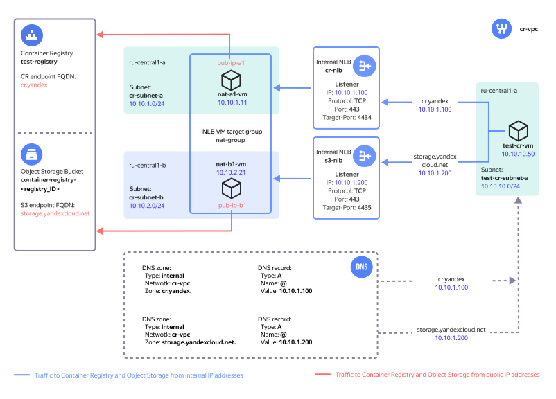

# Connecting to {{ container-registry-name }} from {{ vpc-name }}


To access [{{ container-registry-name }}](../../container-registry/), cloud resources require internet access. In this tutorial, we will deploy a {{ yandex-cloud }} infrastructure providing access to {{ container-registry-name }} for resources hosted in [{{ vpc-name }}](../../vpc/concepts/) and having no public IP addresses or internet access through a [NAT gateway](../../vpc/concepts/gateways.md).

{{ container-registry-short-name }} uses [{{ objstorage-name }}](../../storage/) to store Docker images. This solution also provides {{ objstorage-name }} access for {{ vpc-name }} resources.

You can see the solution architecture in the diagram below.



While deploying this {{ yandex-cloud }} infrastructure, you will create the following resources:

| Name | Description |
| ---- | ---- |
| `cr-vpc` `*` | Cloud network with the resources to provide with {{ container-registry-name }} access |
| `cr-nlb` | {{ container-registry-name }} internal NLB accepting TCP traffic with destination port 443 and distributing it across VM instances in a target group |
| `nat-group` | Load balancer target group of NAT instances |
| `s3-nlb` | {{ objstorage-name }} internal NLB accepting TCP traffic on port 443 and distributing it across its target group instances |
| `nat-a1-vm`, `nat-b1-vm` | NAT instances residing in the `{{ region-id }}-a` and `{{ region-id }}-b` availability zones for routing traffic to and from {{ container-registry-name }} and {{ objstorage-name }} with translation of IP addresses of traffic sources and targets | 
| `pub-ip-a1`, `pub-ip-b1` | VM public IP addresses mapped by the VPC network from their internal IP addresses | 
| `DNS zones and A records` | `{{ s3-storage-host }}.` and `{{ registry }}.` internal DNS zones in the `cr-vpc` network with `A` resource records mapping domain names to IP addresses of internal network load balancers |
| `test-registry` | Test registry in {{ container-registry-name }} |
| `container-registry-<registry_ID>` | Name of the {{ objstorage-name }} bucket for storing Docker images, automatically created by {{ container-registry-name }} for `<registry_ID>` |
| `cr-subnet-a`, `cr-subnet-b` | Cloud subnets to host NAT instances in the `{{ region-id }}-a` and `{{ region-id }}-b` zones |
| `test-cr-vm` | VM used to test access to {{ container-registry-name }} |
| `test-cr-subnet-a` | Cloud subnet to host the test VM |

`*` *You can also specify an existing cloud network.*

We will use the following internal DNS zones created in [{{ dns-name }}](../../dns/concepts/) for the cloud network hosting our resources:
* `{{ registry }}.` and an `A` resource record mapping the `{{ registry }}` domain name of {{ container-registry-name }} to the IP address of the `cr-nlb` [internal network load balancer](../../network-load-balancer/concepts/nlb-types.md). 
* `{{ s3-storage-host }}.` and an `A` resource record mapping the `{{ s3-storage-host }}` domain name of {{ objstorage-short-name }} to the IP address of the `s3-nlb` internal network load balancer. 

These records will direct traffic coming from your cloud resources and aimed at {{ container-registry-short-name }} and {{ objstorage-short-name }} to internal load balancers that will, in turn, distribute it across NAT instances.

To deploy a NAT instance, use [this image from Marketplace](/marketplace/products/yc/nat-instance-ubuntu-22-04-lts). It translates the source and target IP addresses to ensure traffic routing to the {{ container-registry-short-name }} and {{ objstorage-short-name }} public IP addresses.

By placing the NAT instances in multiple [availability zones](../../overview/concepts/geo-scope), you can ensure fault-tolerant access to {{ container-registry-short-name }}. You can scale the solution for higher workloads by adding more NAT instances. Before doing that, factor in the [locality of traffic handling by the internal load balancer](../../network-load-balancer/concepts/specifics.md#nlb-int-locality). 

Only the cloud resources that use this solution can access the registry. The [registry access policy](../../container-registry/operations/registry/registry-access.md) only allows access from public IP addresses belonging to NAT instances, so you will not be able to access it from any other IP address. If you need, you can remove this limitation in {{ TF }} settings.

For more information, see the [project repository](https://github.com/yandex-cloud-examples/yc-cr-private-endpoint). 

To deploy a cloud infrastructure providing {{ container-registry-short-name }} access for {{ vpc-short-name }} cloud network resources:

1. [Get your cloud ready](#prepare-cloud).
1. [Configure the CLI profile](#setup-profile).
1. [Set up your environment](#prepare-environment).
1. [Deploy your resources](#create-resources).
1. [Test the solution](#test-functionality).
1. [Tips for production deployment](#deployment-requirements).

If you no longer need the resources you created, [delete them](#clear-out).

## Get your cloud ready {#prepare-cloud}



### Required paid resources {#paid-resources}

The infrastructure support cost includes:

* Fee for continuously running VMs (see [{{ compute-full-name }} pricing](../../compute/pricing.md)).
* Fee for using {{ network-load-balancer-name }} (see [{{ network-load-balancer-full-name }} pricing](../../network-load-balancer/pricing.md)).
* Fee for storing pushed Docker images (see [{{ container-registry-name }} pricing](../../container-registry/pricing.md)).
* Fee for public IP addresses and outbound traffic (see [{{ vpc-full-name }} pricing](../../vpc/pricing.md)).

### Required quotas {#required-quotes}

Make sure your cloud has sufficient [quotas](../../overview/concepts/quotas-limits.md) not used by other projects.



| Resource | Quantity |
| ----------- | ----------- |
| Virtual machines | 3 |
| VM vCPUs | 6 |
| VM RAM | 6 GB |
| Disks | 3 |
| HDD size | 30 GB |
| SSD size | 20 GB |
| Network load balancer | 2 |
| Load balancer target group | 1 |
| Networks | 1`*` |
| Subnets | 3 |
| Static public IP addresses | 2 |
| Security groups | 1 |
| DNS zone | 2 |
| Registry | 1 |
| Service account | 1 |

`*` *Unless you use an existing network and specified its ID in `terraform.tfvars`.*



## Configure the CLI profile {#setup-profile}

1. If you do not have the {{ yandex-cloud }} CLI yet, [install](../../cli/quickstart.md) it and sign in.
1. Create a service account:

   

   - Management console {#console}

      1. In the [management console]({{ link-console-main }}), select the folder where you want to create a service account.
      1. From the list of services, select **{{ ui-key.yacloud.iam.folder.dashboard.label_iam }}**.
      1. Click **{{ ui-key.yacloud.iam.folder.service-accounts.button_add }}**.
      1. Enter a name for the service account, e.g., `sa-terraform`.
      1. Click **{{ ui-key.yacloud.iam.folder.service-account.popup-robot_button_add }}**.

   - CLI {#cli}

      

      To create a service account, run the command below, specifying `sa-terraform` as the service account name:

      ```bash
      yc iam service-account create --name sa-terraform
      ```

      Where `name` is the service account name.

      Result:
      ```text
      id: ajehr0to1g8b********
      folder_id: b1gv87ssvu49********
      created_at: "2023-06-20T09:03:11.665153755Z"
      name: sa-terraform
      ```

   - API {#api}

      To create a service account, use the [ServiceAccountService/Create](../../iam/api-ref/grpc/ServiceAccount/create.md) gRPC API call or the [create](../../iam/api-ref/ServiceAccount/create.md) REST API method for the `ServiceAccount` resource.

   

1. Assign the admin [role](../../iam/concepts/access-control/roles.md) for the folder to the service account: 

   

   - Management console {#console}

      1. In the [management console]({{ link-console-main }}), select your service account folder.
      1. Navigate to the **{{ ui-key.yacloud.common.resource-acl.label_access-bindings }}** tab.
      1. Select `sa-terraform` from the account list and click  -> **{{ ui-key.yacloud.common.resource-acl.button_assign-binding }}**.
      1. In the dialog that opens, click **{{ ui-key.yacloud_components.acl.button.add-role }}** and select the `admin` role.

   - CLI {#cli}

      Run this command:
      ```
      yc resource-manager folder add-access-binding <folder_ID> \
         --role admin \
         --subject serviceAccount:<service_account_ID>
      ```

   - API {#api}

      To assign a role for a folder to a service account, use the [setAccessBindings](../../iam/api-ref/ServiceAccount/setAccessBindings.md) REST API method for the [ServiceAccount](../../iam/api-ref/ServiceAccount/index.md) resource or the [ServiceAccountService/SetAccessBindings](../../iam/api-ref/grpc/ServiceAccount/setAccessBindings.md) gRPC API call.

   

1. Set up the CLI profile to run operations under the service account:

   

   - CLI {#cli}

      1. Create an [authorized key](../../iam/concepts/authorization/key.md) for the service account and save it to the file:
         ```
         yc iam key create \
         --service-account-id <service_account_ID> \
         --folder-id <ID_of_folder_with_service_account> \
         --output key.json
         ```
         Where:
         * `service-account-id`: Service account ID.
         * `folder-id`: Service account folder ID.
         * `output`: Authorized key file name.

         Result:
         ```
         id: aje8nn871qo4********
         service_account_id: ajehr0to1g8b********
         created_at: "2023-06-20T09:16:43.479156798Z"
         key_algorithm: RSA_2048
         ```

      1. Create a CLI profile to run operations under the service account:
         ```
         yc config profile create sa-terraform
         ```

         Result:
         ```
         Profile 'sa-terraform' created and activated
         ```

      1. Configure the profile:
         ```
         yc config set service-account-key key.json
         yc config set cloud-id <cloud_ID>
         yc config set folder-id <folder_ID>
         ```

         Where:
         * `service-account-key`: Service account authorized key file.
         * `cloud-id`: [Cloud ID](../../resource-manager/operations/cloud/get-id.md).
         * `folder-id`: [Folder ID](../../resource-manager/operations/folder/get-id.md).

      1. Add your credentials to the environment variables:
         ```
         export YC_TOKEN=$(yc iam create-token)
         ```

   

## Set up your environment {#prepare-environment}

### Install the required tools {#install-utilities}

1. Install [Git](https://en.wikipedia.org/wiki/Git) using the following command:

   ```bash
   sudo apt install git
   ```

1. [Install {{ TF }}](../../tutorials/infrastructure-management/terraform-quickstart.md#install-terraform).

## Deploy your resources {#create-resources}

1. Clone the GitHub [repository](https://github.com/yandex-cloud-examples/yc-cr-private-endpoint/) and navigate to the `yc-cr-private-endpoint` script directory:
   
   ```bash
   git clone https://github.com/yandex-cloud-examples/yc-cr-private-endpoint.git
   cd yc-cr-private-endpoint
   ```

1. Open the `terraform.tfvars` file and edit it as follows:

   1. Folder ID line:

      ```text
      folder_id = "<folder_ID>"
      ```

   1. Line with a list of the aggregated prefixes of cloud subnets allowed to access {{ container-registry-short-name }}:

      ```text
      trusted_cloud_nets = ["10.0.0.0/8", "192.168.0.0/16"]
      ```

   

   | Parameter<br>name | Change<br>required | Description | Type | Example |
   | --- | --- | --- | --- | --- |
   | `folder_id` | Yes | Solution components folder ID | `string` | `b1gentmqf1ve9uc54nfh` |
   | `vpc_id` | - | ID of your cloud network to provide with {{ container-registry-short-name }} access. If left empty, the system will create a new network. | `string` | `enp48c1ndilt42veuw4x` |
   | `yc_availability_zones` | - | List of the [availability zones](../../overview/concepts/geo-scope.md) for deploying NAT instances  | `list(string)` | `["{{ region-id }}-a", "{{ region-id }}-b"]` |
   | `subnet_prefix_list` | - | List of cloud subnets prefixes to host the NAT instances (one subnet per each availability zone from the `yc_availability_zones` list in the same order). | `list(string)` | `["10.10.1.0/24", "10.10.2.0/24"]` |
   | `nat_instances_count` | - | Number of NAT instances to deploy. We recommend setting an even number to evenly distribute the instances across the availability zones. | `number` | `2` |
   | `registry_private_access` | - | This parameter limits access to the registry to the public IP addresses of NAT instances. You can set it to `true` to apply this limitation or `false`, to remove it. | `bool` | `true` |
   | `trusted_cloud_nets` | Yes | List of the aggregated prefixes of cloud subnets allowed to access {{ container-registry-short-name }}. It is used in the inbound traffic rule for NAT instance security groups.  | `list(string)` | `["10.0.0.0/8", "192.168.0.0/16"]` |
   | `vm_username` | - | NAT instance and test VM username | `string` | `admin` |
   | `cr_ip` | - | {{ container-registry-short-name }} public IP address | `string` | `84.201.171.239` |
   | `cr_fqdn` | - | {{ container-registry-short-name }} domain name | `string` | `{{registry}}` | 
   | `s3_ip` | - | {{ objstorage-short-name }} public IP address | `string` | `213.180.193.243` |
   | `s3_fqdn` | - | {{ objstorage-short-name }} domain name | `string` | `{{ s3-storage-host }}` |

   

1. Deploy your cloud resources using {{ TF }}:

   1. Initialize {{ TF }}:

      ```bash
      terraform init
      ```

   1. Check the {{ TF }} file configuration:

      ```bash
      terraform validate
      ```

   1. Check the list of new cloud resources:

      ```bash
      terraform plan
      ```

   1. Create the resources:

      ```bash
      terraform apply
      ```

1. Once the `terraform apply` process is complete, the command line will show the information you need to connect to the test VM and run {{ container-registry-short-name }} tests. Later on, you can view this info by running the `terraform output` command:

   

   | Name | Description | Value (example) |
   | ----------- | ----------- | ----------- |
   | `cr_nlb_ip_address` | IP address of the {{ container-registry-short-name }} internal load balancer | `10.10.1.100` |
   | `cr_registry_id` | Registry ID in {{ container-registry-short-name }} | `crp1r4h00mj*********` |
   | `path_for_private_ssh_key` | File with a private key for SSH access to NAT instances and test VM | `./pt_key.pem` |
   | `s3_nlb_ip_address` | IP address of the {{ objstorage-short-name }} internal load balancer | `10.10.1.200` |
   | `test_vm_password` | Test VM `admin` password | `v3RCqUrQN?x)` |
   | `vm_username` | NAT instance and test VM username | `admin` |

   

## Test the solution {#test-functionality}

1. In the [management console]({{ link-console-main }}), navigate to the folder with the resources you created.

1. Select **{{ compute-name }}**.

1. Select `test-cr-vm` from the list of VMs.

1. In the left-hand menu, select **{{ ui-key.yacloud.compute.instance.switch_console }}**.

1. Click **{{ ui-key.yacloud.compute.instance.console.connect }}**.

1. Enter the `admin` username and the password from the `terraform output test_vm_password` command output (without quotation marks).

1. Run this command:

   ```bash
   dig {{registry}} {{ s3-storage-host }}
   ```

1. Check the DNS server response and make sure the {{ objstorage-name }} and {{ container-registry-name }} domain names resolve to the IP addresses of the relevant internal load balancers. The command output will show `A`-type resource records as follows:

   ```text
   ;; ANSWER SECTION:
   {{registry}}.               300    IN      A       10.10.1.100

   ;; ANSWER SECTION:
   {{ s3-storage-host }}. 300    IN      A       10.10.1.200
   ```

1. View the list of available Docker images: 

   ```bash
   docker image list
   ```

   Result:
   ```text
   REPOSITORY    TAG       IMAGE ID       CREATED        SIZE
   golang        1.20.5    342*********   8 months ago   777MB
   hello-world   latest    9c7*********   9 months ago   13.3kB
   ```

1. Assign a URL to the Docker image using the following format: `{{ registry }}/<registry_ID>/<Docker_image_name>:<tag>`. This Docker command will retrieve the registry ID from the test VM environment variable:

   ```bash
   docker tag hello-world {{ registry }}/$REGISTRY_ID/hello-world:demo

   docker image list
   ```

   Result:
   ```text
   REPOSITORY                                   TAG       IMAGE ID       CREATED        SIZE
   golang                                       1.20.5    342*********   8 months ago   777MB
   {{registry}}/crp1r4h00mj*********/hello-world   demo      9c7*********   9 months ago   13.3kB
   hello-world                                  latest    9c7*********   9 months ago   13.3kB
   ```

   

   To push Docker images to {{ container-registry-short-name }}, you need to assign them URLs in this format: `{{ registry }}/<registry_ID>/<Docker_image_name>:<tag>`.

   

1. Push the required Docker image to the registry:

   ```bash
   docker push {{registry}}/$REGISTRY_ID/hello-world:demo
   ```

   Result:
   ```text
   The push refers to repository [{{registry}}/crp1r4h00mj*********/hello-world]
   01bb4*******: Pushed 
   demo: digest: sha256:7e9b6e7ba284****************** size: 525
   ```

1. In the [management console]({{ link-console-main }}), navigate to the folder with the resources you created.

1. Select **{{ container-registry-name }}**.

1. Select `test-registry`.

1. Make sure the registry now contains the `hello-world` repository with the Docker image.

## Tips for production deployment {#deployment-requirements}

* When deploying NAT instances in two availability zones, use an even number of VMs to evenly distribute them between availability zones.
* When selecting the number of NAT instances, factor in the [locality of traffic handling by the internal load balancer](../../network-load-balancer/concepts/specifics.md#nlb-int-locality).
* Once the solution is deployed, use planned downtime windows for maintenance, e.g., removing NAT instances or changing the `yc_availability_zones` setting, during which the system will not process user requests.
* If you see a high `CPU steal time` value as the {{ container-registry-name }} workload increases, enable a [software-accelerated network](../../vpc/concepts/software-accelerated-network.md) for this NAT instance.
* If you are using your own DNS server, create the following type `A` resource records in its zone file:

   | Name | Type | Value |
   | ----------- | ----------- | ----------- |
   | `{{ registry }}.` | `A` | `<IP address of the {{ container-registry-name }} internal load balancer. To get it, run terraform output cr_nlb_ip_address>` |
   | `{{ s3-storage-host }}.` | `A` | `<IP address of the {{ objstorage-name }} internal load balancer. To get it, run terraform output s3_nlb_ip_address>` |

* Save the `pt_key.pem` private key for SSH access to NAT instances to a secure location or recreate it without using {{ TF }}.
* In our test solution, SSH access to NAT instances is disabled. To enable it, in the `cr-nat-sg` [security group](../../vpc/concepts/security-groups.md), add an inbound traffic rule allowing access on port `TCP/22` from your trusted IP addresses.
* Once you tested the solution, delete the test VM and its subnet.

## Delete the resources you created {#clear-out}

- Manually {#manual}

    1. In the [management console]({{ link-console-main }}), navigate to the folder with the resources you created.
    1. Select **{{ container-registry-name }}**.
    1. Select `test-registry`.
    1. Select the `hello-world` repository.
    1. For each Docker image in the repository, click .
    1. In the menu that opens, click **{{ ui-key.yacloud.common.delete }}**.
    1. In the window that opens, click **{{ ui-key.yacloud.cr.image.popup-confirm_button_delete }}**.

- Using {{ TF }} {#tf}

    
