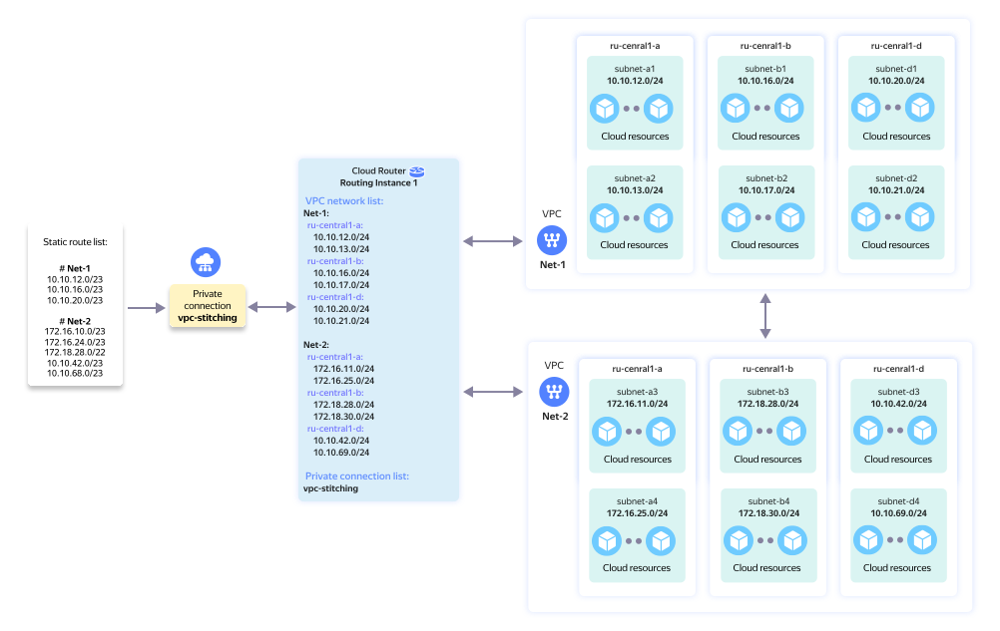

# Setting up network connectivity between multiple virtual networks using VPC Stitching




With [VPC Stitching](../../cloud-router/concepts/vpc-stitching.md), you can set up IP connectivity between two or more {{ vpc-name }} [networks](../../vpc/concepts/network.md) that are located in different folders or clouds.



You can only configure VPC Stitching for cloud networks belonging to clouds within the same [organization](../../organization/concepts/organization.md). Cross-organization network connectivity is not supported.




You can see the solution architecture in the diagram below:




This tutorial uses the following configuration:

* `Net-1` cloud network with multiple subnets.
* `Net-2` cloud network with multiple subnets.
* `vpc-stitching` private connection that routes traffic between cloud networks.
* `ri-1` virtual router with the private connection, cloud networks, and the IP prefixes of their subnets added to it.
* [Stitching announcements](../../cloud-router/concepts/vpc-stitching.md) aggregating the IP prefixes of the subnets in each cloud network.



No SLA is provided for VPC Stitching. The amount of traffic transmitted through VPC Stitching cannot be monitored. Data transmission beyond the trunk [capacity](../../interconnect/concepts/capacity.md) is possible but not guaranteed.



To set up VPC Stitching:

1. [Create a trunk](#create-trunk) if you do not have an appropriate {{ interconnect-name }} connection yet.
1. [Create a private connection](#create-prc).
1. [Create a virtual router](#create-ri).
1. [Contact support to enable VPC Stitching](#enable-vpc-stitching).
1. [Add cloud networks and IP prefixes to the virtual router](#add-prefixes).
1. [Add stitching announcements to the private connection](#add-static-routes).
1. [Test network connectivity](#check-connectivity).

## Getting started {#before-you-begin}

Make sure that:

* The cloud networks to set up connectivity between belong to clouds within the same organization.
* The subnet IP prefixes of these networks do not overlap.
* You have the [cic.editor](../../interconnect/security/index.md#cic-editor) and [cloud-router.editor](../../cloud-router/security/index.md#cloudrouter-editor) roles for the folders containing {{ interconnect-name }} and {{ cr-name }} resources, respectively.
* The {{ yandex-cloud }} CLI is [installed and configured](../../cli/quickstart.md) if you intend to use it.

VPC Stitching requires the following:

* [Trunk](../../interconnect/concepts/trunk.md) with at least 300 TB of data, equivalent to a capacity of 1 Gbit/s.
* [Private connection](../../interconnect/concepts/priv-con.md) created in the trunk with a special VPC Stitching configuration.
* [Virtual router](../../cloud-router/concepts/routing-instance.md) with the private connection and cloud networks added to it.

If you already have a trunk with at least 300 TB of data, proceed to [creating a private connection](#create-prc). If the amount of data is less than 300 TB, [change the connection capacity](../../interconnect/operations/trunk-update.md#capacity) and wait for support to confirm.

If the private connection and virtual router with the required configuration have already been created and support has confirmed that VPC Stitching is enabled, proceed to [configuring IP prefixes](#add-prefixes).

## Create a trunk {#create-trunk}

Create a [support ticket]({{ link-console-support }}) to create a {{ interconnect-name }} trunk with 300 TB of data.

Use the following ticket template:

```text
Subject: [CIC] Creating a new trunk to enable VPC Stitching.

Text of request:
Please create a new Cloud Interconnect trunk for VPC Stitching
with 300 TB of data in the <folder_ID> folder.
```

Wait for support to confirm. After the trunk is created, [get its ID](../../interconnect/operations/trunk-get-info.md), as you will need it when creating your private connection.

## Create a private connection {#create-prc}

Create a private connection with the following configuration:

#|
|| **Parameter** | **Value** ||
|| Name | `vpc-stitching` ||
|| VLAN ID | `4095` ||
|| Subnet for BGP peering | `172.31.255.0/30` ||
|| IP address of the customer-premises equipment | `172.31.255.1` ||
|| IP address of the {{ yandex-cloud }} equipment | `172.31.255.2` ||
|| BGP ASN on the customer-premises equipment | `65534` ||
|#



- Management console {#console}

  1. In the [management console]({{ link-console-main }}), select the folder containing the trunk.
  1. [Navigate]({{ link-console-main }}/link/interconnect) to **{{ ui-key.yacloud.ui.constants.label_interconnect_aUMcv }}**.
  1. In the left-hand panel, select  **{{ ui-key.yacloud.interconnect.private-connection.private-connections_daeaR }}** and click **{{ ui-key.yacloud.interconnect.private-connection.create-private-connection_6K9tP }}**.
  1. In the window that opens:

      1. In the **{{ ui-key.yacloud.interconnect.private-connection.TrunkConnectionSuggestOrCreate.title_oPBF7 }}** field, select the previously created trunk.
      1. In the **{{ ui-key.yacloud.interconnect.vlan-id_2wghK }}** field, specify `4095`.
      1. In the **{{ ui-key.yacloud.interconnect.peering-subnet_eYRTR }}** field, specify `172.31.255.0/30`.
      1. In the **{{ ui-key.yacloud.interconnect.peer-ip_pMdxo }}** field, specify `172.31.255.1`.
      1. In the **{{ ui-key.yacloud.interconnect.cloud-ip_6ESSe }}** field, specify `172.31.255.2`.
      1. In the **{{ ui-key.yacloud.interconnect.bgp-asn_3dSL7 }}** field, specify `65534`.
      1. Under **{{ ui-key.yacloud.common.section-base }}**, specify `vpc-stitching` in the **{{ ui-key.yacloud.common.name }}** field.
      1. Click **{{ ui-key.yacloud.common.create }}**.
  1. [Get the ID](../../interconnect/operations/priv-con-get-info.md) of the private connection you created.

- CLI {#cli}

  

  

  1. View the description of the CLI command to create a private connection:

      ```bash
      yc cic private-connection create --help
      ```

  1. Create a private connection:

      ```bash
      yc cic private-connection create \
        --name vpc-stitching \
        --trunk-id <trunk_ID> \
        --vlan-id 4095 \
        --ipv4-peering 'peering-subnet=172.31.255.0/30,peer-ip=172.31.255.1,cloud-ip=172.31.255.2,peer-bgp-asn=65534' \
        --async
      ```

      Where:

      * `--name`: Private connection name.
      * `--trunk-id`: Trunk ID.
      * `--vlan-id`: Private connection VLAN ID.
      * `--ipv4-peering`: Comma-separated BGP peering parameters in `key=value` format.
      * `--async`: Optional parameter for running the operation asynchronously.

  1. Wait for the operation to complete and get information about the private connection:

      ```bash
      yc cic private-connection get --name vpc-stitching
      ```

      Save the `id` field value, as you will need it later.



## Create a virtual router {#create-ri}

Create a virtual router named `ri-1` and add the `vpc-stitching` private connection to it.



- Management console {#console}

  1. In the [management console]({{ link-console-main }}), select the folder where you want to create a virtual router.
  1. [Navigate]({{ link-console-main }}/link/cloud-router) to **{{ ui-key.yacloud.ui.constants.label_cloud-router_kBGNL }}**.
  1. Click **{{ ui-key.yacloud.cloud-router.router.create-router_v4cPC }}**.
  1. Enter the virtual router name: `ri-1`.
  1. In the **{{ ui-key.yacloud.interconnect.private-connection.private-connections_daeaR }}** field, select the `vpc-stitching` connection or specify its ID.
  1. Click **{{ ui-key.yacloud.common.create }}**.
  1. [Get the ID](../../cloud-router/operations/ri-get-info.md) of the virtual router you created.

- CLI {#cli}

  

  

  1. See the description of the CLI command for creating a virtual router:

      ```bash
      yc cloudrouter routing-instance create --help
      ```

  1. Create a virtual router and add your private connection to it:

      ```bash
      yc cloudrouter routing-instance create \
        --name ri-1 \
        --folder-id <folder_ID> \
        --cic-prc <private_connection_ID> \
        --async
      ```

      Where:

      * `--name`: Virtual router name.
      * `--folder-id`: ID of the folder where you are creating your virtual router.
      * `--cic-prc`: `vpc-stitching` private connection ID.
      * `--async`: Optional parameter for running the operation asynchronously.

  1. Wait for the operation to complete and get information about the virtual router:

      ```bash
      yc cloudrouter routing-instance get --name ri-1
      ```

      Save the value of the `id` field.



## Contact support to enable VPC Stitching {#enable-vpc-stitching}

Create a [support ticket]({{ link-console-support }}) to enable VPC Stitching for your private connection.

Use the following ticket template:

```text
Subject: [CloudRouter] Enabling VPC Stitching.

Text of request:
Please enable VPC Stitching:
* Private connection ID (prc-id):
  bd6g2**********7c8sv (vpc-stitching).
* Virtual router ID (ri-id):
  fokrf**********ml058 (ri-1).
```

Wait for support to confirm that VPC Stitching is enabled before proceeding with the configuration.

## Add cloud networks and IP prefixes {#add-prefixes}

Add `Net-1` and `Net-2` to your virtual router and configure subnet IP prefixes.

Use the following subnet names and IP prefixes for the cloud networks:

* `Net-1` (`enpcfncr6uld********`):

  * `{{ region-id }}-a` zone:

    * `subnet-a1`: `10.10.12.0/24`
    * `subnet-a2`: `10.10.13.0/24`

  
  * `{{ region-id }}-b` zone:

    * `subnet-b1`: `10.10.16.0/24`
    * `subnet-b2`: `10.10.17.0/24`

  * `{{ region-id }}-d` zone:

    * `subnet-d1`: `10.10.20.0/24`
    * `subnet-d2`: `10.10.21.0/24`


* `Net-2` (`enpt8ok6snlp********`):

  * `{{ region-id }}-a` zone:

    * `subnet-a3`: `172.16.11.0/24`
    * `subnet-a4`: `172.16.25.0/24`

  
  * `{{ region-id }}-b` zone:

    * `subnet-b3`: `172.18.28.0/24`
    * `subnet-b4`: `172.18.30.0/24`

  * `{{ region-id }}-d` zone:

    * `subnet-d3`: `10.10.42.0/24`
    * `subnet-d4`: `10.10.69.0/24`




- Management console {#console}

  1. In the [management console]({{ link-console-main }}), select the folder containing the `ri-1` virtual router.
  1. [Navigate]({{ link-console-main }}/link/cloud-router) to **{{ ui-key.yacloud.ui.constants.label_cloud-router_kBGNL }}**.
  1. In the row with the `ri-1` virtual router, click  and select  **{{ ui-key.yacloud.common.edit }}**.
  1. Under **{{ ui-key.yacloud.cloud-router.router.routing-networks_42RL1 }}**, select `Net-1` and `Net-2`.
  1. In the network sections that appear, select the subnets by name and add their IP prefixes for the matching availability zones using the values from the list above.
  1. Click **{{ ui-key.yacloud.common.save }}**.

- CLI {#cli}

  

  

  1. View the description of the CLI command for managing the networks and IP prefixes of a virtual router:

      ```bash
      yc cloudrouter routing-instance update-networks --help
      ```

  1. Add `Net-1` and `Net-2` and the IP prefixes of their subnets:

      
      ```bash
      yc cloudrouter routing-instance update-networks \
        <virtual_router_ID> \
        --add-vpc-net 'id=enpcfncr6uld********,zone={{ region-id }}-a,ipv4-prefixes=[10.10.12.0/24,10.10.13.0/24]' \
        --add-vpc-net 'id=enpcfncr6uld********,zone={{ region-id }}-b,ipv4-prefixes=[10.10.16.0/24,10.10.17.0/24]' \
        --add-vpc-net 'id=enpcfncr6uld********,zone={{ region-id }}-d,ipv4-prefixes=[10.10.20.0/24,10.10.21.0/24]' \
        --add-vpc-net 'id=enpt8ok6snlp********,zone={{ region-id }}-a,ipv4-prefixes=[172.16.11.0/24,172.16.25.0/24]' \
        --add-vpc-net 'id=enpt8ok6snlp********,zone={{ region-id }}-b,ipv4-prefixes=[172.18.28.0/24,172.18.30.0/24]' \
        --add-vpc-net 'id=enpt8ok6snlp********,zone={{ region-id }}-d,ipv4-prefixes=[10.10.42.0/24,10.10.69.0/24]' \
        --async
      ```


      Use the following format to specify each `--add-vpc-net` parameter: `id=<network_ID>,zone=<availability_zone>,ipv4-prefixes=[<CIDR>,...]`.

      If a network has already been added to the virtual router, use `--update-vpc-net` rather than `--add-vpc-net`.

  1. Wait for the operation to complete and check the virtual router configuration:

      ```bash
      yc cloudrouter routing-instance get \
        <virtual_router_ID>
      ```

      The `vpc_info` section should show both networks and all IP prefixes you configured.



## Add stitching announcements {#add-static-routes}

Add aggregated IP prefixes to your private connection to use them as [stitching announcements](../../cloud-router/concepts/vpc-stitching.md):

* For `Net-1`:

  * `10.10.12.0/23`

  
  * `10.10.16.0/23`
  * `10.10.20.0/23`


* For `Net-2`:

  * `172.16.10.0/23`

  
  * `172.16.24.0/23`
  * `172.18.28.0/22`
  * `10.10.42.0/23`
  * `10.10.68.0/23`




Do not use the IP prefixes of the subnets themselves as stitching announcements. Each stitching announcement must consist of an aggregated prefix that includes the matching subnet prefixes.





- Management console {#console}

  1. In the [management console]({{ link-console-main }}), select the folder containing the `vpc-stitching` private connection.
  1. [Navigate]({{ link-console-main }}/link/interconnect) to **{{ ui-key.yacloud.ui.constants.label_interconnect_aUMcv }}**.
  1. In the left-hand panel, select  **{{ ui-key.yacloud.interconnect.private-connection.private-connections_daeaR }}**.
  1. In the row with the `vpc-stitching` private connection, click  and select  **{{ ui-key.yacloud.common.edit }}**.
  1. In the **IPv4 StaticRoute prefix** field, add all stitching announcement from the list above. To add another prefix, click **{{ ui-key.yacloud.interconnect.private-connection.StaticRoutePrefixRow.add-prefix-button_n11CU }}**.
  1. Click **{{ ui-key.yacloud.common.save }}**.

- CLI {#cli}

  

  

  1. See the description of the CLI command for adding static routes to a private connection:

      ```bash
      yc cic private-connection upsert-static-routes --help
      ```

  1. Add stitching announcements:

      
      ```bash
      yc cic private-connection upsert-static-routes \
        <private_connection_ID> \
        --ipv4-static-routes "10.10.12.0/23,10.10.16.0/23,10.10.20.0/23,172.16.10.0/23,172.16.24.0/23,172.18.28.0/22,10.10.42.0/23,10.10.68.0/23" \
        --async
      ```


      The first positional argument is the private connection ID or name. Use `--ipv4-static-routes` to provide stitching announcements in CIDR format, as a comma-separated list with no spaces. The `--async` setting is optional.

  1. Wait for the operation to complete and check the private connection configuration:

      ```bash
      yc cic private-connection get \
        <private_connection_ID>
      ```

      The `ipv4_static_routes` field should show all the prefixes you added.



## Test network connectivity {#check-connectivity}

Before testing, make sure that:

* Each network being interconnected has a running resource with an IP address from the configured prefix.
* Security groups and local resource firewalls allow ICMP traffic between the networks.
* The virtual router is `ACTIVE`.
* The virtual router configuration includes `Net-1` and `Net-2`, their IP prefixes, and the `vpc-stitching` private connection.

1. Connect to a resource in `Net-1` and run this command:

    ```bash
    ping -c 5 <resource_internal_IP_address_in_Net-2>
    ```

1. Connect to a resource in `Net-2` and run this command:

    ```bash
    ping -c 5 <resource_internal_IP_address_in_Net-1>
    ```

Network connectivity is considered established if packets are transmitted in both directions. Report your test results in the ticket you opened to enable VPC Stitching.

If connectivity cannot be established, check the IP prefixes, stitching announcements, security group rules, and local firewall rules. If you cannot resolve the issue on your own, include the test results in your support ticket.
