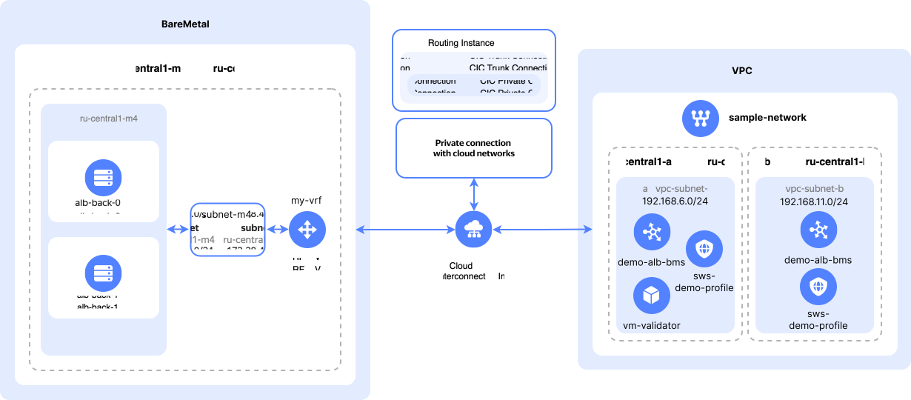

# Deploying a web application on {{ baremetal-full-name }} servers with an L7 load balancer and {{ sws-full-name }} protection

In this tutorial, you will deploy a web application on {{ baremetal-full-name }} [servers](../../baremetal/concepts/servers.md). To evenly distribute load across the application hosts, you will configure an [L7 load balancer](../../application-load-balancer/concepts/application-load-balancer.md) in {{ alb-full-name }}. A {{ sws-full-name }} [profile](../../smartwebsecurity/concepts/profiles.md) will ensure protection of your web application from bots, DDoS, and web attacks. A {{ interconnect-full-name }} [routing instance](../../cloud-router/concepts/routing-instance.md) will provide a [private connection](../../interconnect/concepts/priv-con.md) between the {{ vpc-full-name }} [cloud network](../../vpc/concepts/network.md#network) and the {{ baremetal-full-name }} [private network](../../baremetal/concepts/network.md#private-network).

You can see the solution architecture in the diagram below:



Where:
* {{ baremetal-name }} infrastructure components:

    * Private subnet in the `{{ region-id }}-m4` [server pool](../../baremetal/concepts/servers.md#server-pools): `subnet-m4`.
    * [Virtual network segment](../../baremetal/concepts/network.md#vrf-segment) (VRF), `my-vrf`.
    * Two {{ baremetal-name }} servers, `alb-back-0` and `alb-back-1`, hosting the deployed application in the `{{ region-id }}-m4` server pool.
* {{ interconnect-name }} `Routing Instance` for connectivity between the {{ vpc-name }} and {{ baremetal-name }} networks.
* [{{ vpc-name }}](../../vpc/index.yaml) infrastructure components:

    * Cloud network, `sample-network`.
    * [Subnets](../../vpc/concepts/network.md#subnet) named `vpc-subnet-a` and `vpc-subnet-b` in the `{{ region-id }}-a` and `{{ region-id }}-b` [availability zones](../../overview/concepts/geo-scope.md), respectively.
    * L7 load balancer from {{ alb-name }} , `demo-alb-bms`.
    * {{ sws-name }} profile, `sws-demo-profile`.
    * `vm-validator` [VM](../../compute/concepts/vm.md) for connectivity checks between the {{ vpc-name }} and {{ baremetal-name }} networks.

To deploy a web application on {{ baremetal-full-name }} servers with an L7 load balancer and {{ sws-full-name }} protection:

1. [Get your cloud ready](#before-you-begin).
1. [Set up your {{ vpc-short-name }} environment](#setup-vpc).
1. [Create a routing instance](#create-routing-instance).
1. [Set up your {{ baremetal-name }} environment](#setup-baremetal).
1. [Configure an L7 load balancer](#setup-balancer).
1. [Set up protection against bots, DDoS, and web attacks](#setup-sws).

If you no longer need the resources you created, [delete them](#clear-out).

## Getting started {#before-you-begin}



### Required paid resources {#paid-resources}

The infrastructure support cost for deploying a web application on {{ baremetal-name }} servers with an L7 load balancer and {{ sws-name }} protection includes:

* Fee for using the VM [public IP address](../../vpc/concepts/address.md#public-addresses) (see [{{ vpc-full-name }} pricing](../../vpc/pricing.md)).
* Fee for [VM](../../compute/concepts/vm.md) computing resources and disks (see [{{ compute-full-name }} pricing](../../compute/pricing.md)).
* Fee for leasing the {{ baremetal-name }} servers (see [{{ baremetal-full-name }} pricing](../../baremetal/pricing.md)).
* Fee for using an L7 load balancer’s computing resources (see [{{ alb-full-name }} pricing](../../application-load-balancer/pricing.md)).
* Fee for requests processed by security profile rules (see [{{ sws-full-name }} pricing](../../smartwebsecurity/pricing.md)).
* If using a [log group](../../logging/concepts/log-group.md) for load balancer logging, the fee for writing and storing data (see [{{ cloud-logging-full-name }} pricing](../../logging/pricing.md)).



## Set up your {{ vpc-short-name }} environment {#setup-vpc}

Configure the infrastructure on the {{ vpc-name }} side. In this step, you will create a [cloud network](../../vpc/concepts/network.md#network), [subnets](../../vpc/concepts/network.md#subnet), required [security groups](../../vpc/concepts/security-groups.md), and a [VM](../../compute/concepts/vm.md).

### Create a cloud network {#create-network}



- Management console {#console} 

  1. In the [management console]({{ link-console-main }}), select the [folder](../../resource-manager/concepts/resources-hierarchy.md#folder) where you are going to create your infrastructure.
  1. In the list of services, select **{{ ui-key.yacloud.iam.folder.dashboard.label_vpc }}**.
  1. At the top right, click **{{ ui-key.yacloud.vpc.networks.button_create }}**.
  1. In the **{{ ui-key.yacloud.vpc.networks.create.field_name }}** field, specify `sample-network`.
  1. In the **{{ ui-key.yacloud.vpc.networks.create.field_advanced }}** field, disable **{{ ui-key.yacloud.vpc.networks.create.field_is-default }}**.
  1. Click **{{ ui-key.yacloud.vpc.networks.button_create }}**.



### Create subnets {#create-subnets}



- Management console {#console} 

  1. In the [management console]({{ link-console-main }}), select the folder where you are deploying your cloud infrastructure.
  1. In the list of services, select **{{ ui-key.yacloud.iam.folder.dashboard.label_vpc }}**.
  1. In the left-hand panel, select  **{{ ui-key.yacloud.vpc.switch_networks }}**.
  1. At the top right, click **{{ ui-key.yacloud.vpc.subnetworks.button_action-create }}**.
  1. In the **{{ ui-key.yacloud.vpc.subnetworks.create.field_name }}** field, specify `vpc-subnet-a`.
  1. In the **{{ ui-key.yacloud.vpc.subnetworks.create.field_zone }}** field, select `{{ region-id }}-a`.
  1. In the **{{ ui-key.yacloud.vpc.subnetworks.create.field_network }}** field, select `sample-network`.
  1. In the **{{ ui-key.yacloud.vpc.subnetworks.create.field_ip }}** field, specify `192.168.6.0/24`.
  
      

  1. Click **{{ ui-key.yacloud.vpc.subnetworks.create.button_create }}**.
  1. Similarly, in `sample-network`, create a subnet named `vpc-subnet-b` with CIDR `192.168.11.0/24` in the `{{ region-id }}-b` availability zone.



### Create security groups {#create-sg}



- Management console {#console}

  1. In the [management console]({{ link-console-main }}), select the folder where you are deploying your cloud infrastructure.
  1. In the list of services, select **{{ ui-key.yacloud.iam.folder.dashboard.label_vpc }}**.
  1. In the left-hand panel, select  **{{ ui-key.yacloud.vpc.label_security-groups }}** and click **{{ ui-key.yacloud.vpc.network.security-groups.button_create }}**.
  1. In the **{{ ui-key.yacloud.vpc.network.security-groups.forms.field_sg-name }}** field, specify `vpc-ingress-sg`.
  1. In the **{{ ui-key.yacloud.vpc.network.security-groups.forms.field_sg-network }}** field, select `sample-network` you created earlier.
  1. Under **{{ ui-key.yacloud.vpc.network.security-groups.forms.label_section-rules }}**, [create](../../vpc/operations/security-group-add-rule.md) the following traffic management rules:

      | Traffic<br/>direction | {{ ui-key.yacloud.vpc.network.security-groups.forms.field_sg-rule-description }} | {{ ui-key.yacloud.vpc.network.security-groups.forms.field_sg-rule-port-range }} | {{ ui-key.yacloud.vpc.network.security-groups.forms.field_sg-rule-protocol }} | {{ ui-key.yacloud.vpc.network.security-groups.forms.field_sg-rule-source }} /<br/>{{ ui-key.yacloud.vpc.network.security-groups.forms.field_sg-rule-destination }} | {{ ui-key.yacloud.vpc.network.security-groups.forms.field_sg-rule-cidr-blocks }} /<br/>{{ ui-key.yacloud.vpc.network.security-groups.forms.field_sg-rule-sg-type }} |
      | --- | --- | --- | --- | --- | --- |
      | Inbound | `http`            | `80`   | `TCP`  | `{{ ui-key.yacloud.vpc.network.security-groups.forms.value_sg-rule-destination-cidr }}` | `0.0.0.0/0` |
      | Inbound | `https`            | `443`   | `TCP`  | `{{ ui-key.yacloud.vpc.network.security-groups.forms.value_sg-rule-destination-cidr }}` | `0.0.0.0/0` |
      | Inbound | `ssh`            | `22`   | `TCP`  | `{{ ui-key.yacloud.vpc.network.security-groups.forms.value_sg-rule-destination-cidr }}` | `0.0.0.0/0` |
      | Egress | `any`           | `All` | `{{ ui-key.yacloud.vpc.network.security-groups.forms.value_any }}` | `{{ ui-key.yacloud.vpc.network.security-groups.forms.value_sg-rule-destination-cidr }}` | `0.0.0.0/0` |
  1. Click **{{ ui-key.yacloud.common.create }}**.
  1. Similarly, in `sample-network`, create a [security group](../../vpc/concepts/security-groups.md) named `alb-sg` with the following rules:

      | Traffic<br/>direction | {{ ui-key.yacloud.vpc.network.security-groups.forms.field_sg-rule-description }} | {{ ui-key.yacloud.vpc.network.security-groups.forms.field_sg-rule-port-range }} | {{ ui-key.yacloud.vpc.network.security-groups.forms.field_sg-rule-protocol }} | {{ ui-key.yacloud.vpc.network.security-groups.forms.field_sg-rule-source }} /<br/>{{ ui-key.yacloud.vpc.network.security-groups.forms.field_sg-rule-destination }} | {{ ui-key.yacloud.vpc.network.security-groups.forms.field_sg-rule-cidr-blocks }} /<br/>{{ ui-key.yacloud.vpc.network.security-groups.forms.field_sg-rule-sg-type }} |
      | --- | --- | --- | --- | --- | --- |
      | Inbound | `http`            | `80`   | `TCP`  | `{{ ui-key.yacloud.vpc.network.security-groups.forms.value_sg-rule-destination-cidr }}` | `0.0.0.0/0` |
      | Inbound | `healthchecks`            | `30080`   | `TCP`  | `{{ ui-key.yacloud.vpc.network.security-groups.forms.value_sg-rule-sg-type-balancer }}` | — |
      | Outbound | `any`           | `All` | `{{ ui-key.yacloud.vpc.network.security-groups.forms.value_any }}` | `{{ ui-key.yacloud.vpc.network.security-groups.forms.value_sg-rule-destination-cidr }}` | `0.0.0.0/0` |



### Create a VM {#create-vm}



- Management console {#console}

  1. In the [management console]({{ link-console-main }}), select the folder to create the infrastructure in.
  1. In the list of services, select **{{ ui-key.yacloud.iam.folder.dashboard.label_compute }}**.
  1. In the left-hand panel, select  **{{ ui-key.yacloud.compute.instances_jsoza }}** and click **{{ ui-key.yacloud.compute.instances.button_create }}**.
  1. Under **{{ ui-key.yacloud.compute.instances.create.section_image }}**, select the [Ubuntu 24.04](/marketplace/products/yc/ubuntu-2404-lts-oslogin) image.
  1. Under **{{ ui-key.yacloud.k8s.node-groups.create.section_allocation-policy }}**, select the `{{ region-id }}-a` [availability zone](../../overview/concepts/geo-scope.md).
  1. Under **{{ ui-key.yacloud.compute.instances.create.section_network }}**:

      * In the **{{ ui-key.yacloud.component.compute.network-select.field_subnetwork }}** field, select `vpc-subnet-a`.
      * In the **{{ ui-key.yacloud.component.compute.network-select.field_external }}** field, select `{{ ui-key.yacloud.component.compute.network-select.switch_auto }}`.
      * In the **{{ ui-key.yacloud.component.compute.network-select.field_security-groups }}** field, select `vpc-ingress-sg`.

  1. Under **{{ ui-key.yacloud.compute.instances.create.section_access }}**, select **{{ ui-key.yacloud.compute.instance.access-method.label_oslogin-control-ssh-option-title }}** and specify the VM access credentials:

      * In the **{{ ui-key.yacloud.compute.instances.create.field_user }}** field, enter the username: `yc-user`.
      * 

  1. Under **{{ ui-key.yacloud.compute.instances.create.section_base }}**, specify the VM name: `vm-validator`.
  1. Click **{{ ui-key.yacloud.compute.instances.create.button_create }}**.



## Create a routing instance {#create-routing-instance}

To set up network connectivity between {{ baremetal-name }} subnets and {{ vpc-name }} subnets, you need to create a [routing instance](../../cloud-router/concepts/routing-instance.md) resource. To create a `Routing Instance`, [contact]({{ link-console-support }}/tickets/create) support.

If your folder already has [{{ interconnect-name }}](../../interconnect/index.yaml) network connectivity (VPC-to-On-Prem) configured, you can either use the existing `Routing Instance` or request a new additional `Routing Instance` to be created for standalone network connectivity.

### Make sure you have a routing instance in your folder {#check-for-ri}

1. 

    

1. 

1. If you already have a `Routing Instance`, you may skip the next step and [proceed](#setup-baremetal) to setting up your {{ baremetal-name }} environment.

    If you do not have a `Routing Instance` or you want to build additional dedicated network connectivity, [request](#request-ri) a new `Routing Instance`.

### Request a new routing instance {#request-ri}



## Set up your {{ baremetal-name }} environment {#setup-baremetal}

Configure the {{ baremetal-name }} infrastructure. In this step, you will create a [virtual network segment (VRF)](../../baremetal/concepts/network.md#vrf-segment) and [private subnet](../../baremetal/concepts/network.md#private-subnet), configure a [private connection](../../baremetal/concepts/network.md#private-connection-to-vpc) to the cloud network, and lease two {{ baremetal-name }} [servers](../../baremetal/concepts/servers.md).

### Create a VRF segment and a private subnet {#setup-vrf}

Create a VRF segment and a private subnet in the `{{ region-id }}-m4` [server pool](../../baremetal/concepts/servers.md#server-pools):



- Management console {#console}

  1. In the [management console]({{ link-console-main }}), select the folder where you are deploying your infrastructure.
  1. In the list of services, select **{{ ui-key.yacloud.iam.folder.dashboard.label_baremetal }}**.
  1. Create a virtual routing and forwarding segment:
        1. In the left-hand panel, select  **{{ ui-key.yacloud.baremetal.label_networks }}** and click **{{ ui-key.yacloud.baremetal.label_create-network }}**.
        1. In the **{{ ui-key.yacloud.baremetal.field_name }}** field, name your VRF segment: `my-vrf`.
        1. Click **{{ ui-key.yacloud.baremetal.label_create-network }}**.
  1. Create a private subnet:
        1. In the left-hand panel, select  **{{ ui-key.yacloud.baremetal.label_subnetworks }}** and click **{{ ui-key.yacloud.baremetal.label_create-subnetwork }}**.
        1. In the **{{ ui-key.yacloud.baremetal.field_server-pool }}** field, select the `{{ region-id }}-m4` server pool.
        1. In the **{{ ui-key.yacloud.baremetal.field_name }}** field, enter the subnet name: `subnet-m4`.
        1. Enable **{{ ui-key.yacloud.baremetal.title_routing-settings }}**.
        1. In the **{{ ui-key.yacloud.baremetal.field_network-id }}** field, select `my-vrf`.
        1. In the **{{ ui-key.yacloud.baremetal.field_CIDR }}** field, specify `172.28.4.0/24`.
        1. In the **{{ ui-key.yacloud.baremetal.field_gateway }}** field, keep the default value, `172.28.4.1`.
        1. Enable the **{{ ui-key.yacloud.baremetal.field_dhcp-settings }}** option and in the **{{ ui-key.yacloud.baremetal.field_dhcp-ip-range }}** field that appears, leave the default values, `172.28.4.1`-`172.28.4.254`.
        1. Click **{{ ui-key.yacloud.baremetal.label_create-subnetwork }}**.



### Configure a private connection to your cloud network {#connect-to-vpc}

Create a {{ interconnect-name }} [private connection](../../baremetal/concepts/network.md#private-connection-to-vpc) in {{ baremetal-name }}:



### Lease {{ baremetal-name }} servers {#rent-servers}



- Management console {#console}

  1. In the [management console]({{ link-console-main }}), select the folder where you are deploying your infrastructure.
  1. 
  1. Under **{{ ui-key.yacloud.baremetal.title_section-server-config }}**, click the `{{ ui-key.yacloud.baremetal.servers.ConfigurationField.poolFilter_frWLA }}` filter and select the `{{ region-id }}-m4` server pool.
  1. 
  1. 
  1. Under **{{ ui-key.yacloud.baremetal.title_section-server-product }}**, select the `Debian 11` image.
  1. In the **{{ ui-key.yacloud.baremetal.field_server-lease-duration }}** field, select your lease period: `1 day`.
  
      When this period expires, server lease will automatically be renewed for the same period. You cannot terminate the lease during the specified lease period, but you can [refuse](../../baremetal/operations/servers/server-lease-cancel.md) to extend the server lease further.
  1. Under **Network settings**:

     1. In the **{{ ui-key.yacloud.baremetal.field_subnet-id }}** field, select `subnet-m4` you created earlier.
     1. In the **{{ ui-key.yacloud.baremetal.field_needed-public-ip }}** field, select `{{ ui-key.yacloud.baremetal.label_public-ip-ephemeral }}`.

  1. Under **{{ ui-key.yacloud.baremetal.title_server-access }}**:

      

  1. Under **{{ ui-key.yacloud.baremetal.title_section-server-info }}**, in the **{{ ui-key.yacloud.baremetal.field_name }}** field, enter the server name: `alb-back-0`.
  1. 
  1. Similarly, lease one more server, `alb-back-1`, in the `{{ region-id }}-m4` server pool.





Server setup and OS installation may take up to 45 minutes. The server will have the `Provisioning` status during this time. After OS installation is complete, the server status will change to `Ready`.



### Deploy your web application {#deploy-web-service}

In this step, you will deploy your web application on {{ baremetal-name }} servers. The web application will use the following server resources:
* `/opt/mygoapp`: Web server's working directory.
* `/opt/mygoapp/server`: Web server's executable.
* `/etc/systemd/system/mygoapp.service`: Configuration file to manage the web server via [systemd](https://en.wikipedia.org/wiki/Systemd).

To deploy your web application on the server:

1. [Connect](../../compute/operations/vm-connect/ssh.md) to the `alb-back-0` {{ baremetal-name }} server over SSH:

    ```bash
    ssh root@<server_public_IP_address>
    ```

    You can look up the server's public IP address in the [management console]({{ link-console-main }}): see the {{ baremetal-name }} server info on the **{{ ui-key.yacloud.common.overview }}** page. You can find the address in the **{{ ui-key.yacloud.baremetal.field_needed-public-ip }}** field under **{{ ui-key.yacloud.baremetal.title_section-server-public-network }}**.

    You will perform all further actions under this step in the server terminal.
1. Prepare your working directory:

    ```bash
    mkdir -p /opt/mygoapp && cd /opt/mygoapp
    ```
1. Download the web server's executable:

    ```bash
    wget https://{{ s3-storage-host-ru }}/yc-public-share/server
    ```
1. Set the execute permission for the file you downloaded:

    ```bash
    chmod +x server
    ```
1. Create a new service in `systemd`:

    1. Open the service configuration file:

        ```bash
        nano /etc/systemd/system/mygoapp.service
        ```
    1. Paste the following into the file you opened:

        ```
        [Unit]
        Description=Simple Web Server on Go
        After=network.target
        [Service]
        Type=simple
        WorkingDirectory=/opt/mygoapp
        ExecStart=/opt/mygoapp/server
        Restart=always
        RestartSec=5
        [Install]
        WantedBy=multi-user.target
        ```
    1. Save the changes and close the file.
1. Initialize the service you created:

    ```bash
    systemctl daemon-reload
    ```
1. Run the service:

    ```bash
    systemctl start mygoapp.service
    ```
1. Test your web application. To do this, on your local computer, paste the `alb-back-0` server's public IP address into the browser's address bar. 

    Your browser will open a page with the host name and information about the web server’s running time since startup.

    

    ```go
    package main

    import (
      "context"
      "fmt"
      "net/http"
      "os"
      "os/signal"
      "syscall"
      "time"
      "github.com/gorilla/handlers"
    )

    var (
      hostname    string
      htmlContent []byte
    )

    const (
      serverTimeout  = 5 * time.Second
      cacheDuration  = 86400 * 30 // 30 days in seconds
      htmlTemplate = `
    <!DOCTYPE html>
    <html lang="en">
    <head>
        <!-- Minified CSS -->
        <style>*{margin:0;padding:0;box-sizing:border-box;font-family:'Segoe UI',system-ui,sans-serif}body{min-height:100vh;display:flex;justify-content:center;align-items:center;background:linear-gradient(135deg,#1a1a1a,#2d2d2d);color:#fff;padding:20px}.container{background:rgba(255,255,255,0.1);backdrop-filter:blur(10px);border-radius:20px;padding:40px;box-shadow:0 8px 32px rgba(0,0,0,0.3);text-align:center;max-width:600px;width:100%%;transition:transform .3s ease}.server-name{font-size:1.8rem;margin-bottom:30px;color:#0f0;font-weight:600;text-shadow:0 0 10px rgba(0,255,136,0.3)}.datetime{font-size:2.5rem;letter-spacing:2px;margin-bottom:20px}.date{font-size:1.5rem;opacity:.8}@media (max-width:768px){.container{padding:25px;border-radius:15px}.server-name{font-size:1.4rem}.datetime{font-size:2rem}.date{font-size:1.2rem}}@media (max-width:480px){.datetime{font-size:1.6rem}}</style>
        <meta name="viewport" content="width=device-width,initial-scale=1">
        <title>Server Info & Time</title>
    </head>
    <body>
        <div class="container">
            <div class="server-name">Server Hostname: %s</div>
            <div class="datetime" id="datetime"></div>
            <div class="date" id="date"></div>
        </div>
        <script>
            // Minified JavaScript
            const e=()=>{const e=new Date;document.getElementById("datetime").textContent=e.toLocaleTimeString("en-US",{timeZone:"Europe/Moscow",hour12:!1,hour:"2-digit",minute:"2-digit",second:"2-digit"}),document.getElementById("date").textContent=e.toLocaleDateString("en-US",{timeZone:"Europe/Moscow",weekday:"long",year:"numeric",month:"long",day:"numeric"})};e(),setInterval(e,1e3);
        </script>
    </body>
    </html>`
    )

    func init() {
      // Initializing the host at startup
      var err error
      if hostname, err = os.Hostname(); err != nil {
        hostname = "Unavailable"
      }
      
      // Pre-generating HTML
      htmlContent = []byte(fmt.Sprintf(htmlTemplate, hostname))
    }

    func main() {
      // Configuring handlers
      mux := http.NewServeMux()
      mux.HandleFunc("/", func(w http.ResponseWriter, r *http.Request) {
        w.Header().Set("Content-Type", "text/html; charset=utf-8")
        w.Header().Set("Cache-Control", fmt.Sprintf("public, max-age=%d", cacheDuration))
        w.Write(htmlContent)
      })

      // Middleware
      chain := handlers.CompressHandler(
        handlers.CombinedLoggingHandler(os.Stdout, mux),
      )

      // Server configuration
      server := &http.Server{
        Addr:         ":80",
        Handler:      chain,
        ReadTimeout:  serverTimeout,
        WriteTimeout: serverTimeout,
        IdleTimeout:  serverTimeout * 2,
      }

      // Graceful shutdown
      ctx, stop := signal.NotifyContext(context.Background(), 
        os.Interrupt, syscall.SIGTERM)
      defer stop()

      go func() {
        <-ctx.Done()
        shutdownCtx, cancel := context.WithTimeout(
          context.Background(), 5*time.Second)
        defer cancel()
        server.Shutdown(shutdownCtx)
      }()

      fmt.Println("Server started")
      if err := server.ListenAndServe(); err != http.ErrServerClosed {
        fmt.Printf("Server error: %v\n", err)
      }
    }
    ```

    

1. Similarly, deploy your web application on the `alb-back-1` server.

### Test network connectivity {#check-connectivity}

Make sure the [previously created](#connect-to-vpc) private connection to the cloud network is `Ready` and test network connectivity between the `vm-validator` VM in the {{ vpc-name }} network and servers in the {{ baremetal-name }} private subnet:

1. [Connect](../../compute/operations/vm-connect/ssh.md) to the `vm-validator` VM over SSH:

    ```bash
    ssh yc-user@<VM_public_IP_address>
    ```

    You can look up the VM's public IP address in the [management console]({{ link-console-main }}): see the **{{ ui-key.yacloud.compute.instance.overview.label_public-ipv4 }}** section's **{{ ui-key.yacloud.compute.instance.overview.section_network }}** field on the VM information page.

    You will perform all further actions under this step in the VM terminal.
1. Ping the `alb-back-0` server by its private IP address:

    ```bash
    ping <server_private_IP_address> -s 1024 -c 3
    ```

    You can look up the server's private IP address in the [management console]({{ link-console-main }}): see the {{ baremetal-name }} server info on the **{{ ui-key.yacloud.common.overview }}** page. You can find the address in the **{{ ui-key.yacloud.baremetal.title_section-server-private-network }}** field under **{{ ui-key.yacloud.baremetal.field_server-private-ip }}**.

    Result:

    ```text
    PING 172.28.4.11 (172.28.4.11) 1024(1052) bytes of data.
    1032 bytes from 172.28.4.11: icmp_seq=1 ttl=58 time=3.77 ms
    1032 bytes from 172.28.4.11: icmp_seq=2 ttl=58 time=3.83 ms
    1032 bytes from 172.28.4.11: icmp_seq=3 ttl=58 time=3.80 ms

    --- 172.28.4.11 ping statistics ---
    3 packets transmitted, 3 received, 0% packet loss, time 2004ms
    rtt min/avg/max/mdev = 3.767/3.800/3.830/0.025 ms
    ```
1. Similarly, `ping` the `alb-back-1` server by its private IP address.

Save the private IP addresses of the {{ baremetal-name }} servers as you will need them to configure an L7 load balancer.

## Configure an L7 load balancer {#setup-balancer}

After you create the {{ vpc-name }} and {{ baremetal-name }} infrastructure components and test network connectivity between them, configure an L7 load balancer to manage user traffic to your web application.

### Create a target group for the L7 load balancer {#create-tg}



- Management console {#console}

  1. In the [management console]({{ link-console-main }}), select the folder where you are deploying your infrastructure.
  1. In the list of services, select **{{ ui-key.yacloud.iam.folder.dashboard.label_application-load-balancer }}**.
  1. In the left-hand panel, select  **{{ ui-key.yacloud.alb.label_target-groups }}** and click **{{ ui-key.yacloud.alb.button_target-group-create }}**.
  1. In the **{{ ui-key.yacloud.common.name }}** field, enter a name for the [target group](../../application-load-balancer/concepts/target-group.md): `bms-target-group`.
  1. Under **{{ ui-key.yacloud.alb.label_targets }}**:
  
      1. In the **{{ ui-key.yacloud.alb.column_target }}** field, enter the `alb-back-0` server's private IP address you saved earlier.
      1. In the IP address row, enable the **{{ ui-key.yacloud.alb.label_target-private-ip }}** option and click **{{ ui-key.yacloud.alb.button_add-target }}**.
      1. Repeat the previous two steps to add the `alb-back-1` server's private IP address to your target group.
  1. Click **{{ ui-key.yacloud.common.create }}**.



### Create a backend group {#create-backend-group}



- Management console {#console}

  1. In the [management console]({{ link-console-main }}), select the folder where you are deploying your infrastructure.
  1. In the list of services, select **{{ ui-key.yacloud.iam.folder.dashboard.label_application-load-balancer }}**.
  1. In the left-hand panel, select  **{{ ui-key.yacloud.alb.label_backend-groups }}** and click **{{ ui-key.yacloud.alb.button_backend-group-create }}**.
  1. In the **{{ ui-key.yacloud.common.name }}** field, enter a name for the [backend group](../../application-load-balancer/concepts/backend-group.md): `bms-backend-group`.
  1. In the **{{ ui-key.yacloud.alb.label_backend-type }}** field, select `{{ ui-key.yacloud.alb.label_proto-http }}`.
  1. Under **{{ ui-key.yacloud.alb.label_backends }}**, click **{{ ui-key.yacloud.common.add }}** and do the following in the **{{ ui-key.yacloud.alb.label_new-backend }}** form that opens:

      1. In the **{{ ui-key.yacloud.common.name }}** field, specify the [backend](../../application-load-balancer/concepts/backend-group.md#types) name: `bms-backend`.
      1. In the **{{ ui-key.yacloud.alb.label_target-groups }}** field, select the `bms-target-group` target group you created earlier.
      1. In the **HTTP health check** section, do the following:

          1. Set the **{{ ui-key.yacloud.alb.label_timeout }}** to `3`.
          1. Set the **{{ ui-key.yacloud.alb.label_interval }}** to `10`.
          1. Under **{{ ui-key.yacloud.alb.label_path }}**, specify the root path, `/`.
          1. In the **{{ ui-key.yacloud.alb.label_expected-statuses }}** field, select the `200` response code.

      Leave the other parameters unchanged.
  1. Click **{{ ui-key.yacloud.common.create }}**.



### Create an HTTP router {#create-http-router}



- Management console {#console}

  1. In the [management console]({{ link-console-main }}), select the folder where you are deploying your infrastructure.
  1. In the list of services, select **{{ ui-key.yacloud.iam.folder.dashboard.label_application-load-balancer }}**.
  1. In the left-hand panel, select  **{{ ui-key.yacloud.alb.label_http-routers }}** and click **{{ ui-key.yacloud.alb.button_http-router-create }}**.
  1. In the **{{ ui-key.yacloud.common.name }}** field, enter a name for the [HTTP router](../../application-load-balancer/concepts/http-router.md): `http-80`.
  1. Under **{{ ui-key.yacloud.alb.label_virtual-hosts }}**, click **{{ ui-key.yacloud.alb.button_virtual-host-add }}** and do the following in the **{{ ui-key.yacloud.alb.label_new-virtual-host }}** form that opens:

      1. In the **{{ ui-key.yacloud.common.name }}** field, enter `http-vh` for the [virtual host](../../application-load-balancer/concepts/http-router.md#virtual-host)'s name and click **{{ ui-key.yacloud.alb.button_add-route }}**.
      1. In the **{{ ui-key.yacloud.alb.label_new-route }}** form that opens, enter `main-route-80` as the [route](../../application-load-balancer/concepts/http-router.md#routes)'s name in the **{{ ui-key.yacloud.common.name }}** field.
      1. In the **{{ ui-key.yacloud.alb.label_http-methods }}** field, select `GET`.
      1. In the **{{ ui-key.yacloud.alb.label_backend-group }}** field, select the `bms-backend-group` backend group created in the previous step.
      1. Leave all other parameters unchanged and click **{{ ui-key.yacloud.common.create }}** at the bottom of the page.



### Create an L7 load balancer {#create-alb}



- Management console {#console}

  1. In the [management console]({{ link-console-main }}), select the folder where you are deploying your infrastructure.
  1. In the list of services, select **{{ ui-key.yacloud.iam.folder.dashboard.label_application-load-balancer }}**.
  1. Click **{{ ui-key.yacloud.alb.button_load-balancer-create }}** and select **{{ ui-key.yacloud.alb.label_alb-create-form }}**.
  1. In the **{{ ui-key.yacloud.common.name }}** field, enter a name for the load balancer: `demo-alb-bms`.
  1. In the **{{ ui-key.yacloud.mdb.forms.label_network }}** field, select `sample-network`.
  1. In the **{{ ui-key.yacloud.mdb.forms.field_security-group }}** field, select `{{ ui-key.yacloud.component.security-group-field.label_sg-from-list }}` and then the `alb-sg` security group from the list that opens.
  1. Under **{{ ui-key.yacloud.alb.section_allocation-settings }}**, leave only the `{{ region-id }}-a` and `{{ region-id }}-b` availability zones with the `vpc-subnet-a` and `vpc-subnet-b` subnets, respectively.
  1. If you do not want load balancer logs saved to a [log group](../../logging/concepts/log-group.md), disable **{{ ui-key.yacloud.alb.label_log-requests }}**.
  1. In the **{{ ui-key.yacloud.alb.label_listeners }}** section, click **{{ ui-key.yacloud.alb.button_add-listener }}** and in the form that opens:

      1. In the **{{ ui-key.yacloud.common.name }}** field, enter a name for the [listener](../../application-load-balancer/concepts/application-load-balancer.md#listener): `alb-bms-listener`.
      1. In the **{{ ui-key.yacloud.alb.label_http-router }}** field, select the `http-80` HTTP router you created earlier.
  1. Leave all other parameters unchanged and click **{{ ui-key.yacloud.common.create }}** at the bottom of the page.
  1. Wait for the load balancer status to change to `Active` and copy its public IP address from the **{{ ui-key.yacloud.alb.column_addresses }}** field.
  1. On your local computer, paste the load balancer's IP address into your browser's address bar. If everything is configured correctly, the browser will open your web application deployed on the {{ baremetal-name }} servers.



## Set up protection against bots, DDoS, and web attacks {#setup-sws}

Once you make sure your L7 load balancer works correctly, set up a {{ sws-name }} profile to protect your web application against bots, DDoS, and web attacks.

### Create an ARL profile {#create-arl-profile}



- Management console {#console}

  1. In the [management console]({{ link-console-main }}), select the folder where you are deploying your infrastructure.
  1. In the list of services, select **{{ ui-key.yacloud.iam.folder.dashboard.label_smartwebsecurity }}**.
  1. In the left-hand panel, select  **{{ ui-key.yacloud.smart-web-security.arl.label_profiles }}** and click **{{ ui-key.yacloud.smart-web-security.arl.label_create-profile }}**.
  1. In the **{{ ui-key.yacloud.common.name }}** field, specify the [ARL profile](../../smartwebsecurity/concepts/arl.md) name: `arl-profile-demo`.
  1. Click  **{{ ui-key.yacloud.smart-web-security.arl.label_add-rule }}** and in the window that opens:

      1. In the **{{ ui-key.yacloud.common.name }}** field, specify the rule name: `permit-50-rps-in`.
      1. Set the **Priority** to `10`.
      1. Set the **Request limit** to `50` requests in `1 second`.
      1. Leave all the other parameters unchanged and click **{{ ui-key.yacloud.smart-web-security.arl.label_save-rule }}**.
  1. Click **{{ ui-key.yacloud.common.create }}**.



### Create a WAF profile {#create-waf-profile}



- Management console {#console}

  1. In the [management console]({{ link-console-main }}), select the folder where you are deploying your infrastructure.
  1. In the list of services, select **{{ ui-key.yacloud.iam.folder.dashboard.label_smartwebsecurity }}**.
  1. In the left-hand panel, select  **{{ ui-key.yacloud.smart-web-security.waf.label_profiles }}** and click **{{ ui-key.yacloud.smart-web-security.waf.label_create-profile }}**.
  1. In the **{{ ui-key.yacloud.common.name }}** field, specify the [WAF profile](../../smartwebsecurity/concepts/waf.md) name: `waf-profile-demo`.
  1. By default, the WAF profile uses the [OWASP Core Rule Set](https://coreruleset.org/). Click the row with the rule set to view the rules it includes.
  1. Click **{{ ui-key.yacloud.common.create }}**.



### Create a security profile {#create-security-profile}



- Management console {#console}

  1. In the [management console]({{ link-console-main }}), select the folder where you are deploying your infrastructure.
  1. In the list of services, select **{{ ui-key.yacloud.iam.folder.dashboard.label_smartwebsecurity }}**.
  1. In the left-hand panel, select  **{{ ui-key.yacloud.smart-web-security.title_profiles }}**.
  1. Click **{{ ui-key.yacloud.smart-web-security.action_empty }}** and select `{{ ui-key.yacloud.smart-web-security.title_no-template }}`.
  1. In the **{{ ui-key.yacloud.common.name }}** field, specify the [security profile](../../smartwebsecurity/concepts/profiles.md) name: `sws-demo-profile`.
  1. In the **{{ ui-key.yacloud.smart-web-security.form.label_arl-profile }}** field, select the previously created profile, `arl-profile-demo`.
  1. Create a new `Web Application Firewall` [rule](../../smartwebsecurity/concepts/rules.md):
  
      1. Click  **{{ ui-key.yacloud.smart-web-security.form.button_add-rule }}**.
      1. In the **{{ ui-key.yacloud.common.name }}** field, specify the rule name: `waf-rule`.
      1. Set the **Priority** to `200`.
      1. Under **Rule type**, select `{{ ui-key.yacloud.smart-web-security.overview.label_waf-rule }}`. In the list that opens, select the `waf-profile-demo` rule you created earlier.

          This will apply rules from the WAF profile to the new rule. The system will redirect suspicious requests to [{{ captcha-full-name }}](../../smartcaptcha/index.yaml).
      1. Click **{{ ui-key.yacloud.common.add }}**.

      The rule will appear in the list of rules under **{{ ui-key.yacloud.smart-web-security.form.section_security-rules }}**.
  1. Create a new `Smart Protection` rule:

      1. Click  **{{ ui-key.yacloud.smart-web-security.form.button_add-rule }}** once again.
      1. In the **{{ ui-key.yacloud.common.name }}** field, specify the rule name: `smart-rule`.
      1. Set the **Priority** to `300`.
      1. Under **Rule type**, select `{{ ui-key.yacloud.smart-web-security.overview.label_smart-protection-rule }}`.

          The new rule will send traffic for automatic processing by machine learning and behavioral analysis algorithms. The system will redirect suspicious requests to {{ captcha-full-name }} for additional verification.
      1. Click **{{ ui-key.yacloud.common.add }}**.
  
      The rule will appear in the list of rules under **{{ ui-key.yacloud.smart-web-security.form.section_security-rules }}**.
  1. Click **{{ ui-key.yacloud.smart-web-security.action_empty }}**.



### Apply protection to your hosts {#apply-protection-to-hosts}



- Management console {#console}

  1. In the [management console]({{ link-console-main }}), select the folder where you are deploying your infrastructure.
  1. In the list of services, select **{{ ui-key.yacloud.iam.folder.dashboard.label_smartwebsecurity }}**.
  1. In the left-hand panel, select  **{{ ui-key.yacloud.smart-web-security.title_profiles }}** and select `sws-demo-profile` you created earlier.
  1. In the top panel, click  **{{ ui-key.yacloud.smart-web-security.overview.action_attach-to-host }}** and in the window that opens:

      1. Select `demo-alb-bms`.
      1. Select `http-80` as the HTTP router.
      1. Select the `http-vh` virtual host.
      1. Click **{{ ui-key.yacloud.smart-web-security.attach-dialog.action_connect }}**.

      Information about the connected virtual host will appear on the **{{ ui-key.yacloud.smart-web-security.overview.title_connected-to-the-hosts }}** tab of the {{ sws-name }} profile overview page.



You have deployed a web application on two {{ baremetal-name }} servers, configured distribution of user traffic with an L7 load balancer in {{ alb-name }}, and implemented protection of your application by means of a {{ sws-name }} profile.

## How to delete the resources you created {#clear-out}

To stop paying for the resources you created:

1. [Delete](../../compute/operations/vm-control/vm-delete.md) the VM.
1. [Delete](../../application-load-balancer/operations/application-load-balancer-delete.md) the L7 load balancer; then delete the [HTTP router](../../application-load-balancer/operations/http-router-delete.md), [backend group](../../application-load-balancer/operations/backend-group-delete.md), and the load balancer's [target group](../../application-load-balancer/operations/target-group-delete.md) one by one.
1. [Delete](../../smartwebsecurity/operations/profile-delete.md) the {{ sws-name }} profile; then delete the [WAF profile](../../smartwebsecurity/operations/waf-profile-delete.md) and [ARL profile](../../smartwebsecurity/operations/arl-profile-delete.md).
1. You cannot delete {{ baremetal-name }} servers. Instead, [cancel](../../baremetal/operations/servers/server-lease-cancel.md) the renewal of their lease.
1. If you had left the L7 load balancer logging feature on, [delete](../../logging/operations/delete-group.md) the log group.
1. Optionally, delete the [security groups](../../vpc/operations/security-group-delete.md), [subnets](../../vpc/operations/subnet-delete.md), and [cloud network](../../vpc/operations/network-delete.md) one by one.
1. Delete the private connection if you no longer need it:

    

    - Management console {#console} 
    
      1. In the [management console]({{ link-console-main }}), select the folder where you created the infrastructure.
      1. In the list of services, select **{{ ui-key.yacloud.iam.folder.dashboard.label_baremetal }}**.
      1. In the left-hand panel, click  **{{ ui-key.yacloud.baremetal.label_networks }}** and select `my-vrf`.
      1. Under **{{ ui-key.yacloud.baremetal.title_vrf-interconnect-section }}**, click  and select  **{{ ui-key.yacloud.baremetal.action_delete-external-connection }}**.
      1. In the window that opens, confirm the deletion.

      The connection status will change to `Deleting`. Once all links are deleted, the connection will disappear from the list.

    