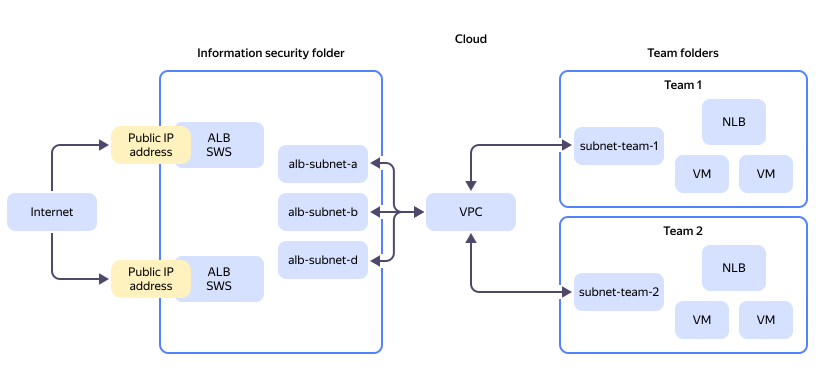
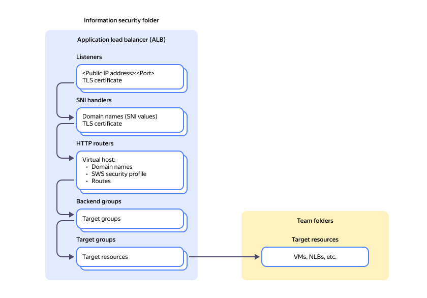

# Centralized online publication and DDoS protection of applications hosted in different folders 

This tutorial describes a use case involving multiple independent teams managing {{ yandex-cloud }} resources. The services and apps developed by these teams are published on the internet. {{ yandex-cloud }} uses folders to separate resources, ensuring that each team can only access its designated folder. Moreover, the information security (IS) regulations prohibit teams from directly publishing their folder resources to the internet.

To implement this approach, you can use such {{ yandex-cloud }} services as [{{ alb-full-name }}](../../application-load-balancer/) (ALB) and [{{ sws-full-name }}](../../smartwebsecurity/concepts/) (SWS).

{{ alb-name }} enables you to create [OSI](https://ru.wikipedia.org/wiki/Сетевая_модель_OSI) L7 load balancers to evenly distribute traffic across your services and applications and publish them online.

{{ sws-name }} protects your resources against L7 DDoS attacks and bots. You can additionally connect a [WAF](../../smartwebsecurity/concepts/waf.md) and limit the load on your resource using the [Advanced Rate Limiter](../../smartwebsecurity/concepts/arl.md) (ARL) module. To configure parameters for protecting your resources, you will need a {{ sws-name }} profile, which you then connect to the L7 load balancer.

To set up such a workflow, you need to do the following:

* Set up centralized online publication of services by using an L7 load balancer.
* Scan inbound traffic for information security threats by using {{ sws-name }}.
* Restrict team access to L7 load balancers and security profiles by placing L7 load balancers in a separate folder. Access to this folder must be restricted to a limited number of authorized personnel, e.g., IS employees.
* Establish network communication between L7 load balancers and team targets in different folders through [Multi-folder VPC](../../vpc/tutorials/multi-folder-vpc.md). L7 load balancers and team resources must reside in different subnets of the same VPC network.

## {{ yandex-cloud }} resource placement chart {#resource-allocation-scheme}

The chart displays the following resources:

* **ALB**: L7 load balancers created in {{ alb-name }} and used to publish services online.
* **SWS**: {{ sws-name }} to implement protection at the application layer (L7).
* **IS folder**: ALB L7 load balancer folder accessible only to IS employees.
* **VPC**: Cloud network hosting ALB and team subnets.
  * **alb-subnet-a**, **alb-subnet-b**, and **alb-subnet-d**: Subnets with ALB nodes.
  * **subnet-team-1** and **subnet-team-2**: Subnets with team resources.
* **Team folders**: Folders containing team targets, e.g., virtual machines (VMs), databases, [NLB](../../network-load-balancer/) L3-L4 load balancers, and more.

This tutorial assumes that you have already created targets for your services and placed them in different folders.
Therefore, consider the following:

* [Requirements and best practices for further resource configuration](#requirements-recommendations).
* [Configuring security and online publication for your services](#publish-services).

## Requirements and best practices for resource configuration {#requirements-recommendations}

### Network {#network-requirements}

* For network connectivity between L7 load balancers and team targets, use Multi-folder VPC to extend the scope of your VPC network from a single to multiple folders.
* Use [security groups](../../vpc/concepts/security-groups.md) to manage network access across resources of different teams:
  
    * Target security groups should allow inbound traffic from L7 load balancer subnets.
    * L7 load balancer security groups should allow inbound traffic to target subnets.

      For best practices for setting up security groups, see [{#T}](../../application-load-balancer/concepts/application-load-balancer.md#security-groups).

### L7 load balancers {#l7-balancer-requirements}

* Place all L7 load balancers in a single folder accessible exclusively to IS employees.
* Optionally, enable L3-L4 [DDoS protection](../../vpc/ddos-protection/). Proceed as follows:
    * [Reserve](../../vpc/operations/get-static-ip.md) a public static IP address with DDoS protection and use it for the L7 load balancer's listener.
    * [Configure]({{ link-console-support }}) a trigger threshold for the L3-L4 protection mechanisms, aligned with the amount of legitimate traffic to your services.
    * [Set the MTU](../../vpc/operations/adjust-mtu-ddos-protection.md) to `1450` on your targets.
* You cannot use different public IP addresses for the [listeners](../../application-load-balancer/concepts/application-load-balancer.md#listener) of a single L7 load balancer.
* Use different ports for the listeners of a single L7 load balancer.

    For HTTPS, you can use [SNI listeners](../../application-load-balancer/concepts/application-load-balancer.md#listener) with the same port. For the maximum number of SNI listeners, see the relevant [limits](../../application-load-balancer/concepts/limits.md).

* Optionally, to ensure fault tolerance, place L7 load balancers across various availability zones.
* Consider [subnet sizes](../../application-load-balancer/concepts/application-load-balancer.md#lcu-scaling-subnet-sizes) for L7 load balancer nodes.
* Set the minimum number of [resource units](../../application-load-balancer/concepts/application-load-balancer.md#lcu-scaling-settings) for the L7 load balancer in each zone based on [autoscaling](../../application-load-balancer/concepts/application-load-balancer.md#lcu-scaling)policies. The expected load on your services dictates the number of resource units, considering these parameters:
  * Number of requests per second (RPS)
  * Number of concurrent active connections
  * Number of new connections per second
  * Traffic processed per second
* In case of high load on the L7 load balancer, consider its [limits](../../application-load-balancer/concepts/limits.md). If you cannot scale the service using resources within a single load balancer, distribute it across multiple L7 load balancers.
* Assign a dedicated L7 load balancer to each service under high load.
* When publishing multiple services through a single ALB L7 load balancer, consider the relevant [SLA](https://yandex.ru/legal/cloud_sla_apploadbalancer).
* Note that external requests to web servers will originate from IP addresses within the internal IP range of the L7 load balancer subnets. IP addresses of request sources (users) will be included in the [X-Forwarded-For](https://en.wikipedia.org/wiki/X-Forwarded-For) (XFF) HTTP header. Therefore, to log user IP addresses from XFF on the target web servers, you may need to update the configuration.

### Targets {#target-resources-requirements}

* In the L7 load balancer target group, provide the IP addresses of your services from team folders to make available on the internet.
* These IP addresses must be within the [RFC 1918 private ranges](https://datatracker.ietf.org/doc/html/rfc1918#section-3).
* If the target internal IP address changes, manually update the L7 load balancer's target group configuration.

## Configuring secure online publication for your services {#publish-services}

To configure secure online publication for your services:

1. Create an IS [folder](../../resource-manager/concepts/resources-hierarchy.md#folder).
1. [Grant access](../../iam/concepts/access-control/index.md#how-do-i-perform-access-management) to the folder only to IS employees.
1. [Set up network connectivity](../../vpc/tutorials/multi-folder-vpc.md) between resources from different folders.
1. [Configure security groups](../../vpc/operations/security-group-create.md) by following [these best practices](#network-requirements).
1. [Reserve a public IP address](../../vpc/operations/get-static-ip.md) and enabe L3-L4 DDoS protection.
1. [Create a security profile](#create-sws-profile).
1. If using HTTPS, [add a TLS certificate](../../certificate-manager/quickstart/) to {{ certificate-manager-name }}.
1. [Create an L7 load balancer](#create-alb).
1. [Test the L7 load balancer](#check-alb).

The chart below shows the L7 load balancer resources you will create and configure in this use case.

### Creating a security profile {#create-sws-profile}



- Management console {#console}

  1. In the [management console]({{ link-console-main }}), select the [IS folder](../../resource-manager/concepts/resources-hierarchy.md#folder).
  1. From the list of services, select **{{ ui-key.yacloud.iam.folder.dashboard.label_smartwebsecurity }}**.
  1. Click **{{ ui-key.yacloud.smart-web-security.action_empty }}**.
  1. Select **{{ ui-key.yacloud.smart-web-security.title_default-template }}**.
  1. Enter `sws-ddos` for the profile name.
  1. In the **{{ ui-key.yacloud.smart-web-security.form.label_default-action }}** field, select `{{ ui-key.yacloud.smart-web-security.form.label_action-allow }}`.
  1. Under **{{ ui-key.yacloud.smart-web-security.form.section_security-rules }}**, next to the `sp-rule-1` rule, click  and select **{{ ui-key.yacloud.common.edit }}**.
  1. Enable **{{ ui-key.yacloud.smart-web-security.overview.column_dry-run-rule }} (dry run)**.

     This option is used for profile testing. In logging mode, traffic will not get blocked, and users will not be disconnected from your service because of a misconfigured profile. Review the profile performance and customize the [rules](../../smartwebsecurity/concepts/rules.md) to meet your service's requirements.

  1. Click **{{ ui-key.yacloud.common.save-changes }}**.
  1. Click **{{ ui-key.yacloud.common.create }}**.



For other ways to create a security profile, see [{#T}](../../container-registry/operations/authentication.md).

### Creating an L7 load balancer {#create-alb}



- Management console {#console}

  1. In the [management console]({{ link-console-main }}), select the IS folder.
  1. From the list of services, select **{{ ui-key.yacloud.iam.folder.dashboard.label_application-load-balancer }}**.
  1. Click **{{ ui-key.yacloud.alb.button_load-balancer-create }}** and select **{{ ui-key.yacloud.alb.label_alb-create-wizard }}**.



#### Configuring a target group {#settings-target-group}

Your application backends will be deployed on the VM instance of the [target group](../../application-load-balancer/concepts/target-group.md). The target group will be connected to the load balancer so that requests might be sent to the backend endpoints of your application.



- Management console {#console}

  1. Enter the target group name: `test-target-group`.
  1. Provide the internal IP address of your target, which is either your service's internal NLB listener address or the VM address.
  1. Select the subnet hosting your service resources.

     To select a subnet, you need the `vpc.user` role for the folder containing the subnet.

  1. Configure other targets. To do this, click **{{ ui-key.yacloud.alb.button_add-target }}** and specify addresses and subnets.
  1. Click **{{ ui-key.yacloud.alb.button_wizard-create-tg }}**.



#### Configuring a backend group {#settings-backend-group}

[Backend groups](../../application-load-balancer/concepts/backend-group.md) contain settings for traffic balancing and target health check. The wizard automatically creates one backend and one health check group. It will also select the group you created at the previous step as target group.



- Management console {#console}

  1. Enable **{{ ui-key.yacloud.alb.label_detailed-settings }}**.
  1. Enter the backend group name: `test-backend-group`.
  1. Leave `HTTP` as the group type.
  1. To ensure that requests from a single user session are handled by the same backend resource, enable **{{ ui-key.yacloud.alb.label_session-affinity }}**. If your target is an NLB internal load balancer, you do not have to enable session affinity.
   
  1. Under **{{ ui-key.yacloud_billing.alb.label_backends }}**:

     * Enter the backend name: `backend-1`.
     * Leave `Target group` as the backend type.
     * Leave the previously created target group, `test-target-group`.
     * Specify the TCP port of your service. It is usually `80` for HTTP and `443` for HTTPS.
     * If your target is a VM, make sure to set up a [health check](../../application-load-balancer/concepts/best-practices.md).
     * If your target is an NLB internal load balancer, disable the health check.
  
  1. Click **{{ ui-key.yacloud.alb.button_wizard-create-tg }}**.



#### Configuring an HTTP router {#settings-http-router}

[HTTP routers](../../application-load-balancer/concepts/http-router.md) define the rules for routing requests sent to backends and allow you to modify requests directly in the balancer. The wizard will automatically create a virtual host and routing rule. It will also select the group you created at the previous step as backend group.



- Management console {#console}

  1. Enter the router name: `test-http-router`.
  1. Enable **{{ ui-key.yacloud.alb.label_detailed-settings }}**.
  1. Under **{{ ui-key.yacloud.alb.label_virtual-hosts }}**, specify:
     * Host name: `test-virtual-host`.
     * **{{ ui-key.yacloud.alb.label_authority }}**: Your service domain name.
     * **{{ ui-key.yacloud.alb.label_security-profile-id }}**: Profile you created earlier.

        If you skip selecting the profile, {{ sws-name }} protection will not work.

  1. Specify these route parameters:
     * Route name: `test-route`.
     * **{{ ui-key.yacloud.alb.label_path }}**: **{{ ui-key.yacloud.alb.label_match-prefix }}** followed by `\`.
     * **{{ ui-key.yacloud.alb.label_route-action }}**: **{{ ui-key.yacloud.alb.label_route-action-route }}**.
     * **{{ ui-key.yacloud.alb.label_backend-group }}**: Leave the group you created earlier.
  1. Click **{{ ui-key.yacloud.alb.button_wizard-create-tg }}**.



#### Configuring an L7 load balancer {#create-load-balancer}

A [load balancer](../../application-load-balancer/concepts/application-load-balancer.md) receives requests and distributes them across target group VMs according to the rules set in the HTTP router. Load balancers use [listeners](../../application-load-balancer/concepts/application-load-balancer.md#listener) to receive traffic. The wizard will create a listener automatically. It will also select the router you created at the previous step as HTTP router.



- Management console {#console}

  1. Enter the load balancer name: `test-load-balancer`.
  1. Enable **{{ ui-key.yacloud.alb.label_detailed-settings }}**.
  1. Under **{{ ui-key.yacloud.mdb.forms.section_network-settings }}**, select the VPC network you created earlier.
  1. For **{{ ui-key.yacloud.alb.label_security-groups }}**, select **{{ ui-key.yacloud.component.security-group-field.label_sg-from-list }}** and then the previously created security group.
  1. Under **{{ ui-key.yacloud.alb.section_allocation-settings }}**, select subnets in the [availability zones](../../overview/concepts/geo-scope.md) you need and enable inbound traffic in those subnets.
  1. Configure the listener:
     * Enter the listener name: `test-listener`.
     * Under**{{ ui-key.yacloud.alb.section_external-address-specs }}**, enable a public IP address and specify the following:
        * **Port**: TCP port of your service. It is usually `443` for HTTPS and `80` for HTTP.
        * **Type**: Set it to `List` and select the previously reserved IP address.
     * Under **{{ ui-key.yacloud.alb.section_common-address-specs }}**, specify:
        * **Listener type**: `HTTP`.
        * **Protocol**: `HTTP` or `HTTPS`.
        * For HTTPS, select your service's TLS certificate you previously added in {{ certificate-manager-name }}.
        * **HTTP router**: Leave the router you created earlier. 
  
  1. Click **{{ ui-key.yacloud.common.create }}**.

  If your infrastructure already uses an L7 load balancer and a configured listener with a public IP address:

  1. In the [management console]({{ link-console-main }}), select **{{ ui-key.yacloud.iam.folder.dashboard.label_application-load-balancer }}**.
  1. Select your L7 load balancer.
  1. Under **Listeners**, next to the listener with a public IP address, click  and select **{{ ui-key.yacloud.common.edit }}**.
  1. Under **Receiving and processing traffic**, click **Add SNI match** and specify the following:
     * **Server names**: Your service's domain name. This field contains the SNI extension values that, when received from a client, will trigger the listener to establish a TLS connection.

        
        
        Some browsers reuse TLS connections with the same IP address if a connection certificate contains the necessary domain name. In this case, no new SNI match is set and traffic can potentially be routed to an inappropriate HTTP router. To avoid this, use different certificates for each SNI match and the main listener. To manage traffic across the domain names within a single certificate, set up virtual hosts in the HTTP router.

        

     * **Certificates**: Your service's TLS certificate previously added in {{ certificate-manager-name }}.
     * **HTTP router**: HTTP router you created earlier.



For other ways to create an L7 load balancer and more configuration options, see our [step-by-step guides](../../application-load-balancer/operations/).

### Testing an L7 load balancer {#check-alb}



- Management console {#console}

  1. In the [management console]({{ link-console-main }}), select the IS folder.
  1. From the list of services, select **{{ ui-key.yacloud.iam.folder.dashboard.label_application-load-balancer }}**.
  1. Select the created L7 load balancer.
  1. Select **{{ ui-key.yacloud.alb.label_healthchecks }}** on the left. 
   
     Make sure you get `HEALTHY` for all health checks of your backend group L7 load balancer.

  1. Select **{{ ui-key.yacloud.alb.label_map }}** on the left.
   
     Check the configuration for each resourse in this order: **Listener** > **HTTP router** > **Backend group** > **Target group**.


