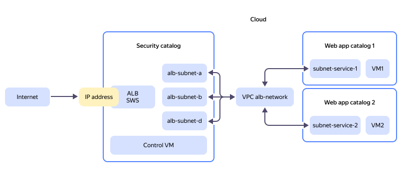

# Creating a distributed infrastructure with secure access

In this tutorial, you will create an infrastructure for secure access to web apps hosted in different {{ yandex-cloud }} folders. For traffic control purposes, all requests to your web applications will be forwarded to a single IP address and then checked by the [{{ sws-full-name }}](https://yandex.cloud/en/services/smartwebsecurity) profile rules.

This approach allows you to isolate resources used by different teams while also enforcing a common security policy for incoming traffic.

This tutorial explores a specific use case under [Centralized online publication and protection against DDoS attacks of applications hosted in different {{ yandex-cloud }} folders](../../smartwebsecurity/tutorials/different-folders-services.md), giving you an example of how to create the entire infrastructure from scratch.

The minimum [roles](../../iam/roles-reference.md) required for this tutorial are as follows:

* For a cloud:
    * `{{ roles-resource-manager-admin }}`: To create folders and assign roles.

* For folders:
    * `{{ roles-vpc-admin }}`: To create {{ vpc-full-name }} resources.
    * `smart-web-security.editor`: To create a security profile.
    * `compute.editor`: To create VM instances.
    * `{{ roles-alb-editor }}`: To create {{ alb-full-name }} resources.


## {{ yandex-cloud }} resource placement chart {#resource-allocation-scheme}



The chart displays the following resources:

* **IP address**: Public IP address or domain that receives requests to your web apps.
* **Security folder**, `secured-entry-point`: [Folder](../../resource-manager/concepts/resources-hierarchy.md#folder) accessible only to company resource administrators and information security employees. This folder will house the following resources:

    * **ALB**, `app-load-balancer`: [L7](../../application-load-balancer/concepts/application-load-balancer.md) {{ alb-full-name }} used to publish web apps online.
    * **SWS** profile, `sws-profile`: {{ sws-full-name }} [profile](../../smartwebsecurity/concepts/profiles.md) to implement traffic protection at the application layer (L7).
    * **Management VM**, `work-station`: {{ compute-full-name }} [VM instance](../../compute/concepts/vm.md) to initiate connections to the VMs in your web app folders.

* **VPC**, `alb-network`: {{ vpc-full-name }} [cloud network](../../vpc/concepts/network.md) to consolidate [subnets](../../vpc/concepts/network.md#subnet) across different folders:

    * **alb-subnet-a**, **alb-subnet-b**, and **alb-subnet-d**: Subnets with ALB nodes in three availability zones.
    * **subnet-service-1** and **subnet-service-2**: Subnets hosting your web app resources.

* **Web app folders**, `service-1` and `service-2`: Folders housing web app targets, `vm-service-1` and `vm-service-2`. These folders will be accessible to teams developing your web services.

To create the infrastructure and set up secure access to your web applications:

1. [Get your cloud ready](#prepare-cloud).
1. [Create a security folder](#create-alb-folder).
1. [Create a virtual network and subnets](#create-vpc).
1. [Create web app folders](#create-web-folders).
1. [Connect the web app folders to the load balancer's internal subnets](#connect-folders).
1. [Configure security groups](#setup-security-groups).
1. [Configure the security profile](#setup-sws).
1. [Create resources](#create-resources).
1. [Configure the load balancer](#setup-alb).
1. [Test your infrastructure](#check-infrastructure).

If you no longer need the resources you created, [delete them](#clear-out).


## Get your cloud ready {#prepare-cloud}




### Required paid resources {#paid-resources}

The infrastructure support cost includes:

* Fee for continuously running VMs (see [{{ compute-full-name }} pricing](../../compute/pricing.md)).
* Fee for using {{ alb-name }} (see [{{ alb-full-name }} pricing](../../application-load-balancer/pricing.md)).
* Fee for using public IP addresses and outgoing traffic (see [{{ vpc-full-name }} pricing](../../vpc/pricing.md)).
* Fee for the number of requests to {{ sws-name }} (see [{{ sws-full-name }} pricing](../../smartwebsecurity/pricing.md)).


## Create a security folder {#create-alb-folder}

The security folder will house your load balancer, cloud network, subnets, and security profile.


### Create a folder without a network {#folder-without-net}



- Management console {#console}

  1. In the [management console]({{ link-console-main }}), select a cloud and click  **{{ ui-key.yacloud.component.console-dashboard.button_action-create-folder }}**.
  1. Name your folder, e.g., `secured-entry-point`.
  1. In the **{{ ui-key.yacloud.iam.cloud.folders-create.field_optionally }}** field, disable **{{ ui-key.yacloud.iam.cloud.folders-create.field_default-net }}**. You will create a network and subnets in the next step.
  1. Click **{{ ui-key.yacloud.iam.cloud.folders-create.button_create }}**.




### Assign roles for the folder {#set-access-binding}

Provide your infrastructure and security administrators with access to the folder to manage your network, load balancer, and security profile.



- Management console {#console}

  1. In the [management console]({{ link-console-main }}), navigate to `secured-entry-point`.
  1. Navigate to the **{{ ui-key.yacloud.common.resource-acl.label_access-bindings }}** tab.
  1. Click **{{ ui-key.yacloud.common.resource-acl.button_configure-access }}**.
  1. In the window that opens, select **{{ ui-key.yacloud_components.acl.label.user-accounts }}**.
  1. Select a user from the list or use the user search option.
  1. Click  **{{ ui-key.yacloud_components.acl.button.add-role }}** and select the [role](../../iam/roles-reference.md) from the list or use the search bar. The minimum required roles are as follows:

      * `{{ roles-alb-editor }}`: To manage [{{ alb-name }}](../../application-load-balancer/) resources.
      * `{{ roles-vpc-user }}`: To connect to and use [{{ vpc-name }}](../../vpc/) network resources.
      * `smart-web-security.editor`: To use and manage [{{ sws-name }}](../../smartwebsecurity/) profiles.
      * `compute.editor`: To be able to create, update, and delete [{{ compute-name }}](../../compute/) instances.

  1. Click **{{ ui-key.yacloud_components.acl.action.apply }}**.




## Create a virtual network and subnets {#create-vpc}

In the security folder, create a network with subnets for your L7 load balancer and web app folders. This will ensure network connectivity between the load balancer and web app resources.



- Management console {#console}

  1. Go to the new folder, `secured-entry-point`.
  1. In the list of services, select **{{ ui-key.yacloud.iam.folder.dashboard.label_vpc }}**.
  1. At the top right, click **{{ ui-key.yacloud.vpc.networks.button_create }}**.
  1. In the **{{ ui-key.yacloud.vpc.networks.create.field_name }}** field, enter `alb-network`.
  1. In the **{{ ui-key.yacloud.vpc.networks.create.field_advanced }}** field, disable **{{ ui-key.yacloud.vpc.networks.create.field_is-default }}**.
  1. Click **{{ ui-key.yacloud.vpc.networks.button_create }}**.
  1. In the left-hand panel, select  **{{ ui-key.yacloud.vpc.switch_networks }}**.
  1. At the top right, click **{{ ui-key.yacloud.vpc.subnetworks.button_action-create }}** and specify the settings for the subnet to host the web app folder:

      1. **{{ ui-key.yacloud.vpc.subnetworks.create.field_name }}**: `subnet-service-1`.
      1. **{{ ui-key.yacloud.vpc.subnetworks.create.field_zone }}**: `{{ region-id }}-a`.
      1. **{{ ui-key.yacloud.vpc.subnetworks.create.field_network }}**: `alb-network`.
      1. **{{ ui-key.yacloud.vpc.subnetworks.create.field_ip }}**: `10.121.0.0/24`.
      1. Click **{{ ui-key.yacloud.vpc.subnetworks.create.button_create }}**.

  1. Repeat the steps to create a subnet named `subnet-service-2` in the `{{ region-id }}-b` availability zone with `10.122.0.0/24` as its IP address range.
  1. Create subnets for your L7 load balancer in different availability zones with the following address ranges:

      * `subnet-alb-a`: `{{ region-id }}-a` and `10.131.0.0/24`
      * `subnet-alb-b`: `{{ region-id }}-b` and `10.132.0.0/24`
      * `subnet-alb-d`: `{{ region-id }}-d` and `10.133.0.0/24`

   


## Create web app folders {#create-web-folders}

These folders will house resources of your web applications. In this tutorial, such resources include VM instances running your test web services. Create the folders and grant your users access permissions to connect to the network resources and manage the VMs.



- Management console {#console}

  1. Select a cloud and click  **{{ ui-key.yacloud.component.console-dashboard.button_action-create-folder }}**.
  1. Name your folder, e.g., `service-1`.
  1. In the **{{ ui-key.yacloud.iam.cloud.folders-create.field_optionally }}** field, disable **{{ ui-key.yacloud.iam.cloud.folders-create.field_default-net }}**.
  1. Click **{{ ui-key.yacloud.iam.cloud.folders-create.button_create }}**.
  1. Repeat these steps to create the `service-2` folder.
  1. To restrict access to the folders, [assign user roles](#set-access-binding) based on the resources you will host in each folder. The minimum required roles for `service-1` and `service-2` are as follows:

      * `vpc.user`: To connect to and use [{{ vpc-name }}](../../vpc/) network resources.
      * `compute.editor`: To be able to create, update, and delete VM instances.




## Connect the web app folders to the load balancer's internal subnets {#connect-folders}

To consolidate folder resources into a single network, [move](../../vpc/operations/subnet-move.md) the virtual network subnets to the web app folders.



- Management console {#console}

  1. In the [management console]({{ link-console-main }}), navigate to `secured-entry-point`.
  1. In the list of services, select **{{ ui-key.yacloud.iam.folder.dashboard.label_vpc }}**.
  1. Select the `alb-network` cloud network.
  1. Click  in the `subnet-service-1` row and select **{{ ui-key.yacloud.vpc.button_move-vpc-object }}**.
  1. Select `service-1` from the drop-sown list.
  1. Click **{{ ui-key.yacloud.vpc.button_move-vpc-object }}**.
  1. Similarly, move `subnet-service-2` to `service-2`.




## Configure security groups {#setup-security-groups}

With [security groups](../../vpc/concepts/security-groups.md), you can set up incoming and outgoing traffic rules. In this tutorial, a L7 load balancer receives incoming internet traffic and routes it over the internal network to your web app VMs. Follow [these best practices](../../application-load-balancer/concepts/application-load-balancer.md#security-groups) to configure security groups in each folder.


### Create security groups for your web app VMs {#sg-vm-apps}

The rules should allow outgoing and incoming traffic from the load balancer subnet.



- Management console {#console}

  1. In the [management console]({{ link-console-main }}), select `service-1`.
  1. In the list of services, select **{{ ui-key.yacloud.iam.folder.dashboard.label_vpc }}**.
  1. In the left-hand panel, select  **{{ ui-key.yacloud.vpc.label_security-groups }}**.
  1. At the top right, click **{{ ui-key.yacloud.vpc.network.security-groups.button_create }}**.
  1. In the **{{ ui-key.yacloud.vpc.network.security-groups.forms.field_sg-name }}** field, specify `service-1-security-group`.
  1. In the **{{ ui-key.yacloud.vpc.network.security-groups.forms.field_sg-network }}** field, select `alb-network` from the `secured-entry-point` folder.
  1. Under **{{ ui-key.yacloud.vpc.network.security-groups.forms.label_section-rules }}**, create the following rules using the instructions below the table:

      | Traffic<br/>direction | {{ ui-key.yacloud.vpc.network.security-groups.forms.field_sg-rule-description }} | {{ ui-key.yacloud.vpc.network.security-groups.forms.field_sg-rule-port-range }} | {{ ui-key.yacloud.vpc.network.security-groups.forms.field_sg-rule-protocol }} | Source /<br/>destination | {{ ui-key.yacloud.vpc.network.security-groups.forms.field_sg-rule-cidr-blocks }} |
      | --- | --- | --- | --- | --- | --- |
      | `Ingress` | `http` | `8000` | `{{ ui-key.yacloud.common.label_tcp }}` | `{{ ui-key.yacloud.vpc.network.security-groups.forms.value_sg-rule-destination-cidr }}` | `10.131.0.0/24`<br/>`10.132.0.0/24`<br/>`10.133.0.0/24` |
      | `Ingress` | `ssh` | `22` | `{{ ui-key.yacloud.common.label_tcp }}` | `{{ ui-key.yacloud.vpc.network.security-groups.forms.value_sg-rule-destination-cidr }}` | `10.133.0.0/24` |
      | `Egress` | `any` | `0-65535` | `{{ ui-key.yacloud.vpc.network.security-groups.forms.value_any }}` | `{{ ui-key.yacloud.vpc.network.security-groups.forms.value_sg-rule-destination-cidr }}` | `10.131.0.0/24`<br/>`10.132.0.0/24`<br/>`10.133.0.0/24` |

      

  1. Click **{{ ui-key.yacloud.common.create }}**.
  1. Repeat these steps to create `service-2-security-group` in the `service-2` folder.




### Create a security group for the L7 load balancer {#sg-balancer}

The rules should allow incoming internet traffic on port `80` as well as traffic for load balancer node health checks on port `30080` with the `{{ ui-key.yacloud.vpc.network.security-groups.forms.value_sg-rule-sg-type-balancer }}` source.



- Management console {#console}

  1. In the [management console]({{ link-console-main }}), select `secured-entry-point`.
  1. In the list of services, select **{{ ui-key.yacloud.iam.folder.dashboard.label_vpc }}**.
  1. In the left-hand panel, select  **{{ ui-key.yacloud.vpc.label_security-groups }}**.
  1. At the top right, click **{{ ui-key.yacloud.vpc.network.security-groups.button_create }}**.
  1. In the **{{ ui-key.yacloud.vpc.network.security-groups.forms.field_sg-name }}** field, specify `alb-security-group`.
  1. In the **{{ ui-key.yacloud.vpc.network.security-groups.forms.field_sg-network }}** field, select `alb-network`.
  1. Under **{{ ui-key.yacloud.vpc.network.security-groups.forms.label_section-rules }}**, create the following rules using the instructions below the table:

      | Traffic<br/>direction | {{ ui-key.yacloud.vpc.network.security-groups.forms.field_sg-rule-description }} | {{ ui-key.yacloud.vpc.network.security-groups.forms.field_sg-rule-port-range }} | {{ ui-key.yacloud.vpc.network.security-groups.forms.field_sg-rule-protocol }} | Source /<br/>destination | {{ ui-key.yacloud.vpc.network.security-groups.forms.field_sg-rule-cidr-blocks }} |
      | --- | --- | --- | --- | --- | --- |
      | `Ingress` | `http` | `80` | `{{ ui-key.yacloud.common.label_tcp }}` | `{{ ui-key.yacloud.vpc.network.security-groups.forms.value_sg-rule-destination-cidr }}` | `0.0.0.0/0` |
      | `Inbound` | `healthchecks` | `30080` | `{{ ui-key.yacloud.common.label_tcp }}` | `{{ ui-key.yacloud.vpc.network.security-groups.forms.value_sg-rule-sg-type-balancer }}` | — |
      | `Egress` | `http` | `8000` | `{{ ui-key.yacloud.vpc.network.security-groups.forms.value_any }}` | `{{ ui-key.yacloud.vpc.network.security-groups.forms.value_sg-rule-destination-cidr }}` | `10.121.0.0/24`<br/>`10.122.0.0/24` |

      

  1. Click **{{ ui-key.yacloud.common.create }}**.




### Create security groups for the management VM {#sg-vm}

The rules should allow outgoing traffic from the management VM to port `22` on your web app VM.



- Management console {#console}

  1. In the [management console]({{ link-console-main }}), select `secured-entry-point`.
  1. In the list of services, select **{{ ui-key.yacloud.iam.folder.dashboard.label_vpc }}**.
  1. In the left-hand panel, select  **{{ ui-key.yacloud.vpc.label_security-groups }}**.
  1. At the top right, click **{{ ui-key.yacloud.vpc.network.security-groups.button_create }}**.
  1. In the **{{ ui-key.yacloud.vpc.network.security-groups.forms.field_sg-name }}** field, specify `vm-security-group`.
  1. In the **{{ ui-key.yacloud.vpc.network.security-groups.forms.field_sg-network }}** field, select `alb-network`.
  1. Under **{{ ui-key.yacloud.vpc.network.security-groups.forms.label_section-rules }}**, create the following rules using the instructions below the table:

      | Traffic<br/>direction | {{ ui-key.yacloud.vpc.network.security-groups.forms.field_sg-rule-description }} | {{ ui-key.yacloud.vpc.network.security-groups.forms.field_sg-rule-port-range }} | {{ ui-key.yacloud.vpc.network.security-groups.forms.field_sg-rule-protocol }} | Source /<br/>destination | {{ ui-key.yacloud.vpc.network.security-groups.forms.field_sg-rule-cidr-blocks }} |
      | --- | --- | --- | --- | --- | --- |
      | `Ingress` | `ssh` | `22` | `{{ ui-key.yacloud.common.label_tcp }}` | `{{ ui-key.yacloud.vpc.network.security-groups.forms.value_sg-rule-destination-cidr }}` | `0.0.0.0/0` ^*^ |
      | `Egress` | `ssh` | `22` | `{{ ui-key.yacloud.common.label_tcp }}` | `{{ ui-key.yacloud.vpc.network.security-groups.forms.value_sg-rule-destination-cidr }}` | `10.121.0.0/24`<br/>`10.122.0.0/24` |

      ^*^ We recommend replacing `0.0.0.0/0` with CIDRs of the public IP addresses from which you want to allow connections to your management VM.

      

  1. Click **{{ ui-key.yacloud.common.create }}**.




## Configure the security profile {#setup-sws}

A security profile contains traffic filtering [rules](../../smartwebsecurity/concepts/rules.md) for protecion against cybersecurity threats at OSI application layer (L7).

Create a security profile using a preset template:



- Management console {#console}

  1. In the [management console]({{ link-console-main }}), select `secured-entry-point`.
  1. In the list of services, select **{{ ui-key.yacloud.iam.folder.dashboard.label_smartwebsecurity }}**.
  1. In the left-hand panel, select  **{{ ui-key.yacloud.smart-web-security.title_profiles }}** and click **{{ ui-key.yacloud.smart-web-security.action_empty }}**.
  1. Select **{{ ui-key.yacloud.smart-web-security.title_default-template }}**.
  1. Enter `sws-profile` as the profile name.
  1. In the **{{ ui-key.yacloud.smart-web-security.form.label_default-action }}** field, select `{{ ui-key.yacloud.smart-web-security.form.label_action-allow }}`.
  1. Click **{{ ui-key.yacloud.smart-web-security.action_empty }}**.




## Create resources {#create-resources}

Here, by resources we mean VM instances, one per folder. The VM residing in the `secured-entry-point` security folder will be used to access your web application VMs over the internal network. In this tutorial, we refer to it as the _management VM_.

To restrict external traffic, web app VMs will not have external IP addresses.


### Create the VM to manage your web applications {#vm-secured-entry-point}



- Management console {#console}

  1. In the [management console]({{ link-console-main }}), select `secured-entry-point`.
  1. In the list of services, select **{{ ui-key.yacloud.iam.folder.dashboard.label_compute }}**.
  1. In the left-hand panel, select  **{{ ui-key.yacloud.compute.group.switch_instances }}**.
  1. Click **{{ ui-key.yacloud.compute.instances.button_create }}**.
  1. Under **{{ ui-key.yacloud.compute.instances.create.section_image }}**, select [Ubuntu 24.04](/marketplace/products/yc/ubuntu-2404-lts-oslogin).
  1. Under **{{ ui-key.yacloud.k8s.node-groups.create.section_allocation-policy }}**, select the `{{ region-id }}-d` availability zone.
  1. Under **{{ ui-key.yacloud.compute.instances.create.section_network }}**:

      * In the **{{ ui-key.yacloud.component.compute.network-select.field_subnetwork }}** field, make sure to select `subnet-alb-d`.
      * In the **{{ ui-key.yacloud.component.compute.network-select.field_external }}** field, leave `{{ ui-key.yacloud.component.compute.network-select.switch_auto }}`.
      * In the **{{ ui-key.yacloud.compute.instances.create.field_security-groups }}** field, select `vm-security-group`.

  1. Under **{{ ui-key.yacloud.compute.instances.create.section_access }}**, select **{{ ui-key.yacloud.compute.instance.access-method.label_oslogin-control-ssh-option-title }}**.
  1. Enter the VM user name in the **{{ ui-key.yacloud.compute.instances.create.field_user }}** field, Do not use `root`, `admin`, or any other usernames reserved for the OS purposes.
  1. In the **{{ ui-key.yacloud.compute.instances.create.field_key }}** field, select the SSH key saved in your [organization user](../../organization/concepts/membership.md) profile.

      To add a new key, do the following:

      1. Click **{{ ui-key.yacloud.compute.instances.create.button_add-ssh-key }}**.
      1. Enter a name for the SSH key.
      1. Select one of the following:

          * `{{ ui-key.yacloud_components.ssh-key-add-dialog.value_radio-manual }}`: Paste the contents of the public SSH key. You need to [create](../../compute/operations/vm-connect/ssh.md#creating-ssh-keys) an SSH key pair on your own.
          * `{{ ui-key.yacloud_components.ssh-key-add-dialog.value_radio-upload }}`: Upload the public part of the SSH key. You need to create an SSH key pair on your own.
          * `{{ ui-key.yacloud_components.ssh-key-add-dialog.value_radio-generate }}`: Automatically create an SSH key pair.

      1. Click **{{ ui-key.yacloud.common.add }}**.

  1. Under **{{ ui-key.yacloud.compute.instances.create.section_base }}**, specify the VM name: `work-station`.
  1. Click **{{ ui-key.yacloud.compute.instances.create.button_create }}**.




### Create VMs for your web applications {#vm-web-app}

Repeat the above steps to create VMs in the `service-1` and `service-2` folders, configured as follows:

* Select the `{{ region-id }}-a` and `{{ region-id }}-b` availability zones, respectively.
* Select `subnet-service-1` and `subnet-service-2` as the subnets for your VMs, respectively.
* In the **{{ ui-key.yacloud.component.compute.network-select.field_external }}** field, select `{{ ui-key.yacloud.component.compute.network-select.switch_none }}`.
* In the **{{ ui-key.yacloud.compute.instances.create.field_security-groups }}** field, select `service-1-security-group` and `service-2-security-group`.
* Specify the VM names, `vm-service-1` and `vm-service-2`.


## Configure the load balancer {#setup-alb}

To create and configure the load balancer, use the [wizard](../../application-load-balancer/concepts/index.md#alb-wizard).



You can only use the wizard to create and add resources from a single folder, i.e., one [target group](../../application-load-balancer/concepts/target-group.md) and one [backend group](../../application-load-balancer/concepts/backend-group.md). You will need to manually add resources from the second folder.




### Start the wizard {#start-wizard}



- Management console {#console}

  1. In the [management console]({{ link-console-main }}), select `secured-entry-point`.
  1. In the list of services, select **{{ ui-key.yacloud.iam.folder.dashboard.label_application-load-balancer }}**.
  1. Click **{{ ui-key.yacloud.alb.button_load-balancer-create }}** and select **{{ ui-key.yacloud.alb.label_alb-create-wizard }}**. The wizard will take you to the target group creation page.




### Configure a target group {#setup-target-group}

Target groups include VMs created in the web app folders. These groups will be connected to your load balancer over the internal subnets.

Create a target group for the `service-1` folder:



- Management console {#console}

  1. Specify the target group name: `target-group-1`.
  1. The list of targets will only include the IP address of your management VM. Add a new target to the list of resources:

      1. Below the list of resources, in the section with the **{{ ui-key.yacloud.alb.button_add-target }}** button, specify the `vm-service-1` internal IP address.
      1. Also, select `subnet-service-1` from the drop-down list with the `Not selected` placeholder. To find the subnet, check `All folders`.
      1. Click **{{ ui-key.yacloud.alb.button_add-target }}**.
      1. Activate your new target in the list of resources.
      1. Make sure the management VM resource is deactivated.

  1. Click **{{ ui-key.yacloud.alb.button_wizard-create-tg }}**. The wizard will take you to the backend group creation page.




### Configure backend groups {#settings-backend-group}

Backend groups contain settings for traffic balancing and target [health checks](../../application-load-balancer/concepts/best-practices.md). The wizard will automatically create one backend and one health check group. It will also use the group you created earlier as the target group.



- Management console {#console}

  1. Enable **{{ ui-key.yacloud.alb.label_detailed-settings }}**.
  1. Specify the backend group name: `backend-group-1`.
  1. Leave `HTTP` as the group type.
  1. To ensure the same backend resource handles requests from a single user session, activate **{{ ui-key.yacloud.alb.label_session-affinity }}**.
  1. Under **{{ ui-key.yacloud_billing.alb.label_backends }}**:

      * Specify the backend name: `backend-1`.
      * Leave `Target group` as the backend type.
      * Leave the target group you created earlier, `target-group-1`.
      * Specify your service's TCP port you opened in `service-1-security-group`. In this tutorial, this is port `8000`.

  1. Under **HTTP health check**:

      * Specify the same port as above, i.e., `8000`.
      * Do not change the **{{ ui-key.yacloud_billing.alb.label_path }}** value as the test service does not have a dedicated endpoint for health checks.

  1. Click **{{ ui-key.yacloud.alb.button_wizard-create-tg }}**. The wizard will take you to the HTTP router setup page.




### Configure an HTTP router {#settings-http-router}

[HTTP routers](../../application-load-balancer/concepts/http-router.md) implement rules for client-to-backend traffic and allow you to modify requests at the load balancer layer. The wizard will automatically create a virtual host and a routing rule. It will also use the group you created earlier as the backend group.



- Management console {#console}

  1. Specify the router name: `alb-http-router`.
  1. Enable **{{ ui-key.yacloud.alb.label_detailed-settings }}**.
  1. Under **{{ ui-key.yacloud.alb.label_virtual-hosts }}**:

      * In the **{{ ui-key.yacloud.common.name }}** field, enter `alb-virtual-host`.
      * Leave the **{{ ui-key.yacloud.alb.label_authority }}** field blank.
      * In the **{{ ui-key.yacloud.alb.label_security-profile-id }}** field, select the profile you created previously, `sws-profile`.

  1. Specify these route properties:

      * Route name: `app-1`.
      * **{{ ui-key.yacloud.alb.label_path }}**: **{{ ui-key.yacloud.alb.label_match-prefix }}** followed by `/app1`.
      * **{{ ui-key.yacloud.alb.label_route-action }}**: `{{ ui-key.yacloud.alb.label_route-action-route }}`.
      * **{{ ui-key.yacloud.alb.label_backend-group }}**: Leave the group you created earlier.
      * **{{ ui-key.yacloud.alb.label_prefix-rewrite }}**: Specify the `/` path.

  1. Click **{{ ui-key.yacloud.alb.button_wizard-create-tg }}**. The wizard will take you to the load balancer setup page.




### Configure an L7 load balancer {#create-load-balancer}

A load balancer distributes incoming requests across target group VMs according to the rules specified in the HTTP router. Load balancers use [listeners](../../application-load-balancer/concepts/application-load-balancer.md#listener) to receive traffic. The wizard will create a listener automatically. It will also use the router you created earlier as the HTTP router in this configuration.



- Management console {#console}

  1. Specify the load balancer name: `app-load-balancer`.
  1. Enable **{{ ui-key.yacloud.alb.label_detailed-settings }}**.
  1. Under **{{ ui-key.yacloud.mdb.forms.section_network-settings }}**, select the network you created earlier, i.e., `alb-network`.
  1. For **{{ ui-key.yacloud.alb.label_security-groups }}**, select **{{ ui-key.yacloud.component.security-group-field.label_sg-from-list }}** and then the security group associated with the `alb-security-group` load balancer.
  1. Under **{{ ui-key.yacloud.alb.section_allocation-settings }}**, select the subnets you created previously, i.e., `subnet-alb-a`, `subnet-alb-b`, and `subnet-alb-d`, in their respective [availability zones](../../overview/concepts/geo-scope.md) and enable incoming traffic in those subnets.
  1. Configure the listener:

      * Specify the listener name: `alb-listener`.
      * Under **{{ ui-key.yacloud.alb.section_common-address-specs }}**, specify:

          * **{{ ui-key.yacloud_billing.alb.label_listener-type }}**: `HTTP`.
          * **{{ ui-key.yacloud.alb.label_protocol }}**: `HTTP`.
          * **{{ ui-key.yacloud.alb.label_http-router }}**: Select the router you created earlier.

  1. Click **{{ ui-key.yacloud.common.create }}**.




### Add resources from the second folder {#add-second-folder}

When creating a load balancer using the wizard, you can add resources only from one folder. This means you need to manually create and add the target group and backend group from the `service-2` folder.



- Management console {#console}

  1. In the [management console]({{ link-console-main }}), select `secured-entry-point`.
  1. In the list of services, select **{{ ui-key.yacloud.iam.folder.dashboard.label_application-load-balancer }}**.
  1. In the left-hand panel, select  **{{ ui-key.yacloud.alb.label_target-groups }}**.
  1. Click **{{ ui-key.yacloud.alb.button_target-group-create }}**.
  1. Repeat the steps you followed to [create a target group for the `service-1` folder](#setup-target-group) and create the `service-2` target group. Configure the target as follows:

      * Name: `target-group-2`.
      * VM internal IP address: `vm-service-2`.
      * Subnet: `subnet-service-2`.

  1. In the left-hand panel, select  **{{ ui-key.yacloud.alb.label_backend-groups }}**.
  1. Click **{{ ui-key.yacloud.alb.button_backend-group-create }}**.
  1. Create a backend group by repeating the steps you followed to [create a backend group for the `service-1` folder](#settings-backend-group). Configure the backend as follows:

      * Backend group name: `backend-group-2`.
      * Backend name: `backend-2`.
      * Target group: `target-group-2`.
      * Path: Use the same path as for `backend-group-1`.
      * Port: Specify your service's TCP port opened in `service-2-security-group`. In this tutorial, this is port `8000`.

  1. In the left-hand panel, select  **{{ ui-key.yacloud.alb.label_http-routers }}**.
  1. Select `alb-http-router` as the HTTP router.
  1. Under **{{ ui-key.yacloud.alb.label_virtual-hosts }}**, to the right of `alb-virtual-host`, click  →  **{{ ui-key.yacloud.common.edit }}**.
  1. At the bottom of the window that opens, click **{{ ui-key.yacloud.alb.button_add-route }}**.
  1. Configure the route as follows:

      * Route name: `app-2`.
      * **{{ ui-key.yacloud.alb.label_path }}**: **{{ ui-key.yacloud.alb.label_match-prefix }}** followed by `/app2`.
      * **{{ ui-key.yacloud.alb.label_route-action }}**: `{{ ui-key.yacloud.alb.label_route-action-route }}`.
      * **{{ ui-key.yacloud.alb.label_backend-group }}**: `backend-group-2`.
      * **{{ ui-key.yacloud.alb.label_prefix-rewrite }}**: Specify the `/` path.
      * **{{ ui-key.yacloud.alb.label_timeout }}**: Clear the value and leave the field empty.

  1. Click **{{ ui-key.yacloud.common.save }}**.



## Test your infrastructure {#check-infrastructure}

1. [Run test web services on your web app VMs](#run-web-services).
1. [Review the health check details](#check-healthchecking).
1. [Check availability of your web applications](#check-accessibility).
1. [Test the security profile](#check-security-profile).

### Run test web services on your web app VMs {#run-web-services}

1. Connect to the `work-station` management VM in the security folder:

    ```bash
    ssh -l <username> <VM_public_IP_address>
    ```

    If using different keys for different VMs, specify the path to the relevant key in the connection command, as in this example:

    ```bash
    ssh -i ~/.ssh/<key_name> -l <username> <VM_public_IP_address>
    ```

    Where:

    * `<key_name>`: Name of the private SSH key file used to create the VM.
    * `<username>`: Username specified when creating the VM.
    * `<VM_public_IP_address>`: VM IP address.

    

    You can copy the VM connection command from the VM description page under **{{ ui-key.yacloud.compute.instances.create.section_access }}**.

    

1. Connect to `vm-service-1` from your management VM:

    1. Place the private SSH key file of `vm-service-1` in the `~/.ssh` folder of your management VM.
    1. Connect to `vm-service-1`:

        ```bash
        ssh -i ~/.ssh/<key_name> -l <username> <VM_internal_IP_address>
        ```

        Where:

        * `<key_name>`: Name of the private SSH key file used to create the VM.
        * `<username>`: Username specified when creating the VM.
        * `<VM_internal_IP_address>`: `vm-service-1` internal IP address.

1. Start the test web service by running this command:

    ```bash
    mkdir test-server; \
    echo 'HELLO!' > test-server/hello_3.txt; \
    echo 'TEST SERVER 1' > test-server/test_3.txt; \
    python3 -m http.server -d test-server 8000
    ```

    Running this command will:

    * Create a `test-server` folder containing two files, `hello_1.txt` and `test_1.txt`.
    * Start the built-in Python web service on port `8000`.

    Result:

    ```text
    Serving HTTP on 0.0.0.0 port 8000 (http://0.0.0.0:8000/) ...
    10.133.0.10 - - [30/May/2025 09:55:41] "GET / HTTP/1.1" 200 -
    10.133.0.15 - - [30/May/2025 09:55:41] "GET / HTTP/1.1" 200 -
    10.133.0.10 - - [30/May/2025 09:55:42] "GET / HTTP/1.1" 200 -
    10.133.0.15 - - [30/May/2025 09:55:42] "GET / HTTP/1.1" 200 -
    10.133.0.10 - - [30/May/2025 09:55:43] "GET / HTTP/1.1" 200 -
    10.133.0.15 - - [30/May/2025 09:55:43] "GET / HTTP/1.1" 200 -
    ...
    ```

1. Open a new terminal window and repeat the above steps to start the test service on `vm-service-2`. Use different file names in the startup command so that your web applications’ responses vary.


### Review the health check details {#check-healthchecking}

1. Go to the `app-load-balancer` page.
1. Select  **{{ ui-key.yacloud.alb.label_healthchecks }}** on the left.
1. Make sure the targets have the `HEALTHY` status in all load balancer subnets.


### Check availability of your web applications {#check-accessibility}

To check the availability of your web applications, go to the following address in your browser:

```text
http://<load_balancer_public_IP_address>/<route_prefix>
```

Where:

* `<load_balancer_public_IP_address>`: `app-load-balancer` IP address.
* `<route_prefix>`: Prefix specified in the **{{ ui-key.yacloud.alb.label_match-prefix }}** field when configuring the HTTP router. In this tutorial, these are `app1` and `app2`.

A page will open, listing root folder files for the specified application, as in this example:

  ```text
  Directory listing for /
    hello_1.txt
    test_1.txt
  ```


### Test the security profile {#check-security-profile}

1. Check that the `Smart Protection` rule allows traffic:

    1. In the browser, go to:

        ```text
        http://<load_balancer_public_IP_address>/<route_prefix>
        ```

    1. In another browser tab, go to the `app-load-balancer` page.
    1. Select  **{{ ui-key.yacloud.common.logs }}** on the left.
    1. In the **{{ ui-key.yacloud.logging.label_filter-query }}** field, specify the [filter expression](../../logging/concepts/filter.md):

        ```text
        json_payload.smartwebsecurity.matched_rule.rule_type = SMART_PROTECTION
        and json_payload.smartwebsecurity.matched_rule.verdict = ALLOW
        ```

    1. Click **{{ ui-key.yacloud.logging.button_execute }}**.

        The log list will contain entries about successful GET requests.

1. Add a basic deny rule:

    1. Go to the `sws-profile` page.
    1. Under **{{ ui-key.yacloud.smart-web-security.form.section_security-rules }}**, click  **{{ ui-key.yacloud.smart-web-security.arl.label_add-rule }}**.
    1. Enter the rule name, `deny-rule`.
    1. Set **{{ ui-key.yacloud.smart-web-security.overview.column_priority }}** to `1000`.
    1. Under **{{ ui-key.yacloud.smart-web-security.label_search-rule-type }}**, keep the **{{ ui-key.yacloud.smart-web-security.overview.label_base-rule }}** value.
    1. Leave **{{ ui-key.yacloud.smart-web-security.overview.column_action-type }}** set to **{{ ui-key.yacloud.smart-web-security.overview.cell_sec-action-deny }}**.
    1. Set **Traffic** to `On condition`.
    1. Then select the following values:

        * **{{ ui-key.yacloud.smart-web-security.overview.column_rule-conditions }}**: `IP`.
        * **Conditions for IP**: `Matches or falls within the range`.
        * **IP matches or falls within the range**: Specify the IP address of the device you are using to test the web service.

    1. Click **{{ ui-key.yacloud.common.add }}**.

1. Test the basic rule:

    1. In the browser, go to:

        ```text
        http://<load_balancer_public_IP_address>/<route_prefix>
        ```

    1. In another browser tab, go to the `app-load-balancer` page.
    1. Select  **{{ ui-key.yacloud.common.logs }}** on the left.
    1. In the **{{ ui-key.yacloud.logging.label_filter-query }}** field, specify the filter expression:

        ```text
        json_payload.smartwebsecurity.matched_rule.rule_type = RULE_CONDITION
        and json_payload.smartwebsecurity.matched_rule.verdict = DENY
        ```

    1. Click **{{ ui-key.yacloud.logging.button_execute }}**.

        The log list will contain entries about GET requests blocked by the rule.


## How to delete the resources you created {#clear-out}

To stop paying for the resources, [delete](../../resource-manager/operations/folder/delete.md) the folders where your infrastructure was deployed.

If you deployed the infrastructure in the existing folders, do the following:

1. [Delete](../../application-load-balancer/operations/application-load-balancer-delete.md) the `app-load-balancer` L7 load balancer.
1. [Delete](../../application-load-balancer/operations/http-router-delete.md) the HTTP router named `alb-http-router`.
1. [Delete](../../application-load-balancer/operations/backend-group-delete.md) the `backend-group-1` and `backend-group-2` backend groups.
1. [Delete](../../application-load-balancer/operations/target-group-delete.md) the `target-group-1` and `target-group-2` target groups.
1. [Delete](../../compute/operations/vm-control/vm-delete.md) the VMs:

    * `work-station`
    * `vm-service-1`
    * `vm-service-2`

1. [Delete](../../smartwebsecurity/operations/profile-delete.md) the `sws-profile` security profile.
1. [Delete](../../vpc/operations/security-group-delete.md) the security groups:

    * `alb-security-group`
    * `vm-security-group`
    * `service-1-security-group`
    * `service-2-security-group`

1. [Delete](../../vpc/operations/subnet-delete.md) the subnets:

    * `subnet-service-1`
    * `subnet-service-2`
    * `subnet-alb-a`
    * `subnet-alb-b`
    * `subnet-alb-d`

1. [Delete](../../vpc/operations/network-delete.md) the `alb-network` cloud network.